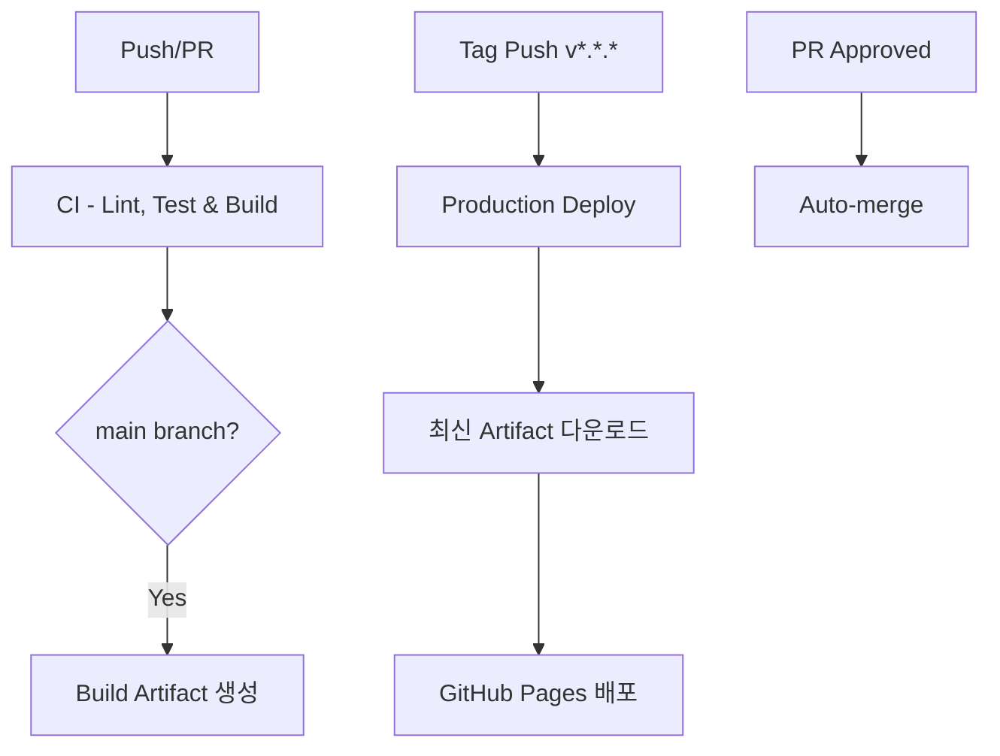

# 🚀 CI/CD 가이드

이 문서는 ThakiCloud 블로그의 새로운 통합 CI/CD 파이프라인에 대한 가이드입니다.

## 📋 목차

- [워크플로우 개요](#워크플로우-개요)
- [각 워크플로우 상세](#각-워크플로우-상세)
- [개발 워크플로우](#개발-워크플로우)
- [배포 프로세스](#배포-프로세스)
- [브랜치 보호 규칙](#브랜치-보호-규칙)
- [문제 해결](#문제-해결)

## 🔄 워크플로우 개요

### 📊 통합 CI/CD 파이프라인 (3단계)



| 워크플로우 | 파일명 | 트리거 | 목적 |
|------------|--------|--------|------|
| **CI** | `ci.yml` | Push/PR | 코드 검증 + 빌드 |
| **Production Deploy** | `production-deploy.yml` | Tag 생성 | 운영 배포 |
| **Auto-merge** | `auto-merge.yml` | PR 승인 | 자동 머지 |

## 📝 각 워크플로우 상세

### 1. CI - Lint, Test & Build (`.github/workflows/ci.yml`)

모든 코드 변경에 대한 검증과 빌드를 수행하는 통합 워크플로우입니다.

#### 🎯 트리거 조건
- **Push**: 모든 브랜치 (hotfix/* 제외)
- **Pull Request**: main, develop 브랜치 대상 (hotfix/* 제외)
- **Manual**: workflow_dispatch

#### 🔄 실행 단계 (병렬 처리)

| 단계 | 설명 | 실행 조건 |
|------|------|-----------|
| **🧹 Lint & Test** | Jekyll 설정 검증, 개발 빌드 테스트 | 모든 실행 |
| **📝 Markdown Lint** | Markdown 파일 문법 검사 | 모든 실행 |
| **📄 YAML Lint** | YAML 파일 문법 검사 | 모든 실행 |
| **🏗️ Build & Package** | 프로덕션 빌드 + 아티팩트 생성 | main 브랜치만 |

#### 📦 아티팩트 생성
- **이름**: `jekyll-site-{실행번호}`
- **보관 기간**: 30일
- **포함 내용**: 빌드된 사이트 + 빌드 정보

### 2. Production Deploy (`.github/workflows/production-deploy.yml`)

태그 기반 운영 배포를 처리합니다.

#### 🎯 트리거 조건
- **Tag Push**: `v*.*.*` 패턴 (예: v1.2.3)
- **Manual**: workflow_dispatch (태그 입력)

#### 🚀 배포 프로세스
1. **📦 Get Build Artifact**: 최신 성공 빌드 아티팩트 검색
2. **🚀 Deploy to Production**: GitHub Pages 배포

### 3. Auto-merge (`.github/workflows/auto-merge.yml`)

승인된 PR의 자동 머지를 처리합니다.

#### 🤖 동작 조건
- PR이 승인(approved) 상태일 때
- Squash merge 방식 사용
- `auto-merge` 라벨 자동 추가

## 👩‍💻 개발 워크플로우

### 🆕 새 포스트/기능 개발

```bash
# 1. 새 브랜치 생성
git checkout -b posts/new-article-title
# 또는
git checkout -b feature/new-feature

# 2. 작업 수행
# - 포스트 작성 또는 기능 개발
# - 로컬 테스트: bundle exec jekyll serve

# 3. 커밋 및 푸시
git add .
git commit -m "Add new article about AI"
git push origin posts/new-article-title
```

**→ 자동으로 CI 워크플로우 실행 (Lint, Test)**

### 📋 Pull Request 생성

```bash
# GitHub에서 PR 생성
# - 적절한 제목과 설명 작성
# - 리뷰어 지정
# - 라벨 추가
```

**→ 자동으로 CI 워크플로우 재실행**

### ✅ 승인 및 머지

1. **리뷰어 승인** → Auto-merge 워크플로우 실행
2. **main 브랜치 머지** → CI 워크플로우에서 빌드 아티팩트 생성

## 🚀 배포 프로세스

### 📦 운영 배포

```bash
# 1. 태그 생성 및 푸시
git checkout main
git pull origin main
git tag v1.2.3
git push origin v1.2.3
```

**→ 자동으로 Production Deploy 워크플로우 실행**

### 🔧 수동 배포

1. GitHub Actions 탭 이동
2. "Production Deploy" 워크플로우 선택
3. "Run workflow" 클릭
4. 배포할 태그 입력 (예: v1.2.3)

## 🔒 브랜치 보호 규칙

### GitHub Repository Settings → Branches → main

권장 설정:

```yaml
보호 규칙:
  - Require a pull request before merging: ✅
    - Require approvals: 1
    - Dismiss stale PR approvals: ✅
  - Require status checks to pass: ✅
    - Require up-to-date branches: ✅
    - Required checks:
      - 🧹 Lint & Test
      - 📝 Markdown Lint  
      - 📄 YAML Lint
  - Require linear history: ✅
  - Include administrators: ✅
```

## 🎯 Jekyll 포스트 작성 규칙

### 📝 파일명 규칙
```
_posts/category/YYYY-MM-DD-title.md
```

### 🏷️ Front Matter 필수 항목
```yaml
---
title: "포스트 제목"
excerpt: "요약된 일부 내용"
date: YYYY-MM-DD
categories: 
  - dev  # dev, llmops, owm, tutorials, news, research, datasets, careers, culture
  - subcategory
tags: 
  - tag1
  - tag2
author_profile: true
toc: true
toc_label: "목차"
---
```

### 📋 Markdown 스타일 가이드
- 본문은 `##`, `###` 헤딩 사용 (`#` 금지)
- 인라인 코드: \`code\`
- 코드 블록: 언어명 명시
- 목록: `-` 사용, 2칸 들여쓰기
- 외부 링크: 전체 URL 작성

## 🛠️ 문제 해결

### 🚨 CI 실패 대응

#### Jekyll Build 실패
```bash
# 로컬 테스트
bundle exec jekyll build --verbose --trace

# 의존성 문제
bundle update
```

#### Markdown Lint 실패
```bash
# 로컬 린트 실행
npx markdownlint '_posts/**/*.md' --config .markdownlint.json

# 자동 수정
npx markdownlint '_posts/**/*.md' --config .markdownlint.json --fix
```

#### YAML Lint 실패
```bash
# 로컬 YAML 검사
pip install yamllint
yamllint -d relaxed .
```

### 🚀 배포 실패 대응

#### "No successful build found" 오류
```bash
# main 브랜치에 성공적인 CI 빌드가 필요
git checkout main
git push origin main  # CI 워크플로우 트리거
```

#### GitHub Pages 배포 실패
1. Repository Settings → Pages 설정 확인
2. GitHub Actions 권한 확인
3. 배포 로그에서 구체적 오류 확인

### 🔧 로컬 개발 환경

```bash
# 1. 의존성 설치
bundle install

# 2. 로컬 서버 실행
bundle exec jekyll serve

# 3. 드래프트 포함 실행
bundle exec jekyll serve --drafts

# 4. 빌드만 실행
bundle exec jekyll build
```

## 📊 모니터링 및 추적

### 📈 빌드 정보 확인
- `_site/build-info.txt`: 빌드 날짜, 커밋, 실행 번호
- `_site/deploy-info.txt`: 배포 날짜, 태그, 커밋

### 🔍 로그 확인
1. **GitHub Actions 탭**에서 워크플로우 실행 결과 확인
2. **실패한 단계 클릭**하여 상세 로그 확인
3. **아티팩트 다운로드**하여 빌드 결과 검토

### 📱 알림 설정
GitHub Settings → Notifications:
- Actions 워크플로우 실패 알림
- PR 상태 변경 알림
- 보안 업데이트 알림

## 🚨 응급 상황 대응

### 긴급 수정 (hotfix)
```bash
# hotfix 브랜치는 자동화에서 제외됨
git checkout -b hotfix/critical-fix
# 수정 작업
git push origin hotfix/critical-fix

# 수동으로 워크플로우 실행 필요
```

### CI 시스템 장애 시
```bash
# 임시로 CI 건너뛰기 (비권장)
git commit -m "hotfix: critical fix [skip ci]"
```

## 📚 개선사항

### ✅ 통합의 이점
- **효율성**: 5개 → 3개 워크플로우로 단순화
- **속도**: 병렬 처리로 실행 시간 단축
- **유지보수**: 중복 제거로 관리 부담 감소
- **명확성**: 각 워크플로우의 역할이 명확

### 🔄 향후 개선 계획
- 캐싱 최적화 (Ruby gems, Node.js)
- 조건부 실행 (변경된 파일 기준)
- 성능 모니터링 강화
- 보안 스캔 추가

---

**📞 문의사항이 있으시면 GitHub Issues를 생성해 주세요!** 