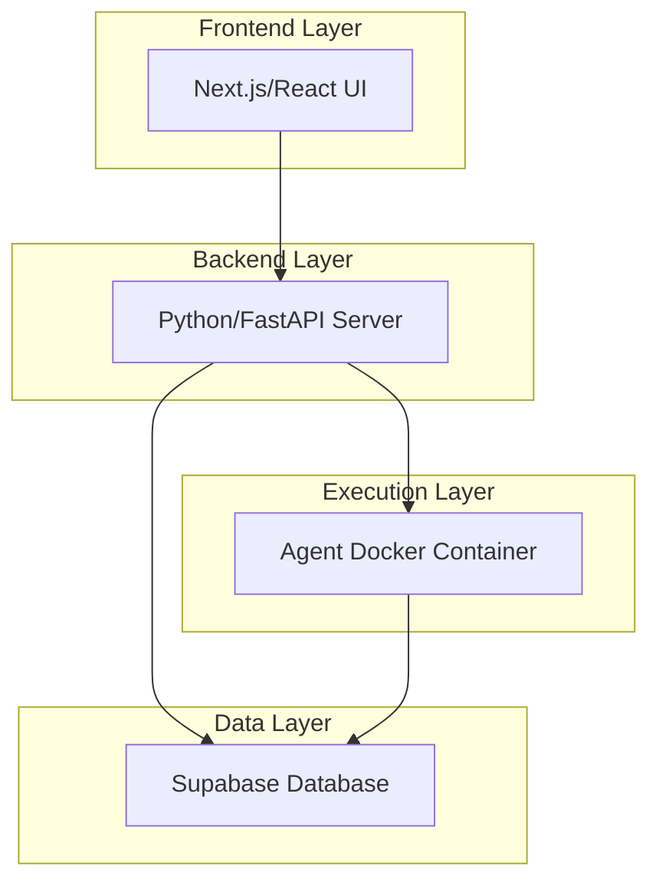

## 개요

[Suna](https://github.com/kortix-ai/suna)는 Kortix AI에서 개발한 **오픈소스 범용 AI 에이전트**로, 실제 업무를 대신 수행하는 디지털 동반자입니다. **14.9k 스타**와 **2.2k 포크**를 기록하며 오픈소스 AI 에이전트 생태계에서 주목받고 있는 프로젝트입니다. 자연어 대화를 통해 복잡한 연구, 데이터 분석, 일상적인 과제를 해결하며, 강력한 브라우저 자동화와 직관적인 인터페이스를 결합하여 실질적인 결과를 제공합니다.

### 🎯 Suna의 핵심 특징

- **브라우저 자동화**: 웹 탐색 및 데이터 추출
- **파일 관리**: 문서 생성 및 편집
- **웹 크롤링**: 확장된 검색 기능
- **시스템 작업**: 명령줄 실행
- **웹사이트 배포**: 자동화된 배포 프로세스
- **API 통합**: 다양한 서비스와의 연동

## 1. 아키텍처 이해

### 1.1 시스템 구성 요소

Suna는 4개의 주요 컴포넌트로 구성됩니다:



### 1.2 컴포넌트 상세 분석

| 컴포넌트 | 기술 스택 | 주요 역할 |
| --- | --- | --- |
| **Backend API** | Python/FastAPI | REST 엔드포인트, 스레드 관리, LLM 통합 |
| **Frontend** | Next.js/React | 반응형 UI, 채팅 인터페이스, 대시보드 |
| **Agent Docker** | Docker | 격리된 실행 환경, 보안 기능 |
| **Supabase DB** | PostgreSQL | 데이터 지속성, 인증, 실시간 구독 |

## 2. 설치 및 설정

### 2.1 시스템 요구사항

```bash
# 필수 소프트웨어
- Docker & Docker Compose
- Python 3.9+
- Node.js 18+
- Git

# 최소 하드웨어 스펙
- CPU: 2 cores
- RAM: 4GB
- Storage: 10GB
```

### 2.2 Quick Start 설치

```bash
# 1. 저장소 클론
git clone https://github.com/kortix-ai/suna.git
cd suna

# 2. 설정 마법사 실행
python setup.py

# 3. 컨테이너 시작
python start.py
```

### 2.3 설정 마법사 가이드

설정 마법사는 다음 단계를 자동화합니다:

**1단계: 환경 변수 설정**

```bash
# .env 파일 생성
SUPABASE_URL=your_supabase_url
SUPABASE_ANON_KEY=your_anon_key
REDIS_URL=redis://localhost:6379
ANTHROPIC_API_KEY=your_anthropic_key
OPENAI_API_KEY=your_openai_key
```

**2단계: Supabase 프로젝트 설정**

```sql
-- 사용자 테이블
CREATE TABLE users (
  id UUID PRIMARY KEY DEFAULT gen_random_uuid(),
  email TEXT UNIQUE NOT NULL,
  created_at TIMESTAMP DEFAULT NOW()
);

-- 대화 테이블  
CREATE TABLE conversations (
  id UUID PRIMARY KEY DEFAULT gen_random_uuid(),
  user_id UUID REFERENCES users(id),
  title TEXT,
  created_at TIMESTAMP DEFAULT NOW()
);

-- 메시지 테이블
CREATE TABLE messages (
  id UUID PRIMARY KEY DEFAULT gen_random_uuid(),
  conversation_id UUID REFERENCES conversations(id),
  content TEXT,
  role TEXT CHECK (role IN ('user', 'assistant')),
  created_at TIMESTAMP DEFAULT NOW()
);
```

**3단계: Docker 컨테이너 구성**

```yaml
# docker-compose.yaml
version: '3.8'
services:
  backend:
    build: ./backend
    ports:
      - "8000:8000"
    environment:
      - SUPABASE_URL=${SUPABASE_URL}
      - REDIS_URL=${REDIS_URL}
    volumes:
      - ./backend:/app
  
  frontend:
    build: ./frontend
    ports:
      - "3000:3000"
    environment:
      - NEXT_PUBLIC_BACKEND_URL=http://localhost:8000
  
  redis:
    image: redis:alpine
    ports:
      - "6379:6379"
```

## 3. 핵심 기능 활용

### 3.1 브라우저 자동화

Suna는 Playwright를 활용한 강력한 브라우저 자동화를 제공합니다:

```python
# backend/agents/browser_agent.py
from playwright.async_api import async_playwright

class BrowserAgent:
    def __init__(self):
        self.playwright = None
        self.browser = None
        self.page = None
    
    async def start_browser(self, headless=True):
        """브라우저 시작"""
        self.playwright = await async_playwright().start()
        self.browser = await self.playwright.chromium.launch(
            headless=headless,
            args=['--no-sandbox', '--disable-dev-shm-usage']
        )
        self.page = await self.browser.new_page()
        
        # User-Agent 설정
        await self.page.set_user_agent(
            'Mozilla/5.0 (Macintosh; Intel Mac OS X 10_15_7) AppleWebKit/537.36'
        )
    
    async def navigate_and_extract(self, url, selectors):
        """페이지 탐색 및 데이터 추출"""
        await self.page.goto(url, wait_until='networkidle')
        
        results = {}
        for key, selector in selectors.items():
            try:
                element = await self.page.wait_for_selector(selector, timeout=5000)
                results[key] = await element.inner_text()
            except:
                results[key] = None
        
        return results
    
    async def take_screenshot(self, path):
        """스크린샷 촬영"""
        await self.page.screenshot(path=path, full_page=True)
```

### 3.2 파일 관리 시스템

```python
# backend/agents/file_agent.py
import os
import shutil
from pathlib import Path

class FileAgent:
    def __init__(self, workspace_dir="/tmp/suna_workspace"):
        self.workspace_dir = Path(workspace_dir)
        self.workspace_dir.mkdir(exist_ok=True)
    
    def create_document(self, filename, content, doc_type="txt"):
        """문서 생성"""
        file_path = self.workspace_dir / f"{filename}.{doc_type}"
        
        if doc_type == "md":
            with open(file_path, 'w', encoding='utf-8') as f:
                f.write(content)
        elif doc_type == "pdf":
            # PDF 생성 로직
            self._create_pdf(file_path, content)
        
        return str(file_path)
    
    def read_file(self, file_path):
        """파일 읽기"""
        try:
            with open(file_path, 'r', encoding='utf-8') as f:
                return f.read()
        except Exception as e:
            return f"파일 읽기 실패: {e}"
    
    def organize_files(self, pattern="*"):
        """파일 정리"""
        files = list(self.workspace_dir.glob(pattern))
        
        # 파일 타입별 디렉토리 생성
        for file in files:
            file_type = file.suffix[1:] if file.suffix else "unknown"
            type_dir = self.workspace_dir / file_type
            type_dir.mkdir(exist_ok=True)
            
            # 파일 이동
            shutil.move(str(file), str(type_dir / file.name))
```

### 3.3 API 통합

```python
# backend/integrations/api_manager.py
import httpx
from typing import Dict, Any

class APIManager:
    def __init__(self):
        self.session = httpx.AsyncClient()
        self.api_keys = {
            'tavily': os.getenv('TAVILY_API_KEY'),
            'firecrawl': os.getenv('FIRECRAWL_API_KEY'),
            'rapidapi': os.getenv('RAPIDAPI_KEY')
        }
    
    async def search_web(self, query: str, max_results: int = 10):
        """Tavily 웹 검색"""
        url = "https://api.tavily.com/search"
        payload = {
            "api_key": self.api_keys['tavily'],
            "query": query,
            "max_results": max_results,
            "search_depth": "advanced"
        }
        
        response = await self.session.post(url, json=payload)
        return response.json()
    
    async def crawl_website(self, url: str):
        """Firecrawl 웹 크롤링"""
        headers = {
            'Authorization': f'Bearer {self.api_keys["firecrawl"]}',
            'Content-Type': 'application/json'
        }
        
        payload = {
            "url": url,
            "formats": ["markdown", "html"],
            "extract": {
                "schema": {
                    "type": "object", 
                    "properties": {
                        "title": {"type": "string"},
                        "content": {"type": "string"},
                        "links": {"type": "array"}
                    }
                }
            }
        }
        
        response = await self.session.post(
            "https://api.firecrawl.dev/v1/scrape",
            headers=headers,
            json=payload
        )
        return response.json()
```

## 4. 실제 사용 사례

### 4.1 경쟁사 분석 자동화

```python
# examples/competitor_analysis.py
async def analyze_competitors(industry, location, agent):
    """경쟁사 분석 워크플로우"""
    
    # 1. 시장 조사
    search_query = f"{industry} companies {location} market leaders"
    search_results = await agent.api_manager.search_web(search_query, max_results=20)
    
    # 2. 각 회사 웹사이트 분석
    competitors = []
    for result in search_results['results'][:10]:
        company_data = await agent.api_manager.crawl_website(result['url'])
        
        # 3. 브라우저 자동화로 추가 정보 수집
        selectors = {
            'about': 'section[class*="about"], .about-section',
            'services': '.services, .products',
            'contact': '.contact, footer'
        }
        
        browser_data = await agent.browser.navigate_and_extract(
            result['url'], selectors
        )
        
        competitors.append({
            'name': company_data.get('title', 'Unknown'),
            'url': result['url'],
            'description': company_data.get('content', '')[:500],
            'strengths': browser_data.get('services', 'N/A'),
            'contact_info': browser_data.get('contact', 'N/A')
        })
    
    # 4. PDF 보고서 생성
    report_content = generate_competitor_report(competitors, industry, location)
    report_path = agent.file_agent.create_document(
        f"competitor_analysis_{industry}_{location}", 
        report_content, 
        "pdf"
    )
    
    return report_path, competitors

def generate_competitor_report(competitors, industry, location):
    """경쟁사 분석 보고서 생성"""
    report = f"""
# {industry} 업계 경쟁사 분석 보고서
**지역**: {location}
**분석 일자**: {datetime.now().strftime('%Y-%m-%d')}

## 주요 경쟁사 현황

"""
    
    for i, comp in enumerate(competitors, 1):
        report += f"""
### {i}. {comp['name']}

**웹사이트**: {comp['url']}

**개요**: {comp['description']}

**주요 서비스**: {comp['strengths']}

**연락처**: {comp['contact_info']}

---
"""
    
    # 시장 분석 요약
    report += f"""
## 시장 분석 요약

**총 분석 기업 수**: {len(competitors)}개

**주요 트렌드**:
- 디지털 전환 가속화
- 고객 경험 중심의 서비스 제공
- 데이터 기반 의사결정 강화

**기회 요소**:
- 틈새 시장 진입 기회
- 혁신적 기술 도입을 통한 차별화
- 파트너십을 통한 시장 확대
"""
    
    return report
```

### 4.2 LinkedIn 인재 검색

```python
# examples/linkedin_recruitment.py
async def find_candidates(position, location, requirements, agent):
    """LinkedIn 인재 검색 자동화"""
    
    # LinkedIn 검색 URL 구성
    search_url = f"https://www.linkedin.com/search/people/?keywords={position}&location={location}"
    
    await agent.browser.start_browser(headless=False)  # LinkedIn은 로그인 필요
    await agent.browser.page.goto(search_url)
    
    # 로그인 프롬프트 (실제 구현시 OAuth 또는 API 사용 권장)
    print("LinkedIn에 로그인하고 Enter를 누르세요...")
    input()
    
    # 검색 결과 수집
    candidates = []
    
    # 프로필 선택자
    profile_selectors = {
        'name': '.entity-result__title-text a span[aria-hidden="true"]',
        'title': '.entity-result__primary-subtitle',
        'location': '.entity-result__secondary-subtitle',
        'experience': '.entity-result__summary'
    }
    
    # 페이지별 데이터 수집
    for page in range(3):  # 3페이지까지 검색
        await agent.browser.page.wait_for_selector('.entity-result__item')
        
        profiles = await agent.browser.page.query_selector_all('.entity-result__item')
        
        for profile in profiles[:5]:  # 페이지당 5명씩
            candidate_data = {}
            
            for key, selector in profile_selectors.items():
                try:
                    element = await profile.query_selector(selector)
                    if element:
                        candidate_data[key] = await element.inner_text()
                    else:
                        candidate_data[key] = "N/A"
                except:
                    candidate_data[key] = "N/A"
            
            # 요구사항 필터링
            if meets_requirements(candidate_data, requirements):
                candidates.append(candidate_data)
        
        # 다음 페이지로
        try:
            next_button = await agent.browser.page.query_selector('[aria-label="Next"]')
            if next_button:
                await next_button.click()
                await agent.browser.page.wait_for_load_state('networkidle')
        except:
            break
    
    # 결과 보고서 생성
    report = generate_candidate_report(candidates, position, location)
    report_path = agent.file_agent.create_document(
        f"candidates_{position}_{location}", report, "md"
    )
    
    return candidates, report_path

def meets_requirements(candidate, requirements):
    """후보자가 요구사항을 충족하는지 확인"""
    title = candidate.get('title', '').lower()
    experience = candidate.get('experience', '').lower()
    
    # 간단한 키워드 매칭 (실제로는 더 정교한 NLP 사용)
    for req in requirements:
        if req.lower() in title or req.lower() in experience:
            return True
    return False
```

### 4.3 SEO 분석 자동화

```python
# examples/seo_analysis.py
async def analyze_seo(website_url, agent):
    """SEO 분석 자동화"""
    
    # 1. 웹사이트 크롤링
    site_data = await agent.api_manager.crawl_website(website_url)
    
    # 2. 브라우저로 추가 SEO 요소 분석
    await agent.browser.start_browser()
    await agent.browser.page.goto(website_url)
    
    seo_elements = await extract_seo_elements(agent.browser.page)
    
    # 3. 페이지 속도 분석
    performance_metrics = await analyze_page_speed(agent.browser.page)
    
    # 4. 키워드 분석
    content = site_data.get('content', '')
    keyword_analysis = analyze_keywords(content)
    
    # 5. 경쟁사 키워드 분석
    competitor_keywords = await analyze_competitor_keywords(website_url, agent)
    
    # 6. SEO 보고서 생성
    seo_report = {
        'url': website_url,
        'seo_elements': seo_elements,
        'performance': performance_metrics,
        'keywords': keyword_analysis,
        'competitors': competitor_keywords,
        'recommendations': generate_seo_recommendations(seo_elements, keyword_analysis)
    }
    
    # 7. 상세 보고서 생성
    report_content = generate_seo_report(seo_report)
    report_path = agent.file_agent.create_document(
        f"seo_analysis_{website_url.replace('https://', '').replace('/', '_')}", 
        report_content, 
        "md"
    )
    
    return seo_report, report_path

async def extract_seo_elements(page):
    """SEO 요소 추출"""
    seo_data = {}
    
    # 메타 태그
    try:
        title = await page.title()
        seo_data['title'] = title
        seo_data['title_length'] = len(title)
    except:
        seo_data['title'] = None
    
    # 메타 디스크립션
    try:
        meta_desc = await page.get_attribute('meta[name="description"]', 'content')
        seo_data['meta_description'] = meta_desc
        seo_data['meta_desc_length'] = len(meta_desc) if meta_desc else 0
    except:
        seo_data['meta_description'] = None
    
    # 헤딩 태그
    headings = {}
    for i in range(1, 7):
        try:
            h_tags = await page.query_selector_all(f'h{i}')
            headings[f'h{i}'] = [await tag.inner_text() for tag in h_tags]
        except:
            headings[f'h{i}'] = []
    
    seo_data['headings'] = headings
    
    # 이미지 alt 텍스트
    try:
        images = await page.query_selector_all('img')
        images_without_alt = 0
        total_images = len(images)
        
        for img in images:
            alt = await img.get_attribute('alt')
            if not alt:
                images_without_alt += 1
        
        seo_data['images'] = {
            'total': total_images,
            'without_alt': images_without_alt,
            'alt_coverage': (total_images - images_without_alt) / total_images * 100 if total_images > 0 else 0
        }
    except:
        seo_data['images'] = {'total': 0, 'without_alt': 0, 'alt_coverage': 0}
    
    return seo_data

def analyze_keywords(content):
    """키워드 분석"""
    import re
    from collections import Counter
    
    # 텍스트 정제
    text = re.sub(r'<[^>]+>', '', content.lower())
    words = re.findall(r'\b[a-zA-Z가-힣]{3,}\b', text)
    
    # 불용어 제거 (간단한 예시)
    stop_words = {'the', 'a', 'an', 'and', 'or', 'but', 'in', 'on', 'at', 'to', 'for', 'of', 'with', 'by'}
    words = [word for word in words if word not in stop_words]
    
    # 키워드 빈도 분석
    keyword_freq = Counter(words)
    
    return {
        'top_keywords': keyword_freq.most_common(20),
        'total_words': len(words),
        'unique_words': len(set(words))
    }
```

## 5. 고급 설정 및 최적화

### 5.1 성능 최적화

```python
# backend/core/optimization.py
import asyncio
from functools import wraps
import redis
import json

class PerformanceOptimizer:
    def __init__(self):
        self.redis_client = redis.Redis.from_url(os.getenv('REDIS_URL'))
        self.cache_ttl = 3600  # 1시간
    
    def cache_result(self, cache_key_prefix):
        """결과 캐싱 데코레이터"""
        def decorator(func):
            @wraps(func)
            async def wrapper(*args, **kwargs):
                # 캐시 키 생성
                cache_key = f"{cache_key_prefix}:{hash(str(args) + str(kwargs))}"
                
                # 캐시에서 확인
                cached_result = self.redis_client.get(cache_key)
                if cached_result:
                    return json.loads(cached_result)
                
                # 실행 및 캐싱
                result = await func(*args, **kwargs)
                self.redis_client.setex(
                    cache_key, 
                    self.cache_ttl, 
                    json.dumps(result, default=str)
                )
                
                return result
            return wrapper
        return decorator
    
    async def batch_process(self, tasks, batch_size=5):
        """배치 처리"""
        results = []
        for i in range(0, len(tasks), batch_size):
            batch = tasks[i:i+batch_size]
            batch_results = await asyncio.gather(*batch, return_exceptions=True)
            results.extend(batch_results)
        return results
```

### 5.2 보안 강화

```python
# backend/core/security.py
import hashlib
import secrets
from cryptography.fernet import Fernet

class SecurityManager:
    def __init__(self):
        self.encryption_key = Fernet.generate_key()
        self.cipher_suite = Fernet(self.encryption_key)
    
    def encrypt_sensitive_data(self, data):
        """민감한 데이터 암호화"""
        return self.cipher_suite.encrypt(data.encode()).decode()
    
    def decrypt_sensitive_data(self, encrypted_data):
        """암호화된 데이터 복호화"""
        return self.cipher_suite.decrypt(encrypted_data.encode()).decode()
    
    def generate_api_key(self):
        """API 키 생성"""
        return secrets.token_urlsafe(32)
    
    def hash_password(self, password):
        """비밀번호 해싱"""
        salt = secrets.token_hex(16)
        password_hash = hashlib.pbkdf2_hmac('sha256', password.encode(), salt.encode(), 100000)
        return f"{salt}${password_hash.hex()}"
    
    def verify_password(self, password, hashed):
        """비밀번호 검증"""
        salt, stored_hash = hashed.split('$')
        password_hash = hashlib.pbkdf2_hmac('sha256', password.encode(), salt.encode(), 100000)
        return password_hash.hex() == stored_hash
```

### 5.3 모니터링 및 로깅

```python
# backend/core/monitoring.py
import logging
import time
from functools import wraps

class MonitoringSystem:
    def __init__(self):
        self.setup_logging()
        self.metrics = {}
    
    def setup_logging(self):
        """로깅 설정"""
        logging.basicConfig(
            level=logging.INFO,
            format='%(asctime)s - %(name)s - %(levelname)s - %(message)s',
            handlers=[
                logging.FileHandler('suna.log'),
                logging.StreamHandler()
            ]
        )
        self.logger = logging.getLogger('suna')
    
    def track_execution_time(self, func_name):
        """실행 시간 추적 데코레이터"""
        def decorator(func):
            @wraps(func)
            async def wrapper(*args, **kwargs):
                start_time = time.time()
                try:
                    result = await func(*args, **kwargs)
                    execution_time = time.time() - start_time
                    
                    self.metrics[func_name] = {
                        'last_execution_time': execution_time,
                        'total_executions': self.metrics.get(func_name, {}).get('total_executions', 0) + 1
                    }
                    
                    self.logger.info(f"{func_name} executed in {execution_time:.2f}s")
                    return result
                    
                except Exception as e:
                    self.logger.error(f"Error in {func_name}: {str(e)}")
                    raise
                    
            return wrapper
        return decorator
    
    def log_user_action(self, user_id, action, details=None):
        """사용자 액션 로깅"""
        self.logger.info(f"User {user_id} performed {action}: {details or ''}")
    
    def get_system_metrics(self):
        """시스템 메트릭 조회"""
        return {
            'execution_metrics': self.metrics,
            'timestamp': time.time()
        }
```

## 6. 프로덕션 배포

### 6.1 Docker 프로덕션 설정

```yaml
# docker-compose.prod.yaml
version: '3.8'

services:
  backend:
    build: 
      context: ./backend
      dockerfile: Dockerfile.prod
    environment:
      - NODE_ENV=production
      - SUPABASE_URL=${SUPABASE_URL}
      - SUPABASE_ANON_KEY=${SUPABASE_ANON_KEY}
      - REDIS_URL=${REDIS_URL}
    networks:
      - suna-network
    restart: unless-stopped
    
  frontend:
    build:
      context: ./frontend
      dockerfile: Dockerfile.prod
    environment:
      - NODE_ENV=production
      - NEXT_PUBLIC_BACKEND_URL=${BACKEND_URL}
    networks:
      - suna-network
    restart: unless-stopped
    
  nginx:
    image: nginx:alpine
    ports:
      - "80:80"
      - "443:443"
    volumes:
      - ./nginx.conf:/etc/nginx/nginx.conf
      - ./ssl:/etc/nginx/ssl
    depends_on:
      - backend
      - frontend
    networks:
      - suna-network
    restart: unless-stopped
    
  redis:
    image: redis:alpine
    command: redis-server --appendonly yes
    volumes:
      - redis_data:/data
    networks:
      - suna-network
    restart: unless-stopped

networks:
  suna-network:
    driver: bridge

volumes:
  redis_data:
```

### 6.2 Nginx 설정

```nginx
# nginx.conf
events {
    worker_connections 1024;
}

http {
    upstream backend {
        server backend:8000;
    }
    
    upstream frontend {
        server frontend:3000;
    }
    
    server {
        listen 80;
        server_name your-domain.com;
        return 301 https://$server_name$request_uri;
    }
    
    server {
        listen 443 ssl;
        server_name your-domain.com;
        
        ssl_certificate /etc/nginx/ssl/cert.pem;
        ssl_certificate_key /etc/nginx/ssl/key.pem;
        
        location /api/ {
            proxy_pass http://backend;
            proxy_set_header Host $host;
            proxy_set_header X-Real-IP $remote_addr;
            proxy_set_header X-Forwarded-For $proxy_add_x_forwarded_for;
            proxy_set_header X-Forwarded-Proto $scheme;
        }
        
        location / {
            proxy_pass http://frontend;
            proxy_set_header Host $host;
            proxy_set_header X-Real-IP $remote_addr;
            proxy_set_header X-Forwarded-For $proxy_add_x_forwarded_for;
            proxy_set_header X-Forwarded-Proto $scheme;
        }
    }
}
```

### 6.3 CI/CD 파이프라인

```yaml
# .github/workflows/deploy.yml
name: Deploy Suna

on:
  push:
    branches: [main]
  pull_request:
    branches: [main]

jobs:
  test:
    runs-on: ubuntu-latest
    
    steps:
    - uses: actions/checkout@v3
    
    - name: Set up Python
      uses: actions/setup-python@v4
      with:
        python-version: '3.9'
    
    - name: Install dependencies
      run: |
        cd backend
        pip install -r requirements.txt
    
    - name: Run tests
      run: |
        cd backend
        pytest tests/
    
    - name: Set up Node.js
      uses: actions/setup-node@v3
      with:
        node-version: '18'
    
    - name: Install and test frontend
      run: |
        cd frontend
        npm ci
        npm run test
        npm run build

  deploy:
    needs: test
    runs-on: ubuntu-latest
    if: github.ref == 'refs/heads/main'
    
    steps:
    - uses: actions/checkout@v3
    
    - name: Deploy to server
      uses: appleboy/ssh-action@v0.1.5
      with:
        host: ${{ secrets.HOST }}
        username: ${{ secrets.USERNAME }}
        key: ${{ secrets.PRIVATE_KEY }}
        script: |
          cd /opt/suna
          git pull origin main
          docker-compose -f docker-compose.prod.yaml down
          docker-compose -f docker-compose.prod.yaml build
          docker-compose -f docker-compose.prod.yaml up -d
```

## 7. 트러블슈팅 및 FAQ

### 7.1 일반적인 문제들

**문제 1: Docker 컨테이너 시작 실패**

```bash
# 해결 방법
docker-compose down
docker system prune -a
docker-compose up --build
```

**문제 2: Supabase 연결 실패**

```bash
# 환경 변수 확인
echo $SUPABASE_URL
echo $SUPABASE_ANON_KEY

# 연결 테스트
curl -H "apikey: $SUPABASE_ANON_KEY" $SUPABASE_URL/rest/v1/
```

**문제 3: 브라우저 자동화 실패**

```python
# 더 안정적인 브라우저 설정
browser = await playwright.chromium.launch(
    headless=True,
    args=[
        '--no-sandbox',
        '--disable-dev-shm-usage',
        '--disable-gpu',
        '--disable-background-timer-throttling',
        '--disable-backgrounding-occluded-windows',
        '--disable-renderer-backgrounding'
    ]
)
```

### 7.2 성능 최적화 팁

```python
# 1. 비동기 처리 최적화
import asyncio

async def optimize_concurrent_tasks():
    """동시 작업 최적화"""
    semaphore = asyncio.Semaphore(5)  # 최대 5개 동시 실행
    
    async def limited_task(task):
        async with semaphore:
            return await task()
    
    tasks = [limited_task(task) for task in task_list]
    return await asyncio.gather(*tasks)

# 2. 메모리 사용량 모니터링
import psutil

def monitor_memory():
    """메모리 사용량 모니터링"""
    process = psutil.Process()
    memory_info = process.memory_info()
    
    print(f"RSS: {memory_info.rss / 1024 / 1024:.1f} MB")
    print(f"VMS: {memory_info.vms / 1024 / 1024:.1f} MB")
```

## 8. 커스텀 확장

### 8.1 새로운 Agent 추가

```python
# backend/agents/custom_agent.py
from .base_agent import BaseAgent

class CustomAnalysisAgent(BaseAgent):
    def __init__(self):
        super().__init__()
        self.name = "CustomAnalysisAgent"
    
    async def analyze_custom_data(self, data_source, analysis_type):
        """커스텀 데이터 분석"""
        try:
            # 1. 데이터 수집
            raw_data = await self.collect_data(data_source)
            
            # 2. 분석 수행
            analysis_result = await self.perform_analysis(raw_data, analysis_type)
            
            # 3. 결과 포맷팅
            formatted_result = self.format_result(analysis_result)
            
            return formatted_result
            
        except Exception as e:
            self.logger.error(f"Custom analysis failed: {e}")
            raise
    
    async def collect_data(self, source):
        """데이터 수집 로직"""
        if source.startswith('http'):
            return await self.api_manager.crawl_website(source)
        else:
            return self.file_agent.read_file(source)
    
    async def perform_analysis(self, data, analysis_type):
        """분석 수행 로직"""
        if analysis_type == "sentiment":
            return await self.analyze_sentiment(data)
        elif analysis_type == "keywords":
            return self.extract_keywords(data)
        else:
            return {"error": "Unknown analysis type"}
```

### 8.2 플러그인 시스템

```python
# backend/plugins/plugin_manager.py
import importlib
import os

class PluginManager:
    def __init__(self):
        self.plugins = {}
        self.plugin_dir = "plugins"
    
    def load_plugins(self):
        """플러그인 로드"""
        plugin_files = [f[:-3] for f in os.listdir(self.plugin_dir) 
                       if f.endswith('.py') and f != '__init__.py']
        
        for plugin_name in plugin_files:
            try:
                module = importlib.import_module(f"{self.plugin_dir}.{plugin_name}")
                if hasattr(module, 'Plugin'):
                    self.plugins[plugin_name] = module.Plugin()
                    print(f"Loaded plugin: {plugin_name}")
            except Exception as e:
                print(f"Failed to load plugin {plugin_name}: {e}")
    
    def execute_plugin(self, plugin_name, method, *args, **kwargs):
        """플러그인 실행"""
        if plugin_name in self.plugins:
            plugin = self.plugins[plugin_name]
            if hasattr(plugin, method):
                return getattr(plugin, method)(*args, **kwargs)
        raise ValueError(f"Plugin {plugin_name} or method {method} not found")
```

## 9. 결론 및 향후 발전 방향

### 9.1 Suna의 가치 제안

Suna는 다음과 같은 고유한 가치를 제공합니다:

- **완전한 오픈소스**: 투명하고 커스터마이징 가능
- **실제 업무 자동화**: 단순한 챗봇을 넘어선 실질적 업무 처리
- **모듈형 아키텍처**: 필요에 따른 확장 가능
- **기업급 보안**: 프로덕션 환경에서 안전한 사용

### 9.2 향후 발전 방향

**단기 계획:**

- 더 많은 API 통합 (Slack, Microsoft 365, Google Workspace)
- 고급 분석 기능 (AI 기반 인사이트 생성)
- 모바일 앱 지원

**중장기 계획:**

- 멀티모달 기능 (이미지, 음성 처리)
- 자동 학습 및 개선 기능
- 엔터프라이즈급 관리 기능

### 9.3 커뮤니티 기여

Suna는 오픈소스 프로젝트로서 커뮤니티 기여를 환영합니다:

- **코드 기여**: 새로운 기능 개발, 버그 수정
- **문서화**: 사용 가이드, API 문서 개선
- **피드백**: 사용 경험 공유, 개선 제안

**기여 방법:**

1. [GitHub Issues](https://github.com/kortix-ai/suna/issues)에서 문제 보고
2. Pull Request를 통한 코드 기여
3. [Discord](https://discord.gg/suna) 커뮤니티 참여

Suna는 AI 에이전트 기술의 민주화를 통해 누구나 강력한 자동화 도구를 활용할 수 있는 미래를 만들어가고 있습니다. 이 가이드를 통해 Suna의 무한한 가능성을 탐험하고, 여러분만의 독특한 사용 사례를 개발해보시기 바랍니다.

---

*참고자료: [Suna GitHub Repository](https://github.com/kortix-ai/suna) | [공식 웹사이트](https://www.suna.so)*
