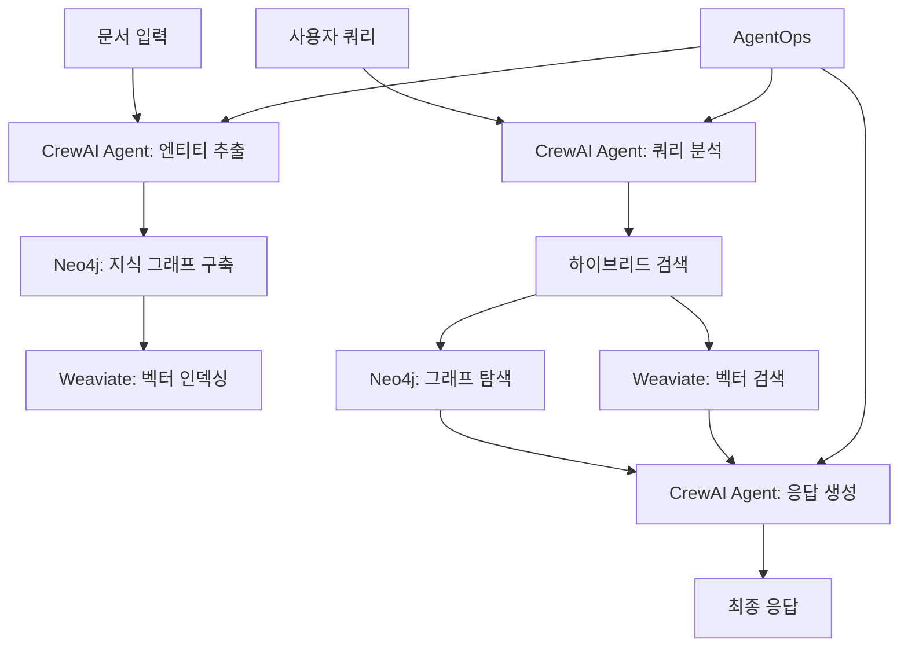

## 개요

전통적인 RAG(Retrieval Augmented Generation)는 벡터 검색을 통해 의미적으로 유사한 문서를 찾아 컨텍스트를 제공하지만, 데이터 간의 관계나 연결성을 충분히 활용하지 못합니다. Graph RAG는 이러한 한계를 극복하여 엔티티 간의 관계를 활용한 더 풍부한 컨텍스트를 제공합니다.

이 가이드에서는 [Weaviate의 Graph RAG 접근법](https://weaviate.io/blog/graph-rag)을 참고하여 AgentOps와 CrewAI를 활용한 실전 Graph RAG 시스템을 단계별로 구축해보겠습니다.

## Graph RAG vs 전통적인 RAG

### 전통적인 RAG의 한계점

전통적인 RAG는 각 문서를 독립적인 벡터로 표현하여 의미적 유사성만을 기반으로 검색합니다:

```python
# 전통적인 RAG의 데이터 표현
documents = [
    {"text": "계약서 A", "embedding": [0.1, 0.2, ...]},
    {"text": "계약서 B", "embedding": [0.3, 0.4, ...]},
    {"text": "계약서 C", "embedding": [0.5, 0.6, ...]}
]
```

이 방식은 문서 간의 관계나 엔티티 간의 연결성을 파악하지 못합니다.

### Graph RAG의 장점

Graph RAG는 엔티티와 관계를 그래프로 구조화하여 더 풍부한 컨텍스트를 제공합니다:

- **관계 기반 검색**: 엔티티 간 연결을 통한 확장된 컨텍스트
- **커뮤니티 탐지**: 밀접하게 연결된 엔티티 그룹 식별
- **계층적 요약**: 엔티티 및 커뮤니티 수준의 요약 정보

## 시스템 아키텍처

우리가 구축할 Graph RAG 시스템의 전체 아키텍처입니다:



## 필수 도구 설치 및 설정

### 1. 기본 환경 설정

```bash
# 프로젝트 디렉토리 생성
mkdir graph-rag-system
cd graph-rag-system

# Python 가상환경 생성 (uv 사용)
uv venv graph-rag-env
source graph-rag-env/bin/activate

# 필수 패키지 설치
uv add crewai agentops neo4j weaviate-client langchain openai python-dotenv
```

### 2. 환경 변수 설정

```bash
# .env 파일 생성
cat > .env << 'EOF'
# OpenAI API
OPENAI_API_KEY=your_openai_api_key

# AgentOps
AGENTOPS_API_KEY=your_agentops_api_key

# Neo4j
NEO4J_URI=bolt://localhost:7687
NEO4J_USERNAME=neo4j
NEO4J_PASSWORD=your_neo4j_password

# Weaviate
WEAVIATE_URL=http://localhost:8080
WEAVIATE_API_KEY=your_weaviate_api_key
EOF
```

### 3. Docker로 데이터베이스 실행

```bash
# Neo4j 실행
docker run -d \
  --name neo4j \
  -p 7474:7474 -p 7687:7687 \
  -e NEO4J_AUTH=neo4j/your_password \
  neo4j:latest

# Weaviate 실행
docker run -d \
  --name weaviate \
  -p 8080:8080 \
  -e QUERY_DEFAULTS_LIMIT=25 \
  -e AUTHENTICATION_ANONYMOUS_ACCESS_ENABLED=true \
  -e PERSISTENCE_DATA_PATH='/var/lib/weaviate' \
  -e DEFAULT_VECTORIZER_MODULE='none' \
  -e ENABLE_MODULES='text2vec-openai' \
  -e CLUSTER_HOSTNAME='node1' \
  cr.weaviate.io/semitechnologies/weaviate:latest
```

## 단계 1: CrewAI 에이전트 설계

### 엔티티 추출 에이전트


```python
# agents/entity_extractor.py
from crewai import Agent, Task, Crew
from langchain.llms import OpenAI
import agentops

class EntityExtractorAgent:
    def __init__(self):
        agentops.init()
        
        self.llm = OpenAI(temperature=0)
        
        self.agent = Agent(
            role='엔티티 추출 전문가',
            goal='문서에서 핵심 엔티티와 관계를 정확하게 추출',
            backstory="""
            당신은 텍스트 분석의 전문가로, 문서에서 사람, 조직, 개념, 
            날짜 등의 엔티티와 그들 간의 관계를 식별하는 데 특화되어 있습니다.
            """,
            verbose=True,
            allow_delegation=False,
            llm=self.llm
        )
    
    @agentops.record_function('extract_entities')
    def extract_entities(self, text: str) -> dict:
        """문서에서 엔티티와 관계를 추출합니다."""
        
        task = Task(
            description=f"""
            다음 텍스트에서 엔티티와 관계를 추출하세요:
            
            텍스트: {text}
            
            다음 형식으로 결과를 반환하세요:
            {{
                "entities": [
                    {{"name": "엔티티명", "type": "PERSON|ORGANIZATION|CONCEPT|DATE", "description": "설명"}}
                ],
                "relationships": [
                    {{"source": "엔티티1", "target": "엔티티2", "relationship": "관계타입", "description": "관계설명"}}
                ]
            }}
            """,
            agent=self.agent,
            expected_output="JSON 형식의 엔티티와 관계 정보"
        )
        
        crew = Crew(
            agents=[self.agent],
            tasks=[task],
            verbose=True
        )
        
        result = crew.kickoff()
        return result
```


### 쿼리 분석 에이전트

```python
# agents/query_analyzer.py
from crewai import Agent, Task, Crew
import agentops

class QueryAnalyzerAgent:
    def __init__(self):
        self.agent = Agent(
            role='쿼리 분석 전문가',
            goal='사용자 쿼리를 분석하여 최적의 검색 전략 결정',
            backstory="""
            당신은 자연어 쿼리를 분석하여 어떤 엔티티가 중요한지, 
            어떤 관계를 탐색해야 하는지 파악하는 전문가입니다.
            """,
            verbose=True,
            allow_delegation=False
        )
    
    @agentops.record_function('analyze_query')
    def analyze_query(self, query: str) -> dict:
        """쿼리를 분석하여 검색 전략을 결정합니다."""
        
        task = Task(
            description=f"""
            사용자 쿼리를 분석하세요: "{query}"
            
            다음 정보를 추출하세요:
            1. 핵심 엔티티들
            2. 필요한 관계 타입들
            3. 검색 범위 (로컬/글로벌)
            4. 우선순위
            
            JSON 형식으로 반환하세요.
            """,
            agent=self.agent,
            expected_output="쿼리 분석 결과 JSON"
        )
        
        crew = Crew(
            agents=[self.agent],
            tasks=[task],
            verbose=True
        )
        
        return crew.kickoff()
```

## 단계 2: 지식 그래프 구축

### Neo4j 그래프 빌더

```python
# graph/neo4j_builder.py
from neo4j import GraphDatabase
import json
import agentops

class Neo4jGraphBuilder:
    def __init__(self, uri: str, username: str, password: str):
        self.driver = GraphDatabase.driver(uri, auth=(username, password))
    
    def close(self):
        self.driver.close()
    
    @agentops.record_function('create_entity')
    def create_entity(self, entity: dict):
        """엔티티를 Neo4j에 생성합니다."""
        with self.driver.session() as session:
            query = """
            MERGE (e:Entity {name: $name})
            SET e.type = $type,
                e.description = $description,
                e.summary = $summary
            RETURN e
            """
            session.run(query, 
                       name=entity['name'],
                       type=entity['type'],
                       description=entity.get('description', ''),
                       summary=entity.get('summary', ''))
    
    @agentops.record_function('create_relationship')
    def create_relationship(self, relationship: dict):
        """관계를 Neo4j에 생성합니다."""
        with self.driver.session() as session:
            query = """
            MATCH (a:Entity {name: $source})
            MATCH (b:Entity {name: $target})
            MERGE (a)-[r:RELATED {type: $rel_type}]->(b)
            SET r.description = $description,
                r.summary = $summary
            RETURN r
            """
            session.run(query,
                       source=relationship['source'],
                       target=relationship['target'],
                       rel_type=relationship['relationship'],
                       description=relationship.get('description', ''),
                       summary=relationship.get('summary', ''))
    
    @agentops.record_function('detect_communities')
    def detect_communities(self):
        """Leiden 알고리즘으로 커뮤니티를 탐지합니다."""
        with self.driver.session() as session:
            # 그래프 프로젝션 생성
            session.run("""
            CALL gds.graph.project(
                'entityGraph',
                'Entity',
                'RELATED'
            )
            """)
            
            # Leiden 알고리즘 실행
            result = session.run("""
            CALL gds.leiden.write('entityGraph', {
                writeProperty: 'communityId'
            })
            YIELD communityCount, modularity
            RETURN communityCount, modularity
            """)
            
            return result.single()
```

### 커뮤니티 요약 생성

```python
# graph/community_summarizer.py
from crewai import Agent, Task, Crew
import agentops

class CommunitySummarizerAgent:
    def __init__(self):
        self.agent = Agent(
            role='커뮤니티 요약 전문가',
            goal='관련 엔티티들의 커뮤니티에 대한 포괄적인 요약 생성',
            backstory="""
            당신은 복잡한 관계 네트워크를 분석하여 
            핵심 패턴과 인사이트를 도출하는 전문가입니다.
            """,
            verbose=True,
            allow_delegation=False
        )
    
    @agentops.record_function('summarize_community')
    def summarize_community(self, entities: list, relationships: list) -> str:
        """커뮤니티에 대한 요약을 생성합니다."""
        
        task = Task(
            description=f"""
            다음 엔티티들과 관계들로 구성된 커뮤니티를 분석하고 요약하세요:
            
            엔티티들: {entities}
            관계들: {relationships}
            
            다음 관점에서 포괄적인 요약을 작성하세요:
            1. 주요 테마와 패턴
            2. 핵심 인물이나 조직
            3. 중요한 연결점
            4. 전체적인 맥락과 의미
            """,
            agent=self.agent,
            expected_output="커뮤니티에 대한 상세한 요약"
        )
        
        crew = Crew(
            agents=[self.agent],
            tasks=[task],
            verbose=True
        )
        
        return crew.kickoff()
```

## 단계 3: 벡터 인덱싱

### Weaviate 벡터 스토어

```python
# vector/weaviate_store.py
import weaviate
from weaviate.classes.config import Configure
import agentops

class WeaviateVectorStore:
    def __init__(self, url: str, api_key: str = None):
        if api_key:
            self.client = weaviate.connect_to_local(
                host=url,
                headers={"X-OpenAI-Api-Key": api_key}
            )
        else:
            self.client = weaviate.connect_to_local(host=url)
        
        self._setup_schema()
    
    def _setup_schema(self):
        """Weaviate 스키마를 설정합니다."""
        try:
            self.client.collections.create(
                name="Entity",
                vectorizer_config=Configure.Vectorizer.text2vec_openai(),
                properties=[
                    weaviate.classes.config.Property(
                        name="name",
                        data_type=weaviate.classes.config.DataType.TEXT
                    ),
                    weaviate.classes.config.Property(
                        name="type",
                        data_type=weaviate.classes.config.DataType.TEXT
                    ),
                    weaviate.classes.config.Property(
                        name="description",
                        data_type=weaviate.classes.config.DataType.TEXT
                    ),
                    weaviate.classes.config.Property(
                        name="summary",
                        data_type=weaviate.classes.config.DataType.TEXT
                    ),
                    weaviate.classes.config.Property(
                        name="entity_id",
                        data_type=weaviate.classes.config.DataType.TEXT
                    )
                ]
            )
        except Exception as e:
            print(f"스키마가 이미 존재하거나 생성 중 오류: {e}")
    
    @agentops.record_function('index_entity')
    def index_entity(self, entity: dict):
        """엔티티를 벡터 인덱스에 추가합니다."""
        collection = self.client.collections.get("Entity")
        
        collection.data.insert({
            "name": entity['name'],
            "type": entity['type'],
            "description": entity.get('description', ''),
            "summary": entity.get('summary', ''),
            "entity_id": entity['name']
        })
    
    @agentops.record_function('search_entities')
    def search_entities(self, query: str, limit: int = 10):
        """벡터 검색으로 관련 엔티티를 찾습니다."""
        collection = self.client.collections.get("Entity")
        
        response = collection.query.near_text(
            query=query,
            limit=limit
        )
        
        return response.objects
```

## 단계 4: 하이브리드 검색 시스템

### 검색 오케스트레이터

```python
# search/hybrid_retriever.py
from typing import List, Dict
import agentops

class HybridRetriever:
    def __init__(self, neo4j_builder, weaviate_store):
        self.neo4j = neo4j_builder
        self.weaviate = weaviate_store
    
    @agentops.record_function('hybrid_search')
    def search(self, query: str, search_strategy: dict) -> dict:
        """하이브리드 검색을 수행합니다."""
        
        # 1. 벡터 검색으로 관련 엔티티 찾기
        vector_results = self.weaviate.search_entities(
            query, 
            limit=search_strategy.get('entity_limit', 10)
        )
        
        entity_names = [obj.properties['name'] for obj in vector_results]
        
        # 2. Neo4j에서 그래프 탐색
        graph_context = self._traverse_graph(
            entity_names, 
            search_strategy.get('traversal_depth', 2)
        )
        
        # 3. 커뮤니티 정보 수집
        community_summaries = self._get_community_summaries(entity_names)
        
        return {
            'entities': vector_results,
            'graph_context': graph_context,
            'community_summaries': community_summaries
        }
    
    def _traverse_graph(self, entity_names: List[str], depth: int) -> dict:
        """그래프를 탐색하여 관련 정보를 수집합니다."""
        with self.neo4j.driver.session() as session:
            query = f"""
            MATCH (start:Entity)
            WHERE start.name IN $entity_names
            MATCH path = (start)-[*1..{depth}]-(connected)
            RETURN start.name as start_entity,
                   connected.name as connected_entity,
                   connected.type as entity_type,
                   connected.summary as entity_summary,
                   relationships(path) as relationships
            LIMIT 100
            """
            
            result = session.run(query, entity_names=entity_names)
            
            context = {
                'connected_entities': [],
                'relationships': []
            }
            
            for record in result:
                context['connected_entities'].append({
                    'name': record['connected_entity'],
                    'type': record['entity_type'],
                    'summary': record['entity_summary']
                })
                
                for rel in record['relationships']:
                    context['relationships'].append({
                        'source': rel.start_node['name'],
                        'target': rel.end_node['name'],
                        'type': rel.type,
                        'summary': rel.get('summary', '')
                    })
            
            return context
    
    def _get_community_summaries(self, entity_names: List[str]) -> List[str]:
        """엔티티들의 커뮤니티 요약을 가져옵니다."""
        with self.neo4j.driver.session() as session:
            query = """
            MATCH (e:Entity)-[:IN_COMMUNITY]->(c:Community)
            WHERE e.name IN $entity_names AND c.summary IS NOT NULL
            RETURN DISTINCT c.summary as community_summary
            ORDER BY c.rating DESC
            LIMIT 5
            """
            
            result = session.run(query, entity_names=entity_names)
            return [record['community_summary'] for record in result]
```

## 단계 5: 응답 생성 에이전트

### 최종 응답 생성기

```python
# agents/response_generator.py
from crewai import Agent, Task, Crew
import agentops

class ResponseGeneratorAgent:
    def __init__(self):
        self.agent = Agent(
            role='지능형 응답 생성 전문가',
            goal='검색된 정보를 종합하여 정확하고 유용한 답변 생성',
            backstory="""
            당신은 복잡한 정보를 분석하고 사용자가 이해하기 쉬운 
            형태로 종합하여 제시하는 전문가입니다.
            """,
            verbose=True,
            allow_delegation=False
        )
    
    @agentops.record_function('generate_response')
    def generate_response(self, query: str, search_results: dict) -> str:
        """검색 결과를 바탕으로 최종 응답을 생성합니다."""
        
        # 컨텍스트 정리
        entities_context = self._format_entities(search_results['entities'])
        graph_context = self._format_graph_context(search_results['graph_context'])
        community_context = self._format_community_summaries(
            search_results['community_summaries']
        )
        
        task = Task(
            description=f"""
            사용자 질문: "{query}"
            
            다음 정보들을 종합하여 정확하고 유용한 답변을 생성하세요:
            
            ## 관련 엔티티 정보:
            {entities_context}
            
            ## 그래프 연결 정보:
            {graph_context}
            
            ## 커뮤니티 요약:
            {community_context}
            
            답변 작성 가이드라인:
            1. 사용자 질문에 직접적으로 답변
            2. 관련 엔티티들 간의 관계 설명
            3. 중요한 연결점과 패턴 강조
            4. 구체적인 예시와 근거 제시
            5. 명확하고 구조화된 형태로 작성
            """,
            agent=self.agent,
            expected_output="사용자 질문에 대한 포괄적이고 정확한 답변"
        )
        
        crew = Crew(
            agents=[self.agent],
            tasks=[task],
            verbose=True
        )
        
        return crew.kickoff()
    
    def _format_entities(self, entities) -> str:
        """엔티티 정보를 포맷팅합니다."""
        formatted = []
        for entity in entities:
            props = entity.properties
            formatted.append(f"- {props['name']} ({props['type']}): {props.get('summary', props.get('description', ''))}")
        return "\n".join(formatted)
    
    def _format_graph_context(self, graph_context: dict) -> str:
        """그래프 컨텍스트를 포맷팅합니다."""
        entities_info = []
        for entity in graph_context['connected_entities']:
            entities_info.append(f"- {entity['name']} ({entity['type']}): {entity.get('summary', '')}")
        
        relationships_info = []
        for rel in graph_context['relationships']:
            relationships_info.append(f"- {rel['source']} --[{rel['type']}]--> {rel['target']}: {rel.get('summary', '')}")
        
        return f"연결된 엔티티들:\n" + "\n".join(entities_info) + f"\n\n관계들:\n" + "\n".join(relationships_info)
    
    def _format_community_summaries(self, summaries: List[str]) -> str:
        """커뮤니티 요약을 포맷팅합니다."""
        if not summaries:
            return "관련 커뮤니티 요약이 없습니다."
        
        formatted = []
        for i, summary in enumerate(summaries, 1):
            formatted.append(f"{i}. {summary}")
        
        return "\n".join(formatted)
```

## 단계 6: 메인 Graph RAG 시스템

### 전체 시스템 통합

```python
# main.py
import os
from dotenv import load_dotenv
import agentops

from agents.entity_extractor import EntityExtractorAgent
from agents.query_analyzer import QueryAnalyzerAgent
from agents.response_generator import ResponseGeneratorAgent
from graph.neo4j_builder import Neo4jGraphBuilder
from graph.community_summarizer import CommunitySummarizerAgent
from vector.weaviate_store import WeaviateVectorStore
from search.hybrid_retriever import HybridRetriever

load_dotenv()

class GraphRAGSystem:
    def __init__(self):
        # AgentOps 초기화
        agentops.init(api_key=os.getenv('AGENTOPS_API_KEY'))
        
        # 컴포넌트 초기화
        self.entity_extractor = EntityExtractorAgent()
        self.query_analyzer = QueryAnalyzerAgent()
        self.response_generator = ResponseGeneratorAgent()
        self.community_summarizer = CommunitySummarizerAgent()
        
        # 데이터베이스 연결
        self.neo4j_builder = Neo4jGraphBuilder(
            uri=os.getenv('NEO4J_URI'),
            username=os.getenv('NEO4J_USERNAME'),
            password=os.getenv('NEO4J_PASSWORD')
        )
        
        self.weaviate_store = WeaviateVectorStore(
            url=os.getenv('WEAVIATE_URL'),
            api_key=os.getenv('OPENAI_API_KEY')
        )
        
        # 검색 시스템
        self.retriever = HybridRetriever(
            self.neo4j_builder,
            self.weaviate_store
        )
    
    @agentops.record_function('index_document')
    def index_document(self, document_text: str, document_id: str):
        """문서를 인덱싱하여 지식 그래프를 구축합니다."""
        
        print(f"문서 {document_id} 인덱싱 시작...")
        
        # 1. 엔티티와 관계 추출
        extraction_result = self.entity_extractor.extract_entities(document_text)
        
        # 2. Neo4j에 엔티티와 관계 저장
        for entity in extraction_result['entities']:
            self.neo4j_builder.create_entity(entity)
            # Weaviate에도 인덱싱
            self.weaviate_store.index_entity(entity)
        
        for relationship in extraction_result['relationships']:
            self.neo4j_builder.create_relationship(relationship)
        
        # 3. 커뮤니티 탐지
        community_result = self.neo4j_builder.detect_communities()
        print(f"커뮤니티 탐지 완료: {community_result['communityCount']}개 커뮤니티")
        
        # 4. 커뮤니티 요약 생성 (간소화된 버전)
        # 실제 구현에서는 각 커뮤니티별로 요약을 생성해야 합니다
        
        print(f"문서 {document_id} 인덱싱 완료")
    
    @agentops.record_function('query')
    def query(self, user_query: str) -> str:
        """사용자 쿼리에 대한 답변을 생성합니다."""
        
        print(f"쿼리 처리 시작: {user_query}")
        
        # 1. 쿼리 분석
        query_analysis = self.query_analyzer.analyze_query(user_query)
        
        # 2. 하이브리드 검색
        search_results = self.retriever.search(user_query, query_analysis)
        
        # 3. 응답 생성
        response = self.response_generator.generate_response(
            user_query, 
            search_results
        )
        
        print("쿼리 처리 완료")
        return response
    
    def close(self):
        """리소스 정리"""
        self.neo4j_builder.close()
        self.weaviate_store.client.close()
        agentops.end_session('Success')

# 사용 예시
if __name__ == "__main__":
    # Graph RAG 시스템 초기화
    graph_rag = GraphRAGSystem()
    
    try:
        # 샘플 문서 인덱싱
        sample_document = """
        김철수는 ABC 회사의 CEO로서 2023년에 XYZ 파트너십 계약을 체결했다.
        이 계약은 AI 기술 개발을 위한 협력을 목적으로 하며, 
        박영희 CTO가 기술 총괄을 담당한다. ABC 회사는 서울에 본사를 두고 있으며,
        주요 사업 분야는 인공지능과 데이터 분석이다.
        """
        
        graph_rag.index_document(sample_document, "doc_001")
        
        # 쿼리 실행
        response = graph_rag.query("김철수와 관련된 회사와 파트너십에 대해 알려주세요.")
        print("\n=== 답변 ===")
        print(response)
        
    finally:
        graph_rag.close()
```

## 실행 및 테스트

### 1. 시스템 실행

```bash
# 데이터베이스 실행 확인
docker ps

# Graph RAG 시스템 실행
python main.py
```

### 2. 성능 모니터링

AgentOps 대시보드에서 다음 메트릭을 모니터링할 수 있습니다:

- **엔티티 추출 성능**: 추출된 엔티티 수, 처리 시간
- **검색 성능**: 벡터 검색 vs 그래프 검색 비교
- **응답 품질**: 사용자 피드백, 응답 길이
- **시스템 리소스**: 메모리 사용량, API 호출 수

### 3. 고급 기능 활용

```python
# 배치 문서 처리
def batch_index_documents(graph_rag, documents):
    for doc_id, doc_text in documents.items():
        try:
            graph_rag.index_document(doc_text, doc_id)
            print(f"✅ {doc_id} 처리 완료")
        except Exception as e:
            print(f"❌ {doc_id} 처리 실패: {e}")

# 커스텀 검색 전략
custom_strategy = {
    'entity_limit': 15,
    'traversal_depth': 3,
    'community_focus': True
}

response = graph_rag.retriever.search(query, custom_strategy)
```

## 성능 최적화 팁

### 1. 인덱싱 최적화

- **배치 처리**: 대량 문서는 배치로 처리
- **병렬 처리**: 멀티프로세싱으로 엔티티 추출 가속화
- **캐싱**: 자주 사용되는 엔티티 정보 캐싱

### 2. 검색 최적화

- **인덱스 튜닝**: Neo4j 인덱스 최적화
- **쿼리 최적화**: Cypher 쿼리 성능 튜닝
- **결과 제한**: 검색 결과 수 적절히 제한

### 3. 메모리 관리

```python
# 메모리 효율적인 배치 처리
def process_large_dataset(graph_rag, dataset, batch_size=100):
    for i in range(0, len(dataset), batch_size):
        batch = dataset[i:i+batch_size]
        
        for doc in batch:
            graph_rag.index_document(doc['text'], doc['id'])
        
        # 배치 완료 후 메모리 정리
        import gc
        gc.collect()
```

## 트러블슈팅

### 일반적인 문제들

1. **Neo4j 연결 실패**
   ```bash
   # Neo4j 상태 확인
   docker logs neo4j
   
   # 포트 확인
   netstat -an | grep 7687
   ```

2. **Weaviate 스키마 오류**
   ```python
   # 스키마 재생성
   client.collections.delete("Entity")
   weaviate_store._setup_schema()
   ```

3. **AgentOps 연결 문제**
   ```python
   # API 키 확인
   import agentops
   agentops.init(api_key="your_key", auto_start_session=False)
   ```

## 확장 가능성

### 1. 다중 언어 지원

```python
# 언어별 엔티티 추출기
class MultilingualEntityExtractor:
    def __init__(self):
        self.extractors = {
            'ko': KoreanEntityExtractor(),
            'en': EnglishEntityExtractor(),
            'ja': JapaneseEntityExtractor()
        }
    
    def extract(self, text: str, language: str):
        return self.extractors[language].extract_entities(text)
```

### 2. 실시간 업데이트

```python
# 실시간 문서 모니터링
import watchdog
from watchdog.observers import Observer
from watchdog.events import FileSystemEventHandler

class DocumentWatcher(FileSystemEventHandler):
    def __init__(self, graph_rag_system):
        self.graph_rag = graph_rag_system
    
    def on_created(self, event):
        if event.is_file and event.src_path.endswith('.txt'):
            with open(event.src_path, 'r') as f:
                content = f.read()
            self.graph_rag.index_document(content, event.src_path)
```

### 3. API 서버 구축

```python
# FastAPI로 REST API 제공
from fastapi import FastAPI
from pydantic import BaseModel

app = FastAPI()
graph_rag = GraphRAGSystem()

class QueryRequest(BaseModel):
    query: str
    strategy: dict = {}

@app.post("/query")
async def query_endpoint(request: QueryRequest):
    response = graph_rag.query(request.query)
    return {"response": response}

@app.post("/index")
async def index_endpoint(document: dict):
    graph_rag.index_document(document['text'], document['id'])
    return {"status": "indexed"}
```

## 결론

이 가이드에서는 AgentOps와 CrewAI를 활용하여 Graph RAG 시스템을 구축하는 전체 과정을 다뤘습니다. 전통적인 RAG의 한계를 극복하고 엔티티 간의 관계를 활용한 더 풍부한 컨텍스트를 제공하는 시스템을 만들 수 있습니다.

핵심 포인트:
- **멀티 에이전트 아키텍처**: CrewAI로 전문화된 에이전트들이 협력
- **하이브리드 검색**: 벡터 검색과 그래프 탐색의 결합
- **지능형 모니터링**: AgentOps로 시스템 성능 추적
- **확장 가능한 설계**: 다양한 도메인과 언어로 확장 가능

Graph RAG는 복잡한 관계가 중요한 도메인(법률, 의료, 금융 등)에서 특히 강력한 성능을 발휘합니다. 이 가이드를 바탕으로 여러분만의 지능형 검색 시스템을 구축해보세요.

## 참고 자료

- [Weaviate Graph RAG 블로그](https://weaviate.io/blog/graph-rag)
- [Microsoft GraphRAG 논문](https://arxiv.org/abs/2404.16130)
- [CrewAI 공식 문서](https://docs.crewai.com/)
- [AgentOps 가이드](https://docs.agentops.ai/)
- [Neo4j Graph Data Science](https://neo4j.com/docs/graph-data-science/) 