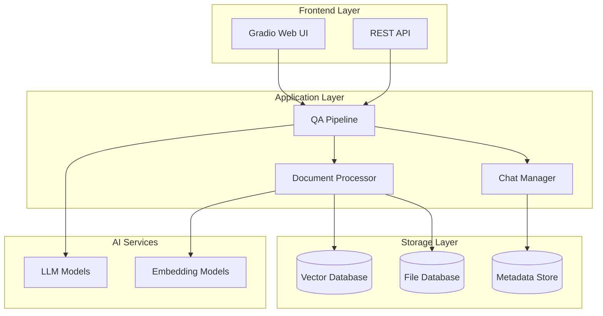
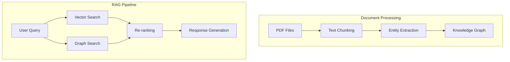

## 개요

[Kotaemon](https://github.com/Cinnamon/kotaemon)은 22.5k 스타를 기록한 오픈소스 RAG 기반 문서 QA 애플리케이션입니다. 깔끔하고 사용자 친화적인 UI를 제공하며, 개발자와 최종 사용자 모두를 고려하여 설계되었습니다.

본 가이드에서는 Kotaemon을 **Kubernetes Helm**으로 배포하고 운영하는 전체 과정을 단계별로 설명합니다.

## Kotaemon 주요 특징

### 최종 사용자를 위한 기능

- **깔끔하고 미니멀한 UI**: RAG 기반 QA를 위한 사용자 친화적 인터페이스
- **다양한 LLM 지원**: OpenAI, Azure OpenAI, Cohere 등 API 제공업체와 로컬 LLM(Ollama, llama-cpp-python) 호환
- **쉬운 설치**: 빠른 시작을 위한 간단한 스크립트 제공

### 개발자를 위한 기능

- **RAG 파이프라인 프레임워크**: 자체 RAG 기반 문서 QA 파이프라인 구축 도구
- **커스터마이징 가능한 UI**: Gradio로 구축된 UI를 통해 RAG 파이프라인 시각화
- **Gradio 테마**: Gradio 개발 시 사용할 수 있는 kotaemon-gradio-theme 제공

### 핵심 기능

- **멀티 사용자 문서 QA 웹 UI**: 로그인 지원, 개인/공개 컬렉션 관리, 협업 및 공유 기능
- **LLM 및 임베딩 모델 관리**: 로컬 LLM과 인기 API 제공업체(OpenAI, Azure, Ollama, Groq) 지원
- **하이브리드 RAG 파이프라인**: 전문 및 벡터 검색과 재순위화를 결합한 최적의 검색 품질
- **멀티모달 QA 지원**: 도표와 표가 포함된 여러 문서에 대한 질의응답
- **고급 인용 및 문서 미리보기**: 상세한 인용과 브라우저 내 PDF 뷰어 지원
- **복잡한 추론 방법**: 질문 분해, ReAct, ReWOO 등 에이전트 기반 추론 지원
- **설정 가능한 UI**: UI에서 검색 및 생성 프로세스의 중요한 측면 조정 가능
- **확장 가능**: Gradio 기반으로 UI 요소 자유롭게 커스터마이징 가능

## 시스템 아키텍처

### 기본 아키텍처



### GraphRAG 통합 아키텍처



## 사전 요구사항

### 시스템 요구사항

```bash
# 1. Python 3.10 이상
python --version

# 2. Docker (선택사항)
docker --version

# 3. Kubernetes 클러스터
kubectl cluster-info

# 4. Helm 3.x
helm version
```

### Kubernetes 클러스터 준비

```bash
# 로컬 개발용 minikube 설정
minikube start --cpus=4 --memory=8192 --disk-size=50g

# 또는 GKE 클러스터 생성
gcloud container clusters create kotaemon-cluster \
    --num-nodes=3 \
    --machine-type=e2-standard-4 \
    --zone=us-central1-a \
    --enable-autoscaling \
    --min-nodes=1 \
    --max-nodes=5
```

## Helm Chart 작성

### 1. Chart 구조 생성

```bash
# Helm Chart 디렉토리 생성
mkdir -p kotaemon-helm
cd kotaemon-helm

# Chart 구조 초기화
helm create kotaemon
cd kotaemon
```

### 2. Chart.yaml 설정

```yaml
# Chart.yaml
apiVersion: v2
name: kotaemon
description: A Helm chart for Kotaemon RAG application
type: application
version: 1.0.0
appVersion: "latest"
keywords:
  - rag
  - ai
  - document-qa
  - gradio
home: https://github.com/Cinnamon/kotaemon
sources:
  - https://github.com/Cinnamon/kotaemon
maintainers:
  - name: Kotaemon Team
    url: https://github.com/Cinnamon/kotaemon
```

### 3. values.yaml 설정

```yaml
# values.yaml
replicaCount: 2

image:
  repository: ghcr.io/cinnamon/kotaemon
  pullPolicy: IfNotPresent
  tag: "main-lite"

nameOverride: ""
fullnameOverride: ""

serviceAccount:
  create: true
  annotations: {}
  name: ""

podAnnotations: {}

podSecurityContext:
  fsGroup: 1000

securityContext:
  capabilities:
    drop:
    - ALL
  readOnlyRootFilesystem: false
  runAsNonRoot: true
  runAsUser: 1000

service:
  type: LoadBalancer
  port: 7860
  targetPort: 7860

ingress:
  enabled: false
  className: ""
  annotations: {}
  hosts:
    - host: kotaemon.local
      paths:
        - path: /
          pathType: Prefix
  tls: []

resources:
  limits:
    cpu: 2000m
    memory: 4Gi
  requests:
    cpu: 1000m
    memory: 2Gi

autoscaling:
  enabled: true
  minReplicas: 2
  maxReplicas: 10
  targetCPUUtilizationPercentage: 70
  targetMemoryUtilizationPercentage: 80

nodeSelector: {}

tolerations: []

affinity: {}

# Kotaemon 특화 설정
kotaemon:
  config:
    # 문서 저장소 설정
    docstore: "LanceDB"  # Elasticsearch | LanceDB | SimpleFileDocumentStore
    
    # 벡터 저장소 설정
    vectorstore: "ChromaDB"  # ChromaDB | LanceDB | InMemory | Milvus | Qdrant
    
    # 멀티모달 QA 활성화
    multimodal: true
    
    # 추론 파이프라인
    reasonings:
      - "ktem.reasoning.simple.FullQAPipeline"
      - "ktem.reasoning.simple.FullDecomposeQAPipeline"
      - "ktem.reasoning.react.ReactAgentPipeline"
      - "ktem.reasoning.rewoo.RewooAgentPipeline"

  # 환경 변수
  env:
    GRADIO_SERVER_NAME: "0.0.0.0"
    GRADIO_SERVER_PORT: "7860"
    
    # GraphRAG 설정
    USE_NANO_GRAPHRAG: "false"
    USE_LIGHTRAG: "false"
    USE_CUSTOMIZED_GRAPHRAG_SETTING: "false"
    
    # OpenAI 설정 (선택사항)
    OPENAI_API_BASE: "https://api.openai.com/v1"
    OPENAI_CHAT_MODEL: "gpt-3.5-turbo"
    OPENAI_EMBEDDINGS_MODEL: "text-embedding-ada-002"

# 데이터 지속성
persistence:
  enabled: true
  storageClass: ""
  accessMode: ReadWriteOnce
  size: 10Gi
  mountPath: /app/ktem_app_data

# 벡터 데이터베이스 (ChromaDB)
chromadb:
  enabled: true
  image:
    repository: chromadb/chroma
    tag: "latest"
  service:
    port: 8000
  persistence:
    enabled: true
    size: 20Gi

# PostgreSQL (메타데이터 저장용)
postgresql:
  enabled: true
  auth:
    postgresPassword: "kotaemon123"
    database: "kotaemon"
  primary:
    persistence:
      enabled: true
      size: 10Gi
```

### 4. Deployment 템플릿

```yaml
# templates/deployment.yaml
apiVersion: apps/v1
kind: Deployment
metadata:
  name: {{ include "kotaemon.fullname" . }}
  labels:
    {{- include "kotaemon.labels" . | nindent 4 }}
spec:
  {{- if not .Values.autoscaling.enabled }}
  replicas: {{ .Values.replicaCount }}
  {{- end }}
  selector:
    matchLabels:
      {{- include "kotaemon.selectorLabels" . | nindent 6 }}
  template:
    metadata:
      {{- with .Values.podAnnotations }}
      annotations:
        {{- toYaml . | nindent 8 }}
      {{- end }}
      labels:
        {{- include "kotaemon.selectorLabels" . | nindent 8 }}
    spec:
      {{- with .Values.imagePullSecrets }}
      imagePullSecrets:
        {{- toYaml . | nindent 8 }}
      {{- end }}
      serviceAccountName: {{ include "kotaemon.serviceAccountName" . }}
      securityContext:
        {{- toYaml .Values.podSecurityContext | nindent 8 }}
      containers:
        - name: {{ .Chart.Name }}
          securityContext:
            {{- toYaml .Values.securityContext | nindent 12 }}
          image: "{{ .Values.image.repository }}:{{ .Values.image.tag | default .Chart.AppVersion }}"
          imagePullPolicy: {{ .Values.image.pullPolicy }}
          ports:
            - name: http
              containerPort: {{ .Values.service.targetPort }}
              protocol: TCP
          env:
            {{- range $key, $value := .Values.kotaemon.env }}
            - name: {{ $key }}
              value: {{ $value | quote }}
            {{- end }}
            {{- if .Values.chromadb.enabled }}
            - name: CHROMA_HOST
              value: "{{ include "kotaemon.fullname" . }}-chromadb"
            - name: CHROMA_PORT
              value: "{{ .Values.chromadb.service.port }}"
            {{- end }}
            {{- if .Values.postgresql.enabled }}
            - name: POSTGRES_HOST
              value: "{{ include "kotaemon.fullname" . }}-postgresql"
            - name: POSTGRES_DB
              value: {{ .Values.postgresql.auth.database }}
            - name: POSTGRES_PASSWORD
              valueFrom:
                secretKeyRef:
                  name: {{ include "kotaemon.fullname" . }}-postgresql
                  key: postgres-password
            {{- end }}
          livenessProbe:
            httpGet:
              path: /
              port: http
            initialDelaySeconds: 60
            periodSeconds: 30
          readinessProbe:
            httpGet:
              path: /
              port: http
            initialDelaySeconds: 30
            periodSeconds: 10
          resources:
            {{- toYaml .Values.resources | nindent 12 }}
          volumeMounts:
            {{- if .Values.persistence.enabled }}
            - name: data
              mountPath: {{ .Values.persistence.mountPath }}
            {{- end }}
      volumes:
        {{- if .Values.persistence.enabled }}
        - name: data
          persistentVolumeClaim:
            claimName: {{ include "kotaemon.fullname" . }}-data
        {{- end }}
      {{- with .Values.nodeSelector }}
      nodeSelector:
        {{- toYaml . | nindent 8 }}
      {{- end }}
      {{- with .Values.affinity }}
      affinity:
        {{- toYaml . | nindent 8 }}
      {{- end }}
      {{- with .Values.tolerations }}
      tolerations:
        {{- toYaml . | nindent 8 }}
      {{- end }}
```

### 5. Service 템플릿

```yaml
# templates/service.yaml
apiVersion: v1
kind: Service
metadata:
  name: {{ include "kotaemon.fullname" . }}
  labels:
    {{- include "kotaemon.labels" . | nindent 4 }}
spec:
  type: {{ .Values.service.type }}
  ports:
    - port: {{ .Values.service.port }}
      targetPort: http
      protocol: TCP
      name: http
  selector:
    {{- include "kotaemon.selectorLabels" . | nindent 4 }}
```

### 6. PersistentVolumeClaim 템플릿

```yaml
# templates/pvc.yaml
{{- if .Values.persistence.enabled }}
apiVersion: v1
kind: PersistentVolumeClaim
metadata:
  name: {{ include "kotaemon.fullname" . }}-data
  labels:
    {{- include "kotaemon.labels" . | nindent 4 }}
spec:
  accessModes:
    - {{ .Values.persistence.accessMode }}
  resources:
    requests:
      storage: {{ .Values.persistence.size }}
  {{- if .Values.persistence.storageClass }}
  storageClassName: {{ .Values.persistence.storageClass }}
  {{- end }}
{{- end }}
```

### 7. ChromaDB 배포

```yaml
# templates/chromadb-deployment.yaml
{{- if .Values.chromadb.enabled }}
apiVersion: apps/v1
kind: Deployment
metadata:
  name: {{ include "kotaemon.fullname" . }}-chromadb
  labels:
    {{- include "kotaemon.labels" . | nindent 4 }}
    app.kubernetes.io/component: chromadb
spec:
  replicas: 1
  selector:
    matchLabels:
      {{- include "kotaemon.selectorLabels" . | nindent 6 }}
      app.kubernetes.io/component: chromadb
  template:
    metadata:
      labels:
        {{- include "kotaemon.selectorLabels" . | nindent 8 }}
        app.kubernetes.io/component: chromadb
    spec:
      containers:
        - name: chromadb
          image: "{{ .Values.chromadb.image.repository }}:{{ .Values.chromadb.image.tag }}"
          ports:
            - name: http
              containerPort: {{ .Values.chromadb.service.port }}
              protocol: TCP
          env:
            - name: CHROMA_HOST
              value: "0.0.0.0"
          {{- if .Values.chromadb.persistence.enabled }}
          volumeMounts:
            - name: data
              mountPath: /chroma/chroma
          {{- end }}
      {{- if .Values.chromadb.persistence.enabled }}
      volumes:
        - name: data
          persistentVolumeClaim:
            claimName: {{ include "kotaemon.fullname" . }}-chromadb-data
      {{- end }}
---
apiVersion: v1
kind: Service
metadata:
  name: {{ include "kotaemon.fullname" . }}-chromadb
  labels:
    {{- include "kotaemon.labels" . | nindent 4 }}
    app.kubernetes.io/component: chromadb
spec:
  ports:
    - port: {{ .Values.chromadb.service.port }}
      targetPort: http
      protocol: TCP
      name: http
  selector:
    {{- include "kotaemon.selectorLabels" . | nindent 4 }}
    app.kubernetes.io/component: chromadb
{{- if .Values.chromadb.persistence.enabled }}
---
apiVersion: v1
kind: PersistentVolumeClaim
metadata:
  name: {{ include "kotaemon.fullname" . }}-chromadb-data
  labels:
    {{- include "kotaemon.labels" . | nindent 4 }}
    app.kubernetes.io/component: chromadb
spec:
  accessModes:
    - ReadWriteOnce
  resources:
    requests:
      storage: {{ .Values.chromadb.persistence.size }}
{{- end }}
{{- end }}
```

## 배포 실행

### 1. Helm 저장소 추가 및 업데이트

```bash
# PostgreSQL Helm Chart 저장소 추가
helm repo add bitnami https://charts.bitnami.com/bitnami
helm repo update
```

### 2. 네임스페이스 생성

```bash
# 전용 네임스페이스 생성
kubectl create namespace kotaemon

# 네임스페이스를 기본값으로 설정
kubectl config set-context --current --namespace=kotaemon
```

### 3. Secret 생성 (API 키 등)

```bash
# OpenAI API 키 Secret 생성
kubectl create secret generic kotaemon-secrets \
  --from-literal=openai-api-key="your-openai-api-key" \
  --from-literal=azure-openai-api-key="your-azure-api-key" \
  -n kotaemon
```

### 4. values.yaml 커스터마이징

```yaml
# custom-values.yaml
image:
  tag: "main-full"  # 더 많은 파일 형식 지원

service:
  type: LoadBalancer
  annotations:
    service.beta.kubernetes.io/aws-load-balancer-type: nlb

ingress:
  enabled: true
  className: "nginx"
  annotations:
    cert-manager.io/cluster-issuer: "letsencrypt-prod"
    nginx.ingress.kubernetes.io/ssl-redirect: "true"
  hosts:
    - host: kotaemon.yourdomain.com
      paths:
        - path: /
          pathType: Prefix
  tls:
    - secretName: kotaemon-tls
      hosts:
        - kotaemon.yourdomain.com

resources:
  limits:
    cpu: 4000m
    memory: 8Gi
  requests:
    cpu: 2000m
    memory: 4Gi

autoscaling:
  enabled: true
  minReplicas: 3
  maxReplicas: 20
  targetCPUUtilizationPercentage: 70

kotaemon:
  env:
    # GraphRAG 활성화
    USE_NANO_GRAPHRAG: "true"
    
    # OpenAI 설정
    OPENAI_API_KEY:
      valueFrom:
        secretKeyRef:
          name: kotaemon-secrets
          key: openai-api-key

# 고성능 벡터 데이터베이스로 변경
chromadb:
  enabled: false

# Qdrant 사용
qdrant:
  enabled: true
  image:
    repository: qdrant/qdrant
    tag: "latest"
  service:
    port: 6333
  persistence:
    enabled: true
    size: 50Gi
```

### 5. Helm 설치 실행

```bash
# 의존성 업데이트
helm dependency update

# Dry-run으로 검증
helm install kotaemon . \
  --namespace kotaemon \
  --values custom-values.yaml \
  --dry-run --debug

# 실제 배포
helm install kotaemon . \
  --namespace kotaemon \
  --values custom-values.yaml \
  --timeout 10m
```

### 6. 배포 상태 확인

```bash
# Pod 상태 확인
kubectl get pods -n kotaemon

# 서비스 상태 확인
kubectl get svc -n kotaemon

# Ingress 확인
kubectl get ingress -n kotaemon

# 로그 확인
kubectl logs -f deployment/kotaemon -n kotaemon
```

## 운영 및 모니터링

### 1. 헬스 체크 설정

```yaml
# templates/healthcheck.yaml
apiVersion: v1
kind: ConfigMap
metadata:
  name: {{ include "kotaemon.fullname" . }}-healthcheck
data:
  healthcheck.py: |
    #!/usr/bin/env python3
    import requests
    import sys
    import os
    
    def check_health():
        try:
            # Kotaemon 애플리케이션 헬스 체크
            response = requests.get(
                f"http://localhost:{os.getenv('GRADIO_SERVER_PORT', '7860')}/",
                timeout=30
            )
            
            if response.status_code == 200:
                print("✅ Kotaemon is healthy")
                return True
            else:
                print(f"❌ Kotaemon returned status {response.status_code}")
                return False
                
        except Exception as e:
            print(f"❌ Health check failed: {e}")
            return False
    
    if __name__ == "__main__":
        if check_health():
            sys.exit(0)
        else:
            sys.exit(1)
```

### 2. 모니터링 대시보드

```yaml
# monitoring/prometheus-config.yaml
apiVersion: v1
kind: ConfigMap
metadata:
  name: kotaemon-prometheus-config
data:
  prometheus.yml: |
    global:
      scrape_interval: 15s
    
    scrape_configs:
      - job_name: 'kotaemon'
        static_configs:
          - targets: ['kotaemon:7860']
        metrics_path: /metrics
        scrape_interval: 30s
        
      - job_name: 'chromadb'
        static_configs:
          - targets: ['kotaemon-chromadb:8000']
        metrics_path: /metrics
        scrape_interval: 30s
```

### 3. 로그 집계 설정

```yaml
# logging/fluent-bit-config.yaml
apiVersion: v1
kind: ConfigMap
metadata:
  name: kotaemon-fluent-bit-config
data:
  fluent-bit.conf: |
    [SERVICE]
        Flush         1
        Log_Level     info
        Daemon        off
        Parsers_File  parsers.conf
    
    [INPUT]
        Name              tail
        Path              /var/log/containers/kotaemon*.log
        Parser            docker
        Tag               kotaemon.*
        Refresh_Interval  5
    
    [FILTER]
        Name                kubernetes
        Match               kotaemon.*
        Kube_URL            https://kubernetes.default.svc:443
        Kube_CA_File        /var/run/secrets/kubernetes.io/serviceaccount/ca.crt
        Kube_Token_File     /var/run/secrets/kubernetes.io/serviceaccount/token
    
    [OUTPUT]
        Name  es
        Match kotaemon.*
        Host  elasticsearch.logging.svc.cluster.local
        Port  9200
        Index kotaemon-logs
```

### 4. 백업 및 복구 스크립트

```bash
#!/bin/bash
# backup-kotaemon.sh

set -e

NAMESPACE="kotaemon"
BACKUP_DIR="/backup/kotaemon/$(date +%Y%m%d_%H%M%S)"
mkdir -p "$BACKUP_DIR"

echo "🔄 Starting Kotaemon backup..."

# 1. 데이터베이스 백업
echo "📊 Backing up PostgreSQL..."
kubectl exec -n $NAMESPACE deployment/kotaemon-postgresql -- \
    pg_dump -U postgres kotaemon > "$BACKUP_DIR/postgres_backup.sql"

# 2. 벡터 데이터베이스 백업
echo "🔍 Backing up ChromaDB..."
kubectl exec -n $NAMESPACE deployment/kotaemon-chromadb -- \
    tar -czf - /chroma/chroma > "$BACKUP_DIR/chromadb_backup.tar.gz"

# 3. 애플리케이션 데이터 백업
echo "📁 Backing up application data..."
kubectl exec -n $NAMESPACE deployment/kotaemon -- \
    tar -czf - /app/ktem_app_data > "$BACKUP_DIR/app_data_backup.tar.gz"

# 4. Kubernetes 리소스 백업
echo "⚙️ Backing up Kubernetes resources..."
kubectl get all,pvc,secrets,configmaps -n $NAMESPACE -o yaml > "$BACKUP_DIR/k8s_resources.yaml"

# 5. Helm values 백업
echo "📋 Backing up Helm values..."
helm get values kotaemon -n $NAMESPACE > "$BACKUP_DIR/helm_values.yaml"

echo "✅ Backup completed: $BACKUP_DIR"
```

### 5. 성능 최적화 설정

```yaml
# performance/hpa-custom.yaml
apiVersion: autoscaling/v2
kind: HorizontalPodAutoscaler
metadata:
  name: kotaemon-hpa
spec:
  scaleTargetRef:
    apiVersion: apps/v1
    kind: Deployment
    name: kotaemon
  minReplicas: 3
  maxReplicas: 50
  metrics:
  - type: Resource
    resource:
      name: cpu
      target:
        type: Utilization
        averageUtilization: 70
  - type: Resource
    resource:
      name: memory
      target:
        type: Utilization
        averageUtilization: 80
  - type: Pods
    pods:
      metric:
        name: requests_per_second
      target:
        type: AverageValue
        averageValue: "100"
  behavior:
    scaleDown:
      stabilizationWindowSeconds: 300
      policies:
      - type: Percent
        value: 10
        periodSeconds: 60
    scaleUp:
      stabilizationWindowSeconds: 60
      policies:
      - type: Percent
        value: 50
        periodSeconds: 60
      - type: Pods
        value: 5
        periodSeconds: 60
      selectPolicy: Max
```

## 고급 설정

### 1. GraphRAG 활성화

```bash
# GraphRAG 의존성 설치
kubectl exec -it deployment/kotaemon -n kotaemon -- \
    pip install nano-graphrag

# 환경 변수 업데이트
kubectl patch deployment kotaemon -n kotaemon -p='
{
  "spec": {
    "template": {
      "spec": {
        "containers": [
          {
            "name": "kotaemon",
            "env": [
              {
                "name": "USE_NANO_GRAPHRAG",
                "value": "true"
              }
            ]
          }
        ]
      }
    }
  }
}'
```

### 2. 멀티모달 문서 파싱 설정

```yaml
# values-multimodal.yaml
kotaemon:
  env:
    # Azure Document Intelligence
    AZURE_DOC_INTELLIGENCE_ENDPOINT: "https://your-endpoint.cognitiveservices.azure.com/"
    AZURE_DOC_INTELLIGENCE_KEY:
      valueFrom:
        secretKeyRef:
          name: kotaemon-secrets
          key: azure-doc-intelligence-key
    
    # Docling (로컬 처리)
    USE_DOCLING: "true"

# Docling 의존성 설치를 위한 initContainer
initContainers:
  - name: install-docling
    image: python:3.10
    command: ['pip', 'install', 'docling']
    volumeMounts:
      - name: pip-cache
        mountPath: /root/.cache/pip
```

### 3. 보안 강화 설정

```yaml
# security/network-policy.yaml
apiVersion: networking.k8s.io/v1
kind: NetworkPolicy
metadata:
  name: kotaemon-network-policy
spec:
  podSelector:
    matchLabels:
      app.kubernetes.io/name: kotaemon
  policyTypes:
  - Ingress
  - Egress
  ingress:
  - from:
    - namespaceSelector:
        matchLabels:
          name: ingress-nginx
    ports:
    - protocol: TCP
      port: 7860
  - from:
    - podSelector:
        matchLabels:
          app.kubernetes.io/name: kotaemon
    ports:
    - protocol: TCP
      port: 7860
  egress:
  - to:
    - podSelector:
        matchLabels:
          app.kubernetes.io/component: chromadb
    ports:
    - protocol: TCP
      port: 8000
  - to:
    - podSelector:
        matchLabels:
          app.kubernetes.io/name: postgresql
    ports:
    - protocol: TCP
      port: 5432
  - to: []
    ports:
    - protocol: TCP
      port: 443  # HTTPS for external APIs
    - protocol: TCP
      port: 53   # DNS
    - protocol: UDP
      port: 53   # DNS
```

## 트러블슈팅

### 1. 일반적인 문제 해결

```bash
# Pod가 시작되지 않는 경우
kubectl describe pod -l app.kubernetes.io/name=kotaemon -n kotaemon

# 메모리 부족 문제
kubectl top pods -n kotaemon

# 스토리지 문제 확인
kubectl get pvc -n kotaemon
kubectl describe pvc kotaemon-data -n kotaemon

# 네트워크 연결 문제
kubectl exec -it deployment/kotaemon -n kotaemon -- \
    curl -v http://kotaemon-chromadb:8000/api/v1/heartbeat
```

### 2. 성능 문제 진단

```bash
# 애플리케이션 로그 분석
kubectl logs -f deployment/kotaemon -n kotaemon | grep -E "(ERROR|WARN|slow)"

# 리소스 사용량 모니터링
kubectl top pods -n kotaemon --containers

# HPA 상태 확인
kubectl get hpa -n kotaemon
kubectl describe hpa kotaemon-hpa -n kotaemon
```

### 3. 데이터베이스 연결 문제

```bash
# PostgreSQL 연결 테스트
kubectl exec -it deployment/kotaemon-postgresql -n kotaemon -- \
    psql -U postgres -d kotaemon -c "SELECT version();"

# ChromaDB 연결 테스트
kubectl exec -it deployment/kotaemon-chromadb -n kotaemon -- \
    curl http://localhost:8000/api/v1/heartbeat
```

## 업그레이드 및 롤백

### 1. 애플리케이션 업그레이드

```bash
# 새 버전으로 업그레이드
helm upgrade kotaemon . \
  --namespace kotaemon \
  --values custom-values.yaml \
  --set image.tag=main-full-v2

# 업그레이드 상태 확인
helm status kotaemon -n kotaemon

# 롤링 업데이트 상태 확인
kubectl rollout status deployment/kotaemon -n kotaemon
```

### 2. 롤백 수행

```bash
# 이전 버전으로 롤백
helm rollback kotaemon 1 -n kotaemon

# 또는 Kubernetes 롤백
kubectl rollout undo deployment/kotaemon -n kotaemon

# 롤백 상태 확인
kubectl rollout status deployment/kotaemon -n kotaemon
```

## 정리 및 제거

```bash
# Helm 릴리스 제거
helm uninstall kotaemon -n kotaemon

# PVC 수동 삭제 (데이터 보존 필요시 백업 후)
kubectl delete pvc --all -n kotaemon

# 네임스페이스 제거
kubectl delete namespace kotaemon

# 로컬 Helm Chart 정리
rm -rf kotaemon-helm
```

## 결론

이 가이드를 통해 Kotaemon RAG 애플리케이션을 Kubernetes 환경에 성공적으로 배포하고 운영할 수 있습니다. 

### 주요 성과

- **완전한 컨테이너화**: Docker 기반 배포로 환경 일관성 보장
- **자동 확장**: HPA를 통한 트래픽 기반 자동 스케일링
- **고가용성**: 다중 복제본과 로드 밸런싱
- **데이터 지속성**: PVC를 통한 데이터 보존
- **모니터링 및 로깅**: 운영 가시성 확보
- **보안**: NetworkPolicy와 RBAC을 통한 보안 강화

Kotaemon의 강력한 RAG 기능과 Kubernetes의 확장성을 결합하여 프로덕션 레벨의 문서 QA 시스템을 구축할 수 있습니다.