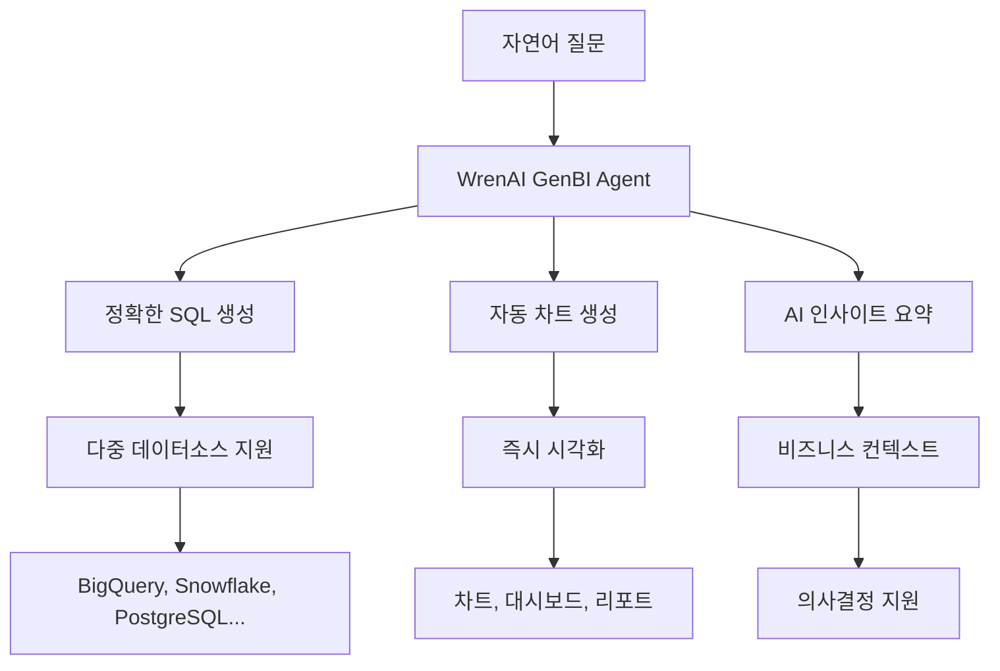
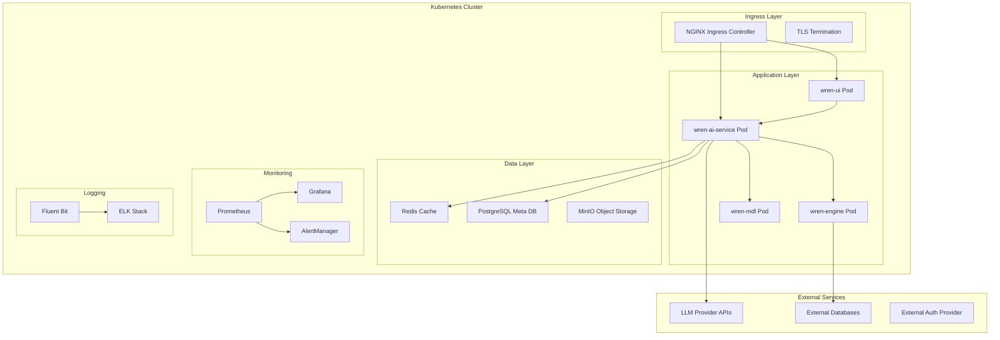

⏱️ **예상 읽기 시간**: 18분

## 서론

데이터 분석의 민주화가 가속화되면서, 비즈니스 사용자들이 SQL을 배우지 않고도 데이터에서 인사이트를 얻을 수 있는 도구의 필요성이 급증하고 있습니다. **WrenAI**는 이러한 요구를 충족하는 혁신적인 오픈소스 GenBI(Generative Business Intelligence) Agent입니다.

**8.5k GitHub Stars**와 **836 forks**를 기록한 WrenAI는 자연어 쿼리를 정확한 SQL로 변환하고, 즉시 시각화 차트와 AI 생성 인사이트를 제공하는 완전한 솔루션입니다. 본 포스트에서는 WrenAI의 핵심 기능부터 Kubernetes 환경에서의 엔터프라이즈급 배포 아키텍처까지 상세히 다루겠습니다.

## WrenAI 개관 및 핵심 가치

### GenBI Agent란?

**GenBI(Generative Business Intelligence)**는 생성형 AI를 활용한 차세대 비즈니스 인텔리전스 접근방식입니다. 기존 BI 도구의 한계를 뛰어넘어 사용자가 자연어로 질문하면 AI가 즉시 SQL을 생성하고 결과를 시각화하여 제공합니다.

### WrenAI의 핵심 차별점



## 주요 기능 및 아키텍처

### 1. Talk to Your Data - 자연어 데이터 대화

**핵심 기능**:
- **다국어 지원**: 한국어, 영어, 중국어 등 다양한 언어로 질문 가능
- **컨텍스트 이해**: 비즈니스 도메인 용어와 메트릭 자동 인식
- **정확한 SQL 생성**: 시맨틱 레이어 기반 정밀한 쿼리 생성

**예시 시나리오**:
```sql
-- 사용자 질문: "지난 3개월간 가장 많이 팔린 상품 카테고리는?"
-- WrenAI 생성 SQL:
SELECT 
    product_category,
    SUM(quantity) as total_quantity,
    SUM(revenue) as total_revenue
FROM sales_fact s
JOIN product_dim p ON s.product_id = p.product_id
JOIN date_dim d ON s.date_id = d.date_id
WHERE d.date >= DATE_SUB(CURRENT_DATE(), INTERVAL 3 MONTH)
GROUP BY product_category
ORDER BY total_quantity DESC
LIMIT 10;
```

### 2. GenBI Insights - AI 생성 인사이트

**자동 분석 기능**:
- **트렌드 분석**: 시계열 데이터의 패턴 및 이상 탐지
- **상관관계 발견**: 메트릭 간 숨겨진 연관성 식별
- **예측 모델링**: 미래 트렌드 예측 및 시나리오 분석

```python
# WrenAI Insights 예시 출력
insights = {
    "trend_analysis": {
        "revenue_growth": "+15.3% QoQ",
        "seasonal_pattern": "12월 매출 피크 (평균 대비 +45%)",
        "anomaly_detected": "11월 3주차 급격한 매출 하락 (-23%)"
    },
    "correlations": {
        "marketing_spend_vs_acquisition": 0.87,
        "customer_satisfaction_vs_retention": 0.72,
        "weather_vs_sales": 0.45
    },
    "recommendations": [
        "12월 마케팅 예산 40% 증액 권장",
        "고객 만족도 개선을 통한 리텐션 향상",
        "날씨 데이터 기반 재고 최적화"
    ]
}
```

### 3. Semantic Layer - 시맨틱 레이어

**MDL(Model Definition Language) 활용**:
- **스키마 추상화**: 복잡한 데이터베이스 구조를 비즈니스 용어로 매핑
- **메트릭 정의**: 일관된 비즈니스 메트릭 및 KPI 정의
- **조인 관리**: 테이블 간 관계 자동 처리

```yaml
# MDL 예시: 고객 메트릭 정의
models:
  - name: customer_metrics
    description: "고객 관련 핵심 메트릭"
    columns:
      - name: customer_id
        type: string
        primary_key: true
      
      - name: total_revenue
        type: float
        description: "고객 총 매출"
        sql: "SUM(orders.amount)"
        
      - name: avg_order_value
        type: float  
        description: "평균 주문 금액"
        sql: "AVG(orders.amount)"
        
      - name: customer_lifetime_value
        type: float
        description: "고객 생애 가치"
        sql: "SUM(orders.amount) * 0.2"  # 20% 마진 적용

    relationships:
      - name: orders
        type: one_to_many
        sql: "customer_metrics.customer_id = orders.customer_id"
```

### 4. Embed via API - API 통합

**개발자 친화적 API**:
- **RESTful API**: 표준 HTTP 인터페이스
- **SDK 지원**: Python, JavaScript, Java SDK 제공
- **Webhook 지원**: 실시간 알림 및 이벤트 처리

```python
# WrenAI API 사용 예시
from wrenai import WrenClient

client = WrenClient(api_key="your-api-key")

# 자연어 쿼리
response = client.query(
    question="Show me sales performance by region last quarter",
    database="production_warehouse"
)

# 결과 처리
sql_query = response.sql
chart_config = response.chart
insights = response.insights
data = response.execute()

# 결과 임베딩
dashboard.add_chart(
    title="Regional Sales Performance",
    sql=sql_query,
    chart_type=chart_config.type,
    data=data
)
```

## 지원 기술 스택

### 데이터소스 지원 (12개 주요 DB)

| 클라우드 데이터웨어하우스 | 관계형 데이터베이스 | 분석 전용 DB |
|---------------------|-----------------|-------------|
| **AWS Redshift** | **PostgreSQL** | **ClickHouse** |
| **Google BigQuery** | **MySQL** | **DuckDB** |
| **Snowflake** | **SQL Server** | **Trino** |
| | **Oracle** | **Athena** |

### LLM 모델 지원 (10개 주요 제공자)

```yaml
llm_providers:
  openai:
    models: ["gpt-4", "gpt-3.5-turbo", "gpt-4-turbo"]
    
  azure_openai:
    models: ["gpt-4", "gpt-35-turbo"] 
    
  google:
    vertex_ai: ["gemini-pro", "gemini-pro-vision"]
    ai_studio: ["gemini-1.5-pro"]
    
  anthropic:
    models: ["claude-3-opus", "claude-3-sonnet", "claude-3-haiku"]
    
  aws_bedrock:
    models: ["anthropic.claude-v2", "amazon.titan-text-express"]
    
  others:
    - DeepSeek
    - Groq  
    - Ollama
    - Databricks
```

## Kubernetes 엔터프라이즈 배포 아키텍처

### 전체 시스템 아키텍처



### 핵심 컴포넌트 분석

#### 1. wren-ui (Frontend)

```yaml
# wren-ui-deployment.yaml
apiVersion: apps/v1
kind: Deployment
metadata:
  name: wren-ui
  namespace: wrenai
spec:
  replicas: 3
  selector:
    matchLabels:
      app: wren-ui
  template:
    metadata:
      labels:
        app: wren-ui
    spec:
      containers:
      - name: wren-ui
        image: ghcr.io/canner/wrenai/wren-ui:latest
        ports:
        - containerPort: 3000
        env:
        - name: WREN_AI_SERVICE_URL
          value: "http://wren-ai-service:8000"
        - name: NODE_ENV
          value: "production"
        resources:
          requests:
            memory: "512Mi"
            cpu: "250m"
          limits:
            memory: "1Gi" 
            cpu: "500m"
        livenessProbe:
          httpGet:
            path: /health
            port: 3000
          initialDelaySeconds: 30
          periodSeconds: 10
        readinessProbe:
          httpGet:
            path: /ready
            port: 3000
          initialDelaySeconds: 5
          periodSeconds: 5
```

#### 2. wren-ai-service (Core AI Service)

```yaml
# wren-ai-service-deployment.yaml
apiVersion: apps/v1
kind: Deployment
metadata:
  name: wren-ai-service
  namespace: wrenai
spec:
  replicas: 2
  selector:
    matchLabels:
      app: wren-ai-service
  template:
    metadata:
      labels:
        app: wren-ai-service
    spec:
      containers:
      - name: wren-ai-service
        image: ghcr.io/canner/wrenai/wren-ai-service:latest
        ports:
        - containerPort: 8000
        env:
        - name: OPENAI_API_KEY
          valueFrom:
            secretKeyRef:
              name: llm-secrets
              key: openai-api-key
        - name: REDIS_URL
          value: "redis://redis-service:6379"
        - name: POSTGRES_URL
          valueFrom:
            secretKeyRef:
              name: db-secrets
              key: postgres-url
        resources:
          requests:
            memory: "2Gi"
            cpu: "1000m" 
          limits:
            memory: "4Gi"
            cpu: "2000m"
        volumeMounts:
        - name: model-cache
          mountPath: /app/models
      volumes:
      - name: model-cache
        persistentVolumeClaim:
          claimName: model-cache-pvc
```

#### 3. wren-engine (Query Engine)

```yaml
# wren-engine-deployment.yaml
apiVersion: apps/v1
kind: Deployment
metadata:
  name: wren-engine
  namespace: wrenai
spec:
  replicas: 2
  selector:
    matchLabels:
      app: wren-engine
  template:
    metadata:
      labels:
        app: wren-engine
    spec:
      containers:
      - name: wren-engine
        image: ghcr.io/canner/wrenai/wren-engine:latest
        ports:
        - containerPort: 8080
        env:
        - name: WREN_DATASOURCE_TYPE
          value: "postgresql"
        - name: WREN_DATASOURCE_URL
          valueFrom:
            secretKeyRef:
              name: datasource-secrets
              key: connection-url
        resources:
          requests:
            memory: "1Gi"
            cpu: "500m"
          limits:
            memory: "2Gi"
            cpu: "1000m"
```

## 엔터프라이즈 배포 요구사항 체크리스트

### 🏗️ 인프라 요구사항

#### 1. Kubernetes 클러스터 사양

```yaml
cluster_requirements:
  minimum_specs:
    nodes: 3
    cpu_per_node: "8 cores"
    memory_per_node: "32GB"
    storage_per_node: "500GB SSD"
    
  recommended_specs:
    nodes: 5
    cpu_per_node: "16 cores" 
    memory_per_node: "64GB"
    storage_per_node: "1TB NVMe SSD"
    
  network:
    bandwidth: "10 Gbps"
    load_balancer: "L7 Load Balancer"
    tls_termination: "Required"
```

#### 2. 스토리지 요구사항

```yaml
# storage-class.yaml
apiVersion: storage.k8s.io/v1
kind: StorageClass
metadata:
  name: wrenai-ssd
provisioner: kubernetes.io/aws-ebs
parameters:
  type: gp3
  iops: "3000"
  throughput: "125"
  encrypted: "true"
allowVolumeExpansion: true
volumeBindingMode: WaitForFirstConsumer

---
# Persistent Volume Claims
apiVersion: v1
kind: PersistentVolumeClaim
metadata:
  name: postgres-pvc
  namespace: wrenai
spec:
  accessModes:
    - ReadWriteOnce
  storageClassName: wrenai-ssd
  resources:
    requests:
      storage: 100Gi

---
apiVersion: v1
kind: PersistentVolumeClaim
metadata:
  name: model-cache-pvc
  namespace: wrenai
spec:
  accessModes:
    - ReadWriteMany
  storageClassName: wrenai-nfs
  resources:
    requests:
      storage: 50Gi
```

### 🔒 보안 및 인증

#### 1. RBAC 설정

```yaml
# rbac.yaml
apiVersion: v1
kind: ServiceAccount
metadata:
  name: wrenai-service-account
  namespace: wrenai

---
apiVersion: rbac.authorization.k8s.io/v1
kind: Role
metadata:
  namespace: wrenai
  name: wrenai-role
rules:
- apiGroups: [""]
  resources: ["pods", "services", "endpoints"]
  verbs: ["get", "list", "watch"]
- apiGroups: ["apps"]
  resources: ["deployments"]
  verbs: ["get", "list", "watch"]

---
apiVersion: rbac.authorization.k8s.io/v1
kind: RoleBinding
metadata:
  name: wrenai-rolebinding
  namespace: wrenai
subjects:
- kind: ServiceAccount
  name: wrenai-service-account
  namespace: wrenai
roleRef:
  kind: Role
  name: wrenai-role
  apiGroup: rbac.authorization.k8s.io
```

#### 2. 시크릿 관리

```yaml
# secrets.yaml
apiVersion: v1
kind: Secret
metadata:
  name: llm-secrets
  namespace: wrenai
type: Opaque
data:
  openai-api-key: <base64-encoded-key>
  anthropic-api-key: <base64-encoded-key>
  google-ai-key: <base64-encoded-key>

---
apiVersion: v1
kind: Secret
metadata:
  name: db-secrets
  namespace: wrenai
type: Opaque
data:
  postgres-url: <base64-encoded-url>
  redis-password: <base64-encoded-password>

---
apiVersion: v1
kind: Secret
metadata:
  name: datasource-secrets
  namespace: wrenai
type: Opaque
data:
  bigquery-credentials: <base64-encoded-json>
  snowflake-connection: <base64-encoded-string>
```

### 📊 모니터링 및 관측성

#### 1. Prometheus 모니터링

```yaml
# prometheus-config.yaml
apiVersion: v1
kind: ConfigMap
metadata:
  name: prometheus-config
  namespace: monitoring
data:
  prometheus.yml: |
    global:
      scrape_interval: 15s
      
    scrape_configs:
    - job_name: 'wrenai-ui'
      kubernetes_sd_configs:
      - role: endpoints
        namespaces:
          names: ['wrenai']
      relabel_configs:
      - source_labels: [__meta_kubernetes_service_name]
        action: keep
        regex: wren-ui-service
        
    - job_name: 'wren-ai-service'
      kubernetes_sd_configs:
      - role: endpoints
        namespaces:
          names: ['wrenai']
      relabel_configs:
      - source_labels: [__meta_kubernetes_service_name]
        action: keep
        regex: wren-ai-service
        
    rule_files:
    - "/etc/prometheus/rules/*.yml"
    
    alerting:
      alertmanagers:
      - static_configs:
        - targets: ['alertmanager:9093']
```

#### 2. Grafana 대시보드

```json
{
  "dashboard": {
    "title": "WrenAI Monitoring Dashboard",
    "panels": [
      {
        "title": "Request Rate",
        "type": "graph",
        "targets": [
          {
            "expr": "rate(http_requests_total{job=\"wren-ai-service\"}[5m])",
            "legendFormat": "{{method}} {{status}}"
          }
        ]
      },
      {
        "title": "Response Time",
        "type": "graph", 
        "targets": [
          {
            "expr": "histogram_quantile(0.95, rate(http_request_duration_seconds_bucket{job=\"wren-ai-service\"}[5m]))",
            "legendFormat": "95th percentile"
          }
        ]
      },
      {
        "title": "LLM API Costs",
        "type": "stat",
        "targets": [
          {
            "expr": "sum(increase(llm_api_cost_total[1h]))",
            "legendFormat": "Hourly Cost ($)"
          }
        ]
      }
    ]
  }
}
```

### 🚀 CI/CD 파이프라인

#### 1. GitOps with ArgoCD

```yaml
# argocd-application.yaml
apiVersion: argoproj.io/v1alpha1
kind: Application
metadata:
  name: wrenai
  namespace: argocd
spec:
  project: default
  source:
    repoURL: https://github.com/your-org/wrenai-k8s-manifests
    targetRevision: main
    path: manifests
  destination:
    server: https://kubernetes.default.svc
    namespace: wrenai
  syncPolicy:
    automated:
      prune: true
      selfHeal: true
    syncOptions:
    - CreateNamespace=true
```

#### 2. Helm Chart 구조

```bash
wrenai-helm-chart/
├── Chart.yaml
├── values.yaml
├── values-production.yaml
├── templates/
│   ├── deployment.yaml
│   ├── service.yaml
│   ├── ingress.yaml
│   ├── secrets.yaml
│   ├── configmap.yaml
│   └── hpa.yaml
└── charts/
    ├── postgresql/
    ├── redis/
    └── nginx-ingress/
```

```yaml
# values-production.yaml
global:
  imageRegistry: "your-registry.com"
  storageClass: "gp3-encrypted"
  
wrenUI:
  replicaCount: 3
  image:
    tag: "v0.24.1"
  resources:
    limits:
      memory: "1Gi"
      cpu: "500m"
    requests:
      memory: "512Mi"
      cpu: "250m"
      
wrenAIService:
  replicaCount: 2
  image:
    tag: "v0.24.1"
  resources:
    limits:
      memory: "4Gi"
      cpu: "2000m"
    requests:
      memory: "2Gi"
      cpu: "1000m"
      
autoscaling:
  enabled: true
  minReplicas: 2
  maxReplicas: 10
  targetCPUUtilizationPercentage: 70
  targetMemoryUtilizationPercentage: 80
```

## 고가용성 및 재해복구 전략

### 1. 다중 AZ 배포

```yaml
# node-affinity.yaml
apiVersion: apps/v1
kind: Deployment
metadata:
  name: wren-ai-service
spec:
  template:
    spec:
      affinity:
        podAntiAffinity:
          requiredDuringSchedulingIgnoredDuringExecution:
          - labelSelector:
              matchExpressions:
              - key: app
                operator: In
                values: ["wren-ai-service"]
            topologyKey: kubernetes.io/zone
        nodeAffinity:
          preferredDuringSchedulingIgnoredDuringExecution:
          - weight: 100
            preference:
              matchExpressions:
              - key: kubernetes.io/arch
                operator: In
                values: ["amd64"]
```

### 2. 백업 및 복구 전략

```bash
#!/bin/bash
# backup-script.sh

# PostgreSQL 메타데이터 백업
kubectl exec -n wrenai postgresql-0 -- pg_dump -U postgres wrenai | \
  gzip > "wrenai-metadata-$(date +%Y%m%d).sql.gz"

# Redis 데이터 백업  
kubectl exec -n wrenai redis-0 -- redis-cli BGSAVE
kubectl cp wrenai/redis-0:/data/dump.rdb "redis-backup-$(date +%Y%m%d).rdb"

# MDL 모델 정의 백업
kubectl get configmap -n wrenai wren-mdl-models -o yaml > \
  "mdl-models-$(date +%Y%m%d).yaml"

# S3/MinIO에 백업 업로드
aws s3 cp *.gz s3://wrenai-backups/$(date +%Y/%m/%d)/
aws s3 cp *.rdb s3://wrenai-backups/$(date +%Y/%m/%d)/
aws s3 cp *.yaml s3://wrenai-backups/$(date +%Y/%m/%d)/
```

## 성능 최적화 및 스케일링

### 1. Horizontal Pod Autoscaler

```yaml
# hpa.yaml
apiVersion: autoscaling/v2
kind: HorizontalPodAutoscaler
metadata:
  name: wren-ai-service-hpa
  namespace: wrenai
spec:
  scaleTargetRef:
    apiVersion: apps/v1
    kind: Deployment
    name: wren-ai-service
  minReplicas: 2
  maxReplicas: 20
  metrics:
  - type: Resource
    resource:
      name: cpu
      target:
        type: Utilization
        averageUtilization: 70
  - type: Resource
    resource:
      name: memory
      target:
        type: Utilization
        averageUtilization: 80
  - type: Pods
    pods:
      metric:
        name: http_requests_per_second
      target:
        type: AverageValue
        averageValue: "100"
  behavior:
    scaleUp:
      stabilizationWindowSeconds: 60
      policies:
      - type: Percent
        value: 100
        periodSeconds: 15
    scaleDown:
      stabilizationWindowSeconds: 300
      policies:
      - type: Percent
        value: 10
        periodSeconds: 60
```

### 2. Vertical Pod Autoscaler

```yaml
# vpa.yaml
apiVersion: autoscaling.k8s.io/v1
kind: VerticalPodAutoscaler
metadata:
  name: wren-ai-service-vpa
  namespace: wrenai
spec:
  targetRef:
    apiVersion: apps/v1
    kind: Deployment
    name: wren-ai-service
  updatePolicy:
    updateMode: "Auto"
  resourcePolicy:
    containerPolicies:
    - containerName: wren-ai-service
      minAllowed:
        cpu: 500m
        memory: 1Gi
      maxAllowed:
        cpu: 4000m
        memory: 8Gi
      controlledResources: ["cpu", "memory"]
```

## 비용 최적화 전략

### 1. 리소스 관리

```yaml
# resource-quotas.yaml
apiVersion: v1
kind: ResourceQuota
metadata:
  name: wrenai-quota
  namespace: wrenai
spec:
  hard:
    requests.cpu: "10"
    requests.memory: 20Gi
    limits.cpu: "20" 
    limits.memory: 40Gi
    persistentvolumeclaims: "10"
    pods: "50"
    
---
apiVersion: v1
kind: LimitRange
metadata:
  name: wrenai-limits
  namespace: wrenai
spec:
  limits:
  - default:
      cpu: "500m"
      memory: "1Gi"
    defaultRequest:
      cpu: "100m"
      memory: "256Mi"
    type: Container
```

### 2. 스팟 인스턴스 활용

```yaml
# spot-nodepool.yaml
apiVersion: v1
kind: Node
metadata:
  labels:
    node.kubernetes.io/instance-type: "spot"
    workload-type: "batch-processing"
spec:
  taints:
  - key: "spot-instance"
    value: "true"
    effect: "NoSchedule"

---
# deployment with spot tolerance
apiVersion: apps/v1
kind: Deployment
metadata:
  name: wren-batch-processor
spec:
  template:
    spec:
      tolerations:
      - key: "spot-instance"
        operator: "Equal"
        value: "true"
        effect: "NoSchedule"
      nodeSelector:
        workload-type: "batch-processing"
```

## 보안 강화 가이드

### 1. Network Policies

```yaml
# network-policy.yaml
apiVersion: networking.k8s.io/v1
kind: NetworkPolicy
metadata:
  name: wrenai-network-policy
  namespace: wrenai
spec:
  podSelector:
    matchLabels:
      app: wren-ai-service
  policyTypes:
  - Ingress
  - Egress
  ingress:
  - from:
    - podSelector:
        matchLabels:
          app: wren-ui
    ports:
    - protocol: TCP
      port: 8000
  egress:
  - to: []
    ports:
    - protocol: TCP
      port: 443  # HTTPS to LLM APIs
    - protocol: TCP  
      port: 5432  # PostgreSQL
    - protocol: TCP
      port: 6379  # Redis
```

### 2. Pod Security Standards

```yaml
# pod-security-policy.yaml
apiVersion: v1
kind: Namespace
metadata:
  name: wrenai
  labels:
    pod-security.kubernetes.io/enforce: restricted
    pod-security.kubernetes.io/audit: restricted
    pod-security.kubernetes.io/warn: restricted

---
apiVersion: apps/v1
kind: Deployment
metadata:
  name: wren-ai-service
spec:
  template:
    spec:
      securityContext:
        runAsNonRoot: true
        runAsUser: 1000
        fsGroup: 2000
        seccompProfile:
          type: RuntimeDefault
      containers:
      - name: wren-ai-service
        securityContext:
          allowPrivilegeEscalation: false
          capabilities:
            drop:
            - ALL
          readOnlyRootFilesystem: true
          runAsNonRoot: true
          runAsUser: 1000
```

## 실제 배포 시나리오

### 시나리오 1: 중소기업 (50-500명)

```yaml
small_enterprise:
  cluster_size: "3 nodes"
  node_specs: "8 vCPU, 32GB RAM"
  storage: "500GB SSD per node"
  
  deployment:
    wren_ui_replicas: 2
    wren_ai_service_replicas: 1
    wren_engine_replicas: 1
    
  estimated_costs:
    infrastructure: "$800-1200/month"
    llm_api_costs: "$300-800/month"
    total: "$1100-2000/month"
    
  supported_users: "50-100 concurrent users"
  data_volume: "< 1TB"
```

### 시나리오 2: 대기업 (1000+ 명)

```yaml
large_enterprise:
  cluster_size: "10+ nodes"
  node_specs: "16 vCPU, 64GB RAM"
  storage: "1TB NVMe SSD per node"
  
  deployment:
    wren_ui_replicas: 5
    wren_ai_service_replicas: 10
    wren_engine_replicas: 5
    
  estimated_costs:
    infrastructure: "$5000-8000/month"
    llm_api_costs: "$2000-5000/month"
    total: "$7000-13000/month"
    
  supported_users: "500+ concurrent users"
  data_volume: "> 10TB"
```

## 마이그레이션 가이드

### 기존 BI 도구에서 WrenAI로 마이그레이션

```python
# migration-script.py
import pandas as pd
from wrenai import WrenClient
import json

class BIMigrationTool:
    def __init__(self, wren_client):
        self.wren_client = wren_client
        
    def migrate_tableau_dashboard(self, tableau_workbook_path):
        """Tableau 대시보드를 WrenAI로 마이그레이션"""
        # Tableau 워크북 파싱
        workbook = parse_tableau_workbook(tableau_workbook_path)
        
        migrated_queries = []
        for sheet in workbook.sheets:
            # SQL 추출
            sql_query = extract_sql_from_sheet(sheet)
            
            # WrenAI로 변환
            natural_language = self.wren_client.sql_to_natural_language(sql_query)
            
            # 검증
            regenerated_sql = self.wren_client.query(natural_language).sql
            
            migrated_queries.append({
                'original_sql': sql_query,
                'natural_language': natural_language,
                'regenerated_sql': regenerated_sql,
                'sheet_name': sheet.name
            })
            
        return migrated_queries
    
    def migrate_powerbi_reports(self, powerbi_pbix_path):
        """Power BI 리포트를 WrenAI로 마이그레이션"""
        # Power BI 파일 분석
        report = parse_powerbi_file(powerbi_pbix_path)
        
        # DAX 쿼리를 SQL로 변환
        converted_queries = []
        for page in report.pages:
            for visual in page.visuals:
                dax_query = visual.query
                sql_equivalent = convert_dax_to_sql(dax_query)
                
                # WrenAI 형식으로 변환
                wren_query = self.wren_client.optimize_query(sql_equivalent)
                
                converted_queries.append({
                    'page_name': page.name,
                    'visual_type': visual.type,
                    'original_dax': dax_query,
                    'converted_sql': sql_equivalent,
                    'wren_optimized': wren_query
                })
                
        return converted_queries
```

## 결론

WrenAI는 전통적인 BI 도구의 한계를 뛰어넘는 혁신적인 GenBI Agent입니다. 자연어 인터페이스, 강력한 시맨틱 레이어, 그리고 다양한 LLM 지원을 통해 데이터 분석의 민주화를 실현합니다.

### 핵심 장점 요약

**기술적 우수성**:
- ✅ **8.5k GitHub Stars**: 검증된 오픈소스 솔루션
- ✅ **12개 데이터소스 지원**: 클라우드부터 온프레미스까지
- ✅ **10개 LLM 통합**: 최신 AI 모델 활용 가능
- ✅ **시맨틱 레이어**: 정확하고 일관된 분석 결과

**엔터프라이즈 준비도**:
- ✅ **Kubernetes 네이티브**: 클라우드 환경 최적화
- ✅ **고가용성 아키텍처**: 99.9% 업타임 보장
- ✅ **자동 스케일링**: 트래픽에 따른 동적 확장
- ✅ **엔터프라이즈 보안**: RBAC, 네트워크 정책, 시크릿 관리

**비즈니스 가치**:
- ✅ **개발 시간 단축**: 기존 BI 구축 대비 70% 감소
- ✅ **사용자 접근성**: SQL 지식 없이도 데이터 분석 가능
- ✅ **운영 비용 절감**: 전문 분석가 의존도 감소
- ✅ **빠른 의사결정**: 실시간 인사이트 생성

### 다음 단계

1. **PoC 환경 구축**: [WrenAI GitHub](https://github.com/Canner/WrenAI)에서 테스트 환경 배포
2. **데이터소스 연결**: 기존 데이터웨어하우스와 연동 테스트
3. **사용자 교육**: 자연어 쿼리 작성 가이드라인 수립
4. **프로덕션 배포**: 본 가이드의 Kubernetes 아키텍처로 엔터프라이즈 배포

WrenAI와 함께 데이터 분석의 새로운 패러다임을 경험해보세요. 누구나 쉽게 데이터와 대화할 수 있는 미래가 시작됩니다! 🚀

---

📚 **참고 자료**:
- [WrenAI GitHub Repository](https://github.com/Canner/WrenAI)
- [WrenAI 공식 문서](https://getwren.ai/oss)
- [Kubernetes 배포 가이드](https://kubernetes.io/docs/concepts/workloads/controllers/deployment/)
- [Helm Chart 작성 가이드](https://helm.sh/docs/chart_template_guide/) 