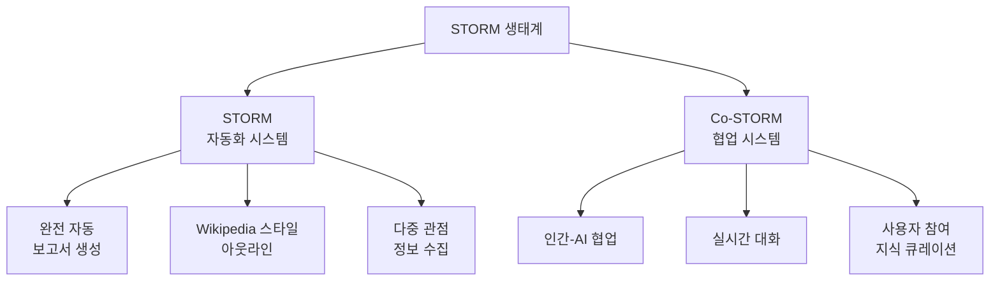

⏱️ **예상 읽기 시간**: 10분

## 서론

Stanford에서 개발한 **STORM(Synthesis of Topic Outlines through Retrieval and Multi-perspective Question Asking)**은 LLM 기반 지식 큐레이션 에이전트 시스템입니다. 🌟 **25.4k GitHub 스타**를 받은 이 프로젝트는 주제를 자동으로 연구하고 인용과 함께 전체 길이의 보고서를 생성하는 혁신적인 시스템입니다.

**STORM**은 단순한 텍스트 생성기가 아닙니다. 다양한 관점에서 질문을 제기하고, 정보를 수집하며, 체계적으로 조직화하여 Wikipedia 수준의 고품질 보고서를 작성하는 **지능형 에이전트 시스템**입니다.

이 가이드에서는 STORM과 Co-STORM의 핵심 기능, 실전 활용법, 그리고 커스터마이징 방법까지 완벽 정리해드리겠습니다.

## STORM 시스템 개요

### 핵심 특징

**STORM**은 다음과 같은 혁신적 특징을 가지고 있습니다:

- **자동 리서치**: 주제에 대해 다각도로 정보 수집
- **인용 시스템**: 모든 내용에 대한 출처 제공
- **체계적 구조**: Wikipedia 스타일의 계층적 아웃라인
- **다중 관점**: 여러 전문가 관점에서 접근
- **협업 모드**: Co-STORM으로 인간-AI 협업 지원
- **커스터마이징**: 다양한 도메인에 적용 가능

### STORM vs Co-STORM



## STORM 아키텍처 심화 분석

### 4개 핵심 모듈

**STORM**은 다음 4개 모듈로 구성됩니다:

#### 1. Knowledge Curation Module (지식 큐레이션)
```python
# 지식 수집 프로세스
class KnowledgeCurationModule:
    def __init__(self, retriever, llm):
        self.retriever = retriever  # Bing, Google 등
        self.llm = llm
    
    def collect_information(self, topic):
        """다양한 관점에서 정보 수집"""
        perspectives = self.generate_perspectives(topic)
        collected_info = []
        
        for perspective in perspectives:
            queries = self.generate_queries(topic, perspective)
            for query in queries:
                results = self.retriever.search(query)
                collected_info.extend(results)
        
        return self.deduplicate_and_filter(collected_info)
```

#### 2. Outline Generation Module (아웃라인 생성)
```python
# 계층적 아웃라인 생성
class OutlineGenerationModule:
    def generate_outline(self, collected_info, topic):
        """수집된 정보를 체계적으로 조직화"""
        key_concepts = self.extract_key_concepts(collected_info)
        hierarchy = self.build_hierarchy(key_concepts)
        
        outline = {
            "title": topic,
            "sections": []
        }
        
        for section in hierarchy:
            outline["sections"].append({
                "title": section["title"],
                "subsections": section["subsections"],
                "key_points": section["key_points"]
            })
        
        return outline
```

#### 3. Article Generation Module (기사 생성)
```python
# 아웃라인을 기반으로 기사 작성
class ArticleGenerationModule:
    def populate_outline(self, outline, knowledge_base):
        """아웃라인을 실제 내용으로 채우기"""
        article = {
            "title": outline["title"],
            "content": []
        }
        
        for section in outline["sections"]:
            section_content = self.write_section(
                section, 
                knowledge_base,
                citation_style="wikipedia"
            )
            article["content"].append(section_content)
        
        return article
```

#### 4. Article Polishing Module (기사 다듬기)
```python
# 최종 기사 개선
class ArticlePolishingModule:
    def polish_article(self, article):
        """기사의 품질과 일관성 향상"""
        polished = {
            "title": article["title"],
            "content": []
        }
        
        for section in article["content"]:
            # 문체 통일, 중복 제거, 인용 정리
            polished_section = self.improve_writing_quality(section)
            polished_section = self.verify_citations(polished_section)
            polished["content"].append(polished_section)
        
        return polished
```

## 실전 설치 및 사용법

### 1. 설치 과정

```bash
# pip를 통한 간단 설치
pip install knowledge-storm

# 또는 소스에서 설치
git clone https://github.com/stanford-oval/storm.git
cd storm
pip install -r requirements.txt
pip install -e .
```

### 2. API 키 설정

```toml
# secrets.toml 파일 생성
# ============ language model configurations ============ 
OPENAI_API_KEY="your_openai_api_key"
OPENAI_API_TYPE="openai"

# Azure OpenAI 사용시
OPENAI_API_TYPE="azure"
AZURE_API_BASE="your_azure_api_base_url"
AZURE_API_VERSION="your_azure_api_version"

# ============ retriever configurations ============ 
BING_SEARCH_API_KEY="your_bing_search_api_key"

# ============ encoder configurations ============ 
ENCODER_API_TYPE="openai"
```

### 3. 기본 STORM 사용법

```python
# 기본 STORM 사용 예시
from knowledge_storm import STORMWikiRunnerArguments, STORMWikiRunner
from knowledge_storm import STORMWikiLMConfigs

# 설정 초기화
lm_configs = STORMWikiLMConfigs()
runner_args = STORMWikiRunnerArguments(
    output_dir="./storm_output",
    max_conv_turn=5,
    max_perspective=5
)

# STORM 실행
runner = STORMWikiRunner(lm_configs)

# 주제 설정 및 실행
topic = "Artificial Intelligence in Healthcare"
runner.run(
    topic=topic,
    do_research=True,
    do_generate_outline=True,  
    do_generate_article=True,
    do_polish_article=True
)

# 결과 확인
print(f"Generated article saved to: {runner_args.output_dir}")
```

### 4. 명령줄 인터페이스

```bash
# 완전 자동 실행
python examples/storm_examples/run_storm_wiki_gpt.py \
    --output-dir ./results \
    --retriever bing \
    --do-research \
    --do-generate-outline \
    --do-generate-article \
    --do-polish-article

# 특정 단계만 실행
python examples/storm_examples/run_storm_wiki_gpt.py \
    --output-dir ./results \
    --retriever bing \
    --do-research  # 리서치만 수행
```

## Co-STORM: 협업 AI 시스템

### Co-STORM 개요

**Co-STORM**은 인간과 AI가 협업하여 지식을 큐레이션하는 혁신적 시스템입니다:

- **실시간 대화**: 사용자와 AI 에이전트 간 대화
- **다중 전문가**: 여러 AI 전문가가 협업
- **사용자 참여**: 언제든 대화에 개입 가능
- **동적 조정**: 사용자 피드백에 따라 방향 조정

### Co-STORM 사용법

```python
# Co-STORM 초기화 및 실행
from knowledge_storm import CoStormRunner

# Co-STORM 러너 생성
costorm_runner = CoStormRunner(
    args=costorm_args,
    lm_configs=lm_configs,
    rm=rm,
    conv_simulator_lm=conv_simulator_lm,
    topic=topic,
    callback_handler=StreamlitCallbackHandler()
)

# 협업 세션 시작
costorm_runner.warm_start()

# 대화 단계별 진행
conv_turn = costorm_runner.step()  # AI 에이전트들의 대화 관찰
costorm_runner.step(user_utterance="사용자 의견 추가")  # 사용자 개입

# 최종 보고서 생성
costorm_runner.knowledge_base.reorganize()
article = costorm_runner.generate_report()
```

### Co-STORM 실행 예시

```bash
# Co-STORM 실행 명령
python examples/costorm_examples/run_costorm_gpt.py \
    --output-dir ./costorm_results \
    --retriever bing
```

## 고급 커스터마이징

### 1. 사용자 정의 검색 엔진

```python
# 커스텀 검색 시스템 구현
from knowledge_storm.interface import Retriever

class CustomRetriever(Retriever):
    def __init__(self, custom_api_key):
        self.api_key = custom_api_key
    
    def retrieve(self, query, k=10):
        """사용자 정의 검색 로직"""
        # 사용자의 검색 시스템 연동
        results = self.search_custom_database(query)
        
        return [
            {
                "title": result["title"],
                "content": result["content"], 
                "url": result["url"]
            }
            for result in results[:k]
        ]
    
    def search_custom_database(self, query):
        # 커스텀 데이터베이스 검색 구현
        pass
```

### 2. 도메인별 특화 모듈

```python
# 의료 도메인 특화 STORM
class MedicalSTORMRunner(STORMWikiRunner):
    def __init__(self, lm_configs):
        super().__init__(lm_configs)
        
        # 의료 전문 프롬프트 설정
        self.medical_prompts = {
            "research": "의료 전문가 관점에서 연구하세요...",
            "outline": "의학 교과서 스타일로 구성하세요...",
            "article": "의료진이 이해하기 쉽게 작성하세요..."
        }
    
    def customize_for_medical_domain(self):
        """의료 도메인에 맞는 커스터마이징"""
        # 의료 용어집 로드
        self.load_medical_terminology()
        
        # 의료 인용 스타일 설정
        self.set_medical_citation_style()
```

### 3. 다양한 출력 형식

```python
# 다양한 보고서 형식 지원
class MultiFormatSTORM(STORMWikiRunner):
    def generate_report(self, format_type="wikipedia"):
        """다양한 형식의 보고서 생성"""
        base_content = super().generate_report()
        
        if format_type == "academic":
            return self.convert_to_academic_paper(base_content)
        elif format_type == "presentation":
            return self.convert_to_slides(base_content)
        elif format_type == "executive_summary":
            return self.create_executive_summary(base_content)
        else:
            return base_content
    
    def convert_to_academic_paper(self, content):
        """학술 논문 형식으로 변환"""
        return {
            "abstract": self.generate_abstract(content),
            "introduction": content["sections"][0],
            "literature_review": self.create_literature_review(content),
            "conclusion": content["sections"][-1],
            "references": content["citations"]
        }
```

## 실전 배포 가이드

### 1. Docker 컨테이너화

```dockerfile
# Dockerfile for STORM
FROM python:3.9-slim

# 시스템 패키지 설치
RUN apt-get update && apt-get install -y \
    git \
    build-essential \
    && rm -rf /var/lib/apt/lists/*

# STORM 설치
WORKDIR /app
COPY requirements.txt .
RUN pip install -r requirements.txt
RUN pip install knowledge-storm

# 애플리케이션 코드
COPY . .

# 환경 변수
ENV PYTHONPATH=/app
ENV STORM_OUTPUT_DIR=/app/outputs

# 서비스 포트
EXPOSE 8000

# 서비스 시작
CMD ["python", "storm_server.py"]
```

### 2. 웹 서비스 구현

```python
# FastAPI 기반 STORM 서비스
from fastapi import FastAPI, BackgroundTasks
from pydantic import BaseModel
import asyncio

app = FastAPI(title="STORM API", version="1.0.0")

class ResearchRequest(BaseModel):
    topic: str
    max_conv_turn: int = 5
    max_perspective: int = 5
    output_format: str = "wikipedia"

class ResearchResponse(BaseModel):
    task_id: str
    status: str
    result_url: str = None

@app.post("/research", response_model=ResearchResponse)
async def create_research_task(
    request: ResearchRequest, 
    background_tasks: BackgroundTasks
):
    task_id = generate_task_id()
    
    # 백그라운드에서 STORM 실행
    background_tasks.add_task(
        run_storm_research, 
        task_id, 
        request.topic,
        request.max_conv_turn,
        request.max_perspective
    )
    
    return ResearchResponse(
        task_id=task_id,
        status="processing"
    )

async def run_storm_research(task_id, topic, max_conv_turn, max_perspective):
    """백그라운드 STORM 실행"""
    try:
        runner = STORMWikiRunner(lm_configs)
        result = runner.run(
            topic=topic,
            do_research=True,
            do_generate_outline=True,
            do_generate_article=True,
            do_polish_article=True
        )
        
        # 결과 저장
        save_result(task_id, result)
        update_task_status(task_id, "completed")
        
    except Exception as e:
        update_task_status(task_id, "failed", str(e))

@app.get("/research/{task_id}")
async def get_research_result(task_id: str):
    """연구 결과 조회"""
    status = get_task_status(task_id)
    
    if status["status"] == "completed":
        result = load_result(task_id)
        return {
            "task_id": task_id,
            "status": "completed",
            "result": result
        }
    else:
        return {
            "task_id": task_id,
            "status": status["status"],
            "message": status.get("message")
        }
```

### 3. Kubernetes 배포

```yaml
# k8s-deployment.yaml
apiVersion: apps/v1
kind: Deployment
metadata:
  name: storm-api
spec:
  replicas: 3
  selector:
    matchLabels:
      app: storm-api
  template:
    metadata:
      labels:
        app: storm-api
    spec:
      containers:
      - name: storm-api
        image: your-registry/storm-api:latest
        ports:
        - containerPort: 8000
        env:
        - name: OPENAI_API_KEY
          valueFrom:
            secretKeyRef:
              name: storm-secrets
              key: openai-api-key
        - name: BING_SEARCH_API_KEY
          valueFrom:
            secretKeyRef:
              name: storm-secrets
              key: bing-api-key
        resources:
          requests:
            memory: "2Gi"
            cpu: "1000m"
          limits:
            memory: "4Gi"
            cpu: "2000m"
        volumeMounts:
        - name: storm-storage
          mountPath: /app/outputs
      volumes:
      - name: storm-storage
        persistentVolumeClaim:
          claimName: storm-pvc
---
apiVersion: v1
kind: Service
metadata:
  name: storm-service
spec:
  selector:
    app: storm-api
  ports:
  - port: 80
    targetPort: 8000
  type: LoadBalancer
```

## 성능 최적화 및 스케일링

### 1. 병렬 처리 최적화

```python
# 병렬 처리를 통한 성능 향상
import asyncio
from concurrent.futures import ThreadPoolExecutor

class OptimizedSTORMRunner:
    def __init__(self, max_workers=4):
        self.executor = ThreadPoolExecutor(max_workers=max_workers)
    
    async def parallel_research(self, topic, perspectives):
        """다중 관점 병렬 리서치"""
        tasks = []
        
        for perspective in perspectives:
            task = asyncio.create_task(
                self.research_perspective(topic, perspective)
            )
            tasks.append(task)
        
        results = await asyncio.gather(*tasks)
        return self.merge_research_results(results)
    
    async def research_perspective(self, topic, perspective):
        """특정 관점에서 리서치 수행"""
        loop = asyncio.get_event_loop()
        return await loop.run_in_executor(
            self.executor,
            self.single_perspective_research,
            topic,
            perspective
        )
```

### 2. 캐싱 시스템

```python
# 효율적인 캐싱 구현
from functools import lru_cache
import hashlib
import pickle

class STORMCache:
    def __init__(self, cache_dir="./storm_cache"):
        self.cache_dir = cache_dir
        os.makedirs(cache_dir, exist_ok=True)
    
    def get_cache_key(self, topic, parameters):
        """캐시 키 생성"""
        content = f"{topic}_{str(sorted(parameters.items()))}"
        return hashlib.md5(content.encode()).hexdigest()
    
    def get_cached_result(self, cache_key):
        """캐시된 결과 조회"""
        cache_file = os.path.join(self.cache_dir, f"{cache_key}.pkl")
        
        if os.path.exists(cache_file):
            with open(cache_file, 'rb') as f:
                return pickle.load(f)
        return None
    
    def save_to_cache(self, cache_key, result):
        """결과를 캐시에 저장"""
        cache_file = os.path.join(self.cache_dir, f"{cache_key}.pkl")
        
        with open(cache_file, 'wb') as f:
            pickle.dump(result, f)

# 캐시 적용 STORM 러너
class CachedSTORMRunner(STORMWikiRunner):
    def __init__(self, lm_configs):
        super().__init__(lm_configs)
        self.cache = STORMCache()
    
    def run_with_cache(self, topic, **kwargs):
        cache_key = self.cache.get_cache_key(topic, kwargs)
        cached_result = self.cache.get_cached_result(cache_key)
        
        if cached_result:
            print(f"Using cached result for: {topic}")
            return cached_result
        
        result = self.run(topic=topic, **kwargs)
        self.cache.save_to_cache(cache_key, result)
        
        return result
```

## 데이터셋 및 벤치마크

### FreshWiki 데이터셋

**FreshWiki**는 STORM 평가를 위한 고품질 데이터셋입니다:

- **규모**: 100개 고품질 Wikipedia 기사
- **기간**: 2022년 2월 ~ 2023년 9월 최다 편집 페이지
- **용도**: 자동 지식 큐레이션 연구

```python
# FreshWiki 데이터셋 활용
from datasets import load_dataset

# Hugging Face에서 데이터셋 로드
dataset = load_dataset("stanford-oval/FreshWiki")

# 평가 데이터 사용
for item in dataset["train"]:
    topic = item["title"]
    reference_article = item["content"]
    
    # STORM으로 기사 생성
    generated_article = storm_runner.run(topic=topic)
    
    # 품질 평가
    score = evaluate_quality(generated_article, reference_article)
    print(f"Topic: {topic}, Quality Score: {score}")
```

### WildSeek 데이터셋

**WildSeek**는 실제 사용자의 복잡한 정보 탐색 패턴을 담은 데이터셋입니다:

```python
# WildSeek 데이터셋으로 Co-STORM 평가
wildseek_data = load_dataset("stanford-oval/WildSeek")

for item in wildseek_data["train"]:
    topic = item["topic"]
    user_goal = item["user_goal"]
    
    # Co-STORM으로 협업 세션 시뮬레이션
    costorm_runner = CoStormRunner(topic=topic)
    costorm_runner.set_user_goal(user_goal)
    
    result = costorm_runner.collaborative_research()
    print(f"Topic: {topic}")
    print(f"User Goal: {user_goal}")
    print(f"Result Quality: {evaluate_result(result)}")
```

## 비교 분석: STORM vs 기존 시스템

### 기능 비교

| 기능 | STORM | ChatGPT | Claude | Perplexity |
|------|-------|---------|---------|------------|
| 자동 리서치 | ✅ | ❌ | ❌ | ✅ |
| 체계적 아웃라인 | ✅ | ❌ | ❌ | ❌ |
| 인용 시스템 | ✅ | ❌ | ❌ | ✅ |
| 다중 관점 | ✅ | ❌ | ❌ | ❌ |
| 협업 모드 | ✅ | ❌ | ❌ | ❌ |
| 커스터마이징 | ✅ | ❌ | ❌ | ❌ |

### 성능 벤치마크

```python
# 성능 비교 실험
def benchmark_systems():
    topics = [
        "Quantum Computing Applications",
        "Climate Change Mitigation Strategies", 
        "Artificial Intelligence Ethics"
    ]
    
    results = {
        "STORM": [],
        "ChatGPT": [],
        "Claude": [],
        "Perplexity": []
    }
    
    for topic in topics:
        # STORM 평가
        storm_result = storm_runner.run(topic=topic)
        storm_score = evaluate_comprehensive_quality(storm_result, topic)
        results["STORM"].append(storm_score)
        
        # 다른 시스템들과 비교...
    
    return results

# 평가 지표
def evaluate_comprehensive_quality(result, topic):
    """종합적 품질 평가"""
    metrics = {
        "factual_accuracy": evaluate_factual_accuracy(result),
        "completeness": evaluate_completeness(result, topic),
        "citation_quality": evaluate_citations(result),
        "structure_quality": evaluate_structure(result),
        "readability": evaluate_readability(result)
    }
    
    return sum(metrics.values()) / len(metrics)
```

## 실제 사용 사례

### 1. 교육 분야

```python
# 교육용 자료 생성
class EducationalSTORM(STORMWikiRunner):
    def generate_course_material(self, topic, education_level="university"):
        """교육 수준에 맞는 학습 자료 생성"""
        
        # 교육 수준별 커스터마이징
        if education_level == "high_school":
            complexity_level = "basic"
            citation_style = "simplified"
        elif education_level == "university":
            complexity_level = "intermediate"
            citation_style = "academic"
        else:
            complexity_level = "advanced"
            citation_style = "scholarly"
        
        result = self.run(
            topic=topic,
            complexity_level=complexity_level,
            citation_style=citation_style
        )
        
        # 학습 목표 및 퀴즈 추가
        result["learning_objectives"] = self.generate_learning_objectives(result)
        result["quiz_questions"] = self.generate_quiz(result)
        
        return result

# 사용 예시
edu_storm = EducationalSTORM(lm_configs)
course_material = edu_storm.generate_course_material(
    topic="Machine Learning Fundamentals",
    education_level="university"
)
```

### 2. 기업 리서치

```python
# 기업용 시장 분석 보고서
class BusinessSTORM(STORMWikiRunner):
    def generate_market_analysis(self, company_or_industry):
        """시장 분석 보고서 생성"""
        
        # 비즈니스 관점 설정
        business_perspectives = [
            "Market Size and Growth",
            "Competitive Landscape",
            "Consumer Trends",
            "Regulatory Environment",
            "Technology Disruption",
            "Investment Opportunities"
        ]
        
        result = self.run(
            topic=company_or_industry,
            perspectives=business_perspectives,
            citation_style="business"
        )
        
        # 비즈니스 인사이트 추가
        result["executive_summary"] = self.generate_executive_summary(result)
        result["swot_analysis"] = self.generate_swot_analysis(result)
        result["recommendations"] = self.generate_recommendations(result)
        
        return result

# 사용 예시
business_storm = BusinessSTORM(lm_configs)
market_report = business_storm.generate_market_analysis("Electric Vehicle Industry")
```

### 3. 저널리즘

```python
# 조사 보도용 리서치
class JournalismSTORM(STORMWikiRunner):
    def investigative_research(self, topic):
        """조사 보도를 위한 심층 리서치"""
        
        journalism_perspectives = [
            "Who (Key Players)",
            "What (Core Facts)",
            "When (Timeline)",
            "Where (Geographic Context)",
            "Why (Motivations and Causes)",
            "How (Mechanisms and Processes)"
        ]
        
        result = self.run(
            topic=topic,
            perspectives=journalism_perspectives,
            fact_checking=True,
            source_verification=True
        )
        
        # 저널리즘 요소 추가
        result["fact_check_report"] = self.generate_fact_check(result)
        result["source_credibility"] = self.assess_source_credibility(result)
        result["follow_up_questions"] = self.generate_follow_up_questions(result)
        
        return result
```

## 결론

**Stanford STORM**은 지식 큐레이션의 새로운 패러다임을 제시하는 혁신적인 시스템입니다. 🚀

### 주요 장점

1. **체계적 접근**: 4단계 모듈화된 파이프라인
2. **다중 관점**: 여러 전문가 시각에서 정보 수집
3. **인용 시스템**: 모든 내용에 대한 출처 제공
4. **협업 기능**: Co-STORM을 통한 인간-AI 협업
5. **커스터마이징**: 다양한 도메인에 적용 가능
6. **오픈소스**: MIT 라이선스로 자유로운 활용

### 활용 권장사항

- **연구자**: 문헌 조사 및 체계적 리뷰 작성
- **교육자**: 교육 자료 및 강의 노트 생성
- **기업**: 시장 분석 및 경쟁사 조사
- **저널리스트**: 조사 보도 및 팩트 체킹
- **학생**: 과제 및 프로젝트 리서치

**STORM**과 **Co-STORM**은 단순한 도구를 넘어 지식 작업의 방식을 근본적으로 변화시킬 잠재력을 가지고 있습니다. 25.4k GitHub 스타가 증명하듯이, 이미 많은 사용자들이 그 가치를 인정하고 있습니다.

여러분의 지식 큐레이션 워크플로우에 STORM을 도입해 보시기 바랍니다! 📚✨

---

**참고 링크**:
- [STORM GitHub 리포지토리](https://github.com/stanford-oval/storm)
- [STORM 공식 웹사이트](https://storm.genie.stanford.edu)
- [NAACL 2024 논문](https://aclanthology.org/2024.naacl-long.347/)
- [EMNLP 2024 Co-STORM 논문](https://aclanthology.org/2024.emnlp-main.554/)
- [FreshWiki 데이터셋](https://huggingface.co/datasets/stanford-oval/FreshWiki)
- [WildSeek 데이터셋](https://huggingface.co/datasets/stanford-oval/WildSeek) 