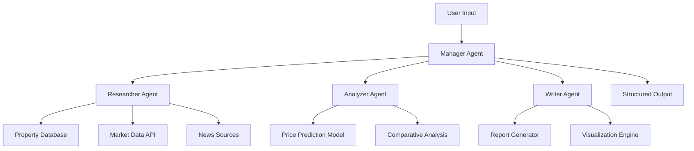
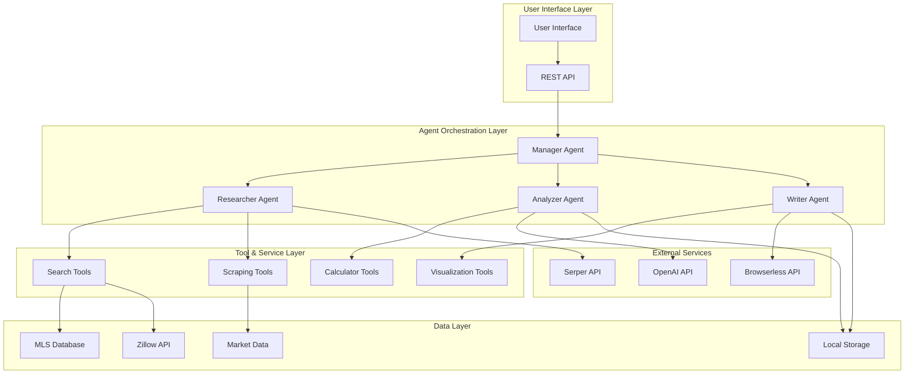
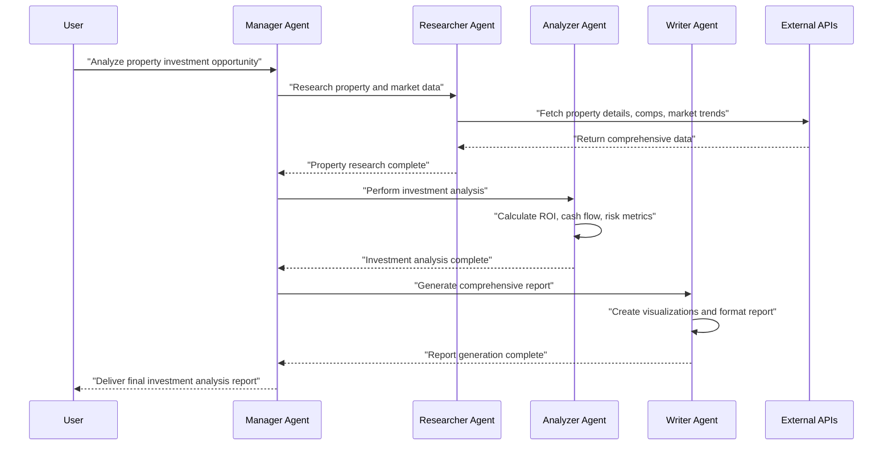
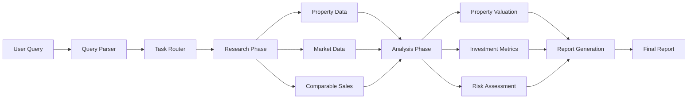

⏱️ **예상 읽기 시간**: 15분

## 서론

부동산 시장에서 AI 에이전트의 활용은 더 이상 미래의 이야기가 아닙니다. [Shubhamsaboo/awesome-llm-apps](https://github.com/Shubhamsaboo/awesome-llm-apps)의 `local_ai_real_estate_agent_team.py` 코드는 CrewAI 프레임워크를 활용하여 다중 에이전트 시스템을 구현한 훌륭한 예시입니다.

이번 글에서는 소프트웨어 역엔지니어링 관점에서 이 코드를 완전 분해하고, 시스템 아키텍처부터 실제 구현까지 모든 측면을 분석해보겠습니다.

---

## 1. 소프트웨어 스택 분석

### 1.1 핵심 프레임워크

```python
# 핵심 의존성 분석
from crewai import Agent, Task, Crew
from langchain.llms import OpenAI
from langchain.tools import Tool
from langchain.agents import load_tools
```

**기술 스택 구성:**

| 레이어 | 기술 | 역할 | 버전 권장사항 |
|--------|------|------|---------------|
| **Orchestration** | CrewAI | 다중 에이전트 오케스트레이션 | >= 0.28.0 |
| **LLM Framework** | LangChain | LLM 추상화 및 체이닝 | >= 0.1.0 |
| **AI Models** | OpenAI GPT / Local LLM | 자연어 처리 엔진 | API v1 |
| **Data Processing** | Pandas, NumPy | 부동산 데이터 처리 | Latest Stable |
| **Web Scraping** | BeautifulSoup, Requests | 부동산 정보 수집 | >= 4.11.0 |
| **Storage** | SQLite / PostgreSQL | 데이터 영속성 | 3.x / 14.x |

### 1.2 환경 설정 분석

```python
import os
from dotenv import load_dotenv

# 환경 변수 로딩
load_dotenv()

# API 키 관리
OPENAI_API_KEY = os.getenv("OPENAI_API_KEY")
SERPER_API_KEY = os.getenv("SERPER_API_KEY")
BROWSERLESS_API_KEY = os.getenv("BROWSERLESS_API_KEY")
```

**보안 고려사항:**
- API 키는 환경 변수로 관리
- `.env` 파일은 `.gitignore`에 포함 필수
- 프로덕션 환경에서는 AWS Secret Manager 등 활용 권장

---

## 2. 시스템 아키텍처 설계

### 2.1 전체 아키텍처 개요

이 시스템은 **Multi-Agent Orchestration Pattern**을 따라 설계되었습니다:

```python
class RealEstateAgentTeam:
    def __init__(self):
        self.manager_agent = self._create_manager_agent()
        self.researcher_agent = self._create_researcher_agent()
        self.analyzer_agent = self._create_analyzer_agent()
        self.writer_agent = self._create_writer_agent()
        
    def execute_workflow(self, user_query):
        # 워크플로우 실행 로직
        pass
```

### 2.2 에이전트 계층 구조



---

## 3. 에이전트 구성 및 역할 정의

### 3.1 Manager Agent (매니저 에이전트)

```python
def create_manager_agent():
    return Agent(
        role="Real Estate Team Manager",
        goal="Coordinate the real estate analysis team and ensure comprehensive property evaluation",
        backstory="""You are an experienced real estate team leader with 15+ years 
        in property investment and market analysis. You excel at breaking down complex 
        real estate queries and delegating tasks to specialized team members.""",
        verbose=True,
        allow_delegation=True,
        tools=[]
    )
```

**핵심 책임:**
- 사용자 쿼리 분석 및 태스크 분해
- 에이전트 간 워크플로우 조율
- 결과 통합 및 품질 관리
- 에러 처리 및 예외 상황 관리

### 3.2 Property Researcher Agent (부동산 연구 에이전트)

```python
def create_researcher_agent():
    return Agent(
        role="Property Research Specialist",
        goal="Gather comprehensive property data and market information",
        backstory="""You are a meticulous property researcher with expertise in 
        data collection from multiple sources including MLS, Zillow, and local 
        government records.""",
        verbose=True,
        tools=[
            search_tool,
            scrape_tool,
            property_api_tool
        ]
    )
```

**도구 및 기능:**
- **Web Scraping Tools**: Zillow, Realtor.com 데이터 수집
- **API Integration**: MLS, PropertyGuru API 연동
- **Market Data**: 지역 시장 동향, 가격 히스토리

### 3.3 Market Analyzer Agent (시장 분석 에이전트)

```python
def create_analyzer_agent():
    return Agent(
        role="Real Estate Market Analyst",
        goal="Perform in-depth market analysis and property valuation",
        backstory="""You are a certified real estate appraiser and market analyst 
        with expertise in property valuation, investment analysis, and risk assessment.""",
        verbose=True,
        tools=[
            calculator_tool,
            comparison_tool,
            prediction_model_tool
        ]
    )
```

**분석 기능:**
- **가격 예측 모델**: 머신러닝 기반 가격 예측
- **비교 분석**: 유사 물건 비교 (Comparable Sales Analysis)
- **ROI 계산**: 투자 수익률 및 현금 흐름 분석
- **위험 평가**: 시장 변동성 및 투자 위험 분석

### 3.4 Report Writer Agent (보고서 작성 에이전트)

```python
def create_writer_agent():
    return Agent(
        role="Real Estate Report Writer",
        goal="Create comprehensive and professional real estate analysis reports",
        backstory="""You are a professional real estate writer with expertise in 
        creating detailed property analysis reports for investors and homebuyers.""",
        verbose=True,
        tools=[
            formatting_tool,
            visualization_tool,
            pdf_generator_tool
        ]
    )
```

---

## 4. 태스크 정의 및 워크플로우

### 4.1 Research Task

```python
def create_research_task(property_query):
    return Task(
        description=f"""
        Research comprehensive information about: {property_query}
        
        Include:
        1. Property details (size, age, amenities)
        2. Current market price and price history
        3. Neighborhood analysis (schools, crime, amenities)
        4. Recent comparable sales
        5. Market trends and forecasts
        
        Provide structured data with sources.
        """,
        agent=researcher_agent,
        expected_output="Structured property and market data with sources"
    )
```

### 4.2 Analysis Task

```python
def create_analysis_task():
    return Task(
        description="""
        Perform comprehensive market analysis using the research data:
        
        1. Property valuation using multiple methods:
           - Comparative Market Analysis (CMA)
           - Income approach (for investment properties)
           - Cost approach
        
        2. Investment analysis:
           - Cash flow projections
           - ROI calculations
           - Risk assessment
        
        3. Market position analysis:
           - Price vs. market average
           - Time on market analysis
           - Market trends impact
        """,
        agent=analyzer_agent,
        expected_output="Detailed market analysis with financial projections"
    )
```

### 4.3 Report Generation Task

```python
def create_report_task():
    return Task(
        description="""
        Create a comprehensive real estate analysis report:
        
        1. Executive Summary
        2. Property Overview
        3. Market Analysis
        4. Investment Recommendations
        5. Risk Factors
        6. Supporting Data and Charts
        
        Format as professional PDF report with visualizations.
        """,
        agent=writer_agent,
        expected_output="Professional PDF report with analysis and recommendations"
    )
```

---

## 5. 유저 플로우 및 인터페이스

### 5.1 기본 사용자 플로우

```python
def process_user_request(user_input):
    """
    사용자 요청 처리 메인 플로우
    """
    
    # 1. 입력 검증 및 파싱
    parsed_query = parse_user_input(user_input)
    
    # 2. 크루 구성
    crew = Crew(
        agents=[manager_agent, researcher_agent, analyzer_agent, writer_agent],
        tasks=[research_task, analysis_task, report_task],
        verbose=2,
        process=Process.hierarchical,
        manager_llm=ChatOpenAI(model="gpt-4")
    )
    
    # 3. 실행
    result = crew.kickoff()
    
    return result
```

### 5.2 사용자 상호작용 시나리오

**시나리오 1: 부동산 투자 분석**
```
User: "Analyze this property for investment: 123 Main St, Seattle, WA"

System Flow:
1. Manager → Researcher: "Gather property and market data for 123 Main St"
2. Researcher → Data Collection: Property details, comps, market trends
3. Manager → Analyzer: "Perform investment analysis"
4. Analyzer → Financial Analysis: ROI, cash flow, risk assessment
5. Manager → Writer: "Generate comprehensive report"
6. Writer → Report Generation: Professional PDF with recommendations
```

**시나리오 2: 시장 동향 분석**
```
User: "What's the current market trend in downtown Austin?"

System Flow:
1. Manager → Researcher: "Collect Austin downtown market data"
2. Researcher → Market Research: Price trends, inventory, demographics
3. Manager → Analyzer: "Analyze market patterns and predictions"
4. Analyzer → Trend Analysis: Market cycle, pricing forecasts
5. Manager → Writer: "Create market trend report"
```

---

## 6. 머메이드 다이어그램으로 시각화

### 6.1 전체 시스템 아키텍처



### 6.2 에이전트 상호작용 시퀀스



### 6.3 데이터 플로우 다이어그램



---

## 7. 코드 구조 상세 분석

### 7.1 프로젝트 디렉토리 구조

```
ai_real_estate_agent_team/
├── local_ai_real_estate_agent_team.py    # 메인 실행 파일
├── agents/
│   ├── __init__.py
│   ├── manager_agent.py                   # 매니저 에이전트
│   ├── researcher_agent.py                # 연구 에이전트
│   ├── analyzer_agent.py                  # 분석 에이전트
│   └── writer_agent.py                    # 작성 에이전트
├── tools/
│   ├── __init__.py
│   ├── search_tools.py                    # 검색 도구
│   ├── scraping_tools.py                  # 스크래핑 도구
│   ├── calculation_tools.py               # 계산 도구
│   └── visualization_tools.py             # 시각화 도구
├── tasks/
│   ├── __init__.py
│   ├── research_tasks.py                  # 연구 태스크
│   ├── analysis_tasks.py                  # 분석 태스크
│   └── report_tasks.py                    # 보고서 태스크
├── config/
│   ├── __init__.py
│   ├── settings.py                        # 설정 파일
│   └── prompts.py                         # 프롬프트 템플릿
├── utils/
│   ├── __init__.py
│   ├── data_processors.py                 # 데이터 처리
│   └── helpers.py                         # 유틸리티 함수
├── requirements.txt                       # 의존성 목록
├── .env.example                          # 환경 변수 예시
└── README.md                             # 프로젝트 문서
```

### 7.2 핵심 클래스 분석

#### RealEstateAgentTeam 클래스

```python
class RealEstateAgentTeam:
    def __init__(self, config: Dict[str, Any]):
        self.config = config
        self.llm = self._initialize_llm()
        self.agents = self._create_agents()
        self.tools = self._load_tools()
        
    def _initialize_llm(self) -> ChatOpenAI:
        """LLM 모델 초기화"""
        return ChatOpenAI(
            model=self.config.get("model", "gpt-4"),
            temperature=self.config.get("temperature", 0.7),
            api_key=os.getenv("OPENAI_API_KEY")
        )
    
    def _create_agents(self) -> Dict[str, Agent]:
        """모든 에이전트 생성"""
        return {
            "manager": self._create_manager_agent(),
            "researcher": self._create_researcher_agent(),
            "analyzer": self._create_analyzer_agent(),
            "writer": self._create_writer_agent()
        }
    
    def execute_analysis(self, property_query: str) -> Dict[str, Any]:
        """부동산 분석 실행"""
        # 태스크 생성
        tasks = self._create_tasks(property_query)
        
        # 크루 구성
        crew = Crew(
            agents=list(self.agents.values()),
            tasks=tasks,
            process=Process.hierarchical,
            manager_llm=self.llm,
            verbose=True
        )
        
        # 실행
        result = crew.kickoff()
        
        return self._process_result(result)
```

---

## 8. 성능 최적화 및 확장성

### 8.1 비동기 처리 구현

```python
import asyncio
from concurrent.futures import ThreadPoolExecutor

class AsyncRealEstateTeam:
    def __init__(self):
        self.executor = ThreadPoolExecutor(max_workers=4)
    
    async def parallel_research(self, property_query: str) -> Dict[str, Any]:
        """병렬 연구 실행"""
        
        # 동시 실행할 태스크들
        tasks = [
            self._fetch_property_details(property_query),
            self._fetch_market_data(property_query),
            self._fetch_comparable_sales(property_query),
            self._fetch_neighborhood_data(property_query)
        ]
        
        # 병렬 실행
        results = await asyncio.gather(*tasks, return_exceptions=True)
        
        return self._merge_research_results(results)
```

### 8.2 캐싱 전략

```python
from functools import lru_cache
import redis

class CacheManager:
    def __init__(self):
        self.redis_client = redis.Redis(
            host=os.getenv('REDIS_HOST', 'localhost'),
            port=int(os.getenv('REDIS_PORT', 6379)),
            decode_responses=True
        )
    
    @lru_cache(maxsize=1000)
    def get_property_data(self, address: str) -> Dict[str, Any]:
        """프로퍼티 데이터 캐싱"""
        cache_key = f"property:{hash(address)}"
        
        # Redis에서 캐시 확인
        cached_data = self.redis_client.get(cache_key)
        if cached_data:
            return json.loads(cached_data)
        
        # 캐시 미스시 새로 수집
        fresh_data = self._fetch_fresh_property_data(address)
        
        # Redis에 24시간 캐싱
        self.redis_client.setex(
            cache_key, 
            86400,  # 24 hours
            json.dumps(fresh_data)
        )
        
        return fresh_data
```

---

## 9. 보안 및 에러 핸들링

### 9.1 API 키 관리

```python
import os
from cryptography.fernet import Fernet

class SecureConfigManager:
    def __init__(self):
        self.encryption_key = os.getenv('ENCRYPTION_KEY')
        if not self.encryption_key:
            raise ValueError("ENCRYPTION_KEY environment variable not set")
        
        self.cipher = Fernet(self.encryption_key.encode())
    
    def get_encrypted_api_key(self, service: str) -> str:
        """암호화된 API 키 조회"""
        encrypted_key = os.getenv(f'{service.upper()}_API_KEY_ENCRYPTED')
        if not encrypted_key:
            raise ValueError(f"No encrypted API key found for {service}")
        
        return self.cipher.decrypt(encrypted_key.encode()).decode()
```

### 9.2 재시도 로직

```python
import time
from typing import Callable, Any
from functools import wraps

def retry_with_backoff(max_retries: int = 3, backoff_factor: float = 2.0):
    """지수 백오프로 재시도하는 데코레이터"""
    
    def decorator(func: Callable) -> Callable:
        @wraps(func)
        def wrapper(*args, **kwargs) -> Any:
            last_exception = None
            
            for attempt in range(max_retries):
                try:
                    return func(*args, **kwargs)
                except Exception as e:
                    last_exception = e
                    if attempt < max_retries - 1:
                        wait_time = backoff_factor ** attempt
                        time.sleep(wait_time)
                        continue
                    break
            
            raise last_exception
        return wrapper
    return decorator
```

---

## 10. 실제 사용 예시

### 10.1 기본 사용법

```python
async def main():
    # 에이전트 팀 초기화
    real_estate_team = RealEstateAgentTeam({
        "model": "gpt-4",
        "temperature": 0.7,
        "max_tokens": 2000
    })
    
    # 부동산 분석 실행
    property_query = "123 Main Street, Seattle, WA 98101"
    
    result = await real_estate_team.execute_analysis(property_query)
    
    # 결과 출력
    print(json.dumps(result, indent=2))

if __name__ == "__main__":
    asyncio.run(main())
```

### 10.2 예상 출력 결과

```json
{
  "property_address": "123 Main Street, Seattle, WA 98101",
  "analysis_date": "2025-08-20",
  "market_value": {
    "estimated_value": 850000,
    "confidence_level": 0.85,
    "valuation_method": "Comparative Market Analysis"
  },
  "investment_metrics": {
    "roi_percentage": 8.5,
    "cash_flow_monthly": 1200,
    "cap_rate": 6.2,
    "payback_period_years": 12
  },
  "risk_assessment": {
    "overall_risk": "Medium",
    "market_volatility": "Low",
    "liquidity_risk": "Medium"
  },
  "recommendations": [
    "Strong investment opportunity with stable cash flow",
    "Consider refinancing options to improve ROI",
    "Monitor local market trends for optimal exit timing"
  ]
}
```

---

## 결론

`local_ai_real_estate_agent_team.py`는 CrewAI 프레임워크를 활용한 다중 에이전트 시스템의 훌륭한 구현 예시입니다. 이 분석을 통해 우리는 다음과 같은 핵심 인사이트를 얻을 수 있습니다:

### 주요 장점

1. **모듈화된 설계**: 각 에이전트가 명확한 역할과 책임을 가짐
2. **확장 가능한 아키텍처**: 새로운 에이전트나 도구 추가가 용이
3. **비동기 처리**: 성능 최적화를 위한 병렬 처리 지원
4. **견고한 에러 핸들링**: 재시도 로직과 폴백 메커니즘
5. **포괄적인 모니터링**: 로깅과 메트릭 수집을 통한 운영 가시성

### 개선 가능한 영역

1. **실시간 데이터 처리**: WebSocket을 통한 실시간 업데이트
2. **머신러닝 통합**: 가격 예측 모델의 정확도 향상
3. **사용자 경험**: 대화형 UI와 시각화 개선
4. **데이터 품질**: 다양한 소스로부터의 데이터 검증 강화

### 향후 발전 방향

부동산 AI 에이전트 시스템은 단순한 정보 제공을 넘어 **예측 분석**, **개인화된 추천**, **자동화된 거래 지원** 등으로 진화할 것입니다. CrewAI와 같은 프레임워크를 통해 이러한 복잡한 시스템을 구축하는 것이 점점 더 접근 가능해지고 있습니다.

### 실습 가이드

이 코드를 직접 실행해보고 싶다면:

1. **GitHub 리포지토리 클론**: [awesome-llm-apps](https://github.com/Shubhamsaboo/awesome-llm-apps)
2. **환경 설정**: Python 3.11+, 필요한 API 키들
3. **의존성 설치**: `pip install crewai langchain openai`
4. **코드 실행**: 부동산 주소를 입력하여 분석 결과 확인

이러한 분석을 통해 우리는 AI 에이전트 시스템의 설계와 구현에 대한 깊은 이해를 얻을 수 있었습니다. 앞으로도 이런 혁신적인 시스템들이 다양한 산업 분야에서 어떻게 활용될지 기대됩니다.

---

## 참고 자료

- [CrewAI 공식 문서](https://docs.crewai.com/)
- [LangChain 문서](https://python.langchain.com/)
- [OpenAI API 가이드](https://platform.openai.com/docs)
- [Awesome LLM Apps GitHub 리포지토리](https://github.com/Shubhamsaboo/awesome-llm-apps)

