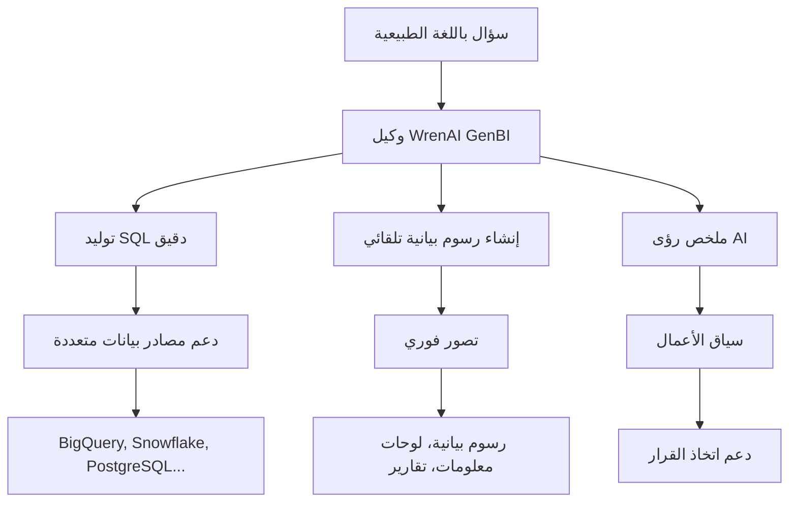
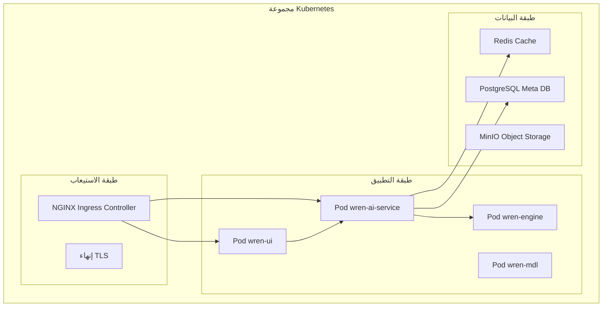

⏱️ **وقت القراءة المقدر**: 18 دقائق

## مقدمة

مع تسارع وتيرة ديمقراطية تحليل البيانات، تتنامى الحاجة إلى أدوات تتيح لمستخدمي الأعمال استخلاص الرؤى من البيانات دون تعلم SQL. **WrenAI** هو وكيل GenBI (ذكاء الأعمال التوليدي) مفتوح المصدر ومبتكر يلبي هذا الطلب.

بـ **8.5k نجمة على GitHub** و**836 نسخة مشعّبة**، يُعدّ WrenAI حلاً متكاملاً يحوّل الاستعلامات باللغة الطبيعية إلى SQL دقيق، ويوفر رسوماً بيانية للتصور الفوري، ويولّد رؤى مدعومة بالذكاء الاصطناعي. يتناول هذا المقال كل شيء من الميزات الجوهرية لـ WrenAI إلى معمارية النشر على مستوى المؤسسات في بيئة Kubernetes.

## نظرة عامة على WrenAI وقيمته الجوهرية

### ما هو وكيل GenBI؟

**GenBI (ذكاء الأعمال التوليدي)** هو نهج ذكاء أعمال من الجيل التالي يستفيد من الذكاء الاصطناعي التوليدي. يتجاوز قيود أدوات BI التقليدية: يطرح المستخدمون أسئلة باللغة الطبيعية، ويولّد الذكاء الاصطناعي SQL فوراً، وتُعرض النتائج مُصوَّرة.

### المميزات التنافسية الرئيسية لـ WrenAI



## الميزات الجوهرية والمعمارية

### 1. التحدث مع بياناتك

**الميزات الرئيسية**:
- **دعم متعدد اللغات**: طرح أسئلة بالكورية والعربية والإنجليزية والصينية وغيرها
- **فهم السياق**: التعرف التلقائي على مصطلحات ومقاييس مجال الأعمال
- **توليد SQL دقيق**: توليد استعلامات دقيقة استناداً إلى الطبقة الدلالية

**مثال على سيناريو**:
```sql
-- سؤال المستخدم: "ما فئة المنتجات الأكثر مبيعاً في الأشهر الثلاثة الماضية؟"
-- SQL المولّد من WrenAI:
SELECT 
    product_category,
    SUM(quantity) as total_quantity,
    SUM(revenue) as total_revenue
FROM sales_fact s
JOIN product_dim p ON s.product_id = p.product_id
JOIN date_dim d ON s.date_id = d.date_id
WHERE d.date >= DATE_SUB(CURRENT_DATE(), INTERVAL 3 MONTH)
GROUP BY product_category
ORDER BY total_quantity DESC
LIMIT 10;
```

### 2. رؤى GenBI

**ميزات التحليل التلقائي**:
- **تحليل الاتجاهات**: اكتشاف الأنماط والشذوذات في بيانات السلاسل الزمنية
- **اكتشاف الارتباطات**: تحديد العلاقات الخفية بين المقاييس
- **النمذجة التنبؤية**: توقع الاتجاهات المستقبلية وتحليل السيناريوهات

### 3. الطبقة الدلالية (MDL)

استخدام **MDL (لغة تعريف النموذج)**:
- **تجريد المخطط**: تعيين هياكل قواعد البيانات المعقدة على مصطلحات الأعمال
- **تعريفات المقاييس**: تعريفات متسقة لمقاييس الأعمال والمؤشرات
- **إدارة الربط**: معالجة تلقائية للعلاقات بين الجداول

```yaml
# مثال MDL: تعريف مقاييس العملاء
models:
  - name: customer_metrics
    description: "مقاييس العملاء الجوهرية"
    columns:
      - name: customer_id
        type: string
        primary_key: true
      
      - name: total_revenue
        type: float
        description: "إجمالي إيرادات العميل"
        sql: "SUM(orders.amount)"
        
      - name: avg_order_value
        type: float
        description: "متوسط قيمة الطلب"
        sql: "AVG(orders.amount)"
```

## معمارية النشر المؤسسي على Kubernetes

### المعمارية الكلية للنظام



### نشر المكونات الجوهرية

#### 1. wren-ui (الواجهة الأمامية)

```yaml
# wren-ui-deployment.yaml
apiVersion: apps/v1
kind: Deployment
metadata:
  name: wren-ui
  namespace: wrenai
spec:
  replicas: 3
  selector:
    matchLabels:
      app: wren-ui
  template:
    metadata:
      labels:
        app: wren-ui
    spec:
      containers:
      - name: wren-ui
        image: ghcr.io/canner/wrenai/wren-ui:latest
        ports:
        - containerPort: 3000
        env:
        - name: WREN_AI_SERVICE_URL
          value: "http://wren-ai-service:8000"
        resources:
          requests:
            memory: "512Mi"
            cpu: "250m"
          limits:
            memory: "1Gi"
            cpu: "500m"
```

#### 2. wren-ai-service (خدمة AI الجوهرية)

```yaml
# wren-ai-service-deployment.yaml
apiVersion: apps/v1
kind: Deployment
metadata:
  name: wren-ai-service
  namespace: wrenai
spec:
  replicas: 2
  selector:
    matchLabels:
      app: wren-ai-service
  template:
    metadata:
      labels:
        app: wren-ai-service
    spec:
      containers:
      - name: wren-ai-service
        image: ghcr.io/canner/wrenai/wren-ai-service:latest
        ports:
        - containerPort: 8000
        env:
        - name: OPENAI_API_KEY
          valueFrom:
            secretKeyRef:
              name: llm-secrets
              key: openai-api-key
        resources:
          requests:
            memory: "2Gi"
            cpu: "1000m"
          limits:
            memory: "4Gi"
            cpu: "2000m"
```

## الأمان والمصادقة

### تكوين RBAC

```yaml
# rbac.yaml
apiVersion: v1
kind: ServiceAccount
metadata:
  name: wrenai-service-account
  namespace: wrenai

---
apiVersion: rbac.authorization.k8s.io/v1
kind: Role
metadata:
  namespace: wrenai
  name: wrenai-role
rules:
- apiGroups: [""]
  resources: ["pods", "services", "endpoints"]
  verbs: ["get", "list", "watch"]
```

### سياسات الشبكة

```yaml
# network-policy.yaml
apiVersion: networking.k8s.io/v1
kind: NetworkPolicy
metadata:
  name: wrenai-network-policy
  namespace: wrenai
spec:
  podSelector:
    matchLabels:
      app: wren-ai-service
  policyTypes:
  - Ingress
  - Egress
  ingress:
  - from:
    - podSelector:
        matchLabels:
          app: wren-ui
    ports:
    - protocol: TCP
      port: 8000
```

## التوسع الأفقي للوحدات

```yaml
# hpa.yaml
apiVersion: autoscaling/v2
kind: HorizontalPodAutoscaler
metadata:
  name: wren-ai-service-hpa
  namespace: wrenai
spec:
  scaleTargetRef:
    apiVersion: apps/v1
    kind: Deployment
    name: wren-ai-service
  minReplicas: 2
  maxReplicas: 20
  metrics:
  - type: Resource
    resource:
      name: cpu
      target:
        type: Utilization
        averageUtilization: 70
  - type: Resource
    resource:
      name: memory
      target:
        type: Utilization
        averageUtilization: 80
```

## سيناريوهات النشر

### السيناريو 1: المؤسسات الصغيرة والمتوسطة (50-500 موظف)

```yaml
small_enterprise:
  cluster_size: "3 عقد"
  node_specs: "8 vCPU، 32GB RAM"
  
  deployment:
    wren_ui_replicas: 2
    wren_ai_service_replicas: 1
    wren_engine_replicas: 1
    
  estimated_costs:
    infrastructure: "$800-1200/شهر"
    llm_api_costs: "$300-800/شهر"
    total: "$1100-2000/شهر"
    
  supported_users: "50-100 مستخدم متزامن"
```

### السيناريو 2: المؤسسات الكبيرة (1000+ موظف)

```yaml
large_enterprise:
  cluster_size: "10+ عقد"
  node_specs: "16 vCPU، 64GB RAM"
  
  deployment:
    wren_ui_replicas: 5
    wren_ai_service_replicas: 10
    wren_engine_replicas: 5
    
  estimated_costs:
    infrastructure: "$5000-8000/شهر"
    llm_api_costs: "$2000-5000/شهر"
    total: "$7000-13000/شهر"
    
  supported_users: "500+ مستخدم متزامن"
```

## الخلاصة

WrenAI هو وكيل GenBI مبتكر يتخطى حدود أدوات BI التقليدية. من خلال واجهة اللغة الطبيعية، والطبقة الدلالية القوية، ودعم نماذج LLM المتعددة، يحقق ديمقراطية تحليل البيانات.

### ملخص المزايا الرئيسية

- **8.5k نجمة على GitHub**: حل مفتوح المصدر مُجرَّب
- **دعم 12 مصدر بيانات**: من السحابة إلى الأجهزة المحلية
- **تكامل 10 نماذج LLM**: الاستفادة من أحدث نماذج AI
- **جاهزية مؤسسية**: Kubernetes-native، توافر عالٍ، أمان مؤسسي

---

**المراجع**:
- [مستودع WrenAI على GitHub](https://github.com/Canner/WrenAI)
- [الوثائق الرسمية لـ WrenAI](https://getwren.ai/oss)
