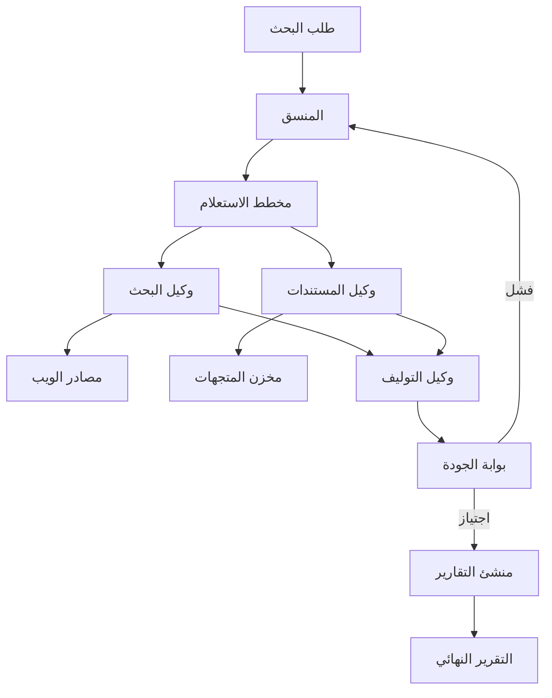

⏱️ **وقت القراءة المقدر**: 20 دقائق

## مقدمة

**LangChain Open Deep Research** هو نظام متعدد الوكلاء مفتوح المصدر مصمم لأتمتة مهام البحث المعقدة من البداية إلى النهاية. يجمع البحث على الويب واسترجاع المستندات والتوليف وإنشاء التقارير في خط أنابيب منسّق حيث تتعامل وكلاء متخصصة مع مراحل متمايزة من عملية البحث.

يتناول هذا الدليل المعمارية الكاملة من المفاهيم الجوهرية إلى النشر الإنتاجي، بما في ذلك تصميم الوكيل المركز على الجودة، وأنماط تنسيق الوكلاء المتعددة، وRAG المتقدم، والتكيفات الخاصة بالمجالات للبحث المالي والطبي.

## نظرة عامة على معمارية النظام

يستخدم Open Deep Research معمارية وكيل محور وأذرع مبنية على LangGraph:



## الوكيل المركز على الجودة

```python
from langchain_core.prompts import ChatPromptTemplate
from langchain_anthropic import ChatAnthropic
from langgraph.graph import StateGraph, END
from typing import TypedDict, List, Optional
import asyncio

class ResearchState(TypedDict):
    query: str
    sub_queries: List[str]
    search_results: List[dict]
    synthesized_content: str
    quality_score: float
    final_report: Optional[str]
    iteration: int

class QualityFocusedAgent:
    def __init__(
        self,
        model: str = "claude-3-7-sonnet-latest",
        quality_threshold: float = 0.8,
        max_iterations: int = 3
    ):
        self.llm = ChatAnthropic(model=model)
        self.quality_threshold = quality_threshold
        self.max_iterations = max_iterations
        self.graph = self._build_graph()

    def _build_graph(self) -> StateGraph:
        workflow = StateGraph(ResearchState)

        workflow.add_node("plan_queries", self._plan_queries)
        workflow.add_node("search", self._parallel_search)
        workflow.add_node("synthesize", self._synthesize)
        workflow.add_node("evaluate_quality", self._evaluate_quality)
        workflow.add_node("generate_report", self._generate_report)

        workflow.set_entry_point("plan_queries")
        workflow.add_edge("plan_queries", "search")
        workflow.add_edge("search", "synthesize")
        workflow.add_edge("synthesize", "evaluate_quality")
        workflow.add_conditional_edges(
            "evaluate_quality",
            self._quality_router,
            {
                "retry": "plan_queries",
                "pass": "generate_report",
                "max_retries": END
            }
        )
        workflow.add_edge("generate_report", END)

        return workflow.compile()

    async def _plan_queries(self, state: ResearchState) -> ResearchState:
        prompt = ChatPromptTemplate.from_template(
            "قسّم استعلام البحث هذا إلى 3-5 استعلامات فرعية محددة "
            "تغطي معاً الموضوع بشكل شامل.\n\nالاستعلام: {query}"
        )
        response = await self.llm.ainvoke(prompt.format_messages(query=state["query"]))
        sub_queries = self._parse_sub_queries(response.content)
        return {**state, "sub_queries": sub_queries}

    async def _parallel_search(self, state: ResearchState) -> ResearchState:
        tasks = [self._search_one(q) for q in state["sub_queries"]]
        results = await asyncio.gather(*tasks, return_exceptions=True)
        flat_results = []
        for r in results:
            if isinstance(r, list):
                flat_results.extend(r)
        return {**state, "search_results": flat_results}

    async def _synthesize(self, state: ResearchState) -> ResearchState:
        context = self._format_results(state["search_results"])
        prompt = ChatPromptTemplate.from_template(
            "لخّص نتائج البحث التالية في ملخص متماسك وحقائقي للاستعلام: {query}\n\nالمصادر:\n{context}"
        )
        response = await self.llm.ainvoke(
            prompt.format_messages(query=state["query"], context=context)
        )
        return {**state, "synthesized_content": response.content}

    async def _evaluate_quality(self, state: ResearchState) -> ResearchState:
        prompt = ChatPromptTemplate.from_template(
            "قيّم جودة هذا التلخيص البحثي على مقياس من 0.0 إلى 1.0. "
            "اعتبر: الدقة الحقائقية، والاكتمال، وتنوع المصادر، والوضوح.\n\n"
            "الاستعلام: {query}\n\nالتلخيص: {synthesis}\n\n"
            "أجب بالنقاط فقط، مثلاً: 0.85"
        )
        response = await self.llm.ainvoke(
            prompt.format_messages(
                query=state["query"],
                synthesis=state["synthesized_content"]
            )
        )
        try:
            score = float(response.content.strip())
        except ValueError:
            score = 0.5
        return {**state, "quality_score": score}

    def _quality_router(self, state: ResearchState) -> str:
        if state["iteration"] >= self.max_iterations:
            return "max_retries"
        if state["quality_score"] >= self.quality_threshold:
            return "pass"
        return "retry"

    async def _generate_report(self, state: ResearchState) -> ResearchState:
        prompt = ChatPromptTemplate.from_template(
            "أنشئ تقرير بحثي شاملاً بناءً على هذا التلخيص.\n\n"
            "الاستعلام: {query}\n\nالتلخيص: {synthesis}"
        )
        response = await self.llm.ainvoke(
            prompt.format_messages(
                query=state["query"],
                synthesis=state["synthesized_content"]
            )
        )
        return {**state, "final_report": response.content}

    def _parse_sub_queries(self, content: str) -> List[str]:
        lines = [l.strip() for l in content.split("\n") if l.strip()]
        return [l.lstrip("0123456789.-) ") for l in lines if len(l) > 10][:5]

    def _format_results(self, results: List[dict]) -> str:
        return "\n\n".join(
            f"المصدر: {r.get('url', 'غير معروف')}\n{r.get('content', '')}"
            for r in results[:10]
        )

    async def research(self, query: str) -> str:
        initial_state = ResearchState(
            query=query,
            sub_queries=[],
            search_results=[],
            synthesized_content="",
            quality_score=0.0,
            final_report=None,
            iteration=0
        )
        final_state = await self.graph.ainvoke(initial_state)
        return final_state.get("final_report", "تعذّر إكمال البحث.")
```

## نظام البحث متعدد الوكلاء

```python
from dataclasses import dataclass, field
import asyncio

@dataclass
class ResearchTask:
    task_id: str
    topic: str
    depth: str = "شامل"
    domains: List[str] = field(default_factory=list)

class MultiAgentResearchSystem:
    def __init__(self, num_workers: int = 4):
        self.num_workers = num_workers
        self.agents: dict = {}
        self.task_queue: asyncio.Queue = asyncio.Queue()
        self.results: dict = {}

    def _get_or_create_agent(self, domain: str) -> QualityFocusedAgent:
        if domain not in self.agents:
            self.agents[domain] = QualityFocusedAgent(
                model="claude-3-7-sonnet-latest",
                quality_threshold=0.82
            )
        return self.agents[domain]

    async def _worker(self, worker_id: int):
        while True:
            task: ResearchTask = await self.task_queue.get()
            try:
                domain = task.domains[0] if task.domains else "عام"
                agent = self._get_or_create_agent(domain)
                result = await agent.research(task.topic)
                self.results[task.task_id] = result
            except Exception as e:
                self.results[task.task_id] = f"خطأ: {e}"
            finally:
                self.task_queue.task_done()

    async def run(self, tasks: List[ResearchTask]) -> dict:
        workers = [
            asyncio.create_task(self._worker(i))
            for i in range(self.num_workers)
        ]
        for task in tasks:
            await self.task_queue.put(task)
        await self.task_queue.join()
        for w in workers:
            w.cancel()
        return self.results
```

## نظام RAG المتقدم

```python
from langchain_community.vectorstores import Chroma
from langchain_anthropic import ChatAnthropic
from langchain_openai import OpenAIEmbeddings
from langchain_core.documents import Document
from typing import List

class AdvancedRAGSystem:
    def __init__(
        self,
        vector_store_path: str = "./chroma_db",
        top_k: int = 10,
        rerank_top_k: int = 4
    ):
        self.embeddings = OpenAIEmbeddings(model="text-embedding-3-large")
        self.llm = ChatAnthropic(model="claude-3-7-sonnet-latest")
        self.top_k = top_k
        self.rerank_top_k = rerank_top_k

        self.vector_store = Chroma(
            persist_directory=vector_store_path,
            embedding_function=self.embeddings
        )

    def add_documents(self, docs: List[Document]) -> None:
        self.vector_store.add_documents(docs)

    async def query(self, question: str) -> dict:
        retriever = self.vector_store.as_retriever(
            search_kwargs={"k": self.top_k}
        )
        docs = retriever.get_relevant_documents(question)
        context = "\n\n".join(d.page_content for d in docs[:self.rerank_top_k])

        prompt = (
            f"أجب على السؤال التالي مستخدماً السياق المقدم فقط.\n\n"
            f"السؤال: {question}\n\nالسياق:\n{context}"
        )
        response = await self.llm.ainvoke(prompt)

        return {
            "answer": response.content,
            "sources": [d.metadata.get("source", "غير معروف") for d in docs[:self.rerank_top_k]],
            "num_sources": min(len(docs), self.rerank_top_k)
        }
```

## الوكلاء الخاصة بالمجالات

### وكيل البحث المالي

```python
class FinancialResearchAgent(QualityFocusedAgent):
    def __init__(self):
        super().__init__(
            model="claude-3-7-sonnet-latest",
            quality_threshold=0.88,
            max_iterations=4
        )
        self.financial_prompt_suffix = (
            "\n\nمهم: هذا بحث مالي. "
            "ميّز بوضوح بين الحقائق والتوقعات. "
            "أدرج عوامل المخاطر ذات الصلة. "
            "لا تقدم توصيات استثمارية. "
            "استشهد بجميع البيانات الكمية مع مصدرها وتاريخها."
        )

    async def research_company(self, ticker: str, aspects: List[str] = None) -> dict:
        if aspects is None:
            aspects = ["نموذج الأعمال", "المالية", "الوضع التنافسي", "المخاطر"]

        tasks = [
            self.research(f"{ticker} {aspect}{self.financial_prompt_suffix}")
            for aspect in aspects
        ]
        results = await asyncio.gather(*tasks)

        return {
            "ticker": ticker,
            "sections": dict(zip(aspects, results)),
            "generated_at": "2025-07-17"
        }
```

### وكيل البحث الطبي

```python
class MedicalResearchAgent(QualityFocusedAgent):
    def __init__(self):
        super().__init__(
            model="claude-3-7-sonnet-latest",
            quality_threshold=0.92,
            max_iterations=5
        )
        self.disclaimer = (
            "\n\nتنبيه: هذا لأغراض إعلامية فقط ولا يُشكّل نصيحة طبية. "
            "استشر متخصصي الرعاية الصحية المؤهلين للقرارات الطبية."
        )

    async def research_condition(self, condition: str) -> dict:
        sections = {
            "نظرة عامة": f"نظرة عامة وانتشار {condition}",
            "الفيزيولوجيا المرضية": f"الفيزيولوجيا المرضية وآليات {condition}",
            "التشخيص": f"معايير وأساليب تشخيص {condition}",
            "العلاج": f"العلاجات الحالية المبنية على الأدلة لـ {condition}",
            "البحث": f"التجارب السريرية الحديثة والتطورات البحثية في {condition}"
        }

        tasks = [self.research(q) for q in sections.values()]
        results = await asyncio.gather(*tasks)

        return {
            "condition": condition,
            "sections": dict(zip(sections.keys(), results)),
            "disclaimer": self.disclaimer.strip()
        }
```

## التكامل الإنتاجي مع Slack

```python
from slack_sdk.web.async_client import AsyncWebClient
from slack_sdk.errors import SlackApiError

class ResearchNotificationService:
    def __init__(self, slack_token: str, default_channel: str):
        self.slack = AsyncWebClient(token=slack_token)
        self.default_channel = default_channel

    async def post_research_complete(
        self,
        channel: str,
        topic: str,
        report: str,
        quality_score: float,
        thread_ts: str = None
    ):
        summary = report[:500] + "..." if len(report) > 500 else report
        blocks = [
            {
                "type": "header",
                "text": {"type": "plain_text", "text": f"اكتمل البحث: {topic[:50]}"}
            },
            {
                "type": "section",
                "text": {
                    "type": "mrkdwn",
                    "text": f"*درجة الجودة:* {quality_score:.0%}\n\n{summary}"
                }
            }
        ]

        try:
            response = await self.slack.chat_postMessage(
                channel=channel or self.default_channel,
                blocks=blocks,
                thread_ts=thread_ts
            )
            if len(report) > 500:
                await self.slack.chat_postMessage(
                    channel=channel or self.default_channel,
                    text=f"*التقرير الكامل:*\n\n{report}",
                    thread_ts=response["ts"]
                )
        except SlackApiError as e:
            print(f"خطأ Slack: {e.response['error']}")
```

## النشر على Kubernetes

```yaml
apiVersion: apps/v1
kind: Deployment
metadata:
  name: open-deep-research
  namespace: ai-research
spec:
  replicas: 3
  selector:
    matchLabels:
      app: open-deep-research
  template:
    metadata:
      labels:
        app: open-deep-research
      annotations:
        prometheus.io/scrape: "true"
        prometheus.io/port: "9090"
    spec:
      containers:
      - name: research-service
        image: your-registry/open-deep-research:latest
        ports:
        - containerPort: 8000
          name: http
        - containerPort: 9090
          name: metrics
        env:
        - name: ANTHROPIC_API_KEY
          valueFrom:
            secretKeyRef:
              name: ai-keys
              key: anthropic
        - name: OPENAI_API_KEY
          valueFrom:
            secretKeyRef:
              name: ai-keys
              key: openai
        resources:
          requests:
            memory: "2Gi"
            cpu: "1000m"
          limits:
            memory: "4Gi"
            cpu: "2000m"
        livenessProbe:
          httpGet:
            path: /health
            port: 8000
          initialDelaySeconds: 30
          periodSeconds: 15
---
apiVersion: autoscaling/v2
kind: HorizontalPodAutoscaler
metadata:
  name: research-hpa
  namespace: ai-research
spec:
  scaleTargetRef:
    apiVersion: apps/v1
    kind: Deployment
    name: open-deep-research
  minReplicas: 2
  maxReplicas: 15
  metrics:
  - type: Resource
    resource:
      name: cpu
      target:
        type: Utilization
        averageUtilization: 65
```

## طبقة خدمة FastAPI

```python
from fastapi import FastAPI, BackgroundTasks, HTTPException
from pydantic import BaseModel
from uuid import uuid4

app = FastAPI(title="Open Deep Research API")
research_system = MultiAgentResearchSystem(num_workers=4)
task_store: dict = {}

class ResearchRequest(BaseModel):
    topic: str
    domain: str = "عام"
    depth: str = "شامل"

@app.post("/research")
async def submit_research(
    request: ResearchRequest,
    background_tasks: BackgroundTasks
):
    task_id = str(uuid4())
    task_store[task_id] = {"status": "في قائمة الانتظار", "result": None}
    background_tasks.add_task(
        _run_research, task_id, request.topic, request.domain
    )
    return {"task_id": task_id, "status": "في قائمة الانتظار"}

async def _run_research(task_id: str, topic: str, domain: str):
    task_store[task_id]["status"] = "قيد التشغيل"
    try:
        task = ResearchTask(task_id=task_id, topic=topic, domains=[domain])
        results = await research_system.run([task])
        task_store[task_id]["status"] = "مكتمل"
        task_store[task_id]["result"] = results.get(task_id)
    except Exception as e:
        task_store[task_id]["status"] = "فشل"
        task_store[task_id]["error"] = str(e)

@app.get("/research/{task_id}")
async def get_research(task_id: str):
    if task_id not in task_store:
        raise HTTPException(status_code=404, detail="المهمة غير موجودة")
    return task_store[task_id]

@app.get("/health")
async def health():
    return {"status": "ok"}
```

## الخلاصة والتوصيات

يوفر LangChain Open Deep Research أساساً متيناً لأتمتة مهام البحث المعقدة متعددة الخطوات. المعمارية معيارية بما يكفي للتكيف مع مجالات متنوعة مع الحفاظ على معايير الجودة من خلال التحسين التكراري.

**متى تستخدمه:**
- موضوعات البحث التي تتطلب توليف المعلومات من مصادر عديدة
- سير عمل البحث المتكررة (الاستخبارات التنافسية، مراجعات الأدبيات)
- الفرق التي تحتاج إلى مخرجات بحثية منظمة ومستشهداً بها على نطاق واسع

**قرارات معمارية رئيسية:**
- استخدم `QualityFocusedAgent` كأساس لجميع الوكلاء الخاصة بالمجالات
- اضبط عتبات الجودة بشكل محافظ (0.85+) للمخرجات العامة
- انشر النظام متعدد الوكلاء خلف قائمة انتظار مهام للأحمال الكبيرة
- أضف مقاييس Prometheus من اليوم الأول لتتبع تكاليف الرموز وأنماط الجودة

---

**المراجع**:
- [LangChain Open Deep Research](https://github.com/langchain-ai/open_deep_research)
- [وثائق LangGraph](https://langchain-ai.github.io/langgraph/)
- [وثائق LangChain](https://python.langchain.com/docs/introduction/)
- [Anthropic Claude API](https://docs.anthropic.com/)
