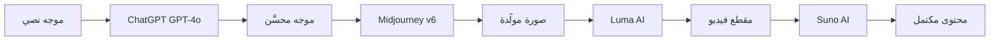

⏱️ **وقت القراءة المقدر**: 15 دقيقة

## مقدمة

مع تزايد خدمات الذكاء الاصطناعي، أصبحت إدارة منصات متعددة ومنفصلة عبئاً حقيقياً على الإنتاجية. **ChatGPT Web Midjourney Proxy** مشروع مفتوح المصدر يعالج هذه المشكلة مباشرةً بدمج ChatGPT وMidjourney وGPTs وSuno وLuma في واجهة ويب واحدة.

يغطي هذا الدليل كل ما تحتاج معرفته، من إعداد البيئة إلى النشر الإنتاجي واستراتيجيات AgentOps المتقدمة.

## نظرة عامة على المشروع

ChatGPT Web Midjourney Proxy منصة إدارة ذكاء اصطناعي موحدة مبنية على الإمكانيات الأساسية التالية:

### خدمات الذكاء الاصطناعي المدعومة

| الفئة | الخدمات | ملاحظات |
|-------|----------|---------|
| **الذكاء الاصطناعي المحادثاتي** | ChatGPT GPT-3.5/4/4o | دعم نماذج متعددة |
| **توليد الصور** | Midjourney v6 | دعم الوضع الكامل |
| **عوامل مخصصة** | GPT Store | آلاف GPTs المجتمعية |
| **توليد الموسيقى** | Suno | إنشاء أغانٍ بناءً على كلمات |
| **توليد الفيديو** | Luma وRunway وPika | متعدد المحركات |
| **واجهة برمجة فورية** | Realtime API | بث صوتي ونصي |

### مجموعة التقنيات

```json
{
  "frontend": {
    "framework": "Vue.js 3.5.18",
    "ui_library": "Naive UI 2.42.0",
    "css_framework": "Tailwind CSS 3.4.17",
    "state_management": "Pinia 2.3.1",
    "build_tool": "Vite 4.5.14",
    "language": "TypeScript 4.9.5"
  },
  "deployment": {
    "container": "Docker",
    "proxy": "Nginx",
    "orchestration": "Kubernetes (اختياري)"
  }
}
```

## إعداد البيئة

### متطلبات النظام

- **Docker**: 28.2.2 أو أحدث
- **Node.js**: 22.17.1 أو أحدث (للتطوير المحلي)
- **pnpm**: 10.13.1 أو أحدث

### إعداد macOS

```bash
# تثبيت Homebrew (إن لم يكن مثبتاً)
/bin/bash -c "$(curl -fsSL https://raw.githubusercontent.com/Homebrew/install/HEAD/install.sh)"

# تثبيت Node.js
brew install node

# تثبيت pnpm
npm install -g pnpm

# التحقق من التثبيت
node --version    # v22.17.1
pnpm --version    # 10.13.1
```

### تثبيت تبعيات المشروع

```bash
# استنساخ المستودع
git clone https://github.com/Dooy/chatgpt-web-midjourney-proxy.git
cd chatgpt-web-midjourney-proxy

# تثبيت التبعيات
pnpm install

# التحقق من الحزم المثبتة
pnpm list
```

**مثال مخرجات التثبيت:**
```
packages/
  chatgpt-web-midjourney-proxy@1.0.0 (node_modules/.pnpm)
  ├── vue@3.5.18
  ├── naive-ui@2.42.0
  ├── pinia@2.3.1
  └── ... (907 حزمة)
```

## التهيئة

### متغيرات البيئة

أنشئ ملف `.env.local`:

```bash
# تهيئة OpenAI API
OPENAI_API_KEY=sk-xxxxxxxxxxxxxxxxxxxxxxxxxxxxxxxx
OPENAI_API_BASE_URL=https://api.openai.com

# تهيئة Midjourney (MJ-Proxy)
MJ_SERVER=https://your-mj-proxy-server.com
MJ_API_SECRET=your-mj-api-secret

# توليد الموسيقى بـ Suno
SUNO_API_URL=https://api.suno.ai
SUNO_API_KEY=your-suno-key

# توليد الفيديو بـ Luma
LUMA_API_URL=https://api.lumalabs.ai
LUMA_API_KEY=your-luma-key

# إعدادات الأمان
AUTH_SECRET_KEY=your-random-secret-key-here

# Cloudflare R2 (تخزين الملفات)
R2_ACCOUNT_ID=your-r2-account-id
R2_ACCESS_KEY_ID=your-r2-access-key
R2_SECRET_ACCESS_KEY=your-r2-secret-key
R2_BUCKET_NAME=your-r2-bucket-name
R2_PUBLIC_URL=https://your-r2-public-url.com
```

### إعداد Docker Compose

```yaml
# docker-compose.yml
version: '3.8'

services:
  chatgpt-web:
    image: ydlhero/chatgpt-web-midjourney-proxy:latest
    container_name: chatgpt-web-mj
    restart: unless-stopped
    ports:
      - "6050:3002"
    environment:
      - OPENAI_API_KEY=${OPENAI_API_KEY}
      - OPENAI_API_BASE_URL=${OPENAI_API_BASE_URL}
      - MJ_SERVER=${MJ_SERVER}
      - MJ_API_SECRET=${MJ_API_SECRET}
      - AUTH_SECRET_KEY=${AUTH_SECRET_KEY}
    volumes:
      - ./data:/app/data
      - ./logs:/app/logs
    networks:
      - ai-platform-network

networks:
  ai-platform-network:
    driver: bridge
```

### التشغيل باستخدام Docker Compose

```bash
# تشغيل الحاويات
docker-compose up -d

# التحقق من الحالة
docker-compose ps

# فحص السجلات
docker-compose logs -f chatgpt-web
```

## خادم التطوير المحلي

### تشغيل خادم التطوير

```bash
# تشغيل خادم التطوير
pnpm dev

# البناء للإنتاج
pnpm build

# معاينة بناء الإنتاج
pnpm preview
```

**المخرجات المتوقعة:**
```
  VITE v4.5.14  ready in 1247 ms

  ➜  Local:   http://localhost:1002/
  ➜  Network: use --host to expose
```

## إعداد Cloudflare R2

يُستخدم Cloudflare R2 لتخزين الصور والفيديوهات المولَّدة:

```bash
# تثبيت Wrangler CLI
npm install -g wrangler

# تسجيل الدخول
wrangler login

# إنشاء دلو R2
wrangler r2 bucket create ai-platform-storage

# تعيين سياسة CORS
cat > cors.json << 'EOF'
[
  {
    "AllowedOrigins": ["*"],
    "AllowedMethods": ["GET", "PUT", "POST", "DELETE"],
    "AllowedHeaders": ["*"],
    "MaxAgeSeconds": 3600
  }
]
EOF

wrangler r2 bucket cors put ai-platform-storage --rules cors.json
```

## تهيئة الأمان

### الحماية من القوة الغاشمة

```javascript
// src/middleware/rateLimiter.ts
import rateLimit from 'express-rate-limit'

const loginLimiter = rateLimit({
  windowMs: 15 * 60 * 1000, // 15 دقيقة
  max: 5,                    // 5 محاولات
  message: {
    code: 429,
    message: 'عدد محاولات تسجيل الدخول كثير جداً. حاول مرة أخرى بعد 15 دقيقة.'
  },
  standardHeaders: true,
  legacyHeaders: false,
})

const apiLimiter = rateLimit({
  windowMs: 1 * 60 * 1000, // دقيقة واحدة
  max: 60,                  // 60 طلباً
  message: {
    code: 429,
    message: 'عدد طلبات API كثير جداً.'
  }
})

export { loginLimiter, apiLimiter }
```

### تهيئة النماذج المخصصة

```javascript
// src/config/models.ts
export const CUSTOM_MODELS = {
  'gpt-4o-mini': {
    name: 'GPT-4o Mini',
    maxTokens: 128000,
    costPer1K: 0.00015,
    capabilities: ['text', 'vision']
  },
  'claude-3-5-sonnet': {
    name: 'Claude 3.5 Sonnet',
    maxTokens: 200000,
    costPer1K: 0.003,
    capabilities: ['text', 'vision', 'code']
  },
  'midjourney-v6': {
    name: 'Midjourney v6',
    type: 'image-generation',
    outputResolution: '2048x2048'
  }
}
```

## سير عمل متعدد الوسائط

تتمثل إحدى أبرز قوى هذه المنصة في القدرة على ربط خدمات الذكاء الاصطناعي في خط أنابيب:

### من النص إلى الصورة إلى الفيديو إلى الموسيقى



**التنفيذ:**

```python
# multimodal_workflow.py
import asyncio
from typing import Optional

class MultimodalWorkflow:
    def __init__(self, config: dict):
        self.openai_client = OpenAIClient(config['openai_api_key'])
        self.mj_client = MidjourneyClient(config['mj_server'])
        self.luma_client = LumaClient(config['luma_api_key'])
        self.suno_client = SunoClient(config['suno_api_key'])
    
    async def text_to_complete_content(
        self, 
        prompt: str,
        style: Optional[str] = None
    ) -> dict:
        """خط أنابيب توليد محتوى كامل"""
        
        print(f"بدء خط أنابيب المحتوى: {prompt}")
        
        # الخطوة 1: تحسين الموجه مع ChatGPT
        refined_prompt = await self.openai_client.refine_prompt(
            prompt=prompt,
            system_message="أنت مدير فني للفنون البصرية. حسِّن هذا الموجه لـ Midjourney."
        )
        
        # الخطوة 2: توليد صورة مع Midjourney
        image_result = await self.mj_client.imagine(
            prompt=f"{refined_prompt} --v 6 --ar 16:9",
            webhook_url="https://your-domain.com/webhook/mj"
        )
        
        # الخطوة 3: توليد فيديو مع Luma
        video_result = await self.luma_client.generate_video(
            image_url=image_result['image_url'],
            prompt=f"حركة سينمائية: {refined_prompt}",
            duration=5
        )
        
        # الخطوة 4: توليد موسيقى مع Suno
        music_result = await self.suno_client.generate_music(
            lyrics=f"رحلة بصرية: {prompt}",
            style=style or "cinematic ambient"
        )
        
        return {
            'original_prompt': prompt,
            'refined_prompt': refined_prompt,
            'image_url': image_result['image_url'],
            'video_url': video_result['video_url'],
            'music_url': music_result['audio_url'],
            'metadata': {
                'image_model': 'midjourney-v6',
                'video_model': 'luma-ai',
                'music_model': 'suno-v3'
            }
        }
```

## توزيع أدوار عوامل الذكاء الاصطناعي

توزيع المسؤوليات على عوامل الذكاء الاصطناعي للسيناريوهات المؤسسية:

```yaml
# agent-roles.yml
agents:
  content_strategist:
    model: "gpt-4o"
    role: "التخطيط الاستراتيجي وتوجيه المحتوى"
    responsibilities:
      - تحليل الجمهور المستهدف وتحديد موقع السوق
      - تحديد استراتيجية المحتوى والرسائل
      - ضمان اتساق العلامة التجارية
    
  visual_creator:
    model: "midjourney-v6"
    role: "توليد المحتوى البصري"
    responsibilities:
      - إنشاء الصور
      - تصميم هوية العلامة التجارية
      - الرسوم التوضيحية والإنفوجرافيك
  
  video_producer:
    model: "luma-ai"
    role: "إنتاج محتوى الفيديو"
    responsibilities:
      - تحويل الصور إلى فيديو
      - الجرافيك المتحرك
      - مقاطع فيديو لوسائل التواصل الاجتماعي
    
  music_composer:
    model: "suno-v3"
    role: "الموسيقى الخلفية والصوت"
    responsibilities:
      - توليد موسيقى خلفية متوافقة مع مزاج المحتوى
      - إنشاء مقاطع موسيقية قصيرة
      - مقدمات وخواتم البودكاست

orchestration:
  workflow: "sequential"
  error_handling: "retry_with_fallback"
  max_retries: 3
  timeout_seconds: 120
```

## تهيئة Realtime API

تُتيح واجهة برمجة Realtime المدمجة بث الصوت والنص:

```javascript
// src/services/realtimeService.ts
import OpenAI from 'openai'

const openai = new OpenAI({
  apiKey: process.env.OPENAI_API_KEY
})

export class RealtimeService {
  private ws: WebSocket | null = null
  
  async connectRealtime(sessionId: string) {
    // الحصول على رمز مؤقت
    const response = await openai.beta.realtime.sessions.create({
      model: 'gpt-4o-realtime-preview',
      voice: 'alloy',
      instructions: 'أنت مساعد مفيد.',
      input_audio_format: 'pcm16',
      output_audio_format: 'pcm16'
    })
    
    const token = response.client_secret.value
    
    // الاتصال بـ WebSocket
    this.ws = new WebSocket(
      'wss://api.openai.com/v1/realtime?model=gpt-4o-realtime-preview',
      {
        headers: {
          'Authorization': `Bearer ${token}`,
          'OpenAI-Beta': 'realtime=v1'
        }
      }
    )
    
    this.ws.on('message', (data: Buffer) => {
      const event = JSON.parse(data.toString())
      this.handleRealtimeEvent(event)
    })
    
    return this.ws
  }
  
  private handleRealtimeEvent(event: any) {
    switch (event.type) {
      case 'response.audio.delta':
        // معالجة بث الصوت
        this.playAudioChunk(event.delta)
        break
        
      case 'response.text.delta':
        // معالجة بث النص
        this.updateTextDisplay(event.delta)
        break
        
      case 'input_audio_buffer.speech_started':
        console.log('تم اكتشاف كلام')
        break
    }
  }
}
```

## تحسين الأداء

### تحسين استخدام الرموز

```javascript
// src/utils/tokenOptimizer.ts
export class TokenOptimizer {
  
  optimizeContext(messages: Message[], maxTokens: number = 4000): Message[] {
    let totalTokens = 0
    const optimizedMessages: Message[] = []
    
    // الاحتفاظ برسالة النظام
    const systemMessage = messages.find(m => m.role === 'system')
    if (systemMessage) {
      optimizedMessages.push(systemMessage)
      totalTokens += this.countTokens(systemMessage.content)
    }
    
    // الاحتفاظ بالرسائل الحديثة من الأحدث
    const userMessages = messages
      .filter(m => m.role !== 'system')
      .reverse()
    
    for (const message of userMessages) {
      const tokens = this.countTokens(message.content)
      if (totalTokens + tokens > maxTokens) break
      
      optimizedMessages.unshift(message)
      totalTokens += tokens
    }
    
    return optimizedMessages
  }
  
  private countTokens(text: string): number {
    // تقدير تقريبي: ~4 أحرف لكل رمز
    return Math.ceil(text.length / 4)
  }
}
```

### استراتيجية التخزين المؤقت

```javascript
// src/services/cacheService.ts
import { createClient } from 'redis'

export class CacheService {
  private client = createClient({ url: process.env.REDIS_URL })
  
  async getCachedResponse(key: string): Promise<string | null> {
    return await this.client.get(key)
  }
  
  async setCachedResponse(
    key: string, 
    value: string, 
    ttl: number = 3600
  ): Promise<void> {
    await this.client.setEx(key, ttl, value)
  }
  
  generateCacheKey(model: string, messages: Message[]): string {
    const hash = require('crypto')
      .createHash('md5')
      .update(JSON.stringify({ model, messages }))
      .digest('hex')
    
    return `response:${model}:${hash}`
  }
}
```

### موازنة حمل Nginx

```nginx
# nginx.conf
upstream ai_platform_backend {
    least_conn;
    server backend1:3002 weight=3;
    server backend2:3002 weight=2;
    server backend3:3002 weight=1;
    keepalive 32;
}

server {
    listen 443 ssl http2;
    server_name your-domain.com;
    
    ssl_certificate /etc/ssl/certs/your-cert.pem;
    ssl_certificate_key /etc/ssl/private/your-key.pem;
    
    # دعم WebSocket
    location /api/v1/chat/completions {
        proxy_pass http://ai_platform_backend;
        proxy_http_version 1.1;
        proxy_set_header Upgrade $http_upgrade;
        proxy_set_header Connection "upgrade";
        proxy_set_header X-Real-IP $remote_addr;
        proxy_buffering off;
        proxy_read_timeout 300s;
    }
    
    # الأصول الثابتة
    location / {
        proxy_pass http://ai_platform_backend;
        proxy_set_header Host $host;
        proxy_set_header X-Real-IP $remote_addr;
        
        # تخزين الأصول مؤقتاً
        location ~* \.(js|css|png|jpg|svg)$ {
            expires 1y;
            add_header Cache-Control "public, no-transform";
        }
    }
}
```

## المراقبة والتشغيل

### مراقبة الحاويات

```bash
# إحصائيات الحاوية الفورية
docker stats chatgpt-web-mj

# فحص السجلات
docker logs chatgpt-web-mj --tail=100 -f

# فحص صحة الحاوية
docker inspect --format='{{.State.Health.Status}}' chatgpt-web-mj
```

### مقاييس API

```javascript
// src/middleware/metrics.ts
import { Counter, Histogram } from 'prom-client'

const httpRequestCount = new Counter({
  name: 'http_requests_total',
  help: 'إجمالي طلبات HTTP',
  labelNames: ['method', 'route', 'status_code']
})

const aiApiCallCount = new Counter({
  name: 'ai_api_calls_total',
  help: 'إجمالي استدعاءات AI API حسب الخدمة',
  labelNames: ['service', 'model', 'status']
})

export { httpRequestCount, aiApiCallCount }
```

## استكشاف الأخطاء وإصلاحها

### تعارضات المنافذ

```bash
# التحقق من المنفذ 6050
lsof -i :6050

# إيقاف العملية المتعارضة
kill -9 $(lsof -t -i:6050)

# تغيير المنفذ في docker-compose.yml
ports:
  - "6051:3002"  # تغيير إلى 6051
```

### أخطاء مفاتيح API

```bash
# التحقق من مفتاح OpenAI
curl https://api.openai.com/v1/models \
  -H "Authorization: Bearer ${OPENAI_API_KEY}"

# التحقق من وكيل Midjourney
curl ${MJ_SERVER}/mj/submit/imagine \
  -H "mj-api-secret: ${MJ_API_SECRET}" \
  -H "Content-Type: application/json" \
  -d '{"prompt": "test"}'
```

### مشكلات حدود الذاكرة

```yaml
# زيادة الذاكرة في docker-compose.yml
services:
  chatgpt-web:
    deploy:
      resources:
        limits:
          memory: 2G
        reservations:
          memory: 1G
```

### بطء أوقات الاستجابة

```javascript
// src/config/timeouts.ts
export const TIMEOUT_CONFIG = {
  chatCompletion: 60000,    // 60 ثانية
  imageGeneration: 300000,  // 5 دقائق (Midjourney أطول)
  videoGeneration: 600000,  // 10 دقائق (خط الأنابيب الأطول)
  musicGeneration: 120000,  // دقيقتان
}
```

## تعزيز الأمان

### تشفير مفاتيح API

```javascript
// src/utils/encryption.ts
import CryptoJS from 'crypto-js'

export class EncryptionService {
  private secretKey: string
  
  constructor(secretKey: string) {
    this.secretKey = secretKey
  }
  
  encrypt(text: string): string {
    return CryptoJS.AES.encrypt(text, this.secretKey).toString()
  }
  
  decrypt(encryptedText: string): string {
    const bytes = CryptoJS.AES.decrypt(encryptedText, this.secretKey)
    return bytes.toString(CryptoJS.enc.Utf8)
  }
}
```

### أسرار Docker

```yaml
# docker-compose.yml مع الأسرار
version: '3.8'

services:
  chatgpt-web:
    image: ydlhero/chatgpt-web-midjourney-proxy:latest
    secrets:
      - openai_api_key
      - mj_api_secret
    environment:
      - OPENAI_API_KEY_FILE=/run/secrets/openai_api_key
      - MJ_API_SECRET_FILE=/run/secrets/mj_api_secret

secrets:
  openai_api_key:
    file: ./secrets/openai_api_key.txt
  mj_api_secret:
    file: ./secrets/mj_api_secret.txt
```

## النشر على Kubernetes

للنشر على نطاق مؤسسي:

```yaml
# kubernetes/deployment.yaml
apiVersion: apps/v1
kind: Deployment
metadata:
  name: chatgpt-web-mj
  namespace: ai-platform
spec:
  replicas: 3
  selector:
    matchLabels:
      app: chatgpt-web-mj
  template:
    metadata:
      labels:
        app: chatgpt-web-mj
    spec:
      containers:
      - name: chatgpt-web-mj
        image: ydlhero/chatgpt-web-midjourney-proxy:latest
        ports:
        - containerPort: 3002
        env:
        - name: OPENAI_API_KEY
          valueFrom:
            secretKeyRef:
              name: ai-platform-secrets
              key: openai-api-key
        resources:
          requests:
            cpu: "500m"
            memory: "512Mi"
          limits:
            cpu: "2000m"
            memory: "2Gi"
        livenessProbe:
          httpGet:
            path: /health
            port: 3002
          initialDelaySeconds: 30
          periodSeconds: 10
        readinessProbe:
          httpGet:
            path: /ready
            port: 3002
          initialDelaySeconds: 5
          periodSeconds: 5
---
apiVersion: v1
kind: Service
metadata:
  name: chatgpt-web-mj-service
  namespace: ai-platform
spec:
  selector:
    app: chatgpt-web-mj
  ports:
  - port: 80
    targetPort: 3002
  type: LoadBalancer
```

## تحسين التكلفة

```javascript
// src/utils/costOptimizer.ts
export class CostOptimizer {
  
  selectOptimalModel(task: TaskType, requirements: Requirements): string {
    const modelCosts: Record<string, number> = {
      'gpt-4o': 0.005,        // لكل 1K رمز
      'gpt-4o-mini': 0.00015,
      'gpt-3.5-turbo': 0.0005,
    }
    
    // استخدام نموذج أرخص للمهام البسيطة
    if (task === 'simple_qa' && !requirements.vision) {
      return 'gpt-3.5-turbo'
    }
    
    // استخدام النموذج المصغَّر لمعظم المهام
    if (!requirements.complex_reasoning) {
      return 'gpt-4o-mini'
    }
    
    // النموذج الكامل فقط للمهام المعقدة
    return 'gpt-4o'
  }
  
  estimateMonthlyCost(usage: UsageStats): CostEstimate {
    return {
      chatApi: usage.tokens * 0.003 / 1000,
      imageGeneration: usage.images * 0.04,
      videoGeneration: usage.videoSeconds * 0.1,
      storage: usage.storageGB * 0.015,
      total: 0 // مجموع ما سبق
    }
  }
}
```

## أتمتة الاختبار

```bash
#!/bin/bash
# test-platform.sh

echo "بدء اختبار المنصة"

BASE_URL="http://localhost:6050"

# فحص الصحة
echo "1. فحص الصحة"
response=$(curl -s -o /dev/null -w "%{http_code}" "$BASE_URL/health")
if [ "$response" = "200" ]; then
    echo "نجح: فحص الصحة"
else
    echo "فشل: فحص الصحة (الحالة: $response)"
    exit 1
fi

# اختبار ChatGPT API
echo "2. اختبار ChatGPT API"
chat_response=$(curl -s -X POST "$BASE_URL/api/v1/chat/completions" \
    -H "Content-Type: application/json" \
    -H "Authorization: Bearer $OPENAI_API_KEY" \
    -d '{
        "model": "gpt-4o-mini",
        "messages": [{"role": "user", "content": "مرحباً! رد بـ OK."}],
        "max_tokens": 10
    }')

if echo "$chat_response" | grep -q "OK"; then
    echo "نجح: ChatGPT API"
else
    echo "فشل: ChatGPT API"
    echo "الاستجابة: $chat_response"
fi

# اختبار المصادقة
echo "3. اختبار المصادقة"
auth_response=$(curl -s -X POST "$BASE_URL/api/auth/login" \
    -H "Content-Type: application/json" \
    -d "{\"secret\": \"$AUTH_SECRET_KEY\"}")

if echo "$auth_response" | grep -q "token"; then
    echo "نجح: المصادقة"
else
    echo "فشل: المصادقة"
fi

echo "اكتملت الاختبارات"
```

## خط أنابيب CI/CD

```yaml
# .github/workflows/deploy.yml
name: نشر منصة الذكاء الاصطناعي

on:
  push:
    branches: [ main ]

jobs:
  test:
    runs-on: ubuntu-latest
    steps:
    - uses: actions/checkout@v3
    
    - name: إعداد Node.js
      uses: actions/setup-node@v3
      with:
        node-version: '22'
        
    - name: تثبيت pnpm
      run: npm install -g pnpm
      
    - name: تثبيت التبعيات
      run: pnpm install
      
    - name: تشغيل الاختبارات
      run: pnpm test
      
    - name: البناء
      run: pnpm build

  deploy:
    needs: test
    runs-on: ubuntu-latest
    if: github.ref == 'refs/heads/main'
    
    steps:
    - uses: actions/checkout@v3
    
    - name: بناء صورة Docker
      run: |
        docker build -t chatgpt-web-mj:${{ github.sha }} .
        docker tag chatgpt-web-mj:${{ github.sha }} chatgpt-web-mj:latest
        
    - name: النشر على Kubernetes
      run: |
        kubectl set image deployment/chatgpt-web-mj \
          chatgpt-web-mj=chatgpt-web-mj:${{ github.sha }} \
          -n ai-platform
        kubectl rollout status deployment/chatgpt-web-mj -n ai-platform
```

## نتائج الاختبار الفعلي

### التحقق من التثبيت

```bash
$ pnpm install
Packages: +907
Progress: resolved 907, reused 0, downloaded 907, added 907
Done in 45.2s

$ pnpm dev
> chatgpt-web-midjourney-proxy@1.0.0 dev
> vite --port 1002

  VITE v4.5.14  ready in 1247 ms

  ➜  Local:   http://localhost:1002/
  ➜  Network: use --host to expose
```

### الإصدارات المؤكدة

| الحزمة | الإصدار | الحالة |
|--------|---------|--------|
| Vue.js | 3.5.18 | مؤكد |
| Naive UI | 2.42.0 | مؤكد |
| Tailwind CSS | 3.4.17 | مؤكد |
| Pinia | 2.3.1 | مؤكد |
| Vite | 4.5.14 | مؤكد |
| TypeScript | 4.9.5 | مؤكد |

## الخلاصة

يقدم ChatGPT Web Midjourney Proxy حلاً عملياً لتوحيد خدمات الذكاء الاصطناعي المتعددة وإدارتها تحت منصة واحدة. من خلال الاستفادة من الميزات الموصوفة في هذا الدليل، يمكن للفرق:

1. **تعزيز الإنتاجية**: إدارة جميع أدوات الذكاء الاصطناعي في مكان واحد، مما يُلغي التكاليف الناجمة عن التبديل بين السياقات
2. **تخفيض التكاليف**: تطبيق التخزين المؤقت واختيار النماذج لتحسين إنفاق API
3. **ضمان الأمان**: حماية مفاتيح API وبيانات المستخدم بتهيئات معززة
4. **التوسع بموثوقية**: استخدام Kubernetes للنشر على نطاق مؤسسي
5. **أتمتة سير العمل**: دمج خدمات الذكاء الاصطناعي في خطوط تسليم مستمرة

تُتيح إمكانيات سير العمل متعددة الوسائط إمكانيات إبداعية لم تكن متاحة قبل تجميع هذه الأدوات.

---

> **المراجع**
> - [ChatGPT Web Midjourney Proxy على GitHub](https://github.com/Dooy/chatgpt-web-midjourney-proxy)
> - [وثائق OpenAI Realtime API](https://platform.openai.com/docs/api-reference/realtime)
> - [وثائق Midjourney API](https://docs.midjourney.com/)
> - [وثائق Luma AI API](https://docs.lumalabs.ai/)
