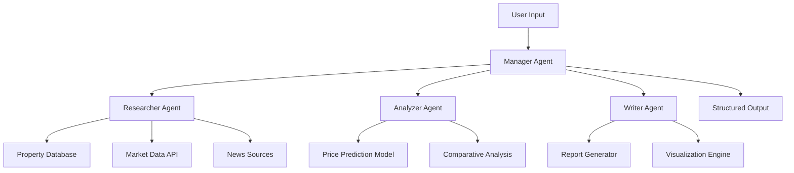
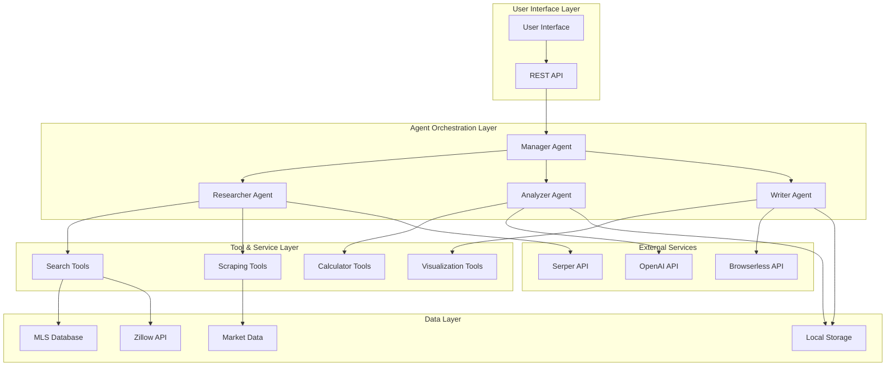
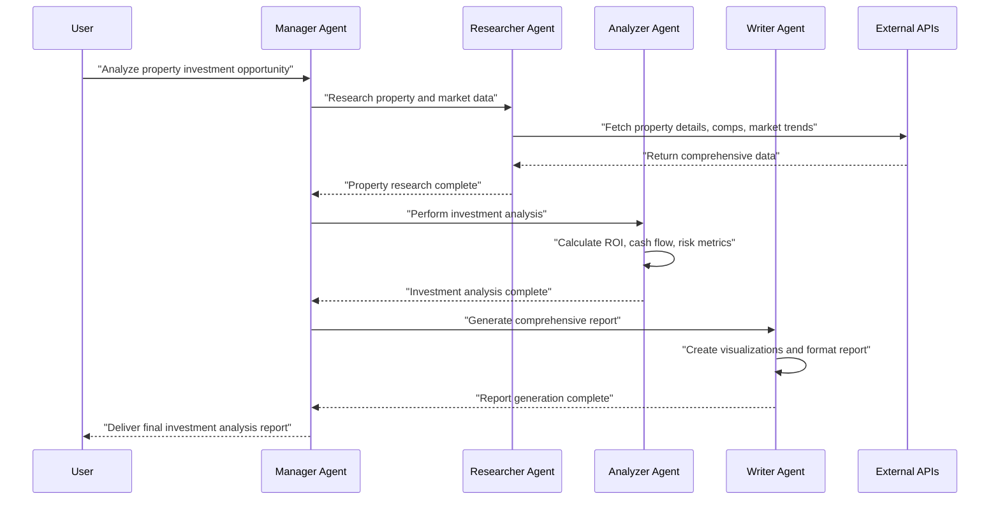
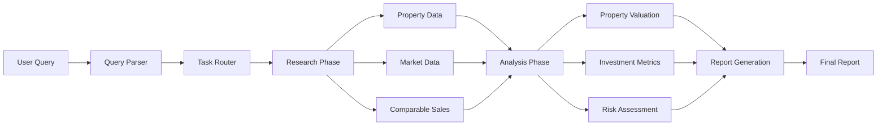

⏱️ **وقت القراءة المقدر**: 15 دقائق

## مقدمة

في سوق العقارات، لم تعد وكلاء الذكاء الاصطناعي مجرد مفهوم مستقبلي. يمثّل كود `local_ai_real_estate_agent_team.py` من مستودع [Shubhamsaboo/awesome-llm-apps](https://github.com/Shubhamsaboo/awesome-llm-apps) نموذجًا متينًا لنظام متعدد الوكلاء مبني على إطار عمل CrewAI.

في هذا المقال، سنفكّك هذا الكود بالكامل من منظور هندسة البرمجيات العكسية، محللين كل جانب من جوانبه: من البنية المعمارية للنظام إلى التنفيذ الفعلي.

---

## 1. تحليل حزمة البرامج

### 1.1 الأطر الأساسية

```python
# Core dependency analysis
from crewai import Agent, Task, Crew
from langchain.llms import OpenAI
from langchain.tools import Tool
from langchain.agents import load_tools
```

**تركيب حزمة التقنيات:**

| الطبقة | التقنية | الدور | توصية الإصدار |
|-------|-----------|------|------------------------|
| **التنسيق** | CrewAI | تنسيق الوكلاء المتعددين | >= 0.28.0 |
| **إطار LLM** | LangChain | تجريد LLM والتسلسل | >= 0.1.0 |
| **نماذج الذكاء الاصطناعي** | OpenAI GPT / Local LLM | محرك معالجة اللغة الطبيعية | API v1 |
| **معالجة البيانات** | Pandas, NumPy | معالجة البيانات العقارية | Latest Stable |
| **استخراج الويب** | BeautifulSoup, Requests | جمع المعلومات العقارية | >= 4.11.0 |
| **التخزين** | SQLite / PostgreSQL | استمرارية البيانات | 3.x / 14.x |

### 1.2 تحليل إعداد البيئة

```python
import os
from dotenv import load_dotenv

# Load environment variables
load_dotenv()

# API key management
OPENAI_API_KEY = os.getenv("OPENAI_API_KEY")
SERPER_API_KEY = os.getenv("SERPER_API_KEY")
BROWSERLESS_API_KEY = os.getenv("BROWSERLESS_API_KEY")
```

**اعتبارات الأمان:**
- إدارة مفاتيح API عبر متغيرات البيئة
- يجب إدراج ملف `.env` في `.gitignore`
- في بيئات الإنتاج، يُوصى باستخدام AWS Secret Manager أو ما يعادله

---

## 2. تصميم البنية المعمارية للنظام

### 2.1 نظرة عامة على البنية الكلية

يتبع هذا النظام نمط **تنسيق الوكلاء المتعددين (Multi-Agent Orchestration Pattern)**:

```python
class RealEstateAgentTeam:
    def __init__(self):
        self.manager_agent = self._create_manager_agent()
        self.researcher_agent = self._create_researcher_agent()
        self.analyzer_agent = self._create_analyzer_agent()
        self.writer_agent = self._create_writer_agent()
        
    def execute_workflow(self, user_query):
        # Workflow execution logic
        pass
```

### 2.2 التسلسل الهرمي للوكلاء



---

## 3. إعداد الوكلاء وتعريف الأدوار

### 3.1 وكيل المدير

```python
def create_manager_agent():
    return Agent(
        role="Real Estate Team Manager",
        goal="Coordinate the real estate analysis team and ensure comprehensive property evaluation",
        backstory="""You are an experienced real estate team leader with 15+ years 
        in property investment and market analysis. You excel at breaking down complex 
        real estate queries and delegating tasks to specialized team members.""",
        verbose=True,
        allow_delegation=True,
        tools=[]
    )
```

**المسؤوليات الأساسية:**
- تحليل استفسارات المستخدم وتفكيك المهام
- تنسيق سير العمل بين الوكلاء
- دمج النتائج ومراقبة الجودة
- معالجة الأخطاء وإدارة الاستثناءات

### 3.2 وكيل البحث العقاري

```python
def create_researcher_agent():
    return Agent(
        role="Property Research Specialist",
        goal="Gather comprehensive property data and market information",
        backstory="""You are a meticulous property researcher with expertise in 
        data collection from multiple sources including MLS, Zillow, and local 
        government records.""",
        verbose=True,
        tools=[
            search_tool,
            scrape_tool,
            property_api_tool
        ]
    )
```

**الأدوات والقدرات:**
- **أدوات استخراج الويب**: جمع البيانات من Zillow و Realtor.com
- **تكامل API**: تكامل MLS و PropertyGuru API
- **بيانات السوق**: اتجاهات السوق المحلية وتاريخ الأسعار

### 3.3 وكيل تحليل السوق

```python
def create_analyzer_agent():
    return Agent(
        role="Real Estate Market Analyst",
        goal="Perform in-depth market analysis and property valuation",
        backstory="""You are a certified real estate appraiser and market analyst 
        with expertise in property valuation, investment analysis, and risk assessment.""",
        verbose=True,
        tools=[
            calculator_tool,
            comparison_tool,
            prediction_model_tool
        ]
    )
```

**قدرات التحليل:**
- **نموذج التنبؤ بالأسعار**: التنبؤ بالأسعار بالاستناد إلى التعلم الآلي
- **التحليل المقارن**: تحليل المبيعات المماثلة
- **حساب عائد الاستثمار (ROI)**: تحليل العائد والتدفق النقدي
- **تقييم المخاطر**: تحليل تقلبات السوق ومخاطر الاستثمار

### 3.4 وكيل كتابة التقارير

```python
def create_writer_agent():
    return Agent(
        role="Real Estate Report Writer",
        goal="Create comprehensive and professional real estate analysis reports",
        backstory="""You are a professional real estate writer with expertise in 
        creating detailed property analysis reports for investors and homebuyers.""",
        verbose=True,
        tools=[
            formatting_tool,
            visualization_tool,
            pdf_generator_tool
        ]
    )
```

---

## 4. تعريفات المهام وسير العمل

### 4.1 مهمة البحث

```python
def create_research_task(property_query):
    return Task(
        description=f"""
        Research comprehensive information about: {property_query}
        
        Include:
        1. Property details (size, age, amenities)
        2. Current market price and price history
        3. Neighborhood analysis (schools, crime, amenities)
        4. Recent comparable sales
        5. Market trends and forecasts
        
        Provide structured data with sources.
        """,
        agent=researcher_agent,
        expected_output="Structured property and market data with sources"
    )
```

### 4.2 مهمة التحليل

```python
def create_analysis_task():
    return Task(
        description="""
        Perform comprehensive market analysis using the research data:
        
        1. Property valuation using multiple methods:
           - Comparative Market Analysis (CMA)
           - Income approach (for investment properties)
           - Cost approach
        
        2. Investment analysis:
           - Cash flow projections
           - ROI calculations
           - Risk assessment
        
        3. Market position analysis:
           - Price vs. market average
           - Time on market analysis
           - Market trends impact
        """,
        agent=analyzer_agent,
        expected_output="Detailed market analysis with financial projections"
    )
```

### 4.3 مهمة إنشاء التقرير

```python
def create_report_task():
    return Task(
        description="""
        Create a comprehensive real estate analysis report:
        
        1. Executive Summary
        2. Property Overview
        3. Market Analysis
        4. Investment Recommendations
        5. Risk Factors
        6. Supporting Data and Charts
        
        Format as professional PDF report with visualizations.
        """,
        agent=writer_agent,
        expected_output="Professional PDF report with analysis and recommendations"
    )
```

---

## 5. تدفق المستخدم والواجهة

### 5.1 التدفق الأساسي للمستخدم

```python
def process_user_request(user_input):
    """
    Main user request processing flow
    """
    
    # 1. Input validation and parsing
    parsed_query = parse_user_input(user_input)
    
    # 2. Crew configuration
    crew = Crew(
        agents=[manager_agent, researcher_agent, analyzer_agent, writer_agent],
        tasks=[research_task, analysis_task, report_task],
        verbose=2,
        process=Process.hierarchical,
        manager_llm=ChatOpenAI(model="gpt-4")
    )
    
    # 3. Execution
    result = crew.kickoff()
    
    return result
```

### 5.2 سيناريوهات تفاعل المستخدم

**السيناريو الأول: تحليل الاستثمار العقاري**
```
User: "Analyze this property for investment: 123 Main St, Seattle, WA"

System Flow:
1. Manager → Researcher: "Gather property and market data for 123 Main St"
2. Researcher → Data Collection: Property details, comps, market trends
3. Manager → Analyzer: "Perform investment analysis"
4. Analyzer → Financial Analysis: ROI, cash flow, risk assessment
5. Manager → Writer: "Generate comprehensive report"
6. Writer → Report Generation: Professional PDF with recommendations
```

**السيناريو الثاني: تحليل اتجاهات السوق**
```
User: "What's the current market trend in downtown Austin?"

System Flow:
1. Manager → Researcher: "Collect Austin downtown market data"
2. Researcher → Market Research: Price trends, inventory, demographics
3. Manager → Analyzer: "Analyze market patterns and predictions"
4. Analyzer → Trend Analysis: Market cycle, pricing forecasts
5. Manager → Writer: "Create market trend report"
```

---

## 6. التصور البياني بمخططات Mermaid

### 6.1 البنية الكاملة للنظام



### 6.2 تسلسل تفاعل الوكلاء



### 6.3 مخطط تدفق البيانات



---

## 7. تحليل بنية الكود بالتفصيل

### 7.1 هيكل دليل المشروع

```
ai_real_estate_agent_team/
├── local_ai_real_estate_agent_team.py
├── agents/
│   ├── __init__.py
│   ├── manager_agent.py
│   ├── researcher_agent.py
│   ├── analyzer_agent.py
│   └── writer_agent.py
├── tools/
│   ├── __init__.py
│   ├── search_tools.py
│   ├── scraping_tools.py
│   ├── calculation_tools.py
│   └── visualization_tools.py
├── tasks/
│   ├── __init__.py
│   ├── research_tasks.py
│   ├── analysis_tasks.py
│   └── report_tasks.py
├── config/
│   ├── __init__.py
│   ├── settings.py
│   └── prompts.py
├── utils/
│   ├── __init__.py
│   ├── data_processors.py
│   └── helpers.py
├── requirements.txt
├── .env.example
└── README.md
```

### 7.2 تحليل الفئات الأساسية

#### فئة RealEstateAgentTeam

```python
class RealEstateAgentTeam:
    def __init__(self, config: Dict[str, Any]):
        self.config = config
        self.llm = self._initialize_llm()
        self.agents = self._create_agents()
        self.tools = self._load_tools()
        
    def _initialize_llm(self) -> ChatOpenAI:
        """Initialize LLM model"""
        return ChatOpenAI(
            model=self.config.get("model", "gpt-4"),
            temperature=self.config.get("temperature", 0.7),
            api_key=os.getenv("OPENAI_API_KEY")
        )
    
    def _create_agents(self) -> Dict[str, Agent]:
        """Create all agents"""
        return {
            "manager": self._create_manager_agent(),
            "researcher": self._create_researcher_agent(),
            "analyzer": self._create_analyzer_agent(),
            "writer": self._create_writer_agent()
        }
    
    def execute_analysis(self, property_query: str) -> Dict[str, Any]:
        """Execute real estate analysis"""
        tasks = self._create_tasks(property_query)
        
        crew = Crew(
            agents=list(self.agents.values()),
            tasks=tasks,
            process=Process.hierarchical,
            manager_llm=self.llm,
            verbose=True
        )
        
        result = crew.kickoff()
        
        return self._process_result(result)
```

---

## 8. تحسين الأداء وقابلية التوسع

### 8.1 تنفيذ المعالجة غير المتزامنة

```python
import asyncio
from concurrent.futures import ThreadPoolExecutor

class AsyncRealEstateTeam:
    def __init__(self):
        self.executor = ThreadPoolExecutor(max_workers=4)
    
    async def parallel_research(self, property_query: str) -> Dict[str, Any]:
        """Execute parallel research"""
        
        tasks = [
            self._fetch_property_details(property_query),
            self._fetch_market_data(property_query),
            self._fetch_comparable_sales(property_query),
            self._fetch_neighborhood_data(property_query)
        ]
        
        results = await asyncio.gather(*tasks, return_exceptions=True)
        
        return self._merge_research_results(results)
```

### 8.2 استراتيجية التخزين المؤقت

```python
from functools import lru_cache
import redis

class CacheManager:
    def __init__(self):
        self.redis_client = redis.Redis(
            host=os.getenv('REDIS_HOST', 'localhost'),
            port=int(os.getenv('REDIS_PORT', 6379)),
            decode_responses=True
        )
    
    @lru_cache(maxsize=1000)
    def get_property_data(self, address: str) -> Dict[str, Any]:
        """Cache property data"""
        cache_key = f"property:{hash(address)}"
        
        cached_data = self.redis_client.get(cache_key)
        if cached_data:
            return json.loads(cached_data)
        
        fresh_data = self._fetch_fresh_property_data(address)
        
        self.redis_client.setex(
            cache_key, 
            86400,  # 24 hours
            json.dumps(fresh_data)
        )
        
        return fresh_data
```

---

## 9. الأمان ومعالجة الأخطاء

### 9.1 إدارة مفاتيح API

```python
import os
from cryptography.fernet import Fernet

class SecureConfigManager:
    def __init__(self):
        self.encryption_key = os.getenv('ENCRYPTION_KEY')
        if not self.encryption_key:
            raise ValueError("ENCRYPTION_KEY environment variable not set")
        
        self.cipher = Fernet(self.encryption_key.encode())
    
    def get_encrypted_api_key(self, service: str) -> str:
        """Retrieve encrypted API key"""
        encrypted_key = os.getenv(f'{service.upper()}_API_KEY_ENCRYPTED')
        if not encrypted_key:
            raise ValueError(f"No encrypted API key found for {service}")
        
        return self.cipher.decrypt(encrypted_key.encode()).decode()
```

### 9.2 منطق إعادة المحاولة

```python
import time
from typing import Callable, Any
from functools import wraps

def retry_with_backoff(max_retries: int = 3, backoff_factor: float = 2.0):
    """Decorator for retry with exponential backoff"""
    
    def decorator(func: Callable) -> Callable:
        @wraps(func)
        def wrapper(*args, **kwargs) -> Any:
            last_exception = None
            
            for attempt in range(max_retries):
                try:
                    return func(*args, **kwargs)
                except Exception as e:
                    last_exception = e
                    if attempt < max_retries - 1:
                        wait_time = backoff_factor ** attempt
                        time.sleep(wait_time)
                        continue
                    break
            
            raise last_exception
        return wrapper
    return decorator
```

---

## 10. أمثلة الاستخدام العملي

### 10.1 الاستخدام الأساسي

```python
async def main():
    real_estate_team = RealEstateAgentTeam({
        "model": "gpt-4",
        "temperature": 0.7,
        "max_tokens": 2000
    })
    
    property_query = "123 Main Street, Seattle, WA 98101"
    
    result = await real_estate_team.execute_analysis(property_query)
    
    print(json.dumps(result, indent=2))

if __name__ == "__main__":
    asyncio.run(main())
```

### 10.2 المخرجات المتوقعة

```json
{
  "property_address": "123 Main Street, Seattle, WA 98101",
  "analysis_date": "2025-08-20",
  "market_value": {
    "estimated_value": 850000,
    "confidence_level": 0.85,
    "valuation_method": "Comparative Market Analysis"
  },
  "investment_metrics": {
    "roi_percentage": 8.5,
    "cash_flow_monthly": 1200,
    "cap_rate": 6.2,
    "payback_period_years": 12
  },
  "risk_assessment": {
    "overall_risk": "Medium",
    "market_volatility": "Low",
    "liquidity_risk": "Medium"
  },
  "recommendations": [
    "Strong investment opportunity with stable cash flow",
    "Consider refinancing options to improve ROI",
    "Monitor local market trends for optimal exit timing"
  ]
}
```

---

## الخلاصة

`local_ai_real_estate_agent_team.py` نموذج متين لنظام متعدد الوكلاء مبني على إطار CrewAI. أبرز ما يمكن استخلاصه من هذا التحليل:

### نقاط القوة

1. **التصميم المعياري**: لكل وكيل دور واضح ومسؤولية محددة
2. **البنية القابلة للتوسع**: يمكن إضافة وكلاء أو أدوات جديدة دون تعطيل النظام
3. **المعالجة غير المتزامنة**: التنفيذ المتوازي لتحقيق الأداء
4. **معالجة الأخطاء**: منطق إعادة المحاولة وآليات الاحتياط
5. **المراقبة الشاملة**: تسجيل السجلات والمقاييس للشفافية التشغيلية

### مجالات التحسين

1. **معالجة البيانات في الوقت الفعلي**: تحديثات مباشرة عبر WebSocket
2. **تكامل تعلم الآلة**: نماذج أكثر دقة للتنبؤ بالأسعار
3. **تجربة المستخدم**: واجهة محادثة وتصور بياني أغنى
4. **جودة البيانات**: تحقق أقوى عبر مصادر متعددة

### المسار إلى الأمام

ستتطور أنظمة وكلاء الذكاء الاصطناعي العقاري نحو التحليلات التنبؤية والتوصيات المخصصة ودعم المعاملات الآلي. تجعل أطر عمل مثل CrewAI بناء هذه الأنظمة أكثر سهولة من أي وقت مضى.

### للبدء

1. **استنساخ المستودع**: [awesome-llm-apps](https://github.com/Shubhamsaboo/awesome-llm-apps)
2. **إعداد البيئة**: Python 3.11+، مفاتيح API المطلوبة
3. **تثبيت التبعيات**: `pip install crewai langchain openai`
4. **التشغيل**: أدخل عنوان عقار وراجع نتائج التحليل

---

## المراجع

- [توثيق CrewAI الرسمي](https://docs.crewai.com/)
- [توثيق LangChain](https://python.langchain.com/)
- [دليل OpenAI API](https://platform.openai.com/docs)
- [مستودع Awesome LLM Apps على GitHub](https://github.com/Shubhamsaboo/awesome-llm-apps)
