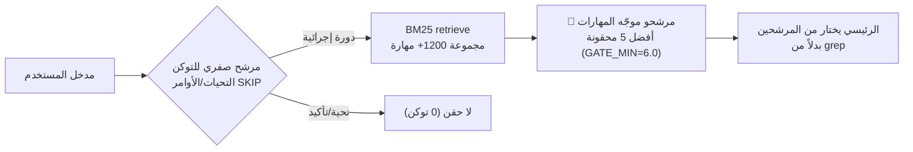
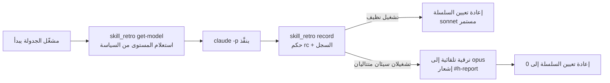

## اليوم الذي أحرقنا فيه 705 دولارات

لنبدأ بالحادثة. في الأول من يونيو 2026، شغّلنا جميع الجلسات التسع على نموذج Opus فبلغت التكلفة اليومية المقدّرة 705 دولارات. جلسة مراقبة واحدة استهلكت 381 دولاراً -- أي 54% من الإجمالي. السبب: 9.4 ساعات و1145 دورة و138 استدعاءً لـ ScheduleWakeup تراكمت في جلسة واحدة. جاء اثنان وأربعون بالمئة من تلك التكلفة من cache_read بقيمة 195M توكن. في اليوم ذاته نفّذنا أمر `cd` 153 مرة وأعدنا قراءة الملف نفسه 10 مرات.

المفارقة أن الوكلاء الـ18 الفرعيين الذين أطلقناهم في ذلك اليوم كانوا جميعاً موجَّهين بصورة صحيحة إلى sonnet. المشكلة لم تكن في الفرعيين بل في الوكيل الرئيسي. الإبقاء على الجلسة الرئيسية بـ Opus مع تدوير سياق ضخم عبر دورات متكررة كان المصدر الوحيد للتسرب.

يغطي هذا المقال القواعد التي وضعناها في أعقاب تلك الحادثة. نتجاهل نقاشات منصة الذكاء الاصطناعي ووحدات GPU ونركز كلياً على كيفية تخفيض التكلفة التشغيلية للوكلاء أنفسهم من خلال التوجيه وصحة التوكن.

## 1. مستويات النماذج: توقف عن دفع 19 ضعفاً للعمل ذاته

أكبر رافعة هي اختيار النموذج. مضاعفات التكلفة في بيئتنا واضحة: haiku يساوي تقريباً 1x، وsonnet تقريباً 4x، وopus تقريباً 19x. تشغيل مهمة استكشاف على opus يكلف 19 ضعف haiku.

لذلك نربط النماذج بأنواع المهام بصورة ثابتة.

| المستوى | متى | المضاعف |
|---|---|---|
| `haiku` | الاستكشاف، قراءة الملفات، البحث، grep، التلخيص، الترجمة | ~1x |
| `sonnet` | التحليل، التنفيذ، توليد الكود، المراجعة، الكتابة (افتراضي) | ~4x |
| `opus` | الهندسة المعمارية، الاستدلال متعدد الخطوات، التصحيح المعقد، كتابة المواصفات | ~19x |
| `fable` | المنسق/القائد (توفير حصة الاستخدام) | منخفض |

ثمة قاعدة صارمة واحدة: كل استدعاء لوكيل فرعي يجب أن يحدد معامل `model` صراحةً. حذفه يعني الرجوع إلى نموذج الجلسة الافتراضي -- وإذا كان ذلك الافتراضي Opus يُحاسَب كل استدعاء فرعي بـ 19x. كان ذلك جوهر حادثة الأول من يونيو.

```python
# صحيح: الاستكشاف موجَّه صراحةً إلى haiku
Agent(subagent_type="Explore", model="haiku", prompt="...")
# خطأ: model محذوف -> الافتراضي (opus) = فوترة بـ 19x
Agent(subagent_type="Explore", prompt="...")
```

نضيف نمطاً إضافياً: ضبط الجلسة الرئيسية على fable وإسناد دور القائد إليه فحسب. التوجيه والتفريع والتجميع تتولاها fable بتكلفة منخفضة؛ فقط المراحل التي تحتاج فعلاً إلى استدلال ثقيل تستدعي `Agent(model="opus")` مرة واحدة. الاستكشاف يذهب إلى haiku. عمق التفرع محدود بحدين، ولا يفرز وكلاء haiku الفرعية مزيداً من الوكلاء.

## 2. موجّه المهارات: منع الوكيل الرئيسي من التجوال في قاعدة الكود

الرافعة الثانية هي موجّه المهارات. لدينا أكثر من 1200 مهارة. حين يبدأ الوكيل الرئيسي في البحث بـ grep داخل قاعدة الكود لتحديد أي مهارة يستخدم، يُحرق بذلك توكنات opus باهظة الثمن.

لذا يُشغّل خطاف `UserPromptSubmit` المسمى `skill-router-gate.py` بحثاً BM25 بكود حتمي في كل دورة ويحقن أفضل المرشحين في السياق.



يُعطي الترتيب وزناً كبيراً لتطابق الأسماء التام (مستند إلى idf) ووزناً أصغر لتوكنات الوصف. التحيات والأوامر البسيطة تمر عبر مرشح صفري للتوكن، والدورات المتطابقة المتتالية تُخزَّن مؤقتاً. البنية تضيف تلميحات جهة الإدخال فحسب دون مرور إضافي على LLM -- تكلفة شبه معدومة. النتيجة: الوكيل الرئيسي لا يُحرق توكنات opus في الاستكشاف منذ البداية.

نكون صادقين بشأن الحدود: في تجاربنا مع تفكيك الطلبات المركبة والبحث خطوة بخطوة (SAD)، حتى مع التفكيك المثالي لم يتجاوز سقف استرجاع الخطوات 42.5% step coverage. ادعاء الدراسة بأن "الاسترجاع سليم، فقط أصلح التفكيك" لم يُطبَّق مباشرةً في بيئتنا. لذا التفكيك بالتعبيرات النمطية الحتمية معطّل افتراضياً ويُفعَّل اختيارياً للطلبات المركبة فحسب. نقيس قبل أن نُصلح.

## 3. صحة التوكن: السياق يتسرب بسهولة

الرافعة الثالثة هي صحة التوكن. المبدأ الأساسي: لا يجب أن تتراكم المخرجات الكبيرة مباشرةً في السياق الرئيسي.

أهم القواعد هي قاعدة 2K توكن. أي استدعاء أداة يُتوقع إرجاع أكثر من 2K توكن يُفوَّض إلى وكيل فرعي. يقرأ الوكيل الفرعي ويعالج البيانات ويُرجع ملخصاً فحسب فيبقى السياق الرئيسي نظيفاً. المخرجات المنظمة التي تتجاوز 200 سطر أو 2KB تُرحَّل إلى ملفات بيانات أو SQLite. كود JSON ذو البنية المتكررة يمر بضغط headroom الحتمي لتخفيض بنسبة 50% أو أكثر قبل إعادة حقنه.

تُضاف البادئة `rtk` إلى مخرجات الشل لضغط 60-90%. يكلف كل خادم MCP نحو 1000 توكن من مخطط البيانات في كل دورة، لذا نُعطّل الخوادم غير المستخدمة ونبقي العدد عند 10 أو أقل. هذه هي توكنات الأشباح -- الأعباء غير المرئية في كل دورة من المخططات المحمّلة التي لا تُستدعى قط.

| ملف القاعدة | الآلية |
|---|---|
| `loop-monitor-cost-guard` | الاستطلاع/المراقبة يخرج من الحلقة الساخنة لـ Claude إلى cron (تكلفة $0)؛ /loop يُقسَّم قبل 50 دورة أو 40% من السياق |
| `ecc-token-strategy` | تفويض قاعدة 2K توكن؛ 200+ سطر إلى ملفات بيانات؛ JSON عبر ضغط headroom |
| `rtk-token-optimization` | البادئة `rtk` تضغط مخرجات الأوامر 60-90% |
| `token-diet-hygiene` | خوادم MCP بحد أقصى 10؛ أوصاف المهارات بحد أقصى 512 حرفاً؛ كشف توكنات الأشباح |
| `sonnet-format-determinism` | التنسيق والتعدادات والأعداد ملكية الكود؛ النموذج يولّد المحتوى فحسب |

القاعدة الأخيرة مرتبطة مباشرةً بالتكلفة. في 16 يونيو 2026، تلقّى 33 عاملاً من sonnet تعليمات متطابقة وأنتجوا مخرجات `quality_gate` في 5 أشكال مختلفة؛ وزاد 24 منهم في وضع علامات الحكم. حين تطلب من النموذج إنتاج التنسيق في النثر، يتفاوت في كل استدعاء. لذلك الأرقام والتعدادات والتصيير الآن ملكية كود حتمي، والنموذج يولّد المحتوى فحسب. تختفي الحاجة إلى دفع ثمن نموذج أغلى من أجل اتساق التنسيق.

## 4. التصعيد القائم على المراجعة: ابدأ رخيصاً، رقِّ عند الفشل

المهارات المجدولة لا تُشفِّر النموذج بصورة صارمة. السياسة المركزية `skill_model_policy.json` تبدأ بـ sonnet ويحدد `skill_retro.py` النموذج عبر التحليل التراجعي.



حكم التشغيل السيئ متحفظ: فقط عندما يكون رمز الخروج غير صفري أو يحتوي السجل على علامات مثل فشل المصادقة أو خطأ API أو Traceback. الفشل العابر الواحد لا يستدعي الترقية؛ يلزم تراكم سلسلة من الفشل. النجاحات النظيفة تُعيد تعيين السلسلة ولا يوجد تراجع تلقائي. ضبط التكلفة يأتي من الترقية الانتقائية المستندة إلى البيانات لا من خفض النموذج جملةً وتفصيلاً. فقط المهارات التي تحتاج فعلاً إلى الجودة تصبح مكلفة. عملياً رُبطت مهارة `twitter-timeline-to-slack` بـ opus بعد أن تخطى sonnet مرحلة الإثراء.

## 5. التدقيق: انظر إلى أين تذهب الأموال

الجزء الأخير هو القياس. يحلل `scripts/cost_audit.py` نصوص الجلسات ويُقدّم التكلفة حسب المستوى ومعدل ضرب الذاكرة المؤقتة والجلسات والأدوات الأكثر تكلفةً والملفات التي أُعيدت قراءتها. الرؤى كـ "opus الرئيسي شكّل 97% من الفوترة" في الأول من يونيو تأتي من هنا، وتُغذّي النتائج مجدداً تثبيت النماذج.

تدفق العملية بأكملها في جملة واحدة: اختر نموذج الجلسة حسب نوع المهمة، ودع موجّه المهارات يقلل استكشاف الوكيل الرئيسي، ووجّه الوكلاء الفرعيين حسب المستوى، واحتفظ بالسياق نظيفاً بصحة التوكن، ودع المراجعات الترجعية تُرقّي فقط المهارات الفاشلة، ودع التدقيق يخبرك أين يتسرب المال لاحقاً.

## وجهة نظر ThakiCloud: اقفل ضبط التكلفة في قواعد

تحسين التكلفة ليس قراراً بطولياً لمرة واحدة -- بل هو تراكم قواعد تُطبَّق تلقائياً في كل دورة. معظم القواعد التي دمجناها تعمل عبر كود حتمي وخطافات، فلا أحد يحتاج إلى التفكير فيها يدوياً. النماذج المكلفة ليست محظورة؛ هي محجوزة للحالات التي تُبررها البيانات.

هذا الانضباط أكثر أهمية في البيئات المحلية، حيث تتحول تكاليف التوكن مباشرةً إلى استهلاك كهرباء ووقت GPU. المنصة التي تقدمها ThakiCloud تدمج هذا النوع من التوجيه والمراقبة كأساس، حتى يتمكن العملاء من تشغيل ذات الروافع على بنيتهم التحتية الخاصة.

## خاتمة

الدرس المستفاد من حادثة الـ 705 دولارات كان بسيطاً. التسرب كان في السلوك لا في الأجهزة، والسلوك لا يُصحَّح إلا بالقواعد. طابق مستويات النماذج مع أنواع المهام، وقلل الاستكشاف بموجّه المهارات، وتعامل مع التوكنات بنظافة، ورقِّ فقط ما يفشل، ودقّق يومياً -- وستؤدي العمل ذاته بتكلفة أقل بـ 19 ضعفاً.

تعمل ThakiCloud على جعل هذا الانضباط في التكلفة ميزةً أساسية في المنتج. يمكنك معرفة المزيد على موقعنا الإلكتروني.
