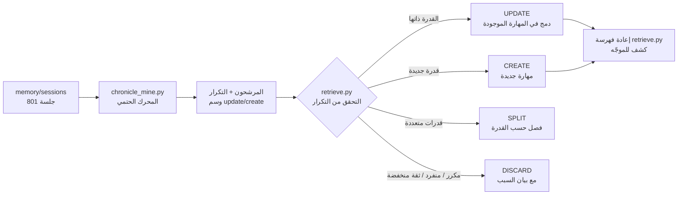
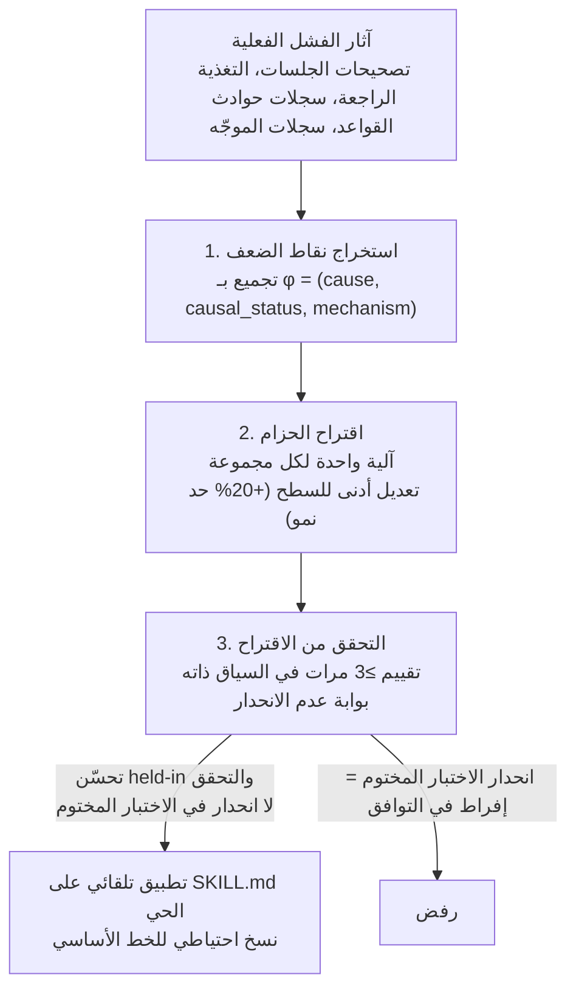

## إذا كنت تشرح الشيء ذاته مراراً وتكراراً

من يستخدم وكيل الذكاء الاصطناعي لفترة طويلة سيلاحظ نمطاً واحداً: المهمة ذاتها، بالاصطلاحات ذاتها، تُعطى من الصفر في كل مرة. طلبات من قبيل "ضع هذا المحتوى خطةً باللغة الإنجليزية في مجلد docs" أو "احصل على هذا المستودع وحوّله إلى مهارة" هي في جوهرها سير عمل واحدة، مع اختلاف طفيف في الصياغة.

المهارات ليست مجانية. فور إدراج مهارة في الفهرس، يستهلك اسمها ووصفها رموز السياق في كل جلسة. لذلك فإن القول بثقة "نكرر هذا، فلنصنع منه مهارة" هو أمر غير مسؤول. يجب التحقق من أن التكرار حقيقي، وأنه لا يتداخل مع المهارات الموجودة، وأن الجودة تُحافَظ عليها بعد الإنشاء.

هذه المقالة ليست تسويقاً. نكشف صراحةً عن حلقتين مستقلتين نشغلهما فعلياً. الأولى هي Chronicle mining -- استخراج سير العمل المتكررة من المحادثات السابقة وتحويلها إلى مهارات. والثانية هي selfharness self-evolution -- تصحيح محتوى المهارات الموجودة تلقائياً بناءً على أدلة الفشل.

## 1. Chronicle: تحويل المحادثات السابقة إلى مدوّنة نصية

نحتاج أولاً إلى المادة الخام. جلسات Claude Code تتراكم كنصوص أصلية في `~/.claude/projects/<repo>/*.jsonl`. نستخدم `scripts/memory/extract-sessions.py` لاستخراج العناصر عالية الإشارة فقط من تلك النصوص، وكتابتها كسجلات جلسات بصيغة markdown ضمن `memory/sessions/`. العدد الحالي 801 ملف. يحمل كل ملف في مقدمته `date` و`session_id` و`title` و`files_touched`، مع الرسائل في الجسم.

هذه المدوّنة هي Chronicle الخاصة بنا. التكلفة: صفر. الاستخراج يعمل بشكل تدريجي كخطوة حتمية في خط أنابيب الذاكرة الليلي.

## 2. العد ملك للكود، لا للنماذج

ثمة مبدأ تصميمي واحد جوهري: الأرقام -- التكرار، وتوقيعات الأنماط، وأحكام إزالة التكرار -- لا تُفوَّض أبداً إلى نموذج. حين يُطلب من نموذج تقدير "كم جلسة كررت هذا"، تكون الإجابة خاطئة في الغالب. لذلك فإن محرك الاستخراج `scripts/skills/chronicle_mine.py` هو كود حتمي بحت لا يستدعي LLM أبداً. تكلفة التشغيل فعلياً صفر.

ما يفعله المحرك بسيط: يستخرج رموز الإشارة من عناوين الجلسات والملفات التي عمل عليها، ثم يحسب تكرار الوثائق عبر الجلسات. الرموز وأزواج التزامن التي تظهر في عدد من الجلسات يتجاوز حداً معيناً (الافتراضي: 4 جلسات) تُرقَّى إلى المرشحين. في الوقت ذاته يقارن بين أسماء `.claude/skills/` الموجودة ويضع على كل مرشح وسم `update` (موجود مسبقاً) أو `create` (جديد).

الجزء الصعب هو الضوضاء. في التشغيل الأول، كانت الأنماط الأعلى تكراراً مثل `hooks+state` (260 مرة) و`cursor+plan` (198 مرة). هذه ليست سير عمل متكررة -- بل مسارات البنية التحتية للمستودع التي تلمسها كل جلسة تقريباً. ما يُعرف بـ lexical mismatch. لذلك أضفنا نقطة قطع قائمة على IDF لأقصى تكرار للوثائق. الرموز التي تظهر في أكثر من 16% من المدوّنة تُصنَّف كضوضاء محيطة وتُحذف.

```python
# الرموز التي تتجاوز 16% من المدوّنة هي محيطة (في كل مكان) -> ليست هوية سير عمل
MAX_DF_RATIO = 0.16
ambient = {t for t, c in raw_df.items() if c / n > MAX_DF_RATIO}
```

حتى بعد ذلك، كانت أسماء ملفات SKILL.md من ذاكرة التخزين المؤقت للإضافات ضمن `.cursor/plugins/cache/` تملأ النتائج الأعلى بإشارات زائفة. اكتشفنا السبب فقط بعد فتح عدد من الجلسات الفعلية. استبعدنا بعد ذلك ذاكرة التخزين المؤقت والخطط المُولَّدة والمسارات المضمّنة بالكامل، وضيّقنا الإشارة إلى "العناوين الحاملة لنية المستخدم" و"هويات المهارات المستدعاة فعلياً". عندها فقط ظهرت سير العمل الحقيقية.

هذه العملية بحد ذاتها درس. حين تنخفض الجودة، اللجوء فوراً إلى مستوى نموذج أعلى هو الخيار الكسول. قِس المحرك أولاً، وابحث عن مصدر الضوضاء في البيانات، ثم أصلحه.

## 3. حكم التطور: تحديث أم إنشاء أم تقسيم؟

بمجرد ظهور المرشحين، يتوقف المحرك ويتولى مهارة المنسق `chronicle-skill-miner` اتخاذ القرار. تلميحات إزالة التكرار من الكود استشارية فقط -- الحكم النهائي يأتي من إعادة التحقق بأداة البحث BM25.



تشغيل 801 جلسة كاملة أعطى نتيجة مثيرة للاهتمام. معظم سير العمل المتكررة للمستخدم كانت مغطاة مسبقاً بمنظومة المهارات الموجودة. تحليل الأسهم يقع تحت stock-jarvis، وإدراج التغريدات الاجتماعية تحت x-to-slack، وتحويل مستودعات GitHub تحت skill-seekers. نتيجة التنظيم الصادقة كانت "تجاهل معظمها". الهدف ليس توليد مهارات مكررة -- بل إنشاء مهارة واحدة جديدة بالضبط لسير عمل غائبة فعلاً.

تلك المهارة الواحدة كانت: "ضع هذا المحتوى خطةً بالإنجليزية كوثيقة هندسية في مجلد docs، مع توجيه المهارة المناسبة، مركزاً على جوهر هندسة البرمجيات." تكررت 39 مرة لكن لم تغطِّها أي مهارة موجودة بدقة. أنشأنا تلك المهارة الواحدة فقط، وعززنا مهارة واحدة كانت محفزاتها ضعيفة، وتجاهلنا الباقي مع بيان السبب. القاعدة هي: لا تتجاهل بصمت؛ سجل دائماً عدد الأنماط التي لم تبلغ الحد الأدنى.

ما يميز هذا النهج عن ميزات تجارية مشابهة أمران: أولاً، المحرك الحتمي يمتلك العد وتصفية الضوضاء، مما يمنع هلوسة التكرار من المصدر. ثانياً، التحقق من التكرار بالاسترجاع يُطبَّق إلزامياً على مدوّنة تضم أكثر من 1,600 مهارة موجودة.

## 4. selfharness: تصحيح محتوى المهارات بناءً على الفشل

إنشاء المهارة ليس النهاية. المهارات تخطئ في التشغيل الفعلي، ولأخطائها أنماط. يستخدم selfharness-evolve تلك الأنماط لتصحيح محتوى المهارة تلقائياً. إنه ورقة Self-Harness (arXiv:2606.09498) مُزروعة في محتوى SKILL.md.

يعمل في ثلاث مراحل.



المرحلة الأولى، استخراج نقاط الضعف، تجمّع الفشل الحقيقي بتوقيع `φ = (cause, causal_status, mechanism)` وترتبه حسب الدعم وقابلية التنفيذ. يُسحب حقل `cause` من مجموعة ثابتة: wrong_output, missing_step, stale_data, ignored_constraint, format_violation. المصادر هي الجلسات التي صحّح فيها المستخدمون مهارة، وذاكرة التغذية الراجعة، وسجلات حوادث القواعد، وسجلات الموجّه.

المرحلة الثانية، الاقتراح، تمرر المجموعات الأعلى إلى محرك الطفرة (hermes) كتغذية راجعة مستهدفة. طفرة واحدة تلمس آلية واحدة فقط وتجري الحد الأدنى من التعديل على سطح تحرير تلك المجموعة. النمو محدود بحد صارم +20%. تصحيحات الحداثة والضمانات عادةً 3-5 أسطر.

المرحلة الثالثة، التحقق، هي الأهم. نُقيّم الاقتراح ثلاث مرات على الأقل في السياق ذاته، ويجب أن يتحسن كل من held-in والتحقق ليمر الاقتراح. والأهم: تقسيم `test` مختوم -- البوابة لا ترى الاختبار أبداً. إذا مرّ اقتراح لكن انحدر الاختبار المختوم، يُصنَّف إفراطاً في التوافق ويُرفض. هذا هو التصميم الخالي من التسرب الذي يصلح مشكلة تسرب الاختبار المحتجز في الورقة الأصلية. مقدمة SKILL.md وجميع عبارات التفعيل تُحفظ.

## 5. حلقتان مستقلتان مستقلتان

لنوضح نقطة كثيراً ما تسبب لبساً. لدينا حلقتا تطور متعامدتان.

الأولى هي selfharness المذكورة للتو: تطور جودة محتوى المهارات. والثانية هي `skill_retro.py` مع `skill_model_policy.json`: تطور مستوى النموذج الذي تعمل عليه المهارة. الحلقة الثانية تبدأ رخيصة بـ sonnet افتراضياً، ثم إذا فشلت مهارة مرتين متتاليتين، تُرقَّى تلك المهارة وحدها تلقائياً إلى opus. النجاح النظيف يصفّر سلسلة الفشل.

جودة المحتوى وتكلفة التنفيذ مشكلتان منفصلتان، ولذا تتكفل بهما حلقتان منفصلتان. الجانب المتعلق بالتكلفة نتناوله في مقالة منفصلة.

## منظور ThakiCloud: عمليات تزداد ذكاءً مع الاستخدام

سبب تشغيلنا هاتين الحلقتين بأنفسنا بسيط. مهندس واحد يدير منظومة مهارات تضم أكثر من 1,600 مهارة يحتاج تلك المنظومة أن تُنظّم نفسها وتنمو بدون تدخل بشري.

هذه هي الفلسفة ذاتها وراء منصة الذكاء الاصطناعي المحلية التي نسعى لتقديمها لعملائنا. الأتمتة الجيدة لا تُبنى مرة واحدة وتُترك -- بل تحسّن نفسها بناءً على بيانات الاستخدام الفعلي. الكود الحتمي يمتلك القياس والعد. النماذج تُستدعى بتكلفة عالية فقط حيث يلزم الحكم. كل تغيير يجب أن يمر ببوابة عدم الانحدار قبل أن يظهر في الإنتاج. هذا الانضباط -- المنع الهيكلي للهلوسة، ورفع التكاليف بناءً على أدلة البيانات فقط -- هو أساس الثقة التي نبيعها.

## ختاماً

الأعمال المتكررة ينبغي أن تصبح مهارات، لكن ليس كل تكرار يستحق ذلك. نستخرج المحادثات السابقة بمحرك حتمي لتحديد التكرارات الحقيقية، ونفرض إزالة التكرار مقابل المنظومة الموجودة، ونطور المهارات التي ننشئها بطريقة خالية من التسرب بناءً على أدلة الفشل. الكود يحسب التكرار. بوابة عدم الانحدار تحرس الجودة. حلقة منفصلة تتحكم في التكلفة.

يُنفّذ ThakiCloud هذا النوع من التشغيل العامل الذاتي التحسين بشكل مدمج في البيئات المحلية. إذا أردت تشغيل الانضباط ذاته على بنيتك التحتية، يمكنك العثور على مزيد من المعلومات على موقعنا الإلكتروني.
