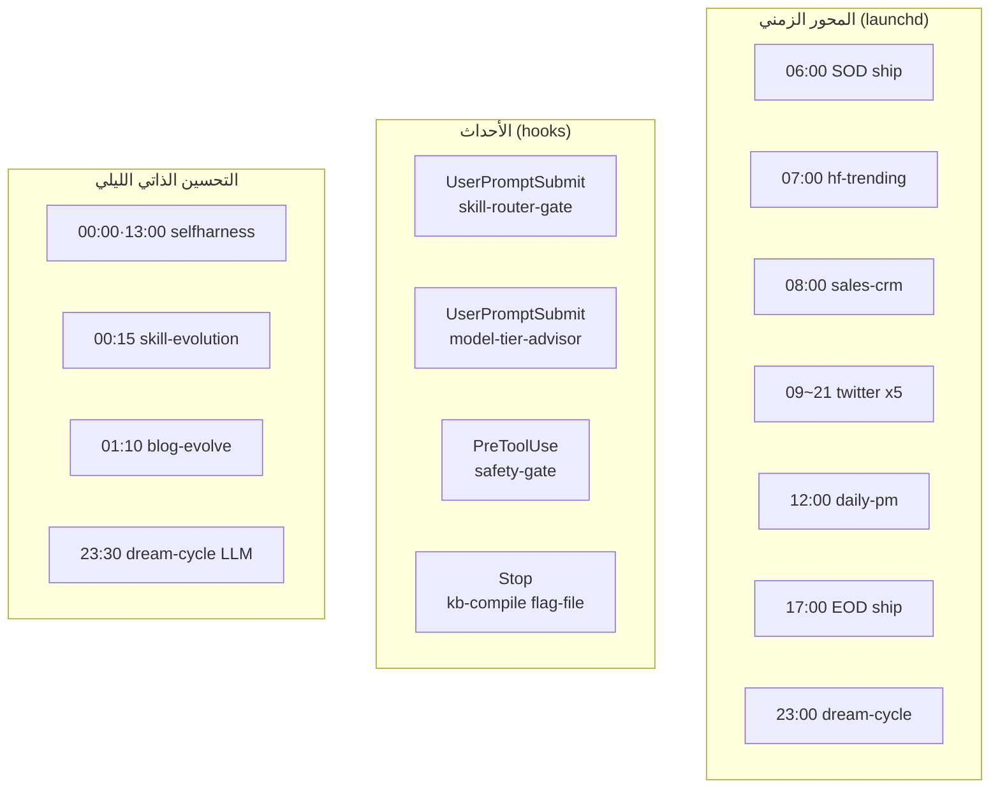
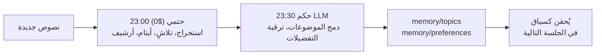

## تعريف صادق لمفهوم "الأتمتة"

قصص الأتمتة مبالغ فيها في الغالب. لذلك يلتزم هذا المقال بمعيار واحد: نذكر فقط ما هو مُوصَّل فعلاً للعمل، لا ما يظهر على مخططات المعمارية. ونصنّف كل عنصر حسب التكلفة -- فالكود الحتمي المكتوب بـ Python الذي لا يستدعي LLM يكلّف $0، أما ما يشغّل `claude -p` في تمريرة واحدة فيتحمّل تكلفة LLM.

شرط أساسي نوضحه أولاً: كل مُشغِّل LLM يستقي رمز OAuth للاشتراك من `~/.config/claude-code/headless.env`، وذلك لتفادي الفوترة بالاستخدام عبر API، ويعمل هذا حتى حين يكون keychain مقفلاً في بيئة launchd.

تنقسم الطبولوجيا الكاملة إلى ثلاثة محاور: جداول تعمل بالوقت، وخطافات تعمل بالأحداث، وحلقات تحسين ذاتي ليلية.

## 1. المحور الزمني: مهام launchd المجدولة

ملفات plist الموجودة في `scripts/launchd/` تملأ اليوم بالكامل. في أيام الأسبوع، تفتح SOD ship الساعة 06:00 اليوم بمزامنة git وتنظيف، وتجمع hf-trending الساعة 07:00 معلومات استخباراتية عن الاتجاهات في Hugging Face، وتُولِّد sales-crm الساعة 08:00 موجزاً للمبيعات، ومن الساعة 09:00 حتى 21:00 يُلخَّص التايم لاين على Slack خمس مرات بفاصل ثلاث ساعات. الساعة 10:00 تأتي أخبار bespin، والساعة 12:00 يعمل المُنسِّق daily-pm، وفي الساعة 17:00 تراجع EOD ship تغييرات اليوم وتُغلقها بـ commits وPRs.

| المهمة | الوقت (KST) | ما تقوم به | التكلفة |
|---|---|---|---|
| sod-ship | أيام الأسبوع 06:00 | مزامنة git صباحاً + ship | LLM |
| hf-trending | يومياً 07:00 | استخبارات اتجاهات Hugging Face | LLM (sonnet) |
| sales-crm-morning | أيام الأسبوع 08:00 | موجز CRM للمبيعات | LLM (opus مثبَّت) |
| twitter-timeline | أيام الأسبوع 09/12/15/18/21 | تصنيف التايم لاين ونشره على Slack | LLM (opus مثبَّت) |
| daily-pm | أيام الأسبوع 12:00 | منسِّق الأنابيب المسائية | LLM (sonnet) |
| eod-ship | أيام الأسبوع 17:00 | مراجعة نهاية اليوم، commit، PR | LLM |
| memkraft-dream-cycle | يومياً 23:00 | مرحلة الذاكرة الحتمية | $0 |

مبدأ التكلفة واضح هنا: لا نضع مراقباً استطلاعياً في حلقة Claude الساخنة أبداً. مراقب أسعار Toss مثلاً يعمل عبر `scripts/toss_monitor_tick.sh` بـ cron كل 5 دقائق ويُرسل إلى Slack فقط عند رصد حالة غير اعتيادية. تكلفته: $0. نستدعي Claude فقط حين يستوجب ذلك إنسان أو حدث.

## 2. محور الأحداث: الخطافات حتمية بالكامل، تكلفتها $0

كل خطاف مُسجَّل في `.claude/settings.json` هو Python أو shell حتمي، فتكلفته صفر. تتدخل هذه الخطافات بهدوء في كل دورة وكل استدعاء أداة لضمان الجودة والسلامة.

| الحدث | السكريبت | ما يقوم به |
|---|---|---|
| UserPromptSubmit | `skill-router-gate.py` | يُدرج مرشحي المهارات عبر BM25 (التحيات والأوامر تُتخطى بصفر رموز) |
| UserPromptSubmit | `model-tier-advisor.py` | يُدرج توصية تفويض/Plan Mode عند اكتشاف نية استكشاف أو مخاطرة |
| PreToolUse(Bash) | `pre-tool-safety-gate.sh` | يحجب الأوامر الخطرة (مثل: `rm -rf .venv`) |
| PreToolUse(Bash) | `preorder-check-guard.py` | حارس أوامر التداول |
| PostToolUse | `post-edit-format.sh` | تنسيق تلقائي للملفات المُعدَّلة |
| Stop | `kb-intel-compile.py` | نمط flag-file: يُعيد تجميع الويكي فقط حين توجد إشارة |

الخطاف الأخير Stop نمطٌ أنيق. بدلاً من تشغيل عمل ثقيل في كل دورة، تترك مهارة المنتِج إشارة `.compile-pending`، فيُعيد الخطاف تجميع الويكي حين توجد هذه الإشارة ثم يحذفها. إن لم توجد إشارة، ينتهي الخطاف فوراً بلا أي عبء. طريقة أنيقة لتشغيل العمل المكلف فقط بعد دورات إنتاج محددة.

## 3. حلقات التحسين الذاتي الليلية

في الليل، يعمل النظام على نفسه.

عند منتصف الليل والساعة 13:00، يطوِّر selfharness-evolve محتوى المهارات استناداً إلى الإخفاقات الفعلية. في الساعة 00:15، تُنشئ skill-evolution مهارات وتحسّنها باستقلالية، بحد أقصى ثلاث مهارات جديدة واثنتان مُحسَّنتان في كل تشغيل. في الساعة 01:10، تُحسِّن blog-evolve المدونة التقنية بذاتها.

يتضافر مع هذا نظام تصعيد النموذج القائم على المراجعة. كل مُشغِّل LLM يُسجِّل نتيجة تنفيذه عند الإنهاء؛ وإخفاقان متتاليان يُرقِّيان تلك المهارة تلقائياً من sonnet إلى opus. سجل التصعيد نفسه تكلفته $0، والتكلفة تزداد فقط في التنفيذات المُرقَّاة. حلقة selfharness التي تطوّر جودة المحتوى وحلقة retro التي تطوّر مستوى تكلفة التنفيذ هما حلقتان مستقلتان ومتعامدتان.

## 4. أنبوب الذاكرة: الفصل بين الحتمية والحكم

تُنظِّم memkraft dream-cycle الذاكرة في ست مراحل. ما يميّزها أن المراحل الحتمية ومراحل الحكم مفصولة زمنياً، وذلك لاعتبارات التكلفة.

المرحلة الحتمية ($0) تعمل الساعة 23:00 وتشمل: استخراج الجلسات، وتلاشي الانتباه، وحل الأيتام، ومسح الأرشيف. يستخرج استخراج الجلسات تدريجياً العناصر عالية الإشارة من النصوص الجديدة إلى `memory/sessions/`. يُخفِّض تلاشي الانتباه الدرجات بمقدار 0.02 يومياً، مُصنِّفاً المدخلات إلى تيرات HOT وWARM وCOLD والأرشيف، ويُضيف 0.15 عند الوصول.

مرحلة حكم LLM تعمل الساعة 23:30 وتتولى دمج الموضوعات والترقية إلى تفضيلات. فقط الأنماط التي تظهر ثلاث مرات أو أكثر بثقة 0.8 أو أعلى تُرقَّى إلى تفضيلات. تشغيل العمل الحتمي حتمياً وإرسال ما يتطلب حكماً إلى النموذج فقط -- هذا الفصل هو ما يُحقق الكفاءة في التكلفة والجودة معاً.

## منظور ThakiCloud: العمليات المستقلة مسألة ثقة

السبب في قدرة مهندس منفرد على إدارة كل هذا ليس كثرة الأتمتة، بل أن الأتمتة مُوصَّلة بصدق. العمل الحتمي يعمل بـ $0، ويُستدعى LLM فقط حيث يُحتاج للحكم، وكل مُشغِّل مستقل يُسجِّل إخفاقاته ويُصحِّح نفسه عبر حلقات المراجعة.

هذا هو نموذج التشغيل الذي نريد إظهاره لعملائنا على منصة الذكاء الاصطناعي المُشغَّلة محلياً. الأتمتة يجب ألا تكون عرضاً براقاً -- بل نظاماً يتوقف بأمان عند الإخفاق ويتحسن من البيانات. تشابك المحور الزمني ومحور الأحداث وحلقات التحسين الذاتي، مع وعي كل تروس منها بالتكلفة، هو ما يبني الثقة في العمليات المستقلة.

## خاتمة

مقياس الأتمتة ليس عدد أجزائها، بل هل تعمل بأمان دون إنسان. نُشغِّل جداول تعمل بالوقت، وخطافات تعمل بالأحداث، وحلقات تُصلح نفسها ليلاً -- مُصنَّفة حسب التكلفة. العمل الحتمي يعمل مجاناً، والحكم يُطبَّق بعناية، والإخفاقات تُصحَّح عبر المراجعات.

ThakiCloud تحوِّل هذا الانضباط في العمليات المستقلة إلى منتج. مزيد من التفاصيل متاح على موقعنا الإلكتروني.
