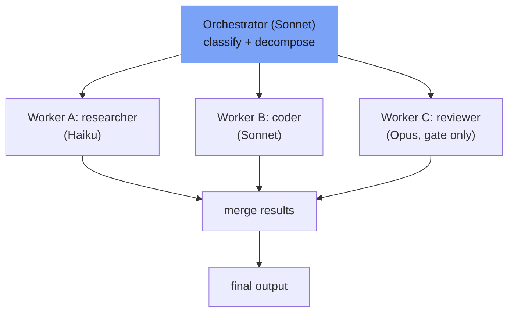

⏱️ **وقت القراءة المقدر**: 8 دقائق

<!-- evolve-diagram -->
*رسم تخطيطي توضيحي*



## لماذا هذا الموضوع الآن

في النصف الأول من عام 2026، تحولت نسبة كبيرة من أحمال عمل LLM في بيئات الإنتاج من استدعاءات نموذج واحدة إلى خطوط أنابيب متعددة الوكلاء. بعد أن أصدرت أطر العمل مثل LangGraph وCrewAI وMicrosoft Agent Framework وGoogle ADK إصداراتها المستقرة، باتت مسألة "أي نمط نستخدم ومتى" أهم من مسألة "كيف نربط المكونات".

تكمن المشكلة في أن الوكلاء المتعددين ليسوا مجانيين. تُولّد البنى المركزية ما يزيد على حمل الرموز بنسبة 285% مقارنة بالوكيل الواحد، فيما تتجاوز البنى الموزعة المستقلة 58%. اختيار النمط الخاطئ لا يُدهور النتيجة فحسب، بل يُفجّر التكاليف مع تراجع الجودة في الوقت ذاته.

في هذا المقال نستعرض الأنماط الستة المستخدمة فعلياً في الإنتاج خلال عام 2026، مع شروط الملاءمة والحالات التي ينبغي تجنبها بوضوح.

---

## النمط الأول: Orchestrator-Worker

هذا النمط الأكثر شيوعاً؛ إذ تستخدمه نحو 70% من نشرات الوكلاء المتعددين في الإنتاج استناداً إلى الدراسات الصناعية لعام 2026.

البنية بسيطة: يصنّف المنسق (Orchestrator) المهمة الواردة ويُجزئها إلى مهام فرعية، ثم يوزعها على عمال متخصصين (باحث، مبرمج، مختبر، مراجع) ويجمع النتائج.

```
Orchestrator
├── تجزئة المهمة
├── إرسال العامل A -> النتيجة A
├── إرسال العامل B -> النتيجة B
└── دمج النتائج -> المخرج النهائي
```

**متى تستخدمه**: حين تكون المهام قابلة للفصل بوضوح وتتطلب خبرة متخصصة في كل مجال.

**متى تتجنبه**: حين تكون التبعيات بين العمال عالية وتستدعي من المنسق مزامنة الحالة في كل خطوة؛ ما يجعل المنسق عنق الزجاجة.

**تنبيه التكاليف**: تثبيت نموذج المنسق على Opus يعني أن كل قرار توجيه يستخدم أغلى النماذج. الأكثر اقتصاداً هو تخصيص Sonnet للمنسق وحصر Opus في خطوات العمال التي تستلزم استدلالاً معقداً.

---

## النمط الثاني: Sequential Pipeline

بنية خطية ذات مراحل ثابتة، حيث يصبح مخرج كل مرحلة مدخل المرحلة التالية.

نموذج RAG المعتاد مثال نموذجي: إعادة صياغة الاستعلام، ثم البحث، ثم إعادة الترتيب، ثم التوليد، ثم المعالجة اللاحقة. تغيير الترتيب يُفقد العملية معناها ولا يمكن تجاوز المراحل.

**متى تستخدمه**: حين تكون سير العمل حتمية وتستوجب الحفاظ على الترتيب بين المراحل.

**متى تتجنبه**: حين تكون بعض المراحل غير ضرورية تبعاً لطبيعة المهمة؛ ففي هذه الحالة يكون النمط الديناميكي ذو التفرع الشرطي أنسب.

**نصيحة التنفيذ**: في LangGraph، تثبيت الحواف بين العقد يُنشئ Sequential Pipeline. حفظ النتائج الوسيطة كنقاط تفتيش يُغني عن إعادة التشغيل من الصفر عند الفشل.

---

## النمط الثالث: Fan-out / Fan-in

تشغيل N من المهام المستقلة بالتوازي ثم دمج نتائجها في مخرج واحد.

مثال: معالجة نفس المستند في الوقت ذاته بواسطة وكيل مراجعة الدقة ووكيل الثغرات الأمنية ووكيل أسلوب الكود، ثم دمج تقاريرهم في مراجعة شاملة.

```python
# البنية المفاهيمية
results = await asyncio.gather(
    accuracy_agent.run(document),
    security_agent.run(document),
    style_agent.run(document)
)
final_report = merge_agent.run(results)
```

**متى تستخدمه**: حين يوجد أربع مهام مستقلة أو أكثر بلا تبعيات بيانية فيما بينها، مما يُتيح تقليل وقت الاستجابة الكلي عبر التوازي.

**متى تتجنبه**: حين لا تكون المهام مستقلة فعلاً؛ إذ يُفضي التوازي القسري لمهام متشابكة إلى تعارض النتائج في مرحلة Fan-in.

---

## النمط الرابع: Multi-agent Debate

تُقدم عدة وكلاء إجاباتهم على المهمة ذاتها من زوايا مختلفة، ثم يراجع وكيل ناقد هذه الإجابات ويستخلص الجواب النهائي. يُعرف أيضاً بحلقة Maker-Checker.

دقته أعلى من الاستدعاء الفردي للنموذج، لكن تكلفته أعلى أيضاً. يُستخدم حين تأتي الدقة قبل السرعة.

**متى تستخدمه**: في المجالات ذات تكلفة الخطأ المرتفعة كالطب والقانون والمال، أو حين يلزم البحث عن الثغرات الأمنية في الكود المُولَّد.

**متى تتجنبه**: في مسارات الاستجابة الفورية الحساسة لزمن الاستجابة؛ لأن الجولات الإضافية للنقاش ترفع وقت الاستجابة بشكل خطي.

---

## النمط الخامس: Dynamic Handoff

حين يُدرك الوكيل أثناء معالجة المهمة أن ما يواجهه يتخطى قدراته، يُحوّل التحكم إلى الوكيل الأنسب. لا يكون منطق التوجيه مُرمَّزاً مسبقاً، بل يتحدد بحسب تدفق المحادثة.

سيناريو دعم العملاء مثال نموذجي: وكيل الاستفسارات العامة يُحيل المشكلة التقنية إلى وكيل الدعم الفني، وحين يظهر نزاع في الدفع يُحيله إلى وكيل المدفوعات.

**ملاحظة تنفيذية**: يجب تضمين سجل التحويلات السابقة في السياق لمنع تشكّل حلقات بين الوكلاء، وإلا ينشأ تنقل لا نهاية له من A إلى B ثم العودة إلى A.

---

## النمط السادس: Adaptive Planning

يُستخدم في المشكلات المفتوحة التي تُحدَّد فيها الأهداف فقط وتحتاج الخطة نفسها إلى الاكتشاف أثناء التنفيذ. يستكشف الوكيل البيئة ويقرر الخطوة التالية بناء على النتائج الوسيطة.

وكلاء هندسة البرمجيات (من نوع SWE-bench) والوكلاء البحثية المستقلة تعتمد هذا النمط حين يتعذر تحديد تسلسل الخطوات مسبقاً.

**المخاطر**: إن ظلت شروط الإيقاف غامضة، استكشف الوكيل خطوات أكثر مما يلزم. يجب تحديد حد أقصى للتكرارات أو سقف للتكاليف.

---

## جدول معايير اختيار النمط

| النمط | بنية المهمة | التبعية التسلسلية | التوازي | مستوى التكلفة |
|-------|------------|-------------------|---------|----------------|
| Orchestrator-Worker | قابل للفصل | منخفضة | جزئي | متوسط |
| Sequential Pipeline | خطي ثابت | عالية | لا يوجد | منخفض |
| Fan-out / Fan-in | مستقل متوازٍ | لا يوجد | كامل | منخفض إلى متوسط |
| Multi-agent Debate | مهمة واحدة | لا يوجد | جزئي | مرتفع |
| Dynamic Handoff | غير متوقع | لا يوجد | لا يوجد | متوسط |
| Adaptive Planning | مفتوح | لا يوجد | لا يوجد | الأعلى |

---

## مبادئ التحكم في التكاليف

قبل تبني الوكلاء المتعددين ينبغي التساؤل: هل تستلزم هذه المهمة فعلاً وكلاء متعددين؟ تحويل المهمة البسيطة قسراً إلى نمط متعدد الوكلاء يرفع التكاليف بينما يبقى الجودة مماثلاً للوكيل الواحد أو أدنى منه.

ثمة ثلاثة مبررات للجوء إلى الوكلاء المتعددين:

أولاً: حين تتباين التخصصات فعلياً. توليد الكود ومراجعته الأمنية مهمتان ذواتا طابع مختلف.

ثانياً: حين يُتيح التوازي المستقل خفض إجمالي زمن الاستجابة.

ثالثاً: حين تُحسّن حلقة النقد والمراجعة الدقة تحسيناً ملموساً، مما يُبرر التكلفة الإضافية لنمط Multi-agent Debate.

**فصل طبقات النماذج** هو جوهر التحكم في التكاليف: عمال الاستكشاف والبحث وقراءة الملفات تُخصَّص لـ Haiku، وعمال التنفيذ والمراجعة لـ Sonnet، وبوابات التحقق من البنية أو القرارات المعقدة فقط لـ Opus. تشغيل خط الأنابيب كله بنموذج واحد يُهدر التكاليف والجودة معاً.

---

## خلاصة

اختيار النمط أهم من اختيار الإطار. سواء نفّذت Fan-out عبر LangGraph أو Orchestrator-Worker عبر CrewAI، فإن عدم توافق النمط مع بنية المهمة يعني أن الإطار لن يحل المشكلة.

الخطأ الأكثر شيوعاً اليوم هو تطبيق Adaptive Planning على مهام لا تستلزمه. نشر حلقة استكشاف مفتوحة بلا شرط إيقاف في الإنتاج يُفضي إلى انفجار التكاليف أو انتهاء المهلة. يُستحسن التحقق أولاً من كفاية Sequential Pipeline أو Fan-out.

---

<!-- evolve-refs -->
## المراجع

- [Anthropic: How we built our multi-agent research system](https://www.anthropic.com/engineering/built-multi-agent-research-system)
- [LangGraph](https://github.com/langchain-ai/langgraph)
- [CrewAI Docs](https://docs.crewai.com/)
