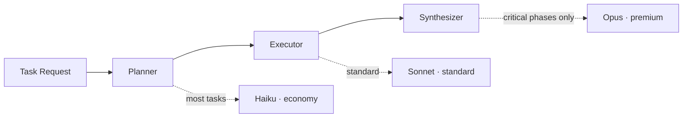

## السؤال التالي في السحابة: كيف تُشغّل الوكلاء؟

على مدى العقد الماضي، تحددت أجيال السحابة بما تديره. في البداية كانت الخوادم والبنية التحتية، ثم البيانات والأنابيب. أما السؤال الذي يطفو على السطح في بيئات الإنتاج الآن فهو مختلف. في اللحظة التي تبدأ فيها تشغيل عدة وكلاء ذكاء اصطناعي معًا، تفقد الرؤية على مَن فعل ماذا، وتخرج التكاليف عن التوقعات، ولا تُستوفى متطلبات الأمان والتدقيق، ويُعيد كل فريق بناء الشيء ذاته باستقلالية تامة.

Paxis يستهدف هذا الفراغ. تعامَلت السحابة التقليدية مع الحوسبة وقواعد البيانات والشبكات باعتبارها موارد من الدرجة الأولى. Paxis يعامل قدرات وكلاء الذكاء الاصطناعي (Skills) وأدواتهم (Tools) وسياساتهم (Policies) وسجلات التدقيق (Audit) باعتبارها موارد من الدرجة الأولى. يستطيع العملاء توظيف "فريق كامل من موظفي الذكاء الاصطناعي" وإدارته ومراجعته دون كتابة أي كود. نُسمّي هذه الفئة Agent-Native Cloud.


هذه المقالة ليست شعارات تسويقية، بل شرح لـ PoC عامل مع كود حقيقي. كل رقم أدناه تحقّق من خلال خادم فعلي (`localhost:8080`).

## الوحدات الأساسية: ثلاثة أشياء للتذكر

الواجهة الخلفية لـ Paxis مكتوبة بـ Go. تُقرأ البنية بوضوح على ثلاث طبقات: البنية التحتية في الأسفل، ثم الـ core فوقها، ثم طبقة القدرات في الأعلى.

- بيئة تشغيل الوكيل (Native Loop): نقطة دخول التنفيذ الوحيدة التي تجتمع فيها حلقة ReAct وتنفيذ الأدوات وتتبع التكاليف وبوابات الاستقلالية.
- حزمة المهارات (Skill Harness): تحمّل المهارات تلقائيًا عند الإقلاع وتختار المهارات ذات الصلة باستخدام TF-IDF.
- محرك المعرفة الهجين (HKE): طبقة معرفة مبنية على Git لاستيعاب وكلاء الفريق والاستعلام منها.
- بوابة LLM: تجرّد مزوّدي النماذج المتعددين وتعمل كمصدر وحيد للحقيقة في توجيه التكاليف.
- الأمان والسياسة: مصفوفة الاستقلالية (L0-L3) وأمان المطالبات والتدقيق الكامل للإجراءات.
- الذاكرة: ذاكرة الجلسة والبحث الدلالي pgvector وتتبع مسار البيانات (provenance).

يرتكز كل ذلك على تنفيذ في بيئة معزولة (sandbox) وتنسيق متعدد الوكلاء. إن احتجت لتذكّر ثلاثة أشياء فقط: بيئة التشغيل، وحزمة المهارات، ومحرك المعرفة.

## إضافة قدرة = ملف واحد

تكلفة إضافة قدرة جديدة في Paxis هي صفر عمليات نشر. ضَع ملف `skills/<domain>/<name>/SKILL.md` واحدًا ويفحص الخادم الدليل تلقائيًا ويُضيفه فورًا.

```markdown
---
name: competitor-digest
description: >-
  Collects and summarizes competitor news. Use when tracking competitor activity or news digests.
allowed-tools: [web_search, web_fetch]
---
# Competitor Digest
## Instructions
Gather the latest articles from the specified sources and distill the key points into bullets.
```

احفظ الملف ويظهر في `GET /api/v1/skills` دون إعادة تشغيل الخادم. في الـ PoC، حُمِّلت 849 مهارة تلقائيًا عند الإقلاع إلى جانب 14 وكيل نطاق افتراضي. يعني مبدأ "المهارات السميكة، الحزمة النحيفة" أن القدرات تتراكم كملفات فيما تبقى الحزمة خفيفة.

إنشاء مهمة متكررة بلغة طبيعية يتبع النمط ذاته.

```bash
curl -X POST http://localhost:8080/api/v1/tasks \
  -H "Authorization: Bearer $TOKEN" \
  -d '{"team_id":"dev-team","agent_id":"research-bot",
       "schedule":{"type":"cron","expr":"0 9 * * *"},
       "skill":"competitor-digest","params":{"topN":10}}'
```

اكتب في المحادثة "لخّص لي أبرز 10 أخبار منافسين كل صباح عند الساعة 9" ويُترجم النموذج ذلك إلى هذا الـ cron والمهارة والمعاملات ويسجّلها. صفر أسطر من الكود.

## CostRouter: الكود يختار النموذج لكل مهمة

مشكلة "انفجار تكاليف الذكاء الاصطناعي" لها سبب واحد في الغالب: استخدام نموذج مكلف لكل شيء. Paxis يقسّم المهمة إلى ثلاث مراحل -- Planner وExecutor وSynthesizer -- ويُسند إلى كل مرحلة النموذج المناسب تلقائيًا.



تُدار طبقات النماذج من مصدر وحيد هو `models.yaml`. الفارق في السعر لكل مليون رمز مخرجات ملحوظ.

| الطبقة | النموذج | السعر $/1M | الاستخدام |
|---|---|---|---|
| economy | Haiku 4.5 | $4 | غالبية المهام |
| standard | Sonnet 4.6 | $15 | الأحمال المتوازنة |
| strong | GPT-4o / Kimi | متوسط | التعزيز |
| premium | Opus 4.8 | $25 | المراحل الحرجة فقط (opt-in) |

الفكرة الجوهرية أن معظم المهام تكفيها Haiku الأرخص، ويُستخدم Opus فقط في المراحل الحرجة حقًا. تُفرض حدود ميزانية لكل عملية تنفيذ مما يجعل التكاليف قابلة للتنبؤ وظاهرة في Command Center يوميًا وأسبوعيًا. ومع تراكم الاستخدام، يتعلم التوجيه أي المهام يكفيها نموذج أرخص، فتنخفض تكلفة تنفيذ المهام المتكررة تدريجيًا.

## ما الذي يُميّز HKE عن RAG التقليدي؟

RAG التقليدي هو في جوهره استرجاع مؤقت يُضاف عند الاستعلام. محرك المعرفة الهجين (HKE) في Paxis يعامل المعرفة كأصل يتراكم.

| RAG التقليدي | Paxis HKE |
|---|---|
| استرجاع منفرد عديم الحالة | ويكي دائم مبني على Git (يتراكم) |
| لا حدود نطاق | عزل نطاق لكل وكيل |
| لا تتبع لمصدر البيانات | سجلات provenance (مَن، متى، أي مصدر) |
| تكلفة غير محكومة | tool-budget يقطع النتائج الكبيرة أو يؤجّل الجلب |

المستندات أو الكود المُحمَّل يمر بمعالجة ويتطور إلى رسم بياني للمعرفة، وتستشهد الإجابات بمصادرها. ويكي كل فريق معزول تمامًا بحيث لا تظهر معرفة فريق لفريق آخر. تحت ذلك تقبع ذاكرة من أربع طبقات -- ذاكرة الجلسة والبحث الدلالي pgvector وويكي الفريق وسجلات provenance -- فيتراكم السياق كلما تكررت المحادثات.

## وكلاء تحت السيطرة: الحوكمة كميزة تنافسية

العروض التوضيحية البراقة كثيرة، لكن ضعف الحوكمة يحول دون دخول الوكلاء إلى بيئات المؤسسات. Paxis يجعل السيطرة هي الإعداد الافتراضي.

- مصفوفة الاستقلالية L0-L3: بوابات تنفيذ قبل تشغيل المهمة، بناءً على مستوى المخاطر والصلاحيات.
- أمان المطالبات وإزالة المعلومات الشخصية.
- سلسلة تدقيق كاملة للإجراءات: كل إجراء مسجّل -- مَن، ومتى، وماذا.
- عزل متعدد المستأجرين بين الفرق.

فوق ذلك، صُمّم النظام لتحسين القدرات بالاستخدام. تعمل حلقة العناية بالترتيب التالي: Propose ثم Distill ثم Patch، وسلّم ثقة المهارة يرفع المهارات من `system` إلى `learned` إلى `promoted` بناءً على الاستخدام. هذه الحلقة التحسينية الذاتية تعمل جزئيًا وهي قيد التطوير -- هذا PoC صادق. وبلا مبالغة، الاتجاه والهيكل موجودان بالفعل في الكود.

## ثلاثة سيناريوهات تجريبية لفريق المبيعات

قوة Paxis أن الفريق الداخلي الذي يستخدمه هو نفسه الذي يعرضه على العملاء.

1. مساعد يعمل أثناء نومك: شغّل Proactive مرة واحدة وسيصل إحاطة الصباح التالي إلى Slack تلقائيًا.
2. أوكِل العمل بالكلام: جملة واحدة بلغة طبيعية تُسجَّل كـ cron ومهارة.
3. المستندات تصبح معرفة الفريق: اسحب ملف PDF لعرض ما ويستطيع الفريق بأكمله طرح الأسئلة في المحادثة مع الاستشهاد بالمصادر.

كل هذا يُدار من شاشة واحدة هي Command Center، تشمل الجداول الزمنية والتكاليف والتعاون والتدقيق.

## منظور ThakiCloud: لماذا هذا الاتجاه؟

منصة الذكاء الاصطناعي في ThakiCloud تُشغّل بيئة متعددة المستأجرين على Kubernetes، وتجدول GPUs باستخدام Kueue وتخدّم النماذج عبر vLLM. Paxis هو مستوى التحكم فوق ذلك لتشغيل الوكلاء بأمان.

ثلاثة أسباب تجعل هذا التوليف ذا معنى. أولًا، الحوكمة -- استقلالية L0-L3 والتدقيق الكامل وعزل الفرق -- مدمجة بشكل أصيل، مما يعني أن بيئات القطاع العام والمالي والمؤسسات الكبرى التي تشترط الأمان والتدقيق وفصل البيانات تحصل عليها خارج الصندوق. ثانيًا، التصميم يفترض النشر المحلي (on-premises) والاستضافة الذاتية (self-hosting)، لذا تستطيع المؤسسات التي لا تستطيع إرسال البيانات خارج نطاقها تشغيله. ثالثًا، يُتيح اختيار CostRouter للنموذج لكل مهمة مع حدود الميزانية التشغيل مع إبقاء تكاليف GPU وواجهات برمجة التطبيقات تحت السيطرة. ميزة التكلفة على مستوى التخديم تتحول مباشرة إلى ميزة تنافسية للمنتج.

Paxis في مرحلة PoC حاليًا. النواة -- المحادثة والمهارات والجدولة وCommand Center وتوجيه التكاليف وHKE -- تعمل. بعض الميزات المتقدمة على خارطة الطريق. "جاهز للعرض التجريبي اليوم، ابدأ بسير عمل واحد" هي رسالتنا الصادقة.

## للمزيد

- المصدر: [github.com/ThakiCloud/praxis](https://github.com/ThakiCloud/praxis)
- مجموعة شرائح العرض التنفيذي (33 شريحة مع ملاحظات العرض): [Google Slides](https://docs.google.com/presentation/d/11E5ixfWgV6uY-akebEZ--Kwp1JmRQJG1OpPaChbJLmc/edit)

نبحث عن زملاء للبناء معنا وعملاء للتجربة التجريبية. نعزم على تعريف فئة Agent-Native Cloud قبل الجميع.
