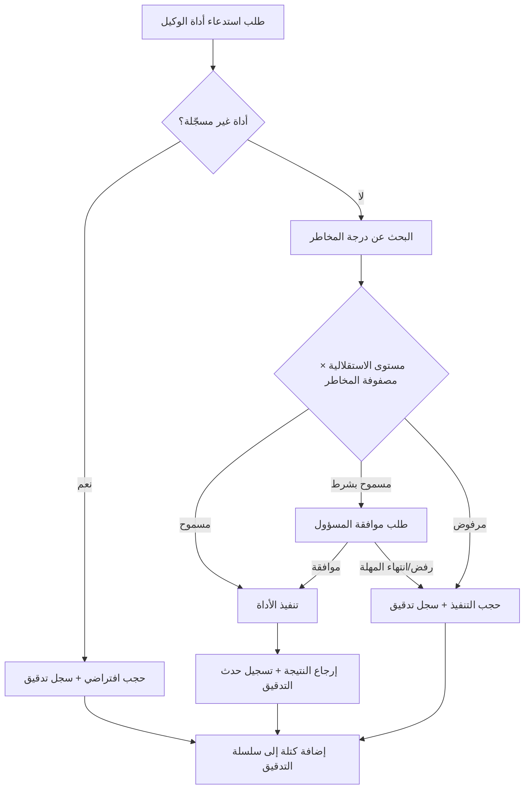

## نظرة عامة

لم يعد اعتماد وكلاء الذكاء الاصطناعي في القطاع المالي خيارًا اختياريًا. مع توسّع نطاق التطبيقات -- أتمتة تقييم الائتمان واكتشاف المعاملات المشبوهة ودعم خدمة العملاء -- بات على كل مؤسسة مالية أن تحقق هدفَي الكفاءة التشغيلية والامتثال التنظيمي في آنٍ واحد.

تكمن المشكلة في أن منصات الذكاء الاصطناعي الحالية لا تعالج هذين الهدفين معًا. إذ تتمتع واجهات برمجة تطبيقات نماذج اللغة الكبيرة المستندة إلى السحابة بقدرات هائلة، غير أن البيانات تمر عبر خوادم خارجية. وكثيرًا ما تفتقر أطر عمل الوكلاء مفتوحة المصدر إلى مسارات التدقيق أو ضوابط الوصول. في المقابل، تشترط الجهات التنظيمية إمكانية تتبع كل قرار يتخذه الذكاء الاصطناعي، وفقًا للوائح الإشراف المالي الإلكتروني ومعيار ISMS-P وإرشادات معهد أمن المعلومات المالية الكوري.

تتناول هذه المقالة من خلال حالة بنك كوري افتراضي البنية المعمارية التي تُتيح لوكلاء الذكاء الاصطناعي استيفاء اللوائح المالية مع تحقيق أتمتة فعلية للعمليات. ويتمحور ذلك حول آليتَي التحكم في الاستقلالية والإطار التدقيقي المنيع ضد التلاعب.

---

## أوجه توقف المؤسسات المالية عن اعتماد الذكاء الاصطناعي

### متطلبات تخزين البيانات محليًا

تحظر المادة 13-2 من لوائح الإشراف المالي الإلكتروني وإرشادات استخدام الحوسبة السحابية الصادرة عن لجنة الخدمات المالية -- من حيث المبدأ -- معالجة البيانات المالية للعملاء أو تخزينها على خوادم خارجية، أو تشترط الحصول على موافقة مسبقة. قد يؤدي استخدام الذكاء الاصطناعي التوليدي مباشرةً عبر واجهة برمجة تطبيقات خارجية إلى إرسال أرقام الحسابات وسجلات المعاملات وبيانات التعريف الواردة في نصوص الطلبات إلى مراكز بيانات في الخارج. وهذه المسألة وحدها كافية لتوقف كثير من مشاريع إثبات المفهوم لدى المؤسسات المالية.

### غياب مسارات التدقيق

إذا تعذّر إعادة إنتاج أساس توصية الذكاء الاصطناعي بحدٍّ ائتماني معين أو تعليقه تلقائيًا لمعاملة مشبوهة، فإن ذلك يمثّل خطرًا جسيمًا في حالات التفتيش الذي يجريه المشرف المالي أو التدقيق الداخلي. وعبارة "قام الذكاء الاصطناعي بذلك" ليست إجابةً مقبولة لدى الجهات التنظيمية. ما يُتطلب هو سجل قابل للاسترجاع زمنيًا يوضح: أي نموذج، بأي مدخلات، استدعى أي أدوات، وأنتج أي مخرجات.

### عدم اليقين في التحكم بالوكلاء المستقلين

عند نشر وكلاء يتجاوزون نطاق برامج الدردشة البسيطة -- باستدعاء واجهات برمجة تطبيقات خارجية وقراءة الملفات وإرسال رسائل البريد الإلكتروني وتنفيذ أوامر النظام -- قد تنشأ تصرفات غير متوقعة إذا لم تُحدَّد بوضوح حدود ما يُسمح للوكيل بفعله. فإذا أجرى وكيل مستقل في القطاع المالي معاملاتٍ بسبب استقلالية مفرطة أو خاطئة، فقد يفضي ذلك إلى خسائر مالية فضلًا عن انتهاكات تنظيمية.

### تعدد المستأجرين والعزل الداخلي

حتى حين تتشارك أقسام الأوراق المالية والتأمين والأمانة البنية التحتية ذاتها للذكاء الاصطناعي، يجب أن تكون بيانات كل فريق وسجلات تدقيقه معزولةً عزلًا تامًا. فإن تمكّن وكيل أحد الأقسام من الوصول إلى بيانات عملاء قسم آخر أو سجلات معاملاته، فذلك يُشكّل انتهاكًا لمبادئ الرقابة الداخلية.

---

## البنية المعمارية للحوكمة: محرك السياسات ومصفوفة الاستقلالية × المخاطر

### لماذا يجب وجود محرك سياسات

إعطاء وكيل أداةً (Tool) وضبط استخدام تلك الأداة بصورة آمنة مسألتان مختلفتان. فمجرد ضبط إعداد "يُسمح لهذا الوكيل باستخدام واجهة برمجة تطبيقات استعلام العملاء" لا يمنع الوكيل من تنفيذ آلاف الاستعلامات تتاليًا بسبب خطأ في التقدير، أو الاطلاع بصورة مفرطة على حقول بيانات حساسة.

يتحقق محرك سياسات Paxis من بُعدَين متقاطعَين قبل تنفيذ أي استدعاء لأداة.

**4 مستويات للاستقلالية:**

- **L0 (يدوي بالكامل):** يقترح الوكيل فقط، ويوافق الإنسان على كل عملية تنفيذ.
- **L1 (استقلالية منخفضة المخاطر):** يُنفَّذ تلقائيًا للمهام القائمة على القراءة فحسب والمهام غير المالية.
- **L2 (استقلالية متوسطة المخاطر):** تُنفَّذ المعاملات دون الحد المحدد مسبقًا تلقائيًا، وتُطلب الموافقة عند تجاوزه.
- **L3 (استقلالية عالية):** تنفيذ مستقل واسع النطاق ضمن النطاق الذي يسمح به محرك السياسات.

**7 درجات للمخاطر:**

تُصنَّف استدعاءات الأدوات من الدرجة 1 (استعلام بسيط) إلى الدرجة 7 (معاملة خارجية غير قابلة للعكس) وفقًا للمخاطر. مثلًا، الاستعلام عن رصيد العميل يقع في الدرجة 1، بينما تنفيذ تحويل بين الحسابات يقع في الدرجتين 6-7. لكل أداة مضمّنة درجة مخاطر مسجّلة مسبقًا، وتُحجب الأدوات غير المسجّلة تلقائيًا بصورة افتراضية.

### تدفق قرار السياسة

### حالة افتراضية: وكيل تقييم الائتمان في بنك A

يرغب بنك A في نشر وكيل ذكاء اصطناعي لتقييم ائتمان الشركات الصغيرة والمتوسطة. المهام التي يؤديها الوكيل هي التالية:

1. الاستعلام عن المعلومات الائتمانية للشركات من نظام استعلام الائتمان NICE (درجة المخاطر 2)
2. الاستعلام من قاعدة بيانات سجلات القروض الداخلية (درجة المخاطر 1)
3. تحليل القوائم المالية والتوصية بالحد الائتماني (حكم فقط، دون تنفيذ خارجي)
4. صياغة مسودة رأي التقييم الائتماني (توليد مستند)
5. استدعاء واجهة برمجة تطبيقات تسجيل الحد عند الموافقة (درجة المخاطر 6)

في هذه الحالة، يُضبط مستوى استقلالية الوكيل على L2. تُنفَّذ المهام 1-4 تلقائيًا، لكن استدعاء واجهة برمجة تطبيقات تسجيل الحد (المهمة 5) ذو الدرجة 6 يستلزم موافقة المسؤول المختص. يستحيل هيكليًا أن يسجّل الوكيل الحد مباشرةً دون موافقة.

تُشترط موافقة المسؤول لتسع عمليات عالية المخاطر (إلغاء الحساب والتحويلات الجماعية وتغييرات تكامل الأنظمة الخارجية وغيرها) بصرف النظر عن مستوى الاستقلالية.

---

## التدقيق والتتبع: سجلات سلسلة التجزئة وإخفاء البيانات الشخصية

### آلية عمل سجلات تدقيق سلسلة التجزئة

صُمّم إطار التدقيق في Paxis بنية سلسلة التجزئة (Hash Chain). يحتوي كل حدث تدقيق على قيمة التجزئة (Hash) للحدث السابق، لذا فإن حذف أي سجل وسيط أو تعديله يُفشل التحقق من التجزئة لجميع الكتل اللاحقة. تُتيح هذه البنية اكتشاف التلاعب حتى لو حاول مسؤول قاعدة البيانات تغيير السجلات عن طريق الخطأ أو عمدًا.

يتجاوز عدد أنواع الأحداث المسجّلة 20 نوعًا، وأبرزها:

- `agent.tool.invoked`: طلب استدعاء الأداة (معرّف الوكيل واسم الأداة وسياق التنفيذ)
- `agent.tool.policy.denied`: الحجب بواسطة محرك السياسات (درجة المخاطر ومستوى الاستقلالية وأساس القرار)
- `agent.tool.approval.requested`: نشوء طلب موافقة المسؤول
- `agent.tool.approval.decided`: نتيجة الموافقة/الرفض (معرّف متخذ القرار والطابع الزمني)
- `agent.session.started`: بدء جلسة الوكيل (معرّف الفريق ومعرّف الوكيل ومعرّف الجلسة)
- `sandbox.exec`: حدث تنفيذ الكود داخل بيئة الحماية (Sandbox)

يُفهرس كل حدث بـ `run_id`، مما يُتيح الاستعلام وإعادة إنتاج جميع استدعاءات الأدوات وقرارات السياسة وسجلات الموافقة التي تُشكّل تدفق معالجة تقييم ائتماني واحد تحت `run_id` واحد. تُحفظ سجلات التدقيق لمدة 90 يومًا أو أكثر.

### الإخفاء التلقائي لـ 16 فئة من البيانات الشخصية

قد تحتوي البيانات التي يعالجها الوكيل على معلومات شخصية كأرقام تسجيل السكان وأرقام الحسابات وأرقام الهواتف وعناوين البريد الإلكتروني. تكتشف طبقة حماية النصوص في Paxis أنماط 16 فئة من البيانات الشخصية في الوقت الفعلي في مرحلة الإدخال وتُخفيها تلقائيًا.

مثلًا، إذا كان نتيجة استعلام معلومات العميل يحتوي على رقم تسجيل السكان، فإنه يُستبدل بـ `[رقم تسجيل السكان مُخفى]` قبل أن ينقله الوكيل إلى نموذج اللغة الكبيرة. وبما أن سجلات التدقيق تُسجّل الصيغة المُخفاة فحسب دون البيانات الأصلية، ينخفض خطر كون السجلات نفسها مسارًا لتسريب البيانات الشخصية.

كذلك يكتشف النظام 11 نمطًا من أنماط هجمات حقن النصوص (تبديل الأدوار وتجاهل التعليمات ومحاولات التهرب وغيرها) في الوقت الفعلي لمنع محاولات إساءة تشغيل الوكيل من خلال مدخلات ضارة.

### عزل تعدد المستأجرين

حتى حين يستخدم قسم الائتمان وقسم إدارة الأصول في بنك A المثيل ذاته من Paxis، تُعزل الويكي والجلسات والإعدادات وسجلات التدقيق عزلًا تامًا استنادًا إلى معرّفات الفريق (Team IDs). إذا حاول وكيل فريق الائتمان الوصول إلى بيانات عملاء فريق إدارة الأصول، تُجيب البيانات نفسها بـ "غير موجود"، دون الكشف حتى عن وجودها.

---

## دلالات تطبيق ThakiCloud

### النشر المحلي + المعزول لتحقيق متطلبات تخزين البيانات محليًا

يمكن نشر منصة ThakiCloud AI Platform مباشرةً في الشبكة الداخلية لمركز معالجة البيانات التابع للمؤسسة المالية على أساس Kubernetes. إذ تجري جميع عمليات الاستنتاج داخل المؤسسة، فلا تُنقل المعلومات المالية للعملاء خارجها. يتضمن خارطة طريق Paxis مجموعة نشر معزولة (Air-Gap) [تقديري: الربع الأول من 2027]، مع خطط لدعم التكوينات التي تعمل باستقلالية حتى في البيئات المغلقة حيث تُحجب الشبكات الخارجية كليًا.

تُنشر البنية التحتية للمراقبة (VictoriaMetrics/VictoriaLogs) أيضًا على الشبكة الداخلية، مما يُتيح مراقبة عمليات الوكيل والتكاليف والسلوكيات الشاذة في الوقت الفعلي.

### تكامل Keycloak OIDC RBAC مع أدلة المستخدمين الحالية

تُشغّل المؤسسات المالية عمومًا أدلة موظفين قائمة على AD (Active Directory) أو LDAP. تتكامل منصة ThakiCloud AI Platform مع الأدلة الحالية من خلال تكامل OIDC عبر Keycloak، بحيث تنعكس فورًا على المنصة تغييراتُ إنشاء حسابات الموظفين وحذفها وتعديل صلاحياتها. يمنع هذا نظام بقاء حسابات الموظفين المستقيلين محتفظةً بصلاحية الوصول إلى وكلاء الذكاء الاصطناعي.

### ربط محرك السياسات بأطر الرقابة الداخلية

يمكن تعيين مصفوفة الاستقلالية × المخاطر مباشرةً على إطار الرقابة الداخلية للمؤسسة المالية. مثلًا، يمكن تطبيق مبدأ "موافقة شخصَين أو أكثر على العمليات الحرجة" الذي تشترطه معايير الرقابة الداخلية للجنة الخدمات المالية بوصفه قاعدةً إلزامية للموافقة على العمليات عالية المخاطر في محرك السياسات.

يستطيع فريق التدقيق الاستعلام عن كامل سجل المعالجة لقضية ائتمانية بعينها باستخدام `run_id`، والاطلاع على شاشة واحدة على البيانات التي رجع إليها الوكيل والقرارات التي اتخذها محرك السياسات وهوية المعتمد. يُسهم هذا في ضمان إمكانية التحقق اللاحق من سلوك الذكاء الاصطناعي بالمستوى المطلوب في عمليات تفتيش هيئة الإشراف المالي.

### تحسين التكاليف عبر موجّه نماذج اللغة الكبيرة

يستطيع موجّه نماذج اللغة الكبيرة الذي يدعم أكثر من 10 مزودين لنماذج اللغة الكبيرة إضافةً إلى نموذج Metis الخاص بـ ThakiCloud تقييد المؤسسات المالية باستخدام نماذج محددة حصلت على موافقة أمنية فحسب، أو توجيه نماذج اقتصادية في التكلفة ونماذج عالية الدقة تلقائيًا وفقًا لنوع المهمة. يُحقق التكوين الهجين الذي يستخدم Metis المحلي كخلفية استنتاج أساسية والمزودين الخارجيين كاحتياط فحسب متطلبات تخزين البيانات محليًا وكفاءة التكاليف في آنٍ واحد.

---

## القيود والاعتبارات

يلزم تقييم صادق. بالرغم من تطور البنية المعمارية، توجد قيود واقعية.

**عدم اليقين في تفسير الأنظمة:** لا تزال الأنظمة المحلية المتعلقة بحوكمة الذكاء الاصطناعي في القطاع المالي في طور التطور. كثيرًا ما لا تُحدد أحكام توظيف الذكاء الاصطناعي في لوائح الإشراف المالي الإلكتروني وإرشادات أمن الذكاء الاصطناعي الصادرة عن معهد أمن المعلومات المالية الكوري المتطلبات التقنية التفصيلية، لذا يستلزم الامتثال الفعلي التشاور المسبق مع فرق القانون والجهات التنظيمية. لا يُضمن أن سجلات التدقيق ومحرك السياسات التي توفرها Paxis تستوفي متطلبات تنظيمية بعينها؛ ويستلزم هذا مراجعةً منفصلة لكل مؤسسة.

**شهادة SOC 2 Type II:** خارطة طريق شهادة SOC 2 Type II لـ Paxis مجدولة للربع الثاني من 2027 أو ما بعده. يجب على المؤسسات المالية التي تشترط حاليًا شهادة SOC 2 Type II مراعاة هذا الجدول الزمني.

**تعقيد تصميم السياسات:** مصفوفة الاستقلالية × المخاطر أداة قوية، لكن تصميمها بصورة صحيحة لتتناسب مع عمليات المؤسسة يتطلب قدرًا كبيرًا من المعرفة المتخصصة والوقت. إذا كان التصميم الأولي للسياسة معيبًا، فستنشأ مشكلات إما لأن الوكيل يحجب عمليات كثيرة جدًا (قيود مفرطة) أو يتمتع باستقلالية مفرطة (تساهل مفرط). النشر المتدرج والتعديل القائم على بيانات التشغيل ضروريان.

**عدم قابلية التنبؤ بسلوك الوكيل:** يوفر محرك السياسات التحكم على مستوى استدعاء الأدوات، لكنه لا يتحكم كليًا في عملية استنتاج نموذج اللغة الكبيرة ذاتها. حتى حين يستخدم الوكيل أدواتٍ مسموحًا بها بموجب السياسة فحسب، قد ينفذها بتسلسلات أو تركيبات غير متوقعة. لا سيما في العمليات التي تُعدّ فيها دقة الحكم أمرًا حرجًا كتقييم الائتمان، يجب تعريف وكلاء الذكاء الاصطناعي بوضوح بوصفهم داعمةً لاتخاذ قرار المسؤول المختص -- لا حاملةً لسلطة القرار النهائي.

**العبء التقني للعمليات المحلية:** تشغيل بيئة Kubernetes المحلية يستلزم قدرات تشغيل بنية تحتية أعلى بكثير مقارنةً بالخدمات السحابية كاملة الخدمة. يلزم وجود كوادر متخصصة طوال دورة التشغيل بأكملها -- إدارة ArgoCD GitOps وإدارة Keycloak ونشر تحديثات النماذج وغير ذلك. ينبغي مراجعة هذا الجانب جنبًا إلى جنب مع عقد دعم التشغيل مع ThakiCloud أو خطة بناء قدرات داخلية.

---

اعتماد وكلاء الذكاء الاصطناعي في القطاع المالي ليس مسألة تقنية -- بل هو مسألة حوكمة. ما يقع في صميمها هو: أين تُخزَّن البيانات، وإلى أي حد يمكن للوكيل التصرف باستقلالية، وهل تُسجَّل جميع تلك التصرفات بطريقة قابلة للتحقق؟ يقدم محرك السياسات وسجلات التدقيق بسلاسل التجزئة إجاباتٍ تقنية عن هذه الأسئلة الثلاثة، لكن ينبغي أن نُذكّر أنفسنا بأن هذا ليس كل ما يعنيه الامتثال التنظيمي.
