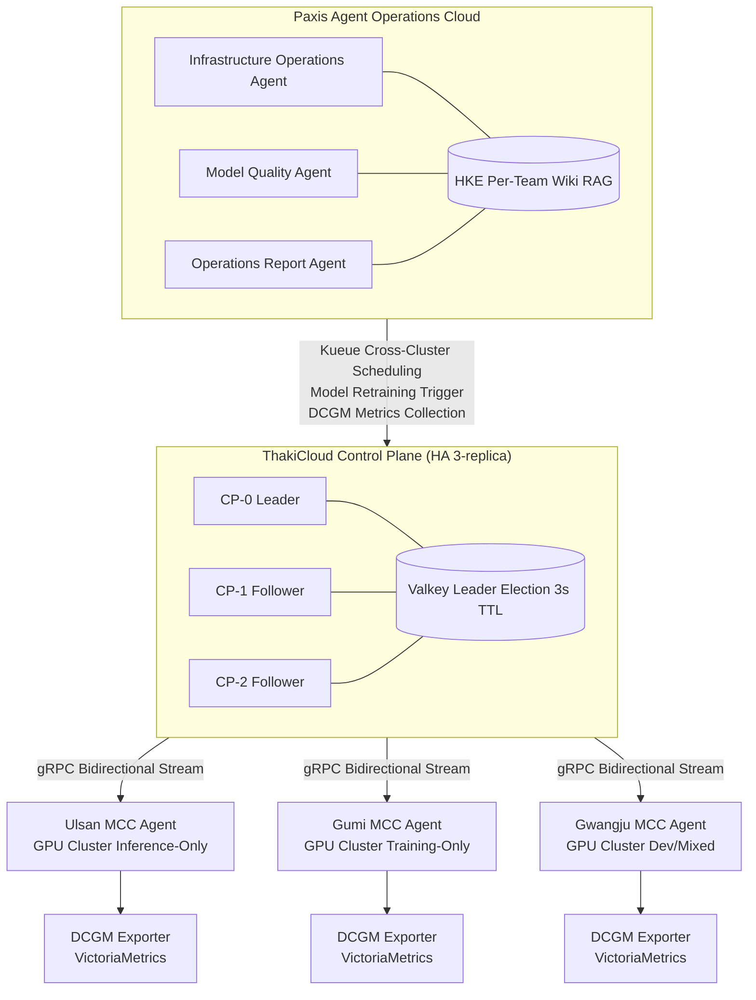

## نظرة عامة

يواجه التصنيع الحديث تناقضاً هيكلياً: رغبة عالية في تبني الذكاء الاصطناعي، لكن نقصاً حاداً في الكوادر التشغيلية. حتى حين تريد المصانع نشر نماذج فحص بصري على خطوط الإنتاج، تفتقر إلى متخصصي MLOps القادرين على صيانة تلك النماذج وخدمتها وإعادة تدريبها. ومع إدارة ثلاث مجموعات GPU في مصانع مختلفة من فرق منفصلة، يتكرر هدر الموارد وتوقف الإنتاج في حلقة مفرغة.

يوضح هذا المقال كيف تحل فرق العملاء الذكيين المستقلين متعددي الأدوار هذه المشكلة، وكيف يمكن توحيد مجموعات GPU الموزعة عبر مصانع متعددة تحت مستوى تحكم واحد -- وذلك من خلال دراسة حالة الشركة التصنيعية الافتراضية "HanTek". التقنيات الأساسية التي يتناولها المقال هي الإدارة المركزية متعددة المجموعات في ThakiCloud AI Platform وسحابة عمليات العملاء Paxis.

---

## اختناق الكوادر في عمليات الذكاء الاصطناعي التصنيعي

HanTek شركة تصنيع مكونات إلكترونية متوسطة الحجم تشغّل مجموعات GPU في مرافق بمدن أولسان وغومي وغوانغجو. على مدى العامين الماضيين، نشرت الشركة نماذج الذكاء الاصطناعي البصري على كل خط مصنع، غير أن ثلاث مشكلات متكررة برزت في العمليات.

**أولاً، نقص حاد في كوادر MLOps.** تتطلب إعادة تدريب النماذج ونشرها ومراقبة أدائها مهندسين متخصصين. فريق ML في HanTek المكون من ثلاثة مهندسين عجز عن إدارة دورة حياة النماذج عبر المصانع الثلاثة. حتى حين يبدأ أداء النماذج بالتراجع، كانت طلبات إعادة التدريب تنتظر في قائمة الانتظار لأيام.

**ثانياً، إدارة متشظية لمجموعات متعددة.** كانت مجموعة GPU لكل مصنع تعمل باستقلالية تامة. نشأت مواقف تُقف فيها مهام التدريب في غومي في قائمة الانتظار بينما مجموعة أولسان خاملة، مما يستلزم التنسيق اليدوي عبر Slack. كانت مقاييس DCGM أيضاً تُجمع بشكل منفصل لكل مصنع، مما يجعل من المستحيل رؤية معدل استخدام GPU على مستوى الشركة بنظرة واحدة.

**ثالثاً، استحالة الاستجابة على مدار الساعة.** عند اكتشاف شذوذات الجودة في خطوط العمل الليلية أو في عطلات نهاية الأسبوع، لم يكن فريق ML قادراً على الاستجابة الفورية. كانت التنبيهات تصل، لكن المعالجة الفعلية تُؤجل إلى صباح اليوم التالي -- مع احتمال وصول المنتجات المعيبة إلى المرحلة الإنتاجية التالية في غضون ذلك.

هذه المشكلات ليست حكراً على HanTek. عبر قطاع التصنيع، يتكرر نمط واحد: تبني الذكاء الاصطناعي، لكن القدرات التشغيلية لا تواكب التطور، مما يُنصّف الفعالية.

---

## تكوين فريق العملاء المستقل -- تعدد الأدوار والمهام الديناميكية

الحل الذي اعتمدته HanTek هو فريق عملاء ذكيين مستقلين متعددي الأدوار مبني على Paxis. Paxis سحابة عمليات تُعامل العملاء كموارد من الدرجة الأولى "مثل الأجهزة الافتراضية على AWS". المهارات والأدوات والسياسات وسجلات التدقيق هي الموارد الأساسية للمنصة، ويرجع كل عميل إلى ويكي نطاقه (محرك المعرفة الهجين، HKE) لاتخاذ القرارات استناداً إلى المعرفة المتراكمة.

كوّنت HanTek فريق العملاء بثلاثة أدوار.

### عميل عمليات البنية التحتية

يتولى عميل عمليات البنية التحتية مراقبة حالة مجموعات GPU، وتحسين جدولة المهام، والاسترداد التلقائي عند اكتشاف الشذوذات. يجمع مقاييس Kueue وKAI Scheduler باستمرار، ويتخذ قراراً مستقلاً بإعادة توزيع المهام على مجموعة أخرى حين يتجاوز وقت انتظار قائمة الانتظار في مجموعة معينة الحد المسموح.

يُنفذ هذا العميل المهام المتكررة المعرّفة بلغة طبيعية -- مثل "توليد تقرير استخدام GPU كل صباح الساعة السابعة" -- عبر مجدول المهام الديناميكي في Paxis. لم يعد المشغلون بحاجة إلى كتابة نصوص cron منفصلة؛ يكفي إدخال مواصفات المهمة في المحادثة أو Slack ليجدول العميل نفسه.

### عميل جودة النماذج (شخصية محلل المعايير)

يراقب عميل جودة النماذج باستمرار أداء نماذج الذكاء الاصطناعي البصري على كل خط. يحلل مقاييس زمن الاستدلال والدقة المجمّعة من VictoriaMetrics، ويُشغّل خط أنابيب إعادة التدريب تلقائياً حين يتجاوز تدهور الأداء الحد المحدد. بعد اكتمال إعادة التدريب، ينشر ملخص نتائج المعايير في قناة Slack لفريق ML.

يرجع هذا العميل إلى سجل النماذج المتراكم خط بخط في HKE. المعرفة بالنطاق مثل "نموذج هذا الخط يحتاج إعادة تدريب كل ثلاثة أشهر، ومعيار الدقة الأساسي 98.5% أو أعلى" موثقة في الويكي، مما يُمكّن العميل من اتخاذ قرارات ذات سياق واعٍ.

### عميل تقارير العمليات (شخصية أتمتة التقارير)

يُولّد عميل تقارير العمليات تلقائياً تقارير تشغيل الذكاء الاصطناعي اليومية والأسبوعية والشهرية ويوزعها. يجمع معدل استخدام GPU وعدد حالات الاستدلال لكل نموذج وأحداث اكتشاف شذوذات الجودة وحالة إعادة التدريب، ثم يُنسّقها في شكل يسهل على الإدارة قراءته. تُنشر التقارير في Slack والبريد الإلكتروني ولوحات الويب في آن واحد عبر قدرة التسليم متعدد القنوات في Paxis.

### هيكل تعاون فريق العملاء

يعمل العملاء الثلاثة باستقلالية، لكنهم يتعاونون عند الحاجة عبر تنسيق العملاء المتعددين في Paxis. على سبيل المثال، حين يُشغّل عميل جودة النماذج إعادة التدريب، يحدث تفويض تلقائي عبر العملاء -- يطلب من عميل عمليات البنية التحتية تأمين طاقة مجموعة GPU للتدريب. تُسجّل عملية التفويض هذه جميع قرارات صنع القرار عبر محرك السياسات وسجل التدقيق.

---

## الإدارة المركزية متعددة المجموعات -- توحيد GPU عبر مصانع متعددة

لكي يعمل فريق العملاء بشكل صحيح، يجب إدارة مجموعات GPU عبر مصانع متعددة مركزياً تحت مستوى تحكم واحد. نظام Multi-Cluster Cloud (MCC) في ThakiCloud AI Platform يؤدي هذا الدور.

المخطط التالي تبسيط للهيكل الفعلي لـ HanTek.

### فصل مستوى التحكم عن مستوى البيانات

تفصل ThakiCloud AI Platform بصرامة بين مستوى التحكم (CP) ومستوى البيانات (DP). يكتسب هذا الفصل أهمية في بيئات التصنيع لأن **مهام الاستدلال على خطوط المصنع تستمر في التشغيل حتى حين يواجه CP عطلاً**. يعمل الذكاء الاصطناعي البصري في مصنع أولسان دون انقطاع أثناء فصل شبكة CP تحديداً بفضل هذه البنية.

يُنشر وكيل MCC في كل مجموعة مصنع. يتواصل هذا الوكيل مع CP عبر تدفق gRPC ثنائي الاتجاه، ويحافظ على الاتصال من خلال إعادة الاتصال بأسلوب Make-Before-Break حتى حين تحدث تأخيرات في الشبكة. حتى حين تُقطع وصلة WAN كلياً، لا تتأثر مهام مستوى البيانات.

### جدولة GPU متعددة المجموعات عبر Kueue وKAI Scheduler

تُدير كل مجموعة مصنع أحمال عمل GPU عبر Kueue وKAI Scheduler. يحسب KAI Scheduler درجات المجموعات البينية بترتيب GPU > CPU > ذاكرة > قرص لتحديد التوزيع الأمثل. يقرأ عميل عمليات البنية التحتية مقاييس هذا المجدول، وعند اكتشاف إشارات مثل "وقت انتظار قائمة تدريب مجموعة أولسان يتجاوز 30 دقيقة"، يقترح إعادة توزيع المهام على مجموعة غومي أو يُنفّذها تلقائياً [تقديري].

حين يتجاوز استخدام GPU باستمرار 80% من متوسط المجموعة، يُشغَّل تنبيه VictoriaMetrics ويُولّد عميل عمليات البنية التحتية تقرير توصية بتوسيع الطاقة، ثم ينشره في قناة فريق ML.

### تكامل تيليمتري GPU المستندة إلى DCGM

يجمع مُصدِّر DCGM (مدير GPU لمراكز البيانات) في كل مجموعة تيليمتري GPU في VictoriaMetrics. كانت HanTek في السابق تضطر لمشاهدة لوحات Grafana منفصلة مُهيأة لكل مصنع على حدة، لكن VictoriaLogs وVictoriaMetrics توفران الآن طبقة مراقبة واحدة مجمّعة مركزياً. يستعلم عميل جودة النماذج مباشرة عن هذه المقاييس لاكتشاف شذوذات زمن الاستدلال.

### GitOps لـ ArgoCD واتساق المجموعات

تُدار عمليات نشر النماذج وتغييرات التهيئة في المجموعات الثلاث للمصانع كلها عبر ArgoCD باستخدام نهج GitOps. حين يُسجَّل وكيل MCC في مجموعة جديدة، يُنشأ سر مجموعة ArgoCD تلقائياً. حين يكتشف عميل تقارير العمليات تحديثاً لنموذج معين، يُنشئ PR في مستودع Git المقابل [تقديري]، وينشر ArgoCD تلقائياً على كل مجموعة مصنع.

---

## دلالات التطبيق لـ ThakiCloud

الدروس التطبيقية العملية المستخلصة من حالة HanTek هي التالية.

**نهج جوهري لحل اختناقات الكوادر.** فرق العملاء متعددي الأدوار ليست مصممة لاستبدال مهندسي MLOps، بل لتفويض المهام المتكررة للمراقبة وإعداد التقارير. يُركز المهندسون على العمل عالي القيمة مثل تحسين بنية النماذج وتحليل حالات الشذوذ، بينما يتولى العملاء العمليات اليومية. القيمة طويلة الأمد تنشأ من حقيقة أن دقة حكم العميل تزداد كلما تراكمت المعرفة بالنطاق في ويكي HKE.

**مرونة تشغيلية عبر مجدول المهام الديناميكي.** يتيح مجدول المهام الديناميكي في Paxis تعريف المهام بلغة طبيعية، مما يُمكّن مشغلي الميدان من إعداد الأتمتة مباشرة دون المرور عبر قسم تقنية المعلومات. يمكن تطبيق متطلبات تشغيلية محددة فوراً، مثل "إرسال تقرير ملخص لشذوذات الجودة خلال الأسبوع الماضي إلى البريد الإلكتروني لرؤساء الفرق كل إثنين الساعة الثامنة صباحاً".

**تحقيق الرؤية عبر تكامل المجموعات المتعددة.** توفر إدارة المجموعات المتعددة عبر مستوى تحكم واحد رؤية فورية لمعدل استخدام GPU على مستوى الشركة وحالة قوائم انتظار المهام والتكاليف لكل مجموعة. يمكن الآن تهيئة سياسات كانت مستحيلة في السابق على مستوى مستوى التحكم -- مثل "السماح تلقائياً بمهام تدريب جديدة حين يقل معدل استخدام GPU المجمّع عبر المصانع الثلاثة عن 60%".

**موثوقية محرك السياسات وسجلات التدقيق.** في بيئات التصنيع، تُعدّ قابلية تتبع القرارات التي يتخذها الذكاء الاصطناعي أمراً بالغ الأهمية. يُسجّل محرك السياسات وسجل التدقيق في Paxis جميع إجراءات العملاء ويُبقي على سجل قابل للتدقيق يوضح الإجراءات المتخذة ومسوّغاتها. هذا يُقدم مساعدة عملية في الوفاء بمتطلبات تدقيق شهادات الجودة والامتثال الداخلي.

---

## القيود والاعتبارات

لا ينطبق هذا النهج بشكل موحد على جميع بيئات التصنيع. ثمة قيود عملية يجب فحصها قبل التبني.

**تكلفة بناء المعرفة بالنطاق الأولية.** يتطلب بناء المعرفة بالنطاق في ويكي HKE التي سيستخدمها العملاء استثماراً مسبقاً. يجب توثيق المعرفة الضمنية مثل خصائص النماذج المحددة للخط ونطاقات التشغيل الطبيعية ومعايير إعادة التدريب بشكل صريح. قد يؤدي نشر العملاء دون هذا التحضير إلى أخطاء في الحكم المبكر.

**تحديد نطاق استقلالية العميل.** يجب تحديد نطاق القرارات التي يمكن للعملاء اتخاذها باستقلالية بوضوح. تُناسب مُشغّلات إعادة تدريب النماذج وتوليد التقارير التنفيذ المستقل، لكن استبدال النماذج وإعادة تهيئة المجموعات التي تؤثر على خطوط الإنتاج يكون أكثر أماناً إذا احتفظت بخطوات موافقة بشرية. يتيح محرك السياسات في Paxis تهيئة هذه الحدود.

**واقع بيئات الشبكات.** في بيئات مصانع الصناعة الثقيلة المحلية، كثيراً ما تكون سياسات جدار الحماية للاتصالات بين شبكات المصانع الداخلية والسحابة صارمة. يجب التحقق مسبقاً مما إذا كانت اتصالات gRPC لوكيل MCC مسموحاً بها وما إذا كان عرض نطاق WAN مستقراً. بالنسبة للبيئات المحلية الخالصة، يجب أخذ تهيئة نشر كلٍّ من CP وDP في الموقع بعين الاعتبار.

**تعقيد تعاون العملاء.** يُنشئ تنسيق العملاء المتعددين سيناريوهات عطل أكثر تعقيداً مقارنة بعميل واحد. يجب تصميم سياسات التراجع وأنظمة التنبيه لمعالجة الحالات التي يُرسل فيها عميل تفويضاً خاطئاً عبر العملاء. على الرغم من أن خط أنابيب Plan-Execute في Paxis يُنظّم التنفيذ في ثلاث مراحل -- المخطط والمُنفّذ والمُولّف -- يظل الاختبار الكافي لحالات الشذوذ أمراً ضرورياً.

**الاكتساب التدريجي للنضج التشغيلي.** لا يُنصح بتفويض جميع العمليات للعملاء منذ البداية. النهج التدريجي أكثر واقعية: ابدأ بمهام ذات مخاطر منخفضة كأتمتة التقارير، وتحقق من جودة حكم العميل، ووسّع الاستقلالية فقط بعد ترسّخ الثقة.

---

اختناق الكوادر في عمليات الذكاء الاصطناعي التصنيعي لا يُحل ببساطة بتوظيف المزيد من الأشخاص. الاتجاه المستدام لعمليات الذكاء الاصطناعي التصنيعي هو هيكل تتولى فيه فرق العملاء المستقلين المهام التشغيلية المتكررة، وتُقلل الإدارة المركزية متعددة المجموعات من هدر موارد GPU، ويُركز البشر على القرارات والتحسينات الأكثر تعقيداً. توفر ThakiCloud AI Platform وPaxis الوسائل التقنية الملموسة لتنفيذ هذا الهيكل.
