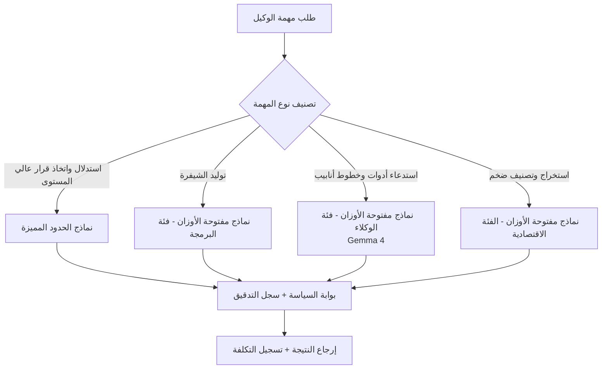

حين يفتح معظم الفرق فاتورة تشغيل وكلائهم، يقعون في الوهم ذاته: "وكلاؤنا يجرون استدلالاً معقداً، إذاً لا بد من استخدام أفضل النماذج في قمة الهرم." غير أن فحص حركة البيانات الفعلية يكشف صورة مختلفة تماماً. الغالبية العظمى من الطلبات تتمحور حول تحويل اللغة الطبيعية إلى استدعاءات API، وتصنيف السجلات، وربط خطوط الأنابيب، وتلخيص النتائج، وهي مهام متكررة لا تستلزم استدلالاً على مستوى عالمي. ومع ذلك، حين تُعالَج كلها بنماذج حدود مميزة، فإن الفريق يدفع ثمن مواصفات فائضة عن الحاجة.

يوثق هذا المقال قياساً حقيقياً لرصد هذا الهدر ثم التخلص منه. أجرينا تجارب عملية لتحويل طلبات تشغيل حقيقية إلى استدعاءات أدوات باستخدام نموذج مفتوح الأوزان (Gemma 4)، وتحققنا من الجودة، ثم حسبنا إلى أي مدى تنخفض التكاليف عند توجيه كل مهمة إلى النموذج المناسب لها عبر Paxis CostRouter، مستخدمين رموزاً مميزة حقيقية وأسعاراً فعلية. الخلاصة مباشرة: انخفضت التكلفة على نفس عبء العمل بما يصل إلى 44 مرة مقارنة بنماذج الحدود المميزة.

## ما هذا النهج

الفكرة الجوهرية بسيطة. بدلاً من معالجة جميع مهام الوكيل بنموذج واحد، يُوجَّه كل نوع من المهام إلى درجة مختلفة من النماذج بحسب طبيعته. الاستدلال المعقد واتخاذ القرار يذهبان إلى نماذج الحدود المميزة، وتوليد الشيفرة يذهب إلى نماذج مفتوحة الأوزان متخصصة في البرمجة، واستدعاء الأدوات وتنفيذ خطوط الأنابيب يذهبان إلى نماذج مفتوحة الأوزان من الفئة العاملة، والاستخراج والتصنيف الضخم يذهبان إلى الفئة الاقتصادية الأرخص. إن أرسلت كل مهمة إلى النموذج الأنسب لها، حافظت على الجودة وخففت الفاتورة.

لكي ينجح هذا النهج، لا بد أن يصح أمران: أولاً، أن تكون النماذج مفتوحة الأوزان قادرة فعلاً على أداء الجزء الأكبر من مهام الوكيل. وثانياً، أن يتولى المنصة عملية التوجيه تلقائياً دون أن يضطر الفريق إلى اختيار النموذج يدوياً في كل مرة. يثبت ما يلي هذين الأمرين بالتجربة والتكوين الفعلي.



## التثبيت والتكامل

بدأنا بالتحقق من قدرة النماذج مفتوحة الأوزان على أداء المهمة الجوهرية للوكيل، وهي تحويل الطلبات اللغوية الطبيعية إلى استدعاءات أدوات منظمة. كان الهدف التحقق من Gemma 4 بحجم 26 مليار معامل عبر واجهة برمجة تطبيقات مُدارة. صُممت التجربة باستخدام المكتبات القياسية فقط (urllib) دون أي تبعيات إضافية.

المهمة التي أسندناها إلى الوكيل هي مخطط أدوات لخط أنابيب عمليات سحابية. حددنا خمس أدوات: الاستعلام عن المقاييس، وإعادة تشغيل حاويات Pods، وتجميع التكاليف، وتوسيع عمليات النشر، وتدوير الأسرار، ثم طلبنا من الوكيل تحليل طلب لغوي طبيعي وإخراج JSON واحد يتضمن الأداة الصحيحة والمعاملات الإلزامية.

```python
TOOL_SPEC = """You are an operations automation agent. Convert the user request into a single tool-call JSON.
Output only the JSON object, with no explanation or markdown fences.

Available tools and required parameters:
- query_metrics: {metric, window_days, threshold?, region?}
- restart_pods: {region, selector, only_failed(bool)}
- aggregate_cost: {group_by, month, service?}
- scale_deployment: {name, region, replicas}
- rotate_secret: {name, namespace}

Output schema: {"tool": "<name>", "params": { ... }}"""

def call(prompt):
    body = {
        "contents": [{"role": "user",
                      "parts": [{"text": TOOL_SPEC + "\n\nRequest: " + prompt}]}],
        "generationConfig": {"temperature": 0.0, "maxOutputTokens": 1024},
    }
    # call gemma-4-26b-a4b-it via generateContent, capture latency, tokens, and output
```

اصطدمنا هنا بمشكلة عملية تستحق التنبيه. ينتج Gemma 4 رموزاً مميزة للتفكير قبل الإجابة النهائية، وحين يُحدد سقف الإخراج بـ 256 رمزاً تنقطع مرحلة التفكير وتأتي النتيجة الأخيرة فارغة. بمجرد رفع السقف إلى 1024 وتصفية الأجزاء التي تحمل علامة `thought` واستخراج الإجابة الفعلية فقط، عمل النموذج بصورة صحيحة. هذا خطأ شائع يغفل عنه كثيرون عند دمج النماذج مفتوحة الأوزان في خطوط الأنابيب، ولهذا آثرنا توثيقه بكود قياسي فعلي.

أما جانب المنصة فتتولاه كتالوج نماذج Paxis. تتيح Paxis إدارة النموذج المستخدم من أي مزود في ملف تعريفي واحد (`models.yaml`) يتضمن سعر الإدخال والإخراج لكل رمز مميز إلى جانب الدرجة، وهو الأساس الذي يقوم عليه التوجيه.

```yaml
# models.yaml: tier and actual cost per token are the basis for routing (USD / 1M tokens)
- id: claude-opus-4-8      # premium
  tier: premium
  costInput: 5.0
  costOutput: 25.0
- id: claude-sonnet-5      # standard (default)
  tier: standard
  costInput: 3.0
  costOutput: 15.0
# Add open-weight providers (Ollama, vLLM, etc.) with the same schema
# and CostRouter will automatically route tasks to the matching tier.
```

حين تصل مهمة جديدة، يحدد CostRouter درجتها ويختار أرخص نموذج مؤهل من الكتالوج. بمجرد إضافة مزودي النماذج مفتوحة الأوزان بالمخطط ذاته، تتدفق مهام استدعاء الأدوات والمعالجة الضخمة تلقائياً إلى الفئة الاقتصادية الأرخص، دون أن يحتاج الفريق إلى اتخاذ أي قرار يدوي في كل مرة.

## نتائج التجربة الفعلية

قدمنا ستة طلبات تشغيل حقيقية إلى Gemma 4 وقيّمنا النتائج مباشرة بمعيارين: هل الإخراج JSON صالح، وهل يتضمن الأداة الصحيحة مع المعاملات الإلزامية كاملة؟

| المقياس | النتيجة |
|---|---|
| نسبة JSON الصالح | 6/6 (100%) |
| مطابقة المخطط (الأداة + المعاملات الإلزامية) | 6/6 (100%) |
| متوسط وقت الاستجابة | 15.3 ثانية (نقطة نهاية مجانية مشتركة، تشمل رموز التفكير) |
| متوسط رموز الإدخال | 155 |
| متوسط رموز الإخراج | 33 (الإجابة النهائية) |
| متوسط رموز التفكير | 514 |

نجحت الحالات الست جميعها في تحديد الأداة الصحيحة واستكمال المعاملات الإلزامية كاملة. على سبيل المثال، للطلب "أظهر العقد التي تجاوزت فيها نسبة استخدام GPU 80% خلال الأيام السبعة الماضية" أنتج النموذج:

```json
{"tool": "query_metrics", "params": {"metric": "gpu_utilization", "window_days": 7, "threshold": 80}}
```

كان `threshold` معاملاً اختيارياً في المخطط، لكن النموذج استخلص قيمة "80%" من الطلب ووضعها في موضعها الصحيح. وللطلب "زد نسخ نشر inference-api في منطقة ap-northeast إلى 6"، ربط `scale_deployment` بالاسم والمنطقة وعدد النسخ بدقة تامة. هذا قياس نظيف يثبت أن نماذج مفتوحة الأوزان قادرة فعلاً على أداء المهمة الجوهرية لأتمتة الوكلاء، وهي استدعاء الأدوات وتنفيذ خطوط الأنابيب.

متوسط 15.3 ثانية قُيس على نقطة نهاية مشتركة مجانية تشمل رموز التفكير. في بيئة خدمة ذاتية أو معالجة دفعية، ينخفض هذا الرقم بشكل ملحوظ. المهم هنا ليس الكمون المطلق بل الحقيقة الأساسية: الجودة لم تتراجع.

الآن نصل إلى التكلفة. انطلاقاً من ملف تعريف الرموز المميزة المقاسة، افترضنا أن كل مهمة تستهلك 1000 رمز إدخال و300 رمز إخراج وهو سيناريو واقعي لجولة واحدة تشمل موجه النظام ومخطط الأدوات والسياق، مع أسطول وكلاء يعالج 10000 مهمة يومياً على مدى 30 يوماً. استخدمنا أسعار نماذج الحدود من `models.yaml` الفعلي في Paxis، وأسعاراً تقديرية تمثيلية للاستدلال المُدار بالنماذج مفتوحة الأوزان في منتصف عام 2026.


| الفئة | التكلفة لكل مهمة | التكلفة الشهرية (10 آلاف/يوم - 30 يوم) | المقارنة بالمميزة |
|---|---|---|---|
| حدود مميزة | $0.0125 | $3,750 | المرجع |
| حدود قياسية | $0.0075 | $2,250 | أرخص 1.7 مرة |
| حدود اقتصادية | $0.0020 | $600 | أرخص 6.2 مرة |
| نماذج مفتوحة الأوزان مُدارة (مستوى Gemma) | $0.000285 | $86 | أرخص 43.9 مرة |
| نماذج مفتوحة الأوزان اقتصادية | $0.00007 | $21 | أرخص 178.6 مرة |

نفس عبء العمل يكلف $3,750 شهرياً مع النماذج المميزة، مقابل $86 شهرياً مع نماذج مفتوحة الأوزان من مستوى Gemma، أي فارق يبلغ نحو 44 مرة. وكما أثبتت التجربة، بلغت جودة هذه الفئة مفتوحة الأوزان في مهام استدعاء الأدوات 100%. بمعنى آخر، هذا التوفير لم يأتِ على حساب الجودة بل من إزالة المواصفات الفائضة عن الحاجة. قد تتفاوت أسعار النماذج مفتوحة الأوزان بحسب المزود وما إذا كانت ذاتية الاستضافة أم مُدارة، لذلك أشرنا إليها صراحةً بوصفها تقديرية، إلا أن الاتجاه الجوهري، أي وفورات تغير رتبة كاملة، يبقى راسخاً.

## الدلالات التطبيقية لمنتجات ThakiCloud

يتقاطع هذا النمط تقاطعاً دقيقاً مع تصميم Paxis، السحابة الأصيلة للوكلاء من ThakiCloud. تتعامل Paxis مع المهارات والأدوات والسياسات وسجلات التدقيق بوصفها موارد أولى، تماماً كما تتعامل السحابة التقليدية مع الخوادم والشبكات. يعمل CostRouter فوق هذه البنية بوصفه الطبقة التي تختار النموذج الملائم لكل مهمة.

- **التوجيه حسب المهمة وظيفة أساسية.** يمثل `models.yaml` مصدر الحقيقة الوحيد لتحديد المزود والنموذج. بمجرد تسجيل مزودي النماذج مفتوحة الأوزان بالمخطط ذاته، تتدفق مهام استدعاء الأدوات والمعالجة الضخمة تلقائياً إلى الفئة الأرخص. يبقى النموذج القياسي هو الافتراضي، ولا يُستدعى المميز إلا باختيار صريح، مما يمنع التوجيه المفرط من الوقوع بالخطأ.
- **العزل والحوكمة مدمجان.** بصرف النظر عن الفئة الموجه إليها، تمر النتائج جميعها عبر بوابة السياسة وسجل التدقيق. استخدام نموذج أرخص لا يعني إرخاء الرقابة. بل على العكس، يُسجَّل النموذج والرموز المميزة والتكلفة لكل مهمة، مما يتيح تحديد أي المهام تستنزف فئة مكلفة دون مبرر وإعادة توجيهها لاحقاً.
- **التوافق مع متطلبات الاستضافة الذاتية والسيادة الرقمية.** يمكن تشغيل النماذج مفتوحة الأوزان على GPU داخلي، مما يتيح للعملاء الذين لا يمكنهم إخراج البيانات خارجياً تحقيق التوفير والتحكم في آن واحد. تدير منصة ai-platform في ThakiCloud هذه الفئة مفتوحة المصدر بصورة متعددة المستأجرين عبر جدولة GPU المبنية على Kueue وخدمة vLLM، مما يعني أن الكفاءة البنية التحتية لـ ai-platform تدعم كفاءة التوجيه الاقتصادي في Paxis.

خلاصة القول، الرهان الحقيقي ليس "استخدم نماذج أرخص"، بل "استخدم النموذج الفائز في كل مهمة." معظم مهام الوكيل تندرج في استدعاء الأدوات وتنفيذ خطوط الأنابيب، وهي في معظمها لا تتجاوز طاقة النماذج مفتوحة الأوزان.

## القيود والحجج المضادة

لهذا النهج حدود واضحة لا يمكن إغفالها.

في المهام التي تستلزم استدلالاً بالغ التعقيد أو معرفة موسوعية واسعة، لا تزال النماذج مفتوحة الأوزان تقصر عن نماذج الحدود. لذلك يجب أن يكون التوجيه "إلى النماذج مفتوحة الأوزان حيث تتفوق" لا "إلى النماذج مفتوحة الأوزان في كل مكان." القرارات الصعبة تبقى حكراً على الفئة المميزة. إذا أسأ المرء تصميم التوجيه وأرسل مهاماً صعبة إلى فئات رخيصة، فستعود التكاليف محمولةً بأخطاء جودة لا بوفورات.

يصبح تصنيف أنواع المهام بحد ذاته نقطة فشل محتملة. أي خطأ في التصنيف يعني خطأً في التوجيه. لهذا لا بد من مراقبة مستمرة لنتائج التصنيف والجودة الفعلية، مع حلقة مراجعة دورية لإعادة توجيه أنواع المهام التي تتراكم فيها الأخطاء من الفئات الرخيصة إلى مستويات أعلى.

أسعار النماذج مفتوحة الأوزان في هذا المقال تقديرية. تتغير الأرقام المطلقة بحسب ما إذا كانت عبر API مُدار أم استضافة ذاتية، وبحسب المزود. بيد أن أسعار نماذج الحدود المستخدمة هنا حقيقية، والجودة المقاسة فعلية، مما يجعل استنتاج "الوفورات بمقدار رتبة كاملة" صامداً بصرف النظر. ننصح بإعادة هذا الحساب بأسعار بيئتك الفعلية.

أخيراً، الكمون. خمس عشرة ثانية على نقطة نهاية مشتركة مجانية تُعدّ ثقيلة لواجهات مستخدم حوارية آنية. أما خطوط الأنابيب الدفعية والأتمتة في الخلفية فلا تعاني من هذا الأمر. لكن إن كانت الجلسة تنتظر المستخدم، فلا بد من خدمة ذاتية تتحكم في الكمون، أو توجيه تلك المرحلة تحديداً إلى فئة أسرع.

## المصادر

- كود التجربة وسجلات النتائج: تجربة Gemma 4 لاستدعاء الأدوات (6/6 نجاح) موثقة في سجلات قياسية حقيقية ضمن `outputs/blog-impl/open-weight-agent-cost-routing/`.
- أسعار نماذج الحدود: Paxis `models.yaml` (costInput/costOutput، USD لكل مليون رمز مميز).
- أسعار النماذج مفتوحة الأوزان: تقديرات تمثيلية للاستدلال المُدار في منتصف عام 2026 [تقديري].
- [بطاقة نموذج Gemma 4 26B-A4B-it (Hugging Face)](https://huggingface.co/google/gemma-4-26B-A4B-it): تأكيد رسمي لبنية MoE ورموز التفكير ودعم استدعاء الأدوات (tool-call) المدمج.
- [أسعار Claude API (Anthropic)](https://platform.claude.com/docs/en/about-claude/pricing): الصفحة الرسمية لأسعار الإدخال والإخراج لنموذجي Claude Opus 4.8 وSonnet 5.
