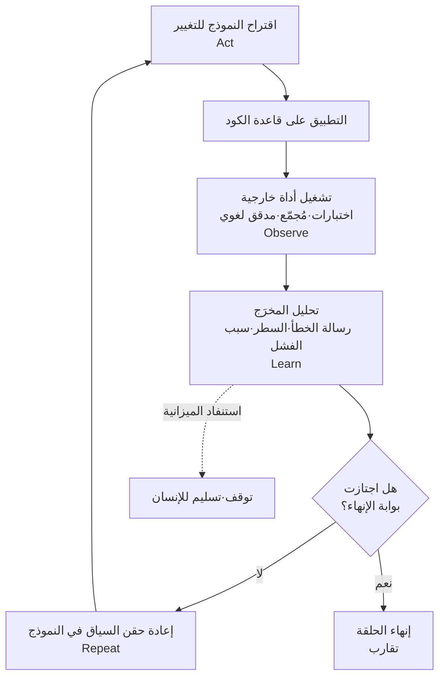

## نظرة عامة

انتشرت مؤخراً بين المطورين عبارة أثارت نقاشاً واسعاً: "لم أعد أُدخل موجّهات (Prompts) في Claude Code. أُشغّل حلقة تُدخل الموجّهات في Fable، ومهمتي الوحيدة هي كتابة تلك الحلقة." العبارة استفزازية، لكن إذا نزعنا عنها المبالغة التسويقية، نجد فيها ملاحظة عملية ذات معنى حقيقي: وحدة العمل تنتقل من موجّه واحد إلى حلقة كاملة.

هذا التحول مختلف تماماً عن الحديث عن تحسّن النماذج. مهما كان النموذج قوياً، فإنه لا يستطيع إنجاز مهمة معقدة حتى النهاية من خلال طلب واحد ينتهي بموجّه واحد. لكن الأمر يتغير عندما يُبنى فوق بنية تكرارية يستدعي فيها النموذج أداة، ثم يستقبل نتيجتها كمُدخل جديد ليقرر الخطوة التالية. تُشغّل ThakiCloud مثل هذه الحلقات فعلياً في تطويرها الداخلي، إلى جانب تشغيل منصة AI/ML كخدمة (SaaS) قائمة على Kubernetes. لذلك فإن عبارة "كتابة حلقة" ليست بالنسبة لنا جملة رائجة، بل مهمة هندسية يومية. يستعرض هذا المقال ما تتكون منه هذه الحلقة فعلياً، وما الذي يجعلها موثوقة.

## من الموجّه إلى الحلقة: ما الذي تغيّر

في عقلية كتابة الموجّهات، يحاول الإنسان انتزاع النتيجة المرجوة بأكبر قدر من الدقة من خلال تعليمة واحدة. الموجّه الجيد لا يزال مهماً، لكن حدود هذا الأسلوب واضحة: عندما تكون النتيجة خاطئة، يجب على الإنسان قراءتها بنفسه، وتحديد ما الذي انحرف، ثم إعادة صياغة الموجّه من جديد. إنها بنية يكون فيها الإنسان هو الحكم في كل تكرار، وهو من يعطي التعليمة التالية أيضاً.

أما عقلية كتابة الحلقات فتُسلّم مهمة التقييم وإعادة التوجيه إلى البنية نفسها. لا يُحدد الإنسان موجّهات فردية، بل يُعرّف "ما الهدف، وما الذي يجب مراقبته، ومتى يتوقف الأمر". يتصرف النموذج داخل هذا الإطار، وتحكم أداة خارجية على النتيجة، ويصبح هذا الحكم هو المُدخل التالي للنموذج. ينتقل دور الإنسان من مراقبة كل جولة إلى تصميم حدود الحلقة وشروط إنهائها.

قد يبدو هذا الفرق صغيراً، لكنه يُحدث فارقاً كبيراً في النتيجة. في أسلوب الموجّهات، يكون الإنسان هو عنق الزجاجة، لأن التقدّم لا يحصل إلا بعد أن يقرأ الإنسان النتيجة كاملة. أما في أسلوب الحلقات، فعنق الزجاجة ليس الإنسان بل جودة شرط الإنهاء. فإذا كان شرط الإنهاء واضحاً، تتقدم الحلقة نحو التقارب حتى في غياب الإنسان، وإذا كان ضعيفاً، تقع حتى أقوى النماذج في تكرار عقيم لا طائل منه. لذلك فإن جوهر هندسة الحلقات ليس مهارة صياغة جمل الموجّه، بل القدرة على تصميم آلية تجعل الجهاز قادراً على الحكم بنفسه على ما يُعدّ نجاحاً.

## تشريح الحلقة: تكرار الملاحظة والحكم والتنفيذ

الحلقة البرمجية التي تعمل بشكل جيد فعلياً تُكرر عادة الخطوات الأربع نفسها. يقترح النموذج تغييراً (Act)، ثم يُطبَّق هذا التغيير على قاعدة الكود ويُشغَّل أداة خارجية للحصول على نتيجة (Observe)، ثم يُحلَّل ذلك المخرَج لتحويله إلى سياق يوضح ما الذي فشل ولماذا (Learn)، ثم يُعاد إدخال هذا السياق إلى النموذج للحصول على الاقتراح التالي (Repeat). تستمر هذه الدورة حتى تجتاز بوابة الإنهاء أو تُستنفد الميزانية المخصصة.

الخطوة الثالثة، وهي التعلّم، مهمة بشكل خاص هنا. إذا لُخِّص مخرَج الأداة أو ضُغِط قبل إدخاله إلى النموذج، فإن الحلقة لا تتقارب بشكل جيد. يجب إدخال رسالة الخطأ التي يُصدرها المُجمّع، والملف والسطر اللذين فشلا، وتفاصيل عدم تطابق الأنواع كما هي، كسياق للموجّه التالي، حتى يستطيع النموذج استعادة "سبب الفشل" من دون ذاكرة بين الجلسات. هذا السجل قد يبدو مطوّلاً من منظور الإنسان، لكن هذا الإطناب بالنسبة للحلقة هو الإشارة الضرورية للتقارب.

## البوابات الحتمية هي إشارة المكافأة

أكثر نقطة تنحرف فيها هندسة الحلقات غالباً هي شرط الإنهاء. فإذا سألنا النموذج "هل انتهت هذه المهمة؟" وأوقفنا الحلقة بناءً على إجابته، فسينهي النموذج الحلقة مبكراً بتقرير ذاتي من نوع "يبدو أن المهمة اكتملت". هذا ليس تحققاً حقيقياً. الحلقة الموثوقة تُسند قرار الإنهاء إلى أداة حتمية لا إلى النموذج: هل اجتازت الاختبارات؟ هل بُني المشروع دون أخطاء من المُجمّع؟ هل صمت مدقق الأنواع؟ إشارة النجاح أو الفشل هذه تلعب بالضبط دور إشارة المكافأة في التعلّم المعزَّز. من دون الحاجة إلى تدريب نموذج مكافأة منفصل، يحكم مُشغِّل الاختبارات والمُجمّع الموجودان أصلاً على "أن هذا الكود صحيح".

رسّخت ThakiCloud هذا المبدأ فعلياً في حلقاتها الداخلية. مثال بارز هو pge-loop، الذي يُطبّق الفروقات (diff) التي يقترحها النموذج على الخلفية البرمجية المبنية بلغة Go، ثم يُشغّل الأمر `make test-short`، ويُعيد تغذية كامل مخرَج stderr كسياق للاقتراح التالي. شرط الإنهاء هنا ليس حكماً ذاتياً من النموذج، بل رمز خروج الاختبار. وبالمثل، يسعى Goal Mode بشكل مستقل نحو تحقيق الهدف حتى شرط الإنجاز، لكنه يتحقق من تقدّم كل خطوة عبر أمر تحقق محدد مسبقاً، وتشكّل الميزانية (عدد التكرارات والتكلفة والمهلة الزمنية) سقفاً أعلى. فهو لا يدور إلى ما لا نهاية، بل يتوقف عند التقارب أو عند استنفاد الميزانية. من دون هاتين الآليتين، أي بوابة الإنهاء الحتمية وسقف الميزانية، تصبح الحلقة أداة لا يمكن الوثوق بها.

عند استخدام fan-out تُضاف قاعدة إضافية. عندما تُطلَق عدة وكلاء فرعيين بالتوازي لجمع النتائج، يجب إغلاق الحلقة دائماً بمرحلة تحقق قبل دمج تلك النتائج. إن كان الناتج كوداً، تُستخدم بوابة الاختبار؛ وإن كان الناتج حكماً أو نتيجة بحث، تُطلَق عدة مُدقّقين متشككين من زوايا مختلفة ويُرشَّح الناتج عبر التصويت بينهم. دمج النتائج المتوازية مباشرة من دون تحقق يراكم مخرجات تبدو معقولة لكنها خاطئة. وغالباً ما يكون السبب الأول الذي يجب الشك فيه عندما تتراجع الجودة هو غياب مرحلة التحقق، لا مستوى النموذج.

## دلالات التطبيق على منتجات ThakiCloud

ترتبط هندسة الحلقات ارتباطاً مباشراً بمنتج Paxis من ThakiCloud. Paxis هو مستوى تحكم Agent-Native Cloud يعمل فوق ai-platform، ويتعامل مع المهارات (Skills) والأدوات (Tools) والسياسات (Policies) وسجلات التدقيق (Audit Logs) كموارد من الدرجة الأولى. حتى لا تبقى الحلقة التي يكتبها الإنسان حبيسة بيئة تطوير شخصية، وتصبح بدلاً من ذلك مورداً على مستوى المنصة، يجب أن تُعرَض العناصر المكوّنة للحلقة بشكل قابل للإدارة. يختار Paxis نحو 960 مهارة عبر خوارزمية BM25 وينفّذها في صناديق رملية معزولة، ويمرّر كل سلوك عبر بوابات السياسات وسجلات التدقيق. بعبارة أخرى، عندما يصمم الإنسان "ما الذي يجب مراقبته ومتى يتوقف"، يوفر Paxis البنية التحتية التي تعزل تنفيذ تلك الحلقة وتسجّله وتتحكم فيه.

من هذا المنظور، تقابل البوابة الحتمية بوابة السياسات في Paxis بشكل طبيعي، ويقابل تنفيذ الأداة التنفيذ المعزول في الصندوق الرملي، ويقابل سجل ملاحظة الحلقة سجل التدقيق. والبنية التي تُحقّق فيها الحلقة من نفسها هي نفس المبدأ الذي تؤكد عليه Paxis تحت مسمى "إغلاق fan-out بالتحقق".

من الناحية البنيوية، يكمّل منظور ai-platform هذا الحديث. تشغيل الحلقات بكثرة يعني بالضرورة زيادة في استدعاءات الاستدلال المتكررة وتشغيل الاختبارات. يستوعب ai-platform هذا الحمل المتكرر بكفاءة من حيث التكلفة عبر جدولة وحدات معالجة الرسوميات (GPU) القائمة على Kubernetes وKueue، وخدمة النماذج عبر vLLM، والعزل متعدد المستأجرين. فقط عندما تكون تكلفة الخدمة منخفضة يصبح تشغيل الحلقات بشكل متكرر مجدياً اقتصادياً، وهذه الجدوى الاقتصادية هي ما يجعل الوكيل قابلاً للتشغيل بشكل دائم. تتشكل هنا حلقة الربط التي تجعل خدمة منخفضة التكلفة (ai-platform) تُنتج جدوى اقتصادية للوكيل (Paxis). وبالنسبة للعملاء الذين لديهم متطلبات محلية (on-premise) وسيادية، فإن إمكانية تشغيل هذه الحلقة بأكملها داخل بنيتهم التحتية الخاصة تحمل أهمية خاصة.

## الحدود والاعتراضات

تصوير هندسة الحلقات كحل شامل لكل شيء ليس أمراً صادقاً. أولاً، الحلقة تصبح خطيرة في المهام التي لا يمكن فيها بناء بوابة إنهاء. فمن دون أمر يحكم تلقائياً على النجاح أو الفشل، تستهلك الحلقة الميزانية فقط من دون أن تعرف نقطة التقارب. في هذه الحالات، يكون الأسلوب الأحادي الذي يُنفَّذ دفعة واحدة أفضل، والأولى الاعتراف بذلك بصدق.

ثانياً، كلما تعمّقت الحلقة، يميل الإنسان إلى الوثوق بالنتيجة والتوقف عن المراجعة. موقف "الحلقة ستتحقق من الأمر على أي حال" هو أخفى أنماط الفشل. الأتمتة أداة مساعدة للتفكير لا بديلة عنه، ويجب على الإنسان أن يستمر في مراجعة عيّنات من المخرجات الأساسية بشكل دوري. وإذا لم يُرشّح المُدقّق أي شيء إطلاقاً، فهذا لا يعني أن كل شيء اجتاز التحقق، بل من المرجح أنه إشارة إلى عطل في المُدقّق نفسه.

ثالثاً، التكلفة. الحلقة تستهلك بحكم تعريفها استدعاءات استدلال متعددة. من دون سقف، تُستنفد الميزانية في لحظات، وإذا رُبط نموذج قوي بشكل دائم، تزداد التكلفة بشكل مضاعف لا خطي. في الممارسة العملية، يلزم توجيه (Routing) يستخدم نموذجاً رخيصاً في الاستكشاف والتنفيذ المتكرر، ولا يُخصَّص النموذج المكلف إلا لمرحلة التحقق التي تكون الدقة فيها حرجة. ينطبق هنا أيضاً مبدأ أن يكون العامل (Worker) رخيصاً والبوابة (Gate) وحدها مكلفة.

وخلاصة القول، عبارة "لا أكتب موجّهات بل أكتب حلقات" استفزازية، لكنها تحمل مضموناً حقيقياً. غير أن هذا المضمون لا ينبع من نموذج مبهر، بل من تصميم مُملّ ولكنه دقيق يجعل الجهاز قادراً على الحكم بنفسه على ما يُعدّ نجاحاً. الدرس نفسه استخلصته ThakiCloud من pge-loop وGoal Mode: الحلقة الجيدة تنبع من شرط إنهاء جيد.

## المصادر

- ميلز دويتشر (Miles Deutscher)، منشور على X (تويتر سابقاً)، رأي حول حلقات وكلاء البرمجة
- ممارسات ThakiCloud الداخلية في هندسة الحلقات: pge-loop، Goal Mode (بوابة تحقق + سقف ميزانية)
- [ReAct: الورقة البحثية المؤسِّسة لحلقات الوكلاء القائمة على الاستدلال والفعل (arXiv:2210.03629)](https://arxiv.org/abs/2210.03629)
- [Anthropic, Building Effective Agents: استخدام الأدوات وحلقة المقيّم-المحسّن ونمط المنسّق-العمال](https://www.anthropic.com/research/building-effective-agents)
