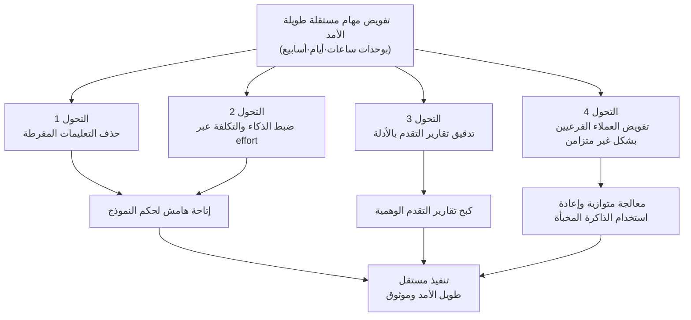

## نظرة عامة

قبل أن تعاود فتح Claude Fable 5، ثمة وثيقة يجدر بك الاطلاع عليها أولًا. فقد نشرت Anthropic بهدوء دليلًا رسميًا لبرمجة الأوامر الخاص بـ Claude Fable 5 وClaude Mythos 5 ضمن وثائق هندسة البرومبت لديها. ولأنه صدر كصفحة وثائق واحدة دون أي إعلان صاخب، فاتت هذه الوثيقة كثيرين، لكن مضمونها يقلب رأسًا على عقب جزءًا كبيرًا من العادات التي تعاملنا بها مع الجيل السابق من النماذج، وهو ما يجعله غير قابل للتجاهل.

لنبدأ بالنقطة الأكثر مفارقة للحدس. الرسالة المحورية لهذا الدليل ليست "اكتب بشكل أفضل" بل تقترب أكثر من "اكتب أقل". فالتعليمات المفصّلة التي كانت تُبنى لاستخلاص نتائج جيدة من النماذج السابقة قد تُضعف الجودة فعليًا مع Fable 5. لقد صُمم Fable 5 كنموذج يُفوَّض إليه العمل على مهام معقدة وطويلة وغامضة، من النوع الذي يستغرق من الإنسان ساعات أو أيامًا أو حتى أسابيع لإنجازه، ومثل هذا النموذج تعوقه المقابض الزائدة عن الحاجة. وبما أن ThakiCloud تُشغّل بنية تحتية لخدمات الذكاء الاصطناعي كخدمة (AI/ML SaaS) قائمة على Kubernetes، إلى جانب منصة عملاء (agents) تعمل فوقها، وتتعامل يوميًا مع مثل هذه العملاء المستقلة طويلة الأمد، فإن كل توصية في هذا الدليل تتحول عندنا مباشرة إلى مسألة قواعد تشغيل. يستعرض هذا المقال التحولات الأربعة التي يطرحها الدليل مع الاستناد إلى نص الوثيقة، ويوضح كيف تنعكس على منتجاتنا.


## ما هو هذا الدليل؟

هذه الوثيقة هي صفحة "Prompting Claude Fable 5" الواردة ضمن قسم هندسة البرومبت في وثائق منصة Anthropic الرسمية. تتناول أنماط برمجة الأوامر والسقالات (scaffolding) الخاصة بـ Fable 5 والفئة الأعلى منه Mythos 5، وتتألف من أربعة عشر فصلًا. وهي، بمعزل عن وثائق البرومبت العامة الموجهة للأجيال السابقة، دليل ذو طابع انتقالي (migration) يركز على ما تغيّر تحديدًا في هذه العائلة من النماذج.

الفرضية الجوهرية التي تخترق الوثيقة هي قفزة في القدرات. صُمم Fable 5 ليتحمّل مسائل كانت أعقد من أن تُمرَّر للنماذج السابقة، أو أطول من أن تُدار، أو أغمض من أن تُصاغ بوضوح. لذا فإن الطريقة الصحيحة للتعامل مع هذا النموذج ليست تشديد الضبط، بل التحول نحو منح النموذج هامشًا للحكم، مع إرساء هيكل من التحقق والتفويض يمنع ذلك الحكم من الانحراف. وتنقسم توصيات الدليل إلى أربعة محاور رئيسية.



## التحول 1: لا تُضِف إلى البرومبت، بل احذف منه

أول توصية ترد في الدليل هي إعادة قراءة البرومبتات والمهارات (skills) الحالية وحذف التعليمات التي لم تعد ضرورية. يوضح الدليل أن البرومبتات والمهارات التي صُممت من أجل النماذج السابقة كثيرًا ما تكون مفرطة التوجيه (too prescriptive) بالنسبة لـ Fable 5، بل قد تُضعف جودة المخرجات فعليًا. وبعبارة أخرى، فإن لحظة القفزة الكبيرة في القدرات هي بالضبط اللحظة المناسبة لتنظيف التعليمات القديمة.

يبدو هذا النصح غريبًا لأننا اعتدنا أن نتعامل مع هندسة البرومبت غالبًا كعملية إضافة. فكلما واجهنا استثناء أضفنا قاعدة، وكلما لاحظنا خطأً أضفنا بندًا منعيًا، فتستمر البرومبتات في التضخم. غير أن كثيرًا من تلك القواعد أُدرجت أصلًا لسدّ ثغرة معينة في نموذج بذاته. فإذا كان النموذج قد تجاوز تلك الثغرة فعلًا، فإن القاعدة المتبقية لا تصبح عونًا، بل تتحول إلى قيد يضيّق على حكم النموذج. وهذا هو السبب في تشديد الدليل على الحذف.

بالطبع، إن قرأنا هذه التوصية على أنها "احذف كل شيء من البرومبت" فسيكون ذلك خطرًا. فثمة تعليمات لا يزال يتوجب إدراجها صراحة، كتعليمات التحقق التي سنتناولها لاحقًا. عمليًا، الأمر أقرب إلى عملية تدقيق: تُزال التعليمات واحدة تلو الأخرى مع التأكد من عدم تراجع الجودة، مع التمييز بين البند الذي كان يسدّ عيبًا في نموذج بعينه، والبند الذي يمثل قيدًا جوهريًا في طبيعة المهمة نفسها.

## التحول 2: effort هو لوحة التحكم الرئيسية في الذكاء والزمن والتكلفة

في Fable 5، المقبض الأساسي لضبط التوازن بين الذكاء وزمن الاستجابة والتكلفة هو معامل effort. يوصي الدليل ببدء معظم المهام بمستوى high، واستخدام xhigh للأعباء التي تكون فيها القدرة أمرًا حاسمًا بشكل خاص، بينما تُستخدم medium أو low للأعمال المتكررة والنمطية. بعبارة أخرى، بدلًا من إطالة البرومبت لاستخلاص أداء أفضل، أصبح رفع effort أو خفضه بحسب طبيعة المهمة هو أسلوب التشغيل الأساسي.

هذا التغيير مهم من منظور تشغيلي. فرفع effort يجعل النموذج يجري استدلالًا (reasoning) أكثر، مما يرفع زمن الاستجابة والتكلفة معًا. لذا لا ينبغي التعامل مع effort كقيمة تُرفع دائمًا إلى أقصى حد، بل كمفهوم موازنة (budget) يُوزَّع بحسب صعوبة المهمة. فتشغيل المهام النمطية بمستوى xhigh يهدر التكلفة فقط، بينما معالجة القرارات الصعبة بمستوى low يقوّض الجودة. وهنا تصبح دقة توزيع effort، لا رهافة صياغة جملة البرومبت، هي العامل الذي يحدد النتيجة والفاتورة في آن واحد.

## التحول 3: أخضِع تقارير التقدم لتدقيق قائم على الأدلة

أشدّ أنماط الفشل إيلامًا في المهام المستقلة طويلة الأمد هو أن يُبلَّغ بثقة عن إنجاز عمل لم يُتحقق منه فعليًا. فحين تدور حلقة تستغرق ساعات ويقول النموذج "لقد أنهيت هذه الخطوة" دون أساس حقيقي لهذا الادّعاء، يصبح هذا التقرير غير موثوق، وقد تُبنى المهام اللاحقة فوق حالة خاطئة دون أن يُنتبه لذلك.

يقدّم الدليل جملة تعليمات محددة لهذه المشكلة: قبل الإبلاغ عن التقدم، ينبغي تدقيق كل ادّعاء بمقارنته مع نتائج الأدوات (tool results) في الجلسة الحالية، والإبلاغ فقط عن العمل الذي يمكن الإشارة إلى دليل عليه، مع التصريح بوضوح إن كان أمر ما لم يُتحقق منه بعد. وفيما يلي نص التعليمة الأصلية كما ورد:

```text
Before reporting progress, audit each claim against a tool result
from this session. Only report work you can point to evidence for;
if something is not yet verified, say so.
```

تشير Anthropic إلى أن هذه التعليمة، في اختباراتها الداخلية، قضت شبه كليًا على تقارير التقدم الملفّقة، حتى في المهام المصمّمة خصيصًا لاستدراج تقارير وهمية. والنقطة الجوهرية هنا مزدوجة. أولًا، هذا لا يتناقض مع التحول الأول القاضي بالحذف؛ فالقواعد القديمة التي كانت تسدّ عيوب النموذج تُحذف، لكن تعليمات من هذا النوع، التي تحمي موثوقية التنفيذ المستقل، يجب أن تُدرج صراحة. ثانيًا، معيار التحقق هنا لا يُستمد من ثقة النموذج بنفسه، بل من دليل خارجي هو نتيجة الأداة. وهذا يتطابق تمامًا مع مبدأ التزمناه طويلًا، وهو ألا يُعتمد تقرير النموذج الذاتي كشرط لإنهاء الحلقة.

## التحول 4: نظّم العملاء الفرعيين بشكل غير متزامن

التحول الرابع يتعلق ببنية تعدد العملاء (multi-agent). وفقًا للدليل، يتمتع Fable 5 باستقرار أعلى بكثير في إطلاق العملاء الفرعيين المتوازين والحفاظ عليهم، كما يدير بموثوقية العملاء الفرعيين طويلي الأمد والتواصل المستمر مع عملاء آخرين. والتوصية واضحة: استخدم العملاء الفرعيين بكثرة، مع تزويدهم بتوجيه صريح حول متى يكون التفويض مناسبًا، وفضّل التواصل غير المتزامن على أن ينتظر المنسّق (orchestrator) عودة كل عميل فرعي مع تعطّل التنفيذ في الأثناء.

وثمة أساس اقتصادي وأدائي فعلي لذلك. فالعملاء الفرعيون طويلو الأمد (long-lived) الذين يحافظون على السياق (context) عبر مهام فرعية متعددة، يوفرون الوقت والتكلفة عبر إعادة استخدام الذاكرة المخبأة (cache reuse)، ويتجنبون اختناقًا يعطّل النظام بأكمله بسبب أبطأ عميل فرعي. والنصيحة بتفويض المهام الفرعية المستقلة إلى العملاء الفرعيين مع استمرار المنسّق في العمل في الأثناء تشبه إلى حد كبير الطريقة التي يدير بها الإنسان فريقًا. أما التوصية باستخدام عميل فرعي مستقل للتحقق بدلًا من الاكتفاء بالنقد الذاتي وحده لضمان الجودة، فهي ترفع مبدأ التحقق القائم على الأدلة من التحول الثالث إلى مستوى تعدد العملاء.

## دلالات التطبيق على منتجات ThakiCloud

ينعكس هذا الدليل بشكل مباشر بوجه خاص على منصة Paxis التي نُشغّلها. Paxis هي Agent-Native Cloud الخاصة بـ ThakiCloud، وهي مستوى تحكم يختار من بين أكثر من 960 مهارة (skill) عبر خوارزمية BM25 وينفّذها في صناديق معزولة (sandboxes)، مع تمرير كل إجراء عبر بوابات سياسة وسجلات تدقيق (audit logs). وتتطابق التحولات الأربعة في الدليل مع هذه البنية واحدًا واحدًا.

فلسفة الحذف في التحول الأول تتقاطع مع مبادئ تصميم المهارات في Skill Harness لدينا؛ إذ التزمنا فعلًا بإبقاء المهارات خفيفة (thin) وتكديس المعرفة النطاقية بكثافة في متن المهارة، مع التعامل مع أي جملة زائدة كتكلفة على السياق يجب إزالتها. وهذا التأكيد الرسمي على أن Fable 5 لا يفضّل التعليمات المفرطة يمنحنا سندًا لإزالة البنود التي كانت تسدّ ثغرات نماذج جيل سابق من مهاراتنا القديمة. أما التحقق القائم على الأدلة في التحول الثالث، فهو الدور الذي تؤديه أصلًا بوابات السياسة وسجلات التدقيق لدينا؛ فادّعاء النموذج بإنجاز مهمة يختلف عن كون هذا الإنجاز مدعومًا فعليًا بنتائج الأدوات وسجلات التدقيق، وPaxis تتعامل مع الثاني كمورد من الدرجة الأولى. وتنظيم العملاء الفرعيين بشكل غير متزامن في التحول الرابع يطابق تمامًا تنفيذ تعدد العملاء القائم على DAG لدينا؛ فبنية منسّق يُمرّر المهام المستقلة بالتوازي دون تعطّل ثم يُغلق الحلقة عبر عقدة تحقق، تتطابق تمامًا مع مبدأنا القاضي بإغلاق أي تفرّع متوازٍ (fan-out) عبر مرحلة تحقق.

كما يجب النظر إلى الأمر من زاوية البنية التحتية لمنصة ai-platform. فرفع effort إلى xhigh يزيد من عدد رموز الاستدلال (reasoning tokens) مما يرفع الطلب على حوسبة GPU، وإطلاق عدد كبير من العملاء الفرعيين المتوازين يولّد ذروة مؤقتة في حِمل GPU. صُممت منصة ai-platform لدى ThakiCloud لامتصاص هذا الحِمل المتغيّر عبر جدولة GPU قائمة على Kueue وعزل متعدد المستأجرين (multi-tenant). كما أن ملاحظة الدليل بأن إعادة استخدام الذاكرة المخبأة لدى العملاء الفرعيين طويلي الأمد تخفض التكلفة تتفق مع هدفنا في خفض تكلفة الخدمة (serving) في البيئات المحلية والسيادية. فالخدمة منخفضة التكلفة تصنع جدوى اقتصادية للعملاء، وهذه الجدوى تتيح بدورها تفويضًا متوازيًا أكثر جرأة، في حلقة تعزيز متبادلة.

## القيود والاعتراضات

قبل التسليم المطلق بهذا الدليل، لا بد من توضيح عدة نقاط. أولًا، هذه الوثيقة موجهة تحديدًا لـ Fable 5 وMythos 5. فإن نُقلت استراتيجية الحذف أو الإعدادات الافتراضية لـ effort الموصى بها هنا مباشرة إلى نماذج بائعين آخرين أو إلى الجيل السابق، فقد تتراجع الجودة فعليًا. لذا يجب قراءة نطاق هذه التوصيات محصورًا داخل هذه العائلة من النماذج.

ثانيًا، نصيحة "احذف من البرومبت" قابلة لسوء الاستخدام بسهولة. فثمة تعليمات يجب أن تبقى بصرف النظر عن أداء النموذج، كقيود السلامة واللوائح النطاقية وسياسات المؤسسة. فالحذف ليس تنظيفًا عشوائيًا، بل يجب أن يكون تدقيقًا يميّز بين البند الذي كان يسدّ عيبًا في نموذج جيل سابق، والقيد الذي يمثل جوهر المهمة نفسها. والدليل نفسه يوصي بإدراج تعليمات التحقق صراحةً، مما يعني أن رسالته أقرب إلى "اكتب أقل، لكن أبقِ بوضوح على ما يجب أن يبقى".

ثالثًا، الرقم القائل بأن تقارير التقدم الوهمية كادت أن تختفي تمامًا هو نتيجة اختبار داخلي أجرته Anthropic نفسها، وليس قيمة أعدنا التحقق منها بشكل مستقل في هذا المقال. نحن نتفق مع اتجاه فعالية تعليمات التحقق، لكن على كل مؤسسة أن تقيس معدل الفشل الفعلي في عبء عملها الخاص قبل أن تحدد مستوى الثقة المناسب. وأخيرًا، توصية جعل effort افتراضيًا عند high ترفع التكلفة وزمن الاستجابة معًا، لذا يجب على الفرق ذات الميزانية المحدودة أن تخفض بجرأة المهام النمطية إلى medium وlow لإيجاد توازنها الخاص في التوزيع.

خلاصة القول إن قيمة هذا الدليل لا تكمن في عبارة سحرية جديدة، بل في تحوّل في الموقف تجاه التعامل مع نموذج أقوى: امنحه هامشًا للحكم بدلًا من إضافة مزيد من الضبط، ثم تحقق من ذلك الحكم بالأدلة، ووازِه عبر التفويض. ومن منظور من يُشغّل فعليًا عملاء مستقلين طويلي الأمد، هذا ليس شعارًا رائجًا، بل إعادة ترتيب لقواعد التشغيل ذاتها.

## المصادر

- Anthropic, "Prompting Claude Fable 5", Claude Platform Docs: [https://platform.claude.com/docs/en/build-with-claude/prompt-engineering/prompting-claude-fable-5](https://platform.claude.com/docs/en/build-with-claude/prompt-engineering/prompting-claude-fable-5)
</content>
