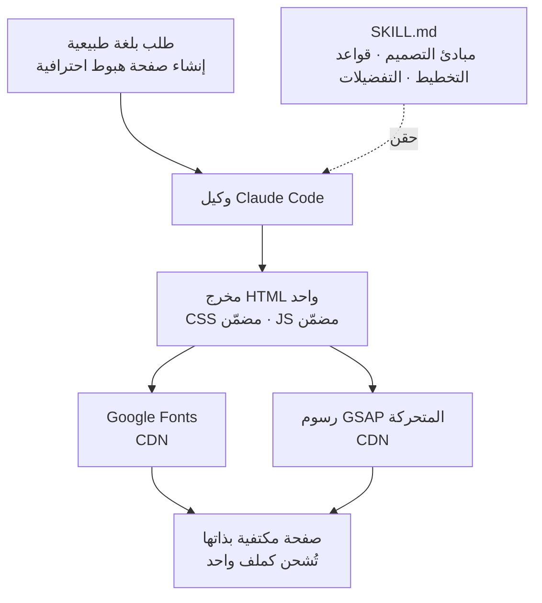

شارك مطوّر مؤخرًا على منصة X أنه "بنى مهارة تجعل Claude Code ينشئ صفحات هبوط احترافية بضربة واحدة"، مدّعيًا أن المواقع الثلاثة في الفيديو كانت جميعها من إنتاج ضربة واحدة ([@the_cyw](https://x.com/the_cyw/status/2075338024406409239)). كان التفاعل قويًا بسبب مستوى إتقان النتائج، لكن النقطة الأكثر إثارة للاهتمام بالنسبة للمهندس تكمن في مكان آخر. أعطِ النموذج نفسه الطلب نفسه، "ابنِ لي صفحة هبوط"، فتحصل على شيء عادي؛ أضف مهارة واحدة فتخرج صفحة بمستوى وكالة تصميم في مسار واحد. يفكّك هذا المقال آلية عمل تلك المهارة فعليًا، ويتحقق منها من منظور تشغيل ThakiCloud حيث تُعامَل المهارات كموارد من الدرجة الأولى.

## نظرة عامة

مهارة Claude Code ليست سحرًا بل **إجراء تشغيل معياري (SOP)**. هي لا تجعل النموذج أذكى، بل تقيّد بقوة قدراتٍ يمتلكها النموذج أصلًا نحو اتجاه محدد، فترفع متوسط الجودة. في حالة مهارة صفحات الهبوط، هذا القيد هو تحديدًا مبادئ التصميم وقواعد التخطيط وصيغة المخرجات.

يتوافق هذا المنظور تمامًا مع طريقة تشغيل ThakiCloud للوكلاء. جودة الوكيل لا تأتي من فئة النموذج بل من بنية العقد التي تغلّف النموذج. مهارة صفحات الهبوط مثال جيد على تركيز بنية العقد هذه في مجال ضيّق هو تصميم الواجهة الأمامية. وهي أيضًا تصميم مهارة نموذجي: قلّل درجات الحرية لترفع المتوسط.

## ما هذه التقنية

مهارة Claude Code هي في جوهرها ملف markdown واحد اسمه `SKILL.md`. بداخله المبادئ والقواعد التي ينبغي للوكيل اتباعها في مهمة معينة، إضافة إلى تفضيلات المستخدم. عندما يقدّم المستخدم طلبًا بلغة طبيعية، تُحقَن المهارة ذات الصلة في سياق الوكيل، فيتبع الوكيل تلك التعليمات كإجراء تشغيل معياري بينما يولّد HTML وCSS وJavaScript محليًا.

شكل ما تنتجه مهارات صفحات الهبوط يُلاحَظ باتساق عبر عدة مهارات عامة. إنه ملف HTML واحد مكتفٍ بذاته، بكل CSS مضمّن داخل `<style>` وكل JavaScript مضمّن داخل `<script>`. تقتصر الاعتماديات الخارجية على Google Fonts ومكتبة الرسوم المتحركة GSAP المحمّلة عبر CDN ([Claude Directory](https://www.claudedirectory.org/skills/claude-skills-landing)). ملف واحد يكفي لاستضافته وتقديمه في أي مكان.

الكلمة المفتاحية هي "ضربة واحدة". حين يصف المستخدم ما يريده بجمل بسيطة، يُنتج الوكيل الصفحة كاملة في مسار واحد دون ذهاب وإياب كثير. ينجح هذا لا لأن النموذج يبدع، بل لأن المهارة اتخذت مسبقًا معظم القرارات حول "ما الذي يصنع صفحة هبوط جيدة" نيابةً عن المستخدم.

## القرارات التي تتخذها المهارة نيابةً عنك

حين تطلب صفحة هبوط دون مهارة، تكون النتيجة عامة لسبب واضح: على الوكيل أن يقرر التخطيط والمسافات والطباعة وتباين الألوان وتوقيت الحركة من الصفر في كل مرة، وتتجه تلك القرارات نحو متوسط آمن. تثبّت مهارات صفحات الهبوط الاحترافية العامة هذه القرارات مسبقًا بالضبط ([تحليل MindStudio](https://www.mindstudio.ai/blog/claude-code-landing-page-generator-skill-city-service-matrix-seo)).

فلسفة التصميم التي ترمّزها هذه المهارات متسقة إلى حد بعيد. تضع أساسًا من التقشف المقصود الذي يزيل غير الضروري، وتستخدم تخطيطات غير متماثلة تكسر التماثل لتوجيه العين، وتضيف فوق ذلك محفّزات نفسية لرفع معدل التحويل. تستهدف سلطة العلامة والتحويل معًا كي تبدو النتيجة مصنوعة بيد إنسان لا مبنية على قالب. يصف بعض مؤلفي المهارات ذلك بأنه "زرع خبرة وكالة تصميم من الطراز الأول داخل الوكيل".

الدرس هنا لا يقتصر على الواجهة الأمامية. المهارة الجيدة لا تمنح النموذج الحرية، بل تمنحه هيكلًا موثّقًا وتتركه يملأ الداخل. كلما ثبّتت رموز التصميم وشبكات التخطيط وصيغة المخرجات كالشيفرة، قلّ التباين لكل استدعاء وارتفع متوسط الجودة. وعلى العكس، رجاء نثري مثل "اجعلها تبدو رائعة" يعطي نتيجة مختلفة في كل مرة.

## أمور ينبغي الانتباه إليها عند بناء مهارتك

إن كتبت مثل هذه المهارة بنفسك، فبعض الأمور مهمة. أولًا، ثبّت صيغة المخرجات صراحةً. تحديد البنية بأنها "HTML واحد، CSS/JS مضمّن، اعتماديات خارجية مقتصرة على الخطوط وGSAP" يُبقي النشر والنقل بسيطين. ثانيًا، اختزل حكم التصميم إلى قواعد. كتابة مقاييس المسافات وتباين الطباعة ولوحة ألوان مسموحة وقاعدة تفضّل `transform` و`opacity` الملائمين للمُركِّب في الحركة داخل الإجراء المعياري يعني ألا يعيد الوكيل التداول في كل مرة. ثالثًا، ضمّن حالات الفشل. أكثف معلومة في المهارة هي قائمة "لا تفعل هذا". بنود مثل منع الحركات التي تُزيح التخطيط ومنع مخالفات أساسيات إمكانية الوصول هي ما يحمي جودة المخرجات فعليًا ([دليل Ryan Doser](https://ryandoser.com/claude-code-landing-pages/)).

ملاحظة أخرى: المهارة ضريبة أيضًا. منذ لحظة تحميلها في السياق تكلّف رموزًا، لذا على كل جملة أن تجتاز اختبار "هل سيخطئ الوكيل بدون هذا؟". الزخرفة غير الضرورية خسارة صافية.

## دلالات لمنتجات ThakiCloud

يتردد صدى هذه الحالة لدى ThakiCloud خصوصًا لأننا نشغّل منصة تعامل المهارات كموارد من الدرجة الأولى.

**منظور Paxis (الوكلاء والمهارات).** Paxis هي سحابة ThakiCloud الأصلية للوكلاء (Agent-Native Cloud)، التي تعامل Skills وTools وPolicies وAudit Logs كموارد من الدرجة الأولى. قدرة وحدوية مثل مهارة صفحات الهبوط هي بالضبط ما يديره Skill Harness في Paxis. نختار من مئات المهارات عبر BM25، ونحقن ذات الصلة فقط في سياق الوكيل، وننفّذها في صندوق رمل معزول، ونمرّر كل فعل عبر بوابة سياسة وسجل تدقيق. كون مهارة صفحة هبوط واحدة تعمل جيدًا يعني أيضًا أن النمط نفسه يمكن أن يمتد إلى مجالات أخرى مثل توليد الشرائح وعرض المستندات ونشر البنية التحتية. صور ومستندات هذه المدونة نفسها تُولَّد على منصة المهارات ذاتها.

على وجه الخصوص، المبدأ الذي تُظهره هذه الحالة، "الشيفرة تملك الصيغة والنموذج يملأ المحتوى فقط"، يتطابق مباشرة مع فلسفة تصميم Paxis. كلما ثبّت بنية المخرجات حتميًا وضيّقت مجال حكم النموذج، زاد اتساق الجودة عبر فئات النماذج.

**منظور ai-platform (البنية التحتية).** بعض العملاء يريدون تشغيل أحمال التوليد هذه على بنيتهم التحتية الخاصة بدل الاعتماد كليًا على واجهات برمجة خارجية. تقدّم منصة ai-platform لدى ThakiCloud نماذج التوليد فوق جدولة GPU قائمة على K8s وKueue، فحتى في البيئات المحلية أو السيادية يمكن استضافة مثل هذه المسارات القائمة على المهارات ذاتيًا. كلما كانت المهمة متكررة ومعيارية، مثل توليد صفحات الهبوط، تحوّلت كلفة التقديم المنخفضة مباشرةً إلى اقتصاديات وكيل.

## القيود والاعتراضات

بالطبع علينا الحذر من المبالغة. عبارة "صفحة احترافية بضربة واحدة" تصحّ أكثر في ظروف العرض التوضيحي. صفحة هبوط منتج حقيقي تحمل متطلبات متداخلة مثل أصول العلامة ومراجعة النصوص والامتثال لإمكانية الوصول وميزانية أداء واختبار A/B، لذا فمخرج الضربة الواحدة مسودة ممتازة لا نسخة نهائية. وعلى وجه الخصوص، HTML واحد بكل شيء مضمّن مريح للنشر السريع لكنه قد يحتاج إلى تقسيم من جديد للتخزين المؤقت والصيانة في موقع حقيقي تتشارك فيه صفحات متعددة الأصول.

كذلك، الذوق التصميمي المخبوز في المهارة هو سقف النتيجة. إن كانت مهارة مُحسَّنة لجمالية معينة، فستقاوم الطلبات التي تخرج عنها. هذا ليس خللًا بل مقايضة مصمّمة. تخلّت عن الأطراف مقابل رفع المتوسط عبر تقليل الحرية، لذا فالفريق الذي يتعامل مع علامات كثيرة أفضل له أن يقسّم المهارات حسب الجمالية بدل إبقاء مهارة واحدة.

خلاصة القول، القيمة الحقيقية لهذه الحالة ليست "تخرج صفحة جميلة بضربة واحدة" بل أنها أثبتت بوضوح المبدأ القائل إن **جودة الوكيل تأتي من تصميم المهارة لا من النموذج**. وPaxis هي بالضبط تحويل ذلك المبدأ إلى منتج قابل للتشغيل على مستوى المنصة.

## المصادر

- [@the_cyw، "بنيت مهارة تجعل Claude Code يبني صفحات هبوط احترافية"](https://x.com/the_cyw/status/2075338024406409239)
- [Claude Directory: Landing Page Skills](https://www.claudedirectory.org/skills/claude-skills-landing)
- [MindStudio: Claude Code Landing Page Generator Skill](https://www.mindstudio.ai/blog/claude-code-landing-page-generator-skill-city-service-matrix-seo)
- [Ryan Doser: How to Build Landing Pages With Claude Code](https://ryandoser.com/claude-code-landing-pages/)
