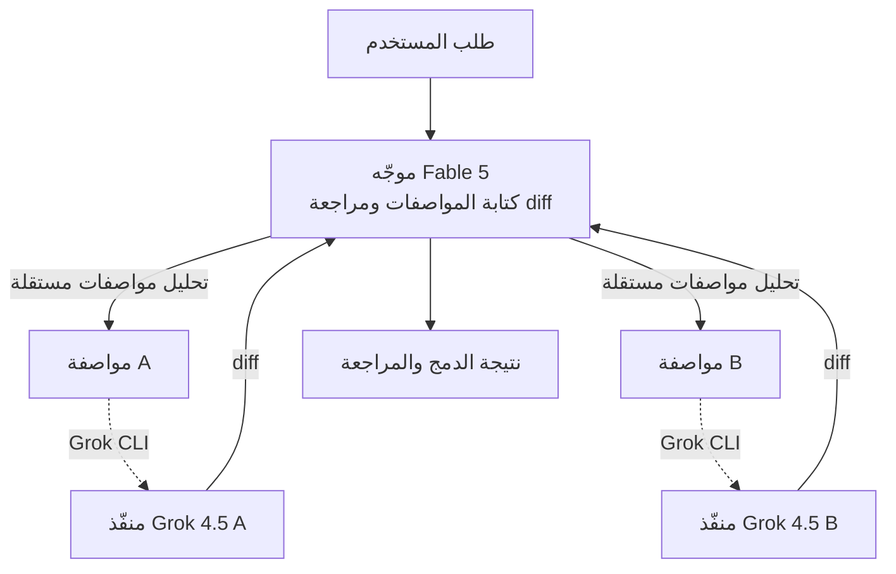

عند استخدام وكلاء البرمجة، يطرأ سؤال طبيعي على الذهن. كتابة المواصفات بدقة ومراجعة الفروقات (diff) الناتجة بعين ثاقبة عمل يختلف في طبيعته عن كتابة الشيفرة سطراً سطراً، فلماذا إذن يتوجب على نموذج واحد أن يقوم بالمهمتين معاً؟ إضافة `fable-advisor` التي طُرحت مؤخراً وأثارت اهتماماً واسعاً تجيب على هذا السؤال مباشرة. إنها سير عمل متعدد الموردين حيث **يقتصر دور Claude Fable 5 على القيادة، بينما يتولى Grok 4.5 وحده التنفيذ الفعلي**. يحلل هذا المقال تلك البنية، ويتحقق مما تعنيه هذه الهندسة من منظور تشغيل ThakiCloud الذي يتعامل مع الوكلاء المتعددين وتوجيه النماذج كمورد أساسي من الدرجة الأولى.

## نظرة عامة

حتى الآن، كانت سير عمل البرمجة متعددة الوكلاء تجري غالباً ضمن مورد واحد فقط. ففي Claude Code مثلاً، يقود Opus العمل بينما تعمل Sonnet أو Haiku كوكلاء فرعيين. والنقطة اللافتة في `fable-advisor` هي أنها تبني هذا التقسيم **عبر حدود الموردين**. حيث يتولى Fable 5 من Anthropic طبقة التنسيق، بينما يتولى Grok 4.5 من xAI طبقة التنفيذ.

الرؤية الجوهرية لهذا التصميم واضحة. القيادة والتنفيذ يتطلبان قدرات مختلفة، وبنية تكلفة مختلفة أيضاً. كتابة المواصفات ومراجعة الفروقات تقع في مجال الحكم والاستدلال، مما يستلزم نموذجاً مناسباً للقيادة، بينما تتطلب كتابة كميات كبيرة من الشيفرة كفاءة في الإنتاجية والتكلفة. تضع `fable-advisor` كلاً من هاتين المهمتين على نماذج من موردين مختلفين، بحيث يُستخدم في كل طبقة النموذج الأنسب لها. كونها مفتوحة المصدر ومجانية، وإمكانية تخصيص منطق التوجيه مباشرة، يخفّض أيضاً عتبة التبني في الاستخدام الفعلي.

## ما هذه التقنية

`fable-advisor` هي إضافة تُركَّب فوق Claude Code، وتفرض فصلاً بين ثلاثة أدوار.

أولاً، **الموجّه (Fable 5)** يكتب المواصفات ويراجع النتائج. يستقبل طلب المستخدم ويحلله إلى مواصفات تنفيذ، ثم يراجع الفروقات (diff) بعد اكتمال التنفيذ. والمهم هنا أن الموجّه **لا يكتب الشيفرة مباشرة**، بل يركز على الحكم وتعريف العقود.

ثانياً، **المُنفِّذ (Grok 4.5)** يتولى الكتابة الفعلية وحده. يستقبل المواصفات التي يسلّمها الموجّه، ويكتب Grok 4.5 الشيفرة عبر Grok CLI. وإذا تفحصنا تاريخ المستودع، نجد أنه اعتباراً من الإصدار v3 تم استبدال وكلاء التنفيذ السابقين المعتمدين على Sonnet/Opus بـ `grok-implementer`، ليصبح Grok 4.5 مسار الكتابة الافتراضي. بعبارة أخرى، لم تكن هذه الإضافة متعددة الموردين منذ البداية، بل هي نتاج تطور تدريجي نحو نقل مسار التنفيذ إلى نموذج منخفض التكلفة وعالي الإنتاجية.

ثالثاً، **التنفيذ المتوازي**. تُنفَّذ المواصفات المستقلة عن بعضها البعض في آن واحد عبر وكلاء متوازيين. فعندما يقسّم الموجّه المهمة إلى وحدات لا تعتمد على بعضها، تمضي كل وحدة قدماً في وقت واحد عبر وكيل تنفيذ منفصل. وهذا ليس مجرد تفويض تسلسلي بسيط، بل أقرب إلى تقسيم عمل على شكل DAG (رسم بياني موجّه غير دوري).

إذا نظرنا إلى سير العمل الكامل بشكل تخطيطي، يكون كما يلي.



## التثبيت والتكامل

تثبيت الإضافة يتم بسطر واحد فقط. يكفي إضافة المستودع إلى سوق إضافات Claude Code.

```bash
claude plugin marketplace add DannyMac180/fable-advisor
```

يتطلب Grok CLI، المسؤول عن مسار التنفيذ، مصادقة منفصلة. فعند تسجيل الدخول عبر `grok login`، يعمل النظام بمصادقة OAuth قائمة على اشتراك SuperGrok أو X Premium+، وبحسب وصف المستودع، يتيح هذا المسار تشغيل وكيل التنفيذ **بالاشتراك فقط ودون رسوم API لكل رمز (token)**. وهذه النقطة هي جوهر بنية التكلفة. فالموجّه يقوم بعدد قليل فقط من الاستدعاءات التي تتطلب حكماً، بينما تُعالَج الكمية الكبيرة من كتابة الشيفرة ضمن خطة الاشتراك، مما يقلّل إلى أدنى حد الجزء الخاضع للرسوم حسب الاستخدام.

من زاوية التكامل، الجانب الجدير بالملاحظة هو أن منطق التوجيه مفتوح. إذ يمكن للمستخدم أن يضبط بنفسه أي مهمة تُرسَل إلى أي نموذج، وفي أي شروط يتم التوازي، مما يتيح إعادة تشكيل المسارات بما يتناسب مع ميزانية الفريق ومتطلبات الجودة.

## كيف يعمل هذا التصميم فعلياً

بما أن `fable-advisor` ليست أداة تعتمد على أرقام قياسية (بنشمارك)، بل نمط سير عمل، فسنتناول هنا الأثر البنيوي الذي يُحدثه هذا التصميم بدلاً من أرقام أداء قابلة للتكرار. وبما أن المستودع لا يقدّم مؤشرات كمية، فإن هذا المقال أيضاً لن يختلق أرقاماً، بل سيتناول المزايا البنيوية فقط.

أكبر أثر هو **الفصل بين التكلفة والجودة**. فعندما يُوكَل التنسيق الذي يتطلب حكماً إلى الموجّه، ويُوكَل التنفيذ الذي يتطلب إنتاجية عالية إلى منفّذ منخفض التكلفة، ينخفض السعر الإجمالي لسير العمل مع بقاء جودة الحكم كما هي. وهكذا يتشكّل بشكل طبيعي توزيع مفاده "لا يُستدعى الموجّه كثيراً لكنه غالي الثمن، بينما يُستدعى المنفّذ كثيراً دون أن يكون مكلفاً".

الأثر الثاني هو **التحقق المتقاطع**. كون المنفّذ والمراجِع نموذجين من موردين مختلفين يُنتج أثراً جانبياً مثيراً للاهتمام. فعندما يراجع النموذج نفسه شيفرته الخاصة، يسهل عليه إغفال نفس الأخطاء، أما عندما يراجع نموذج من سلالة مختلفة الفروقات (diff)، تزداد فرصة اكتشاف النقاط العمياء لدى كل منهما. وبذلك يصبح الفصل بين الموجّه والعامل أكثر من مجرد تقسيم عمل بسيط، بل نوعاً من آلية التحقق المتبادل.

الأثر الثالث هو **تقليص زمن الاستجابة بفضل التوازي**. فعند تنفيذ المواصفات المستقلة في آن واحد، لا يكون إجمالي وقت العمل مجموعاً تسلسلياً، بل يتقارب مع أطول سلسلة مفردة. وكلما أحسن الموجّه تحليل المهمة إلى وحدات، ازدادت هذه الميزة.

## تعميم نمط الموجّه والعامل

إذا نظرنا إلى `fable-advisor` ليس كإضافة منفردة بل كنمط تصميم، يتضح سياق أوسع. جوهر هذا النمط هو "الجلسة الرئيسية تقود فقط، والمهام الثقيلة تُفوَّض". وكون العمل عابراً للموردين ليس سوى صورة واحدة من صور هذا النمط، إذ يصح فعلياً حتى داخل مورد واحد. فمثلاً في Claude Code، يُستخدم على نطاق واسع بالفعل تكوين يجعل Fable 5 موجّهاً، بينما يُوكَل الاستكشاف إلى Haiku، والتنفيذ إلى Sonnet، والاستدلال المعقد إلى وكلاء فرعيين من Opus. وما فعلته `fable-advisor` هو توسيع نطاق النماذج المستهدفة بهذا التفويض إلى ما وراء حدود المورد الواحد.

من هذا المنظور، تصبح معايير اختيار نموذج الموجّه أكثر وضوحاً. فالموجّه مسؤول عن الحكم والتفرّع والتجميع، لذا فإن الدقة وجودة الاستدلال مهمتان، بينما يكون تكرار الاستدعاء منخفضاً نسبياً. في المقابل، يهتم المنفّذ بالإنتاجية والسعر. لذا فإن التنسيق الجيد ليس "وضع النموذج الأغلى كموجّه ومعالجة كل شيء به"، بل "تخصيص نموذج بالخصائص التي تتطلبها كل طبقة لتلك الطبقة تحديداً". وتطور الإصدار v3 الذي نقل فيه `fable-advisor` مسار التنفيذ إلى نموذج اشتراك منخفض التكلفة هو نتيجة مطابقة تماماً لهذا المبدأ.

نقطة واحدة يجب الانتباه إليها هي أن هذا النمط لا يكون فعالاً إلا إذا كانت حدود التفويض واضحة. فإذا سلّم الموجّه مواصفات غامضة، يضطر المنفّذ إلى ملء الفجوات بالتخمين، وتزداد نتيجة لذلك عبء المراجعة. لا تتحقق فائدة التفويض إلا عندما تكون المواصفات محددة بما فيه الكفاية. وهذا لا يختلف عن تقسيم العمل في المنظمات البشرية، فكلما كانت المواصفات أوضح، عمل التفويض بشكل أفضل.

## دلالات التطبيق على منتجات ThakiCloud

يتقاطع هذا التصميم بشكل لافت مع الطريقة التي تُشغّل بها ThakiCloud وكلاءها.

من منظور **Paxis**، يكون الارتباط الأوثق مباشرةً. فـ Paxis هو مستوى التحكم الخاص بـ ThakiCloud للسحابة القائمة على الوكلاء (Agent-Native Cloud)، ويتعامل مع تنفيذ الوكلاء المتعددين على شكل DAG كقدرة أساسية. البنية التي تُظهرها `fable-advisor` — "كتابة المواصفات ← تنفيذ موزّع ← مراجعة متقاطعة" — تحمل نفس الهيكل الذي يعتمده حزام أدوات المهارات (skill harness) في Paxis، حيث يُحلَّل العمل إلى مهام فرعية، وتُنفَّذ بشكل متوازٍ داخل صناديق رملية معزولة، ثم تُغلَق عبر مرحلة تحقق. وعلى وجه الخصوص، فإن المبدأ القائل بأن الموجّه لا يكتب الشيفرة مباشرة بل يركّز على الحكم وتعريف العقود، يتطابق تماماً مع فلسفة التصميم لدينا التي تستمد القدرة من بنية العقد المحيطة لا من درجة النموذج. كما أن التدفق الذي يُعيد فيه الموجّه مراجعة نتائج نماذج مختلفة، يتقاطع أيضاً مع مبدأنا التشغيلي القاضي بإغلاق توسّع الوكلاء المتعددين (fan-out) عبر مرحلة تحقق لمنع تراكم الهلوسة.

من منظور **ai-platform**، تكون زاوية بنية التكلفة سارية المفعول. فمنصة ai-platform الخاصة بـ ThakiCloud تجدول أحمال عمل وحدات معالجة الرسوميات (GPU) اعتماداً على K8s وKueue، وتخدم أحمال الاستدلال والتدريب لدى العملاء. الفكرة التي تعتمدها `fable-advisor` بتفويض مسار التنفيذ إلى نموذج منخفض التكلفة لخفض السعر الإجمالي لسير العمل، هي نمط يمكن لعملاء السحابة القائمة على GPU تطبيقه مباشرة عند تصميم أحمال عملهم. فعندما تُوضَع مراحل الحكم القليلة التي تتطلب استدلالاً ثقيلاً، ومراحل التنفيذ الكثيرة التي تتطلب إنتاجية عالية، على موارد من فئات مختلفة، يمكن الحصول على النتيجة نفسها بتكلفة أقل. وبما أن الخدمة منخفضة التكلفة هي ما يصنع جدوى الوكلاء الاقتصادية، فإن كفاءة تكلفة ai-platform وتنسيق وكلاء Paxis يكمّلان بعضهما البعض.

## القيود والاعتراضات

لهذا التصميم أيضاً ثمن واضح يجب دفعه. أولاً، **تعقيد التشغيل**. فربط نموذجين من موردين مختلفين في سير عمل واحد يعني إدارة نظامي مصادقة، وخطتي تسعير، ونقطتي فشل محتملتين. فإذا تغيّرت واجهة سطر الأوامر لأحد الموردين أو انتهت صلاحية المصادقة، قد يتوقف سير العمل بأكمله. وبما أن هذا يعني التخلي عن بساطة سير العمل أحادي المورد مقابل هذه الميزة، فإن كل فريق قد يقيّم بشكل مختلف ما إذا كانت الميزة تبرر هذا التعقيد.

ثانياً، **مخاطر تفويض الجودة**. إسناد التنفيذ إلى نموذج منخفض التكلفة يعني أنه إذا لم تكن مواصفات ومراجعات الموجّه دقيقة بما فيه الكفاية، فقد يمر تنفيذ منخفض الجودة دون رصد. وجودة سير العمل هذا تعتمد في نهاية المطاف على مدى صرامة بوابة المراجعة لدى الموجّه. فإذا كانت المراجعة شكلية، يختفي أثر التحقق المتقاطع الناتج عن تقسيم العمل بين الموردين، ويتحول الأمر إلى خط أنابيب منخفض الجودة لا يوفر سوى التكلفة.

ثالثاً، **قيود المصادقة القائمة على الاشتراك**. كون Grok CLI يعمل بمصادقة OAuth قائمة على الاشتراك يمثّل ميزة من حيث التكلفة للأفراد أو الفرق الصغيرة، لكن في الأتمتة واسعة النطاق أو خطوط الأنابيب غير المأهولة، قد تصبح حدود الاشتراك وتجديد المصادقة عنق زجاجة. وميزة عدم وجود رسوم حسب الاستخدام تعني، إذا نظرنا إليها من الجانب الآخر، أن التوسع يُغلَق بمجرد تجاوز الاستخدام للحد المسموح.

ومع ذلك، فإن الرسالة التي تطرحها `fable-advisor` واضحة. مستقبل وكلاء البرمجة لا يكمن في نموذج واحد شامل، بل في تنسيق يجمع بين النماذج الأنسب لكل طبقة. وهذا يشير بالضبط إلى نفس الوجهة التي تسلكها ThakiCloud في تعاملها مع الوكلاء المتعددين وتوجيه النماذج كمورد أساسي من الدرجة الأولى.

## المصادر

- [fable-advisor (GitHub)](https://github.com/DannyMac180/fable-advisor)
- [Grok CLI (x.ai/cli)](https://x.ai/cli)
