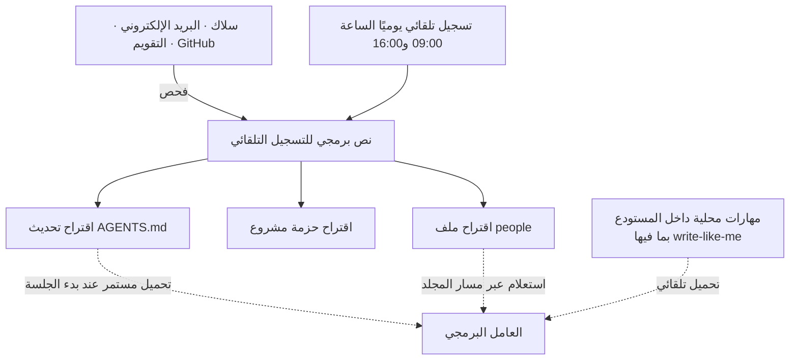

عند استخدام عامل البرمجة يوميًا، يصطدم المرء مرارًا بحائط واحد. القرارات التي اتُّخذت أمس، الأعراف التي حُدّدت الأسبوع الماضي، أسلوب عمل زميل معيّن، كل هذا يعيد العامل سؤاله عنه في كل جلسة وكأنه يسمعه للمرة الأولى. ظهر مؤخرًا مستودع يحل هذه المشكلة دون قاعدة بيانات متجهية باهظة أو بنية تحتية منفصلة للذاكرة، بل عبر **بنية مجلدات عادية وملف ماركداون واحد فقط**، وأثار ضجة بين المطورين. إنه `personal-monorepo-template` الذي كشف عنه jxnl (جيسون ليو)، صانع مكتبة `Instructor`. يفكك هذا المقال تلك البنية، ويتحقق من دلالات هذا التصميم من منظور تشغيل ThakiCloud الذي يتعامل مع المهارات والمعرفة كموارد من الدرجة الأولى.

## نظرة عامة

النهج الشائع لمعالجة مشكلة ذاكرة العامل هو قاعدة البيانات المتجهية. تُحوَّل المحادثات والمستندات إلى متجهات تضمين (embeddings) وتُخزَّن، ثم تُستدعى عند الحاجة عبر بحث دلالي. هذا النهج قوي لكن عبء تشغيله كبير. يجب إدارة خط أنابيب التضمين، والفهرس المتجهي، وجدولة إعادة الفهرسة، وهي بنية تحتية مفرطة بالنسبة لفرد يريد إضافتها إلى سير عمله الخاص.

يسلك `personal-monorepo-template` اتجاهًا معاكسًا تمامًا. يعيد تعريف الذاكرة لا كمشكلة بحث، بل **كمشكلة بنية ملفات**. يوضع الأشخاص في مجلد `people/`، والمشاريع كحزم مشاريع، وأنماط العمل المتكررة كمهارات داخل المستودع نفسه. ويحمّل العامل هذه البنية باستمرار عبر `AGENTS.md` في بداية كل جلسة. فبدلًا من التطابق التقريبي للبحث المتجهي، يصل العامل إلى الذاكرة عبر عنوان دقيق هو مسار المجلد.

خلفية صاحب المشروع تضفي ثقلًا على هذا التصميم. jxnl هو صانع مكتبة الإخراج المهيكل (structured output) المسماة `Instructor`، والتي تُحمَّل ملايين المرات شهريًا، ويُقال إن OpenAI استشهدت بها كمصدر إلهام لميزة الإخراج المهيكل الخاصة بها. وهو حاليًا مهندس تجربة المطوّرين (Developer Experience) في فريق OpenAI Codex، ما يجعل قيمة هذا المرجع كبيرة كونه أداة صنعها شخص يشغّل عوامل البرمجة يوميًا في الميدان لحل مشكلته الخاصة.

## ما هذه التقنية

الفكرة الجوهرية واحدة. **تمثيل ذاكرة العامل عبر مجلدات وماركداون عادية داخل مستودع أحادي (monorepo)، وتحميلها تلقائيًا في كل جلسة.** يمكن تقسيمها إلى ثلاثة محاور.

المحور الأول هو **سجلات الأشخاص والمشاريع**. يفحص المستودع سلاك والبريد الإلكتروني والتقويم وGitHub لإنشاء ملفات `people` وحزم المشاريع، ويقترح تحديثات على `AGENTS.md` المحمَّل باستمرار. عند ذكر اسم زميل معيّن، يقرأ العامل ملف ذلك الشخص لاستعادة السياق فورًا. دون قاعدة بيانات متجهية، يجد العامل "من هو هذا الشخص" عبر مسار مجلد دقيق.

المحور الثاني هو **المهارات المحلية داخل المستودع**. حين توضع أنماط العمل المتكررة كمهارات داخل المستودع، تُحمَّل تلقائيًا في كل جلسة ويتبعها العامل. من أبرز الأمثلة مهارة write-like-me المدمجة، التي تتعلم من رسائل البريد الإلكتروني ورسائل سلاك المُرسَلة سابقًا لتكتب بأسلوب المستخدم نفسه. بنية يصبح فيها الإنتاج السابق للمستخدم بيانات تدريب للمهارة نفسها.

المحور الثالث هو **التسجيل التلقائي (check-in)**. صُمم المستودع لتشغيل تسجيل تلقائي في التاسعة صباحًا والرابعة مساءً يوميًا، حيث يلخّص حالة المشاريع والسياق المتعلق بالأشخاص لذلك اليوم ويقترح التحديثات. هذه حلقة يحدّث فيها العامل ذاكرته من تلقاء نفسه في أوقات محددة، بدلًا من انتظار استدعاء يدوي.

يوضّح المخطط التالي التدفق الكامل.

سبب أهمية هذا التصميم أنه يتقاطع تمامًا مع فلسفة "Codex-maxxing" التي شرحها صاحب المستودع نفسه في مقال منفصل. الاتجاه هنا ليس إلحاق نموذج أفضل بالعامل، بل **بناء بنية محيطة سميكة** حتى لا يبدأ العامل من صفحة بيضاء في كل مرة.

## التثبيت والتكامل

هذا المستودع قالب (template) كما يوحي اسمه. يُدمج بنسخه إلى حساب GitHub الخاص بالمستخدم، ثم بضبط عامل البرمجة (Codex أو واجهة سطر أوامر مشابهة) ليتخذ جذر المستودع دليل عمل له. نقطة الدخول الأساسية هي ملف `AGENTS.md` في جذر المستودع، حيث يقرأه العامل عند بدء الجلسة ليتعرف على بنية المجلدات، وسياق الأشخاص والمشاريع، وقائمة المهارات الواجب تحميلها.

نقطة التكامل المهمة هنا أن `AGENTS.md` ليس **مجرد مستند، بل عقد يُحمَّل باستمرار**. بما أن هذا الملف يوضع في مقدمة السياق في كل جلسة، فإن ما يُكتب فيه يحدد مباشرة السلوك الافتراضي للعامل. ولأن بنية المجلدات ثابتة، يصل العامل إلى الذاكرة بطريقة حتمية على شاكلة "إذا احتجت سياق الزميل A، فاقرأ `people/A.md`". وبخلاف التقريب الاحتمالي للبحث المتجهي، يشير مسار الملف دائمًا إلى المكان نفسه.

يُدمج التسجيل التلقائي عبر ربط نص برمجي للتسجيل بجدولة (من نوع cron) ليعمل في وقت محدد يوميًا. هذا الجزء آلية تُبقي الذاكرة محدَّثة دون حاجة إلى استدعاء بشري في كل مرة، وهو أيضًا قرار تصميمي مهم من زاوية التكلفة. فبدلًا من الاستطلاع المستمر، هناك تنفيذان محدودان يوميًا فقط، فلا يُستهلك عدد رموز (tokens) هائل في حلقة لا نهائية.

## كيف يعمل هذا التصميم فعليًا

هذا المستودع ليس أداة تعرض أرقام قياس أداء، بل **نمط سير عمل**، لذا نتناول هنا الأثر الفعلي للتصميم من الناحية البنيوية. لا يقدّم المستودع أرقام أداء قابلة لإعادة الإنتاج، وحتى صاحب المشروع نفسه يستند إلى تحسّن سير العمل اليومي لا إلى مؤشرات كمية. لذلك لن نختلق أرقامًا في هذا المقال، بل نتناول المزايا البنيوية فقط.

الأثر الأكبر هو **إزالة تكلفة استعادة السياق**. يمر الوصول عبر قاعدة بيانات متجهية بحساب تضمين وبحث تشابه في كل استعلام، بينما يقتصر الوصول عبر مسار المجلد على قراءة ملف واحد. حين يقول المستخدم "ذلك المشروع من المرة السابقة"، يقرأ العامل حزمة ذلك المشروع مباشرة، ويستعيد السياق الدقيق دون أخطاء إيجابية كاذبة يسببها البحث التقريبي. تصبح دقة الذاكرة رهينة جودة تصميم المجلدات لا جودة البحث.

الأثر الثاني هو **إمكانية التدقيق**. بما أن كل الذاكرة مخزَّنة كماركداون قابل للقراءة البشرية، يمكن للمطور فتحها والتحقق منها وتعديلها مباشرة ليعرف ما يعرفه العامل. من الصعب على الإنسان التحقق بصريًا من متجهات التضمين، لكن `people/A.md` مجرد ملف نصي. القدرة على تصحيح ذاكرة العامل فورًا حين تكون خاطئة تُحدث فرقًا كبيرًا في الممارسة العملية.

الأثر الثالث هو **قابلية النقل**. بما أن التصميم لا يرتبط بمزوّد قاعدة بيانات متجهية أو نموذج تضمين معيّن، فإن المستودع نفسه هو الذاكرة الكاملة. عند النقل إلى جهاز آخر أو عامل آخر، تعمل المجلدات والماركداون كما هي. هذا الاستقلال عن البنية التحتية يرتبط مباشرة بمنظور السيادة والحوسبة الداخلية (on-premise) الذي نتناوله لاحقًا.

## دلالات التطبيق على منتجات ThakiCloud

يتقاطع هذا التصميم مع محورَي تشغيل العوامل في ThakiCloud كليهما.

من **منظور Paxis** يبدو التقاطع الأكثر مباشرة. Paxis هو مستوى تحكم السحابة الأصلية للعوامل (Agent-Native Cloud) في ThakiCloud، ويتعامل مع المهارات (Skills) والأدوات (Tools) والسياسات (Policies) وسجلات التدقيق (Audit Logs) كموارد من الدرجة الأولى. النمط الذي يعرضه `personal-monorepo-template`، أي "مهارات محلية داخل المستودع + عقد محمَّل باستمرار (AGENTS.md)"، يتطابق تمامًا مع اتجاه تصميم حاضنة المهارات في Paxis. يختار Paxis بالفعل عددًا من المهارات عبر BM25 وينفّذها في بيئة معزولة (sandbox)، ونهج هذا المستودع يجيب بوضوح، عبر بنية المجلدات، على سؤال أسبق وهو "أي معرفة توضع باستمرار في سياق الجلسة". وبشكل خاص، إبقاء الذاكرة كملفات قابلة للقراءة البشرية وجعل كل تحديث قابلًا للتدقيق ينسجم مع نفس فلسفة Paxis التي تُمرّر كل سلوك للعامل عبر بوابات السياسات وسجلات التدقيق. فكرة استخلاص قدرة العامل من البنية المحيطة لا من درجة النموذج نفسها تتطابق شكليًا مع تصميمنا الذي يتعامل مع المهارات كموارد من الدرجة الأولى.

من **منظور ai-platform**، تبرز زاوية عبء البنية التحتية بشكل لافت. منصة ai-platform في ThakiCloud بنية تحتية للذكاء الاصطناعي وتعلّم الآلة قائمة على K8s، وتخدم أحمال عمل عملاء الذكاء الاصطناعي السيادي والداخلي (on-premise). بالنسبة لهؤلاء العملاء، فإن بنية ذاكرة تتطلب تشغيل قاعدة بيانات متجهية باستمرار تعني سطحًا إضافيًا للبنية التحتية وتكلفة إدارة إضافية. في المقابل، الذاكرة المُمثَّلة بمجلدات وماركداون تعمل بنظام الملفات وحده دون مخزن حالة منفصل، ما يقلل عبء التشغيل كثيرًا في البيئات الخاضعة للتنظيم أو الشبكات المغلقة. زاوية "منح العامل استمرارية مع تقليل بنية الذاكرة التحتية إلى أدنى حد" يمكن أن تكون نقطة بيع فعلية للعملاء الذين يتطلبون ذكاءً اصطناعيًا سياديًا.

## القيود والحجج المضادة

هذا التصميم ليس حلًا شاملًا. القيد الأوضح هو **الحجم**. الوصول عبر مسار المجلد قوي حين يعرف الإنسان أو العامل عنوان الذاكرة مسبقًا. لكن في المواقف التي يجب فيها البحث عن معلومة "لا يُعرف مكانها" بين عشرات الآلاف من المستندات، يظل البحث المتجهي الدلالي متفوقًا. يفترض هذا المستودع فضاء ذاكرة صغيرًا نسبيًا وواضح البنية، وهو أشخاص المستخدم ومشاريعه وخبراته الشخصية. عند التوسع إلى قاعدة معرفة ضخمة لفريق كامل بأسره، تظهر حدود بنية المجلدات وحدها.

الحجة المضادة الثانية هي **خصوصية الفحص**. إن فحص سلاك والبريد الإلكتروني والتقويم لإنشاء ملفات الأشخاص يعني أيضًا أن محادثات حساسة تُخزَّن كنص عادي في ماركداون. هذا مريح للاستخدام الشخصي، لكن تبنّيه في منظمة يتطلب حتمًا ضوابط وصول وسياسات احتفاظ. بقدر ما تُعد إمكانية التدقيق ميزة، فإنها تتحول إلى مخاطرة إن لم يوجد ضبط لمن يصل إلى تلك الملفات.

الثالثة هي **موثوقية التحديث التلقائي**. إذا كتب التسجيل التلقائي، الذي يعمل مرتين يوميًا، ملخصًا خاطئًا في ملف شخص، يستمر هذا الخطأ في الحقن في الجلسات اللاحقة. هذا هو السبب في أن المستودع يجعل التحديثات "اقتراحات" تفترض مراجعة بشرية. فالدفع نحو الأتمتة الكاملة قد يلوّث الذاكرة بصمت، لذا فإن إبقاء بوابة مراجعة بشرية أكثر أمانًا.

وأخيرًا، يُقدَّم هذا النهج كـ"بديل مجاني مقابل راتب مساعد بشري"، لكن الحفاظ فعليًا على سير عمل بهذا المستوى يتطلب قدرة هندسية معتبرة على تصميم بنية المستودع وصقلها ذاتيًا. مجانية الأداة وتكلفة تشغيله بكفاءة أمران مختلفان تمامًا.

ومع ذلك، فإن الرسالة الجوهرية التي يطرحها هذا المستودع واضحة. ذاكرة العامل لا يجب أن تكون بالضرورة بنية تحتية ثقيلة، ويمكن تحقيق استمرارية معتبرة ببنية مجلدات جيدة وعقد يُحمَّل باستمرار فقط. وهذا يشير بالضبط إلى الاتجاه نفسه الذي تسلكه ThakiCloud في تعاملها مع المهارات والمعرفة كموارد من الدرجة الأولى.

## المصادر

- [jxnl/personal-monorepo-template (GitHub)](https://github.com/jxnl/personal-monorepo-template)
- [Codex-maxxing (jxnl.co)](https://jxnl.co/writing/2026/05/10/codex-maxxing/)
