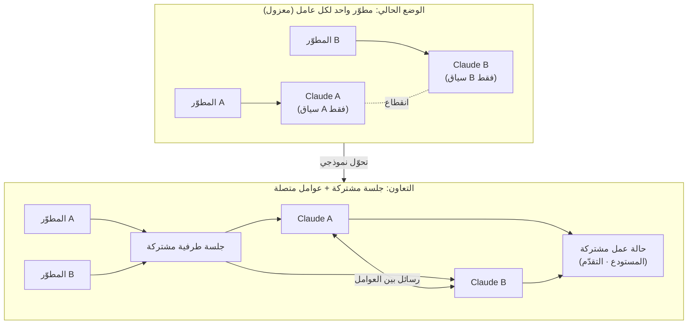

عند استخدام عوامل البرمجة (coding agents) ضمن فريق، نصطدم بجدار غريب. العامل ملك لي وحدي. حتى لو كان زميلي في المكتب المجاور يعمل على المستودع نفسه، فإن كل Claude لا يعرف بوجود الآخر. البشر يتعاونون عبر Slack ومشاركة الشاشة، بينما العوامل التي تعدّل الكود نيابة عنا محبوسة كل واحدة في جزيرتها الخاصة. أداة **Claude Code متعدد اللاعبين** التي كُشف عنها مؤخراً وأثارت ضجة تستهدف هذا الجدار بالتحديد. إنها تجربة تتيح لعدة أشخاص استخدام الطرفية (terminal) نفسها معاً، وربط كل Claude بالآخر بحيث تتحدث العوامل فيما بينها. تنطلق هذه المقالة من هذه المحاولة لتفكيك تحديات التصميم التي يجب أن تحلها عوامل البرمجة التعاونية، وتتحقق مما يعنيه هذا الاتجاه من منظور تشغيل ThakiCloud الذي يتعامل مع العوامل المتعددة والسياسات كموارد من الدرجة الأولى.

## نظرة عامة

حتى الآن كانت الوحدة الأساسية لعوامل البرمجة هي **عامل واحد لكل شخص**. يعيش Claude Code في طرفيتي الخاصة، يفهم قاعدة الكود الخاصة بي، ويتلقى أوامري أنا وحدي. هذه البنية ممتازة للإنتاجية الفردية، لكنها تتعارض مع حقيقة أن البرمجيات، في جوهرها، عمل جماعي. Claude Code متعدد اللاعبين الذي كشفت عنه المطوّرة دورسا روهاني (Dorsa Rohani) يقلب هذا الافتراض رأساً على عقب. وفقاً لما أُعلن، تتيح هذه الأداة أمرين. أولاً، يشارك عدة أشخاص **جلسة الطرفية نفسها** ويعملون معاً. ثانياً، يتم **ربط كل Claude بالآخر** بحيث تتحدث العوامل فيما بينها.

الجدير بالملاحظة أن هذا ليس مجرد لعبة عابرة، بل قطعة من تيار أكبر. ظهرت في الفترة نفسها تقريباً مشاريع متتالية تجمع عدة أشخاص وعدة عوامل برمجة في مساحة عمل واحدة. من الأمثلة على ذلك `oh-my-claudecode` الذي يتبنى تنسيقاً متعدد العوامل يضع الفريق أولاً، و`claude_codex_bridge` الذي يمزج بين عدة عوامل من بينها Codex وClaude في مساحة عمل واحدة، و`codeg` وهو مساحة عمل تعاونية تجمّع جلسات عدة عوامل. يتقارب الاتجاه في نقطة واحدة: **التعامل مع العوامل ليست كوحدات معزولة، بل كمشاركين يتواصلون فيما بينهم**.

سبب أهمية هذا التيار واضح. في المنظمات التطويرية الفعلية، يأتي جزء كبير من العمل ذي القيمة من التنسيق: من يعمل على أي ملف، هل يكسر هذا التغيير تلك الوحدة، وما الذي يقلق المراجع. إذا لم تشارك العوامل في هذا التنسيق، فسننتهي في النهاية بأن يقوم البشر بخياطة نواتج العوامل المنفصلة يدوياً من جديد. عوامل التعاون هي محاولة لتقليل تكلفة تلك الخياطة.

## ما هو عامل البرمجة متعدد اللاعبين

كلمة "متعدد اللاعبين" (multiplayer) جاءت من عالم الألعاب، لكنها هنا تشير إلى محورين مختلفين في آنٍ واحد. الأول هو محور **إنسان مقابل إنسان**: عدة مطوّرين يشاركون الجلسة نفسها ويوجّهون تعليماتهم معاً إلى عامل واحد. والثاني هو محور **عامل مقابل عامل**: يتبادل كل عامل الرسائل مع الآخر ويوزّعان العمل فيما بينهما. سبب إثارة Claude Code متعدد اللاعبين للاهتمام هو أنه يتعامل مع هذين المحورين معاً.

يوضّح المخطط أدناه الفرق بين البنية المعزولة التقليدية والبنية التعاونية.

في البنية التقليدية، لا يدرك عاملا المطوّرين وجود بعضهما البعض حتى لو كانا يعملان على المستودع نفسه. بما أن كل عامل يحكم ضمن سياقه الخاص فقط، يحدث أن يستدعي Claude الخاص بـ B واجهة أعاد Claude الخاص بـ A هيكلتها، لكن باستخدام التوقيع (signature) القديم دون أن يعلم بذلك. أما في البنية التعاونية، فتُشارَك الجلسة والحالة، وتتبادل العوامل الرسائل فيما بينها، مما يفتح مجالاً لتقليل هذا التضارب في وقت شبه فعلي (near real-time).

إلا أنه من الصعب الجزم، بناءً على المعلومات المُعلَنة فقط، بمدى تطوّر هذا الاتصال فعلياً. تتفاوت الجدوى العملية بشكل كبير حسب ما إذا كانت الطرفية المشتركة مجرد بث للشاشة، أو أن العوامل تتبادل فعلاً خططها ونيّات تعديلها في شكل منظَّم (structured). تركّز هذه المقالة على تناول تحديات التصميم استناداً إلى المفهوم المُعلَن، ولا تجزم بآليات داخلية لم يتم التحقق منها.

## لماذا هذا الاتجاه الآن

هناك سبب لظهور عوامل التعاون في هذا التوقيت بالذات. مع تعاظم قوة النماذج، كبر حجم المهام التي يعالجها عامل واحد، وبالتالي أصبحت **حالات قيام عدة عوامل بإجراء تغييرات كبيرة في آنٍ واحد** أكثر تكراراً فعلياً. أصبح نمط تشغيل شخص واحد لعدة عوامل فرعية بالتوازي لتوزيع تعديل الملفات فيما بينها أمراً شائعاً بالفعل. خطوة واحدة أخرى إلى الأمام من هذه النقطة تكفي لتصل إلى لحظة تتقاطع فيها عوامل أشخاص مختلفين على قاعدة الكود نفسها. وبدون تنسيق، تتحول هذه اللحظة فوراً إلى تصادم.

خلفية أخرى هي تشظّي (fragmentation) نظام الأدوات البيئي. في كل فريق يختلط من يستخدم Claude Code، ومن يستخدم Codex، ومن يستخدم Cursor. ظهور المشاريع المذكورة آنفاً التي تجمع عوامل من عدة موردين في مساحة عمل واحدة هو محاولة لامتصاص هذا التشظّي عبر طبقة تنسيق. بعبارة أخرى، لم تعد عوامل التعاون مجرد ميزة لإضافة أشخاص أكثر، بل تتحوّل إلى **مسألة بنية تحتية للتعامل مع واقع تعايش عوامل غير متجانسة**.

## تحديات التصميم التي يجب أن تحلها عوامل التعاون

خلف المفهوم الجذّاب تكمن هندسة ليست بالسهلة. لكي تصل عوامل التعاون إلى بيئة الإنتاج الفعلية، يجب حل أربع مسائل على الأقل.

أولاً، **التزامن والتصادم (Concurrency and Conflict)**. يجب تحديد ما يحدث عندما يعدّل عاملان المنطقة نفسها من الملف نفسه في الوقت ذاته. في تعاون البشر، امتصت فروع git (branches) وعمليات الدمج (merge) هذه المشكلة، لكن الجلسات المشتركة في الوقت الفعلي تحتاج إلى تنسيق بدورات زمنية أقصر من ذلك بكثير. هل نضع قفلاً (lock)؟ أم نعتمد التعديل التفاؤلي (optimistic editing) ثم الدمج لاحقاً؟ أم نوزّع مناطق العمل منذ البداية بحيث لا تتداخل؟ هذه هي مفترق طرق التصميم.

ثانياً، **نطاق مشاركة السياق (Context)**. لجعل العوامل تتحدث فيما بينها، يجب تحديد ما الذي سيتم مشاركته. إذا نُقل سجل المحادثة الكامل دفعة واحدة، تنفجر تكلفة الرموز (tokens) ويتلوّث السياق. وفي المقابل، إذا شُوركت كمية قليلة جداً، يفقد التعاون معناه. ما هو مطلوب في النهاية هو **تبادل حالة مُلخَّصة ومنظَّمة**. يجب تبادل نية من قبيل "أخطط لتغيير هذه الدالة في هذا الملف على هذا النحو" في صيغة مضغوطة، وليس كنص خام كامل.

ثالثاً، **حدود الثقة (Trust Boundaries)**. وهي مسألة إلى أي مدى يجب أن يثق عاملي بالتغيير الذي يقترحه عامل شخص آخر. تماماً كما لا يدمج البشر التغييرات دون مراجعة، يجب ألا تقبل العوامل نواتج عوامل أخرى دون تحقّق. الدرس القديم في أنظمة العوامل المتعددة واضح: **دمج نتائج عدة عوامل دون مرحلة تحقق يراكم الهلوسات (hallucinations)**. وكلما زاد التعاون، ازدادت الحاجة إلى بوابات تحقق عدائية (adversarial verification) تفحص ناتج كل مشارك.

رابعاً، **التدقيق وتتبّع المسؤولية (Audit and Accountability)**. عندما يعمل عدة أشخاص وعدة عوامل على الكود نفسه، إذا تعذّر تتبّع أي تغيير نتج عن قرار من هو (أو أي عامل)، فلن يمكن إعادة تتبّع السبب عند وقوع حادث. كلما زاد التعاون، تحوّل سجل التدقيق (audit log) من خيار إلى ضرورة.

## الدلالات على تطبيقات منتجات ThakiCloud

تتطابق تحديات التصميم هذه تماماً مع المسائل التي تتصدى لها ThakiCloud بالفعل بشكل مباشر في **Paxis**. Paxis هي مستوى تحكّم (control plane) من نوع Agent-Native Cloud يعمل فوق ai-platform، ويتعامل مع Skills وTools وPolicies وAudit Logs كموارد من الدرجة الأولى. تستجيب بنية Paxis للأسئلة التي يطرحها عامل البرمجة متعدد اللاعبين على النحو التالي.

هيكل التعاون بين العوامل هو تنسيق **العوامل المتعددة القائم على DAG** في Paxis. بدلاً من إطلاق عدة عوامل بشكل عشوائي في المساحة نفسها، يتم تفكيك المهمة إلى رسم بياني موجّه غير دوري (Directed Acyclic Graph)، بحيث تمتلك كل عقدة (node) منطقة مسؤوليتها الخاصة، مما يتيح تجنّب جزء كبير من تصادمات التزامن المذكورة آنفاً بنيوياً. إنها طريقة توزّع العمل منذ البداية بحيث لا يتداخل، بدلاً من دمج التعديلات المتداخلة لاحقاً.

تجيب **بوابات السياسات (policy gates) وسجلات التدقيق** في Paxis على مسألة حدود الثقة. يجب أن يمرّ ناتج أي عامل عبر بوابة سياسة قبل أن ينتقل إلى عامل آخر أو إلى نظام فعلي، وتُسجَّل جميع الإجراءات في سجل التدقيق. هذا يفرض من الناحية البنيوية للبنية التحتية مبدأ "لا تُدمَج نتائج عدة عوامل دون تحقق". وكلما ازداد التعاون، تعاظمت قيمة هذه البوابة.

تخفف **Skill Harness** ومحرك المعرفة في Paxis من مشكلة تكلفة مشاركة السياق. البنية التي تختار أكثر من 960 مهارة (skill) عبر BM25 وتنفّذها في صندوق رملي معزول (isolated sandbox) مصمَّمة بحيث يستدعي العامل القدرات المطلوبة عند الحاجة فقط، بدلاً من حمل السياق الكامل في كل مرة. هذا يتماشى مع المطلب القائل بأن على عوامل التعاون تبادل الحالة في شكل ملخَّص، لا كتبادل كامل.

ما يدعم موارد التنفيذ تحت ذلك هو **ai-platform**. لكي يقوم عدة أشخاص وعدة عوامل بتنفيذ الكود في آنٍ واحد داخل صناديق رملية معزولة، يلزم عزل متعدد المستأجرين (multi-tenant isolation) وحوسبة مرنة. توفّر جدولة GPU القائمة على K8s وKueue، والعزل متعدد المستأجرين، الأساس الذي تعمل عليه عوامل التعاون فعلياً. وكون هذه البنية التعاونية يمكن إقامتها بأمان حتى في بيئات محلية (on-premises) وذات سيادة (sovereign)، له دلالة خاصة بالنسبة للمنظمات القلقة بشأن تسرّب البيانات.

باختصار، إذا كان Claude Code متعدد اللاعبين يجرّب مفهوم التعاون على مستوى الأداة الفردية، فإن Paxis يبنيه هيكلياً على مستوى مستوى التحكّم عبر السياسات والتدقيق والتنسيق. المستويان ليسا في تنافس بل في تكامل. لأن انتقال عوامل التعاون من عرض توضيحي ممتع إلى تشغيل يمكن الوثوق به يحتاج في النهاية إلى مستوى تحكّم مزوّد ببوابات سياسات وسجلات تدقيق وعزل موارد.

## القيود والحجج المضادة

لا يمكن التفاؤل بعوامل التعاون فحسب. أكبر حجة مضادة هي أن **تكلفة التنسيق قد تلتهم فوائد التعاون**. تماماً كالاجتماعات بين البشر، فإن ازدياد الرسائل المتبادَلة بين العوامل يتحوّل بحد ذاته إلى تأخير وتكلفة رموز إضافية. من الممكن تماماً أن ينشغل عاملان بالتحقق المستمر من خطط بعضهما البعض إلى درجة عدم إنتاج الكود فعلياً. التعاون ليس دائماً أسرع من العمل المنفرد المتوازي.

ثانياً، **ترابط أنماط الفشل**. عندما تكون العوامل متصلة ببعضها، ينتقل الحكم الخاطئ لعامل واحد إلى العوامل الأخرى. في البنية المعزولة يبقى خطأ الشخص الواحد محصوراً فيه، أما في البنية المتصلة فينتشر الخطأ عبر السلسلة. وبدون بوابة تحقق، يضخّم التعاون الحوادث بدلاً من أن يقلّلها.

ثالثاً، لم يتم التحقق بعد من مستوى تبادل الحالة الذي نفّذته فعلياً الأداة متعددة اللاعبين المُعلَنة حالياً. تتفاوت الجدوى العملية بشكل كبير حسب ما إذا كانت الطرفية المشتركة أقرب إلى مشاركة الشاشة، أو بروتوكول منظَّم حقيقي بين العوامل. اتجاه المفهوم واضح، لكن قبل نقله إلى بيئة الإنتاج، يجب التأكد حتماً من حدود الثقة ومسار التدقيق. لا تزال هناك مسافة كبيرة بين العرض التوضيحي المثير للاهتمام والبنية التحتية الموثوقة.

ومع ذلك، أرى أن الاتجاه نفسه يصعب التراجع عنه. طالما أن البرمجيات عمل جماعي، فإن العوامل التي تمثّل هذا الفريق يجب أن تتحدث فيما بينها في النهاية. القضية الأساسية ليست ما إذا كنا سنُفعّل التعاون أم لا، بل ما إذا كنا سنبني ذلك التعاون **على بنية تدعمها السياسات والتحقق والتدقيق**.

## المصادر

- Dorsa Rohani, "We made Claude Code multiplayer!" (X, 2026-07-08): [https://x.com/dorsa_rohani/status/2074963064231952832](https://x.com/dorsa_rohani/status/2074963064231952832)
- Claude Code (مستودع Anthropic الرسمي): [https://github.com/anthropics/claude-code](https://github.com/anthropics/claude-code)
- oh-my-claudecode (تنسيق متعدد العوامل يضع الفريق أولاً): [https://github.com/yeachan-heo/oh-my-claudecode](https://github.com/yeachan-heo/oh-my-claudecode)
- claude_codex_bridge (مساحة عمل CLI متعددة العوامل): [https://github.com/SeemSeam/claude_codex_bridge](https://github.com/SeemSeam/claude_codex_bridge)
