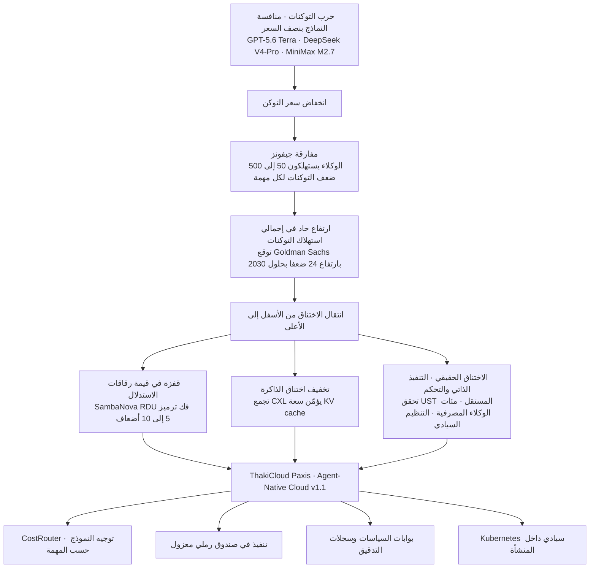

## خبران متناقضان وصلا في الأسبوع نفسه

وصل هذا الأسبوع إلى صفحات الذكاء الاصطناعي خبران يبدوان متناقضين جنبا إلى جنب. الأول خبر انخفاض الأسعار. طرحت OpenAI نموذج GPT-5.6 بثلاث فئات تسعير هي سول (Sol) وتيرا (Terra) ولونا (Luna)، ووضعت الفئة المتوسطة تيرا بنصف سعر الجيل السابق. أما DeepSeek V4-Pro فقد ضاهى أداء البرمجة في Claude Opus 4.7 بسعر يتراوح بين 10% و20% منه فقط، بينما طرحت MiniMax M2.7 سعرا يصل إلى ثلث سعر نظيراتها من الفئة نفسها. تصف الصناعة هذه المرحلة صراحة بـ"حرب التوكنات" (token war).

والخبر الآخر خبر ارتفاع الأسعار. حصلت شركة سامبانوفا (SambaNova)، الناشئة المتخصصة في رقاقات الاستدلال المخصصة، على تقييم بلغ 11 مليار دولار (نحو 16 تريليون وون)، بعد أن جمعت مليار دولار في الإغلاق الأول من جولة السلسلة F. وكان تقييمها في جولة السلسلة E قبل خمسة أشهر فقط 2.2 مليار دولار، أي أن قيمتها قفزت خمسة أضعاف خلال خمسة أشهر. سعر التوكن الواحد انخفض إلى النصف، لكن قيمة الشركة التي تصنع الرقاقة التي تُنتج ذلك التوكن ارتفعت خمسة أضعاف. فهل أحد الخبرين خاطئ؟ لا. فالخبران صورتان لتيار واحد، واحدة من الأمام والأخرى من الخلف.

## القانون القديم القائل بأن انخفاض السعر يزيد الاستهلاك

في القرن التاسع عشر، قلب الاقتصادي البريطاني ويليام جيفونز (William Jevons) الاعتقاد السائد بأن محرك البخار الأكثر كفاءة في استهلاك الفحم سيقلل من استهلاكه. فحين انخفض سعر الوقود، لم يوفر الناس، بل شغّلوا عددا أكبر من الآلات، فارتفع الاستهلاك الإجمالي للفحم فعليا. هذه المفارقة، التي تقول إن انخفاض سعر وحدة المورد يؤدي إلى زيادة إجمالي استهلاكه، تتكرر اليوم في سوق الاستدلال (inference) وكأنها مثال من كتاب مدرسي.

"مفارقة التوكن" التي رصدتها Digital Daily تجسد هذه الفكرة تماما. فمنذ عام 2023 ينخفض سعر التوكن الواحد باستمرار، لكن التكلفة الإجمالية للذكاء الاصطناعي التي تتحملها الشركات ترتفع بشدة. والمتهم هو وكلاء الذكاء الاصطناعي (AI agents). فالوكيل الذي يبحث بنفسه ويستدعي الأدوات وينجز العمل عبر خطوات متعددة يستهلك ما لا يقل عن 50 ضعفا وقد يصل إلى 500 ضعف عدد التوكنات التي يستهلكها روبوت محادثة يجيب مرة واحدة عن سؤال واحد، لكل مهمة واحدة. وتتوقع Goldman Sachs أن يرتفع الاستهلاك الشهري العالمي للتوكنات من 5 كوادريليون توكن شهريا هذا العام إلى 120 كوادريليون توكن شهريا بحلول عام 2030، أي بمقدار 24 ضعفا. فإذا انخفض السعر إلى النصف بينما يقفز الاستهلاك عشرين ضعفا، تصبح الفاتورة عشرة أضعاف. فكلما اشتدت المنافسة على خفض الأسعار، كبر الإنفاق الإجمالي أكثر.

## الاختناق ينتقل من الأسفل إلى الأعلى

من هنا يتضح بسهولة سبب ارتفاع تقييم سامبانوفا. فإذا كان استخدام التوكنات سيصل إلى حجم لا يُحصى، فإن قيمة الأجهزة القادرة على إنتاج التوكن الواحد بتكلفة أقل وسرعة أعلى ترتفع في المقابل. وتوضح الشركة أن بنيتها المعمارية الخاصة RDU (بدلا من وحدات معالجة الرسوميات GPU)، في أحدث رقاقاتها SN40 وSN50، ترفع أداء فك الترميز (decode) في استدلال النماذج اللغوية الكبيرة بمقدار 5 إلى 10 أضعاف مقارنة بوحدات GPU من Nvidia، ما يخفض التكلفة لكل توكن. واللافت أن JPMorgan Chase قرر بناء بنية تحتية للاستدلال داخل مركز بياناته الخاص (on-premise) باستخدام هذه الرقاقة لمعالجة بيانات مالية حساسة، وهو ما يحمل دلالة خاصة، إذ يعني أن التدريب لم يعد هو الوجهة التي تمتص رأس المال الضخم، بل الاستدلال، وتحديدا الاستدلال على البنية التحتية الداخلية في الصناعات الخاضعة للتنظيم.

ويظهر الضغط نفسه في الذاكرة أيضا. فنتائج تقييم تقنية CXL التي كشفت عنها سامسونج إلكترونيكس هذا الأسبوع تُظهر أن الطلب على سعة ذاكرة التخزين المؤقت للمفاتيح والقيم (KV cache) التي تحفظ سياق المحادثة في استدلال الذكاء الاصطناعي انفجر إلى مئات الجيجابايت، ما كشف عن اختناق يصعب على ذاكرة HBM المرفقة بوحدة GPU وحدها استيعابه. فقد انهار أداء ذاكرة DRAM بسعة 512 جيجابايت عندما فاض حجم KV cache عن حدها، في حين حافظ تجمع ذاكرة CXL بسعة تيرابايت واحد على 92% من أداء DRAM حتى في بيئة مكونة من 8 وحدات GPU. وتتوقع مؤسسة الأبحاث Yole أن ينمو سوق CXL من 2.1 مليار دولار هذا العام إلى نحو 16 مليار دولار بحلول عام 2028. وإذا كانت HBM قد حلت مشكلة عرض النطاق الترددي (bandwidth)، فإن CXL أصبحت تتموضع كمكمل يحل مشكلتي السعة والتكلفة.

وتتأكد هذه الطفرة في الطلب من خلال مؤشرات حقيقية أيضا. فقد بلغت صادرات تايوان في يونيو 748 مليار دولار، وهي ثالث أكبر رقم شهري في تاريخها، ودفعت شحنات منتجات تقنية المعلومات والاتصالات، التي تشمل بطاقات الرسوميات وخوادم الذكاء الاصطناعي، هذا الأداء بارتفاع بلغ 72.3% على أساس سنوي. وخلف هذا الرقم يقف الطلب على ذاكرة HBM وتقنية التغليف المتقدم CoWoS. ومن هذا المنطلق أيضا عرض تشوي تاي وون (Chey Tae-won)، رئيس مجموعة SK، مباشرة أمام مستثمرين عالميين مخططا لأشباه موصلات الذكاء الاصطناعي محوره الريادة في HBM. فكلما أصبحت التوكنات أكثر وفرة، أصبحت الرقاقات والذاكرة القادرة على استيعابها أكثر ندرة. إنها صورة اختناق ينتقل من الأسفل إلى الأعلى، مباشرة تحت الطبقة التي تنخفض فيها الأسعار.

## الأغلى فعلا ليس التوكن، بل التنفيذ الذاتي المستقل

لكن كون الاختناق لا يتوقف عند الأجهزة وحدها هو الإشارة الحقيقية في أخبار اليوم. فلننظر إلى حالة UST التي تعاونت مع Anthropic لربط Claude بعملية التحقق من صحة أشباه الموصلات (semiconductor verification). يقرأ Claude Code مباشرة مخططات دبابيس الرقاقة (pinout) والدوائر الكهربائية للأجهزة، ويكتب بنفسه اختبارات الانحدار (regression tests) التي كان المهندسون يكتبونها يدويا وينفذها، ويقارن بيانات الأجهزة الفعلية بالتوأم الرقمي (digital twin) ليكتشف العيوب تلقائيا. وقد تقلصت مدة دورة التحقق التي كانت تستغرق عادة أربعة أيام إلى 48 ساعة، وانخفض زمن دورة التحقق بنسبة تتراوح بين 50% و70%. لم يعد الوكيل مجرد أداة إكمال تلقائي للكود، بل أصبح عاملا يُنجز عملية هندسية فعلية بشكل مستقل ضمن حلقة مغلقة (closed loop).

ويسير القطاع المصرفي المحلي في الاتجاه نفسه. أنفق بنك Woori 88.4 مليار وون لربط أكثر من 175 وكيلا بـ29 مهمة موزعة على خمسة مجالات رئيسية، بينما يعمل KB Financial على بناء نحو 300 وكيل لتغطية 59 مهمة خلال العام الحالي استهدافا لما يسمى "الخدمات المصرفية القائمة على الوكلاء" (Agentic Banking). أما بنك Hana فقد اختصر كتابة رأي تقييم الجدارة الائتمانية للشركات من متوسط 30 دقيقة إلى نحو 10 ثوان، ما يُتوقع أن يوفر أكثر من 27 ألف ساعة عمل سنويا. وعندما تبدأ الوكلاء بهذا الحجم بالتدخل مباشرة في أعمال جوهرية مثل التقييم وإدارة الأصول والرقابة الداخلية، يتغير السؤال الذي يقلق الإدارة التنفيذية ليلا. فلم يعد السؤال "كم يبلغ سعر التوكن؟"، بل أصبح "من يتحكم في هذه المئات من عمليات التنفيذ الذاتي وكيف يُراجعها؟". ومن هنا برز التحدي التالي المتمثل في كيفية دمج مبدأ الموافقة المزدوجة الذي حافظ عليه القطاع المصرفي طويلا مع هذه الوكلاء.

ويتزايد ثقل الرقابة التنظيمية أيضا. فقد بدأت الصين تنفيذ تدابير إدارة التفاعل المُؤَنسَن (anthropomorphized interaction) للذكاء الاصطناعي، التي أعدّتها خمس جهات حكومية بالتشارك، اعتبارا من 15 يوليو، وبدأت ByteDance وAlibaba بإلغاء ميزات الشخصيات المخصصة (custom persona) في روبوتات المحادثة تماشيا مع ذلك. وهذه حالة تدفع فيها متطلبات السلامة مباشرة إلى مرحلة تصميم الخدمة نفسها، لذلك يصعب على مشغلي الخدمات المحليين اعتبارها شأنا لا يعنيهم. ويتقاطع مع هذا نقاش الذكاء الاصطناعي السيادي (sovereign AI). فبعد أن قيّدت الولايات المتحدة، بذريعة الأمن القومي، وصول Claude Fable 5 من الخارج ثم أعادت فتحه، وبعد أن بدأت الصين مراجعة تقييد الوصول الخارجي لنماذجها المحلية، أخذ عصر إمكانية استخدام نماذج الذكاء الاصطناعي الحدودية من أي مكان بالأفول. فامتلاك نموذج بمستوى حدودي داخل الحدود الوطنية مباشرة يتطلب رأس مال ووقتا هائلين، ومع ذلك بدأت راحة استعارة نماذج رخيصة من الخارج تصطدم وجها لوجه مع السيادة التي تسعى لإبقاء البيانات الحساسة داخل الحدود.

## فيضان التوكنات الرخيصة يحتاج إلى أنابيب مياه

وتؤكد حسابات كبرى شركات التقنية هذا الضغط أيضا. فقد بلغ إجمالي الإنفاق الرأسمالي المجمّع لشركات Alphabet وMicrosoft وMeta وAmazon لعام 2026 نحو 725 مليار دولار، وهو رقم قياسي غير مسبوق يمثل 30% من الإيرادات، بينما تراجع إجمالي التدفق النقدي الحر (free cash flow) لهذه الشركات مجتمعة إلى أدنى مستوى له منذ نحو عشر سنوات. فقد انخفض التدفق النقدي الحر لأمازون على أساس الاثني عشر شهرا الأخيرة من 25.9 مليار دولار قبل عام واحد إلى 1.2 مليار دولار فقط، أي بانخفاض نسبته 95%. فالمؤسسة التي تكتفي بترك فيضان التوكنات الرخيصة يتدفق دون تحكم، ستنهار أمام الفاتورة أولا. وما تحتاجه ليس أنبوبا أكبر قطرا، بل شبكة أنابيب مصممة جيدا لتوزيع هذا الفيضان بأمان.

ومنتج Paxis من ThakiCloud هو بالضبط المنتج الرسمي الذي يستهدف هذه الشبكة، أي Agent-Native Cloud v1.1. فالنماذج بنصف السعر التي أطلقتها حرب التوكنات ليست تهديدا من منظور CostRouter، بل سلاحا. فتوجيه المهام البسيطة والمتكررة إلى نماذج خفيفة منخفضة التكلفة، وتوجيه الاستدلال المعقد فقط إلى النماذج الحدودية، وتقسيم ذلك حسب كل مهمة على حدة، يمكن أن يكبح بنيويا فاتورة مفارقة جيفونز. وبالنسبة لوكيل مثل UST الذي يقرأ المخططات مباشرة، يصبح التنفيذ في صندوق رملي (sandbox) معزول هو الحل، بينما تصبح بوابات السياسات وسجلات التدقيق وحوكمة الاستقلالية المقسّمة من L0 إلى L3 بديلا آمنا لمبدأ الموافقة المزدوجة في نشر مئات الوكلاء على طريقة بنك Woori. وما أظهرته سامبانوفا وJPMorgan من طلب على الاستدلال داخل المنشأة (on-premise)، ونقاش السيادة المتجه نحو الذكاء الاصطناعي السيادي، يتقاطعان مباشرة مع تصميم Paxis الذي يتعامل مع Skills وTools وPolicies وAudit Logs كموارد من الدرجة الأولى فوق Kubernetes سيادي داخل المنشأة.

وخلاصة القول: كلما رخصت التوكنات، استهلكناها أكثر وبشكل أكثر استقلالية، وكلما حدث ذلك، انتقل الاختناق والمخاطر من مستوى السعر إلى مستوى التنفيذ والتحكم. وهنا يكمن السبب في أن خبر منافسة الأسعار بالنصف وخبر ارتفاع القيمة خمسة أضعاف لم يكونا متناقضين، بل كانا وجهين لجسد واحد. ففي عالم انخفضت فيه الأسعار، لن يفوز من يوفر التوكنات أكثر من غيره، بل من يُحكم السيطرة على فيضان التوكنات المتدفق بأمان أكثر من غيره.

## المراجع

- [حرب التوكنات تجتاح صناعة الذكاء الاصطناعي، ومفارقة سعر التوكن الأخف والفاتورة الأثقل (Digital Daily)](https://www.ddaily.co.kr/page/view/2026071016360758815)
- [تفاصيل خطة تسعير OpenAI GPT-5.6 بثلاث فئات (eesel.ai)](https://www.eesel.ai/blog/gpt-5-6-pricing)
- [سامبانوفا تجمع مليار دولار بتقييم 11 مليار دولار في الإغلاق الأول من السلسلة F (TechCrunch)](https://techcrunch.com/2026/07/08/sambanova-draws-1b-at-11b-valuation-in-series-f-first-close/)
- [رقاقة SambaNova SN50 RDU المخصصة للاستدلال الوكيلي واعتماد JPMorgan لها داخل المنشأة (SambaNova)](https://sambanova.ai/blog/introducing-the-sn50-rdu-purpose-built-for-agentic-inference)
- [حل اختناق استدلال الذكاء الاصطناعي عبر CXL، وتسريع سامسونج نحو الجيل التالي من HBM (Herald Economy)](https://biz.heraldcorp.com/article/10805245)
- [صادرات تايوان في يونيو تبلغ 74.8 مليار دولار مدفوعة بخوادم الذكاء الاصطناعي (Seoul Economic Daily)](https://www.sedaily.com/article/20066169)
- [تشوي تاي وون: استثمار مئات المليارات من الدولارات في الذكاء الاصطناعي مع استمرار نقص إمدادات HBM (Financial News)](https://www.fnnews.com/news/202607110443238428)
- [شراكة UST وAnthropic للتحقق من صحة أشباه الموصلات باستخدام Claude (Anthropic)](https://www.anthropic.com/news/ust-claude)
- [بنك Woori ينفق 88.4 مليار وون لبناء 175 وكيل ذكاء اصطناعي (BIkorea)](https://m.bikorea.net/news/articleView.html?idxno=45433)
- [الصين تنفذ تدابير إدارة التفاعل المُؤَنسَن للذكاء الاصطناعي، وروبوتات المحادثة توقف ميزات الشخصيات المخصصة (ZDNet Korea)](https://zdnet.co.kr/view/?no=20260707224246)
- [استثمارات كبرى شركات التقنية 725 مليار دولار في الذكاء الاصطناعي بينما يهبط التدفق النقدي الحر إلى أدنى مستوى منذ أكثر من عقد (Financial News)](https://www.fnnews.com/news/202605111154590244)
