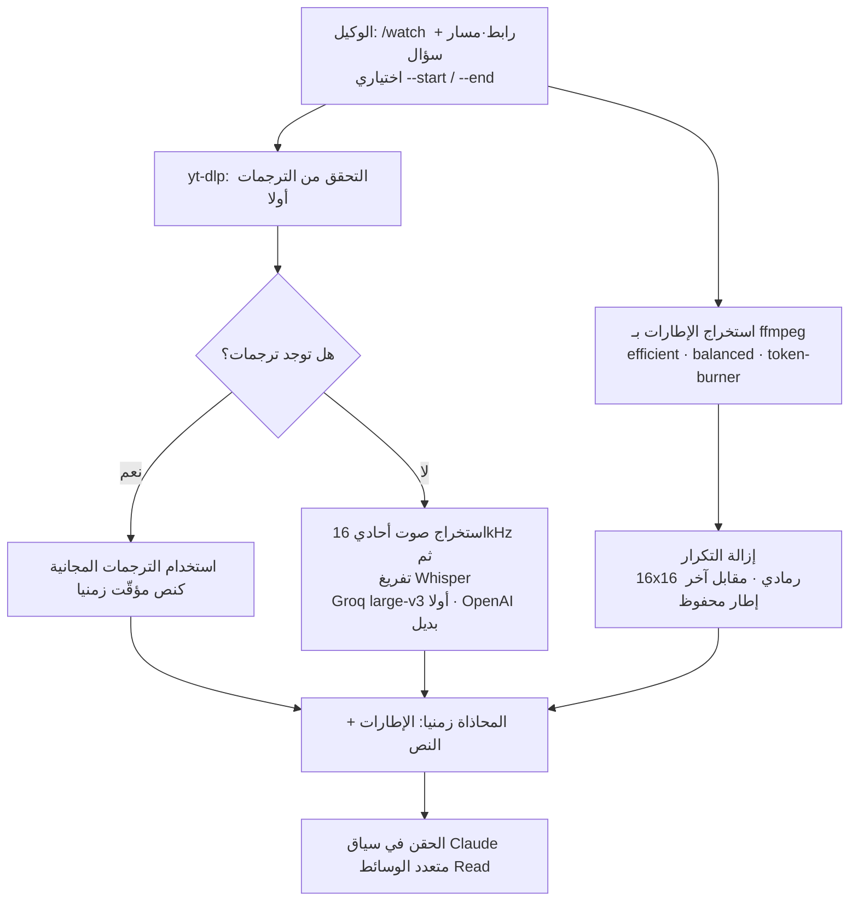

## نظرة عامة

اقتصرت وكلاء البرمجة حتى الآن على قراءة النص فقط. ملفات المصدر والسجلات والوثائق واستجابات الواجهات، كلها كانت حروفا. ومع ذلك، فإن جزءا كبيرا مما يهم فعليا يعيش داخل الفيديو. تسجيلات عروض المنتجات، وشاشات إعادة إنتاج الأخطاء، وتسجيلات الاجتماعات، والفيديوهات التعليمية، ومقاطع إصدارات المنافسين. يفتح الإنسان أحدها فيقول "تنكسر الشاشة قرب الدقيقة 2:30"، لكن بالنسبة للوكيل كان ذلك الفيديو مجرد ملف ثنائي لا يمكن فتحه.

يهدم `claude-video` هذا الجدار بشكل رقيق. باختصار هو "يمنح Claude القدرة على مشاهدة الفيديو"، وما يفعله فعليا هو تحويل الفيديو إلى صور إطارات ونص مصحوب بطوابع زمنية، ثم دفعها إلى سياق Claude متعدد الوسائط عبر أداة Read. حتى يوليو 2026 تجاوز 5400 نجمة على GitHub، وتضعه بعض الإحصاءات عند 7000، مما يجعله أحد أكثر المشاريع تداولا في هذه اللحظة.

جمهور هذا المقال واضح. المطورون ومهندسو المنصات الذين يستخدمون وكلاء البرمجة مثل Claude Code وCursor وCopilot وGemini CLI في العمل الفعلي ويتساءلون كيف يدخلون المواد المرئية إلى خطوط أنابيبهم. وكل من يتساءل عن معنى هذه التقنية لتصميم منصات الوكلاء بما يتجاوز مجرد الراحة. الجواب المختصر: يعدّ claude-video مثالا جيدا على كيفية إضافة حاسة جديدة (البصر) إلى الوكيل عبر "إطار مُشغّل رقيق مع تركيبة من أدوات مُثبتة"، وهو ينسجم تماما مع الاتجاه الذي تنتهجه ThakiCloud في Paxis.


## ما هذه الأداة

لا يبني claude-video نموذجا جديدا. إنه مهارة تربط بشكل رقيق بين ثلاث أدوات مفتوحة المصدر مُثبتة بالفعل. يتولى `yt-dlp` تنزيل الفيديو والحصول على الترجمات، ويتولى `ffmpeg` استخراج الإطارات وتحويل الصوت، ويتولى `Whisper` تفريغ الكلام عند غياب الترجمات. أما التجميع النهائي والحكم فتقوم بهما أداة Read متعددة الوسائط في Claude. الجديد المكتوب هو خط الأنابيب الذي يصل هذه القطع الأربع، ومنطق إزالة التكرار الذي يصفّي الإطارات بذكاء.

الواجهة الأساسية أمر شرطة مائلة واحد هو `/watch`. يمرّر المستخدم رابط فيديو أو مسارا محليا، ويرفق سؤالا، ويحدد نطاقا عند الحاجة. عندها "يشاهد" الوكيل الفيديو ويجيب. مصادر الإدخال واسعة. ليس YouTube فحسب بل Instagram وX وVimeo وعموم أي موقع يدعمه yt-dlp، إضافة إلى تسجيلات Zoom وLoom وملفات mp4 المحلية.

يبدو التدفق الكامل هكذا.



الفرق عن المقاربات السابقة واضح. حتى الآن كان "الذكاء الاصطناعي يلخّص فيديو YouTube" يعني غالبا قراءة العنوان والوصف ونص الترجمة فقط ثم التخمين. لا يخمّن claude-video من العنوان. يرى الإطارات الفعلية كصور ويقرأ الترجمات أو النص إلى جانبها، جامعا بين البصر والسمع. أسئلة مثل ماذا يظهر على الشاشة، أو متى بالضبط تنكسر الواجهة، لا يمكن الإجابة عنها من نص الترجمة وحده؛ يجب رؤية الإطارات.

## التثبيت والاستخدام

يسير التثبيت في مسارين. يربطه مستخدمو Claude Code عبر سوق الإضافات.

```bash
# Claude Code: سجّل السوق ثم ثبّت مهارة watch
/plugin marketplace add bradautomates/claude-video
/plugin install watch@claude-video
```

على نحو خمسين مضيف وكيل بما فيها Cursor وCopilot وGemini CLI، ثبّته عالميا وفق مواصفة Agent Skills.

```bash
# مواصفة Agent Skills (مشتركة عبر نحو 50 مضيفا)
npx skills add bradautomates/claude-video -g
```

لا حاجة لأي إعداد إضافي للبدء. إن غاب `yt-dlp` و`ffmpeg` فسيثبّتان تلقائيا عبر brew عند أول تشغيل على macOS، وعلى Linux وWindows تُطبع أوامر التثبيت الدقيقة. مفتاح واجهة Whisper ليس مطلوبا دائما؛ إنه ضروري فقط حين لا يملك الفيديو أي ترجمات. كثير من الفيديوهات العامة تأتي مع ترجمات وتُعالج على المسار المجاني.

الاستخدام سطر أمر واحد.

```bash
# اطرح سؤالا عن ملف محلي
/watch tutorial.mp4 "ما اللغة المستخدمة في هذا الدرس؟"

# ركّز على مقطع محدد من فيديو YouTube
/watch https://youtu.be/VIDEO "ماذا يحدث قرب 2:30؟" --start 2:00 --end 3:00
```

`--start` و`--end` مهمان. تمزيق فيديو طويل بأكمله إلى إطارات يفجّر السياق والتكلفة. تضييق النطاق ينزّل ذلك الجزء فقط ويستخرج منه الإطارات، موفّرا الرموز. عمليا، الحركة القياسية هي تضييق النطاق، مثل "مقطع العرض ذي الاثنتي عشرة دقيقة فقط من تسجيل اجتماع مدته 45 دقيقة".

## الآلية الداخلية: الترجمات أولا، استخراج الإطارات، إزالة التكرار، التفريغ

سبب كون claude-video مثيرا للاهتمام هو أن حكما عمليا مطبوع في طريقة وصل القطع. لنمرّ على التصميم الموثّق خطوة بخطوة. الأرقام والمعاملات أدناه هي قيم التصميم التي نشرها المشروع، وليست قياسات أجريتها في هذه البيئة.

أولا، التفريغ يبدأ بالترجمات. يتحقق yt-dlp من وجود ترجمات أولا، وإن وُجدت استخدمها مباشرة كنص مصحوب بطوابع زمنية دون تنزيل جسم الفيديو. الأمر فوري ومجاني. وفقط عند غياب الترجمات يستخرج صوتا أحاديا بتردد 16kHz ويسلّمه إلى Whisper. هنا، مراعاة للسرعة والتكلفة، يفضّل whisper-large-v3 من Groq ويرتد إلى whisper-1 من OpenAI إن لم يتوفر.

ثانيا، يقدّم استخراج الإطارات ثلاثة مستويات تفصيل. يفكّ `efficient` الإطارات المفتاحية فقط وينتهي فوريا تقريبا. يفضّل `balanced` إطارات تغيّر المشهد لكنه يكمّل بأخذ عينات منتظم مراع للمدة حين تقل. يشغّل `token-burner` كشف المشاهد دون سقف لسحب أقصى دقة، محرقا الرموز بالمقابل. تختار "التصفّح السريع أم النظر بدقة" حسب الغرض.

ثالثا، إزالة التكرار هي درّة هذا المشروع الصغيرة. يُصغَّر كل إطار مستخرج إلى صورة مصغّرة رمادية 16x16، ويُحسب متوسط الفرق المطلق ليس مقابل الإطار السابق مباشرة بل مقابل **آخر إطار محفوظ**. إن كانت تلك القيمة عند العتبة 2.0 أو أدنى، يُسقَط الإطار. سبب المقارنة مع آخر إطار محفوظ بدلا من السابق هو المفتاح. المقارنة إطارا بإطار تُبقي التلاشي البطيء جدا يمر بوصفه "بالكاد تغيّر"، لكن المقارنة مع آخر إطار محفوظ تلتقط لحظة تجاوز التغيّر التراكمي للعتبة. إنه تصميم مفيد فعلا في أمور مثل الفيديوهات التعليمية حيث تتقدم الشرائح ببطء.

رابعا، التجميع النهائي. تُحاذى صور الإطارات والنص زمنيا، فتدخل الإطارات سياق Claude كصور والنص كنص مصحوب بأوقات. يقرأ Claude "في هذه اللحظة تُظهر الشاشة كذا، وقيل كذا حينها" معا ويجيب.

## ما تحققت منه: سلوك موثّق وملاحظة إعادة إنتاج

بصراحة. بيئة تأليف هذا المقال تمنع تنزيل الفيديو الخارجي، لذا لم أستطع تشغيل قياس مباشر يثبّت claude-video ويمزّق فيديو YouTube حقيقيا إلى إطارات. لذلك لا أختلق أي أرقام زمن استجابة أو دقة. بدلا من ذلك أعرض تصميم المشروع المنشور وسلوكه بأمانة وأترك نقاط تحقق قابلة لإعادة الإنتاج.

ما يتأكد باستمرار عبر الوثائق وتقارير المستخدمين المتعددة هو التالي. تُفرّغ الفيديوهات العامة ذات الترجمات مجانا دون تنزيل. للإطارات ثلاثة مستويات تفصيل، efficient وbalanced وtoken-burner، يختلف كل منها في السرعة والدقة. تستخدم إزالة التكرار مقارنة رمادية 16x16 بعتبة 2.0. مسار بديل التفريغ هو Groq whisper-large-v3 ثم OpenAI whisper-1. يقدّم التفرّع `mathiaschu/watch` نسخة تستبدل خطوة التفريغ بـ `mlx-whisper` محليا، فتعمل بالكامل على الجهاز دون مفتاح واجهة.

للتحقق مباشرة، أنصح بهذا. اقطع فيديو عاما قصيرا يملك ترجمات إلى مقطع دون دقيقة بـ `--start`/`--end`، وألقه إلى `/watch`، وشغّله بتفصيل efficient ثم token-burner، مقارنا عدد الإطارات ورموز الاستجابة. تُظهر هذه المقارنة بأوضح شكل أثر "تضييق النطاق مع اختيار التفصيل" على التكلفة. بدلا من الاستشهاد بأرقام دون قياس، فإن قياس هذين المحورين في بيئتك أدق.

## تبعات على منتجات ThakiCloud

ينسجم claude-video طبيعيا مع المحورين اللذين تدفع بهما ThakiCloud.

أولا، **عدسة Paxis**. Paxis هو مستوى التحكم للسحابة الأصيلة للوكلاء في ThakiCloud، ويعامل Skills وTools وPolicies وAudit Logs كموارد من الدرجة الأولى. ما يبرهنه claude-video هو تماما بنية "إطار رقيق، مهارة سميكة" التي يهدف إليها Paxis. دون تدريب نموذج جديد، يربط أدوات مُثبتة (yt-dlp وffmpeg وWhisper) عبر إطار مهارات ليضيف حاسة جديدة إلى الوكيل. يختار Skill Harness في Paxis من أكثر من 960 مهارة عبر BM25 ويشغّلها في بيئة معزولة، ومهارة متعددة الوسائط مثل claude-video مرشحة للجلوس مباشرة على هذا الإطار. وبخاصة أن تنزيل الفيديو وتشغيل ffmpeg يتعاملان مع روابط وثنائيات عشوائية، فإن التشغيل المعزول في Paxis وبوابة السياسات مع سجلات التدقيق تؤتي ثمارها مباشرة. حين يُسجّل في سجل التدقيق أي فيديو عُولج، وإلى أي نطاق، وبأي تفصيل، يمكن التحكم في التكلفة والوصول إلى البيانات معا.

ثانيا، **عدسة ai-platform**. يعتمد مسار تفريغ claude-video أساسا على واجهات خارجية (Groq وOpenAI). للعملاء ذوي متطلبات محلية أو سيادية، ذلك الجزء خطر كما هو. هنا يقدّم ai-platform في ThakiCloud الجواب. إن خدمت STT من فئة Whisper داخليا على K8s مع جدولة GPU بواسطة Kueue، أمكنك إنهاء تفريغ الفيديو داخل شبكة مغلقة دون إرساله للخارج. إنه الاتجاه ذاته الذي سلكه التفرّع باختيار mlx-whisper للتفريغ المحلي، منفَّذا على نطاق مؤسسي. خط أنابيب يفرّغ كميات كبيرة من تسجيلات الاجتماعات بلا ترجمات دفعيا على عنقود GPU داخلي، مع استهلاك الوكلاء للنتائج، هو حالة استخدام نموذجية لـ ai-platform الذي تكمن قوته في الخدمة متعددة المستأجرين وكفاءة التكلفة.

تكمّل العدستان إحداهما الأخرى. حين يدعم ai-platform التفريغ ومعالجة الإطارات منخفضة التكلفة داخل شبكة مغلقة، ينسّق Paxis المهارات متعددة الوسائط فوقها بالسياسات والتدقيق. بنية "البنية التحتية الرخيصة تجعل حاسة الوكيل الجديدة اقتصادية" تصح هنا أيضا.

## القيود والاعتراضات

بضعة أمور يجب قولها بوضوح.

أولا، تكلفة الرموز. لحظة دخول الإطارات السياق كصور، تتراكم الرموز بسرعة. تشغيل فيديو طويل بأكمله في وضع token-burner قد يكبّد تكلفة كبيرة لكل سؤال. انضباط التضييق بـ `--start`/`--end` والبدء بتفصيل efficient ضروري. الاستخدام المتهور طلبا للراحة يجعل الفاتورة تستجيب أولا.

ثانيا، إزالة التكرار ليست حلا سحريا. الرمادي 16x16 بعتبة 2.0 يناسب الفيديوهات ذات التغيّر المنفصل مثل الشرائح والعروض، لكن على لقطات محمولة باليد باهتزاز كاميرا مستمر أو شاشات تهم فيها تغيّرات نصية دقيقة، قد يفوّت أو يبقي أكثر من اللازم. العتبة مرشحة للضبط حسب طبيعة الفيديو.

ثالثا، ثقة المصدر والمسائل القانونية. تنزيل الفيديوهات من مواقع عشوائية بـ yt-dlp قد يتعارض مع شروط الخدمة المستهدفة وحقوق النشر. عند إدخاله في خط أنابيب مؤسسي، يجب تثبيت المصادر المسموح بها بالسياسة، وهذا بالضبط سبب الحاجة إلى بوابة سياسات مثل Paxis.

رابعا، الاعتماد على واجهات خارجية. إن خرج تفريغ الفيديوهات بلا ترجمات إلى Groq أو OpenAI، تغادر البيانات المنشأة. لتسجيلات الاجتماعات الداخلية الحساسة، ذلك انكشاف كما هو ما لم تبدّل المسار إلى خدمة Whisper الداخلية المذكورة أعلاه.

ومع ذلك، تبقى الصورة الكبرى صحيحة. كسر claude-video فرضية أن "وكلاء البرمجة تقرأ النص فقط" بطريقة رقيقة وعملية. مقاربة توسيع حاسة عبر تركيبة من أدوات مُثبتة بدلا من نموذج جديد هي نمط يستحق الرجوع إليه باستمرار من منظور تصميم منصات الوكلاء.

## المصادر

- [bradautomates/claude-video (GitHub)](https://github.com/bradautomates/claude-video)
- [claude-video/README.md (GitHub)](https://github.com/bradautomates/claude-video/blob/main/README.md)
- [mathiaschu/watch، تفرّع التفريغ المحلي بـ mlx-whisper (GitHub)](https://github.com/mathiaschu/watch)
- [claude-video: Let Claude Watch Videos with /watch (knightli.com)](https://knightli.com/en/2026/07/08/claude-video-watch-video-transcript-frames-skill/)
- [Claude Video: The Open-Source Tool That Lets AI Coding Agents Watch and Analyze Any Video (CoddyKit)](https://www.coddykit.com/pages/blog-detail?id=512902&slug=claude-video-the-open-source-tool-that-lets-ai-coding-agents-watch-and-analyze-a)
