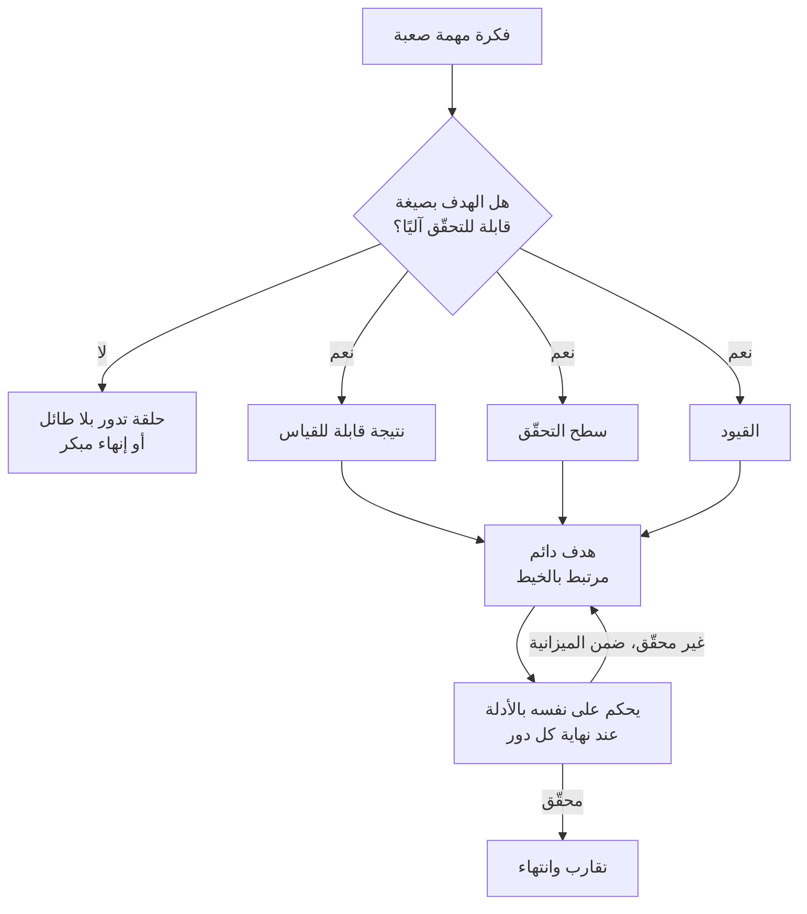

## نظرة عامة

تنتشر بين المطورين الذين يعتمدون على وكلاء البرمجة نصيحة قصيرة. حين تُسند إلى Codex هدفًا `/goal` صعبًا فعلًا، لا تطلب منه أن يبدأ العمل فورًا. اطلب منه أولًا أن "يكتب الهدف بحيث يستطيع خيط آخر تحقيقه." للوهلة الأولى يبدو الأمر لعبًا بالكلمات. ما الفرق بين أن تطلب من النموذج كتابة الهدف وبين أن تطلب منه تحقيقه؟

غير أن هذه النصيحة تلمس بدقة أمرًا يعرفه كل من شغّل الوكلاء لفترة. المهام الصعبة تفشل غالبًا لا لأن النموذج ضعيف، بل لأن الهدف لم يُكتب أصلًا بصيغة تستطيع الآلة الحكم عليها. يظن الناس أن جملة مثل "نظّف عملية إعادة الهيكلة هذه" هدف، لكنها بالنسبة للوكيل تترك كل شيء فارغًا: متى يتوقف، وما الذي يُعدّ نجاحًا، وأين الحدّ. لذا يفكّك هذا المقال أسلوب "اجعله يكتب الهدف" قطعة قطعة، ويبيّن كيف تفرض ThakiCloud، التي تشغّل منصة AI/ML على Kubernetes ومنصة للوكلاء، المبدأ نفسه في الشيفرة.

## ما هي أهداف Codex

أولًا، لننظر عن قرب إلى المكوّن الخام. ميزة `/goal` في Codex تربط هدفًا دائمًا بالخيط. وفقًا لكتيّب OpenAI المنشور "Using Goals in Codex"، ينبغي وصف الهدف بثلاثة أجزاء: نتيجة قابلة للقياس، وسطح تحقّق يتيح تأكيد التقدّم، وقيود. متى توفّرت هذه الثلاثة صار الهدف هدفًا دائمًا مرتبطًا بالخيط.

الآلية مهمة. في نهاية كل دور، يفحص Codex الأدلة المتراكمة حتى الآن ويحكم بنفسه هل تحقّق الهدف. إن لم يتحقّق، وكان الهدف لا يزال نشطًا وضمن الميزانية، يواصل من أحدث حالة. باختصار، بدلًا من استجابة واحدة، يكرّر الملاحظة والحكم حتى يتحقّق الهدف بوصفه شرط إنهاء. جاذبية الميزة أن مهمة طويلة الأمد يمكن أن تتحوّل إلى سير عمل من نوع "اضبطه وانسه."

النقطة الجوهرية هنا أن جودة الهدف تحسم كل شيء. إن كان سطح التحقّق ضبابيًا لم يستطع Codex تحديد متى يتوقف؛ وبلا قيود يتجاوز نطاقه ويمسّ ملفات لا صلة لها؛ وبلا نتيجة قابلة للقياس يصلح ملفًا واحدًا ثم يعلن أنه انتهى. كتابة هدف جيّد مهارة قائمة بذاتها إذًا، وحين تنقص هذه المهارة تنهار المهام الصعبة.

## الأسلوب: "اكتب هدفًا لخيط آخر"

لنعد الآن إلى النصيحة. أمام مهمة صعبة، نادرًا ما يكتب المرء هدفًا جيّدًا من المحاولة الأولى. تحديد ما هي النتيجة القابلة للقياس، وما الذي سيتحقّق من التقدّم، وأي القيود يجب وضعها، هو بحدّ ذاته مهمة تصميم غير بسيطة. ما تقترحه هذه النصيحة هو تفويض ذلك التصميم إلى النموذج أولًا.

بشكل ملموس، يجري الأمر هكذا. يُطلب من الخيط الأول أن "يكتب هدفًا يمكّن خيطًا آخر من تحقيق هذه المهمة الصعبة ذاتيًا." النموذج لا ينجز العمل هنا. بل يفهم المهمة ويُنتج مواصفة هدف تبيّن ما هو النجاح، وكيف يُتحقّق منه، وأين الحدّ. يراجع الإنسان تلك المواصفة ويشحذها، ثم يُدخلها هدفًا في خيط جديد لتشغيل التنفيذ الفعلي. ينطلق خيط التنفيذ بشرط إنهاء محدّد جيدًا، فيكون أقل عرضة بكثير للحلقات التي تدور بلا طائل أو للإنهاء المبكر الموصوفَين آنفًا.

ينجح هذا الأسلوب لسببين. الأول أنه يفصل كتابة الهدف عن تحقيق الهدف. الأمران مختلفان في طبيعتهما. كتابة الهدف تدور حول فهم المشكلة على نطاق واسع وتثبيت معايير النجاح في اللغة؛ أما تحقيق الهدف فحفرٌ ضيّق نحو تلك المعايير. حين يحاول خيط واحد القيام بالأمرين معًا، يندفع إلى التنفيذ وهو لا يزال يقرّر معايير التحقّق، وينتهي به الأمر إلى تقييم نفسه بمعايير لم يضعها أصلًا. بالفصل، يركّز كل خيط على أمر واحد.

الثاني أنه يخلق نقطة مراجعة للإنسان. مواصفة الهدف التي يُنتجها النموذج قطعةٌ يستطيع الإنسان قراءتها وتحريرها قبل التنفيذ. إن كان سطح التحقّق ضعيفًا أمكن تعزيزه في هذه المرحلة؛ وإن كان النطاق واسعًا أمكن إضافة قيود. اكتشاف خطأ بعد بدء التنفيذ باهظ الثمن؛ والتقاطه في مرحلة مواصفة الهدف رخيص. بعبارة أخرى، هذا ليس حيلة برومبت بل أداة بنيوية تُدرج طبقة واحدة من المراجعة الرخيصة.

بالطبع ليس دواءً لكل داء. أطّرت إحدى نشرات المطورين هذا النهج بأنه يحوّل "مهمة من أربع ساعات إلى سير عمل من نوع اضبطه وانسه"، لكن ذلك انطباع عن حالة ناسبته، لا ضمان. حتى لو نجحت في جعل النموذج يكتب هدفًا جيّدًا، يبقى تقارب خيط التنفيذ نحوه مسألة منفصلة. لذا لا يؤتي الأسلوب ثماره إلا مقترنًا ببوابات التحقّق المذكورة أدناه.

## دلالات على منتجات ThakiCloud

ثمة سبب لألّا يبدو هذا الأسلوب غريبًا: تفرض ThakiCloud المبدأ نفسه فعلًا، لا بوصفه طلب برومبت بل انضباطًا في الشيفرة. وبما أن الموضوع تشغيل الوكلاء، نضع هنا منظور منصّتنا للوكلاء Paxis في المركز، مع ربطه ببنية ai-platform التحتية أسفلها.

Paxis هي سحابة ThakiCloud الأصيلة للوكلاء (Agent-Native Cloud)، مستوى تحكّم يعامل المهارات والأدوات والسياسات وسجلات التدقيق كموارد من الدرجة الأولى. بداخلها مُنفّذ يُدعى Goal Mode. حين ننشئ هدفًا في Goal Mode، كتبنا القواعد بحيث لا يمكن ترك `check_cmd` و`success_criteria` والميزانية فارغة. هذه الثلاثة تقابل تقريبًا واحدًا لواحد أجزاء هدف Codex الثلاثة: `success_criteria` هي النتيجة القابلة للقياس، و`check_cmd` هو سطح التحقّق الذي يحكم على التقدّم، والميزانية هي القيد. إن أُنشئ الهدف قشرةً فارغة، فمصمَّم ليفشل عند البوابة في التكرار الأول، فتضمن الشيفرة حالة "إن لم تكتب الهدف جيدًا فلن يبدأ أصلًا."

بنية التفويض المتمثّلة في "اكتب هدفًا لخيط آخر" موجودة داخلنا أيضًا. حين يصل طلب معقّد، يفكّكه الوكيل الرئيسي إلى مهام فرعية ويفوّض كلًّا منها إلى وكيل فرعي منفصل. مَن يفكّك ومَن ينفّذ منفصلان، وهذه هي الفكرة ذاتها لفصل هذا المقال بين خيط كتابة الهدف وخيط تنفيذ الهدف. التفكيك يحتاج حكمًا، فيتولّاه نموذج من طبقة أعلى؛ والتنفيذ عمل ضيّق، فيُرسَل إلى نموذج أرخص. من هنا يأتي مبدأ العمّال رخيصون والبوابات باهظة.

وفوق ذلك كله، لا ندمج أبدًا نتائج التوزّع دون تحقّق. مهما أحسنت كتابة الهدف وتفويضه، يجب أن تحكم على صحّة النتيجة مرحلةُ تحقّق منفصلة لا المُنفِّذ. تُحكَم مخرجات الشيفرة بتشغيل الاختبارات فعليًا وقراءة رمز الخروج؛ وتُصفّى مخرجات المحتوى أو الحكم بتصويت أغلبية من عدة مدقّقين بمنظورات مختلفة. جملة يقول فيها النموذج "يبدو أن هذا انتهى" لا يمكن أن تكون شرط إنهاء الحلقة. يبيّن هذا الانضباط كيف نصلّب سلوك هدف Codex "احكم على نفسك بالأدلة عند نهاية كل دور" إلى صيغة جديرة بالثقة.

وثمة ارتباط عبر عدسة البنية التحتية أيضًا. الحلقة التي تُقطّع الأهداف بدقّة وتشغّلها مع خطوات تحقّق تستهلك موارد الحوسبة باطّراد. ai-platform هي الطبقة التي توفّر جدولة GPU على Kubernetes وKueue، وخدمة vLLM، وعزل متعدّد المستأجرين، فتبني أرضية تستطيع فوقها هذه الحلقات الوكيلة أن تعمل بثمن رخيص وموثوقية. الخدمة منخفضة التكلفة تصنع اقتصاديات الوكلاء، وفوقها تصبح أهداف Paxis المفوَّضة وحلقات التحقّق قابلة للحياة عمليًا. العدستان تكمّلان إحداهما الأخرى.

## الحدود والحجج المضادة

كي لا نبالغ في تقدير هذا الأسلوب، لنأخذ الجانب الآخر.

أولًا، خطوة كتابة الهدف نفسها قد تفشل. إن أنتج النموذج هدفًا معقولًا لكنه غير قابل للتحقّق، انطلق خيط التنفيذ وهو لا يعرف ما الذي يُعدّ نجاحًا. ثمة حالات كثيرة يكون فيها كتابة الإنسان هدفًا قصيرًا ومتينًا مباشرةً أفضل. لذا يجب أن تمرّ مواصفة الهدف التي يكتبها النموذج بنقطة مراجعة بشرية، وتسليمها مباشرة إلى التنفيذ دون مراجعة هدرٌ لنقطة المراجعة الرخيصة التي كسبتها.

ثانيًا، هذا العبء غير مبرَّر لكل مهمة. كتابة الهدف نيابةً وتقسيم الخيوط في تصحيح ملف واحد أو سؤال سريع مبالغة. لا يؤتي هذا الأسلوب ثماره إلا في المهام الصعبة حيث يكون شرط الإنهاء ضبابيًا، والتشغيل طويلًا، والتنفيذ الذاتي ذا قيمة حقيقية. قواعدنا الداخلية ترسم الخطّ ذاته: استخدم أدوات الحلقة للتنفيذ التكراري أو العمل المتقارب فقط، ولا تفرضها على تعديلات لمرة واحدة.

ثالثًا، كلما طال التنفيذ الذاتي مال الناس أكثر إلى الثقة بالنتيجة والتوقّف عن المراجعة. راحة أنك فوّضت الهدف جيدًا هي الخطر نفسه. إن لم يُصفِّ المدقّق شيئًا، فليس ذلك إشارة إلى أن كل شيء نجح بل الأرجح إشارة إلى أن المدقّق معطّل. لذا يجب أن يفحص إنسان المخرجات الجوهرية بأخذ عيّنات دوريًا، وأن يُصمَّم المدقّقون ليصوّبوا نحو الدحض لا التأكيد.

خلاصة القول، "في المهام الصعبة، اكتب الهدف أولًا" ليست براعة برومبت بل نصيحة بنيوية بفصل كتابة الهدف عن تنفيذه، وإدراج نقطة مراجعة بينهما. إن كانت ميزة الهدف في Codex وضعت هذا في أيدي المطورين الأفراد، فإن ThakiCloud تفرض المبدأ نفسه على مستوى الفريق عبر Goal Mode في Paxis وحلقات التحقّق. أن تكون كتابة هدف جيّد هي معنى إدارة الوكيل جيّدًا لا يتغيّر مهما كانت الأداة.

## المصادر

- OpenAI Cookbook, "Using Goals in Codex" (developers.openai.com/cookbook/examples/codex/using_goals_in_codex)
- التغريدة الأصلية: nickbaumann_ (أُعيد نشرها في x.com/hjguyhan/status/2077331299648635303)
