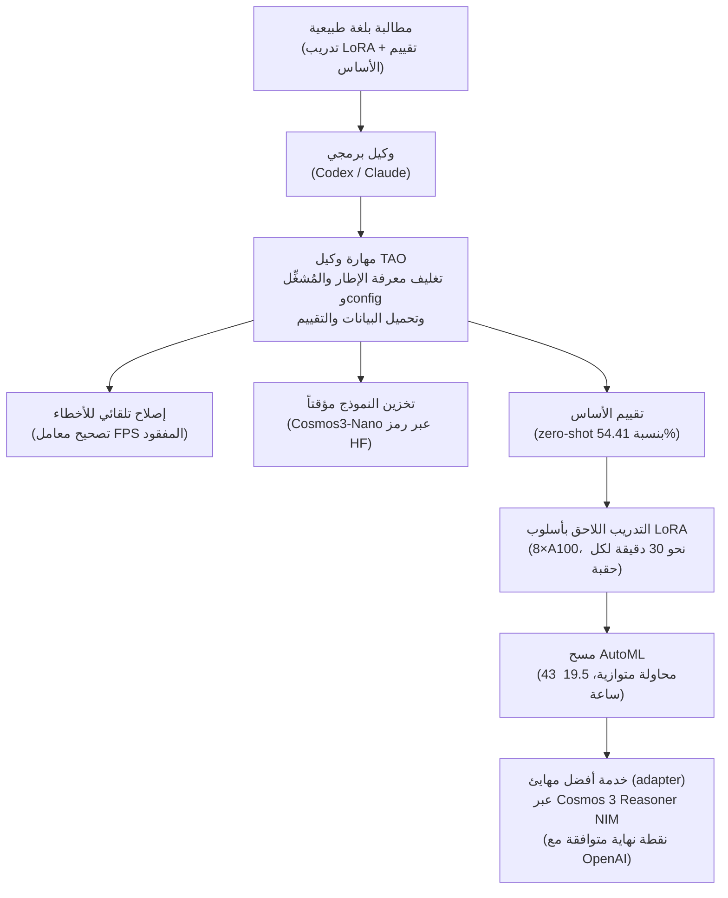

في الأسبوع الماضي توصلنا، في تجربة توليد واجهات نظام التصميم، إلى استنتاج مفاده أن "البوابة يجب
أن تُبنى قبل النموذج". حالة التدريب اللاحق لنموذج Cosmos 3 التي كشفت عنها NVIDIA هذه المرة هي
النصف الآخر من تلك القصة. هنا، بدلاً من أن يبني الإنسان البوابة بيده، تُسلَّم معرفة مغلفة تسمى
**مهارة الوكيل (Agent Skill)** إلى وكيل برمجي، فيتولى هذا الوكيل بنفسه قيادة الضبط الدقيق
والتقييم والبحث عن المعاملات الفائقة. الجمهور المقصود هنا هو مهندسو التعلم الآلي والمنصات الذين
يريدون إجراء تدريب لاحق لنموذج أساسي على بنيتهم التحتية الخاصة. وبإيجاز الخلاصة منذ البداية:
البطل الحقيقي في هذه الحالة ليس النموذج ولا وحدات GPU، بل **الحاضنة (harness) التي تُجمّد معرفة
سير العمل في شكل مهارة يكررها الوكيل تلقائياً**.


*تقود مهارات الوكيل العمل المتكرر في تدريب GPU وتقييمه وضبطه. أما الإنسان فيقدّم الهدف فقط عبر مطالبة.*

## ما هو Cosmos 3، وما هي مهارات الوكيل (TAO Agent Skills)؟

Cosmos 3 هو نموذج أساسي طورته NVIDIA للتعامل مع العالم الفيزيائي. يستخدم بنية
Mixture-of-Transformers التي تجمع النص والصورة والفيديو والصوت المحيط وتتبع الحركة في كيان
واحد، ويضم برجاً استدلالياً ذاتي الانحدار (autoregressive) مسؤولاً عن المنطق والتخطيط إلى جانب
محول انتشار (diffusion transformer) يتنبأ بالحالات المستقبلية. أعلنت NVIDIA أن هذا النموذج
يتصدر عدة معايير قياسية منها VANTAGE-Bench وPAI-Bench وPhysics-IQ وRoboLab وRoboArena. يأتي
النموذج بحجمين هما Cosmos 3 Super بسعة 64B وCosmos 3 Nano بسعة 16B، وتستخدم هذه الحالة نسخة
Nano.

لكن الجوهر ليس النموذج بل **مهارة وكيل TAO (TAO Agent Skill)** المرفقة به. مهارة وكيل TAO هي
حزمة معرفة تُؤتمت سير عمل التدريب اللاحق لنماذج الرؤية. فهي تغلف معرفة خاصة بالمهمة مثل تفاصيل
الإطار البرمجي، وسلوك المُشغِّل (launcher)، وبنية ملفات الإعداد (config)، وطريقة تحميل البيانات،
وسير عمل التقييم، بحيث يستطيع وكيل برمجي مثل Codex أو Claude أن ينسق خط أنابيب التدريب بنفسه
بأقل قدر ممكن من تدخل الإنسان. بعبارة أخرى، المهارة ليست سطر مطالبة واحداً، بل وحدة قابلة لإعادة
الاستخدام تغلف إجراءً قابلاً للتنفيذ إلى جانب آليات التعافي من الفشل.

## المطالبتان الاثنتان اللتان تنهيان التدريب اللاحق

سبب لفت هذه الحالة للانتباه هو أن كل ما أدخله الإنسان كان مطالبتين بلغة طبيعية لا أكثر.

المطالبة الأولى توجه بإجراء تدريب لاحق بأسلوب LoRA. وهي طلب لتدريب `nvidia/Cosmos3-Nano` بأسلوب
LoRA على مجموعة بيانات Woven Traffic Safety الخاصة بشركة Toyota، مع إجراء تقييم أساسي (baseline)
أولاً لأغراض المقارنة.

```
Perform LoRA post-training of the Cosmos 3 model on the Woven Traffic
Safety dataset. Training data: /home/.../WTS_dataset/wts_data_train
Validation data: /home/.../WTS_dataset/wts_data_val
Base model on Hugging Face: nvidia/Cosmos3-Nano
Also perform a baseline evaluation first, to compare with the post-trained model.
```

بمطالبة واحدة فقط، عالج الوكيل عدة مهام بالتتابع: اكتشف بنفسه معامل FPS المفقود في خط أنابيب
البيانات وأصلح الخطأ، ثم خزّن النموذج مؤقتاً باستخدام رمز Hugging Face، وقاس دقة الأساس بأسلوب
zero-shot قبل التدريب فسجّلت 54.41%، ثم شغّل تدريب LoRA. النقطة الجديرة بالملاحظة هنا هي التوجيه
القائل "أجرِ تقييم الأساس أولاً". فبدلاً من الثقة بنتيجة يبلغ عنها النموذج بنفسه بعد التدريب، جرى
تثبيت رقم ما قبل التدريب كخط أساس للقياس، وقيس التحسن فعلياً. هذا المبدأ مطابق تماماً للدرس الذي
استخلصناه من تجربتنا في الأسبوع الماضي.

المطالبة الثانية هي عملية مسح AutoML. وهي طلب لترك استراتيجية البحث وتحديد المعاملات الفائقة
الواجب ضبطها لـ TAO، مع تحسين دقة التحقق (validation accuracy) ثم تلخيص أفضل النماذج.

```
Run an AutoML sweep to improve the LoRA result. Let TAO choose suitable
search strategies and tune the important training hyperparameters. Optimize
validation accuracy and summarize the best models.
```

عند رسم سير العمل بأكمله كمخطط، يظهر الإنسان عند الطرفين فقط، بينما تملأ المهارة العمل المتكرر
في المنتصف.



تحضير البيئة يتطلب ثلاثة رموز (tokens) وسطراً واحداً من نص التثبيت. تُدخل `HUGGINGFACE_TOKEN`
و`NGC_API_KEY` و`AUTOML_LLM_API_KEY` في الطرفية، ثم تُثبَّت مهارة الوكيل بالنص البرمجي أدناه.

```bash
export HUGGINGFACE_TOKEN="your_hf_token"
export NGC_API_KEY="your_ngc_key"
export AUTOML_LLM_API_KEY="your_llm_key"

curl -fsSL https://raw.githubusercontent.com/NVIDIA-TAO/tao-skills-bank/main/scripts/install-codex-agents.sh | bash
```

بيانات التدريب هي مجموعة بيانات Woven Traffic Safety الخاصة بشركة Toyota، وهي مهمة أسئلة وأجوبة
على مقاطع فيديو تضم أكثر من 8,000 عينة تدريب وتحقق. تتألف من أسئلة اختيار من متعدد (أربعة خيارات)
تتناول بنية الطرق وأنواعها وحالات السلامة المرورية.

## الأرقام التي أنتجتها المطالبتان

ارتفع الأداء بوضوح. جميع الأرقام أدناه هي قيم أعلنتها NVIDIA، وليست نتائج أعدنا إنتاجها بأنفسنا.


*ارتفعت دقة التحقق من 54.41% إلى 93.35% بمطالبتين فقط. أرقام معلنة من NVIDIA.*

بلغ الأساس بأسلوب zero-shot نسبة 54.41%، ورفعته مطالبة LoRA الواحدة إلى 87.14%، أي بزيادة قدرها
32.73 نقطة. وفوق ذلك، ضبط مسح AutoML المعاملات الفائقة عبر التحسين البايزي (Bayesian
optimization) ليصل إلى 93.35%، بزيادة قدرها 38.94 نقطة عن الأساس. والنقطة الجوهرية هنا أن هذه
الأرقام تحققت دون أن يلمس إنسان المعاملات الفائقة بيده، بل باختيار الوكيل لاستراتيجية البحث
وتشغيله التدريب بشكل متكرر.

من الأمانة النظر أيضاً إلى أرقام التكلفة. استغرق تدريب LoRA نحو 30 دقيقة لكل حقبة (epoch) على 8
وحدات A100 80GB، بينما استغرق مسح AutoML، الذي شغّل 43 محاولة متوازية عبر عدة عُقد A100، مدة 19.5
ساعة. أما التدريب الدقيق الكامل المعاملات (full-parameter SFT) الذي شُغِّل كمجموعة مقارنة فقد
استغرق 3 ساعات و34 دقيقة على H100، وأعلنت NVIDIA أن LoRA خفّض زمن استخدام GPU إلى نحو سُبع الزمن
مقارنة بهذا التدريب الكامل. وبعد انتهاء التدريب، تتولى Cosmos 3 Reasoner NIM خدمة مهايئ LoRA عبر
نقطة نهاية متوافقة مع OpenAI، ضمن بنية تُنشر مباشرة كخدمة مصغّرة (microservice) مبنية مسبقاً، دون
الحاجة إلى ضبط تبعيات vLLM أو إعدادات CUDA يدوياً.

## هل جربنا هذا بأنفسنا؟

بصراحة، لم نتمكن من إعادة إنتاج سير العمل هذا في بيئتنا. أوزان عائلة Cosmos 3 محفوظة في مستودع
Hugging Face مُقيَّد بالوصول (gated)، وتحتاج العملية إلى 8 وحدات A100 ومفاتيح NGC وAutoML LLM،
كما أن المسح المتوازي المستخدم في هذه الحالة يفترض وجود عدة عُقد GPU. لم نؤمّن مجموعة الموارد هذه
لأجل هذا المقال. لذلك فإن جميع الأرقام أعلاه مقتبسة من قيم أعلنتها NVIDIA، ولا نقدمها كما لو كانت
نتائج قسناها بأنفسنا. نلتزم بمبدأ عدم إنشاء معايير قياسية دون إعادة إنتاج فعلية. ما يمكننا فعله
بدلاً من ذلك هو تشريح بنية هذه الحالة، ومقارنتها بدقة بما يعمل بالفعل على منصتنا، لتحديد أوجه
التشابه والاختلاف.

## الدلالات على منتجات ThakiCloud

هذه الحالة موضوع نادر تتقاطع فيه وجهتا نظر منتجَينا معاً.

**من زاوية Paxis، هذه الحالة تحقق خارجي لأطروحتنا القائلة بأن المهارات يجب أن تُعامل كموارد من
الدرجة الأولى.** Paxis هو مستوى التحكم الخاص بـ ThakiCloud للسحابة الأصيلة الوكيلة (Agent-Native
Cloud)، ويعامل Skills وTools وPolicies وAudit Logs كموارد من الدرجة الأولى. يختار Skill Harness
من بين أكثر من 960 مهارة باستخدام BM25 وينفذها في صندوق رملي معزول، ويمرر كل سلوك عبر بوابات
السياسات (policy gates) وسجلات التدقيق. ما أثبتته مهارة وكيل TAO التابعة لـ NVIDIA هو أن وجود
مهارة تغلف تفاصيل الإطار البرمجي وحتى آليات التعافي من الفشل يجعل الوكيل البرمجي يكرر سير عمل
معقداً بثبات. وهذا يطابق تماماً التوجه الذي اعتمدناه في تعريف المهارة بوصفها وحدة تنفيذ لا مجرد
مطالبة. غير أن الفرق واضح أيضاً: مهارات TAO مرتبطة بشدة بمنظومة NVIDIA، بحيث يصعب استخدامها كما
هي خارج مُشغِّل TAO ونماذج Cosmos وNGC وNIM. أما حاضنة مهارات Paxis فتستهدف عدم الارتباط بمزود
أو نموذج بعينه، وهذه النقطة هي جوهر القيمة التي نريد تقديمها في البيئات المحلية (on-premises)
والبيئات السيادية.

**ومن زاوية ai-platform، هذه الحالة هي بعينها تدريب وخدمة GPU الذي نجدوله يومياً.** إرسال 43
محاولة AutoML متوازية عبر عدة عُقد يتطابق مباشرة مع طريقة إدارة Kueue لطوابير GPU في منصتنا.
وخدمة مهايئ LoRA عبر نقطة نهاية متوافقة مع OpenAI بواسطة NIM تحل المشكلة ذاتها التي نحلها عبر
مسار الخدمة القائم على vLLM. كما أن كون LoRA يقلل زمن استخدام GPU بشكل كبير مقارنة بالتدريب
الكامل SFT يدعم أطروحتنا القائلة بأن الخدمة منخفضة التكلفة والتدريب منخفض التكلفة يصنعان في
النهاية جدوى اقتصادية للوكيل. عندما يريد عميل إجراء تدريب لاحق لنموذج أساسي على بياناته الخاصة،
فإننا نوفر له مساراً يقسّم GPU عبر Kueue ويخدم المهايئ عبر vLLM فوق عنقوده (cluster) الخاص، بدلاً
من سحابة خارجية مقيدة الوصول.

بجمع الزاويتين معاً تكتمل الصورة. تسند ai-platform التدريب والخدمة منخفضي التكلفة، وفوقهما يقود
Paxis الوكيل بالمهارات والسياسات والتدقيق. وحالة NVIDIA أظهرت، عبر معيار قياس لجهة أخرى، أن هذا
التركيب يؤدي فعلاً إلى تحسن حقيقي في الأداء.

## الحدود والاعتراضات

لتجنب المبالغة في تقدير هذه الحالة، ينبغي النظر في أربع نقاط معاً. أولاً، عبارة "في يوم واحد"
مقياسها الزمن الفعلي (wall clock) لا زمن GPU. فمسح استغرق 19.5 ساعة عبر 8 وحدات A100 وعدة عُقد
ليس رخيصاً بأي حال، والنسبة "سُبع الزمن" قيمة نسبية مقارنة بالتدريب الكامل SFT، لا تعني رخصاً
مطلقاً. ثانياً، نسبة 93.35% رقم يخص مهمة ضيقة هي أسئلة وأجوبة فيديو للسلامة المرورية من نوع
الاختيار من أربعة بدائل، ولا ينبغي تعميمها على أنها ارتفاع مماثل في القدرة العامة على الاستدلال
الفيزيائي. ثالثاً، الأتمتة تُخفي التبعية للمزود. السبب في قدرة الوكيل على إصلاح الخطأ "بنفسه" هو
أن بنك المهارات كان يعرف مسبقاً نمط الخطأ الخاص بذلك الإطار البرمجي بالضبط، وهذه السلاسة تختفي
بمجرد الخروج من تلك المنظومة. رابعاً، "الحد الأدنى من التدخل" لا يعني تدخلاً معدوماً. فلا تبدأ
العملية إلا بعد أن يُدخل الإنسان مفاتيح API، ويحدد مسارات مجموعة البيانات، ويثبت أصلاً بنك
المهارات المناسب لتلك المهمة. ما ألغاه الوكيل هو العمل المتكرر، لا الحكم البشري نفسه.

ومع ذلك فإن الاتجاه واضح. إن تجميد معرفة سير العمل في هيئة مهارة، وتكرار الوكيل تنفيذها، والتحقق
من التحسن عبر بوابة قياس فعلية لا عبر تقرير ذاتي من النموذج، ليست استراتيجية خاصة بمزود واحد، بل
تصميم مشترك لعصر الوكلاء. وهذا بالضبط ما نسعى إلى بنائه عبر Paxis وai-platform.

## المصادر

- NVIDIA Developer Blog, "Post-Train NVIDIA Cosmos 3 in One Day Using Agent Skills" (<https://developer.nvidia.com/blog/post-train-nvidia-cosmos-3-in-one-day-using-agent-skills/>)
- GitHub: NVIDIA/cosmos, NVIDIA-TAO/tao-skill-bank
- Hugging Face: nvidia/Cosmos3-Nano, nvidia/Cosmos3-Super
- مجموعة البيانات: Woven Traffic Safety (WTS)، Toyota
