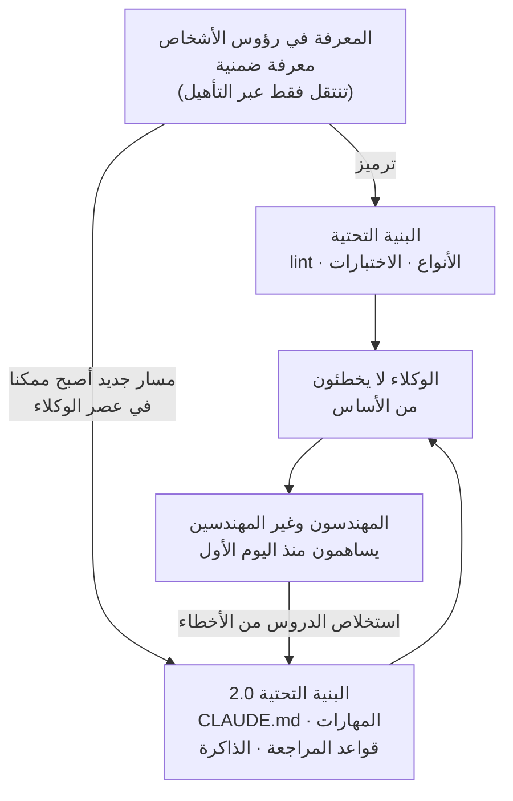

## نظرة عامة

شارك Boris Cherny، الذي بنى Claude Code في Anthropic، فكرة تستحق التوقف عندها. خلاصة رأيه بسيطة. أفضل المهندسين قضوا دائما جزءا كبيرا من وقتهم في أتمتة عملهم الخاص: ماكرو محرر أفضل، قواعد lint تلتقط الأخطاء المتكررة، ومجموعات اختبارات e2e تلغي الحاجة إلى اختبار يدوي سريع. كانت هذه الأتمتة أعلى نشاط ذي قيمة لأنها ضاعفت الإنتاجية.

يذهب رأيه خطوة أبعد. في عصر الوكلاء، أصبحت هذه الأتمتة نفسها أكثر أهمية مما كانت عليه من قبل. يفصل هذا المقال هذه الفكرة إلى ثلاثة محاور، ثم يختتم بمراجعة صادقة لمدى ممارسة ThakiCloud لهذا المبدأ فعليا، بالاستناد إلى أرقام مستودعنا الفعلية. هذا ليس مديحا ذاتيا، بل تدقيق يتأكد مما إذا كانت البنية التحتية التي بنيناها تحمل المعرفة التخصصية فعلا، أم أنها تبدو كذلك فحسب.

## لماذا تغيرت مكانة الأتمتة

رفع ظهور الوكلاء قيمة الأتمتة لثلاثة أسباب.

أولا، تزيد أتمتة البنية التحتية وتجربة المطور من السرعة، وإذا كنت تشغل عدة وكلاء في آن واحد، يصبح كل وكيل منهم أسرع أيضا. مع تزايد الأتمتة يزداد الناتج لكل وحدة زمن، لكن الجهة المنتجة لهذا الناتج لم تعد شخصا واحدا، بل عدة وكلاء. لقد تغير حجم المضاعف نفسه.

ثانيا، نقل العمل إلى الكود يرفع الكفاءة. يستطيع الوكيل إصلاح المشكلة نفسها يدويا في كل مرة يواجهها، لكن ذلك يستهلك التوكنات وقد يفوت حالات معينة. بدلا من ذلك، بمجرد أن يكتب الوكيل قاعدة lint أو خطوة CI أو روتينا واحدا، تصبح تلك الفئة من المشكلات مؤتمتة إلى الأبد. هذا هو المعنى الحقيقي لما يسميه الناس عادة الحلقة أو loop. الأمر لا يتعلق بحل مشكلة فردية، بل بأتمتة فئة المشكلة بأكملها. وهذه ليست فكرة جديدة، فقد عمل المهندسون بهذه الطريقة منذ زمن طويل.

ثالثا، والأهم من ذلك، تجعل الأتمتة مساهمة الآخرين في قاعدة الكود أسهل. من المشاهد التي أصبحت شائعة أن يساهم مهندس في يومه الأول بفضل قدرة الوكيل على استكشاف قاعدة الكود نيابة عنه. يساهم غير المهندسين بفعالية لا تقل عن فعالية المهندسين. ما كان يعيق هاتين الفئتين لم يكن أبدا نقصا في الأتمتة، بل كان المعرفة التخصصية الموجودة فقط في رؤوس الأشخاص، تلك المعرفة الضمنية التي كان يجب تعلمها أثناء التأهيل.

## ماذا يعني ترميز المعرفة التخصصية كبنية تحتية

هذا هو جوهر التحول الذي أحدثه الوكلاء. المعرفة التخصصية التي يمكن ترميزها في البنية التحتية لم تعد مقتصرة على ما يمكن التعبير عنه بقواعد lint والأنواع types والاختبارات.

في الماضي، لم يكن بالإمكان تثبيت سوى قواعد مثل هذه الدالة يجب ألا تعيد قيمة nil في الكود. أما معرفة من نوع فريقنا يتحقق دائما من هذا الإذن قبل استدعاء هذا الواجهة البرمجية، أو هذا الترحيل آمن فقط داخل نافذة النشر، أو هذه الشاشة يجب أن تتبع نمط هذه البنية المعمارية، فكانت موجودة في مستند ما، أو فقط في رأس أحد المهندسين الأقدم.

أما الآن فيمكن التقاط تقريبا كل تلك المعرفة في تعليقات الكود والمهارات وقواعد CLAUDE.md والذاكرة. إذا فتحت طلب دمج PR في قاعدة كود iOS لا أعرفها ورفضه المراجع لاستخدامه إطارا خاطئا، أو رُفضت ميزة صممها مصمم لأنها لا تتبع نمط البنية المعمارية، فهذه ليست أخطاء بشرية، بل هي فشل في الأتمتة. لو كانت تلك المعرفة مثبتة في البنية التحتية، لما أخطأ الوكيل من الأساس.

من هنا يبرز معيار للحكم. كل قاعدة، وكل جملة في مهارة، يجب أن تجتاز الاختبار التالي: هل سيخطئ الوكيل من دون هذه الجملة. الجملة التي لا تجتاز هذا الاختبار هي خسارة صافية تدفع تكلفتها في كل جلسة على شكل استهلاك للسياق. المهارة ليست مجانية، بل هي ضريبة.

السهم الأخير في هذا المخطط هو الأهم. حين يخطئ الوكيل في شيء ما، الهدف ليس إصلاحه مرة واحدة والمضي قدما، بل إعادة ترميز سبب الخطأ كقاعدة أو مهارة. عندها تختفي تلك الفئة من الأخطاء إلى الأبد. من دون حلقة التغذية الراجعة هذه، لن يستطيع النظام التحسن من تلقاء نفسه مع الوقت.

## كيف تطبق ThakiCloud هذا المبدأ فعليا

هذا هو حجم الادعاء. الآن نوجه السؤال نفسه إلى أنفسنا. هل تحمل بنية الوكلاء لدى ThakiCloud المعرفة التخصصية فعلا، أم أنها تبدو كذلك فقط. قمنا بقياس المستودع مباشرة.

يحمل مستودعنا الخلفي الموحد 52 قاعدة دائمة التحميل (`.claude/rules/`)، بإجمالي 3,536 سطرا. هذه القواعد ليست نصائح عامة عن أسلوب الكود، بل معظمها دروس مستخلصة من حوادث فعلية محددة. على سبيل المثال، نشأت قاعدة مصدر البيانات الكلية macro data source من حادثة فعلية استخدمت فيها مكتبة معينة سعر صرف أعلى بمقدار 25 وون وبإغلاق اليوم السابق، مما تسبب في تقرير خاطئ في الإحاطة الصباحية. منذ ذلك الحين، يفرض الكود استخدام مصدر موثوق ومحدد لأسعار الصرف فقط. يبدأ عدد كبير من قواعدنا الـ 52 بعنوان من نوع حادثة بتاريخ كذا، وتضم 18 قاعدة منها قسما مخصصا للأخطاء الشائعة gotchas. هذا دليل على أن حلقة تحول الفشل إلى توثيق ثم إلى قاعدة ملزمة تعمل فعلا، وليست مجرد وصف نظري.

يتجاوز عدد المهارات التي تُحمل عند الطلب، بما فيها الإضافات الخارجية، 1,800 مهارة. تحزم هذه المهارات سير عمل متكررا مثل إنشاء التقارير ومراجعة الكود وكتابة الأبحاث وخطوط أنابيب النشر بصيغة قابلة لإعادة الاستخدام. المهارة ليست مجرد موجه prompt بسيط، فهي خاضعة لإدارة الإصدارات، وتجمع في حزمة واحدة السكربتات والقوالب وحالات الفشل المعروفة، ويعاد استخدامها كسير عمل متكامل من المدخلات وحتى استعادة الأخطاء. المبدأ هو بناء القدرة في مهارات ثقيلة بدلا من غلاف رفيع.

لدينا 63 وكيلا فرعيا متخصصا حسب الدور، و13 خطافا hook يُشغَّل تلقائيا، و41 أتمتة تعمل بلا إشراف بشري (launchd) في أوقات محددة. تندرج تحت هذه الفئة الإحاطات الصباحية وملخصات الأخبار وتطور المدونة والتحسين الذاتي للمهارات. سير العمل الذي أنتج هذا المقال نفسه هو أحد هذه الأتمتة. خط الأنابيب الذي كتب الجملة التي تقرأها الآن يفرض في الكود عملية صياغة المسودة وإزالة آثار الذكاء الاصطناعي وتوحيد اللهجة والترجمة إلى ثلاث لغات قبل النشر. الصيغة النهائية ليست ارتجالا من النموذج، بل يملكها كود حتمي deterministic.

لا يقتصر وجود CLAUDE.md على مستودع واحد أعلى المستوى، بل يوجد في أكثر من 20 موقعا إذا أحصينا الوحدات الفرعية submodules والحزم الفرعية. المستودع الأمامي الموحد، وشبكة الوسيط multi cluster mesh، ومنتج مساعد الذكاء الاصطناعي، كل منها يعلن قواعده الخاصة عبر ملف CLAUDE.md خاص به. الوكيل الذي يعمل على الواجهة الخلفية backend يقرأ ملف CLAUDE.md الخاص بالواجهة الخلفية عند الحاجة، والوكيل الذي يعمل على الواجهة الأمامية frontend يقرأ ملف الواجهة الأمامية. المعرفة لا تتكدس في مكان واحد، بل توضع حيث تُحتاج، وفق بنية إفصاح تدريجي progressive disclosure.

إجمالا، القنوات الأربع للترميز التي ذكرها Boris Cherny، تعليقات الكود، المهارات، قواعد CLAUDE.md، الذاكرة، حية بالكامل في نظامنا. والدليل الأقوى على أننا نمارس هذا المبدأ فعلا وليس مجرد تقليده هو أن حلقة إعادة تغذية الفشل إلى قواعد ليست زخرفا شكليا، بل تعمل فعلا بمواد من حوادث حقيقية.

## ما ينقص بعد، والرأي المضاد

من باب الإنصاف، ننظر إلى الجانب الآخر أيضا. هذا النهج ليس خيرا مطلقا بلا شوائب.

أولا، البنية التحتية نفسها تكلفة. 3,500 سطر من القواعد دائمة التحميل تستهلك توكنات في كل جلسة. كلما ازدادت القواعد، تضخم السياق وتراجع مكان الكود المهم فعليا. لهذا نحذف أي قاعدة لا تجتاز اختبار هل سيخطئ الوكيل من دونها، ونخفض المعرفة غير الضرورية دائما من قاعدة إلى مهارة تُحمل عند الطلب. الترميز ليس شيئا يُزاد بلا حدود، بل موضوع يحتاج حمية مستمرة.

ثانيا، المعرفة المرمزة تشيخ مع الوقت. القاعدة التي نشأت من حادثة قبل ستة أشهر قد تستند إلى فرضية لم تعد صحيحة اليوم. فعليا، كانت إحدى قواعدنا منعا مطلقا لما يسمى averaging down، مستندة إلى قصة قديمة عن تداول سهم مضاربي صغير، ولم تعد متوافقة مع سياق محفظتنا الحالية، فحُذفت واستُبدلت بمبدأ آخر. تحتاج البنية التحتية إلى التقليم بقدر ما تحتاج إلى الزرع.

ثالثا، تشكل 1,800 مهارة ضجيجا في حد ذاتها. كلما زاد عدد المرشحين، ازداد خطر اختيار المهارة الخاطئة. تحميل مهارة لمجرد تطابق جزئي في الاسم يخفض الدقة. لهذا نضيق دائرة المرشحين عبر التوجيه القائم على البحث retrieval based routing وقاعدة صريحة تمنع التطابق القسري. حجم الترميز ليس مرادفا للجودة، وهذا شيء يجب مراقبته باستمرار.

هذه الحدود لا تنفي المبدأ نفسه، بل تظهر أن ممارسته بشكل صحيح تتطلب التعامل مع الترميز والتنظيف بالوزن نفسه من الأهمية.

## خاتمة

خلاصة Boris Cherny متواضعة. يجب على كل فريق كتابة ملفات CLAUDE.md وقواعد المراجعة والمهارات والتوثيق التي تتيح للوكيل العمل بإنتاجية داخل قاعدة الكود من دون أي سياق إضافي. قد يبدو ذلك مطلبا غريبا، لكنه في الوقت نفسه امتداد طبيعي لما اعتاد المهندسون فعله دائما: الأتمتة، وترميز المعرفة التخصصية كبنية تحتية.

كلما ازدادت ذكاء النماذج ونضج الأغلفة harness، يصبح هذا العمل أسهل. وفي الوقت نفسه، المهمة الواضحة أمام كل فريق هي نقل المعرفة التخصصية المبعثرة في الرؤوس والمستندات إلى بنية تحتية يستطيع الوكيل قراءتها واتباعها. حين يتحقق ذلك، يكتب Claude كودا أفضل، وتلتقط مراجعة الكود المشكلات تلقائيا، ويستطيع الشخص التالي الذي يعمل على قاعدة الكود هذه المساهمة بسهولة أكبر. تبني ThakiCloud منصتها، وأتمتة تشغيلها، على هذا المبدأ.

## المصدر

- Boris Cherny، "الأتمتة وبنية المعرفة التخصصية التحتية"، X (تويتر سابقا)، [الرابط الأصلي](https://x.com/bcherny/status/2077460395279692197)
