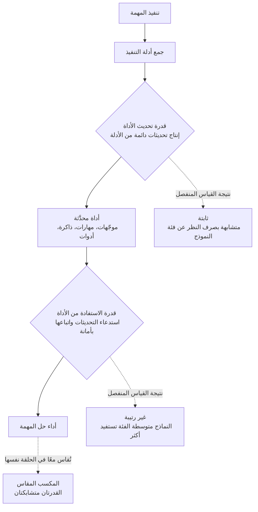

كل من شغّل وكلاء ذكاء اصطناعي لفترة طويلة رأى على الأرجح رسمًا بيانيًا كهذا: وكيل يعدّل موجّهاته ومهاراته وذاكرته باستمرار، ودرجة الأداء على معيار القياس ترتفع، فيخلص الفريق إلى أن "الأداة ذاتية التطور تعمل". لكن دراسة نُشرت مؤخرًا تشير إلى أن جزءًا كبيرًا من ذلك الرسم البياني قد يكون وهمًا. فحتى الآن، لم تكن طرق التقييم قادرة على التمييز بين ما إذا كان الارتفاع في الدرجة ناتجًا فعلًا عن أداة أفضل، أو ببساطة عن نموذج كان أصلًا جيدًا في اتباع التعليمات. هذا المقال موجّه إلى مهندسي التعلم الآلي والمنصات الذين يشغّلون وكلاء ويطوّرون مكتبات المهارات والأدوات في بيئة إنتاجية. والخلاصة مقدَّمًا: رد الفعل المعتاد بقول "لنرفع فئة النموذج" كلما تعثّر الأداء، يتبيّن أنه صحيح بنصفه فقط في ضوء بيانات هذه الدراسة.

## نظرة عامة

عنوان الورقة البحثية هو "Harness Updating Is Not Harness Benefit"، أي أن تحديث الأداة والاستفادة منها أمران مختلفان. معظم الأنظمة التي تتعامل مع الوكلاء ذاتية التطور قاست هذين الأمرين ككتلة واحدة. يحل الوكيل مهمة، ثم يستخرج من سجل التنفيذ تعديلات على الموجّهات أو المهارات، ثم يُعاد تشغيل المهمة التالية بالأداة المعدَّلة، وإذا ارتفعت الدرجة النهائية، يُعلَن أن "التطور نجح".

المشكلة أن هذا الحكم يخلط بين قدرتين مختلفتين تمامًا: القدرة على إنتاج تحديث دائم ومفيد من أدلة التنفيذ، والقدرة على استخدام تلك الأداة المحدَّثة فعليًا عند حل المهمة. القدرتان تعيشان داخل النموذج نفسه، لكن طبيعتهما مختلفة تمامًا. ولأن التقييمات السابقة قاست القدرتين **معًا داخل حلقة التنفيذ نفسها**، لم يكن ممكنًا من النظر إلى الدرجة النهائية وحدها معرفة مصدر التحسّن. يقترح المؤلفون تصميمًا تجريبيًا يفكّ هذا التشابك، وتأتي نتيجته معاكسة تمامًا للحدس السائد في هذا المجال.

## ما الذي تسأله هذه الدراسة

بدايةً، لنوضّح المصطلحات. **الأداة (harness)** هنا تشير إلى كل المكوّنات الخارجية القابلة للتعديل التي تشكّل سلوك الوكيل دون المساس بمعاملات النموذج نفسه. الموجّهات والمهارات والذاكرة وتعريفات الأدوات كلها جزء من الأداة. والتطور الذاتي هو العملية التي يراجع فيها الوكيل نتائج تنفيذه الخاصة ويعدّل هذه الأداة بنفسه. يبقى النموذج ثابتًا، ويتغيّر فقط ما يحيط به من معرفة وأدوات.

تقسّم الدراسة عملية التطور هذه إلى قدرتين.

الأولى هي **قدرة تحديث الأداة (harness-updating)**: القدرة على النظر إلى أدلة مهمة منجَزة وإنتاج تحديث دائم وقابل لإعادة الاستخدام. استخلاص درس من حالة فاشلة وتدوينه في وثيقة مهارة، أو ملاحظة نمط متكرر وترسيخه كقاعدة في الموجّه، كلاهما يندرج تحت هذه الفئة.

الثانية هي **قدرة الاستفادة من الأداة (harness-benefit)**: القدرة، عند توفّر أداة محدَّثة، على استدعائها فعليًا واتباعها لرفع أداء المهمة. مهارة جيدة تجلس دون استخدام في المكتبة، أو مهارة يتم استدعاؤها لكن لا تُتَّبع تعليماتها حتى النهاية، كلتاهما تنتج استفادة تساوي صفرًا.

الفكرة الجوهرية هي أن هاتين القدرتين يجب **قياسهما بشكل منفصل**. إذا قرنّا النموذج الذي أنتج التحديث بنموذج آخر يستخدم ذلك التحديث، يمكننا معرفة ما إذا كان التحسّن جاء من جودة التحديث أم من جودة استخدامه. المخطط أدناه يوضّح بنية هذا التشابك ونقطة الفصل بينهما.

## ما الذي يكشفه فصل القدرتين

تتلخّص نتيجة التجربة المنفصلة في جملتين، وكلتاهما تخالف الحدس العملي.

أولًا، **قدرة تحديث الأداة ثابتة تقريبًا بصرف النظر عن فئة النموذج**. التحديثات التي أنتجتها نماذج من فئات قدرة مختلفة جدًا أعطت مكاسب متقاربة بشكل مفاجئ. وبتعبير المؤلفين أنفسهم، فإن التحديثات التي أنتجها نموذج صغير بحجم 9B ضاهت المكاسب التي حققتها تحديثات من أقوى النماذج المتقدمة. بعبارة أخرى، "من كتب المهارة" لم يؤثر تقريبًا في جودة التحديث. يتبيّن أن استخلاص قاعدة وترسيخها في وثيقة عمل معرفي أرخص مما كان متوقّعًا.

ثانيًا، **قدرة الاستفادة من الأداة غير رتيبة عبر الفئات**. عند إعطاء النموذج الأداة المحدَّثة نفسها، لم تستفد النماذج الضعيفة تقريبًا، واستفادت النماذج متوسطة الفئة أكثر من غيرها، بينما استفادت النماذج الأعلى فئة أقل مما استفادت النماذج المتوسطة. فبدلًا من منحنى يستمر بالارتفاع كلما صعدنا في الفئة، حصلنا على منحنى ينتفخ في المنتصف.

حين نُركّب هاتين النتيجتين تنقلب الصورة. وضع نموذج متقدم باهظ التكلفة في دور **المطوِّر الذي ينتج التحديثات** داخل نظام ذاتي التطور يقترب من إهدار الميزانية، لأن جودة التحديث ثابتة على أي حال. في المقابل، وضع نموذج باهظ التكلفة في دور **الوكيل الذي يحل المهمة فعليًا** ليس بالضرورة الخيار الأمثل أيضًا، لأن الاستفادة غير رتيبة. النموذج القوي غالبًا ما تكون له عاداته الراسخة، وينزع إلى اتباع تعليمات أداة خارجية بدرجة أقل.

## لماذا لا تستفيد النماذج الضعيفة

أكثر جزء عملي في الورقة هو تحليل سبب عدم استفادة النماذج ضعيفة الفئة. يشير المؤلفون إلى نمطين من الفشل.

الأول هو **فشل التفعيل**. حتى حين تكون هناك مهارة مناسبة تمامًا في المكتبة، يفشل النموذج في استرجاعها. الحكم اللازم لربط عنصر ملائم من الأداة بالموقف الحالي لا يحدث ببساطة. المهارة موجودة، لكنها تُفقَد في مرحلة الاسترجاع والاختيار، فلا تفيد كل التحديثات المتراكمة مهما كانت جيدة.

الثاني هو **التنفيذ غير الأمين**. ينجح النموذج في استرجاع المهارة، لكنه يفشل في اتباع تعليماتها متعددة الخطوات حتى النهاية. حين تكون القدرة على الاحتفاظ بسلسلة طويلة من التعليمات ضعيفة، تنحرف أداة جيدة إلى تنفيذ جزئي ومشوَّه في منتصف الطريق.

هذا التشخيص يقود إلى وصفة واضحة. لرفع أداء التطور الذاتي، لا ترفع ذكاء المطوِّر، بل استهدف **استدعاء الأداة (التفعيل) والتنفيذ الأمين للتعليمات الطويلة**. ميزانية القدرة تُثمر أكثر حين تُنفَق على جانب استخدام التحديثات، وتحديدًا على هاتين العقبتين، بدلًا من جانب إنتاجها.

## دلالات على منتجات ThakiCloud

خلاصة هذه الدراسة تتطابق تمامًا مع الانضباط الذي بنيناه في تشغيل Paxis. Paxis هو Agent-Native Cloud من ThakiCloud، ويعامل المهارات والأدوات والسياسات كموارد من الدرجة الأولى. نختار من أكثر من 960 مهارة باستخدام BM25 وننفّذها في بيئات معزولة (sandboxes)، وحلقة التطور الذاتي للمهارات لدينا تستخلص الدروس من الإخفاقات وتعدّل وثائق المهارات. بعبارة أخرى، نحن نُشغّل بالفعل حلقة "تحديث الأداة" كل يوم.

الدرس الأول الذي تقدّمه هذه الدراسة هو: **لا تُلحق نموذجًا باهظ التكلفة بدور المطوِّر**. حلقة التطور الليلية التي تحسّن المهارات وتسجّل المراجعات يمكن أن تعمل على فئة منخفضة التكلفة، انطلاقًا من فرضية أن جودة التحديث ثابتة. والواقع أن سياسة نماذج المهارات لدينا تبدأ مراحل التطور والتنسيق افتراضيًا بنموذج sonnet، وتثبّت نموذجًا أعلى فئة فقط لمجموعة صغيرة من المهارات التي تكون فيها جودة المحتوى نفسها هي الناتج. تمنحنا هذه الدراسة أساسًا مبنيًا على الأدلة لهذا الخيار: لقد كان **تحسينًا دون فقدان الجودة**، لا مجرد توفير في التكلفة.

الدرس الثاني هو التشخيص القائل بأن العقبة تكمن في "التفعيل والتنفيذ". في بيئتنا، هذا هو بالضبط مشكلة **توجيه المهارات والامتثال للبوابات**. مهما كثر عدد المهارات، إذا لم تُسترجَع المهارة الصحيحة عند وقت الطلب فذلك فشل تفعيل، وإذا استُدعيت مهارة لكن لم تُحترَم بوّاباتها الحتمية فذلك تنفيذ غير أمين. قرار Paxis بتعزيز استرجاع المهارات عبر موجّه BM25، وجعل التنسيق والتحقق مملوكَين لبوّابات كودية بدلًا من حكم النموذج النثري، يستهدف بالضبط هاتين العقبتين. الأداء لا يُحدَّد بمجرد تكديس مهارات جيدة أكثر، بل بالبنية التي تسترجع المهارة الصحيحة بدقة وتفرض تعليماتها حتى النهاية.

هناك أيضًا دلالة على مستوى البنية التحتية. تُشغّل ai-platform عدة فئات من النماذج فوق K8s وKueue. تشير هذه الدراسة إلى أنه من المنطقي، عند نشر خط أنابيب ذاتي التطور، وضع **فئات نماذج مختلفة في أدوار مختلفة** للمطوِّر وحلّ المهمة. النشر المختلط، نموذج رخيص كمطوِّر ونموذج متوسط الفئة كحلّال للمهمة، تصميم يمكنه توفير تكلفة كبيرة في جدولة GPU متعددة المستأجرين مع الحفاظ على الجودة.

## حدود الدراسة وحجج مضادة

قبل نقل هذه الدراسة مباشرة إلى الممارسة، تستحق بضع تحفّظات الذكر.

أولًا، استنتاجا "الثبات" و"عدم الرتابة" مرتبطان بتوزيع المهام وأنواع الأدوات التي غطّتها التجارب. عمل استخلاص القواعد مثل تعديل وثائق المهارات قد يُظهر قدرة تحديث ثابتة، لكن التحديثات التي تتضمن تنفيذ أدوات معقّدة أو توليد كود تنسيق طويل قد تعيد فتح الفجوة بين فئات النماذج. أما إلى أي الجانبين تميل تحديثاتنا نحن، فذلك أمر يجب على كل فريق قياسه بنفسه.

ثانيًا، يمكن أيضًا تفسير أن النماذج الأعلى فئة تستفيد أقل من أداة خارجية على أنه أثر سقف: النموذج القوي جيد أصلًا، فلا يبقى له مجال كبير للتحسّن. هذا لا يعني أن الأداة عديمة الفائدة. فالأداء المطلق قد يظل أعلى لنموذج قوي، والأداة ليست سوى مكسب هامشي يُضاف فوقه.

ثالثًا، بالنسبة لمنظمة مثلنا تمارس بالفعل مبدأ "طوِّر بتكلفة منخفضة، وضع البوابات بتكلفة عالية"، تبدو هذه الدراسة أقرب إلى سند كمي لانضباط قائم بالفعل منها إلى توجّه جديد. أما بالنسبة لفريق كان يرفع فئة نموذج المطوِّر بشكل انعكاسي كلما تعثّر أداء التطور الذاتي، فهذه البيانات إشارة واضحة لإعادة توزيع الميزانية.

في النهاية، تترك لنا هذه الدراسة قاعدة عملية واحدة. لا تنظر إلى أداء الأداة ذاتية التطور كدرجة واحدة. **حلّله إلى محورين، التحديث والاستفادة، وقِس كلًا منهما على حدة**. فقط عند الفصل بينهما يتضح أين ينبغي أن تذهب ميزانية القدرة فعليًا.

## المصادر

- Harness Updating Is Not Harness Benefit: Disentangling Evolution Capabilities in Self-Evolving LLM Agents، arXiv 2605.30621: [arxiv.org/abs/2605.30621](https://arxiv.org/abs/2605.30621)
- صفحة Hugging Face Papers: [huggingface.co/papers/2605.30621](https://huggingface.co/papers/2605.30621)
- خلفية ذات صلة: Agentic Harness Engineering، arXiv 2604.25850: [arxiv.org/html/2604.25850v3](https://arxiv.org/html/2604.25850v3)
