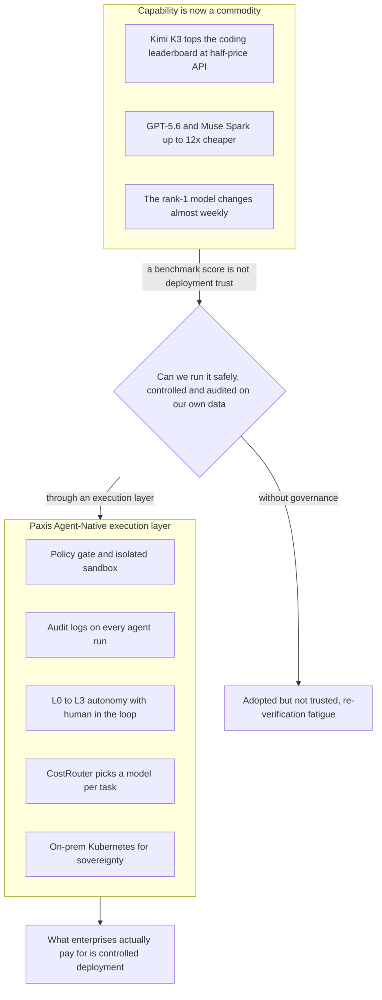

هناك لحظة يلتقط فيها المرء صورة لشاشة لوحة الصدارة. لحظة يزيح فيها نموذج ناشئ اسم البطل المألوف عن القمة. وفي يوليو 2026، صنع نموذج كيمي K3 مفتوح الأوزان من شركة مونشوت الصينية تلك اللحظة بالضبط. فقد تصدر لوحة صدارة البرمجة الأمامية في منصة التقييم أرينا متجاوزا كلود فايبل 5 من أنثروبيك، بعدد معاملات بلغ 2.8 تريليون معامل، وهو أكبر نموذج مفتوح الأوزان يُطرح للعلن حتى الآن. كما أن سعر واجهته البرمجية أقل من النصف. غير أن رد فعل وادي السيليكون، بحسب ما نقلته ديجيتال توداي، لم يكن هتافا بل جملة واحدة: "ربح المعيار القياسي، لكن ماذا بعد."

هذا البرود هو الخبر الحقيقي لهذا اليوم. وفي الأسبوع نفسه، تزامن معه مشهد آخر في الاتجاه المعاكس تماما.

## مشهدان يتعثران عند القمة

أجّلت جوجل نموذج جيميناي 3.5 برو، الذي أعلن الرئيس التنفيذي سوندار بيتشاي شخصيا في فعالية المطورين في مايو أنه سيصدر في يونيو، ثلاث مرات ليصل موعده إلى يوليو. وبحسب تقرير نيوز رود، تخلّت الشركة عن البنية القائمة وأعادت بناءها من الصفر بالكامل، وحُدد قصور أداء البرمجة عن الأهداف الداخلية كسبب رئيسي. وتراجع سعر السهم بنحو 4 بالمئة في وقت من الأوقات بعد خبر التأجيل، وانتقل أربعة من كبار باحثي جيميناي إلى أنثروبيك خلال الأيام الستة الأخيرة.

ولم تكتفِ نيوز رود بالإشارة إلى الصعوبة التقنية وحدها كخلفية للتأخير. بل أشارت إلى أن بنية تنظيمية تكرر فيها جهات متعددة، مثل جوجل كلاود وديب مايند وأندرويد، إنفاق الموارد ببناء أدوات برمجة منفصلة خاصة بكل منها، إضافة إلى ثقافة هندسية داخلية تفرض أن يكتب البشر الكود المهم بأنفسهم، هي ما أبطأ الوتيرة. وهذا يعني أنه حتى عند الحافة الأمامية للأداء، لم يُحسَم بعد إلى أي مدى يتدخل الإنسان وماذا يُترك للأتمتة.

من جهة، بلغ نموذج ناشئ مفتوح الأوزان قمة لوحة الصدارة، لكن السوق لم يفتح محفظته. ومن جهة أخرى، حتى الرائد في الحافة الأمامية أجّل إصداره التالي ثلاث مرات. يبدو المشهدان متناقضين، لكنهما يرويان القصة نفسها: عند ذروة منحنى الأداء، اتسعت الفجوة بين أرقام المعايير القياسية والنشر الفعلي أكثر من أي وقت مضى.

## كلما انخفضت الأسعار، تغير السؤال

القدرة نفسها باتت أكثر شيوعا. وبحسب جدول أسعار النماذج الذي جمعته تشوسون إلبو، انتقل محور المنافسة فعليا من الأداء إلى القيمة مقابل السعر. فقد قسّمت أوبن إيه آي نموذج GPT-5.6 إلى تشكيلة تضم النسخة عالية الأداء سول، ونسختين أرخص هما تيرا ولونا، بينما يعرض ميوز سبارك من ميتا سعرا يقارب واحدا على اثني عشر من سعر فايبل 5 من أنثروبيك على أساس رمز الإخراج. وتدّعي سبيس إكس أن نموذجها جروك 4.5 يستهلك رموز إخراج أقل بأكثر من أربعة أضعاف مقارنة بالنماذج المنافسة في تقييمات البرمجة. وسعر واجهة كيمي K3 البرمجية الذي يبلغ نصف السعر هو أحد فروع هذا التيار أيضا.

وحين تتجه الأسعار نحو القاع، يتغير السؤال. من "ما هو أذكى نموذج" إلى "هل يمكننا تشغيل هذه القدرة بأمان، وبشكل محكوم، وقابل للتدقيق، على بياناتنا ومهامنا". وهنا يكمن سبب عدم بيع النموذج الأول في لوحة الصدارة. فما تدفع المؤسسات ثمنه ليس مؤشر الذكاء، بل إمكانية النشر. المعيار القياسي يثبت القدرة، لكنه لا يثبت الثقة.

## من تبنّى الذكاء الاصطناعي هم من يتحدثون أولا

أصدق شاهد على هذه الفجوة ليس المتشككين، بل من تبنّى الذكاء الاصطناعي فعليا. والتبني نفسه يتوسع بشكل متفجر. فقد ربطت هانا تور وكيلها متعدد الذكاء الاصطناعي إتش إيه آي (H-AI) بنافذة تشات جي بي تي داخل كاكاو توك، ليحصل المستخدمون على توصيات سفر من دون تثبيت أي تطبيق منفصل، وبعد تطبيق تحسين البحث للذكاء الاصطناعي التوليدي، ازداد حجم الزيارات القادمة عبر تشات جي بي تي بنحو 850 بالمئة. وبهذه الوتيرة الحادة يخترق الذكاء الاصطناعي واجهات المحادثة المألوفة، لكن مدى ثقة المؤسسة في تسليم نتائجه يرسم منحنى مختلفا تماما.

بدأت شركات التوزيع الكبرى بنشر وكلاء الذكاء الاصطناعي في العمل الفعلي. فقد جمعت لوتيه تشيلسونغ بيفريج بين الذكاء الاصطناعي التوليدي وتقنية التعرف الضوئي على الحروف OCR وتقنية RAG لتخفض زمن مراجعة ملصقات المنتجات بأكثر من النصف، بينما أدخلت مجموعة دونغ وون "موظفي ذكاء اصطناعي" في شركاتها التابعة وتخطط لإضافة نحو خمسين منهم بحلول نهاية النصف الثاني من العام. غير أن التوصية التي أضافتها ديلويت في تقرير ويكلي كوريا عن هذا الانتشار هي الجوهر: الحفاظ على نظام الإنسان في الحلقة الذي يتحقق فيه الإنسان من النتائج ويوافق عليها في المراحل الأولى من الانتشار.

واعتراف بارك مين جون، الرئيس التنفيذي لشركة رايتن، الذي كشف عن تجربة استبدال الإدارة التنفيذية بالذكاء الاصطناعي، أكثر حدة. فقد شغّل بنية يتناقش فيها ذكاء اصطناعي مخصص لكل دور ثم يقدم رأيه، ليجمّع الرئيس التنفيذي الآراء ويتخذ القرار، وقال إن الأمر بدا مريحا في البداية، لكن بعد شهر بات التحقق من إجابات الذكاء الاصطناعي يستغرق وقتا أطول. وشبّه الذكاء الاصطناعي بموظف جديد ذكي، مؤكدا أنه لا يؤدي دوره كما ينبغي إلا بعد تدريبه بما يكفي على بيانات الشركة وثقافتها التنظيمية.

وهناك شركة حوّلت الألم نفسه إلى سوق. فالحل الذي طورته جيرانجيجيو سوفت، والذي حصل على تصنيف من وزارة العلوم وتكنولوجيا المعلومات والاتصالات وهيئة كوريا لأمن الإنترنت KISA كتقنية متميزة لحماية المعلومات، يفحص في الوقت الفعلي عند نقطة النهاية ما يدخله الموظفون في تشات جي بي تي أو كلود، ليمنع تسرب المعلومات الشخصية والأسرار التجارية، ويدقق بشكل موحد سجل إدخال الأوامر وسجل إرسال البريد الإلكتروني. فهي لا تبيع القدرة، بل تبيع إطار الاستخدام الآمن لتلك القدرة. والاتجاه الذي تشير إليه الحالات الثلاث واحد: أن يصبح النموذج أذكى، وأن تثق المؤسسة بذلك النموذج وتسلّمه المهام، مسألتان مختلفتان تماما.

## الدول تسمي القيمة نفسها باسم مختلف

هذه الإشارة الظاهرة على مستوى الشركات تحمل اسم الذكاء الاصطناعي السيادي حين ترتفع إلى مستوى الدولة. فقد أعلن نائب رئيس الوزراء باي كيونغ هون، في تقريره للعمل، أن تطوير نموذج رائد بمستوى ميثوس من أنثروبيك يتطلب نحو عشرة آلاف وحدة معالجة رسومية، مبشرا بتوسيع الحوسبة بقيادة الدولة، وقررت الحكومة إطلاق خدمة "الذكاء الاصطناعي للجميع" المجانية لكل المواطنين في ديسمبر. وسجّل ائتلاف معهد أبحاث الذكاء الاصطناعي التابع لإل جي المرتبة الأولى في جميع المجالات، من المعايير القياسية إلى تقييم الخبراء والمستخدمين، في التقييم الأول لنموذجه التأسيسي الخاص، وطُبّق تجريبيا في خدمات وزارة الإدارة العامة والأمن. وفي اليابان، يبني ائتلاف نويترا، الذي موّلته 44 شركة منها سوني وسوفت بنك وهوندا، بنية تحتية وطنية للذكاء الاصطناعي بتأمين نحو 27500 وحدة معالجة رسومية من طراز روبن من إنفيديا.

وقراءة هذا التيار كنزعة قومية بسيطة تعني رؤية نصف الصورة فقط. فالسبب الحقيقي وراء ضخ الدول أموالا هائلة في نماذجها وحوسبتها الخاصة هو أن المورد الذي يزداد ندرة كلما شاعت القدرة هو التنفيذ المحكوم بالذات. على بنية تحتية من يعمل النموذج، وتحت أي سياسة، وما الذي يُسجَّل أثناء ذلك. والقيمة التي تسميها الدول ذكاء اصطناعيا سياديا، والقيمة التي تسميها المؤسسات سجلات تدقيق وإنسانا في الحلقة، هما الشيء نفسه، يختلفان فقط في الحجم.

## المال بدأ هو الآخر يتحلى بالحذر

في هذه المرحلة التي تشيع فيها القدرة، بدأ رأس المال أيضا، الذي كان يتراكم من دون حدود، يغيّر تعبيره. وكما أشارت غلوبال إيكونوميك، تراجعت السندات الجديدة لشركات الحوسبة الفائقة التي دعمت الاستثمار في منشآت الذكاء الاصطناعي بمعدل 3.3 نقطة في المتوسط دون سعر الإصدار، في ضعف غير معتاد لسندات تقنية معلومات عالية الجودة. وردّت مؤسسات مالية كبرى مثل غولدمان ساكس على نظرية الفقاعة المبكرة، قائلة إن قوتها الأساسية متينة ولا خطر تعثر عليها، لكن في الوقت نفسه ظهرت توقعات بتباطؤ معدل نمو الاستثمار الرأسمالي لدى مزودي السحابة في أمريكا الشمالية من 83 بالمئة هذا العام إلى نحو 23 بالمئة العام المقبل. وهي إشارة إلى أن عصر البناء بلا تمييز يقترب من نهايته، وأن عصر الانتقاء يبدأ.

وهذه التكلفة تمتد بالفعل إلى أماكن أخرى. فبحسب ديجيتال توداي، تراجعت شحنات الهواتف الذكية في الهند، ثاني أكبر سوق للهواتف الذكية في العالم، بنسبة 10 بالمئة في الربع الثاني، وهو أكبر انخفاض في ست سنوات، وحُدد استثمار شركات الحوسبة الفائقة في البنية التحتية للذكاء الاصطناعي كسبب، إذ التهم إمدادات ذاكرة DRAM وNAND ورفع تكلفة الذاكرة في الهواتف الذكية الرخيصة. أي أن فاتورة عالم يستخدم القدرة كمادة خام وصلت حتى إلى مستهلك هاتف ذكي بسعر 210 دولارات في الهند. وهذا التحول، حيث يتراجع العائد من مواصلة تكديس القدرة ويزداد سمكا العائد من إحسان التعامل معها، يظهر في مؤشرات عدة في الوقت نفسه.

## من عصر اختيار النموذج إلى عصر امتلاك طبقة التنفيذ

وحين نضيف إلى الصورة مفاوضات ميتا لتأجير حوسبتها الخاصة لأنثروبيك بقيمة عشرة مليارات دولار، بدلا من الإعلانات، تتضح الصورة تماما. الحوسبة تتحول إلى سلعة، والنماذج تشيع بنصف السعر، والمرتبة الأولى في لوحة الصدارة تتغير كل أسبوع تقريبا. وفي عالم تصبح فيه القدرة مادة خام على هذا النحو، تنتقل القيمة لا إلى فوق القدرة، بل إلى طبقة التنفيذ التي تحيط بها. والتنافسية لا تكمن في اختيار النموذج، بل في تحت سيطرة من يعمل ذلك النموذج.

يلخّص المخطط أدناه هذا التحول في صورة واحدة. ويوضح لماذا لا يمكن للقدرة التي أصبحت سلعة أن تُنشر بذاتها، ولماذا يجب أن تمر عبر بوابة طبقة التنفيذ لتصبح نشرا محكوما تدفع المؤسسات ثمنه.

وPaxis من ThakiCloud هو بالضبط تلك السحابة الأصيلة للوكلاء (Agent-Native Cloud) التي جعلت من طبقة التنفيذ هذه منتجا فعليا. فهو يضع المهارات والأدوات والسياسات وسجلات التدقيق كموارد من الدرجة الأولى، ليصمم عبر حوكمة الاستقلالية من L0 إلى L3 كلا من إرهاق إعادة التحقق الذي عاشه الرئيس التنفيذي لرايتن، والإنسان في الحلقة الذي أوصت به ديلويت. فلا يُترك تحديد إلى أي مدى يمكن للإنسان أن يرفع يده للحدس، بل يُحدَّد عبر السياسات والبوابات. ووظيفة التدقيق التي باعتها جيرانجيجيو سوفت هي القيمة الافتراضية المرفقة بكل تشغيل وكيل في Paxis، وتصبح بوابة السياسات وصندوق العزل المعزول إطارا يمنع تسرب الأسرار حتى مع تبني نماذج مفتوحة الأوزان بنصف السعر. وتُستوعب منافسة النماذج التي انتقلت إلى القيمة مقابل السعر عبر CostRouter الذي يربط نموذجا مختلفا بكل مهمة، بينما يستقبل متطلبات السيادة التي تطلبها الدول ai-platform القائمة على كوبرنيتيس المحلي (on-prem).

وإذا قلبنا سبب عدم بيع النموذج الأول في لوحة الصدارة، نصل إلى الجواب. فما تشتريه المؤسسات ليس الدرجة القصوى، بل التنفيذ المحكوم. والثقة التي لا يستطيع المعيار القياسي شراءها، تصنعها طبقة التنفيذ بدلا منه.

## المصادر

كُتب هذا المقال بتجميع الأخبار التالية.

- ويكي تري، [ميتا تبيع الحوسبة بدل الإعلانات... مفاوضات أولية لتأجير حوسبتها لأنثروبيك بقيمة 10 مليارات دولار](https://www.wikitree.co.kr/articles/1147052)
- ويكي تري، [سبيس إكس تتفاوض على توريد حوسبة الذكاء الاصطناعي للبنتاغون بحجم مليارات الدولارات](https://www.wikitree.co.kr/articles/1147053)
- غود مورنينغ إيكونومي، [رهان بـ550 تريليون وون على البنية التحتية للذكاء الاصطناعي... إعادة تشكيل من شبكة الكهرباء إلى أشباه الموصلات](https://www.goodkyung.com/news/articleView.html?idxno=289308)
- أيه آي تايمز، [اليابان تبني بنيتها التحتية الوطنية للذكاء الاصطناعي بوحدات روبن من إنفيديا... رهان على الذكاء الاصطناعي الفيزيائي](https://www.aitimes.com/news/articleView.html?idxno=212885)
- نيوز رود، [تأجيل إطلاق جيل جوجل التالي من الذكاء الاصطناعي 'جيميناي 3.5 برو' أشهرا](http://www.newsroad.co.kr/news/articleView.html?idxno=61703)
- ديجيتال توداي، ['ربح المعيار القياسي، لكن ماذا بعد'... نظرة وادي السيليكون إلى كيمي K3 الصيني](https://www.digitaltoday.co.kr/news/articleView.html?idxno=684999)
- تشوسون إلبو، [منافسة نماذج الذكاء الاصطناعي تتحول من 'الأداء الأعلى' إلى 'القيمة مقابل السعر'](https://www.chosun.com/economy/tech_it/2026/07/17/VQDA7CI2ERF4LG2YLQ76R6JG2A/)
- هانز إيكونومي، [ذكاء اصطناعي لتوصيات السفر داخل كاكاو توك... هانا تور توسّع الخدمة](http://www.hansbiz.co.kr/news/articleView.html?idxno=850868)
- ويكلي كوريا، ['ابتكار العمل' قطاع التوزيع يسرّع تبني 'وكلاء الذكاء الاصطناعي'](https://weekly.hankooki.com/news/articleView.html?idxno=7173721)
- دونغ آ إيلبو، [بارك مين جون، الرئيس التنفيذي لرايتن: 'سنستبدل الإدارة التنفيذية بالذكاء الاصطناعي أولا'](https://www.donga.com/news/Economy/article/all/20260717/134316474/1)
- إي ديلي، ['استثمار جريء في ذكاء اصطناعي بمستوى ميثوس'... نائب رئيس الوزراء باي كيونغ هون يوسّع البنية التحتية المتقدمة](https://www.edaily.co.kr/news/newspath.asp?newsid=02696166645515504)
- تشونجي إيلبو، [[منتخب كوريا للذكاء الاصطناعي ①] معهد أبحاث الذكاء الاصطناعي لدى إل جي يتجاوز حاجز شركات التقنية الكبرى بسيادة الذكاء الاصطناعي 'K-إكساون'](https://www.newscj.com/news/articleView.html?idxno=3417568)
- ماي إيل كيونغجيه، ['الذكاء الاصطناعي لكل المواطنين' بلا حدود للتكلفة أو السعة يصدر في ديسمبر... مصدر التمويل مسألة أخرى](https://www.mk.co.kr/article/12100854)
- ماي إيل كيونغجيه، [اليابان تطلق مشروع الذكاء الاصطناعي السيادي بمشاركة 44 جهة منها سوفت بنك... كشف النموذج الأساسي هذا العام](https://www.mk.co.kr/article/12100992)
- غلوبال إيكونوميك، [مؤشرات على التقاط الأنفاس في استثمارات الذكاء الاصطناعي... عبء تمويل شركات التقنية الكبرى يجعل الطلب على HBM 'متغير سرعة'](https://www.g-enews.com/view.php?ud=202607180708261959fbbec65dfb_1)
- نيوز رود، [مايكرون تستهدف 'عقل السيارة' بتحالف ذاكرة لمدة 3 إلى 5 سنوات مع هيونداي موبيس وكوالكوم](http://www.newsroad.co.kr/news/articleView.html?idxno=61704)
- ديجيتال توداي، [شحنات الهواتف الذكية في الهند تنخفض 10 بالمئة بفعل الطلب على ذاكرة الذكاء الاصطناعي... أكبر انخفاض في 6 سنوات](https://www.digitaltoday.co.kr/news/articleView.html?idxno=685002)
- ماي إيل إيلبو، ['الوقاية من تسرب معلومات الشركات الصغيرة والمتوسطة بتقنية أمن الذكاء الاصطناعي'... جيرانجيجيو سوفت وأمن الذكاء الاصطناعي](https://www.m-i.kr/news/articleView.html?idxno=1392577)
