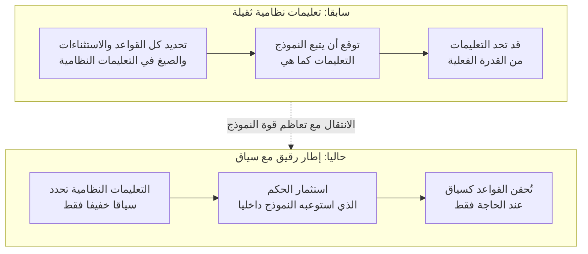

## نظرة عامة

في الآونة الأخيرة، تداول مجتمع المطورين خبرا قصيرا بشكل لافت. وهو أن أنثروبيك أزالت نحو 80 بالمئة من التعليمات النظامية في Claude Code. والجزء المثير للاهتمام لم يكن التقليص بحد ذاته، بل السبب وراءه. فقد قال طارق شيهيبار (@trq212) من أنثروبيك إن سلسلة النماذج الجديدة Fable 5 "تريد تعليمات نظامية أصغر"، وأوضح أن إدراج الكثير من التعليمات والأمثلة قد يعيق النموذج فعليا. والسبب، بحسب قوله، أن النموذج أكثر خيالا من القواعد التي نكتبها له.

هذه الجملة ليست مجرد خبر تحسين منتج عادي. فعلى مدى السنوات الماضية، تطورت هندسة التعليمات في اتجاه "اكتب كل شيء ولا تترك شيئا". وكان يُنظر إلى حشر ما يجب تجنبه، والصيغة الواجب اتباعها، وحتى الحالات الاستثنائية بكثافة داخل التعليمات النظامية على أنه إطار عمل جيد. لكن الإشارة التي ظهرت الآن هي أنه عندما يصبح النموذج قويا بما يكفي، قد تتحول هذه الكثافة من أصل إلى عبء.

تشغّل Thaki Cloud منصة SaaS للذكاء الاصطناعي وتعلم الآلة قائمة على Kubernetes، وتدير من خلال طبقة تحكم الوكلاء Paxis العاملة فوقها أكثر من 960 مهارة وعشرات القواعد الدائمة كإطار عمل. لذلك، فإن سؤال "كم يجب أن ندرج في التعليمات النظامية" ليس بالنسبة لنا جملة رائجة بل قرار تصميم نواجهه يوميا. يستعرض هذا المقال ما يعنيه هذا التقليص، ولماذا تريد النماذج الأذكى إطارا أرق، وكيف يمكن ترجمة هذا المبدأ إلى ممارسة تشغيلية فعلية.

## ما الذي تغيّر

يتلخص جوهر الخبر المنشور في نقطتين. الأولى أن حجم التعليمات النظامية في Claude Code انخفض بشكل كبير. والثانية أن السبب ليس "النموذج ضعيف فنملؤه أكثر" بل على العكس "النموذج أصبح قويا فنملؤه أقل".

بحسب تفسير أنثروبيك، ازدادت قدرة النموذج الجديد على استيعاب معايير السلوك داخليا أثناء التدريب. فما كان يجب سابقا كتابته بالتفصيل في التعليمات النظامية عند لحظة النشر، أصبح النموذج الآن يحمله إلى حد ما داخل أوزانه. ونتيجة لذلك، انتقل دور التعليمات النظامية من "دفتر لوائح يحتوي كل القواعد" إلى "مُعِدّ سياق خفيف"، بحسب التفسير المرافق للخبر. كما وردت إشارة إلى توجيه النموذج بالاعتماد على السياق بدلا من صيغ المنع الجافة مثل "لا تفعل هذا".

يوضح الرسم البياني أدناه بنية هذا التحول. فالطريقة القديمة القائمة على دفتر لوائح ثقيل على اليسار، والطريقة الجديدة القائمة على إعداد سياق رقيق على اليمين، تختلفان في مكان تراكم القدرة داخل كل منهما.

وهنا نقطة تستحق الحذر. فـ"تقليص التعليمات النظامية" لا يعني "إلغاء التعليمات". ما تقلص هو الإطار الدائم الذي كان مرفقا دوما عند لحظة النشر، أما المعرفة المجالية وأساس الأحكام فلا تزال بحاجة إلى مكان تُحفظ فيه. الذي تغيّر هو مكان تخزين هذه المعرفة.

## لماذا تريد النماذج الأذكى تعليمات أرق

هذه الظاهرة ليست حديثا يدور بالحدس وحده. فهناك أبحاث تشير إلى أن زيادة سقالات الوكيل (الإطار) لا تُحسّن الأداء بالضرورة، بل قد تسبب تداخلا بينها. على سبيل المثال، تتناول ورقة "More Is Not Always Better: Cross-Component Interference in LLM Agent Scaffolding" (arXiv 2605.05716) النقطة التي يبدأ عندها إضافة المزيد من مكونات الإطار في خلق تداخل بين هذه المكونات، مما يؤدي إلى تراجع الأداء الإجمالي. وهذه ملاحظة تفيد بأن إضافة المزيد من التعليمات ليست منفعة متزايدة باطراد.

ولفهم الأمر بشكل بديهي، يمكن تفسيره كالتالي. كلما أضيفت قاعدة إلى التعليمات النظامية، يتعامل النموذج معها كقيد يجب الالتزام به في كل لحظة. وعندما تكون القواعد قليلة، يشكل هذا القيد حاجزا وقائيا مفيدا. لكن عندما يزداد عدد القواعد إلى العشرات، تتعارض بعضها مع بعض أو تُشوّش تعليمات غير ذات صلة بالمهمة الحالية على الحكم. وكانت النماذج الضعيفة تتيه دون تعليمات صريحة، لذلك كان تحمل هذه التكلفة يستحق العناء. أما النماذج القوية، فقد ازدادت قدرتها على قراءة الموقف بنفسها، فبدأت تكلفة التداخل الناتجة عن التعليمات غير الضرورية تتجاوز الفائدة التي تقدمها تلك التعليمات.

وهنا بالضبط تصبح عبارة "النموذج أكثر خيالا من التعليمات التي نكتبها له" مفهومة. فالقواعد الكثيفة تضع حدا أدنى يمنع أسوأ المخرجات، لكنها في الوقت نفسه تصبح سقفا يكبح أفضل المخرجات. فحين يستطيع النموذج الصعود فوق ذلك السقف، يصبح إزالة القواعد فعليا فتحا للأداء.

غير أن هذا المنطق ليس مطلقا. فإزالة الحد الأدنى قد ترفع المتوسط، لكنها تزيد التباين في الوقت نفسه. أي أن الحاجز الوقائي الذي كان يمنع ظهور مخرجات سيئة من حين لآخر يختفي. لهذا السبب، فإن "ما الذي يجب إزالته" أهم عمليا من "كم يجب إزالته".

## من القواعد إلى السياق

أكثر ما يفيد عمليا في هذا الخبر هو جزء "التوجيه بالسياق بدلا من صيغ المنع الجافة". فهناك طريقتان لنقل النية نفسها.

الأولى هي القاعدة الصارمة. وتُصاغ بالمنع والإلزام، مثل "لا تستخدم مصطلحات تقنية" أو "التزم حتما بهذه الصيغة". هذه الطريقة واضحة، لكنها إذا تراكمت كإطار دائم تُنتج التداخل المذكور آنفا. أما الثانية فهي إعداد السياق. وفيها يُوصف الحالة المرجوة للنتيجة، مثل "اكتب هذا النص بمستوى يسهل على قارئ في السادسة عشرة فهمه". وغالبا ما تعمل الطريقة الثانية بثبات أكبر مع النماذج القوية. ليس لأنها لا تفهم الصيغ السلبية، بل لأن الهدف المصاغ إيجابا يمنح النموذج مساحة ليملأ التفاصيل بنفسه.

وهنا ينشأ تمييز مهم. فالأمر لا يتعلق بإزالة كل المعرفة من التعليمات النظامية، بل بفصل الإطار الدائم عن المعرفة المطلوبة عند الحاجة. يُبقى فقط ما يلزم في كل لحظة دائما، بينما تُستدعى المعرفة اللازمة لمهمة محددة كسياق عند بدء تلك المهمة. وبهذا يظل الإطار الدائم رقيقا، بينما تُقدَّم المعرفة المجالية بكثافة عند اللحظة المطلوبة.

غير أن ما يجب ألا يتزعزع، مثل اتساق الصيغة، ينبغي أن يبقى بحوزة الشيفرة الحتمية. فبدلا من أن نطلب من النموذج "أجب دائما بالصيغة نفسها من JSON"، يكون من الأسلم أن تفرض الشيفرة صيغة المخرجات والتجميع، ويكتفي النموذج بتوليد المحتوى فقط. وتيار جعل التعليمات أرق لا يتعارض مع مبدأ تثبيت الصيغة بالشيفرة، بل يكمل كل منهما الآخر. فما لا يجوز أن يتزعزع يُنزَّل إلى الشيفرة، وما يحتاج إلى حكم يُترك للنموذج، وكلاهما يُخفَّف من الإطار الدائم.

## دلالات على مستوى منتجات Thaki Cloud

يتقاطع هذا التيار بدقة مع فلسفة تصميم منصة الوكلاء Paxis الخاصة بـ Thaki Cloud. فـ Paxis طبقة تحكم للسحابة الأصيلة للوكلاء (Agent-Native Cloud) تعمل فوق ai-platform، وتتعامل مع المهارات (Skills) والأدوات (Tools) والسياسات (Policies) وسجلات التدقيق (Audit Logs) كموارد من الدرجة الأولى. ومن أبرز مبادئ التصميم فيها "إطار رقيق، ومهارات ثقيلة". فحلقة النموذج والصلاحيات والأمان، أي الإطار، تُبقى عند الحد الأدنى، بينما تُكدَّس المعرفة المجالية والأحكام وحالات الفشل بكثافة في المهارات.

لا يضع إطار المهارات في Paxis أكثر من 960 مهارة كلها في التعليمات النظامية الدائمة. بل يختار عند وصول الطلب، عبر بحث BM25، المهارات ذات الصلة فقط ويستدعيها كسياق في تلك اللحظة تحديدا. وهذا بالضبط تجسيد لما يعنيه هذا الخبر بـ"مُعِدّ السياق الخفيف". إذ يظل الإطار الدائم الذي يُدفع ثمنه في كل حالة رقيقا، بينما تُقدَّم المعرفة الكثيفة فقط عند مهمة محددة. ومنذ لحظة إدراج أي مهارة في الفهرس، يبدأ اسمها ووصفها بتحمل تكلفة رمزية (توكن) في كل جلسة، لذلك نحكم على إدراج كل جملة في الإطار الدائم بمعيار: هل يخطئ الوكيل من دونها؟

يرتبط مبدأ التوجيه بالسياق أيضا بتشغيلنا. فبوابات السياسات وسجلات التدقيق في Paxis تفرض بالشيفرة الحتمية القواعد التي لا يجوز أن تتزعزع. أما المجالات التي تتطلب جودة محتوى أو حكما، فتُترك للنموذج، مع توجيه اتجاهه فقط بقاعدة رقيقة. ولأن القواعد الدائمة تُدفع ثمنها رمزيا في كل دورة تفاعل، نُبقي دائما فقط ما هو ضروري باستمرار، بينما نُنزّل ما يُحتاج إليه أحيانا إلى مهارات تُحمَّل عند الطلب. وبهذا نطبق يوميا في رسم الحدود بين المهارات والقواعد الدرس نفسه الذي تعلمته أنثروبيك من تعليماتها النظامية.

وهناك دلالة أيضا من منظور البنية التحتية. فحين تصبح التعليمات النظامية أرق، تقل رموز الإدخال (input tokens)، وهذا يؤثر مباشرة على تكلفة الخدمة والتأخير. وفي بيئة تخدم فيها ai-platform النماذج عبر vLLM بتشغيل متعدد المستأجرين، فإن تقليص الإطار الدائم ليس مسألة جودة فحسب بل مسألة اقتصادية أيضا. فانخفاض تكلفة الخدمة يُتيح تشغيل الوكلاء بشكل أكثر تواترا وعلى نطاق أوسع، وهذه القدرة بدورها تصنع جدوى اقتصادية للوكلاء.

## الحدود والاعتراضات

يجب توخي الحذر عند تعميم هذا التيار كما هو. وفيما يلي بعض الاعتراضات نطرحها بأمانة.

أولا، الاستنتاج القائل بأن "كلما كان أرق كان أفضل" استنتاج خطير. فتقليص التعليمات لا يفتح الأداء إلا حين يكون النموذج قويا بما يكفي، وتلك العتبة تختلف باختلاف النموذج والمهمة. فإزالة الإطار بتسرع في نموذج ضعيف أو مهمة عالية المخاطر يُزيل الحد الأدنى الوقائي ويزيد من احتمال ظهور مخرجات سيئة. وفعليا، حين تتزعزع جودة المحتوى في نموذج منخفض التكلفة ضمن تشغيلنا، نستجيب بتثبيت الصيغة بشكل أشد عبر الشيفرة.

ثانيا، الأرقام المحددة في هذا الخبر مستندة إلى تصريح علني من مسؤول في أنثروبيك وما نقلته وسائل الإعلام عنه، ولم تُنشر بيانات دقيقة عن طول التعليمات النظامية قبل التقليص وبعده أو نتائج قياسية مرجعية. فرقم "80 بالمئة" هو تعبير أُعلن رسميا، لكننا لم نُعِد قياس أثره على الأداء بشكل مستقل، ونوضح ذلك بجلاء.

ثالثا، السؤال المحوري هو ما الذي يملأ المكان الذي أُزيلت منه التعليمات. فحذف التعليمات من التعليمات النظامية لا يعني اختفاء المعرفة. فتلك المعرفة يجب أن تنتقل إلى مكان آخر، سواء داخل أوزان النموذج، أو مهارة تُستدعى عند الطلب، أو بوابة شيفرة حتمية. وإذا حُذفت المعرفة دون تجهيز مكان لنقلها، سرعان ما يعود الإطار الأرق إلى مخرجات غير محكومة. وفي النهاية، هذه ليست منافسة على "الكتابة الأقل" بل مسألة تصميم تتعلق بـ"ما الذي يوضع وأين".

خلاصة القول، هذا التقليص مؤشر واحد يكشف عن انتقال مركز ثقل هندسة التعليمات. فكلما اشتد ذكاء النموذج، يزداد الإطار الدائم رقة، وتُعاد صياغة القواعد وتوزيعها بين السياق والشيفرة. وقد طبقت Thaki Cloud هذا المبدأ فعليا من خلال إطار Paxis الرقيق ومهاراته الثقيلة، ويؤكد هذا الخبر أن هذا الاتجاه ليس ذائقة خاصة بنا بل تيار تتجه إليه الصناعة معا.

## المصادر

- تصريح علني منسوب لطارق شيهيبار (@trq212) من أنثروبيك، نقلا عن موقع [the-decoder.com](https://the-decoder.com/anthropic-says-it-cut-80-percent-of-claude-codes-system-prompt-because-fable-5-models-want-a-smaller-system-prompt/)
- ["Anthropic Slashes Claude Code System Prompt by 80%", ClaudeAINews](https://www.claudeainews.com/news/anthropic-cuts-claude-code-system-prompt-80-percent)
- ["More Is Not Always Better: Cross-Component Interference in LLM Agent Scaffolding", arXiv 2605.05716](https://arxiv.org/abs/2605.05716)
