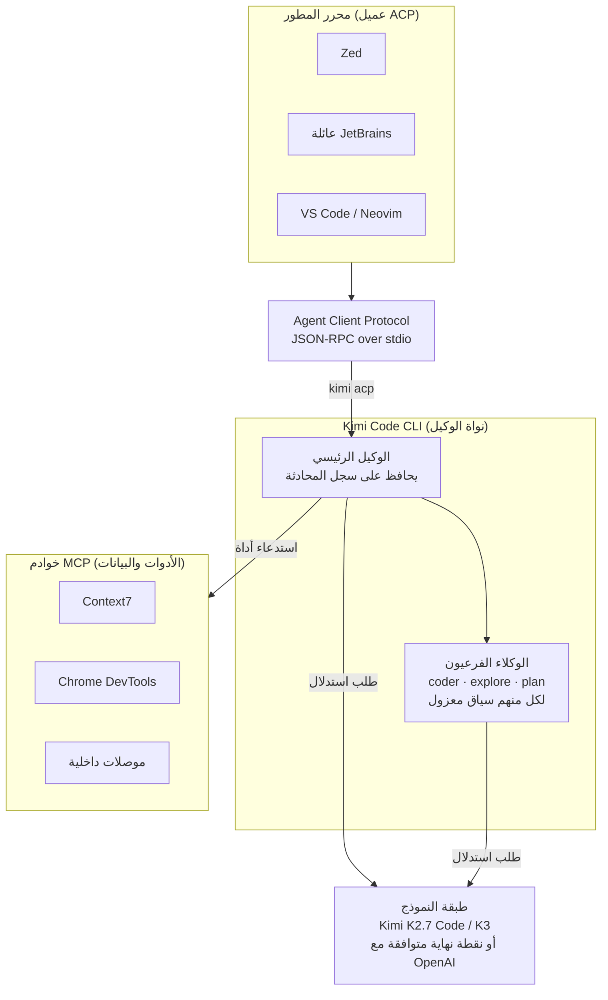

في الأسبوع الماضي، تصدرت Moonshot AI قوائم الترتيب في البرمجة بعد إطلاق نموذجها المفتوح الأوزان Kimi K3. لكن ما رافق هذا الإطلاق بهدوء كان أداة أقرب إلى سير عمل المطورين من النموذج نفسه، وهي Kimi Code CLI، وكيل برمجة طرفي مفتوح المصدر أطلقته Moonshot برخصة MIT. تداول مستخدمو LinkedIn تعريفاً يقول إن هذه الأداة تقدم ميزات غير موجودة في Claude Code. لم ننقل هذه العبارة كما هي، بل تحققنا مباشرة من المستودع الرسمي والوثائق. والخلاصة أن نصف هذا التعريف صحيح ونصفه الآخر مبالغ فيه. والنقطة الأكثر إثارة للاهتمام كانت في موضع لم تبرزه مواد الترويج.

يستعرض هذا المقال ماهية Kimi Code CLI، وما تقدمه فعلياً، ولماذا تستحق المتابعة من منظورنا كمشغّلين لمنصة ذكاء اصطناعي قائمة على K8s. وقد خصصنا مساحة واسعة لشرح لماذا يُعد معيار Agent Client Protocol المفتوح قطعة قد تغير قواعد اللعبة في منظومة الوكلاء.

## ما هو Kimi Code CLI

Kimi Code CLI أداة برمجة عاملة بأسلوب الوكيل تعمل من الطرفية، وتنتمي إلى نفس فئة Claude Code وGemini CLI وCodex CLI. المستودع الرسمي هو [MoonshotAI/kimi-code](https://github.com/MoonshotAI/kimi-code)، وقد تطور من المشروع السابق [MoonshotAI/kimi-cli](https://github.com/MoonshotAI/kimi-cli) مع الحفاظ على استمرارية الجلسات والإعدادات القديمة. كلا المستودعين رسميان من Moonshot، وينبغي الحذر من الخلط بينهما وبين مشاريع طرف ثالث تحمل أسماء مشابهة.

وهنا يجب توضيح تصحيح أول. الاسم الرسمي لهذه الأداة ليس "CLI مخصصة لـ Kimi K3" بل Kimi Code CLI. فهي أداة غير مقيدة بنموذج واحد، وتستخدم افتراضياً نموذج Moonshot المتخصص في البرمجة Kimi K2.7 Code، لكن يمكن عبر الإعدادات التحول إلى نماذج أخرى بما فيها K3. أي أن K3 هو أحد النماذج المتعددة التي يمكن ربطها بهذه الأداة، وليست الأداة مصممة حصراً له. أما K3 نفسه فهو نموذج MoE مفتوح بحجم 2.8 تريليون معلمة أطلقته Moonshot في 16 يوليو 2026، ويعتمد على Kimi Delta Attention مع نافذة سياق تصل إلى مليون رمز. وقد غطت هذا الإطلاق وسائل إعلام رئيسية مثل CNBC وBloomberg وForbes.

من المفيد رسم الصورة الكاملة أولاً لتترابط التفاصيل لاحقاً بسهولة أكبر. جوهر الأمر هو الدور المزدوج الذي تلعبه Kimi Code CLI: فمن جهة تتصل بالأدوات والبيانات كعميل MCP، ومن جهة أخرى تتصل بالمحررات كخادم ACP.



## الوكلاء الفرعيون: تقسيم السياق للحفاظ على نظافة الوكيل الرئيسي

توفر Kimi Code CLI ثلاثة أنواع من الوكلاء الفرعيين المدمجين. الوكيل coder هو المسؤول الهندسي العام الذي يقرأ الملفات ويكتبها وينفذ الأوامر لتطبيق التغييرات الفعلية. الوكيل explore مخصص للاستكشاف، إذ يتصفح قاعدة الشيفرة للقراءة فقط. أما الوكيل plan فيقتصر عمله على تقديم خطط التنفيذ وتصاميم البنية دون تنفيذ أي أوامر في الصدفة. هذا التقسيم موثق في الصفحة الرسمية [Agents and Sub-Agents](https://moonshotai.github.io/kimi-code/en/customization/agents.html).

الجوهر هنا ليس الأسماء بل عزل السياق. يمتلك كل وكيل فرعي نافذة سياق مستقلة تماماً، ولا يرى سوى وصف المهمة الذي يمرره الوكيل الرئيسي صراحة. لا يُكشف سجل محادثة الوكيل الرئيسي للوكلاء الفرعيين، كما أن سجلات الاستدلال الوسيط واستدعاءات الأدوات التي ينفذها الوكيل الفرعي لا تختلط بسجل الوكيل الرئيسي، إذ يعيد الوكيل الفرعي النتيجة النهائية فقط. ولهذا السبب يظل السياق الرئيسي رفيعاً ولا يتضخم بالسجلات في الجلسات الطويلة. كما تدعم الأداة التنفيذ في الخلفية والتنفيذ المتوازي، بحيث يمكن تشغيل عدة مهام استكشاف في آن واحد وتعود النتائج تلقائياً عند الانتهاء.

هذا النمط ليس غريباً علينا. فحتى إطار التنسيق الداخلي الذي يشغّل هذه المدونة يفوّض مهام الاستكشاف إلى وكلاء فرعيين منخفضي التكلفة، ولا يستعيد سوى الملخصات لحماية السياق الرئيسي. مبدأ أن نظافة السياق تعني في الوقت نفسه التكلفة والجودة يبقى واحداً بغض النظر عن الأداة المستخدمة.

## MCP: تجربة إعداد دون تعديل JSON يدوياً

تُدار عمليات ربط Model Context Protocol عبر مسارين. الأول هو الأوامر الفرعية لسطر الأوامر، حيث تُدار الخوادم عبر kimi mcp add وkimi mcp list وkimi mcp remove وkimi mcp authorize. على سبيل المثال يمكن ربط خادم بحث في الوثائق عبر نقل HTTP، أو ربط خادم أتمتة متصفح عبر نقل stdio.

```bash
# نقل HTTP (يدعم خيار OAuth)
kimi mcp add --transport http context7 https://mcp.context7.com/mcp

# ربط عملية محلية عبر نقل stdio
kimi mcp add --transport stdio chrome-devtools -- npx chrome-devtools-mcp@latest
```

أما المسار الثاني فهو الأمر التفاعلي بشرطة مائلة /mcp-config الذي يُستخدم داخل واجهة TUI، ويتيح إضافة الخوادم وتعديلها والمصادقة عليها دون تحرير ملف إعدادات JSON مباشرة. ويعرض الأمر /mcp قائمة الخوادم المتصلة حالياً والأدوات المحمّلة. والجزء الذي أبرزه تعريف LinkedIn، وهو أنه لا حاجة لتعديل JSON مباشرة، صحيح فعلاً. لكن هذه الميزة بحد ذاتها ليست غائبة عن Claude Code، وسنعود إلى هذه النقطة لاحقاً. الوثائق ذات الصلة موجودة في [إعداد MCP](https://moonshotai.github.io/kimi-cli/en/customization/mcp.html).

## Agent Client Protocol: أهم قطعة في هذه الأداة

هذا هو الجزء الأكثر إثارة للاهتمام في هذا المقال. Agent Client Protocol، ويُختصر بـ ACP، هو معيار مفتوح صممه فريق محرر Zed. يعمل برخصة Apache، ويتبادل الرسائل عبر JSON-RPC 2.0 فوق stdio. تُشغّل المحررات الوكيل كعملية فرعية وتتواصل معه عبر المدخلات والمخرجات القياسية، وآلية النقل نفسها مطابقة لبروتوكول خادم اللغة.

التشبيه هنا يساعد كثيراً على الفهم. قبل ظهور LSP، كان على كل محرر أن يبني تكاملاً منفصلاً لكل لغة برمجة. حوّل LSP هذه المسألة من مشكلة M ضرب N إلى مشكلة M زائد N، فما إن ينفذ محرر واحد المعيار حتى يستفيد من أي خادم لغة بغض النظر عمن صنعه. ويفعل ACP الشيء ذاته تماماً مع الوكلاء، فما إن ينفذ محرر واحد ACP حتى يتصل به أي وكيل بطريقة موحدة بغض النظر عن صانعه. يمكن الاطلاع على هذا المفهوم في [تعريف Zed بـ ACP](https://zed.dev/acp) وفي [مقال مارك نوري التوضيحي](https://blog.marcnuri.com/agent-client-protocol-acp-introduction).

من السهل الخلط بينه وبين MCP، لكن الاتجاه معاكس تماماً. يتجه MCP من الوكيل نحو الأدوات والبيانات، وفي هذه الحالة يكون الوكيل عميل MCP. أما ACP فيتجه من المحرر نحو الوكيل، وهنا يكون الوكيل خادم ACP والمحرر عميل ACP. أي أن الوكيل نفسه يلعب دور عميل MCP من جهة، ودور خادم ACP من جهة أخرى في آن واحد. وهذا هو السبب الذي جعل الرسم البياني السابق يوضح هذا الدور المزدوج.

تدعم Kimi Code CLI هذا البروتوكول بشكل أصلي عبر الأمر الفرعي kimi acp دون الحاجة إلى أي تثبيت إضافي. يتصل بها Zed بشكل أصلي، بينما تتصل به JetBrains عبر إضافة، وقد ظهرت بالفعل عدة تكاملات مع محررات أخرى وفق سجل ACP الخاص بـ Zed. بذلك يستطيع المطور تشغيل جلسة Kimi دون مغادرة المحرر الذي اعتاد عليه.

## إدخال الصور والفيديو، إلى أي حد فعلياً

ذكر تعريف LinkedIn أنه يمكن تمرير لقطة الشاشة كما هي كمدخل. وهذا يحتاج إلى تصحيح. فالميزة التي تبرزها Moonshot فعلياً ليست لقطة شاشة ثابتة بل إدخال مقطع فيديو مسجّل للشاشة. يذكر وصف المستودع أنه عند إسقاط تسجيل شاشة أو مقطع عرض توضيحي في المحادثة، يستطيع الوكيل مشاهدة وفهم السلوك الذي يصعب شرحه بالكلام مباشرة. وبالطبع تدعم نافذة الإدخال في سطر الأوامر لصق الصور أيضاً، إذ إن النموذج الافتراضي Kimi K2.7 Code هو نموذج متعدد الوسائط أصلي مزوّد بمُرمّز رؤية MoonViT بحجم 400 مليون معلمة، يستقبل النص والصور والفيديو معاً. غير أنه عند ربط نموذج مخصص، يجب تحديد دعم الصور صراحة ضمن modalities الخاصة بذلك النموذج ليعمل بشكل صحيح. وخلاصة القول إن إدخال الصور متاح فعلاً، لكن ما يُروَّج له كفارق حقيقي هو إدخال الفيديو، وتعبير لقطة شاشة غير دقيق تماماً.

## التثبيت فعلياً في ثلاث خطوات

تدفق التثبيت بسيط فعلاً كما ورد في التعريف. الأوامر أدناه مستندة إلى [دليل البدء الرسمي](https://moonshotai.github.io/kimi-cli/en/guides/getting-started.html)، ولم نترك سجل تنفيذ مباشر لأن صندوق الاختبار الداخلي لدينا لا يملك صلاحية الوصول إلى نطاق التوزيع المعني. لذلك لم ننتج أي أرقام قياس أداء، واكتفينا بنقل الأوامر الموثقة فقط.

```bash
# 1) تشغيل سكربت التثبيت (يثبّت uv في الوقت نفسه)
curl -LsSf https://code.kimi.com/install.sh | bash

# 2) التشغيل داخل دليل المشروع
kimi

# 3) إعداد المصادقة
/login
```

بالنسبة لنظام macOS تتوفر brew install kimi-code، وبالنسبة لويندوز يتوفر أيضاً سكربت PowerShell. للتطوير من الشيفرة المصدرية يلزم Node بإصدار 24.15 أو أحدث مع pnpm. ولأن الرخصة MIT، فإن القيود قليلة على قراءة الشيفرة وعمل fork لها وتوزيعها داخل المؤسسة.

## انفتاح النماذج ومزودي الخدمة

يبلغ أقصى طول للسياق في عائلة K2.6 نحو 256 ألف رمز، بينما يصل في K3 وفق مواد تسويق Moonshot إلى مليون رمز. لكن الأهم من ذلك هو انفتاح مزودي الخدمة. ففي ملف ~/.kimi-code/config.toml يمكن تسجيل عدة مزودين في آن واحد، من نقاط نهاية متوافقة مع OpenAI، إلى مفاتيح Anthropic API، وصولاً إلى Google GenAI أو Vertex AI. وهذا يعني أن الأداة غير مقيدة بنموذج واحد بعينه. كما تعالج تلقائياً حقل reasoning_content الخاص بنماذج الاستدلال من أطراف ثالثة. الوثائق ذات الصلة في [Providers and models](https://moonshotai.github.io/kimi-cli/en/configuration/providers.html).

## هل هي ميزات غير موجودة في Claude Code: مقارنة صريحة

أكثر العبارات انتشاراً في التعريف كانت أنها تقدم ميزات غير موجودة في Claude Code. وبعد التحقق تبين أن هذا الإطار في معظمه مبالغ فيه.

فالوكلاء الفرعيون وعزل السياق يقدمهما Claude Code أيضاً بالطريقة نفسها عبر ميزة الوكلاء الفرعيين. وMCP مدعوم أصلاً بنضج في Claude Code عبر نقل stdio وSSE وHTTP. كما أن لصق الصور موجود فيه أيضاً. هذه العناصر الثلاثة إذن ليست فوارق حقيقية.

الفارق الحقيقي يكمن في نقطتين. الأولى هي طريقة دعم ACP. فـ Kimi Code CLI تدمج ACP كميزة أساسية من الدرجة الأولى داخل الأداة نفسها عبر الأمر الفرعي kimi acp. أما Claude Code فيتصل بها عبر حزمة محول منفصلة صنعها Zed، وما تزال في مرحلة تجريبية. من منظور المستخدم، الأولى تعمل فور تفعيل الأداة، بينما الثانية تتطلب إضافة جسر إضافي. النقطة الثانية هي انفتاح النماذج. فـ Kimi مفتوح على سلسلة K مفتوحة الأوزان مع إمكانية التحول بين عدة مزودين، بينما يقتصر Claude Code على نماذج Anthropic حصرياً. ومن هذه النقطة يتفرع فارق ثالث يتعلق بإمكانية الاستضافة الذاتية. فبما أن Kimi أداة مفتوحة المصدر مع نموذج مفتوح الأوزان، يمكن تشغيله داخل المؤسسة، بينما تظل Claude Code أداة مفتوحة لكن نموذجها متاح عبر واجهة API فقط. يمكن الاطلاع على الدليل ذي الصلة في [مقال Zed حول Claude Code عبر ACP التجريبي](https://zed.dev/blog/claude-code-via-acp).

## دلالات على منتجات ThakiCloud

يمس هذا الموضوع أداة وكيل من جهة، ومحور بنية تحتية يتعلق بالنماذج المفتوحة والاستضافة داخل المؤسسة من جهة أخرى. لذلك نستخدم العدستين معاً.

من عدسة Paxis، تتداخل بنية Kimi Code CLI إلى حد كبير مع اتجاه تصميم منتجنا. فPaxis هو مستوى التحكم الخاص بـ ThakiCloud لسحابة أصيلة الوكلاء (Agent-Native Cloud)، ويتعامل مع المهارات والأدوات والسياسات وسجلات التدقيق كموارد من الدرجة الأولى. والطريقة التي يعمل بها الوكلاء الفرعيون coder وexplore وplan لدى Kimi بالتوازي وفي سياقات معزولة، تشترك في الفلسفة نفسها مع طريقة عمل حاضنة المهارات في Paxis، التي تختار من بين أكثر من 960 مهارة باستخدام BM25 وتنفذها في صناديق اختبار معزولة. وACP بشكل خاص، بوصفه معياراً محايداً تجاه المزودين، يمثل فرصة مباشرة لـ Paxis. فأي وكيل ننشره، بما في ذلك الوكلاء المزودة بنماذج خضعت لضبط دقيق خاص بنا، يمكنه إذا نفذ ACP أن يتصل بمحررات المطورين لدى العملاء مثل Zed أو JetBrains بطريقة موحدة. وهذا المزيج من معيارين، MCP للاتصال بالبيانات وACP للاتصال بالمحررات، يمثل بالضبط الصورة التكاملية التي نتجه إليها.

ومن عدسة ai-platform، الانفتاح يعني حرية النشر مباشرة. فبوضع سلسلة K مفتوحة الأوزان فوق جدولة GPU عبر Kueue وخدمة vLLM في عنقودنا، وتوجيه الأداة نحو نقطة نهاية داخلية، يمكن بناء وكيل برمجة داخلي دون الاعتماد على API خارجي أو إخراج البيانات إلى الخارج. وهذا ينسجم مع متطلبات الأمن الخاصة بالاستضافة داخل المؤسسة في قطاعي المال والقطاع العام حيث لا يجوز خروج الشيفرة إلى الخارج، وكذلك مع متطلبات جهات مثل NIS. وقد سبق أن تناولنا في مقالات سابقة فكرة أنه كلما أصبحت القدرات شائعة ورخيصة، فإن ما تدفعه الشركات فعلياً هو بيئة تنفيذ محكومة. وأهمية Kimi Code CLI تكمن في أنها فتحت طبقة التنفيذ هذه كمصدر مفتوح.

## القيود والاعتراضات

هناك عدة نقاط ينبغي النظر إليها بموضوعية. أولاً، أسماء المحركات الداخلية أو هياكل الطبقات التي تُذكر في تحليلات طرف ثالث معمقة لا ترد في الوثائق الرسمية، وقد تكون نتيجة هندسة عكسية، لذا من الأسلم الاستناد إلى الوثائق الرسمية قبل اعتبارها حقائق. ثانياً، توجد تقارير من المجتمع تفيد بأن مسار ACP يقدم جودة استجابة أفضل من طرق الاتصال الأخرى، لكنها انطباعات وليست قياسات أداء موثقة، أي أنها ليست أرقاماً محققة. ثالثاً، حتى مع كون النموذج مفتوح الأوزان، فإن خدمة نموذج بحجم 2.8 تريليون معلمة فعلياً داخل المؤسسة تتطلب موارد GPU كبيرة، والانفتاح لا يعني بالضرورة سهولة الاستضافة الذاتية، إذ يظل مسار API خياراً واقعياً للفرق الصغيرة. رابعاً، قد يتفوق نضج واستقرار منظومة الأدوات لدى Claude Code أو Codex CLI. وكون الأداة مفتوحة المصدر لا يعني بالضرورة أنها جاهزة للإنتاج.

## الخاتمة

ومع ذلك، فإن الاتجاه نحو ارتباط رخو بين الوكلاء والمحررات فوق معايير مفتوحة هو تيار واضح. فعالم يستطيع فيه المطور تبديل النموذج والمحرر كل على حدة دون التقيد بأداة سطر أوامر من مزود معين، هو عالم أكثر فائدة للمطورين. وتُعد Kimi Code CLI إحدى القطع التي تُقرّب هذا العالم.

## المصادر

- [MoonshotAI/kimi-code (المستودع الرسمي)](https://github.com/MoonshotAI/kimi-code)
- [MoonshotAI/kimi-cli (المستودع السابق)](https://github.com/MoonshotAI/kimi-cli)
- [دليل بدء Kimi Code CLI](https://moonshotai.github.io/kimi-cli/en/guides/getting-started.html)
- [وثائق Agents and Sub-Agents](https://moonshotai.github.io/kimi-code/en/customization/agents.html)
- [وثائق إعداد MCP](https://moonshotai.github.io/kimi-cli/en/customization/mcp.html)
- [Zed - Agent Client Protocol](https://zed.dev/acp)
- [ACP: The LSP for AI Coding Agents](https://blog.marcnuri.com/agent-client-protocol-acp-introduction)
- [Zed - Claude Code via ACP (تجريبي)](https://zed.dev/blog/claude-code-via-acp)
- [MarkTechPost - إطلاق Kimi K3](https://www.marktechpost.com/2026/07/16/moonshot-ai-releases-kimi-k3-a-2-8-trillion-parameter-open-moe-model-with-kimi-delta-attention-and-1m-context/)
