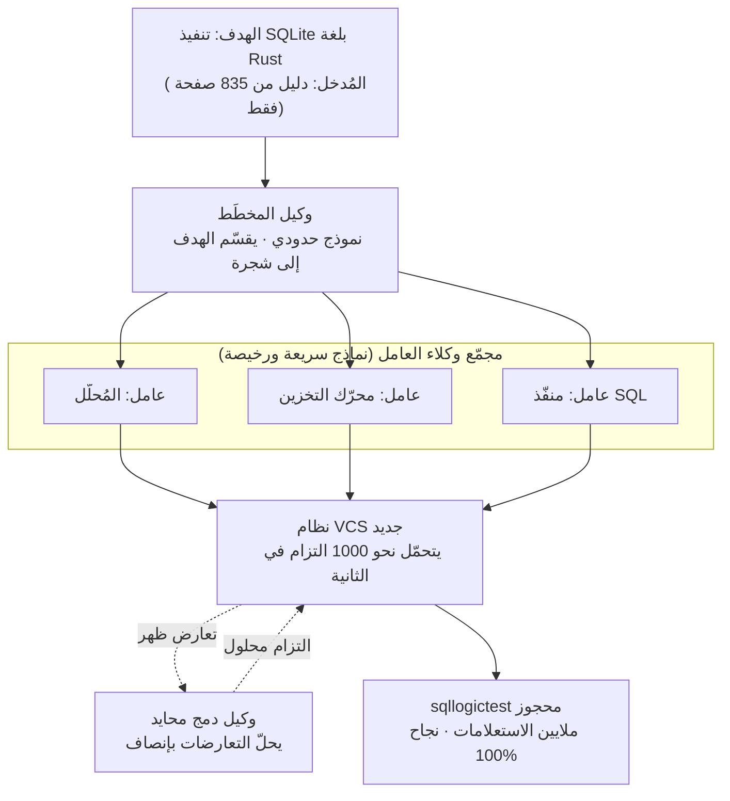

نشرت Cursor نهاية الأسبوع عرضًا لافتًا. أعطت سربًا من الوكلاء مهمة إعادة بناء SQLite من الصفر. لا شيفرة مصدرية، ولا مجموعة اختبارات قائمة، ولا إنترنت. كان المُدخل الوحيد هو دليل SQLite الرسمي المؤلف من 835 صفحة. قرأ السرب هذا المستند وكتب نسخة من SQLite بلغة Rust، واجتازت تلك النسخة مجموعة اختبارات محجوزة بشكل منفصل (sqllogictest) بنسبة 100%.

الأرقام تلفت الانتباه، لكن محور هذا المقال ليس بهرجة العرض. حملت خطوط الزمن على LinkedIn وX جملة واحدة: "الذكاء الاصطناعي أعاد كتابة SQLite." لم نكتفِ بترديدها. راجعنا مدونة Cursor الرسمية والإعلان الأصلي مباشرة. القصة الحقيقية ليست "نجح" مقابل "فشل"، بل أن **النتيجة نفسها كلّفت حتى 15 ضعفًا بحسب طريقة تركيب النماذج**. ولمن يُشغّل أنظمة الوكلاء المتعددين فعليًا، فإن معنى هذه الـ15 ضعفًا هو جوهر هذا المقال.

## ماذا حدث

كانت المهمة التي استخدمتها Cursor للتحقق هي "تنفيذ SQLite بلغة Rust من الصفر باستخدام الوثائق فقط". هذه المهمة سبق أن هزمت سربًا سابقًا مرة واحدة، فصارت بمثابة اختبار حاسم لما إذا كان النظام قد تحسّن فعلًا. بالأرقام الرسمية:

- **الصحة**: اجتازت نسخة Rust التي أنتجها السرب الجديد مجموعة sqllogictest المحجوزة بنسبة 100%. تتألف هذه المجموعة من ملايين الاستعلامات.
- **سرعة التقدّم**: بتركيبة Grok 4.5 بلغ نقطة 80% خلال أربع ساعات. أما السرب السابق فقد انهار تقدّمه في المهمة نفسها ووجب إيقافه قبل الساعة الثانية.
- **تفاوت التكلفة**: بلغ فرق تكلفة تحقيق الهدف نفسه تمامًا **15 ضعفًا** حسب مزيج النماذج. كلّفت أرخص تركيبة، وهي مخطِّط Opus 4.8 مع عمّال Composer 2.5، مبلغ 1339 دولارًا، بينما كلّف تشغيل جميع الأدوار على GPT-5.5 مبلغ 10565 دولارًا.

هذا البند الأخير هو العنوان الحقيقي. فإذا كانت جودة المُخرَج واحدة بينما تتأرجح الفاتورة 15 ضعفًا، فإن المتغيّر الذي يحسم نتائج الوكلاء المتعددين ليس "أي نموذج أذكى" بل "أي نموذج يوضع أين".

## كيف يبدو هذا السرب

يتكوّن سرب Cursor من نوعين من الوكلاء. وكلاء **المخطِّط (planner)** تُشغَّل على أذكى النماذج الحدودية وتقسّم الهدف إلى بنية شجرية وتُفوّض الأجزاء. وكلاء **العامل (worker)** تُشغَّل على نماذج سريعة ورخيصة وتنفّذ الأجزاء المُفوّضة. تصف Cursor هذا بأنه مجموعة أشمل من أنظمة التنسيق الأكثر صرامة: بدل فرض بنية طوبولوجية ثابتة، ينمو شكل السرب ليلائم ملامح المشكلة، ويتوسّع الحساب والسياق بتناسب مع تعقيد المهمة.

حتى هنا الصورة مألوفة. الجزء الذي يتضمن هندسة حقيقية يأتي بعده: **التحكم بالإصدارات ومعالجة تعارض الدمج**.

## لماذا بناء نظام تحكم بالإصدارات جديد

رقم واحد يفسّر هذا القرار كليًا. بلغ السرب السابق، وهو يبني متصفحًا، ذروة نحو 1000 التزام في الساعة على Git. أما النظام الجديد فيبلغ ذروة نحو 1000 التزام في **الثانية**. تحوّلت وحدة الزمن من ساعات إلى ثوانٍ، أي نحو 3600 ضعف. لا تستطيع أدوات التحكم بالإصدارات القياسية تحمّل هذا المعدل، لذا بنت Cursor نظام تحكم بالإصدارات خاصًا بها من الصفر.

لم تكن السرعة المشكلة الوحيدة. حين يلمس وكلاء كثيرون قاعدة الشيفرة نفسها دفعة واحدة، تنفجر تعارضات الدمج. وبحسب أرقام Cursor الرسمية، راكم الأسلوب القديم أكثر من 70000 تعارض حتى لحظة إيقافه، وتسارع هذا العدد بدل أن يستقر. أما التشغيل الجديد فسجّل أقل من 1000 تعارض عبر الساعات الأربع كاملة.

ما صنع الفارق هو **وكيل دمج محايد**. يتدخّل وكيل طرف ثالث في تعارضات الدمج ويحلّها نيابة عن جميع الأطراف. هدفه الوحيد أن يكون منصفًا وفعّالًا، على نحو مشابه لعمل طابور الدمج (merge queue) في فرق الهندسة. بعبارة أخرى، ما جعل السرب يعمل فعلًا لم يكن نماذج فردية أذكى بل **بنية التنسيق التحتية** التي تمتص التعارض.

## ما الذي جرى التحقق منه فعلًا

من الأمانة الفصل بين ما أكّده الإعلان وما لم يؤكّده.

المؤكّد: إعادة بناء برمجيات نُظُم بحجم SQLite انطلاقًا من الوثائق وحدها صارت الآن في متناول السرب، وقد جرى التحقق من هذا البناء باختبار محجوز مستقل. واجتياز مجموعة محجوزة بنسبة 100% يقدّم بعض الضمان بأن الوكلاء لم يفرطوا في الملاءمة للاختبارات، لأن التحقق جرى على استعلامات لم تُرَ أثناء التشغيل.

في الوقت نفسه، ثمة حذر مبرَّر. جملة "أعاد كتابة SQLite" صحيحة ضمن نطاق دلالات SQL التي تغطيها sqllogictest. لا تعني أن السرب أعاد إنتاج كل ما عالجه SQLite الحقيقي عبر عقود: توافق صيغة الملفات، والتعافي من الأعطال، والتزامن المتطرّف، ومسارات الأداء الدقيقة. هذا العرض دليل على أن السرب يستطيع ملء مواصفة قابلة للتعبير عنها باختبارات، لا دليلًا على بديل مطابق 1:1 لـ SQLite الإنتاجي. وقد قدّمته Cursor نفسها كمهمة مرجعية لا كإطلاق منتج.

## دلالات ذلك على ThakiCloud

تكاد هذه الحالة تؤكّد افتراضات التصميم خلف **Paxis** (السحابة الأصيلة للوكلاء) التي نبنيها. كما تتشابك مع منطق الجدوى الاقتصادية لـ **ai-platform** (بنيتنا التحتية للذكاء الاصطناعي والتعلّم الآلي المبنية على K8s) الكامنة تحتها.

**عدسة Paxis: التنسيق هو القدرة.** درس Cursor في جملة واحدة هو أن "تنسيقًا أفضل، لا نموذجًا أذكى، يصنع النتيجة". يقوم Paxis على هذا الافتراض تحديدًا. Paxis مستوى تحكّم يعامل المهارات والأدوات والسياسات وسجلّات التدقيق كموارد من الدرجة الأولى: يختار من بين أكثر من 960 مهارة عبر BM25، ويشغّلها في صناديق رمل معزولة، ويفكّك العمل بتنسيق متعدد الوكلاء قائم على DAG. لفصل Cursor بين المخطِّط والعامل الهيكل نفسه لتنسيق DAG في Paxis. وعلى وجه الخصوص، فإن امتصاص Cursor لتعارضات الدمج بوكيل محايد ينبع من الهاجس نفسه الذي يجعل Paxis يُمرّر كل فعل للوكيل عبر **بوابات السياسات وسجلّات التدقيق**. حين يلمس وكلاء كثيرون حالة مشتركة دفعة واحدة، فإن ما يمنع الفوضى ليس الذكاء الفردي بل قواعد التنسيق.

**عدسة ai-platform: الـ15 ضعفًا مسألة تموضع.** كون التكلفة تأرجحت 15 ضعفًا بحسب مزيج النماذج يعني أن اقتصاديات الوكلاء المتعددين تعود في النهاية إلى **أين تضع أي نموذج**. نموذج حدودي على المخطِّط ونموذج رخيص على العمّال يكلّف 1339 دولارًا؛ ودفع كل دور إلى أغلى نموذج يكلّف 10565 دولارًا. يستهدف ai-platform من ThakiCloud تحديدًا جعل هذا التموضع رخيصًا على مستوى البنية التحتية. جدولة GPU المبنية على Kueue تحشد طبقة العمّال بكثافة وبتكلفة منخفضة، وخدمة vLLM والعزل متعدد المستأجرين يخفّضان سعر الوحدة للاستدلال المتوازي واسع النطاق للنماذج الرخيصة، والنشر داخل المؤسسة والسيادي يؤمّن جدوى الاستضافة الذاتية بدل الفوترة بالاستخدام لواجهات API. فإذا خفّضت Cursor الـ15 ضعفًا بمزيج من واجهات API سحابية، فإن مؤسسة تملك بنيتها التحتية تستطيع دفع هذا المنحنى للأسفل مرة أخرى بنقل طبقة العمّال إلى الاستضافة الذاتية. الخدمة منخفضة التكلفة (ai-platform) هي ما يصنع اقتصاديات الوكلاء (Paxis).

باختصار، عرض Cursor ليس قصة عن وكلاء يفعلون شيئًا مذهلًا. إنها قصة مفادها أن البنية التحتية لتنسيق الوكلاء بتكلفة منخفضة هي حيث يُحسَم التنافس. وبناء تلك البنية التحتية في صورة منتج هو ما نفعله.

## الحدود والاعتراضات

نبدأ بأقوى اعتراض. كل هذه الأرقام نشرتها Cursor نفسها. تركيب المجموعة المحجوزة، والحالات الفاشلة، وتفاصيل التشغيل المُوقَف، لم تُتحقَّق منها جهة خارجية مستقلة. كما أن فجوة التكلفة 15 ضعفًا خاصة بتنفيذ Cursor المعيّن للسرب، ومهمة معيّنة، وأسعار نماذج في لحظة معيّنة، ومن الصعب افتراض انتقالها المباشر إلى أعباء عمل أخرى. تتغيّر أسعار النماذج فصليًا، لذا من المرجّح ألا يدوم هذا المضاعِف نفسه طويلًا.

ثانيًا، صياغة "أعاد كتابة SQLite" تترك مجالًا للمبالغة. كما ذُكر، فإن ملء مواصفة قابلة للتعبير عنها باختبارات يختلف عن استبدال قاعدة بيانات إنتاجية تراكمت فيها حالات حدّية على مدى عقود. في برمجيات النُّظُم، ثمة فجوة واسعة بين "نجاح 100% من الاختبارات" و"جدير بالثقة في الإنتاج".

ثالثًا، بناء نظام تحكم بالإصدارات من الصفر لأجل 1000 التزام في الثانية يعني أن هذا الأسلوب يفترض **استثمارًا ضخمًا في البنية التحتية**. لمعظم الفرق، العائق الأكبر ليس تشغيل السرب بل إقامة بنية VCS والعزل والدمج القادرة على تحمّله. وهذا، على نحو مفارِق، هو تحديدًا سبب الحاجة إلى مستوى تحكّم مثل السحابة الأصيلة للوكلاء. قيمة السرب تأتي لا من الوكلاء الأفراد بل من البنية التحتية القادرة على تشغيله، وللمؤسسات التي لا تملك القدرة على بناء تلك البنية بنفسها، تصبح طبقة تنسيق مُنتَجة هي البديل.

أخيرًا، للتوازن، الاتجاه المعاكس. رغم كل هذه التحفظات، فإن اجتياز دلالات SQL لبرمجيات بحجم SQLite تحقّقًا محجوزًا انطلاقًا من الوثائق وحدها نتيجة كان المتشكّك سيرفضها قبل عام. الاتجاه واضح. السؤال المتبقّي ليس "هل هو ممكن" بل "بأي رخص وبأي موثوقية تستطيع تنسيقه"، وجواب هذا السؤال يكمن في البنية التحتية.

## المصادر

- [Agent swarms and the new model economics (مدونة Cursor الرسمية)](https://cursor.com/blog/agent-swarm-model-economics)
- [إعلان Cursor الرسمي (X)](https://x.com/cursor_ai/status/2079256614238814551)
- [Cursor's AI Swarm Rebuilt SQLite From Scratch at 15x Lower Cost (AlphaSignal)](https://alphasignal.ai/news/cursor-s-ai-swarm-rebuilt-sqlite-from-scratch-at-15x-lower-cost)
