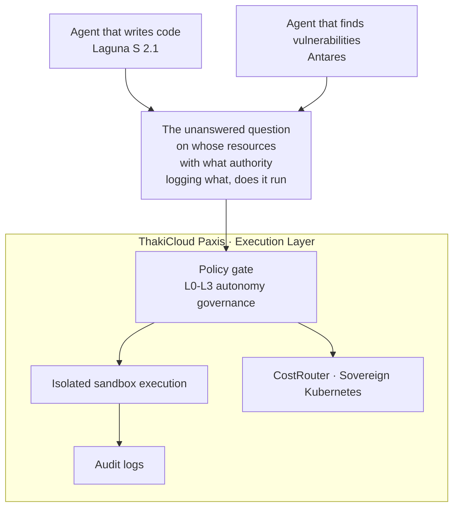

يبدو التطابق دقيقا أكثر من أن يكون محض صدفة. في الثاني والعشرين من يوليو 2026، ظهر نموذجان مفتوحا الأوزان، متعاكسان تماما في طبيعتهما، إلى العالم في اليوم نفسه. أحدهما يكتب الكود، والآخر يبحث عن ثغرات ذلك الكود. أطلقت شركة Poolside نموذج Laguna S 2.1 المخصص لوكلاء البرمجة الذين يستضيفهم المستخدم بنفسه، بينما كشفت سيسكو عن Antares، نموذج صغير مفتوح الأوزان متخصص في كشف الثغرات البرمجية. السيف والدرع معروضان جنبا إلى جنب في الواجهة نفسها.

عند قراءة هذين الإصدارين كل على حدة، يبدوان خبرين عاديين. أما عند وضعهما جنبا إلى جنب، فتتغير القصة كليا. فهذا يعني أن الجهة التي تصنع البرمجيات والجهة التي تدقق تلك البرمجيات تنتقلان في الوقت نفسه إلى نموذج الوكلاء. وفي اللحظة التي يضع فيها أي طرف كلا النموذجين على بنيته التحتية الخاصة، يبقى سؤال لا يجيب عليه أحد بالنيابة عنه، وهو على بنية تحتية من، وبأي صلاحية، وبأي سجل يتم توثيقه، تعمل هذه الوكلاء فعليا.

## نفس اليوم، من الطرف المقابل تماما

يمثل Laguna S 2.1 من Poolside ورقة رد أقرب ما تكون إلى الجبهة الغربية. جاء هذا الإعلان في سياق التيار الذي كانت تتصدره نماذج مفتوحة الأوزان من أصل صيني مثل DeepSeek وQwen في مجال وكلاء البرمجة. وصفته وسائل إعلام أجنبية بأنه الخيار الأكثر موثوقية بين النماذج الغربية مفتوحة الأوزان خلال العام الماضي لغرض البرمجة الوكيلية المستضافة ذاتيا. واللافت هنا ليس الأداء بل الحجم. فبنية منخفضة التنشيط تضم ثمانية مليارات معامل نشط استطاعت مجاراة منافسين أكبر بأضعاف في مقاييس الأداء، وهذا يعني أن الرسالة الحقيقية هي خفض تكلفة الاستدلال وعبء التشغيل على المنشأة في آن واحد. والقدرة على تشغيله على جهاز واحد بمستوى DGX Spark تعني أنه يمكن الآن تشغيل وكيل برمجة مخصص حتى على تقسيمات GPU صغيرة.

يطرح Antares من سيسكو المنطق نفسه من الجهة المقابلة. فالنماذج اللغوية الصغيرة التي تعمل على الجهاز مباشرة تتفوق على النماذج العامة الضخمة في مجال الأمن من ناحيتي التكلفة والدقة معا. وتقول سيسكو إن Antares تفوق في مقاييس الأداء على أكثر من عشرة نماذج كبيرة مفتوحة ومغلقة المصدر، مع كلفة تشغيل أقل بكثير. والعامل الحاسم هنا هو موقع التنفيذ. فتشغيله محليا يعني أن الكود المصدري لا يغادر البيئة الداخلية، وهذه الجملة وحدها هي التي تحدد إمكانية التبني في القطاعين المالي والحكومي حيث تشدد القيود على تصدير الكود المصدري.

النموذجان متعاكسان في الاتجاه، لكن فلسفة التصميم واحدة، وهي أن يصغر الحجم، وأن يفتح الوزن، وأن يعمل على بنية تحتية داخلية لا على سحابة الغير. حتى استراتيجية النشر متشابهة، فالممارسة الشائعة الآن لدى الشركات الناشئة في مجال الأمن والبائعين الكبار على حد سواء هي طرح النموذج الأساسي مفتوح الأوزان مع الاحتفاظ بأفضل نسخة أداء داخل المنتج التجاري الخاص بالشركة. وهكذا يعاد تشكيل كل من التوليد والتدقيق وفق قواعد الاستضافة الذاتية جنبا إلى جنب.

## النقطة التي غيرت فيها الأوزان المفتوحة قواعد التدقيق

كان فحص الثغرات البرمجية في السابق يعتمد غالبا على استدعاء نموذج طليعي، وكانت المشكلة مزدوجة، إذ كانت التكلفة تعيق التشغيل المستمر، وكان الكود المصدري موضع الفحص يتسرب إلى واجهة برمجة تطبيقات خارجية. وهذا هو السبب الذي دفع عددا كبيرا من فرق الأمن المحلية إلى التخلي عن الفحص المستمر بسبب قيود الميزانية. يعالج Antares هذين العائقين في آن واحد، فالتشغيل المحلي يزيل مشكلة التصدير، والنموذج الصغير يخفض التكلفة. وفي هذا السياق بالذات، حددت سيسكو صراحة الجامعات والقطاع العام وفرق الأمن الصغيرة ذات الميزانية المحدودة كجمهور مستهدف.

وينطبق المنطق نفسه على جانب التوليد أيضا. فامتلاك Laguna S 2.1 لترخيص متساهل إلى جانب كونه مفتوح الأوزان يوسع من إمكانية بناء مساعد برمجة مستضاف ذاتيا في القطاعين المالي والعام اللذين يتعين عليهما تلبية بيئات معزولة عن الشبكة أو متطلبات جهات رقابية وطنية. وهذا يعني ظهور خيار إضافي لتقليل الاعتماد على واجهات برمجة التطبيقات المغلقة. غير أن هذه الحرية تحمل معها واجبا، فبيئة التوزيع والدعم المحلية وقدرة النموذج على التعامل مع التعليقات البرمجية باللغة الكورية لم تُختبر بعد، لذلك يجب أن يمر أي تبني فعلي أولا باختبار إعادة إنتاج مقاييس الأداء واختبار ملاءمة البيئة المحلية.

مع ذلك، رسمت سيسكو حدودها بنفسها، إذ أوضحت أن هذا النموذج لا يحل محل تحليل التبعيات ولا فحص المعلومات السرية ولا الاختبار الديناميكي، وأن مكانه الصحيح هو مرحلة الفرز الأولي. وهذا حد صريح وصادق. وهذا الحد بالذات هو ما يقودنا إلى الموضوع الحقيقي لهذا المقال، وهو أن نموذج التوليد ونموذج التدقيق كليهما لا يؤديان في النهاية سوى جزء من الدور، بينما يظل ربط هذين الجزأين في تدفق واحد قابل للمساءلة مسألة منفصلة تماما.

## الفجوة التي لا يسدها لا التوليد ولا التدقيق

أظهر خبر آخر في اليوم نفسه هذه الفجوة بوضوح تام. أعلنت منصة التجارة الإلكترونية المحلية Imweb أنها أدخلت الذكاء الاصطناعي في كامل عمليات التطوير والتشغيل لديها، ما خفض عملا كان يستغرق أربع سنوات إلى ثلاثة أشهر فقط. وتبنت ثقافة محافظة تستخدم نماذج OpenAI وAnthropic وGoogle في وقت واحد للتحقق المتبادل. لكن جملة واحدة تستوقف القارئ، وهي أن اكتشاف أي خلل في البنية التحتية يؤدي إلى تراجع تلقائي فوري عن النشر دون موافقة بشرية. هذا إنجاز يستحق الفخر من زاوية الإنتاجية، لكنه إشارة إنذار من زاوية الحوكمة. فوكيل يستطيع التراجع عن بيئة الإنتاج من دون موافقة يعني أنه قادر أيضا على القيام بأمور أخرى من دون موافقة.

وتشير الإشارة القادمة من القطاع العام إلى النتيجة نفسها من الاتجاه المعاكس تماما. فعند إدخال خدمات الذكاء الاصطناعي التوليدي، وضعت مؤسسة التأمين على الودائع بناء فهرس البيانات ونظام إدارة مخاطر الذكاء الاصطناعي كأولوية سابقة لاختيار النموذج نفسه. وكون مؤسسة تدير أصول المواطنين تضع منظومة الضبط قبل النموذج يكشف بوضوح أن العتبة الحقيقية لتبني الذكاء الاصطناعي في الصناعات الخاضعة للتنظيم ليست الأداء، بل قابلية التفسير وإمكانية تتبع المساءلة. في جهة، يتقدم الاستقلال الذاتي، وفي الجهة الأخرى، يتأسس الضبط أولا. وعند نقطة التقاء هذين المطلبين، توجد اليوم فجوة في طبقة موحدة غائبة.

نموذج التوليد يصنع الكود، ونموذج التدقيق يبحث عن عيوب ذلك الكود. غير أن تسجيل درجة الاستقلالية التي يتحرك بها ذلك الوكيل، والسياسة التي يحصل بموجبها على الإذن للتنفيذ، وما الذي لمسه ومتى، لا يقع ضمن اختصاص أي من النموذجين. هذه ليست مشكلة النموذج، بل مشكلة طبقة التنفيذ.

## سيادة العتاد وحدها لا تغلق الفجوة

قد يبدو أن سد هذه الفجوة ممكن من خلال حجم البنية التحتية، لكن أخبار اليوم نفسها تقول عكس ذلك. ففي اليوم ذاته، التقى رؤساء ثلاث مجموعات، لي جاي يونغ وتشوي تاي وون ولي هاي جين، جنسن هوانغ في وادي السيليكون لإعادة تفعيل تحالف سلسلة توريد الذكاء الاصطناعي المتمحور حول إنفيديا، وهي خطوة كبرى قد تهز مشهد بنية الذكاء الاصطناعي السيادية المحلية. وأطلقت سامسونج SDS خدمة NPUaaS المعتمدة على وحدة معالجة عصبية محلية من FuriosaAI، وهي أول تجارية لبديل محلي عن الاعتماد شبه الكامل على وحدات GPU في بنية الاستدلال. وبالنسبة للقطاعين العام والمالي، فهذا يعني ظهور خيار سيادي إضافي لتقليل الاعتماد على وحدات GPU الأجنبية، وقد تظهر مستقبلا وحدات المعالجة العصبية المحلية كشرط في مناقصات السحابة الحكومية.

تُملأ السيادة على مستوى الرقائق ومراكز البيانات وسلاسل التوريد بسرعة كبيرة. لكن سيادة العتاد لا تجيب سوى عن نصف السؤال. فتشغيل وكيل برمجة مستضاف ذاتيا فوق وحدة معالجة عصبية محلية لا يعرّف تلقائيا ما الذي يملك ذلك الوكيل صلاحية القيام به وما الذي يجب أن يسجله. فمنع التصدير وضبط التنفيذ مسألتان في طبقتين مختلفتين تماما. وكلما اكتملت البنية التحتية السيادية، برز بشكل أوضح غياب طبقة تحدد بالبرمجيات درجة استقلالية الوكيل الذي يعمل فوقها وآلية تدقيقه.

## المطابقة تتم في طبقة التنفيذ

إذا رسمنا في صورة واحدة التوليد والتدقيق والفجوة القائمة بينهما، تكون النتيجة كما يلي.

منصة Paxis من ThakiCloud تتناول بالضبط هذه الطبقة الغائبة. Paxis منتج فعلي يمثل سحابة مخصصة للوكلاء، يعامل المهارات والأدوات والسياسات وسجلات التدقيق كموارد أساسية من الدرجة الأولى. سواء وصلت وكيل برمجة مثل Laguna S 2.1 بالخلفية، أو وصلت نموذج تدقيق مثل Antares في مقدمة عملية الفحص، فإن ذلك الوكيل يمر في النهاية عبر بوابة سياسة ويُنفذ داخل صندوق رملي معزول، وتُسجَّل كل تصرفاته في سجل تدقيق. وإذا بدا التراجع التلقائي بلا موافقة في حالة Imweb مثيرا للقلق، فإن حوكمة الاستقلالية في Paxis الممتدة من المستوى L0 إلى L3 هي الوجه المقابل لذلك القلق، إذ يمكن الإعلان بالسياسة لا بالكود عن الحد الفاصل بين المهام التي تُترك للاستقلالية الكاملة والمهام التي تُلزَم بموافقة بشرية.

وتلتقي المتطلبات السيادية عند الطبقة نفسها. فكما أن Antares لا يكتسب معناه إلا حين يعمل محليا من دون تصدير الكود المصدري، تعمل Paxis فوق بنية Kubernetes سيادية أو داخلية، وتمتلك CostRouter الذي يختار النموذج المناسب لكل مهمة. وأسلوب تضييق نطاق الملفات المشتبه بها عبر نموذج محلي منخفض التكلفة، ثم استدعاء نموذج أكبر عند الحاجة فقط، هو بالضبط التنفيذ على مستوى البنية التحتية لذلك التصميم الذي أوصت سيسكو بوضع Antares فيه كمرشح أولي. وحتى مع إضافة نماذج وأدوات جديدة عبر موصلات MCP وسوق المهارات، لا تتغير قواعد التنفيذ والتسجيل. وحتى منظومة إدارة البيانات وإدارة المخاطر التي سعت مؤسسة التأمين على الودائع إلى بنائها قبل النموذج نفسه، تُستوعب هنا ضمن طبقة السياسات والتدقيق التي توفرها المنصة افتراضيا، بدلا من إعادة بنائها من الصفر في كل مشروع على حدة.

وهنا قد يُطرح اعتراض مشروع، وهو ألا يكون هذا مجرد طبقة ضبط إضافية أخرى، تعيد تقييد السرعة والاستقلالية التي استعادتها الأوزان المفتوحة بصعوبة تحت اسم السياسة والتدقيق. فإذا كانت Imweb قد أنجزت عملا يستغرق أربع سنوات في ثلاثة أشهر عبر التراجع الفوري دون موافقة بشرية، فتلك السرعة نفسها قد تكون مصدر التفوق التنافسي. هذا اعتراض وجيه. غير أن هدف حوكمة الاستقلالية ليس إلغاء الاستقلالية، بل رسم حدودها بوضوح صريح. فحين تُحدَّد سلفا المهام التي يجوز التراجع عنها دون موافقة والمهام التي تستلزم مرور إنسان بالضرورة، يمكن في الحيز الآمن التفويض بجرأة أكبر لا أقل. فحين تكون الحدود غامضة، يميل الفريق إلى الشك في كل أتمتة، أما حين تكون الحدود مرسومة بسياسة واضحة، يعمل الفريق داخلها بثقة واطمئنان. الضبط والسرعة ليسا في تضاد، بل يكبران معا حين تكون الحدود واضحة. ووضع مؤسسة التأمين على الودائع منظومة الضبط قبل النموذج لم يكن تأخيرا للتبني، بل خيارا لجعل ذلك التبني مستداما.

يعلن إصدارا الثاني والعشرين من يوليو أن الوكلاء بدأوا يمتلكون في الوقت نفسه القدرة على كتابة الكود ومراقبته، وهذا تقدم يستحق الترحيب. غير أن اتساع القدرة يوسع معه فجوة المساءلة أيضا. فكلما ازداد انتشار الوكلاء المولدة للكود والوكلاء المدققة له، ازدرد ندرة المكان الذي تُنفَّذ فيه هذه الوكلاء بأمان وتُسجَّل فيه أفعالها بلا نقصان. وبعد أن يكتمل السيف والدرع معا، يبقى سؤال واحد، وهو على قواعد من، في النهاية، يتقاتل هذان الطرفان. لقد أصبح اختيار النموذج أسهل يوما بعد يوم، غير أن تحمل المسؤولية عن النتيجة التي يصنعها ذلك النموذج لا يزال أمرا صعبا. وما يخبرنا به السيف والدرع المعلقان جنبا إلى جنب اليوم هو أن ساحة المنافسة المقبلة ليست النموذج الأكبر، بل طبقة التنفيذ التي تجعل تلك النماذج تعمل بأمان وحياة فعلية.

## المصادر

هذا المقال يجمع بين التغطية الإخبارية التالية:

- 글로벌경제، [엔비디아, 차세대 AI플랫폼 '베라루빈' 본격 공급 통해 "선두 수성"](https://www.getnews.co.kr/news/articleView.html?idxno=875704)
- 머니투데이، [LGU+·LS일렉트릭, AI 데이터센터 800V DC 공동 개발 나선다](https://www.mt.co.kr/tech/2026/07/22/2026072207035073681)
- 글로벌이코노믹، [HPE, 슈퍼컴퓨팅 개발환경 통합…소버린 AI 인프라 간소화](https://www.g-enews.com/view.php?ud=202607212059199803112616b072_1)
- 뉴스웍스، [[#클라우드 월드] 삼성SDS-퓨리오사AI 'NPUaaS' 출시·LG CNS 'AI 캠퍼스'...](https://www.newsworks.co.kr/news/articleView.html?idxno=847787)
- 지디넷코리아، ["SKT, AI팩토리에 가장 적극적인 통신사...풀스택AI·전국망 경쟁력"](https://zdnet.co.kr/view/?no=20260721191819)
- 약업신문، [BMS‧엔비디아, 생명공학 최강 AI 팩토리 구축](https://www.yakup.com/news/index.html?mode=view&cat=16&nid=330043)
- 글로벌이코노믹، [미국 데이터센터 전력 수요 급증… 호남 반도체 허브, 전력망·용수가 ...](https://www.g-enews.com/view.php?ud=202607220659395424fbbec65dfb_1)
- 디지털투데이، [풀사이드, 코딩 에이전트용 오픈웨이트 모델 '라구나 S 2.1' 공개](https://www.digitaltoday.co.kr/news/articleView.html?idxno=685807)
- 이투데이، [키미 쇼크에 ‘AI 2강’ 험로…'특화 AI' 키우고, 경량화 모델로 차별화...](https://www.etoday.co.kr/news/view/2605803)
- 디지털투데이، [포티투마루, 예금보험공사 데이터 관리체계 고도화·생성형 AI 서비스 구...](https://www.digitaltoday.co.kr/news/articleView.html?idxno=685817)
- 뉴스투데이، [밖에선 AI 인재 찾고 안에선 업무 혁신…NHN의 AX '승부수'](https://www.news2day.co.kr/article/20260721500191)
- 바이라인네트워크، [“4년 걸린 일을 3개월에”…아임웹이 안팎으로 AI 쓰는 법](https://byline.network/?p=9004111222612588)
- IT조선، [내년 지원 불투명한데…정부 '모두의 AI' 출시 서두르나](https://it.chosun.com/news/articleView.html?idxno=2023092166202)
- EBN، [이재용·최태원·이해진, 美서 젠슨 황 만난다…AI 공급망 동맹 재가동](https://www.ebn.co.kr/news/articleView.html?idxno=1717215)
- 디지털투데이، [시스코, 코드 취약점 탐지 특화 오픈웨이트 소형 모델 '안타레스' 공개](https://www.digitaltoday.co.kr/news/articleView.html?idxno=685800)
- 뉴스저널리즘، [AI가 바꾼 보안 공식…에스원 '현장 데이터'로 승부](https://www.ngetnews.com/news/articleView.html?idxno=551683)
