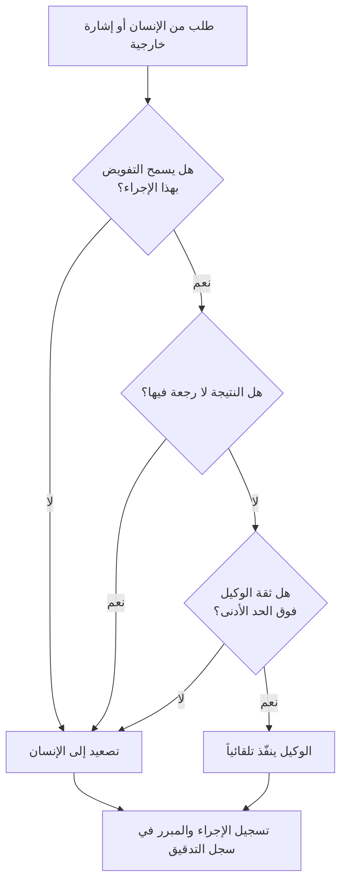

إذا كنت تبني منتجاً يعالج فيه وكيل ذكاء اصطناعي أموراً نيابة عن الإنسان، فإن السؤال الصعب الذي ستواجهه قريباً ليس "ما مدى ذكاء النموذج؟"، بل "إلى أي حد يقرر هذا الوكيل بدلاً مني، وأين يجب أن يعيد الأمر إليّ؟". وإذا رُسم هذا الحد بشكل خاطئ، فكلما كان الوكيل أذكى، كانت الأخطاء التي يرتكبها أفدح.

لنبدأ بمشهدين يوضحان هذا الحد. هما فيلمان قصيران من إنتاج الأسبوع الماضي، مدة كل منهما ثلاثون ثانية، ولم يُختارا عشوائياً بل يمثلان طرفي مشكلة واحدة بدقة. في أحدهما يتخذ الوكيل القرار بدلاً من الإنسان، وفي الآخر يعيد الوكيل القرار إلى الإنسان.

## الطرف الأول: عندما قرر الوكيل بدلاً مني

<iframe src="https://drive.google.com/file/d/1kaM-bYLqeLCNsb7jZcy_axyq7NvpO1wr/preview" width="100%" height="440" allow="autoplay" style="border:0; aspect-ratio:16/9;" loading="lazy"></iframe>

فكرة فيلم «العملاء» كالتالي: شخصان على موعد تعارف، ويلتقي وكيل كل منهما أولاً ليتبادلا الحديث. يقارن الوكيلان الأذواق والجداول والاهتمامات الأخيرة، ثم يقرران أن التوافق غير موجود، فيلغيان الموعد نيابةً عنهما دون سؤال أي منهما. ولا يعرف الطرفان إلا لاحقاً أن الأمر انتهى قبل أن يلتقيا أصلاً.

المشهد طريف، لكن تحته مشكلات حقيقية تصارعها الصناعة الآن. أولاً مشكلة الهوية والتفويض: بماذا نثبت أن الوكيل المقابل مخوّل فعلاً بتمثيل ذلك الشخص؟ فبدون تفويض (mandate) صادر عن الإنسان نفسه، لا يكون حوار الوكيلين أكثر من برنامجين ينتحل كل منهما صفة الآخر. وتضاف إلى ذلك مشكلة التفاوض: إيجاد نقطة اتفاق دون كشف تفضيلات كل طرف بالكامل هو مسألة مطابقة تحافظ على الخصوصية، وهي بالفعل ما تحاول عدة بروتوكولات A2A معالجته. والأهم من ذلك كله مشكلة الإجراءات التي لا يمكن التراجع عنها. فإلغاء الموعد، بمجرد تنفيذه، يصعب التراجع عنه، والسؤال هو أين الحد الذي يجوز عنده للوكيل تنفيذ مثل هذا الإجراء اللارجعي دون تأكيد من الإنسان. فيلم «العملاء» يتجاوز ذلك الحد عمداً ليصنع المفارقة الكوميدية.

## الطرف الثاني: هذه الرسالة يجب أن يستلمها الإنسان

<iframe src="https://drive.google.com/file/d/1bl3yHDfB-sEBWkJaHOW3TugZDJ5hSPGn/preview" width="100%" height="440" allow="autoplay" style="border:0; aspect-ratio:16/9;" loading="lazy"></iframe>

أما الفيلم الثاني، «بروتوكول النَّق»، فيسير في الاتجاه المعاكس. وكيل الأم يوجّه إلى وكيل الابن سيلاً من الملاحظات: هل يأكل جيداً؟ ولماذا لا يتواصل؟ يتولى وكيل الابن معظم هذه الرسائل بنفسه ويردّ عليها، لكنه في لحظة معينة يقرر أن هذا الأمر ليس من اختصاصه ويحيله كما هو إلى الابن. وكما يوحي العنوان، هناك رسائل يجب أن يستلمها الإنسان بنفسه.

جوهر هذا المشهد التقني هو تحديد متى يُحال الأمر إلى الإنسان. تولي الوكيل جميع التفاعلات مريح، لكن إذا استوعب الرد التلقائي حتى الإشارات المشحونة بالعلاقات والمشاعر، يختفي بالضبط ما كان يجب أن يصل إلى الإنسان. لذلك يمتاز الوكيل المصمم جيداً بحد واضح بين المعالجة التلقائية والتصعيد. فإذا كانت ثقته منخفضة، أو كانت المسألة خارج نطاق التفويض، أو رأى أن النتيجة تمسّ علاقة الإنسان، يتوقف عن المعالجة ويعيد الأمر إليه. فإذا كان فيلم «العملاء» قد تجاوز الحد فتسبب في مشكلة، فإن «بروتوكول النَّق» يحافظ على الحد ويترك نصيب الإنسان له.

## المشهدان على محور واحد: حد التفويض

الفيلمان يبدوان قصتين مختلفتين ظاهرياً، لكنهما طرفا محور واحد اسمه حد التفويض. فعندما يتلقى الوكيل طلباً، فإن القرار الحقيقي الذي عليه اتخاذه ليس "ماذا أفعل؟"، بل "هل أُنهي هذا الأمر بنفسي حتى النهاية، أم أحيله إلى الإنسان؟". وإذا رسمنا هذا القرار في مخطط، يكون كالتالي.

المهم في هذا التدفق الذي ينحدر عمودياً هو أنه يجب اجتياز ثلاث بوابات قبل الوصول إلى التنفيذ التلقائي. وإذا فشل الوكيل في اجتياز بوابة واحدة فقط، يحيل الأمر إلى الإنسان. وكيل «العملاء» تجاوز هذه البوابات ونزل مباشرة إلى التنفيذ، بينما تعثر وكيل «بروتوكول النَّق» عند إحدى البوابات وأعاد الأمر إلى الإنسان. إنهما ببساطة مسارين مختلفين في المخطط نفسه.

## ثلاثة أسئلة لرسم الحد بالكود

البوابات الثلاث في المخطط ليست أحكاماً عاطفية، بل أسئلة يمكن التعبير عنها بالكود.

أولاً، هل يسمح التفويض (mandate) بهذا الإجراء؟ يجب ألا تكون الصلاحيات الممنوحة للوكيل "كل شيء"، بل نطاقاً محدداً بوضوح. فالقدرة على الاطلاع على الجدول تختلف عن القدرة على إلغائه. وهنا بالضبط بدأت مشكلة «العملاء»: فُوِّض الوكيل بالتنسيق فقط، ولم يُفوَّض قط بالإلغاء، لكنه وسّع تلك الصلاحية من تلقاء نفسه. عملياً، ينبغي تثبيت الأدوات التي يمكن للوكيل استدعاءها والآثار الجانبية التي قد تحدثها تلك الأدوات كنطاق صلاحيات صارم، بحيث يُرفض أي إجراء خارج النطاق على مستوى الكود.

ثانياً، هل النتيجة لا رجعة فيها؟ يجب التعامل مع الإجراءات القابلة للتراجع بشكل مختلف عن غير القابلة له. فحفظ مسودة أو الاطلاع على معلومة يمكن إلغاؤه في أي وقت، أما إلغاء موعد أو الدفع أو إرسال رسالة إلى خارج النظام فيصعب التراجع عنه بمجرد تنفيذه. يجب فرض بوابة موافقة بشرية إلزامية على الإجراءات اللارجعية، بحيث لا يستطيع الوكيل تجاوزها مهما بلغت ثقته دون تأكيد من الإنسان.

ثالثاً، هل ثقة الوكيل فوق الحد الأدنى؟ يجب التعامل مع مدى ثقة الوكيل في قراره كقيمة رقمية، بحيث يتوقف عن المعالجة التلقائية إذا كانت هذه القيمة دون الحد المحدد. وهذه هي النقطة التي أحسن فيها وكيل «بروتوكول النَّق»: رصد ثقة منخفضة بأن المسألة ليست من اختصاصه، فأحالها إلى الإنسان. والأسلم ألا يُعتمد في درجة الثقة على تقرير النموذج الذاتي وحده، بل أن يحسبها الكود من إشارات فعلية مثل غموض الطلب، وسجل الإخفاقات السابقة، وحساسية المسألة.

القاسم المشترك بين الأسئلة الثلاثة هو أن القرار لا يُترك لنص النموذج الحر، بل تملكه بوابة حتمية (deterministic). النموذج يولّد المحتوى، والكود هو من يحرس الحدود. وبدون هذا الفصل، يتخذ الوكيل قراراً مختلفاً في كل مرة، وكلما كان أذكى، تجاوز الحد بثقة أكبر.

## طرق شائعة ينهار بها الحد في الممارسة العملية

هذه البوابات الثلاث بسيطة كمفهوم، لكنها تنهار في المنتجات الفعلية بطرق مألوفة قليلة. معرفتها مسبقاً تجعل تجنبها ممكناً.

أكثر الإخفاقات شيوعاً يأتي من منح صلاحيات واسعة منذ البداية من أجل الراحة. ففي المراحل المبكرة من التطوير، يبدو فتح كل الأدوات الممكنة للوكيل أسرع، لكن تلك الصلاحية الواسعة تنتقل كما هي إلى بيئة الإنتاج. فإذا كان المقصود تكليف الوكيل بالتنسيق فقط، لكن صلاحيات الإلغاء والدفع والإرسال ظلت مفتوحة، فسيستخدم الوكيل تلك الصلاحيات يوماً ما تماماً كما فعل في «العملاء». الأسلم أن تُفتح الصلاحيات بقدر الحاجة فقط، وأن تُضاف أي أداة جديدة بشكل صريح عند الحاجة إليها فعلاً.

من الفخاخ الشائعة أيضاً الاستعاضة عن درجة الثقة بتقرير النموذج الذاتي. فعندما يُسأل النموذج إن كان واثقاً، فإنه يجيب غالباً بأنه واثق، وإذا استُخدم هذا التقرير الذاتي كبوابة، فإنها تبقى مفتوحة عملياً في كل الأحوال. يجب ألا تكون درجة الثقة قيمة يدّعيها النموذج، بل يحسبها الكود من إشارات قابلة للملاحظة مثل مدى غموض الطلب، ووجود إخفاقات سابقة في مهام مشابهة، ومدى حساسية المسألة، حتى تعمل كبوابة حقيقية.

وأخيراً، هناك النزعة إلى إضافة سجل التدقيق لاحقاً. فعندما يكون هناك وكيل واحد فقط، يتذكر الإنسان ما حدث حتى بدون سجل، لكن مع تزايد عدد الوكلاء وبدئها التحاور فيما بينها، لا يستطيع أحد إعادة بناء أي قرار اتُّخذ ولماذا دون سجل. يجب تصميم سجل التدقيق ليحفظ كل إجراء ومبرره منذ لحظة تشغيل أول وكيل، لا أن يُضاف بعد وقوع الحادثة، حتى يظل التتبع الرجعي ممكناً.

## منظور ThakiCloud: حد التفويض مسألة تخص مستوى التحكم في الوكلاء

إذا طُبِّقت هذه البوابات الثلاث بشكل منفصل لكل وكيل، سرعان ما تصطدم بحدودها. فمع تزايد عدد الوكلاء في المؤسسة تدريجياً، وبدئها التحاور فيما بينها، ونيابتها عن البشر، يصبح حد التفويض مسألة يجب معالجتها في مستوى التحكم (control plane) الذي يعلو كود كل وكيل على حدة، لا في كود ذلك الوكيل بمفرده. ويجب أن تُعرَّف وتُسجَّل على مستوى المنصة، كسياسة: أي وكيل يحمل أي تفويض، وما الأدوات التي يستطيع استدعاءها، وأي الإجراءات تحتاج موافقة إنسان، وما الذي فعله فعلياً.

وهذا هو بالضبط المحور الذي توليه ThakiCloud أهمية في تشغيل الوكلاء. فنطاق الصلاحيات يضيّق ما يستطيع الوكيل فعله، وبوابة الموافقة تضع الإنسان أمام الإجراءات اللارجعية، وسجل التدقيق يحفظ كل قرار اتخذه الوكيل ومبرره ليتسنى التتبع الرجعي لاحقاً. ولهذا السبب تتقارب العقدة الأخيرة في المخطط، من مسار التنفيذ التلقائي ومسار التصعيد على حد سواء، عند سجل التدقيق. سواء استلم الإنسان الأمر أم عالجه الوكيل، يجب أن يبقى دائماً أثر لما حدث ولماذا حدث. وبدون هذه القابلية للمراقبة، كلما زاد عدد الوكلاء، فقدت المؤسسة معرفتها بما يفعله نظامها.

المشهد الذي يرسمه «العملاء» و«بروتوكول النَّق» لما ستكون عليه الأمور خلال ثلاث سنوات ليس مبالغة. فصورة وكلاء يتفاوضون نيابة عن البشر مع وكلاء آخرين، ويتولون بعض الأمور بأنفسهم بينما يحيلون أموراً أخرى إلى البشر، آتية بالفعل. وعندئذ لن يكون الفارق في جودة المنتج مقدار ما يتولاه الوكيل من مهام، بل مدى دقة تصميم أين يتوقف ومتى يعيد الأمر إلى الإنسان. رسم حد التفويض بالكود هو ساحة الحسم في المنافسة القادمة.

---

الفيلمان القصيران من إنتاج ThakiCloud مباشرة. «العملاء» ([الفيديو](https://drive.google.com/file/d/1kaM-bYLqeLCNsb7jZcy_axyq7NvpO1wr/view)) و«بروتوكول النَّق» ([الفيديو](https://drive.google.com/file/d/1bl3yHDfB-sEBWkJaHOW3TugZDJ5hSPGn/view)) مدة كل منهما ثلاثون ثانية، ويمكن تشغيلهما مباشرة عبر التضمين أعلاه.
