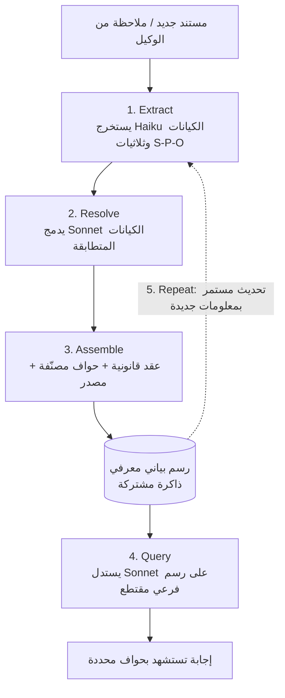

## لماذا تستحق القراءة

إن كنت تبني أنظمة متعددة الوكلاء أو منتجات وكيلية تعمل لفترات طويلة، فهذا المقال قد يجعلك تؤجل سؤال "هل أحتاج نموذجًا أكبر؟". الخلاصة أولًا: ذاكرة الوكيل تموت مع نافذة السياق، ولا تصبح دائمة إلا حين تُستخدم رسمة معرفية كذاكرة مشتركة. وضع مهندس أول في Anthropic مؤخرًا هندسة الرسوم البيانية للأنظمة متعددة الوكلاء في وثيقة من اثنتي عشرة صفحة، وهيكلها خمس خطوات هي Extract وResolve وAssemble وQuery وRepeat. هذا المقال يشرح لماذا يهم هذا الهيكل الآن، وكيف يُدمج في نظام حقيقي.

## نظرة عامة

من شغّل وكلاء لفترة طويلة يصطدم بالجدار نفسه. ما اكتشفه العامل بالأمس لا يعرفه عامل اليوم. حين تطول المحادثة، تخرج بدايتها من نافذة السياق، وفي تلك اللحظة ينسى الوكيل ما كان يعرفه للتو. الذاكرة تتبخر على مستوى الجلسة.

الحل المعتاد هو RAG المتجهي: تُحوَّل المستندات إلى تمثيلات متجهة وتُستدعى القطع المشابهة. هذا يحل مشكلة "إيجاد شيء مشابه"، لكنه يبقى غامضًا حيال "من فعل ماذا، وبِمَ يرتبط ذلك". إذا ظهر الشخص نفسه بأسماء مختلفة عبر المستندات، لا تستطيع المتجهات دمجهما في كيان واحد. الاستدلال عبر خطوتين أو ثلاث خطوات من العلاقات ليس مستقرًا أيضًا بالاعتماد على تشابه التمثيلات المتجهة وحده.

هندسة الرسوم البيانية تعطي إجابة مختلفة هنا. بدل تخزين المعلومة ككتلة واحدة، تُسجَّل العلاقة بين الكيانات في رسم بياني صريح. عندها تصبح ذاكرة الوكيل بنية قابلة للاستعلام لا كومة جمل.

## ما هي هذه التقنية

الفكرة الأساسية بسيطة. يُستخرج ما قرأه الوكيل وما شهده على شكل ثلاثيات فاعل-فعل-مفعول (S-P-O) وتُجمَّع في رسم بياني معرفي، ويُقتطع جزء من ذلك الرسم عند الحاجة ويُستعلم عنه. العُقد هي الكيانات، والحواف علاقات محددة النوع، وكل ثلاثية تحمل مصدرًا (provenance) يشير إلى أصلها.

إن كانت نافذة السياق هي "ما يمكن رؤيته الآن"، فالرسم البياني المعرفي هو "ما تأكد حتى الآن". الأول يختفي بانتهاء الجلسة، والثاني يبقى. هذا الفصل هو جوهر هندسة الرسوم البيانية تقريبًا بأكمله.

فيما يلي البنية الدائرية للخطوات الخمس.

## الخطوات الخمس بالتفصيل

**1. Extract.** عند وصول مستند، يستخرج نموذج رخيص (Haiku) الكيانات وثلاثيات S-P-O. استدعاء واحد لكل مستند يكفي. المثير هنا أنه لا حاجة إلى بيانات تدريب منفصلة. مخطط Pydantic واحد يحدد ما يُستخرج وبأي شكل. المخطط نفسه هو إشارة التدريب الوحيدة. ولأن الكود يملك تنسيق المخرجات والنموذج يملأ المحتوى فقط، تبقى النتائج ثابتة.

**2. Resolve.** تُدمج الكيانات المستخرجة التي تشير إلى الشيء نفسه في كيان واحد. هذه الخطوة يتولاها نموذج أذكى قليلًا (Sonnet). مثلًا "Edwin Aldrin" و"Buzz Aldrin" لا يتشاركان حرفًا واحدًا لكنهما الشخص نفسه. مطابقة النصوص لن تلتقط ذلك أبدًا. يحكم النموذج بأن هذين متطابقان مستخدمًا الوصف المرفق بكل كيان كسياق. جودة حل هوية الكيانات (entity resolution) هي ما يحدد مصداقية الرسم البياني كله.

**3. Assemble.** تتحول الكيانات المدمجة إلى عُقد قانونية، وتُربط بحواف محددة النوع، ويُثبَّت مصدر لكل ثلاثية، ثم يُجمَّع كل ذلك في رسم بياني واحد متصل. وجود المصدر مهم: القدرة لاحقًا على تتبع أي مستند جاءت منه الحقيقة هي ما يسمح بتعقّب المعلومة الخاطئة وإزالتها.

**4. Query.** عند ورود سؤال، يُسلسَل الرسم الفرعي ذو الصلة ويُسلَّم إلى نموذج (Sonnet) يستدل فوق الثلاثيات. كل إجابة تستشهد بحافة محددة. ولأن أساس الإجابة يظهر في علاقة محددة من الرسم البياني، تصبح الإجابة قابلة للتحقق.

**5. Repeat.** عند وصول مستند جديد أو ملاحظة جديدة، تعود الدورة إلى الخطوة الأولى. الرسم البياني ليس ناتجًا يُصنع مرة واحدة وينتهي، بل ذاكرة حية تتحدث باستمرار.

يستحق الانتباه أن توجيه النماذج يختلف من خطوة لأخرى. الاستخراج الكبير يذهب إلى Haiku الرخيص، بينما حل هوية الكيانات والاستدلال عند الاستعلام، وهما يتطلبان حكمًا، يذهبان إلى Sonnet. النموذج المكلف لا يُطلى على كل خطوة، بل يُستخدم فقط حيث الحكم مطلوب فعلًا. هذا بالضبط المبدأ الذي نلتزم به في مهامنا الدفعية الداخلية: العمّال رخيصون، والبوابة وحدها مكلفة.

## كيف تُدمج في الأنظمة متعددة الوكلاء

القيمة الحقيقية للرسم البياني المعرفي تظهر حين تشترك عدة وكلاء في الذاكرة نفسها. وكلاء العمل يكتبون ما اكتشفوه إلى الرسم البياني. وكيل التقييم يتحقق من ادعاءات العامل مقابل الرسم البياني. والحلقة التي تعمل طوال الليل تستلم تقدم الأمس اليوم عبر هذا الرسم البياني نفسه.

هذا يتقاطع مع درس تعلمناه من تشغيل عدة حلقات أتمتة بأنفسنا. نتائج الوكلاء الفرعية الموزَّعة (fan-out) يجب أن تُغلَق دائمًا عبر مرحلة تحقق، وبدون مخزن حقائق مشترك يكون مرجعًا لذلك التحقق، يبدأ كل وكيل من الصفر. الرسم البياني يؤدي دور تلك المرجعية. العامل يكتب إليه، والمقيّم يقارن به، والحلقة التالية ترثه، بشكل طبيعي.

## دلالات على منتجات ThakiCloud

هذه التقنية تلائم منصتنا Paxis بشكل خاص. Paxis هو مستوى تحكم Agent-Native Cloud يعمل فوق ai-platform، ويتعامل مع Skills وTools وPolicies وAudit Logs كموارد من الدرجة الأولى. تتوافق الخطوات الخمس لهندسة الرسوم البيانية مع عدة محاور فيه.

أولًا محور المعرفة. محرك المعرفة في ويكي Paxis يتعامل بالفعل مع المستندات والكيانات كمعرفة مترابطة؛ وإضافة ثلاثيات S-P-O وحل هوية الكيانات فوقه يحولها إلى ذاكرة مشتركة يستطيع الوكلاء الاستعلام عنها. ثانيًا محور التنظيم (orchestration). حين يتوزع نظام متعدد الوكلاء على شكل DAG، فإن كتابة كل عامل إلى الرسم البياني ومقارنة المقيِّم به تغلق حلقة التحقق بالبيانات، لا بالكلام. وأخيرًا محور التدقيق. تثبيت مصدر لكل ثلاثية يسير في الاتجاه نفسه تمامًا مع فلسفة بوابات السياسات وسجلات التدقيق في Paxis. القدرة على تتبع الدليل الذي بُنيت عليه إجابة ما هي ميزة تنافسية بحد ذاتها في بيئات ذات متطلبات تنظيمية أو داخلية (on-premise) صارمة.

من زاوية البنية التحتية، ينطبق منظور ai-platform أيضًا. الاستخراج يستدعي نموذجًا رخيصًا على نطاق واسع، بينما الاستعلام يستدعي نموذجًا أكبر بشكل انتقائي، وهي بنية مناسبة لفصل الخدمة (serving) بحسب طبقة النموذج وتشغيلها على K8s. جدولة مهام الاستخراج الدفعية عبر Kueue وخدمة النماذج الصغيرة برخص عبر vLLM تُبقيان تكلفة تحديث الرسم البياني المستمر تحت السيطرة. الخدمة الرخيصة، عبر ai-platform، تخفض تكلفة إبقاء الرسم البياني حيًا، وهذا بدوره ما يجعل اقتصاديات الوكلاء، عبر Paxis، ممكنة.

## الحدود والاعتراضات

هندسة الرسوم البيانية ليست حلًا شاملًا. أصعب نقطة هي خطأ في حل هوية الكيانات. دمج كيانين مختلفين في كيان واحد بالخطأ ينشر ذلك الخطأ عبر الرسم البياني كله، فيلوث كل استعلام لاحق. والعكس، فصل الكيان نفسه إلى قسمين يفتت الذاكرة. طالما يدخل حكم النموذج في هذه الخطوة، تبقى الأتمتة الكاملة صعبة، ويلزم تدقيق دوري.

الهلوسة في خطوة الاستخراج مشكلة أيضًا. إن اخترع النموذج ثلاثية غير موجودة في المستند، فوجود المصدر وحده لا يؤكد أن تلك العلاقة موجودة فعلًا في ذلك المصدر. المخطط يفرض الشكل، لا صحة المحتوى.

مع اتساع الحجم يتضخم الرسم البياني وتزداد كمون الاستعلام. اقتطاع الرسم الفرعي ذي الصلة يصبح بحد ذاته مشكلة بحث، وإن كانت القطعة المقتطعة كبيرة جدًا، تعود المشكلة إلى حدود نافذة السياق من جديد. وإن لم تكن المشكلة أصلًا بحاجة إلى استدلال علاقي، فإن RAG المتجهي العادي أرخص وأسرع من رسم بياني ثقيل. الترتيب الصحيح هو أن تحدد أولًا هل طبيعة المشكلة "إيجاد شيء مشابه" أم "تتبع علاقة"، قبل اللجوء إلى الرسم البياني.

## خلاصة

منح الوكيل ذاكرة دائمة لا يُحل بشراء نموذج أكبر. يجب تغيير البنية التي تموت فيها الذاكرة مع نافذة السياق، واستخدام الرسم البياني المعرفي كذاكرة مشتركة هو أفضل حل عملي متاح حتى الآن. Extract للاستخراج، وResolve للدمج، وAssemble للتجميع، وQuery للإجابة مع الدليل، وRepeat للتحديث: هذه الخطوات الخمس هي الطريقة.

لا داعٍ للبداية بشيء كبير. عرّف مخطط Pydantic صغيرًا واحدًا حول أهم الكيانات والعلاقات في مجالك، واستخرج من مستند واحد بنموذج رخيص. من هناك ينمو الرسم البياني. في المرة القادمة التي يقول فيها الوكيل "كنت أعرف ذلك بالأمس ثم نسيته"، تذكّر أن الإجابة ليست نموذجًا أكبر، بل بنية ذاكرة أفضل.

## المصادر

- [Codez (@0xCodez), "Graph Engineering for multi-agentic systems" (X)](https://x.com/0xCodez/status/2080250266851463209)
- [Anthropic Engineering, "How we built our multi-agent research system"](https://www.anthropic.com/engineering/multi-agent-research-system)
