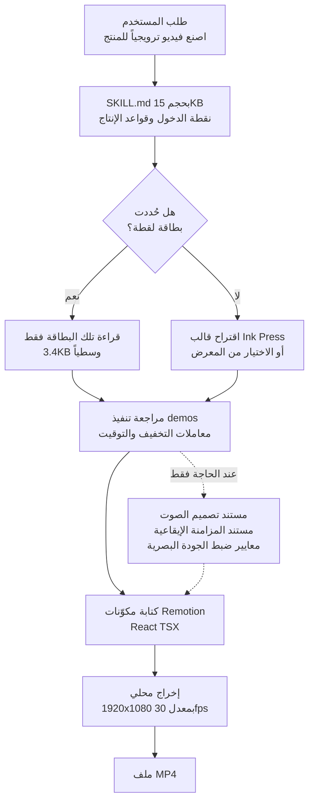

هل يمكن أن تُسند فيديو منتج ترويجياً إلى وكيل؟ نجيب هذه المرة بأرقام من عملية إخراج نفّذناها بأنفسنا. خرج فيديو ترويجي مكتمل بدقة 1920x1080 ومدة 36.17 ثانية من حاسوب MacBook بـ 12 نواة خلال 22.76 ثانية، أي أسرع من زمن تشغيله نفسه. لكن ما يستحق الدراسة ليس سرعة الإخراج، بل الطريقة التي غُلّفت بها المهارة التي تنتج هذه النتيجة.

## لماذا تقرأ هذا

هذا المقال موجّه لمهندسي المنصات الذين يريدون إسناد مخرجات قابلة للتكرار إلى وكيل، ولكل من يصمم فهرس مهارات داخلياً. إن كان هدفك إنتاج فيديو تسويقي بحد ذاته فستستفيد أقل ممن يريد أن يرى كيف تبدو مهارة وكيل مبنية جيداً لينقل شكلها إلى مهاراته. الخلاصة الجوهرية هي التالية: جمع video-shotcraft 1,387 نجمة في خمسة أيام وتجاوز 2,000 في الأسبوع التالي لا لأن الحركة جميلة، بل لأنه يطوي 1.33 ميغابايت من معرفة التصوير خلف نقطة دخول واحدة حجمها 15 كيلوبايت. هذه البنية تنتقل إلى أي مهارة في أي مجال، سواء تعلّقت بالفيديو أم لا.

## نظرة عامة

يُعد video-shotcraft من أسرع المستودعات نمواً في منظومة مهارات الوكلاء حالياً. بحسب واجهة GitHub البرمجية وقت فحصنا، أُنشئ المستودع في 19 يوليو 2026، وبعد ثمانية أيام في 27 يوليو أظهر 2,098 نجمة و182 نسخة متفرعة. رخصته Apache-2.0 ولغته الأساسية TypeScript. آخر دفعة تعديلات وصلت في اليوم نفسه، أي أن المشروع ما زال قيد العمل النشط.

ما تفعله المهارة يتلخص في جملة واحدة: تحوّل وكيلاً مثل Claude Code أو Codex إلى استوديو تصميم حركة، فتوجّهه إلى شاشات منتجك فيبني لوحة القصة ويضيف الحركة ويصمم الصوت ثم يُخرج الفيديو عبر Remotion. وRemotion إطار عمل يحوّل مكوّنات React إلى إطارات فيديو. أي أن المشروع يختزل مشكلة إنتاج الفيديو إلى ما يجيده الوكلاء فعلاً، وهو كتابة الشيفرة.

جذبنا إليه سببان. الأول أننا نُشغّل داخلياً مهارات فيديو من عائلة hyperframes وvideo-producer، فاحتجنا مرجعاً للمقارنة. والثاني، وهو الأهم، أن مشروعاً يعتمد على الإخراج المحلي وحده من دون أي سحابة معالجات رسومية نال هذا القدر من الاهتمام، وهذا يقول شيئاً عن استراتيجية توزيع المهارات خفيفة الوزن. لذلك استنسخنا المستودع في شجرة عمل معزولة وأخرجنا القالب حتى النهاية.

## ما هذه الأداة

العمود الفقري لـ video-shotcraft هو بطاقة وصفة اللقطة. توثّق كل بطاقة تقنية حركة واحدة: غرضها ودرجة طاقتها والمدة المقترحة ومعاملاتها وملاحظات التنفيذ والمزالق المعروفة. يأخذ الوكيل وصف المستخدم، ويختار البطاقات المناسبة، ويراجع تنفيذ Remotion المقابل، ثم يكتب المكوّنات الفعلية.

بعدّ الملفات في نسختنا المستنسخة، هناك 104 بطاقات موزعة على 10 فئات وظيفية. التوزيع هو 15 انتقالاً و15 دخولاً لواجهة و14 طباعة و11 تفاعلاً و10 مؤثرات و10 إيقاع و9 افتتاحيات و8 بيانات و7 كاميرا و5 خواتيم. يُلاحظ أن وصف المستودع ما زال يذكر 106 بطاقات، بينما يقول ملف README وعدد الملفات الفعلي 104. يبدو هذا انزياحاً عادياً بين المستندات، والأرقام في هذا المقال مأخوذة من عدّ الملفات المستنسخة.

الأمر لا يقتصر على البطاقات. لكل بطاقة تنفيذ مقابل في Remotion، ويضم مجلد demos عدد 153 ملف TSX تحمل معاملات التخفيف والتوقيت الحقيقية. تتألف الأصول الصوتية من 5 مقطوعات خلفية و149 مؤثراً صوتياً منظمة في 16 فئة مشهدية. ينص التوثيق صراحة على اختيار الفئة الصوتية أولاً ثم الجرس ثانياً، وهو ما يمنع الوكيل من التقاط المؤثرات عشوائياً.

هنا تصبح البنية مثيرة للاهتمام. حجم المستودع كاملاً 92 ميغابايت. وحدها مستندات المرجع تمتد على 111 ملفاً بحجم 454,668 بايتاً، وتضيف تنفيذات العروض 905,392 بايتاً. مجموع التوثيق والتنفيذ يتجاوز 1.3 ميغابايت. ومع ذلك فإن SKILL.md، نقطة الدخول التي يقرأها الوكيل أولاً، لا يتعدى 203 أسطر و15,238 بايتاً. أي أن نحو 1.1 بالمئة فقط من حزمة المعرفة مكشوف دائماً، ويُوصل إلى الباقي عبر المسار عند الحاجة.

يتبع ترتيب المستندات المبدأ نفسه. يحتفظ المستودع بخط الإنتاج وبُنى الفيديو القابلة لإعادة الاستخدام ومعايير ضبط الجودة البصرية وتحليل الموسيقى الخلفية ومنهجية المزامنة الإيقاعية وإرشادات تصميم الصوت في ملفات منفصلة. يقرأ الوكيل مستند خط الإنتاج عند بناء لوحة القصة، ومستند الصوت عند إضافة الموسيقى، ومعايير الجودة عند الفحص الأخير. قارن ذلك بتكديس كل شيء في ملف واحد يُقرأ كاملاً في كل مرة، وستجد ميزانية السياق مختلفة تماماً.



متوسط حجم البطاقة الواحدة نحو 3.4 كيلوبايت. لذا بدلاً من تحميل 104 بطاقات في السياق، يقرأ الوكيل الثلاث أو الأربع التي يحتاجها. المبدأ الذي نكرره داخلياً، وهو أن القدرة تُراكم في مهارات سميكة لا في تجهيز سميك مع إبقاء كلفة كل جلسة في حدها الأدنى، منفّذ مباشرة في تخطيط هذا المستودع.

## التثبيت والدمج

هناك ثلاثة مسارات للتثبيت. أكثرها مباشرة أن تسلّم رابط المستودع إلى وكيلك.

```text
Install this skill for me: https://github.com/Vincentwei1021/video-shotcraft
```

يستنسخه الوكيل ويربطه بدليل مهاراتك. وهناك أيضاً واجهة سطر أوامر للمهارات.

```bash
npx skills add Vincentwei1021/video-shotcraft
```

التثبيت اليدوي استنساخ ثم رابط رمزي.

```bash
git clone https://github.com/Vincentwei1021/video-shotcraft.git
cd video-shotcraft
ln -s "$(pwd)" ~/.claude/skills/video-shotcraft   # Claude Code
ln -s "$(pwd)" ~/.codex/skills/video-shotcraft    # Codex
```

عملنا داخل شجرة عمل معزولة لضمان قابلية إعادة الإنتاج. جرت التجربة في شجرة عمل مؤقتة لا تمس شجرة العمل الرئيسية، ولم نحتفظ خارج المستودع إلا بسجلات النتائج.

```bash
bash scripts/blog/impl_sandbox.sh setup video-shotcraft-agent-video-skill
bash scripts/blog/impl_sandbox.sh run video-shotcraft-agent-video-skill -- \
  git clone --depth 1 https://github.com/Vincentwei1021/video-shotcraft.git vs
```

اعتماديات القالب قليلة. بحسب ملف package.json، يقع remotion و@remotion/cli عند 4.0.484، وreact وreact-dom عند 19.2.7، وTypeScript على الإصدار 6. وهناك ثلاثة أوامر فقط: تشغيل الاستوديو، وإخراج الفيديو كاملاً، واستخراج إطار ثابت.

```json
{
  "scripts": {
    "dev": "remotion studio src/index.ts",
    "render": "remotion render src/index.ts AiflPromo out/promo.mp4",
    "still": "remotion still src/index.ts AiflPromo"
  },
  "dependencies": {
    "@remotion/cli": "4.0.484",
    "react": "19.2.7",
    "react-dom": "19.2.7",
    "remotion": "4.0.484"
  }
}
```

## نتائج القياس

بيئة القياس حاسوب MacBook بمعالج Apple Silicon من 12 نواة يعمل بـ Node v24.1.0. كل رقم مأخوذ من سجلات تشغيل محفوظة.

بدأنا بسرد التركيبات. تركيبة AiflPromo التي يعرضها القالب بمعدل 30 إطاراً في الثانية ودقة 1920x1080 و1085 إطاراً إجمالاً، أي 36.17 ثانية. وهذا يطابق 36.2 ثانية التي يذكرها ملف README.

```text
The following compositions are available:
AiflPromo    30      1920x1080      1085 (36.17 sec)
```

استغرق تثبيت الاعتماديات 1.73 ثانية لـ 230 حزمة. كانت ذاكرة npm المؤقتة دافئة أصلاً، لذا يستغرق التثبيت الأول وقتاً أطول. أما تجميع الشيفرة فاستغرق 446 مللي ثانية.

استغرق سحب إطار ثابت واحد 10.11 ثانية. يشمل هذا الرقم التجميع البارد، لذا تعيد عمليات الإخراج اللاحقة استخدام الحزمة المخزّنة وتصبح أسرع. بلغ حجم صورة PNG الناتجة 85,379 بايتاً.

```bash
npx remotion still src/index.ts AiflPromo out/frame.png --frame=60 --concurrency=1
# real  0m10.110s
```

بتثبيت التزامن على 1، استغرق مقطع من 90 إطاراً مدة 5.68 ثانية، أي 15.8 إطاراً في الثانية. ثم أخرجنا الإطارات الـ1085 كلها من دون حد للتزامن فانتهت في 22.76 ثانية، أي 47.7 إطاراً في الثانية. وبالنسبة لفيديو بمعدل 30 إطاراً في الثانية فهذا 1.59 ضعف الزمن الحقيقي. بلغ حجم ملف MP4 النهائي 20.7 ميغابايت.

```bash
npx remotion render src/index.ts AiflPromo out/promo.mp4
# Encoded 1085/1085
# + out/promo.mp4 20.7 MB
# real  0m22.758s
```


الزمن المقاس لكل مرحلة في خط الإنتاج ومعدل إنتاجية الإخراج. يشير الخط الأحمر المتقطع إلى خط الأساس للزمن الحقيقي عند 30 إطاراً في الثانية.

المعنى العملي واضح. دورة التعديل وإعادة الإخراج لفيديو ترويجي مدته 36 ثانية تقع تحت 30 ثانية. يمكنك تغيير سطر واحد من النص ورؤية النتيجة من دون أن تغادر مكانك. لا تدخل معالجات رسومية في العملية ولا تُحتسب فواتير لواجهات توليد فيديو خارجية. الإخراج معتمد كلياً على المعالج المركزي ويبقى محلياً.

مع ذلك تبقى المزالق الثلاثة التي يوثقها المستودع للبيئات بلا واجهة رسومية قائمة. على خوادم لينكس ذات النوى القليلة يكون سقف التزامن 2، لذا عليك تمرير `--concurrency=1`. وأسقطت إصدارات Chrome الحديثة الوضع القديم بلا واجهة، فيفشل توجيه Remotion إلى Chromium النظام ويلزمك ملف chrome-headless-shell. وعلى الشبكات التي تحجب شبكة remotion.media يُرفض التنزيل التلقائي، فتضطر لتحديد المتصفح عبر `--browser-executable`. جرت قياساتنا محلياً على حاسوب MacBook فلم نصطدم بأي منها، وهذا يعني أيضاً أننا لم نتحقق من إعادة الإنتاج على تكامل مستمر بنظام لينكس.

## ما يعنيه هذا لـ ThakiCloud

ما نأخذه من هذه التجربة ليس الفيديو بل طريقة تغليف المهارة. Paxis هي سحابة ThakiCloud الأصيلة للوكلاء، وهي مستوى تحكم يعامل المهارات والأدوات والسياسات وسجلات التدقيق كموارد من الدرجة الأولى. تختار من أكثر من 960 مهارة باستخدام BM25، وتنفّذها في صناديق رمل معزولة، وتمرر كل فعل عبر بوابات السياسة وسجلات التدقيق. ومع نمو الفهرس تصبح كلفة كشفه كاملاً في كل مرة هي المشكلة، وvideo-shotcraft مرجع جيد لحل هذه المشكلة تحديداً.

هناك ثلاثة أمور تستحق النقل. الأول نسبة نقطة الدخول إلى المتن. طيّ 1.3 ميغابايت خلف 15 كيلوبايت، أي نحو 1.1 بالمئة، يقلّص ما يدفعه موجّه المهارات أثناء اختيار المرشحين مع الإبقاء على معرفة سميكة بعد الاختيار. والثاني التقسيم على مستوى البطاقة: ملف واحد لكل تقنية بمتوسط 3.4 كيلوبايت يتيح للوكيل التقاط ما يحتاجه بالضبط. والثالث جعل القالب المكتمل المُتحقق منه المسار الافتراضي. فحين لا يحدد المستخدم شيئاً تقترح المهارة أولاً قالباً سبق التحقق منه، وهي الفكرة نفسها التي ننضبط بها حين نُنزل التصميم الحر إلى ملء هيكل مُتحقق منه لرفع متوسط الجودة.

هناك زاوية تخص ai-platform أيضاً. هذا الحمل يستخدم المعالج المركزي لا المعالج الرسومي. فإن احتجت إخراج عشرات الفيديوهات التسويقية دفعة واحدة فهو قابل للتوازي بصورة جيدة كوظائف Kubernetes ولا يشغل طابور المعالجات الرسومية، أي أنه لا يزاحم أحمال التدريب والاستدلال. ومن منظور العنقود متعدد المستأجرين الذي نشغّله، هذا نوع من العمل يمكن أن تبقى المسرّعات الغالية بمنأى عنه بينما تستوعبه عقد المعالجات الخاملة.

تبقى المقارنة مع مهارات الفيديو لدينا واجباً مؤجلاً. خط hyperframes وvideo-producer أقوى في تنسيق خط الإنتاج والسرد متعدد اللغات، لكن هناك فجوة حقيقية في كثافة فهرس تقنيات اللقطات أمام 104 بطاقات. وتوثيق التقنيات على شكل بطاقات شيء يمكننا استعارته مباشرة.

## الحدود والاعتراضات

أولاً، هذه الأداة ليست شاملة. نطاقها موجّه للفيديوهات الترويجية لمنتجات الويب وسطح المكتب. ولا تناسب تحرير لقطات حية أو فيديوهات يظهر فيها أشخاص، وتظهر قوتها فقط في التقاطات الشاشة وحركة الواجهات.

الترخيص يستحق الانتباه. المستودع نفسه تحت Apache-2.0، لكن Remotion الذي ينفّذ الإخراج يحمل ترخيصه الخاص. فهو مجاني للأفراد والفرق الصغيرة بينما قد تحتاج الشركات ترخيصاً مدفوعاً. إن كنت تقيّم التبني داخلياً فلا تحكم من ترخيص المستودع وحده، بل تحقق من شروط Remotion أولاً. كذلك تتبع الأصول الصوتية المرفقة شروط تراخيصها الخاصة، ويتتبع المستودع المصادر والشروط في مستند منفصل.

لقطات المنتج داخل القالب أصول للعرض التوضيحي. ويقول توثيق المستودع إن عليك استبدالها بشاشات منتجك قبل النشر والتحقق مما إذا كانت أي بيانات منتج أو عميل أو بيانات شخصية تحتاج إخفاء الهوية. وتجاهل هذا التحذير يعني أن تنتهي شاشات عرض شخص آخر داخل فيديوك الترويجي.

أصل التقنيات يستحق التنويه أيضاً. يذكر المستودع أن لغة الحركة في بطاقاته استُخلصت بدراسة أفلام منتجات رسمية لعدة شركات. ويذكر بوضوح أن الموثّق هو التقنية، أي التوقيت والتخفيف وتصميم الحركة، وأنه لا يتضمن أي لقطات أو أعمال فنية أو أصول علامات تجارية من تلك الأفلام. ويشير إلى عدم وجود أي ارتباط بينه وبين تلك الشركات. فإن كنت تخطط لفهرس تقنيات مشابه داخلياً فذلك الخط الفاصل بين توثيق التقنية ونسخ الأصول يستحق النقل كما هو.

وأخيراً حدود تجربتنا نفسها. أخرجنا قالباً مكتملاً سلفاً، ولم نقس المسار الكامل الذي يبني فيه الوكيل لوحة القصة من الصفر ويختار البطاقات ويؤلف فيديو جديداً. سرعة الإخراج مقاسة، لكن جودة ما ينتجه الوكيل خارج ما تحقق منه هذا المقال. كذلك نقلنا الإخراج بلا واجهة رسومية على لينكس عن التوثيق ولم نُعِد إنتاجه.

## الخلاصة

إن ضغطنا الدرس العملي في جملة واحدة: تنجح مهارات الوكلاء لا لأنها تحمل ميزات كثيرة، بل لأنها تطوي معرفة كثيرة خلف نقطة دخول رفيعة بدقة. يحمل video-shotcraft 104 بطاقات لقطات و153 تنفيذاً و149 مؤثراً صوتياً، ومع ذلك لا يعرض على الوكيل أولاً سوى 15 كيلوبايت. والنتيجة فيديو بدقة 1080p ومدة 36.17 ثانية يُنتج محلياً في 22.76 ثانية.

إن كنت توسّع فهرس مهارات داخلياً، فقس في المرة القادمة نسبة الحجم بين ملف نقطة الدخول ومتن المراجع. فإن كانت تلك النسبة بخانتين مئويتين فستسبب مشكلة كلفة مع نمو الفهرس. وتقسيم ملف واحد لكل تقنية وجعل قالب مكتمل مُتحقق منه المسار الافتراضي يحل جزءاً كبيراً منها. هذه أنفع خلاصة خرجنا بها من هذا القياس.

## المصادر

- مستودع video-shotcraft على GitHub (<https://github.com/Vincentwei1021/video-shotcraft>)
- ملف README الخاص بـ video-shotcraft بتاريخ 2026-07-27 (<https://raw.githubusercontent.com/Vincentwei1021/video-shotcraft/main/README.md>)
- معرض بطاقات اللقطات ومعاينات الحركة (<https://vincentwei1021.github.io/video-shotcraft/>)
- الموقع الرسمي لـ Remotion والترخيص (<https://www.remotion.dev/>)
- سجلات التجربة: `outputs/blog-impl/video-shotcraft-agent-video-skill/run-1.log` حتى `run-8.log`
