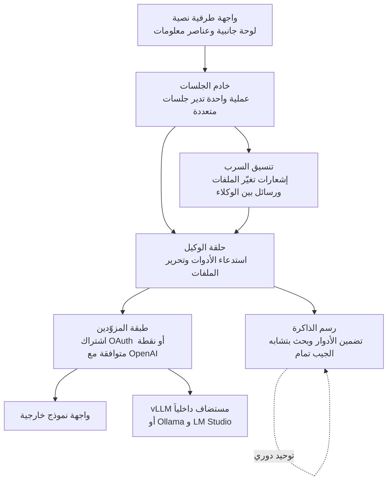

حين تقرأ أن وكيل برمجة يُقلع أسرع من Claude Code بمقدار 245 ضعفاً، يأتيك شعوران معاً: الفضول والشك. لذلك نزّلنا الملف التنفيذي الرسمي، وتحققنا من بصمته، وقِسناه على أحد حواسيب MacBook لدينا. الخلاصة أن رقم 245 ضعفاً صحيح، ورقم 5.8 أضعاف الذي قِسناه صحيح أيضاً، لأن الرقمين يقيسان شيئين مختلفين.


## لماذا يعنيك هذا

هذا المقال موجّه إلى مهندسي المنصات الذين يشغّلون عدة وكلاء برمجة في وقت واحد، أو الذين يصممون تجهيز وكلاء بأنفسهم. فائدته أقل إن كنت تختار أداة سطر أوامر فحسب، وأكبر إن أردت فهم كيف تحدد خصائص موارد التجهيز عدد الجلسات التي يمكنك تشغيلها فعلياً. الخلاصة أولاً: الدرس من jcode ليس سرعة 245 ضعفاً بحد ذاتها، بل أن الكلفة الحدية لإضافة جلسة واحدة جرى خفضها إلى نحو 10 ميغابايت. هذا الرقم هو ما يجعل تشغيل وكلاء متوازين أمراً عملياً.

## نظرة عامة

jcode تجهيز مفتوح المصدر لوكيل برمجة مكتوب بلغة Rust. وفق واجهة GitHub البرمجية وقت فحصنا، أُنشئ المستودع في 5 يناير 2026 ولديه 12,097 نجمة و1,334 نسخة متفرعة. رخصته MIT، ولغته الأساسية Rust، وآخر دفعة كانت في 27 يوليو 2026. وعدد المسائل المفتوحة 136.

وتيرة الإصدارات لافتة. بين v0.56.0 في 24 يوليو وv0.61.0 في 27 يوليو صدرت خمسة إصدارات في أربعة أيام، مروراً بـ v0.57.0 وv0.58.0 وv0.60.0. ووصف المستودع سطر واحد: "التجهيز الأكفأ في استهلاك الذاكرة". هذا السطر يلخّص هدف المشروع بالكامل.

نظرنا في هذا المشروع لأجل السؤال الكامن تحته أكثر من القياس نفسه. تشغيل وكيل واحد صار رخيصاً بما يكفي، أما تشغيل عشرة معاً فما زال مكلفاً. التجهيز الذي يستهلك أكثر من 200 ميغابايت لكل جلسة سيملأ الحاسوب المحمول بالوكلاء وحدهم. أردنا أن نرى ما الأرقام التي ينتجها تنفيذ يهاجم هذا العنق مباشرة.

## ما هذه الأداة

لا يصنع jcode نماذج. إنه غلاف التنفيذ، أي التجهيز، الذي يقف أمام النموذج ويتولى استدعاء الأدوات وتحرير الملفات وإدارة الجلسات. تبقى تستخدم النماذج التي تشترك بها أصلاً، بينما أُعيدت كتابة الأعمال المحيطة بها بلغة Rust.

البنية مبسّطة على هذا النحو.



ثلاثة أجزاء تميّزه.

الأول هو الذاكرة. يضمّن jcode كل دور ورد في رسم متجهات، ثم يسترجع في كل دور تالٍ الذكريات المرتبطة بتشابه الجيب تمام ويدرجها في المحادثة. يصل السياق المرتبط دون أن يستدعي الوكيل أداة ذاكرة صراحة. ويجري الاستخراج في وكيل جانبي منفصل عند رصد انزياح دلالي، أو بعد عدد محدد من الأدوار، أو عند انتهاء الجلسة، ثم يُعاد تنظيم الرسم المتراكم دورياً لتنظيف المدخلات القديمة أو المتعارضة. كما تتوفر أدوات صريحة للبحث في الذاكرة والتخزين فيها.

الثاني هو السرب. شغّل وكيلين أو أكثر في المستودع نفسه فيديرهما الخادم معاً. إذا حرّر الوكيل أ ملفاً سبق للوكيل ب أن قرأه، أبلغ الخادمُ ب بذلك. ويمكن لـ ب تجاهل الأمر إن لم يكن ذا صلة، أو فحص الفرق لتفادي التعارض. يستطيع الوكلاء مراسلة نظير محدد أو البث للجميع، ويمكن للوكيل أن يستنسخ زملاء له لتقسيم العمل. وعندها يصبح الوكيل الأصلي منسّقاً ويصبح المستنسَخون عمّالاً.

الثالث هو العرض. يمكن للوحة الجانبية أن تحمل ملفاً يتحدث لحظياً أو أن تعمل عارض فروق، وتعرض اللوحة والمحادثة مخططات mermaid ضمن السياق. ولتحقيق ذلك كتب المؤلف مكتبة عرض mermaid منفصلة بلا اعتماد على متصفح أو TypeScript. وعناصر المعلومات، التي لا تشغل إلا المساحة التي ستبقى فارغة أصلاً، تنبع من الحدس التصميمي نفسه.

ومما يستحق الانتباه أيضاً حجم ما بناه المؤلف بدل استيراده. عارض mermaid حالة، والطرفية حالة أخرى. فتنفيذ ذاكرة تمرير خاصة يصطدم بحد على مستوى الطرفية يمنع التمرير السلس بأجزاء الأسطر، لذلك يبني المؤلف طرفية ذات واجهة تمرير أصلية. وهذا العمل ما يزال جارياً، ويعمل التمرير بصورة طبيعية على الطرفيات العادية في هذه الأثناء. تنسجم هذه الخيارات مع تقليل الاعتماديات وخفض كلفة الإقلاع، لكنها تركّز مساحة صيانة كبيرة على شخص واحد.

دعم المزوّدين واسع. فتسجيل الدخول عبر OAuth المدعوم بالاشتراك مدمج لـ Claude وOpenAI وGemini وGitHub Copilot وAzure وخطة البرمجة من Alibaba، وخدمات مثل OpenRouter وDeepSeek وMoonshot متاحة كملفات تعريف مسماة. ويعمل التشغيلان المحليان Ollama وLM Studio بالطريقة نفسها. وللجلسات بلا واجهة أو عبر SSH يوجد مسار من خطوتين يطبع رابط المصادقة بدل فتح متصفح ثم يُستكمل لاحقاً برابط رجوع أو رمز، وهو مفيد حين يتولى نص برمجي تسجيل الدخول.

يقيم إعداد MCP في ملف خاص به، مع مسار توافق يقرأ إعداد Claude Code مباشرة. وعند أول تشغيل يستورد إعدادك القائم، فتقل كلفة الانتقال. لاحظ أن المدعوم اليوم هو خوادم MCP بنمط stdio فقط. أما مدخلات HTTP وSSE فتُقرأ وتُسجَّل ثم تُتخطى، لذا تحقق من هذا القيد أولاً إن كان إعدادك يعتمد على خوادم MCP بعيدة.

## التثبيت والدمج

المسار الرسمي نص تثبيت.

```bash
# macOS, Linux
curl -fsSL https://jcode.sh/install | bash

# Windows 11 (PowerShell 5.1+)
irm https://jcode.sh/install.ps1 | iex
```

ولأجل قياس قابل لإعادة الإنتاج نزّلنا الملف التنفيذي مباشرة وقارنّاه بالبصمة المنشورة.

```bash
BASE=https://github.com/1jehuang/jcode/releases/download/v0.61.0
curl -fsSLO $BASE/jcode-macos-aarch64.tar.gz
curl -fsSLO $BASE/SHA256SUMS
shasum -a 256 jcode-macos-aarch64.tar.gz
# b0c87b6aad07c27d40cadcc426665e3ed07fb924e3e632fb961568443029491b
tar xzf jcode-macos-aarch64.tar.gz
./jcode-macos-aarch64 --version
# jcode v0.61.0 (c5009da0)
```

بلغ حجم أرشيف macOS arm64 أربعة وأربعين مليوناً وتسعمائة وثمانين ألفاً وخمسمائة وسبعين بايتاً، وتطابقت بصمة SHA256 التي حسبناها مع القيمة المنشورة.

ويستحق مسار الربط بخادم النماذج الداخلي المعرفة أيضاً. يعامل jcode أي نقطة متوافقة مع OpenAI بوصفها نوع مزوّد واحداً، فالبيئة التي تخدم النماذج عبر vLLM لا تحتاج إلا ملف تعريف واحد.

```bash
jcode provider add local-vllm \
  --base-url http://localhost:8000/v1 \
  --model Qwen/Qwen3-Coder-30B-A3B-Instruct \
  --no-api-key \
  --set-default
```

ولبوابة داخلية تتطلب مفتاحاً، مرّره عبر المدخل القياسي ليبقى خارج سجل الصدفة.

```bash
printf '%s' "$MY_API_KEY" | jcode provider add my-api \
  --base-url https://llm.example.com/v1 \
  --model my-model-id \
  --api-key-stdin \
  --set-default --json

jcode --provider-profile my-api auth-test --prompt 'Reply exactly JCODE_PROVIDER_SETUP_OK'
```

تتراكم الإعدادات في `~/.jcode/config.toml`. وإن كانت نقطتك لا تُعيد قائمة نماذج صالحة، فاكتب نافذة السياق في ملف التعريف صراحة. فتركها فارغة يجعل التجهيز يرتد إلى قيمة افتراضية عامة قد تخالف الحد الحقيقي لنموذجك.

## ما الذي قِسناه

البيئة كانت Darwin 25.5.0، معمارية arm64، حاسوب MacBook بـ 12 نواة. في شجرة عمل معزولة جلبنا الملف التنفيذي وتحققنا منه، ثم قِسنا الزمن من بدء العملية حتى خرج `--version` عبر 12 تشغيلاً، مع استبعاد الأولين بوصفهما تسخيناً لذاكرة القرص. وقِست ذروة الذاكرة المقيمة لكل عملية على حدة بأداة `/usr/bin/time -l` بثلاثة تشغيلات لكل منهما.


| المؤشر | jcode v0.61.0 | Claude Code CLI | النسبة |
|---|---:|---:|---:|
| الإقلاع الدافئ، الوسيط | 7.1 ms | 41.5 ms | 5.8x |
| الإقلاع الدافئ، الأدنى إلى الأعلى | 6.4 إلى 11.3 ms | 40.0 إلى 42.3 ms | |
| التشغيل الأول، بارد | 25.4 ms | 41.3 ms | 1.6x |
| ذروة الذاكرة المقيمة | 16.9 MB | 217.0 MB | 12.8x |

لا وجود لرقم 245 ضعفاً هنا. وهذا لا يعني أن المشروع ضخّم شيئاً. فرقم 245.5 ضعفاً المنشور مأخوذ من جهاز لينكس يفتح طرفية زائفة عشر مرات ويقيس حتى ترسم الواجهة النصية أول إطار، حيث استغرق jcode 14.0 ميلي ثانية واستغرق Claude Code 3,436.9 ميلي ثانية. أما نحن فقِسنا مسار `--version` للأداتين نفسيهما، وهو مسار لا يرفع واجهة نصية أصلاً بل يطبع نصاً وينتهي. نظام تشغيل مختلف، ونقطة قياس مختلفة.

وحين تتضح هذه النقطة يزول التناقض بين الرقمين. فزمن أول إطار يشمل تهيئة الطرفية وتركيب الشاشة وتحميل الحالة الأولية، وهذا بالضبط المقطع الذي تتباعد فيه التجهيزات. أما `--version` فلا يكشف إلا كلفة إقلاع بيئة التشغيل. وهذا يفسّر أيضاً استقرار `--version` في Claude Code عند أربعينيات الميلي ثانية، مقابل تأرجح زمن أول إطار في جدول المستودع بين 2,032.7 و8,927.2 ميلي ثانية.

أما في الذاكرة فقد أشار ادعاء المستودع وقياسنا إلى الاتجاه نفسه. فرقمنا 16.9 ميغابايت أقل فعلاً من 27.8 ميغابايت التي يعلنها المستودع مع تعطيل التضمين المحلي. غير أن رقمنا ذروة تشغيل واحد لـ `--version`، وهو ليس كجلسة مفتوحة حُمّل فيها نموذج التضمين. ووفق جدول المستودع تبلغ الجلسة الواحدة مع تفعيل التضمين 167.1 ميغابايت، وتكلف كل جلسة إضافية نحو 10.4 ميغابايت. وفي الجدول نفسه يضيف Claude Code نحو 212.7 ميغابايت لكل جلسة.

هذه القيمة الأخيرة هي المهمة عملياً. فتشغيل عشر جلسات بكلفة حدية قدرها 10 ميغابايت يوصلك إلى نحو 100 ميغابايت. وعند 210 ميغابايت يتجاوز الرقم 2 غيغابايت. وعدد الوكلاء المتوازين الذي يحتمله حاسوب محمول واحد يحدده هذا الميل.

ويزيد جدول الجلسات المتعددة في المستودع الفرق وضوحاً. عند جلسة واحدة تبلغ الذاكرة المقيمة 167.1 ميغابايت لـ jcode و386.6 ميغابايت لـ Claude Code، أي فارق 2.3 ضعف. وعند عشر جلسات تصير 260.8 مقابل 2,300.6 ميغابايت، فيتسع الفارق إلى 8.8 أضعاف. ومع تعطيل التضمين المحلي تبقى عشر جلسات عند 117.0 ميغابايت. الفرق في الميل أكبر بكثير من الفرق عند نقطة البداية، وهذا ما حسّنه المشروع فعلاً.

ويجدر بنا أن نكون صريحين بالقدر نفسه فيما لم نقسه. فاستجابة الإدخال بعد أول إطار، وسرعة البحث في مستودع ضخم، والذاكرة في حالة الاستقرار مع تحميل نموذج التضمين، وجودة عمل البرمجة الفعلي، كلها خارج نطاق هذا القياس. والأخيرة تحديداً يحكمها النموذج الذي تربطه لا التجهيز، فلا تجيب عنها أي مقارنة تجهيزات. أردنا التحقق من أمر واحد: هل كفاءة الموارد التي يعلنها المشروع نص تسويقي أم خاصية تنفيذ. إنها خاصية تنفيذ.

## ماذا يعني هذا لـ ThakiCloud

قرأنا هذه النتائج من خلال عدستَي منتجَين.

أولاً Paxis. وهي سحابة ThakiCloud المصممة أصلاً للوكلاء، وتتعامل مع المهارات والأدوات والسياسات وسجلات التدقيق بوصفها موارد من الدرجة الأولى. تختار من أكثر من 960 مهارة عبر خوارزمية BM25، وتشغّلها في صناديق رمل معزولة، وتمرر كل إجراء عبر بوابة سياسات وسجل تدقيق. وأمران يعرضهما jcode يتصلان بهذا التصميم مباشرة. الأول إبقاء الكلفة الحدية لكل جلسة منخفضة. ففي بنية تشغّل وكلاء كثيرين بالتوازي، يحدد ميل الكلفة المضافة سقف التزامن لا الكلفة المطلقة لجلسة واحدة. والثاني إشعار تغيّر الملفات في السرب. فحين يعمل عدة وكلاء على المستودع نفسه، يكون إبلاغ الوكيل بأن ملفاً قرأه قد تغيّر أرخص بكثير من دمج التعارضات لاحقاً. وثمة مجال للإشارة نفسها في تنفيذنا متعدد الوكلاء القائم على الرسوم الموجهة.

وأمر آخر في السرب هو أن دورَي المنسّق والعامل غير محددين سلفاً. فالوكيل يستنسخ زملاء حين يقرر أنه يحتاجهم ويصير منسّقاً في تلك اللحظة. وهذا اتجاه معاكس لوضع خطة تنفيذ مسبقة، ولكل نهج موضعه. فحين يكون التفكيك واضحاً مسبقاً يكون الرسم الموجّه أأمن وسجل تدقيقه أنظف. وأثناء الاستكشاف يكون التفريع وقت التشغيل أسرع. وفي بيئتنا التي تمر فيها الإجراءات ببوابة سياسات، تكون الخلاصة أن الاستنساخ الديناميكي يمكن السماح به شرط معاملة الاستنساخ نفسه إجراءً خاضعاً للتدقيق.

ويقدّم تصميم الذاكرة شيئاً كذلك. إذ يتيح jcode اختيارياً أن يتحقق وكيل جانبي من الذكريات المسترجعة قبل دخولها المحادثة. وترشيح المرتبط بدل حقن كل ما يعيده البحث ينبع من الدافع نفسه وراء حدنا الصارم لعدد المحارف في طبقة الذاكرة الساخنة لدينا. فالسياق ليس مجانياً، والذكريات غير المرتبطة تستهلك الرموز وتشوّش الحكم.

ثانياً ai-platform. يتشابك مسار المزوّد المتوافق مع OpenAI في jcode مباشرة مع خدمة vLLM الداخلية. فمنصة ai-platform لدى ThakiCloud توزّع وحدات المعالجة الرسومية على Kubernetes وKueue وتخدم النماذج عبر vLLM، وعميل بهذه الخفة يعني أن الميزانية نفسها من العتاد تستوعب جلسات مطوّرين أكثر. ويلائم هذا المزيج بوجه خاص العملاء ذوي متطلبات التشغيل داخل المؤسسة أو السيادة الرقمية، لأن أوزان النموذج ونقطة الاستدلال تبقيان داخل حدود العميل بينما لا تحتاج أجهزة المطورين إلا ملفاً تنفيذياً واحداً بحجم عشرات الميغابايت. كما يساعد قِصر مسار تسجيل بوابة داخلية بوصفها ملف تعريف وجعلها الافتراضية في جانب النشر.

## الحدود والاعتراضات

عدة أمور تمنعنا من التوصية بهذا المشروع كما هو.

الإصدار ما يزال دون الواحد. وخمسة إصدارات في أربعة أيام دليل حيوية وإشارة في الوقت نفسه إلى أن السطح يتحرك باستمرار. والمسائل المفتوحة البالغة 136 طبيعية في هذه المرحلة، لكن من المبكر تثبيت هذه الأداة معياراً داخلياً.

ومسار المساهمة يستحق التحقق. فإعدادات المستودع تقصر إنشاء طلبات السحب على المتعاونين. ورخصة MIT تتيح التفريع والتعديل بحرية، لكن المسار المعتاد لدفع إصلاح خارجي إلى الأعلى غير مفتوح. فخطط لصيانة الرقع داخلياً.

والقياس عن بُعد الافتراضي يحتاج انتباهاً أيضاً. فتشغيل `--version` وحده يطبع إشعاراً بجمع إحصاءات استخدام مجهولة. والنطاق المعلن هو عدد التثبيتات والإصدار ونظام التشغيل ونشاط الجلسة وعدد استدعاءات الأدوات وأسباب الخروج، ويقول الإشعار إن الشيفرة وأسماء الملفات والمطالبات غير مشمولة. ومع ذلك راجع هذا السلوك قبل الاعتماد في بيئة معزولة أو خاضعة للتنظيم.

ولقياسنا حدوده الخاصة. فقد قِسنا مسار إقلاع سطر الأوامر، بينما الذي يشكّل تجربة التطوير الفعلية هو الاستجابة بعد أول إطار وزمن استجابة النموذج. ومهما كان التجهيز سريعاً فلن يبدو العمل الذي يهيمن عليه توليد الرموز مختلفاً كثيراً. وسرعة الإقلاع تؤتي ثمارها حين تعيد تشغيل الوكلاء كثيراً، أو تستدعيها تكراراً من نصوص برمجية، أو تُبقي جلسات كثيرة حية معاً. وضع في حسبانك كذلك أن إصدارات الأدوات في جدول القياس تختلف عن إصداراتها وقت قياسنا.

## الخلاصة

الرقمان 245 ضعفاً و5.8 أضعاف صحيحان معاً. الأول قاس أول إطار لواجهة نصية على لينكس، والثاني قاس إقلاع سطر الأوامر على حاسوب MacBook. وقبل اقتباس أي نسبة قياس، تحقق مما يعده الرقم بداية وما يعده نهاية.

وإن أخذت شيئاً واحداً من هذا المقال، فراقب الميل لا النسبة. فكون إضافة جلسة واحدة تكلف 10 ميغابايت أو 210 ميغابايت هو ما يقرر إن كان تشغيل الوكلاء بالتوازي ممكناً على حاسوب محمول أصلاً. وإن كنت تصمم تجهيزاً داخلياً، فجرّب وضع الكلفة الحدية لكل جلسة على لوحة مؤشراتك في الدورة القادمة بدل الذاكرة المطلقة. وهذا المعيار نفسه نستخدمه لضبط سقف التنفيذ المتوازي في Paxis.

## المصادر

- مستودع jcode: <https://github.com/1jehuang/jcode>
- إصدار jcode v0.61.0: <https://github.com/1jehuang/jcode/releases/tag/v0.61.0>
- موقع jcode والقياسات: <https://jcode.sh>
- جرى جلب بيانات المستودع من واجهة GitHub REST في 28 يوليو 2026.
- أرقام الإقلاع والذاكرة قياساتنا الخاصة في البيئة الموصوفة أعلاه.
