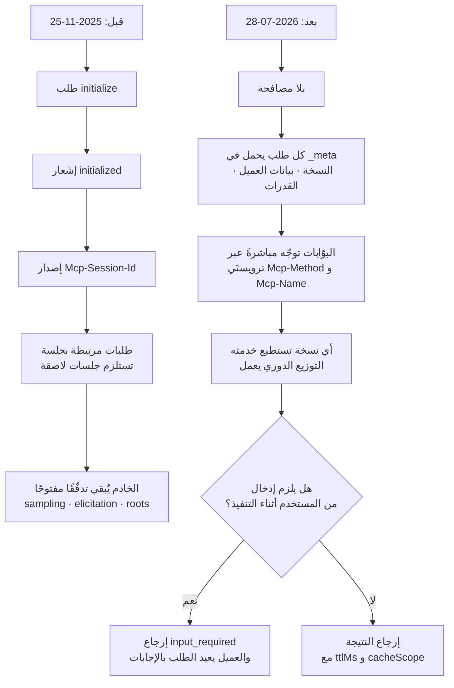

صدرت مراجعة 2026-07-28 من مواصفة MCP. يصفها البيان بأنها أكبر تغيير منذ الإطلاق، وعنوانها أن البروتوكول صار عديم الحالة. وبدل أخذ هذه الجملة كما هي، حمّلنا نسختَي `schema.json` من المستودع الرسمي وقارنّاهما. انخفضت طرق RPC من 27 إلى 20. وفقدت تعريفات المخطّط 32 مدخلًا وكسبت 42. أما `InitializeRequest` الذي ظهر أربع مرات في المراجعة السابقة فلا يظهر ولا مرة واحدة في هذه.


## لماذا يهمّك هذا

كُتب هذا المقال لمهندسي المنصّات الذين يشغّلون خادم MCP بالفعل أو يوشكون على نشره، ولكل من يصمّم طبقة الأدوات التي ترتبط بها الوكلاء الداخلية. وسيكون أنفع لمن يقدّر كلفة الترحيل منه لمن يلتقي MCP لأول مرة. الخلاصة أولًا: هذه المراجعة ليست إضافة ميزة بل **تبديل لنموذج النشر**. فبزوال الجلسات صار بإمكان خادم MCP أن يقف خلف موازن أحمال بعدة نسخ كأي خدمة HTTP عادية، والثمن أن كل ما بنيتموه فوق الجلسات يحتاج إعادة كتابة. وطرفا هذه المقايضة واضحان بما يكفي لأن يكون التخطيط أفضل من التأجيل.

## نظرة عامة

على مدى ثمانية عشر شهرًا صار MCP المسار المعياري الذي تصل عبره الوكلاء إلى البيانات والأدوات الخارجية. وبحسب البيان تشهد حزم Tier 1 SDK قرابة نصف مليار تنزيل شهريًا، وتجاوزت حزمتا TypeScript وPython كلٌّ منهما مليار تنزيل تراكمي.

وعند هذا الحجم ظل الاعتراض نفسه يتكرّر في التشغيل. كان MCP في الأصل بروتوكولًا ثنائي الاتجاه يحتفظ بالحالة. يرسل العميل `initialize`، فيردّ الخادم، فتُفتح جلسة، ويرافق معرّفها كل طلب لاحق في ترويسة `Mcp-Session-Id`. وهذا تصميم سليم لعملية واحدة تعمل محليًا. لكنه يتعثّر لحظة تشغيل عدة نسخ بعيدة. فطلبات الجلسة الواحدة يجب أن تصل النسخة نفسها، ما يستلزم جلسات لاصقة؛ وإذا ماتت النسخة ماتت الجلسة معها؛ أما البيئات عديمة الخوادم فكانت خارج الحساب أصلًا.

تحلّ مراجعة 2026-07-28 هذا على مستوى البروتوكول. صار كل طلب يصف نفسه. فتنتقل نسخة البروتوكول وهوية العميل وقدراته داخل `_meta` مع كل طلب. والنتيجة أن أي طلب يستطيع الوصول إلى أي نسخة خلف موازن أحمال دوري بسيط.

## ماذا تغيّر هذه المراجعة

الشكل العام أولًا:



تغييرًا تلو الآخر:

**إزالة المصافحة والجلسات.** أُلغي رسميًا تبادل `initialize` و`initialized`، ومعه ترويسة `Mcp-Session-Id`. وهناك طريق RPC جديد اسمه `server/discover` للعملاء الراغبين في معرفة قدرات الخادم مسبقًا، لكنه غير إلزامي. ويضيف البيان أن هذا لا يفرض على تطبيقكم أن يكون عديم الحالة. فإن احتجتم إلى حالة فليُصدر أحد الأدوات مقبضًا صريحًا يعيده النموذج كوسيط؛ فقد وجد القائمون على المشروع أن رؤية النموذج للمقبض وتمريره بين الأدوات أفضل من إخفاء الحالة في طبقة النقل.

**الطلبات متعدّدة الجولات (MRTR).** كان الخادم سابقًا، حين يحتاج تأكيدًا من المستخدم أثناء تنفيذ أداة، يرسل طلبًا إلى العميل، وهو ما استلزم إبقاء تدفّق مفتوحًا. أما الآن فيُرجع الخادم `resultType: "input_required"` مع الأسئلة التي يحتاج إجاباتها، ويعيد العميل الطلب الأصلي والإجابات في `inputResponses`. لم ينعكس الاتجاه بقدر ما فُكّ إلى جولات ذهاب وإياب.

**التوجيه عبر الترويسات.** صار لزامًا على طلبات Streamable HTTP أن تتضمّن ترويستَي `Mcp-Method` و`Mcp-Name`. وتستطيع البوّابة أو محدّد المعدّل أو جدار حماية التطبيقات التوجيه والقياس اعتمادًا على هاتين الترويستين دون تحليل جسم JSON.

```http
POST /mcp HTTP/1.1
MCP-Protocol-Version: 2026-07-28
Mcp-Method: tools/call
Mcp-Name: search

{"jsonrpc":"2.0","id":1,"method":"tools/call",
 "params":{"name":"search","arguments":{"q":"otters"},
 "_meta":{"io.modelcontextprotocol/clientInfo":{"name":"my-app","version":"1.0"}}}}
```

**نتائج القوائم قابلة للتخزين المؤقّت.** صارت استجابات `tools/list` و`prompts/list` و`resources/list` و`resources/read` تحمل `ttlMs` و`cacheScope` بترتيب حتمي. فيستطيع العملاء تخزين فهارس الأدوات مؤقّتًا، وتتوقّف ذاكرات المطالبات العليا عن الانكسار مع كل إعادة اتصال.

**تشديد التفويض.** ينبغي لخوادم التفويض إرجاع الوسيط `iss` وفق RFC 9207، وعلى العملاء التحقّق منه قبل استبدال الرمز، وهو ما يسدّ ثغرة الخلط بين خوادم التفويض. وتُربط بيانات اعتماد العميل بالجهة التي أصدرتها فلا يمكن إعادة استخدامها عبر خوادم تفويض أخرى. وأُلغي رسميًا التسجيل الديناميكي للعملاء لصالح Client ID Metadata Documents، وإن ظلّ المسار القديم يعمل حاليًا.

**قائمة الإلغاء.** أُلغيت Roots وSampling وLogging، وكذلك النقل القديم HTTP+SSE. وتظلّ كلها تعمل اثني عشر شهرًا على الأقل، لكن يُستحسن ألّا تتبنّاها التنفيذات الجديدة. وتضمن سياسة الإلغاء الرسمية المستحدثة في المراجعة نفسها هذه المهلة الدنيا، فصار بالإمكان التخطيط بدل ردّ الفعل.

## ما الذي قسناه فعليًا

تحقّقنا من كيفية انعكاس ملخّص البيان في ملفات المخطّط نفسها. جلبنا نسختَي `schema.json` من مستودع `modelcontextprotocol/modelcontextprotocol` وكتبنا سكربتًا يُحصي ويقارن ثوابت طرق RPC وتعريفات الأنواع، وهو في `scripts/experiments/mcp-2026-07-28/schema_diff.py`.

وللأمانة مسبقًا: لم نثبّت الحزمة الجديدة ونُشغّل خادمًا، لأن تثبيت الحزم احتاج موافقة منفصلة في هذه البيئة. تأكّدنا عبر PyPI من صدور حزمة Python باسم `mcp` بالإصدار 2.0.0، وجرى التحقّق مما دون ذلك على مستوى المخطّط.

النتائج:

```
schema bytes: 2025-11-25=101,793  2026-07-28=112,729
RPC methods: 27 -> 20 (-10 / +3)
schema definitions: 145 -> 155 (-32 / +42)
```

الطرق العشر المحذوفة هي `notifications/initialized` و`logging/setLevel` و`resources/subscribe` و`resources/unsubscribe` و`notifications/elicitation/complete` وأربع من عائلة `tasks/`. والإضافات الثلاث هي `server/discover` و`subscriptions/listen` و`notifications/subscriptions/acknowledged`.


أما تعريفات الأنواع فترويّ حكاية أغنى. فبين الحذوفات الاثنين والثلاثين يقف `InitializeRequest` و`InitializeRequestParams` و`InitializeResult` و`InitializedNotification` جنبًا إلى جنب، ما يعني أن المصافحة غادرت المواصفة بالكامل. واختفاء `ServerRequest` ينتمي إلى الخيط نفسه، لأن مفهوم إرسال الخادم طلبات إلى العميل لم يعد قائمًا. وأُزيلت معها `SubscribeRequest` و`UnsubscribeRequest` و`SetLevelRequest` و`RootsListChangedNotification`. وحتى اختفاء `PingRequest` يخبركم بأنه لم يعد ثمة اتصال يحتاج التحقّق من بقائه حيًّا.

واختفاء ثمانية تعريفات تبدأ بـ `Task` معًا هو نقل لا إلغاء. فقد انتقلت Tasks من النواة التجريبية إلى امتداد `io.modelcontextprotocol/tasks`.

وتنقسم الإضافات الاثنتان والأربعون بوضوح بحسب الغرض. فـ `InputRequest` و`InputRequests` و`InputRequiredResult` و`InputResponse` و`InputResponses` هي الأنواع التي يتألّف منها MRTR. و`CacheableResult` وعائلة `ListToolsResultResponse` أغلفة استجابة لحمل تلميحات التخزين المؤقّت. أما `HeaderMismatchError` و`UnsupportedProtocolVersionError` و`MissingRequiredClientCapabilityError` فأنواع أخطاء غائبة عن المراجعة السابقة، وأسماؤها الثلاثة تُعلن أنماط الفشل الجديدة: اختلاف الترويسات عن الجسم، أو وصول نسخة بروتوكول غير مدعومة، أو طلب يحتاج قدرة عميل لم تُعلَن. وبانعدام الجلسة تجري هذه الفحوص مع كل طلب.

وأحصينا كذلك تكرار السلاسل النصّية:

| السلسلة | 2025-11-25 | 2026-07-28 |
|---|---|---|
| `InitializeRequest` | 4 | 0 |
| `initialized` | 1 | 0 |
| `clientInfo` | 2 | 1 |
| `inputResponses` | 0 | 4 |
| `ttlMs` | 0 | 14 |
| `cacheScope` | 0 | 14 |

وظهور `ttlMs` و`cacheScope` أربع عشرة مرة لكلٍّ منهما يعني أن تلميحات التخزين المؤقّت أُلحقت باتّساق عبر استجابات القوائم كلها لا بواحدة منها فحسب.

ويجدر أن نضيف أن `Mcp-Session-Id` و`Mcp-Method` و`Mcp-Name` لا تُعطي أي نتيجة بحث في أيٍّ من المراجعتين. فهذه ترويسات HTTP محدّدة في وثيقة النقل لا في مخطّط JSON. فأكّد التمرين أيضًا أن الاكتفاء بقراءة المخطّط يترك ثغرات.

## ماذا يعني هذا لـ ThakiCloud

**من منظور Paxis.** إن Paxis هو مستوى التحكّم السحابي الأصلي للوكلاء لدى ThakiCloud، ويتعامل مع Skills وTools وPolicies وAudit Logs بوصفها موارد من الدرجة الأولى. وموصّلات MCP هي الباب الأمامي الذي تدخل منه الأدوات الخارجية إلى هذه البنية. وتهمّ هذه المراجعة Paxis من ثلاث جهات.

أولًا، يتلاءم التوجيه عبر الترويسات جيدًا مع بوابات السياسات. فبوجود `Mcp-Method` و`Mcp-Name` في الترويسات نعرف أي أداة تُستدعى وبأي طريقة دون تحليل الجسم. فقرارات السياسة التي كانت تستلزم فكّ JSON صار يمكن اتخاذها بفحص ترويسة، وتنتقل القيم نفسها مباشرةً إلى سجلّات التدقيق.

ثانيًا، يخفض تخزين القوائم مؤقّتًا كلفة اختيار المهارات. فـ Paxis يختار من أكثر من 960 مهارة عبر BM25 ويشغّلها في صناديق رمل معزولة، وفهارس الأدوات التي تقدّمها خوادم MCP الخارجية جزء من مجمع الاختيار هذا. وبإلحاق `ttlMs` و`cacheScope` لم تعد الفهارس بحاجة إلى إعادة جلب في كل مرة، ويعالج الترتيب الحتمي مشكلة انكسار ذاكرات المطالبات العليا عند إعادة الاتصال.

ثالثًا، إلغاء Sampling يسير في الاتجاه الصحيح. فطلب الخادم من العميل تشغيل استدلال نموذج مريح، لكنه من منظور بوابة السياسات يعني استدلالًا يجري خارج خطّ التحكّم، وهو ما كان عسير الضبط. وتوحيد المسار نحو التكامل المباشر مع واجهات مزوّدي النماذج يعيد جمع مسار الاستدعاء في موضع واحد.

**من منظور ai-platform.** يظهر العائد العملي لانعدام الحالة في النشر. فمنصّة ai-platform من ThakiCloud مبنية على Kubernetes، ما يعني أن خادم MCP يعمل في النهاية كحُجَيرات. وحتى الآن كان تقارب الجلسة يفرض جلسات لاصقة عند المدخل، وكانت إعادة تشغيل الحُجَيرة تقطع المحادثات الجارية، وكان التوسّع الأفقي عبر HPA يعطي حُجَيرات جديدة عاجزة عن التقاط الجلسات القائمة. وبزوال الجلسات تزول هذه القيود كلها. فيصبح خادم MCP حمل عمل عديم الحالة عاديًا، وتُدار التحديثات المتدحرجة والتوسّع التلقائي والتوزيع متعدّد المناطق تمامًا كأي خدمة أخرى. وبالنسبة إلى العملاء الذين يشغّلون بوابة MCP داخل مؤسّساتهم أو في بيئات معزولة، فهذا انخفاض ملموس في صعوبة التشغيل.

## الحدود والاعتراضات

أكبر كلفة أن هذه المراجعة تغيير كاسر. فالشيفرة التي اعتمدت على معرّفات الجلسات يجب إعادة كتابتها. والأداة التي تحتاج الاحتفاظ بحالة يجب إعادة تصميمها حول مقابض صريحة، وهذا ليس إصلاح سطر واحد في طبقة النقل بل تغيير لواجهة الأداة نفسها. والخادم الذي يستخدم Sampling يحتاج مسار استدعاء جديدًا للنموذج، وهو ما ينقل الكلفة وإدارة المفاتيح إلى جهة الخادم.

ثانيًا، انعدام الحالة ليس مجّانيًا. فكل طلب صار يحمل نسخة البروتوكول وبيانات العميل وقدراته، فيزيد العبء لكل طلب. وكذلك MRTR: فالتأكيد الذي كان يمرّ مرة واحدة عبر تدفّق مفتوح صار يكلّف جولتَي ذهاب وإياب. وقد ترتفع زمن الاستجابة في المسارات التي يكثر فيها تأكيد المستخدم. فالحالة لم تُلغَ بقدر ما انتقلت إلى ما يحمله كل طلب.

ثالثًا، يتوقّف هذا التحليل عند ملف المخطّط. فكما تبيّن أعلاه لا تقيم قواعد ترويسات HTTP في المخطّط، ولا سبيل إلى معرفة سلوك الحزم فعليًا إلا بتشغيل الشيفرة. ولتقدير حجم الترحيل بدقّة اقرأوا ملاحظات الترحيل الخاصة بكل لغة إلى جانب هذا المقال.

وأما الاعتراض المضادّ فهو أن من يشغّل خادم MCP واحدًا محليًا عبر stdio لا تقدّم له هذه المراجعة شيئًا يُذكر. فما تشتريه هو النشر البعيد والتوسّع الأفقي؛ وخارج هذا السيناريو لا تبقى إلا كلفة الترحيل. ومع مهلة اثني عشر شهرًا فليس لدى التركيبات المحلّية سبب وجيه للاستعجال.

## الخلاصة

تؤكّد قراءة المخطّط ما جاء في البيان لكنها تزيده حدّة. فاختفاء أربعة تعريفات من عائلة `InitializeRequest` إلى جانب `ServerRequest` و`PingRequest` يعني أن مفهوم الاتصال غادر المواصفة، وأن عائلة `InputResponses` مع `ttlMs` و`cacheScope` انتقلت إلى المساحة الشاغرة. وكما ذُكر في المستهلّ، هذه المراجعة تبديل لنموذج النشر لا إضافة ميزة، و32 حذفًا مقابل 42 إضافة في المخطّط تُظهر ذلك التبديل مباشرةً.

لذا فأمامكم أمران الآن. إن كنتم تشغّلون خادم MCP فابحثوا في شيفرتكم عن معرّفات الجلسات وSampling وRoots. فتلك النتيجة هي تقديركم الأول لحجم عمل الترحيل. ثم راجعوا إعداد الجلسات اللاصقة عند مدخلكم. فبعد الانتقال إلى المواصفة الجديدة لن تحتاجوه، ومنذ لحظة إزالته يمكنكم التعامل مع خادم MCP تمامًا كأي خدمة أخرى عديمة الحالة.

## المصادر

- [مواصفة 2026-07-28 (المدوّنة الرسمية لـ MCP)](https://blog.modelcontextprotocol.io/posts/2026-07-28/)
- [حزم SDK التجريبية لمرشّح إصدار مواصفة MCP 2026-07-28](https://blog.modelcontextprotocol.io/posts/sdk-betas-2026-07-28/)
- [مستودع مخطّط modelcontextprotocol/modelcontextprotocol](https://github.com/modelcontextprotocol/modelcontextprotocol/tree/main/schema)
