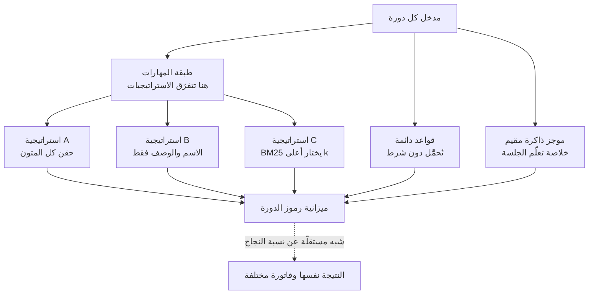

عندما يتجاوز إنفاق الوكيل التوقّعات، فإن أول ما تفحصه معظم الفرق هو النموذج: الانتقال إلى نموذج أرخص أو النزول إلى حجم أصغر. لكن قياسًا نشرته Composio في 29 يوليو 2026 يشير إلى أن هذا الترتيب قد يكون مقلوبًا. ثبّتوا النموذج وغيّروا الهيكل وحده، فانقسمت فاتورة الرموز للمهمة نفسها عدة أضعاف.

## لماذا يستحقّ هذا القراءة

كُتب هذا المقال لمهندسي المنصّات الذين يتحمّلون فعليًا مسؤولية فاتورة الرموز في وكيل برمجي أو منصّة وكلاء داخلية، ولكل من عليه أن يقرّر إن كان سيغيّر النموذج. باختصار: قِيسوا التكلفة المقيمة لهيكلكم قبل أن تمسّوا النموذج. في تجربة Composio تقاربت نسب النجاح بين ثلاثة هياكل بينما انقسم استهلاك الرموز الوسيط بين 61 ألفًا و340 ألفًا. وحين طرحنا السؤال نفسه على هيكلنا وعددناه مباشرة، تحرّكت ميزانية الدورة بمعامل يتراوح بين 45 و66 بمجرّد تشغيل طبقة الاختيار أو إيقافها. والنتيجة الأهمّ جاءت بعد ذلك: بعد تشغيل التوجيه، كانت 96.7 بالمئة من الميزانية المتبقّية قواعد دائمة لا مهارات. الشحم الذي يستحقّ التقليص لم يكن حيث ينظر معظم الناس.

## نظرة عامة

شغّلت Composio نموذجًا واحدًا، هو Kimi K3، عبر ثلاثة هياكل للوكلاء: Claude Code وHermes وKimi Code. أُعطيت 28 مهمة للثلاثة بصورة متطابقة. ولأن النموذج ثابت، فكل فرق في النتائج هو فرق أنتجه الهيكل.

تقاربت نسب النجاح. أنجز Kimi Code 22 من 28، وHermes 21، وClaude Code بين 20 و21. يُنقل رقم Claude Code بوصفه 20 أو 21 تبعًا للمصدر، لذا سجّلناه كمجال. وفي كلتا الحالتين تثبت النتيجة: أكملت الهياكل الثلاثة نسبة متشابهة من المهام بالنموذج نفسه.

ما انقسم هو التكلفة. استهلكت المهمة الوسيطة 61 ألف رمز في Kimi Code، و67 ألفًا في Hermes، و340 ألفًا في Claude Code. هذا فارق 5.6 مرة عند الوسيط، وأفادت Composio بأن مهامّ فردية بلغت 30 مرة. أما الزمن فيترتّب على نحو آخر: كان الوسيط 179 ثانية في Hermes، و297 في Kimi Code، و348 في Claude Code. الهيكل الأقلّ استهلاكًا للرموز لم يكن الأسرع.

ويزيد قياسٌ نشره الفريق نفسه قبل أيام هذه النقطة وضوحًا. على معيار وكيلي من 14 مهمة، طابق K3 نموذج Claude Fable 5 تمامًا، بالنجاحات التسعة نفسها والإخفاقات الخمسة نفسها. وفي السعر، يبلغ Fable 5 عشرة دولارات لكل مليون رمز إدخال، بينما يوفّر K3 وصولًا عبر واجهة برمجية بثلاثة دولارات لكل مليون، ويمكن تنزيله واستضافته ذاتيًا. أي أن جزءًا كبيرًا من متغيّر التكلفة المتبقّي يقع خارج النموذج، بعد أن لحقت النماذج مفتوحة الأوزان بالقدرة.

## ما يفعله الهيكل فعلًا

الهيكل هو مجموع العقود الملتفّة حول النموذج: مُوجَّه النظام، وتعريفات الأدوات، وقواعد التوجيه، وسياسة إدارة السياق، وبوّابات التحقّق من المخرجات. ويستقبل النموذج هذه الحزمة كاملة كمدخل من جديد في كل دورة. لذا حين يكون الهيكل سميكًا تكون الفاتورة سميكة وإن كانت المهمة سهلة.

وتقسيم مصادر الرموز إلى طبقات يظهر على هذا النحو.



والتفرّق داخل طبقة المهارات هو الجوهر. الهيكل الذي يملك آلاف المهارات ويحقن متونها كلّها يجعل النموذج يقرأ المكتبة بأكملها في كل دورة. والاحتفاظ بالأسماء والأوصاف وحدها يجعله يقرأ الفهرس. وترك مُسترجِع يختار حفنة يجعله يقرأ الكتب التي يحتاجها فقط. تُنجز الاستراتيجيات الثلاث المهمة نفسها بالنسبة نفسها تقريبًا، وتفوتر على نحو مختلف تمامًا.

## قِسنا هيكلنا بأنفسنا

غيّرت Composio الهيكل. ونحن فعلنا العكس: ثبّتنا هيكلًا واحدًا وعددنا الطبقة التي تأتي منها تكلفته المقيمة. قياس نظامك أنفع عمليًا من نقل أرقام معيار شخص آخر.

القياس للقراءة فقط ولا يلمس الشبكة. والمُرمِّز هو BPE حقيقي، وهو `cl100k_base` من tiktoken، لا تقدير. ولأجل قابلية التكرار سحبنا HEAD إلى شجرة عمل git معزولة وعددنا تلك النسخة، ثم شغّلنا النصّ نفسه مرة أخرى على شجرة العمل الحيّة.

```bash
# سحب HEAD إلى شجرة عمل معزولة
bash scripts/blog/impl_sandbox.sh setup agent-harness-token-economics

# عدّ الرموز لكل طبقة (قراءة فقط، tiktoken cl100k_base)
.venv/bin/python scripts/blog/_harness_token_tax_20260730.py \
  --root /tmp/thaki-blog-sandboxes/blog-agent-harness-token-economics --k 6

# المقارنة مع الشجرة الحيّة
.venv/bin/python scripts/blog/_harness_token_tax_20260730.py \
  --root /Users/hanhyojung/thaki/ai-platform-strategy --k 6

bash scripts/blog/impl_sandbox.sh teardown agent-harness-token-economics
```

يعدّ النصّ أربع طبقات: القواعد المحمّلة دون شرط في كل دورة، والفهرس المؤلَّف من أسماء المهارات وأوصافها، والنصّ الكامل لكل متن مهارة، وموجز الذاكرة المقيم. وأضفنا إليها تكلفة أسوأ حالة لمُسترجِع يختار ستة مدخلات. أخذنا أسوأ حالة عن قصد، بافتراض أن أطول ستّ بطاقات هي المختارة، حتى لا تُجمِّل النتيجة طبقة التوجيه.

## النتائج المقيسة

هذه هي الأرقام الملتقطة. العمود الأيمن هو النسخة المعزولة، والأيسر شجرة العمل الحيّة. والشجرة الحيّة أكبر لأنها تحمل مهارات إضافية مثبّتة كملحقات.

| الطبقة | النسخة المعزولة | الشجرة الحيّة |
|---|---|---|
| قواعد دائمة | 59 ملفًا، 93,570 رمزًا | نفسها |
| المهارات المكتشفة | 1,970 | 2,931 |
| فهرس المهارات، الأسماء والأوصاف | 300,526 رمزًا | 436,516 رمزًا |
| متون المهارات كاملة | 4,332,223 رمزًا | 6,389,650 رمزًا |
| موجز الذاكرة المقيم | 0 رمز | 1,541 رمزًا |
| أعلى 6 من المُسترجِع، أسوأ حالة | 3,188 رمزًا | 3,276 رمزًا |

تقرأ الذاكرة المقيمة صفرًا في النسخة المعزولة لأن ذلك الملف مُولَّد ولا يُودَع في المستودع. والقيمة التي تنطبق على جلسة حقيقية هي 1,541 رمزًا في الجانب الحيّ، من مصدر يبلغ 3,254 محرفًا.

وبالتعبير عن ميزانية الدورة للاستراتيجيات الثلاث: A تحقن كل متون المهارات، وB تبقي الفهرس وحده مقيمًا، وC تترك المُسترجِع يختار أعلى ستّة.


في النسخة المعزولة تبلغ A 4,425,793 رمزًا، وB 394,096، وC 96,758. نسبة A إلى B هي 11.2 مرة، ونسبة A إلى C هي 45.7 مرة. وعلى الشجرة الحيّة تتّسع الفجوة مع الحجم: A تبلغ 6,484,761، وB 531,627، وC 98,387، وتصل نسبة A إلى C إلى 65.9 مرة.

وما يلفت النظر هو ضآلة حركة C بين الشجرتين. نمت المهارات من 1,970 إلى 2,931، أي زيادة تقارب خمسين بالمئة، وانتقلت الميزانية بعد التوجيه من 96,758 إلى 98,387، أي ارتفاع بنسبة 1.7 بالمئة. مع وجود طبقة اختيار، تبقى تكلفة تنمية رصيد المهارات قريبة من الثابت. ودونها، تُفوتَر كل مهارة تضيفونها في كل دورة.

ثم نتيجة لم نتوقّعها. بالنظر داخل الميزانية C، تستأثر القواعد الدائمة بـ96.7 بالمئة في النسخة المعزولة وبـ95.1 بالمئة على الشجرة الحيّة. بطاقات المهارات الموجَّهة تقع في حدود آلاف قليلة من الرموز، والقواعد تقع فوق ثلاثة وتسعين ألفًا. في هيكل رُكِّبت فيه طبقة الاختيار على نحو سليم، فإن التكلفة المتبقّية قواعد لا مهارات. تحسين عدد المهارات يعود إلى مشكلة حلّها التوجيه سلفًا، بينما الوزن القابل للتقليص يقع في طبقة القواعد.

وتحقّقنا من ملفات القواعد التي تحمل ذلك الوزن. أثقل خمسة تبلغ 5,331 و3,631 و3,497 و3,398 و3,395 رمزًا. هذه الخمسة وحدها تتجاوز تسعة عشر ألف رمز، أي ما يقارب ستة أضعاف حِمل المهارات الموجَّهة بأكمله. وفي جانب المهارات، كانت أطول بطاقة مفردة 603 رموز. مئات قليلة من الرموز يُكافح عليها في طبقة، وآلاف تتسرّب من طبقة أخرى، كانت كلها داخل الميزانية نفسها.

## ما يعنيه هذا لـThakiCloud

يقع هذا الموضوع على الوكلاء وتنظيم المهارات، لذا فإن عدسة Paxis هي الصحيحة. Paxis هي مستوى التحكّم Agent-Native Cloud في ThakiCloud، وتتعامل مع Skills وTools وPolicies وAudit Logs كموارد من الدرجة الأولى. وما فعله هذا القياس هو وضع رقم على أحد تلك القرارات التصميمية.

لا يدفع Skill Harness في Paxis كل مهارة إلى السياق، بل يستخدم BM25 لاختيار المرشّحين. ودون طبقة الاختيار تلك، يُفوتَر العمود A من الجدول أعلاه في كل دورة وترتفع تكلفة التشغيل خطيًا مع رصيد المهارات. ومعها يُفوتَر العمود C، وزيادةٌ تقارب خمسين بالمئة في المهارات رفعت الميزانية بـ1.7 بالمئة. وهذا بالضبط ما يمنع قرار الاستمرار في تنمية كتالوج المهارات من الاصطدام بقرار كبح تكلفة الدورة.

وسلّمتنا النتيجة نفسها واجبًا. إذا كانت 95 بالمئة من التكلفة بعد التوجيه قواعد دائمة، فإن هدف حمية الرموز هو طبقة القواعد لا قائمة المهارات. كل ما يُحمَّل في كل دورة ينبغي أن يستحقّ الدفع في كل دورة، والمعرفة اللازمة لأعمال محدّدة فقط تنتمي إلى التحميل عند الطلب. كنا قد كتبنا هذا الحكم قاعدةً بالفعل، لكننا حتى عددنا الطبقات بـBPE حقيقي كنّا نخمّن أي طبقة هي العائق الفعلي.

وهناك خطّ يتعلّق بالبنية التحتية أيضًا. في قياس Composio طابق K3 نموذجًا تجاريًا حتى في نمط النجاح والإخفاق ويمكن استضافته ذاتيًا، وهذا يتوافق مع الاتجاه الذي سلكته ai-platform في خدمة النماذج مباشرة عبر vLLM على K8s وKueue GPU. وبينما تستوي قدرة النماذج، تبقى المتغيّرات التنافسية تكلفة الخدمة وكفاءة الهيكل. الأولى تخصّ ai-platform والثانية Paxis.

## الحدود والاعتراضات

يغطّي قياس Composio 28 مهمة. من الصعب وصف فارق 22 و21 و20 إلى 21 نجاحًا بأنه ذو دلالة إحصائية عند هذا الحجم، وقد استنتجت Composio نفسها أن نسب النجاح متقاربة. وفجوة الرموز أكبر من أن تتأثّر كثيرًا بحجم العيّنة، لكن تركيبة مهامّ مختلفة قد تعيد ترتيبها.

ولا يثبت ارتفاع عدد الرموز بذاته أن الهيكل معيب. فالهيكل الذي يملأ السياق بسخاء قد يُثمر في مسائل أصعب أو جلسات أطول، وقد لا تكون هذه المهامّ الثماني والعشرون هي الصعوبة التي تظهر فيها تلك الميزة. ويمكن قراءة اختلاف أرقام الزمن عن ترتيب الرموز كإشارة في هذا الاتجاه. وحيث ترتفع نسب إصابة التخزين المؤقّت، تكون الفجوة بالدولارات المفوترة أضيق من الفجوة بالرموز.

ولقياسنا حدود أيضًا. إنه عدّ ساكن لطبقات المدخل المقيمة، ويستثني مخرجات الأدوات والتراكم الحواري ونسب إصابة التخزين المؤقّت كما تحدث في جلسة حيّة. لذا فإن النسب بين A وB وC هي نسب التكلفة المقيمة التي يصنعها تصميم الهيكل، لا نسب فاتورة فعلية. وحُسب رقم أعلى ستّة كأسوأ حالة، فالمتوسّط الحقيقي أدنى منه. وعند عدّ المهارات، تحتوي الشجرة الحيّة على المهارة نفسها مثبّتة عبر مسارات متعدّدة، لذا ينبغي قراءة 2,931 كعدد ملفات التعريف المكتشفة لا كعدد المهارات المتمايزة.

وأخيرًا، هذا هيكل واحد في مستودع واحد. ينشأ رقم 96.7 بالمئة من تهيئة تكون فيها طبقة قواعدنا سميكة والتوجيه مركّبًا جيدًا. والهيكل الذي تكون طبقة قواعده رقيقة ويحقن كل المهارات ينتج الصورة المعاكسة. ما ينتقل هو الإجراء لا الرقم.

## الخلاصة

قِيسوا الهيكل قبل أن تغيّروا النموذج. ثبّتت Composio النموذج وغيّرت الهيكل وحده، فأظهرت انقسام عدد الرموز الوسيط للمهمة نفسها بين 61 ألفًا و340 ألفًا، بنسب نجاح لا تبرّر الفجوة. ونحن ثبّتنا الهيكل وقسّمناه بحسب الطبقة، فوجدنا أن طبقة الاختيار تساوي معاملًا بين 45 و66، وأنها متى شُغِّلت استهلكت القواعد الدائمة 95 بالمئة من المتبقّي.

وعمليًا هذه ثلاث خطوات. أولًا، عُدّوا المدخل المقيم لهيكلكم بحسب الطبقة بمُرمِّز حقيقي. لا تقدّروه بل عُدّوه. ثانيًا، ابدأوا بالطبقة الأكبر. تمدّ معظم الفرق يدها أولًا إلى عدد المهارات أو الأدوات، لكن إن كانت طبقة الاختيار مركّبة فذلك الجانب قريب من الثابت سلفًا، والتكلفة الحقيقية في المستندات المحمّلة دون شرط. ثالثًا، لا تنظروا في تغيير النموذج إلا بعد إتمام هاتين الخطوتين. الاجتهاد لتوفير ثلاثة أضعاف في سعر النموذج بينما يتحرّك أربعون ضعفًا داخل الهيكل هو ترتيب مقلوب للعمليات.

وقد أبقينا نصّ العدّ في المستودع. يمرّ على دليل القواعد وتعريفات المهارات، ويعدّ الرموز لكل طبقة، ويقارن ميزانيات الاستراتيجيات الثلاث، فيمكن لأي هيكل مشابه في الشكل تشغيله بتغيير المسارات وحدها.

## المصادر

- [Composio، تشغيل Kimi K3 عبر ثلاثة هياكل على 28 مهمة](https://x.com/composio/status/2082452269522378858)
- [Composio، مقارنة K3 بـClaude Fable 5 على 14 مهمة](https://x.com/composio/status/2082091871493574936)
- [GLM 5.2 مقابل Kimi K3، Composio](https://composio.dev/content/glm-vs-kimi)
- [moonshotai/Kimi-K3، Hugging Face](https://huggingface.co/moonshotai/Kimi-K3)
- الأعداد الخام من تجاربنا: `outputs/blog-impl/agent-harness-token-economics/run-1.log` و`run-2.log`
