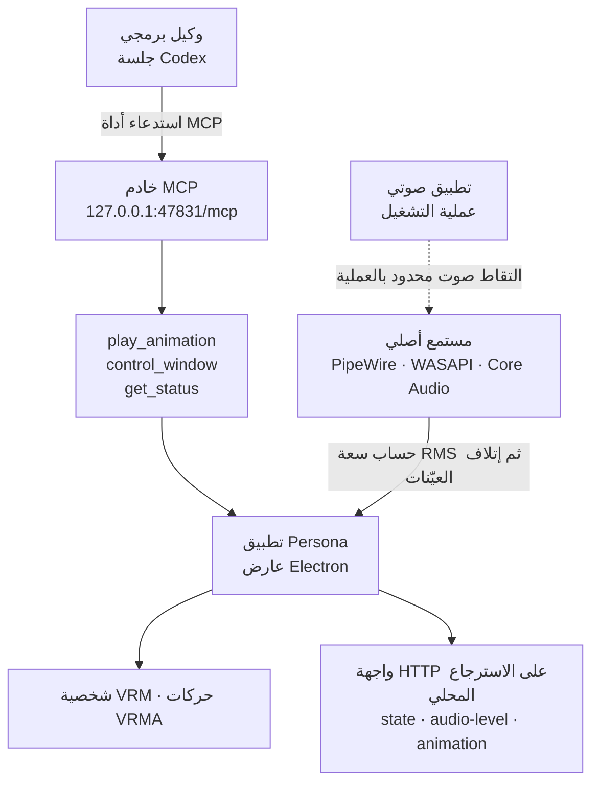

أشيع خطأ عند فتح قدرة جديدة أمام وكيل هو كشف عدد أدوات أكبر من اللازم. فإذا سلّمتموه أداة عامة تقرأ الملفات وتكتبها وتشغّل العمليات، سهُل العمل في الحال وتعذّر على الجميع بعدها وصفُ ما صار ممكنًا. أما مشروع Persona مفتوح المصدر، المنشور في 28 يوليو 2026، فاختار الاتجاه المعاكس. فهو يربط وكيلًا بشخصية ثلاثية الأبعاد تعمل على سطح المكتب، ولا يكشف سوى ثلاث أدوات MCP.


## لماذا يهمّك هذا

كُتب هذا المقال لمهندسي المنصّات الذين يغلّفون أدوات داخلية في خادم MCP لربطها بالوكلاء، ولكل من يقرّر حدود الصلاحية التي تُمنح للوكيل. والخلاصة أولًا: ما يجعل Persona جديرة بالاهتمام ليس أنها شخصية ثلاثية الأبعاد، بل أن طريقة تضييقها لسطح القدرة قابلة للنقل مباشرةً. ثلاث أدوات، ووسائط مغلقة بقوائم enum، وأسماء بوصفها العقد بدل مسارات الملفات، وربط يرفض كل ما هو خارج الاسترجاع المحلي: كلها تؤلّف نمطًا واحدًا متّسقًا. وحتى مع انعدام الاهتمام بالأفاتار، يستحقّ المشروع القراءة مرجعًا في تصميم الأدوات.

## نظرة عامة

Persona تطبيق متعدّد المنصّات يمنح تجارب الصوت على سطح المكتب هوية بصرية. يعرض شخصية بصيغة VRM فوق Electron، ويشغّل حركات بصيغة VRMA. أُنشئ المستودع في 28 يوليو 2026، ويحمل وقت كتابة هذا المقال 410 نجمة و36 نسخة متفرّعة. وشيفرة التطبيق مرخّصة برخصة MIT، أما وسائط الشخصية المرفقة فمستثناة من تلك الرخصة.

والعبارة التي نشرت المشروع على تويتر هي أن ChatGPT صار قادرًا على التحكّم بشخصيته الثلاثية الأبعاد. لكن قراءة وثائق المستودع تعطي صورة أدقّ. فالعميل الذي تسمّيه الوثائق لتسجيل خادم MCP هو Codex. والجزء الذي يرصد خرج الصوت من Codex ومن ChatGPT ليس MCP أصلًا بل التقاط صوت على مستوى نظام التشغيل. وتذكر الوثائق السبب صراحةً: لا يكشف أيٌّ من التطبيقين حاليًا تدفّق أحداث صوتية آنية بين العمليات بصيغة مدعومة، وإذا ظهر تدفّق أحداث رسمي أمكن ربطه بالعقد نفسه دون تغيير نظام النافذة أو الحركات.

أي أن في هذا المشروع وصلتين مختلفتين. الأولى مسار MCP حيث يصدر الوكيل أوامره إلى الشخصية، والثانية مسار رصد الصوت حيث تلحظ الشخصية وجود خرج صوتي. ومبادئ التصميم في المسارين مختلفة، فيجدر الفصل بينهما.



## ما هذه الأداة

نبدأ بجانب MCP. فما دام التطبيق يعمل، تقدّم Persona نقطة نهاية MCP بأسلوب Streamable HTTP. والأدوات المكشوفة ثلاث بالضبط.

| الأداة | المدخل | الأثر |
|---|---|---|
| `play_animation` | `animation`: واحدة من `idle` و`greeting` و`talk` و`happy` و`finger-gun` و`dance` | تُظهر Persona وتشغّل حركة مثبّتة واحدة مرة واحدة |
| `control_window` | `action`: واحدة من `show` و`hide` و`toggle` | تتحكّم بالنافذة دون إنهاء التطبيق |
| `get_status` | لا شيء | تقرأ ظهور النافذة وحالة الصوت وحالة المستمع |

وبفتح `electron/mcp-server.cjs` يتبيّن كيف يلتقي هذا الجدول بالشيفرة. فالخادم يستعمل `McpServer` و`StreamableHTTPServerTransport` من حزمة `@modelcontextprotocol/sdk` الرسمية مباشرةً، ويسمّي نفسه `Persona`، ويأخذ إصداره من `package.json`. وتُعلَن وسائط الأداتين كلتيهما بـ`z.enum`، فيُرفض أي نصّ خارج المجموعة المسموحة عند طبقة المخطّط. كما تُشتقّ قائمة أسماء الحركات من كائن ربط داخل الشيفرة، ما يقلّص بنيويًا احتمال افتراق الجدول الموثّق عن القيم المسموحة فعلًا.

ونصّ تعليمات الخادم جدير بالانتباه أيضًا. فهو يوجّه الوكيل إلى استعمال `play_animation` حين يطلب المستخدم ردّ فعل بصريًا أو حين يخدم ذلك طلبه بوضوح، ويقرّر أن Persona لا تتكلّم ولا تشغّل صوتًا أبدًا وأن `get_status` للقراءة فقط. أي أن شروط الاستعمال وانعدام الآثار الجانبية، وكلاهما لا ينقله مخطّط الأداة، تُرسَل معه عقدًا بلغة طبيعية.

وأجدر القرارات بالنقل هو أن أسماء الحركات عقد منتج لا مسارات ملفات. وتوضّح الوثائق الأثر: يمكن لاحقًا استبدال حزمة الشخصية كاملةً دون تغيير إعداد MCP أو منح وصول جديد لنظام الملفات. فالوكيل يحتاج إلى معرفة الاسم `dance` فحسب، ولا حاجة له بمعرفة الملف الكامن خلفه ولا سبيل لديه إليها.

## التثبيت والتكامل

الإجراء الموثّق قصير. والمتطلّبات هي Node.js 24 أو أحدث، وnpm، وجلسة سطح مكتب بتسريع رسومي عتادي.

```bash
npm install
npm run demo
```

يبني الأمر `npm run demo` العارض الحالي ويشغّل Persona مع تفعيل الرصد التلقائي لخرج الصوت. وللتشغيل في الخلفية:

```bash
npm start -- --background
```

ومع عمل التطبيق، يُسجَّل خادم MCP لدى العميل.

```bash
codex mcp add persona --url http://127.0.0.1:47831/mcp
codex mcp get persona
```

وبعد التسجيل لا بدّ من بدء جلسة جديدة حتى تظهر الأدوات. وإذا غُيّر المنفذ عبر `PERSONA_BRIDGE_PORT` وجب تغيير العنوان المسجَّل معه، لأن نقطة نهاية MCP تتشارك المنفذ مع واجهة HTTP المحلية.

وثمّة مدخلان آخران غير MCP. الأول مخطّط العناوين `persona://` الذي تسجّله حزم التثبيت، حيث تُفتح عناوين مثل `persona://show` أو `persona://speaking?level=0.3` بالأمر `xdg-open` على Linux و`open` على macOS و`start` على Windows. والثاني واجهة HTTP المحلية المربوطة افتراضيًا بـ`127.0.0.1:47831`. وتقبل ثلاثة أنواع من الأحداث هي حالة الصوت والمستوى المعياري ومعاينة الحركة، ويعيد `GET /health` ما إذا كانت Persona تعمل مع آخر حالة. ويغلق حدث الحالة قيمة phase على `inactive` و`starting` و`active` و`stopping`، وقيمة activity على `idle` و`listening` و`speaking`.

ويختلف رصد الصوت بحسب المنصّة. فـLinux يستطلع رسم PipeWire بحثًا عن عقدة التشغيل المستهدفة ويربط بها `pw-record`، وWindows يستعمل استرجاع WASAPI على مستوى التطبيق محصورًا بشجرة العملية المستهدفة، وmacOS ينشئ مرشدًا خاصًا لعملية Core Audio وجهازًا مجمّعًا للعملية الصوتية المختارة. ويحتاج Linux إلى وجود `pw-dump` و`pw-record` في PATH، ويحتاج Windows إلى البنية 20348 أو أحدث، وmacOS إلى الإصدار 14.2 أو أحدث.

## ما تحقّقنا منه

نقولها صراحةً: هذا المقال ليس سجلّ تشغيل للتطبيق. فـPersona تشترط جلسة سطح مكتب بتسريع عتادي، ووسائط الشخصية مستثناة عمدًا من المستودع، فيلزم توفير `assets/model.vrm` وثمانية ملفات VRMA قبل أن تعمل. وبدلًا من ذلك فتحنا وثائق المستودع وشيفرته ونقلنا ما يمكن التحقّق منه فيهما فقط. ولا توجد في هذا المقال أرقام قياس أداء ولا قياسات زمن استجابة.

وإليكم ما أكّدته الشيفرة وبيانات المستودع الوصفية. أُنشئ المستودع في 28 يوليو 2026 وكان آخر دفع فيه في اليوم نفسه، ولغته JavaScript، وفيه 410 نجمة و36 نسخة متفرّعة وصفر مشكلة مفتوحة. ويستعمل `electron/mcp-server.cjs` حزمة MCP الرسمية ويعلن ثلاث أدوات بمخطّطات zod. ويقع `mcp-server.test.cjs` و`bridge-server.test.cjs` في المجلّد نفسه، أي أن للخادمين اختبارات.

كما كُتبت ادّعاءات الخصوصية صراحةً في الوثائق. فكل مستمع محصور بعملية التشغيل الخاصة بالتطبيق المدعوم، وPersona لا تلتقط الميكروفون ولا تحفظ الصوت ولا تنتج كلامًا ولا تفرّغ المحتوى ولا ترسل الصوت عبر الشبكة. وفي مسار Linux تحدّد الوثائق أن سعة RMS تُحسب من العيّنات وأن كل عيّنة تُتلَف فورًا بعد ذلك. وترفض الواجهة المحلية الطلبات التي تحمل ترويسة Host غير محلية، وتُقيَّد عملاء المتصفّح بالمصادر المحلية الموثوقة ومصادر التطبيقات المدعومة.

وثمّة بوّابة لافتة في جانب التوزيع. فإلى أن تُستبدل وسائط الشخصية وتُملأ كل حقول الرخصة والمصدر في `manifest.json` ويُضبط `distributionAllowed` على القيمة الصحيحة، صُمّم مسار الإصدار ليفشل. أي أن الشيفرة تمنع حادثة شحن ملفات الاختبار كما هي.

## ماذا يعني هذا لمنتجات ThakiCloud

Paxis هي السحابة الأصيلة للوكلاء لدينا، وتتعامل مع المهارات والأدوات والسياسات وسجلّات التدقيق بوصفها موارد من الدرجة الأولى. وكيفية كشف الأدوات التي سيستعملها الوكيل هي مسألة التصميم الجوهرية في هذا المنتج، ولذلك تنطبق خيارات Persona انطباقًا مباشرًا.

أولًا، إغلاق سطح القدرة بالأسماء. فقد وضعت Persona ستة أسماء تحت العقد بدل مسارات ملفات الحركات وأخفت الملفات خلفها. وبتطبيق المبدأ نفسه على الأدوات الداخلية يمكنكم كشف مجموعة من أسماء الأفعال المعرَّفة مسبقًا بدل منح وصول إلى الصدفة أو وسائط مسارات. ومجموعة الأسماء المغلقة تجعل ما تفحصه بوّابة السياسة محدودًا، وتحوّل القيم التي تصل إلى سجلّات التدقيق إلى قوائم معدودة بدل نصوص حرّة. وهذا الفارق يزن كثيرًا حين تُجمَّع تلك السجلّات لاحقًا.

ثانيًا، إرسال تعليمات بلغة طبيعية بدل زيادة الأدوات. فنصّ تعليمات خادم Persona يحمل إرشادًا إلى متى تُستعمل كل أداة، ومعه معلومة عن الآثار الجانبية: هذا الخادم لا يصدر صوتًا، واستعلام الحالة للقراءة فقط. وهو تصميم يقرّ بأن المخطّطات وحدها لا تكفي منظومة المهارات لاختيار أداة، وهو عين الاتجاه الذي تدفع إليه قواعدنا في جودة وصف المهارات.

ثالثًا، تضييق حدّ الشبكة. فالجمع بين الربط على الاسترجاع المحلي وحده، ورفض ترويسات Host غير المحلية، وتقييد مصادر المتصفّح، يستحقّ أن يكون الإعداد الافتراضي لأدوات الوكلاء المحلية. والمبدأ نفسه ينطبق في بيئة Paxis القائمة على التنفيذ داخل صندوق معزول. فكلما ضاق السطح الذي تفتحه الأداة سهُل الحفاظ على حدّ العزل.

ويستحقّ الفراغ الذي كشفه هذا المشروع التسجيل أيضًا. فاضطرار المشروع إلى تركيب مرشد صوتي على مستوى نظام التشغيل لمعرفة حالة الصوت يعني أن تطبيقات الوكلاء اليوم تفتقر إلى قناة أحداث معيارية تبثّ حالتها الآنية. وكل أداة تحاول أن تُبنى فوق وكيل تكرّر الالتفاف نفسه. وتصميم تدفّق الحالة عبر قناة معيارية أمر يستحقّ الحسم مبكّرًا حين نبني منصّات وكلاء بأنفسنا.

## الحدود والاعتراضات

نبدأ بالنضج. فعمر المستودع أيام، وحتى مثال وسم الإصدار في الوثائق بصيغة تجريبية. أي أن هذه مرحلة قراءة تصميم لا مرحلة نقاش تبنٍّ إنتاجي.

ثم حاجز التشغيل. فوسائط الشخصية غائبة عن المستودع، فلا يمكن استنساخه وتشغيله فورًا، ويلزم تدبير ملفات VRM وVRMA وملء حقول رخصها. وبلوغ مرحلة التوزيع يقتضي كذلك التأكّد من حقوق إعادة نشر تلك الملفات. وهذا إعداد افتراضي آمن، لكنه كلفة دخول أيضًا.

ونطاق الوظائف ضيّق كذلك. فما فتحه MCP هو تشغيل الحركات والتحكّم بالنافذة وقراءة الحالة فقط، والوثائق نفسها ترسم خطًا بأن Persona تبقى تطبيق سطح مكتب منفصلًا وأن وصلة MCP لا تكشف إلا ضوابطه البصرية. ومن يقترب منها متوقّعًا أفاتار معبّرًا للوكيل سيُصاب بخيبة.

وأخيرًا، في أسلوب التقاط الصوت احتكاك تشغيلي. فـmacOS يطلب مرة واحدة إذن تسجيل صوت النظام، وWindows يشترط بنية معيّنة فأحدث، وLinux يحتاج أدوات PipeWire في PATH. وحتى مع شرح الوثائق لضيق نطاق الالتقاط، ستعدّ المؤسسات ذات السياسات الأمنية الصارمة الوصولَ إلى الصوت نفسه أمرًا يخضع للمراجعة. ويجدر تذكّر أن هذا الأسلوب في جوهره التفاف مؤقّت قد ينكسر إذا غيّر التطبيق المستهدف بنية عملياته.

## الخلاصة

ما يُؤخذ من Persona ليس الشخصية بل طريقة التضييق. ثلاث أدوات، ووسائط enum، وأسماء بوصفها عقدًا، وربط على الاسترجاع المحلي، وبوّابة رخصة تمنع التوزيع. خمسة قرارات تشير كلها إلى الاتجاه نفسه، والنتيجة خادم تُشرَح قدراته في فقرة واحدة.

ولمن يعتزم تغليف أدواته الداخلية بـMCP، الخطوة التالية واحدة. قبل كتابة قائمة الأدوات، اكتبوا أسماء الأفعال التي سيؤدّيها الوكيل في قائمة محدودة. فإن طالت تلك القائمة فتلك إشارة إلى وجوب إعادة تجميع الأفعال نفسها قبل تقسيم الأدوات. فلحظة صيرورة المسارات والنصوص الحرّة وسائطَ تضبب بوّابة السياسة وسجلّ التدقيق معًا.

## المصادر

- [مستودع xikhar/persona](https://github.com/xikhar/persona)، رخصة MIT، أُنشئ في 28 يوليو 2026
- [وثيقة تكاملات Persona (docs/INTEGRATIONS.md)](https://github.com/xikhar/persona/blob/main/docs/INTEGRATIONS.md)
- [شيفرة خادم MCP (electron/mcp-server.cjs)](https://github.com/xikhar/persona/blob/main/electron/mcp-server.cjs)
