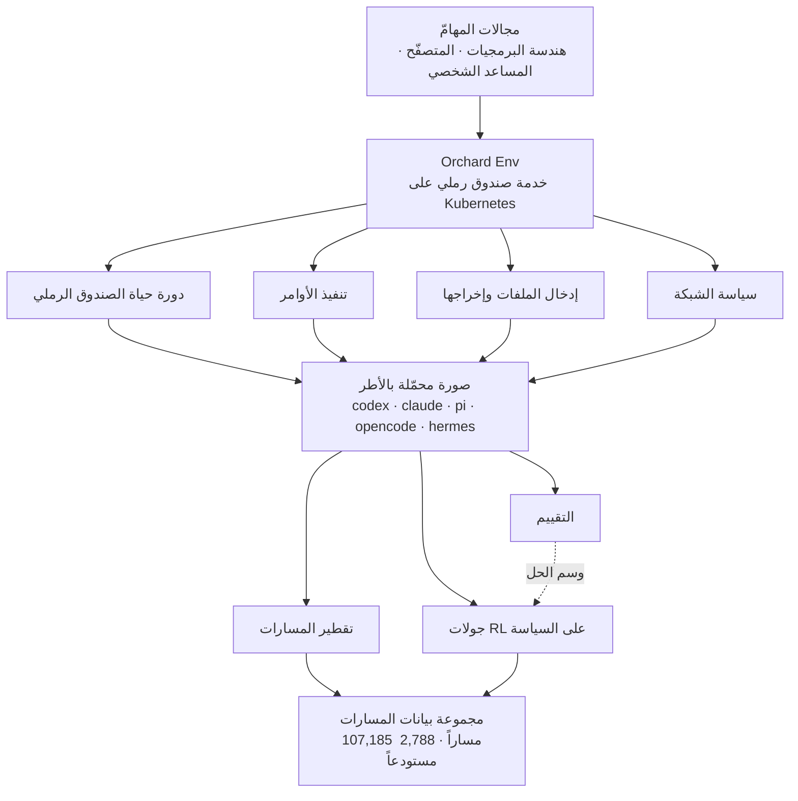

الجدار الأول الذي يصطدم به أي فريق يقرّر تدريب الوكلاء ليس النموذج. إنه تشغيل مئات البيئات المعزولة في وقت واحد، حيث يستطيع الوكيل فعلياً تنفيذ الأوامر وتعديل الملفات والفشل. إطار [Orchard](https://github.com/microsoft/Orchard) الذي أطلقته مايكروسوفت في الثالث من أغسطس 2026 هو بالضبط اقتطاع لطبقة البيئة تلك وإتاحتها برخصة MIT.

## لماذا تقرأ هذا

كُتب هذا المقال لمهندسي المنصّات ومهندسي تعلّم الآلة الذين يريدون تدريب الوكلاء داخلياً أو بناء خط تقييم. الخلاصة أولاً: لم يعد عنق الزجاجة في تدريب الوكلاء هو الخوارزمية بل بنية البيئة، وOrchard ينمّط هذه البنية في خدمة صندوق رملي عامة واحدة فوق Kubernetes، بحيث يتشارك التقطير والتعلّم المعزّز والتقييم القاعدة التنفيذية نفسها. إن كنتم تشغّلون عنقود Kubernetes بالفعل، فهذا التصميم أقرب إلى إعادة استخدام ما تملكونه منه إلى مفهوم جديد يجب تعلّمه.

توضيح قبل البدء: كل رقم أداء في هذا المقال هو قيمة أبلغت عنها مايكروسوفت في ورقتها البحثية ومدوّنتها العامة، وليس قيمة أعدنا إنتاجها داخلياً. إعادة الإنتاج تتطلّب عنقود Kubernetes مزوّداً بوحدات معالجة رسومية وميزانية جولات تمتدّ عبر آلاف المستودعات، وهو ما يتجاوز نطاق هذا المقال. نميّز في المتن رقم مَن هو كل رقم.

## نظرة عامة

خلال العامين الماضيين، كان ما يُنشر في أبحاث الوكلاء نماذج ودرجات معيارية في معظمه، بينما بقيت البنية التي أنتجت تلك الدرجات مغلقة. بنى كل فريق صندوقه الرملي الخاص، وأبقى خط التدريب داخلياً، وراكم مجموعات بيانات المسارات بشكل خاص. لذلك كان التحقّق من أرقام أي ورقة يعني إعادة بناء البنية من الصفر. هذه تحديداً هي المشكلة التي تسمّيها Microsoft Research عند إطلاق Orchard.

مقاربة Orchard غير معتادة قليلاً. فبدلاً من اقتراح خوارزمية تدريب أفضل، يسأل عمّا يحتاجه التدريب والتقييم معاً. الجواب كان بيئة تنفيذ معزولة. جمع المسارات يحتاجها، وتشغيل جولات التعلّم المعزّز يحتاجها، والتقييم النهائي يحتاجها. ما تريده المراحل الثلاث هو صندوق للاستعمال مرّة واحدة ينفّذ الأوامر بأمان ويتيح ملاحظة النتيجة. تحويل هذا القاسم المشترك إلى خدمة تتشاركها المراحل الثلاث هو Orchard Env.

صدرت المخرجات في ثلاثة مواضع: الشيفرة في مستودع [microsoft/Orchard](https://github.com/microsoft/Orchard)، والورقة على [arXiv 2605.15040](https://arxiv.org/abs/2605.15040)، ومجموعة بيانات مسارات التدريب على [Hugging Face باسم microsoft/Orchard](https://huggingface.co/datasets/microsoft/Orchard). ويلخّص [الإعلان الرسمي](https://www.microsoft.com/en-us/research/blog/orchard-an-open-framework-for-scalable-agentic-ai/) من Microsoft Research الصورة كاملة.

## ما هذه التقنية

يقع Orchard Env في المركز. هو خدمة صندوق رملي أصيلة على Kubernetes، وما يعرضه رفيع عن قصد: إدارة دورة حياة الصندوق الرملي، وتنفيذ الأوامر، وإدخال الملفات وإخراجها، وسياسة الشبكة. المهم هنا هو الجانب الغائب: لا ارتباط بإطار وكيل بعينه، ولا بخلفية استدلال بعينها، ولا بمجال مهامّ بعينه.

هذا الفصل ينتج أثراً عملياً كبيراً. صورة الصندوق الرملي تأتي وأطر الوكلاء الرئيسية مثبّتة في PATH مسبقاً، منها codex وclaude وpi وopencode وhermes. لذلك يصبح تغيير الإطار الذي تدرّبون أو تقيّمون مقابله تغييراً في الأمر المنفَّذ لا إعادة بناء للصورة. وحين يرخص تبديل الأطر تسهل تجارب المقارنة، وحين تسهل المقارنة يمكن القول بالبيانات أي إطار أقوى في أي مهمّة.



صدرت فوق ذلك ثلاث وصفات تدريب خاصة بالمجالات: Orchard-SWE لهندسة البرمجيات، وOrchard-GUI للتنقّل في المتصفّح، وOrchard-Claw لمهامّ المساعد الشخصي. وصفة المتصفّح تغلّف بيئة متصفّح حيّ بقدرة على تحمّل الأعطال، تشمل إعادة محاولات التنقّل ومعالجة المهل وإسناد الأعطال إلى أسبابها بشكل مُهيكل. ومن جرّب تشغيل جولات على متصفّح حيّ يعرف لماذا تلزم الثلاثة جميعاً: في بيئة المتصفّح، عدم الفصل بين خطأ الوكيل وصفحة لم تُحمَّل يلوّث إشارة التعلّم نفسها.

صدرت مجموعة البيانات بالتوازي. مسارات عائلة SWE تبلغ 107,185 مساراً، جُمعت عبر 2,788 مستودعاً على GitHub. ويحمل كل مسار وسماً يبيّن ما إذا كانت الرقعة النهائية للوكيل قد اجتازت مجموعة الاختبارات المخفيّة لتلك المسألة. طريقة الوسم هذه هي الجوهر: لأن الإشارة نتيجة تنفيذ اختبار لا درجة تفضيل بشرية، تصبح المكافأة حتميّة وقابلة لإعادة الإنتاج.

## التثبيت والتكامل

المستودع مرخّص بـ MIT، فلا عائق ترخيصي أمام التبنّي الداخلي. نقطة البدء هي سحب الشيفرة وإقامة Orchard Env على العنقود.

```bash
git clone https://github.com/microsoft/Orchard.git
cd Orchard
```

تنحصر المتطلّبات المسبقة في بندين: عنقود Kubernetes صالح للاستخدام، ونقطة نهاية استدلال قادرة على خدمة النموذج قيد الجولات. ولأن Orchard Env غير مرتبط بخلفية استدلال بعينها، يُلبّى البند الثاني بأي مكدّس خدمة يشغّله فريقكم أصلاً. لدينا هو نقطة نهاية vLLM.

ملاحظة صريحة هنا: لم نقدّم مهمّة تدريب فعلية لإعادة إنتاج الأرقام في هذا المقال. سبب التوقّف محدّد، إذ تتطلّب أي جولة ذات معنى ميزانية تنفيذ تمتدّ عبر آلاف المستودعات على عنقود مزوّد بوحدات معالجة رسومية، وهو ما يتجاوز ما يغطّيه مقال تعريفي يُكتب بعد يوم واحد من الإطلاق. لذلك كل رقم أدناه قيمة أبلغت عنها مايكروسوفت، وإعادة الإنتاج داخلياً مفصولة في تجربة مستقلّة.

## النتائج المُبلَّغ عنها

للتأكيد: الأرقام في الجدول أدناه قيم وردت في ورقة مايكروسوفت، وليست قياسات أجريناها.

| مرحلة التدريب | معدّل حلّ المهامّ |
|---|---|
| النموذج الأساسي | 22.0% |
| الضبط الدقيق المُشرَف فقط | 64.3% |
| الضبط الدقيق المُشرَف مع التعلّم المعزّز | 67.5% |

هذا مكسب إجمالي قدره 45.5 نقطة مئوية فوق النموذج الأساسي، وتزعم الورقة أن النتيجة هي الأفضل بين النماذج مفتوحة المصدر ذات الحجم المماثل.

طريقة قراءة الأرقام مهمّة. اللافت ليس الرقم النهائي 67.5 بل توزيع المكسب. فالمسافة من 22.0 إلى 64.3، أي المكسب من الضبط الدقيق المُشرَف وحده، تبلغ 42.3 نقطة مئوية. وإضافة التعلّم المعزّز فوقه تعطي 3.2 نقطة إضافية. أي أن معظم التحسّن جاء من المرحلة التي تحاكي المسارات الجيّدة.

هذا التوزيع يغيّر أولويات الاستثمار. خطوط التعلّم المعزّز مكلفة في البناء والتشغيل معاً، بينما جمع المسارات أبسط نسبياً ويأخذ تسعاً من كل عشر نقاط تحسّن. لذا يُستحسن بفريق يبدأ تدريب الوكلاء أن يركّز أولاً على جمع مسارات ذات وسوم قابلة للتحقّق بدل القفز إلى التعلّم المعزّز، الذي يمكن إضافته لاحقاً دون خسارة. ولا يعني ذلك أن 3.2 نقطة رقم صغير، ففي نطاق تُحسم فيه المنافسة عند الكسور العشرية يحرّك هذا الفارق الترتيب.

## ماذا يعني هذا لمنتجات ThakiCloud

رسالة التصميم التي يبعثها Orchard تمسّ منتجَينا معاً.

نبدأ بـ ai-platform. منصّة ai-platform من ThakiCloud بنية ذكاء اصطناعي متعدّدة المستأجرين تجدول أحمال وحدات المعالجة الرسومية عبر Kueue فوق Kubernetes وتخدم النماذج عبر vLLM. وما يطلبه Orchard Env هو هذه التركيبة بالضبط. أي أن التبنّي لا يعني إدخال بنية متخصّصة جديدة بل إضافة طبقة خدمة صندوق رملي واحدة فوق عنقود يعمل أصلاً. وجولات الوكلاء حمل مكوّن من مهامّ قصيرة العمر وكثيرة العدد، وهو ما ينسجم مع الجدولة القائمة على الطوابير. أما بالنسبة للعملاء الذين يشترطون بيئات داخلية وسيادية فالدلالة أوضح: مسارات التدريب تحمل الشيفرة والوثائق الداخلية كما هي، ما يجعل تدريب الوكلاء من أصعب الأحمال إرسالاً إلى سحابة خارجية. لذلك فإن بنية تدريب مفتوحة المصدر تعمل على عنقودكم أقرب إلى متطلّب منها إلى خيار.

أما Paxis فمساره مختلف. Paxis هو مستوى التحكّم Agent-Native Cloud الذي يعمل فوق ai-platform، ويعامل المهارات والأدوات والسياسات وسجلّات التدقيق بوصفها موارد من الدرجة الأولى. ونقطة التقاطع مع Orchard هي التنفيذ المعزول في صندوق رملي. فـ Paxis ينفّذ المهارات أصلاً داخل صناديق رملية معزولة ويمرّر كل فعل عبر بوّابات السياسة وسجلّات التدقيق، والبدائيات الأربع التي يعرّفها Orchard Env هي عملياً الحدّ الأدنى الذي تحتاجه طبقة تنفيذ كهذه. ويلفت النظر بوجه خاص قرار ترقية سياسة الشبكة إلى بدائية في الصندوق الرملي، إذ إن التحكّم على مستوى البيئة فيما يجوز للوكيل استدعاؤه خارجياً موضع مناسب لتعليق بوّابة سياسة.

وبخطوة إضافية يتّصل المنتجان. سجلّات التدقيق التي يخلّفها Paxis أثناء تنفيذ المهارات هي بحدّ ذاتها مسارات وكلاء. وبإضافة بوّابة حتميّة تحكم بالنجاح والفشل تأخذ شكل المسارات الموسومة التي يطلبها Orchard. عندها تعود سجلّات التشغيل بوصفها بيانات تدريب، وتدور هذه الدورة فوق عنقود ai-platform. وكما خفّضت مايكروسوفت كلفة التبديل بتحميل الأطر مسبقاً في الصورة، فإن تنميط إطار المهارات يحقّق المكسب نفسه.

## الحدود والاعتراضات

تحتاج التوقّعات إلى معايرة.

أولاً كلفة الدخول. يفترض Orchard وجود Kubernetes. وبالنسبة لفريق لا يشغّل عنقوداً، تفوق كلفة تبنّي العنقود كلفة تعلّم الإطار بكثير. هذه ليست أداة تبدأ بها على حاسوب محمول واحد.

ثانياً انحياز مجموعة البيانات. تبدو المسارات البالغة 107,185 وفيرة، لكنها كلها من مستودعات GitHub العامة. والقواعد البرمجية الداخلية تتبع أعرافاً مختلفة: أنظمة البناء تختلف، وبنى الاعتماديات تختلف، وطريقة كتابة المسائل تختلف. فلا ضمان أن نموذجاً دُرّب على مسارات مستودعات عامة يبلغ معدّل الحل نفسه على مستودعات داخلية.

ولطريقة الوسم حدودها أيضاً. فنجاح الاختبارات المخفيّة أو فشلها حتميّ، وهذه قوّته، لكنه يعرّف الصواب داخل ما تلتقطه الاختبارات فحسب. وهو لا يميّز بين رقعة تجتاز الاختبارات بتصميم رديء وأخرى تجتازها بتصميم جيّد. وتتفاقم المشكلة في المستودعات ذات التغطية الاختبارية المنخفضة.

أخيراً التوقيت. حتى لحظة الكتابة مضى يوم واحد على الإطلاق، ولم تتراكم بعد مراجعات المجتمع ولا تقارير إعادة إنتاج مستقلّة. وللسبب نفسه الذي منعنا من إدراج أرقام داخلية، اقرأوا كل رقم متاح الآن مع الوعي بأن الجهة المُصدِرة هي من أبلغت عنه.

## الخلاصة

ما أطلقه Orchard فعلياً ليس وكيلاً أذكى بل مخطّط المصنع الذي يبني الوكلاء. فقد دمج ممارسة كان فيها التقطير والتعلّم المعزّز والتقييم يبني كلٌّ منها بيئته الخاصة، في خدمة صندوق رملي واحدة على Kubernetes، وخفّض كلفة تجارب المقارنة بتحميل الأطر مسبقاً في الصورة، وفتح مئة ألف مسار موسومة بنتيجة الاختبار. وهنا تُستعاد الخلاصة التي ذُكرت في المقدّمة: كان عنق الزجاجة في تدريب الوكلاء هو البيئة لا الخوارزمية، وهذه البيئة صارت موجودة الآن في صورة مفتوحة المصدر ومنمّطة.

وإن اخترتم أمراً واحداً تفعلونه بعد القراءة، فليكن تصميم جمع المسارات لا تصميم خط التعلّم المعزّز. فكون معظم التحسّن جاء من هناك هو أكثر رقم عملي أنتجه هذا الإطلاق. وإن كنتم تشغّلون عنقود Kubernetes بالفعل فكلفة الدخول أقلّ ممّا تبدو، ويصبح العثور على المواضع في سير عملكم الداخلي التي يُحكم فيها على النجاح والفشل تلقائياً هو عملياً المهمّة الأولى.

## المصادر

- [مستودع microsoft/Orchard على GitHub](https://github.com/microsoft/Orchard)
- [Orchard: إطار مفتوح للذكاء الاصطناعي الوكيلي القابل للتوسّع، Microsoft Research](https://www.microsoft.com/en-us/research/blog/orchard-an-open-framework-for-scalable-agentic-ai/)
- [Orchard: إطار نمذجة وكيلية مفتوح المصدر، arXiv 2605.15040](https://arxiv.org/abs/2605.15040)
- [مجموعة بيانات مسارات microsoft/Orchard على Hugging Face](https://huggingface.co/datasets/microsoft/Orchard)
