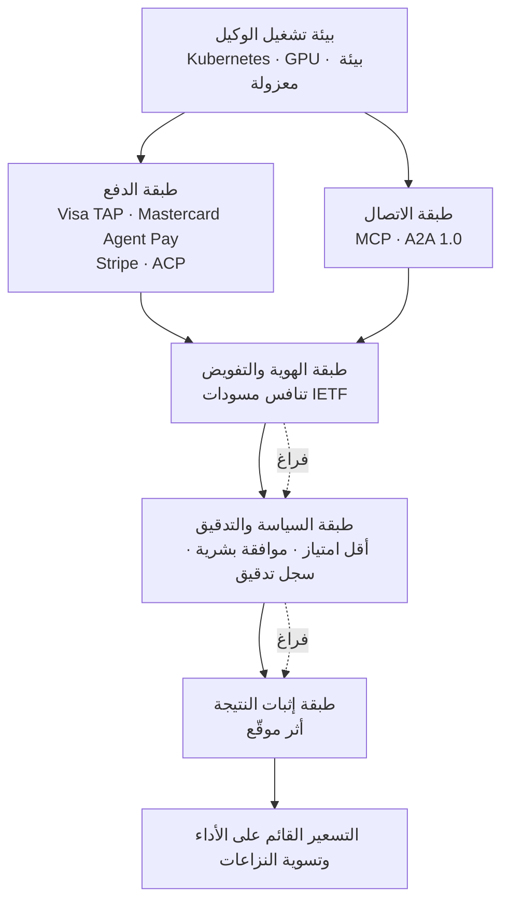

## لماذا تقرأ هذا

هذا المقال موجّه إلى مهندسي المنصات الذين يحاولون فعلاً ربط الوكلاء بعمليات الشركة، وإلى أصحاب القرار الذين عليهم الموافقة على هذا التبني. الخلاصة أولاً: مسألة إعطاء المال للوكيل قد حُلّت بالفعل، والعقدة المتبقية هي الطبقة التي تثبت نيابة عمن يتصرف هذا الوكيل وإلى أي حد يُسمح له بذلك.

في عام 2025 كان هذا مجرد تصور. الآن لم يعد كذلك. Visa و Mastercard و Stripe حوّلت كل منها بنية تحتية لمدفوعات الوكلاء إلى منتج تجاري، والبروتوكول الذي يتيح للوكلاء التحدث فيما بينها انتقل إلى مؤسسة Linux وأصدر النسخة 1.0. في المقابل، ما زال المعيار الذي يعرّف نيابة عمن حصل هذا الوكيل على التفويض ومتى تنتهي صلاحيته مجرد مسودات مقدَّمة بصفة فردية في IETF تتنافس فيما بينها. ما يعيق التبني ليس أداء النماذج، بل هذا التفاوت.

<!-- nlm-visual -->

*NotebookLM이 소스를 종합해 생성한 인포그래픽입니다.*

## ما حُسم خلال عام واحد: المدفوعات والاتصالات

لنبدأ بما انتهى بالفعل.

في جانب المدفوعات، دخلت شبكات البطاقات بنفسها. حدّدت Visa في [Intelligent Commerce](https://www.visa.com/en-us/solutions/intelligent-commerce) مسألة المصادقة والمخاطر والثقة عند بدء الذكاء الاصطناعي معاملة كمشكلة جديدة، وأضافت Trusted Agent Protocol ليتعرف التاجر على الوكيل ويتحقق منه. أعلنت Mastercard في أبريل 2025 عن [Agent Pay](https://www.mastercard.com/global/en/news-and-trends/press/2025/april/mastercard-unveils-agent-pay-pioneering-agentic-payments-technology-to-power-commerce-in-the-age-of-ai.html) وقدّمت Agentic Token الذي يوسّع نظام الترميز القائم. هذه الطريقة تربط بيانات اعتماد البطاقة بنطاق الوكيل والتاجر وسياسة الموافقة. توضح Stripe في [Agentic Commerce](https://stripe.com/use-cases/agentic-commerce) أن الوكيل يدفع ضمن حواجز إنفاق محددة، وأن كل معاملة تظهر في الوقت الفعلي، ويمكن تتبع سجل الشراء. وأضافت OpenAI مع Stripe بروتوكول Agentic Commerce Protocol الذي يتيح [الدفع مباشرة داخل ChatGPT](https://openai.com/index/buy-it-in-chatgpt/).

جانب الاتصالات لا يختلف. بروتوكول [Agent2Agent](https://developers.googleblog.com/en/a2a-a-new-era-of-agent-interoperability/) الذي كشفت عنه Google في أبريل 2025 انطلق بأكثر من خمسين شريكاً، ثم [تم التبرع به لمؤسسة Linux](https://developers.googleblog.com/en/google-cloud-donates-a2a-to-linux-foundation/) في يونيو من العام نفسه، وصدرت مواصفة 1.0 تحت حوكمة المؤسسة في أبريل 2026. كذلك بروتوكول [MCP](https://www.anthropic.com/news/model-context-protocol) الخاص بـ Anthropic أصبح المعيار الفعلي لربط الأدوات قبل أن ينتقل إلى Agentic AI Foundation في ديسمبر 2025.

الإشارة التي يجب قراءتها هنا ليست في المنتجات الفردية. **حين تنتقل مواصفة كانت تقودها شركة واحدة إلى مؤسسة محايدة، فهذا يعني أن التنافس في تلك الطبقة قد انتهى.** إنشاء وسيلة دفع جديدة للوكلاء أو صيغة رسائل جديدة بينها الآن جاء متأخراً. هذا المكان له مالك بالفعل.

## طبقة بلا مالك بعد: الهوية والتفويض

المشكلة تبدأ من هنا. شبكة المدفوعات تحكم على هل يجوز الدفع بهذه البيانات، لكنها لا تحكم على هل هذا الوكيل يمثل فعلاً فلاناً، ومن أعطاه هذا التفويض ومتى، ومتى يُسحب. هذه ليست مسألة دفع، بل مسألة هوية.

هناك محاولات لملء هذا المكان. رُفعت في IETF [مسودة Agent Identity Protocol](https://datatracker.ietf.org/doc/draft-singla-agent-identity-protocol/) وتم تحديثها حتى الإصدار 03 في يونيو 2026. تتناول المعرّفات الموزعة وسلسلة التفويض المشفّرة والصلاحيات القائمة على القدرات والسحب الحتمي. لكن هذه **مسودة مقدَّمة بصفة فردية وليست معياراً معتمداً من IETF.** لا توجد حتى مجموعة عمل رسمية لها. وهناك أيضاً مسودات منافسة عدة. ظهرت في يوليو 2026 مسودة `draft-klrc-aiagent-auth` التي شاركت في تقديمها AWS و Okta و OpenAI وغيرها، وهناك مسودة منفصلة ضمن سلسلة WIMSE. أما على جانب الموردين، فتدفع Microsoft باتجاه Entra Agent ID كمستوى تحكم مخصص لهوية الوكلاء.

تنافس أكثر من ثلاث مسودات في آن واحد يقول شيئين معاً: أن المشكلة حقيقية، وأن لا أحد قد حسمها بعد. وحين نقارن هذا بتقارب شبكات المدفوعات إلى مؤسسة واحدة خلال عام واحد فقط، يتضح مدى فراغ هذه الطبقة.

السؤال الذي يجب الإجابة عليه عملياً ليس هل أنت إنسان. إثبات كون المستخدم إنساناً سوق مزدحم بالفعل تتنافس فيه مقاربات مثل World ID و C2PA. الفراغ المتبقي بجانبه مباشرة. من أنت، ونيابة عمن حصلت على التفويض، وما الذي يُسمح لك بفعله، وحتى متى، وكيف يمكن سحب هذه الصلاحية فوراً عند الحاجة. إثبات الصلاحية أسبق من إثبات كون الفاعل إنساناً.

وريثما يستقر معيار لهذا، يجب تدوين هذه المعلومات في مكان ما الآن. أقل ما يمكن تعبئته فوراً لكل وكيل داخلي هو الحقول الخمسة التالية.

```yaml
agent:
  id: agent://thaki/contract-review-42   # المعرّف الفريد لهذا الوكيل
  owner: legal-team                       # الجهة المسؤولة عند وقوع حادثة
  delegated_by: hong                      # نيابة عمن يتصرف هذا الوكيل
  expires_at: 2026-08-16T12:00:00+09:00   # وقت انتهاء التفويض. التفويض غير المحدد المدة ليس تفويضاً
  scope:
    read: [contracts/*]
    write: [review/*]
    payment: { daily_limit_krw: 500000 }
  revocation: https://iam.internal/agents/contract-review-42/revoke
```

الجوهر هنا ليس في بنية الحقول، بل في ألا يبقى مساران انتهاء الصلاحية والسحب فارغين. حين يُحسم المعيار لاحقاً، يمكن نقل هذه الحقول الخمسة إلى تلك الصيغة بسهولة، أما إن لم تُعبَّأ هذه الحقول الآن فلن يكون هناك ما يُنقل أصلاً.

وهناك طبقة إضافية تُضاف هنا. حين يبدأ وكيل باستدعاء وكيل آخر، يتحول التفويض إلى سلسلة. إذا كلّف الوكيل A الوكيل B بمهمة، وقام B باستدعاء خدمة خارجية أخرى، فيجب على جهة ما أن تحسب ما إذا كان الاستدعاء الأخير لا يزال ضمن نطاق صلاحية الشخص الأصلي. هنا يكمن سبب عدم كفاية الضمان المالي وحده. حجز المال إجراء يُلجأ إليه بعد وقوع النزاع، أما منع الاستدعاء الذي يتجاوز نطاق الصلاحية من الأساس فيتطلب حساباً يتتبع السلسلة كاملة ويضيّق النطاق خطوة بخطوة. ولهذا السبب بالتحديد تتناول جميع مسودات IETF المتنافسة سلسلة التفويض وآلية السحب.

## طبقة بلا مالك بعد: الصلاحية والأمان

حين يبدأ الوكيل فعلاً بلمس أنظمة حقيقية، تظهر مشكلة أخطر من الهلوسة. وهي حقن الأوامر غير المباشر، حيث يقرأ الوكيل مستنداً خارجياً يحتوي على تعليمات مزروعة فيه فيتغير سلوكه تبعاً لها.

عرّف NIST هذا بأنه اختطاف للوكيل وشدّد تقييماته، وأفاد فريقه الأحمر الداخلي بأنه [رفع نسبة نجاح هذا الهجوم من 11 بالمئة إلى 81 بالمئة](https://www.nist.gov/news-events/news/2025/01/technical-blog-strengthening-ai-agent-hijacking-evaluations) باستخدام أساليب هجوم جديدة. كشفت Anthropic بدورها عن [دفاعات ضد حقن الأوامر](https://www.anthropic.com/research/prompt-injection-defenses) في وكلاء استخدام المتصفح، مؤكدة أن هذا يُظهر تقدماً وليس ادعاءً بأن المشكلة قد حُلّت. وحتى النماذج التي خفّضت نسبة نجاح الهجوم إلى نحو واحد بالمئة تُقرّ بوجود مخاطر ذات دلالة لا تزال قائمة.

مدى إلحاح هذا المجال يظهر في تحرك OWASP. كانت قائمة [LLM Top 10 2025](https://genai.owasp.org/resource/owasp-top-10-for-llm-applications-2025/) قد أوصت بالفعل ضمن بند الصلاحية المفرطة بمبدأ أقل امتياز وموافقة بشرية للإجراءات عالية الخطورة، لكن في ديسمبر 2025 صدرت [قائمة Top 10 مخصصة للوكلاء](https://genai.owasp.org/resource/owasp-top-10-for-agentic-applications-for-2026/) بشكل منفصل تماماً. تضع هذه القائمة عشرة تهديدات مستقلة تبدأ من اختطاف الهدف وتصل إلى الوكيل الخارج عن السيطرة، في وثيقة منفصلة. هذا يعني أن إضافة بند واحد إلى الوثيقة القائمة لم يعد كافياً.

لذلك تنتقل نقطة الحسم في منصات الوكلاء المستقبلية من مدى ذكاء الوكيل إلى **مدى ضيق الصلاحية الممنوحة له ومدى سرعة سحبها**.

## طبقة بلا مالك بعد: إثبات النتيجة

انتقل نموذج التسعير بالفعل من الاشتراك بحسب المقاعد إلى التسعير القائم على الأداء. تتقاضى Fin من Intercom [0.99 دولار لكل تذكرة محلولة](https://www.intercom.com/pricing)، وتشغّل Salesforce Agentforce نموذج Flex Credit الذي يعادل [0.10 دولار لكل إجراء](https://help.salesforce.com/s/articleView?id=004811240&language=en_US&type=1). كلا الرقمين سعر معلن اعتباراً من أغسطس 2026، وقابل للتغيير من المورّد في أي وقت.

هنا يظهر سؤال لا يملكه أحد. يسأل العميل: تقول إن الوكيل حلّ هذه التذكرة، فهل حُلّت فعلاً؟

للإجابة على هذا يجب أن تُثبت جهة ما ما إذا كانت النتيجة قد تحققت فعلاً، وما إذا كان الوكيل هو السبب، وما إذا كانت ضمن الوقت المتعاقد عليه، وما إذا تدخل إنسان في الأثناء، وما إذا حدث تراجع عن الإجراء. حالياً تقدّم هذا الإثبات كل شركة عبر لوحتها الخاصة. الإعلان الذي قدّمته Judgment Labs، وهي شركة متخصصة في تحليل المسارات وكشف أنماط الفشل، عن جمع [32 مليون دولار في جولتي Seed و Series A مجتمعتين](https://www.businesswire.com/news/home/20260512621556/en/) في مايو 2026 يعكس حجم هذا الطلب.

حتى التقييم نفسه تجاوز مجرد تصحيح المخرجات. توضح Anthropic في [تقييم الوكلاء](https://www.anthropic.com/engineering/demystifying-evals-for-ai-agents) أن التقييم الآلي وحده غير كافٍ، ويجب أن يُستكمل بمراقبة الإنتاج والمراجعة البشرية. أما [دليل تقييم الوكلاء](https://developers.openai.com/api/docs/guides/agent-evals) من OpenAI فيصحّح على أساس مسار التنفيذ بأكمله: هل اختير الأداة الصحيحة، وهل تم التصعيد عند الحاجة، وهل وقع انتهاك للسياسة.

حين يتجه التقييم في هذا الاتجاه تتغير طبيعته. لم يعد أداة ضمان جودة تقيس بعد النشر، بل يصبح **بوابة تفصل بالمرور من عدمه قبل التنفيذ**. إذا قارنّاه بـ Kubernetes فهو أقرب إلى admission controller. يجمع معاً نسبة نجاح المهمة والامتثال للسياسة والمخاطر المالية والتكلفة والقيمة الفعلية المتحققة، ثم يفصل بين المرور والمراجعة والحظر.

حين يُخزَّن ذلك الحكم كأثر موقَّع، تنفتح المرحلة التالية دفعة واحدة. إذا كان كل سجل يربط، بخصوص مهمة معينة، ما فعله أي وكيل وهل تحقق منه العميل وهل وقع انتهاك للسياسة وكم كانت التكلفة وكم القيمة المتحققة، فإن هذا السجل نفسه يصبح أساس الفوترة ودليل مستوى الخدمة المتفق عليه ومدخل درجة السمعة في آن واحد. والأهم أنه عند نشوب نزاع يمكن للطرفين النظر إلى السجل نفسه والتحدث عنه. غياب هذا حالياً هو ما يجعل عبارتي "لوحتنا تُظهر أن المشكلة حُلّت" و"نحن لم نشعر بأنها حُلّت" تسيران في خطين متوازيين لا يلتقيان.

السمعة أيضاً تُبنى من المادة نفسها. بدلاً من خمس نجوم، يُستخدم فعلياً في التشغيل تراكم نسبة نجاح المهمة ونسبة انتهاك السياسة ونسبة التراجع ونسبة التدخل البشري ومتوسط التكلفة ووقت الاستجابة، مصنّفة بحسب نوع المهمة. قد يجيد الوكيل نفسه مراجعة العقود بينما يخفق في البحث على الويب، وإذا ضُغطت هذه الفروقات كلها في درجة واحدة فلن تصلح لأي قرار عملي.

## إعادة رسمها كطبقات

حين نرتّب ما سبق كطبقات، يظهر الفراغ بوضوح.



الطبقتان السفليتان انتقلتا إلى المؤسسات، والتسعير القائم على الأداء في الأعلى يديره كل مورّد بمفرده. الطبقات الثلاث الوسطى فارغة. وحين تكون الوسط فارغة لا يتصل الأعلى بالأسفل. شبكة المدفوعات تنقل المال لكنها لا تعرف ما إذا كان هذا الإنفاق تفويضاً مشروعاً، ونظام الفوترة يرسل الفاتورة لكنه لا يستطيع إثبات أن النتيجة كانت حقيقية.

## ليس كل فراغ يجب أن يُبنى

بعد رسم الخريطة يجب أن يقوم الحكم المعاكس أيضاً. فهناك مواضع واضحة يكون البناء فيها الآن متأخراً جداً أو غير قابل للفوز.

بطاقة أو محفظة مخصصة للوكلاء جاءت متأخرة. الدخول في هذا المكان الذي حوّلته Visa و Mastercard و Stripe بالفعل إلى منتج تجاري يعني المواجهة المباشرة، ولا يوجد سبب يدفعنا للتنافس مع شبكات البطاقات على هذا الفوز. النماذج الأساسية أيضاً كذلك. أطر الوكلاء العامة طبقة تُبنى فوق بروتوكولات انتقلت إلى المؤسسات، وتختفي فيها ميزة التمايز بسرعة. أنظمة إثبات هوية الإنسان مزدحمة أصلاً. أما الوكلاء الصوتيون فناضجون تقنياً، لكن مجرد الرد على الهاتف أصبح سلعة شائعة بسرعة، وإن لم يُبنَ فوقه سير عمل وإيراد فعلي فلن يبقى تمايز.

في المقابل، المكان الذي لا يزال فارغاً هو الطبقات الوسطى الثلاث التي رأيناها. تفويض الصلاحية وبوابة السياسة، وتدقيق السلوك، والتحقق من النتيجة، والأساس الذي يربط هذه الثلاث معاً ليتمكن الوكلاء المتعددون من التبادل بأمان. الوقوف في الطبقة التي تربط شبكات الدفع ومزودي النماذج ومزودي الهوية وتضبطها فرصة فوز أكبر من المواجهة المباشرة معهم.

## دلالات تطبيقية لمنتجات ThakiCloud


*Thaki Agent Control Plane. الطبقتان السفليتان هما بنيتنا التحتية، والطبقات الست فوقهما هي مستوى التحكم.*

طريقة نظر ThakiCloud إلى هذه الخريطة بسيطة. نحن لا نبني شبكة دفع ولا نموذجاً أساسياً. بدلاً من ذلك، نبني مستوى تحكم يتيح للشركات تفويض الصلاحية والميزانية والمهام للوكلاء بأمان.

**Paxis** يستهدف هذه الطبقة مباشرة بوصفه Agent-Native Cloud. يتعامل Paxis مع المهارات والأدوات والسياسات وسجلات التدقيق كموارد من الدرجة الأولى. يختار من بين مئات المهارات ما يناسب المهمة عبر البحث، وينفذه في بيئة معزولة، ويمرّر كل سلوك عبر بوابة سياسة وسجل تدقيق. من بين الفراغات المذكورة أعلاه، طبقة السياسة والتدقيق هي بالضبط موقع هذا المنتج. مبدأ أقل امتياز وبوابة الموافقة البشرية التي طلبت OWASP وثيقة منفصلة لأجلهما ليسا قاعدة تُكتب في موجّه، بل عقداً يجب أن تفرضه بيئة التشغيل، وقد صممنا نظامنا ليكون الكود هو من يملك هذا الفرض.

**Signum** يسند الطبقة التي تليها من الأسفل، طبقة الهوية. حكمنا هنا هو ألا نبني نظام هوية جديداً من الصفر. في وضع تتنافس فيه ثلاث مسودات IETF وتدفع Microsoft بمستوى تحكم خاص بها، فإن الرهان على فائز واحد مخاطرة. الموقع الواقعي هو مستوى تفويض محايد يربط بين Keycloak وأنظمة IAM السحابية ودلائل الشركات. الأفضل أن يُربط بكل وكيل مالكه ومن فوّضه ونطاق صلاحياته ووقت انتهائها ومسار سحبها، مع إبقاء إمكانية استبدال أي مزود هوية يأتي تحت هذا كله.

**Metis** يبني الجدوى الاقتصادية لهذه البنية. لكي ينجح التسعير القائم على الأداء، يجب أن تكون تكلفة المهمة الواحدة أقل بوضوح من القيمة المتحققة منها، ومعظم هذه التكلفة تكلفة استدلال. خفض تكلفة الخدمة يصنع مباشرة هامش نموذج أعمال الوكلاء، وبهذا المعنى فإن طبقة الاستدلال وطبقة الوكلاء ليستا منتجين منفصلين بل بنية ربح وخسارة واحدة. هذا المزيج مناسب بشكل خاص لعملاء القطاع العام والمالي في السوق المحلي حيث تشتد متطلبات البيئات المحلية والشبكات المغلقة. كلما زادت الحاجة إلى عدم مغادرة سجلات التدقيق وسجلات التفويض خارج الشركة، أصبحت القدرة على نشر مستوى التحكم فوق البنية التحتية الخاصة شرط شراء فعلياً.

## الحدود والاعتراضات

لهذا التحليل ثلاثة اعتراضات محتملة.

أولاً، قد لا يبقى الفراغ فارغاً طويلاً. إذا نظرنا إلى سرعة استقرار شبكة المدفوعات خلال عام واحد، فمن المرجح أن تستولي مؤسسة أو مورّد كبير على طبقة الهوية أيضاً قبل نهاية 2027. في تلك الحالة قد ينكمش موقع مستوى التفويض المحايد إلى طبقة تكامل فقط. لكن حتى في تلك الحالة يبقى العمل على ربط مزودي هوية متعددين قائماً.

ثانياً، قد يكون إثبات النتيجة مشكلة توافق وليس مشكلة تقنية. تعريف "تم الحل" يختلف من مجال لآخر، وإذا كانت الجهة التي تحكم عليه هي مزود الخدمة نفسه فستُثار مسألة الحياد. صياغة أثر موقّع أمر سهل، لكن جعل الطرفين يعترفان به مسألة مختلفة تماماً.

ثالثاً، الفجوة بين لغة التسويق والتبني الفعلي كبيرة. لنأخذ GEO مثالاً: أفادت ورقة KDD لعام 2024 بتحسين الظهور بنسبة تصل إلى 40 بالمئة في ظروف تجريبية، لكن [مسحاً نقدياً](https://arxiv.org/abs/2607.14035) صدر في 2026 يشير إلى أنه لا توجد حتى الآن تقنية أثبتت أنها ترفع بثبات وعلى المدى الطويل عبر منصات متعددة إمكانية الاكتشاف العضوي أو النتائج التجارية. حديث بنية الوكلاء يصعب أن يتفادى الفخ نفسه. ما يحتاجه الوضع الآن ليس صورة كبرى، بل قياس فعلي في مجال واحد لنسبة النجاح والتكلفة وعدد النزاعات.

## خلاصة

مسألة إعطاء المال للوكيل حلّتها شبكات البطاقات، ومسألة إتاحة تواصل الوكلاء فيما بينها حلّتها المؤسسات المعيارية. ما تبقى هو المسافة بينهما. الطبقة التي تحدد نيابة عمن يتصرف هذا الوكيل، وإلى أي حد يُسمح له، وهل ما فعله للتو نتيجة حقيقية، لا معيار لها بعد ولا فائز.

لذلك ما يستحق البناء الآن ليس وكيلاً صوتياً آخر ولا لوحة تقييم أخرى، بل ربط التفويض والسياسة وإثبات النتيجة في مستوى تحكم واحد. الخطوة الأولى الممكنة فوراً واضحة أيضاً. اختر وكيلاً واحداً يعمل داخل شركتك، ودوّن ما الصلاحيات التي يملكها الآن، ومن منحها له، وكيف تُسحب. في معظم المؤسسات هذه الحقول الثلاثة فارغة، وهذا الفراغ هو النسخة الداخلية من الفراغ الذي تحدث عنه هذا المقال.

## المصادر

- [Visa Intelligent Commerce](https://www.visa.com/en-us/solutions/intelligent-commerce)
- [إعلان Mastercard Agent Pay](https://www.mastercard.com/global/en/news-and-trends/press/2025/april/mastercard-unveils-agent-pay-pioneering-agentic-payments-technology-to-power-commerce-in-the-age-of-ai.html)
- [Stripe Agentic Commerce](https://stripe.com/use-cases/agentic-commerce)
- [OpenAI الدفع داخل ChatGPT](https://openai.com/index/buy-it-in-chatgpt/)
- [كشف Google عن A2A](https://developers.googleblog.com/en/a2a-a-new-era-of-agent-interoperability/) · [التبرع لمؤسسة Linux](https://developers.googleblog.com/en/google-cloud-donates-a2a-to-linux-foundation/)
- [Anthropic Model Context Protocol](https://www.anthropic.com/news/model-context-protocol)
- [مسودة IETF draft-singla-agent-identity-protocol](https://datatracker.ietf.org/doc/draft-singla-agent-identity-protocol/)
- [تقييم NIST لاختطاف الوكلاء](https://www.nist.gov/news-events/news/2025/01/technical-blog-strengthening-ai-agent-hijacking-evaluations)
- [دفاعات Anthropic ضد حقن الأوامر](https://www.anthropic.com/research/prompt-injection-defenses)
- [OWASP Top 10 for LLM Applications 2025](https://genai.owasp.org/resource/owasp-top-10-for-llm-applications-2025/) · [OWASP Top 10 for Agentic Applications 2026](https://genai.owasp.org/resource/owasp-top-10-for-agentic-applications-for-2026/)
- [تسعير Intercom](https://www.intercom.com/pricing) · [تسعير Salesforce Agentforce](https://help.salesforce.com/s/articleView?id=004811240&language=en_US&type=1)
- [تقييم Anthropic للوكلاء](https://www.anthropic.com/engineering/demystifying-evals-for-ai-agents) · [دليل تقييم الوكلاء من OpenAI](https://developers.openai.com/api/docs/guides/agent-evals)
- [مسح GEO النقدي 2026](https://arxiv.org/abs/2607.14035)
