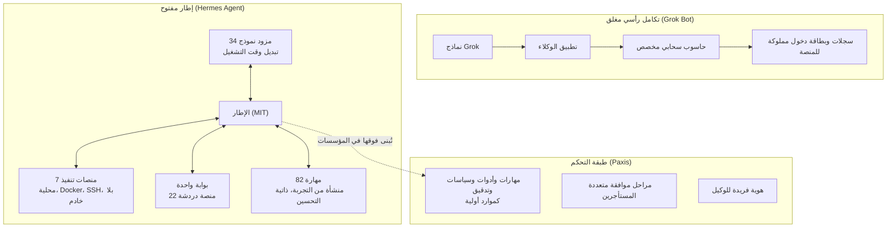

إذا كنت مهندس منصة أو قائد تقني تقرر ما إذا كان من المناسب إدخال الوكلاء (agents) إلى مؤسستك، وأي طبقة تحتفظ بها وأي طبقة تشتريها، فجدل هذا الأسبوع في منصات الوكلاء يستحق وقتك. الخلاصة: دعوى «نسخة Grok Bot مفتوحة المصدر بنسبة 100%» قريبة من الحقيقة على محور الإطار (harness)، وغير حقيقية على محور الحاسوب السحابي.


*إطار موديولاري شفاف فوق مكعبات قابلة للاستبدال، مقابل النصب الصلب في الخلفية: فصل الإطار ضد التكامل الرأسي.*

## لماذا تقرأ هذا المقال

هذا المقال موجه للفرق التي تريد تحويل السؤال من «أي تطبيق وكيل من أي شركة نستخدم» إلى «أي طبقة نحتفظ بها داخل الشركة». إطلاق Grok Bot في أوائل أغسطس، والدعوى اللاحقة بأسبوع بوجود «نسخة مفتوحة المصدر بنسبة 100%»، تشير إلى الاتجاه نفسه. التحقق من هذا الاتجاه مقابل الكود يمنحك معيارا لاختيار الطبقة التي تتحكم فيها بين النموذج والإطار وبيئة التنفيذ.

## نظرة عامة

في 11 أغسطس، أطلقت SpaceXAI النسخة التجريبية من Grok Bot: تطبيق وكلاء لـ macOS وiOS وWindows وLinux، حيث ينشئ المستخدم عضوا رقميا مستقلا، ويسجل الوكيل الدخول وينفذ الأعمال بنفسه. الفكرة هي منح الوكيل حاسوب سحابيا مخصصا. وقد قرأنا هذا الإطلاق من خلال عدسة الهوية وسجلات التدقيق في مقالنا بتاريخ 12 أغسطس.

التوقيت لم يكن عرضيا. في ذلك الأسبوع نفسه، أُطلق Grok 4.6 واجه إعادة ضبط حدود الاستخدام، ودفعت NVIDIA نموذجًا مفتوحًا خفيفًا موجّهًا لأعمال الوكلاء. وبينما تتبدل ترتيبات النماذج كل ربع سنة، يتحول محور المنافسة التالي من النموذج نفسه إلى البيئة التي يعمل فيها النموذج. كان الحاسوب السحابي المخصص في Grok Bot موجهًا لهذا المحور بالذات، لذا لم تكن استجابة المجتمع مفتوح المصدر بعد أسبوع عشوائية.

بعد أسبوع من الإطلاق، نشر Shubham Saboo، مدير منتجات الذكاء الاصطناعي في Google وصاحب مشروع awesome-llm-apps مفتوح المصدر، قائلا: «INSANE. This is 100% Open Source version of Grok Bot. Works with any Agent harness. Let that sink in.» تجاوزت التغريدة 120 ألف مشاهدة. حددت آلية الإثراء الداخلية لدينا بتاريخ 20 أغسطس أن الهدف المذكور هو Hermes Agent من معسكر مفتوح المصدر. يأخذ هذا المقال هذا التحديد كمقدمة، لكنه لا يعامل الدعوى نفسها كحقيقة؛ نفصل ما يصمد وما لا يصمد بالاستناد إلى كود يمكن التحقق منه.

## Grok Bot وHermes Agent: بُنيان رأسيان

Grok Bot متكامل رأسيًا. النموذج (Grok) والتطبيق (عميل الوكلاء) وبيئة التنفيذ (الحاسوب السحابي المخصص) حزمة واحدة. ما يشتريه المستخدم ليس وكلاء، بل غرفة كاملة التجهيز يعمل فيها. الراحة في أقصى درجاتها، وأبواب الغرفة لا تُفتح. بيانات الدخول وأذونات التنفيذ وسجلات التدقيق كلها ملك للمنصة، ويبقى المستخدم مستأجرا.

Hermes Agent هو البنية المقابلة. يصف README الرسمي له (وهو وكيل «ذاتي التحسين» من Nous Research برخصة MIT) نفسه كالتالي: «استخدم أي نموذج تريد: Nous Portal وOpenRouter وOpenAI ونهايتك الخاصة (your own endpoint) وعديد غير ذلك. بدّل الأمر بـ hermes model دون تغييرات في الكود ودون قفل.» ولا يعيش فقط على حاسوبك: Telegram وDiscord وSlack وWhatsApp وSignal وCLI كلها تُخدم من عملية بوابة واحدة، بينما يعمل التنفيذ على سبعة منصات طرفية تمتد من المحلية إلى Docker وSSH وSingularity وModal وDaytona وVercel Sandbox.

| المحور | Grok Bot (رأسي) | Hermes Agent (فصل الإطار) |
|---|---|---|
| النموذج | عائلة Grok فقط | 34 مزودا، تبديل وقت التشغيل |
| التنفيذ | حاسوب سحابي مخصص مُدار | 7 منصات، ذاتي الاستضافة |
| الواجهات | أربعة تطبيقات أصلية | 22 منصة دردشة عبر بوابة واحدة |
| الرخصة | الكود غير منشور | MIT، كامل الكود منشور |

## ما وجدته مراجعة الكود

الدعوان «مفتوح المصدر بنسبة 100%» و«يعمل مع أي إطار وكيل» قابلتان للتدقيق. جلبنا مستودع Hermes Agent كوحدة فرعية (submodule) وعُدّدت أرقام الجدول أعلاه مباشرة.

يحتوي دليل `plugins/model-providers/` على 34 مزودا: Anthropic وOpenAI Codex وGemini وxAI وDeepSeek وBedrock وVertex وOllama Cloud وcustom (نهايتك الخاصة). تبديل النموذج مُنفذ كفعل فيزيائي: استبدال مكوّن المزود. الترجمة الصادقة لعبارة «يعمل مع أي إطار وكيل» هي «يعمل مع أي نموذج».

يحتوي دليل `plugins/platforms/` على 22 واجهة: Telegram وSlack وWhatsApp وLine وWeCom وDiscord وIRC وSMS وغيرها. عملية بوابة واحدة تمثل وكيلًا واحدًا عبر كل هذه المنصات تحل المشكلة نفسها التي يحلها تطبيق Grok Bot بأربعة تطبيقات أصلية (وكيل واحد، واجهات كثيرة) بالحل المعاكس (كل المنصات موصولة ببوابة واحدة).

في `tools/terminal_tool.py` تأكدنا من المنصات السبع: local وdocker وssh وsingularity وmodal وdaytona وsandbox. هذه القائمة هي جوهر محور «الحاسوب السحابي». بحسب README، توفر Daytona وModal استمرارية بلا خادم (serverless persistence): البيئة تدخل سباتًا عند الخمول وتستيقظ عند الطلب. الشرط أن هذه الخدمة بلا خادم ليست مُستأجرة لك؛ المشغل يوصّل حسابه الخاص في Modal أو Daytona.

يحتوي دليل `skills/` على 82 ملف SKILL.md مجمعة، ويحتوي `plugins/` على 18 مجلد إضافات تشمل memory وcron_providers وbrowser وobservability. حلقة التعلم المغلقة (الوكيل ينشئ مهارات من التجربة ويحسنها أثناء الاستخدام) هي الدعوى المركزية في README، وكل مرحلة في هذه الحلقة تعيش في هذا الكود المنشور. إضافة memory تملك الذاكرة طويلة الأمد التي يُدارتها الوكيل، وcron_providers يملك أتمتة الجدولة بلغة طبيعية، وتوافق معيار agentskills.io يجعل المهارات قابلة للنقل. كل مرحلة من حلقة التعلم يمكن فتحها وقراءتها ككود، مما يعني أن «ذاتي التحسين» شيء موجود في قاعدة الكود وليس عبارة تسويقية.

مسار التثبيت قابل للتحقق أيضًا. أمر التثبيت الرسمي في README سط واحد على Linux وmacOS وWSL2 وTermux:

```bash
curl -fsSL https://hermes-agent.nousresearch.com/install.sh | bash
```

ويندوز الأصلي يستخدم أمر سطر واحد في PowerShell، وآندرويد له مسار موثق في Termux. يذكر README أن المثبت يجلب uv وPython 3.11 وripgrep وffmpeg، وتأكدنا من تلك الاعتمادات في `setup-hermes.sh` بالمستودع. «يعيش حيث تعيش» هي في الحقيقة «يُركّب بالكامل على جهازك»: أقصر طريقة لوصف الفرق البنيوي مع Grok Bot.



بعبارة أخرى، تشريح دعوى «نسخة مفتوحة المصدر بنسبة 100%» هو هذا: على محور نشر الكود تصمد. على محور تبديل النموذج تصمد. على محور بيئة التنفيذ، «التكوين منشور» تصمد، أما «الحاسوب يُعطى لك» فلا تصمد. حيث إن حاسوب Grok Bot السحابي خدمة مُدارة، فإن الجانب مفتوح المصدر وصفة ذاتية الاستضافة تشمل خيارات بلا خادم. نفس المسألة تحل بطريقة كحزمة وبالأخرى كقائمة قطع.

## آثار ThakiCloud على المنتجات

هذا التكوين هو السؤال الذي نواجهه يوميًا أثناء تصميم Paxis.

**عدسة Paxis.** Paxis هو سحابة ThakiCloud الأصلية للوكلاء (Agent-Native Cloud)، حيث تُعامل المهارات والأدوات والسياسات وسجلات التدقيق كموارد أولية. المهارات الـ 82 المضافة وبنية الإضافات التي يعرضها Hermes تشير إلى المسألة نفسها من نقطة بداية مختلفة. الإطارات مفتوحة المصدر حلت أولًا سؤال «كيف يتحسن الوكيل بنفسه» لمستخدم واحد أو فريق واحد، بينما يجب على Paxis حل ما يُبنى فوق ذلك: وكلاء أي فرق، وبأي أذونات، وعن أي مراحل موافقة، وباسم من تُسجل كل عملية. هذه هي خانة «من» في سجل التدقيق التي ناقشناها في مقالنا بتاريخ 12 أغسطس. حيث يسجل Grok Bot الدخول بحساب بشري، يفصل Paxis بين هوية فريدة للوكيل، ومجموعة أذونات الأدوات، والتدقيق على مستوى الجلسة. ما أثبتته الإطارات مفتوحة المصدر أن هذا الفصل قابل للحياة تقنيًا؛ وما تبقى هو مدى ثباته تحت تعدد المستأجرين المؤسسي.

الفجوة ملموسة في ثلاثة مواضع. الأول الموافقة: 82 مهارة و 18 إضافة تفتح كلها بحكم شخص واحد، لكن في المؤسسة تحتاج أفعال الوكلاء التي تقرأ بيانات داخلية أو ترفع ملفات خارجيًا موافقة طبقية، وهذه الموافقة يجب أن تأتي من بوابة سياسة المنصة لا من حلقة تنفيذ الوكيل لتكون قابلة للتدقيق. الثاني الهوية: حيث تمثل بوابة واحدة 22 منصة، إرجاع طلب قادم من قناة معينة إلى جلسة وكيل معينة عمل المنصة. الثالث التدقيق: حلقة تعلم فيها يغيّر الوكيل سلوكه عبر مهارات أنشأها نفسه قوية، لكن إذا استُبعدت الحلقة نفسها من التدقيق، فلجواب لسؤال «هل وسّع الوكيل أذونات نفسه؟». جعل هذه الأشياء الثلاثة موارد أولية هو الطبقة التي يبنيها Paxis فوق الإطار.

**عدسة ai-platform.** محور بيئة التنفيذ يهبط في البنية التحتية. قراءة قائمة المنصات السبع تُظهر طلب تنفيذ الوكلاء ينتقل من «حاسوبي» إلى «أي بيئة معزولة». ومع نمو هذا الطلب، يصبح توفير بيئات تنفيذ مخصصة للوكلاء بنية تحتية في الطبقة نفسها التي توفر فيها خدمة النموذج. «طبقة تنفيذ الوكلاء» تنضم إلى الإحداثيات التي يستهدفها Telox وVelox في GPUaaS والبنية العارية (bare metal)، إلى جانب طبقة خدمة Metis. معاملة الإطار مفتوح المصدر لنهايته الخاصة (مزود custom) كمواطن أولي إشارة أيضًا إلى أن هذه الطبقة مطلوبة داخل الموقع.

## القيود والاعتراضات

نذكر حدود الدليل بصراحة.

أولًا، الدعوى الأصلية «نسخة مفتوحة المصدر بنسبة 100%» هي تغريدة من مطور واحد. لم نستطع فتح الهدف الدقيق لتلك الروابط أثناء هذه المراجعة. تحديد الهدف بـ Hermes Agent قائم على إثراءنا الداخلي الذي يستشهد بمقارنيتين؛ مقدمة هذا المقال هي هذا التحديد. إن كانت المقدمة تشير إلى مكان آخر، تبقى الحجة الجوهرية (جوهر فصل الإطار) صامدة، لكن إطار «بديل Grok Bot» يحتاج تعديلًا.

ثانيًا، انتبه لدلالة «مفتوح المصدر بنسبة 100%». الكود منشور، لكن التجربة الافتراضية تشير لا تزال إلى بورتال الشركة نفسها (Nous Portal). نشر الكود ونشر الافتراضي مسألتان مختلفتان، والأخرى أكثر ما تتطلب التحكم المؤسسي.

ثالثًا، يجب ألا تُهمل نقاط قوة Grok Bot. الحاسوب السحابي المُدار يضم الهوية والاستخدام والفوترة، وهي ليست خالية من الأعباء؛ وجود الأعباء نفسه هو الفائدة. ما تسلّمه الإطارات مفتوحة المصدر للمشغل هو مجموع كل ما تخفيه الخدمة المُدارة.

رابعًا، Hermes Agent مشروع مؤسسة واحدة. حوكمته واستجابته الأمنية ودعمه طويل الأمد على مقياس مختلف عن منصة مؤسسية. «مفتوح المصدر بنسبة 100%» وصف حالة الكود، وليس وعدًا بالنضج التشغيلي.

## الخاتمة

تتحرك تكوينات منصات الوكلاء كالتالي: أصحاب النماذج يجمعون الوكيل والتنفيذ في حزمة واحدة ويبيعون الراحة. معسكر مفتوح المصدر يفصل الإطار عن النموذج والبيئة ويبيع التحكم. دعوى «Grok Bot مفتوح المصدر بنسبة 100%» ضغطت هذا التباين في جملة واحدة، ووجدت مراجعة الكود أنها دقيقة على محور فصل الإطار وقابلة لتصحيح إلى «قائمة القطع منشورة» على محور الحاسوب السحابي.

المعيار الذي نتركه للفريق المعتمد: انظر إلى الطبقات الثلاث (النموذج، الإطار، بيئة التنفيذ) بشكل منفصل، وفرّق بين ما يُبدل بسهولة وما يُبدل بصعوبة. النماذج اليوم قطع قابلة للاستبدال في الجانبين. الطبقة التي يجب أن تمتلكها حقًا هي طبقة التحكم المبنية فوقها: المهارات والسياسات وسجلات التدقيق. عندما تنقسم القرارات على تلك الطبقة، يصبح اختيارك اليوم بين إطار كود منشور وحزمة مُدارة قوة تفاوضك في الخطوة التالية.

---

*المصادر: التغريدة الأصلية لـ Shubham Saboo (x.com)، وتغطية HuggingNews لإطلاق Grok Bot التجريبي، وREADME الرسمي ومستودع Hermes Agent من Nous Research (تم التحقق مقابل الكود بتاريخ 2026-08-21)، وتحليل ThakiCloud لتقنية Grok Bot بتاريخ 12 أغسطس 2026. تحديد الهدف المذكور في التغريدة بـ Hermes Agent استنتاج من إثرائنا الداخلي، ونصرح بذلك.*