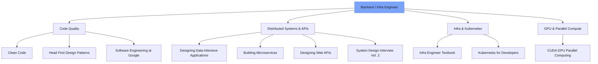

> **TL;DR**  
> **📚 Clean Code · Head First Design Patterns · Designing Data-Intensive Applications · Building Microservices · Designing Web APIs · System Design Interview Vol. 2 · Infrastructure Engineer's Textbook · Software Engineering at Google · Easy Kubernetes for Developers · CUDA-based GPU Parallel Processing**  
> إذا كان بإمكانك شرح *"محتوى"* **خمسة أو أكثر** من هذه الكتب العشرة، فأنت مستعد بالفعل لبدء محادثة مع فريقنا.

---

<!-- evolve-diagram -->
*رسم تخطيطي توضيحي*

## لماذا نتحدث عن معايير التوظيف من خلال 'قائمة كتب'؟

نحن نقدر **موقف حل المشاكل** و**عمق التعلم** أكثر من الخبرة.  
تجربة قراءة كتاب حتى النهاية، وتطبيقه على الممارسة، وحتى شرحه للزملاء تثبت الكفاءة المستدامة في حد ذاتها.  
لهذا السبب نعتبر الكتب العشرة التالية **محو الأمية الأساسي لمهندسي البنية التحتية والخلفية**.

---

## 1. 《Clean Code》

* **المؤلف**: Robert C. Martin  
* **الكلمات المفتاحية الرئيسية**: القابلية للقراءة، إعادة البناء، التسمية  
* **لماذا نقدره**  
  1. **الصيانة طويلة المدى**: حتى الشركات الناشئة تطور بسرعة كود قديم. الكود النظيف يقلل التكاليف.  
  2. **التواصل في الفريق**: التسمية الجيدة وتقسيم الوظائف يعمل كوثائق. يمكّن التواصل أسرع من الكلمات.  
  3. **عادات إعادة البناء**: عادة إجراء تحسينات صغيرة مع كود الاختبار تعزز استقرار الخدمة.

---

## 2. 《Head First Design Patterns (2nd)》

* **المؤلف**: Eric Freeman & Elisabeth Robson  
* **الكلمات المفتاحية الرئيسية**: البرمجة الكائنية، SOLID، إعادة الاستخدام  
* **لماذا نقدره**  
  1. **لغة الأنماط**: المحادثات مثل "هل يجب أن نتحول إلى نمط الاستراتيجية؟" تصبح ممكنة، مما يسرع التعاون.  
  2. **التصميم القابل للتوسع**: عندما تنمو المتطلبات، يمكنك 'توسيع' الكود بدلاً من 'إصلاحه'.  
  3. **التعلم البصري**: الصور والأمثلة التفاعلية تقلل منحنى التعلم.

---

## 3. 《Designing Data-Intensive Applications》

* **المؤلف**: Martin Kleppmann  
* **الكلمات المفتاحية الرئيسية**: الأنظمة الموزعة، CAP، Event Sourcing  
* **لماذا نقدره**  
  1. **منظور المقياس**: يمكّن القرارات المبنية على الأدلة مثل "هل يجب أن نضيف بعض زمن الاستجابة للقراءة لتحسين الاتساق؟"  
  2. **خطوط أنابيب البيانات**: فهم شروط الحدود CDC·stream·batch.  
  3. **تفكير المقايضة**: العثور علمياً على نقطة التوازن بين الأداء·الاستقرار·التعقيد.

---

## 4. 《Building Microservices (2nd)》

* **المؤلف**: Sam Newman  
* **الكلمات المفتاحية الرئيسية**: تحليل المجال، CI/CD، القابلية للملاحظة  
* **لماذا نقدره**  
  1. **التحليل المدفوع بالمجال**: إجراء أحكام مبنية على الأدلة حول 'متى' تقسيم الكتل الأحادية.  
  2. **القابلية للملاحظة**: تقليل وقت استرداد الفشل من خلال السجلات·المقاييس·التتبع المتكامل.  
  3. **طوبولوجيا الفريق**: تطوير منظور لتصميم الهياكل التنظيمية وهياكل الخدمة معاً.

---

## 5. 《Designing Web APIs》

* **المؤلف**: Brenda Jin, Saurabh Sahni & Amir Shevat  
* **الكلمات المفتاحية الرئيسية**: REST، OpenAPI، DX  
* **لماذا نقدره**  
  1. **العقد أولاً**: التصميم المبني على OpenAPI يسمح لجميع فرق العميل بالعمل في وقت واحد.  
  2. **استراتيجية الإصدار**: كشف الميزات الجديدة دون كسر التوافق.  
  3. **DX**: تسريع تأهيل الشركاء من خلال الوثائق التلقائية·sandbox·كود المثال.

---

## 6. 《System Design Interview Vol. 2》

* **المؤلف**: Alex Xu, Sahn Lam / **المترجم**: Lee Byung-jun  
* **الكلمات المفتاحية الرئيسية**: تصميم النظام واسع النطاق، المقابلات، المقايضات  
* **لماذا نقدره**  
  1. **تحليل المشكلة**: هيكلة المتطلبات بسرعة بالمخططات التدفقية·الرسوم البيانية.  
  2. **تواصل المقايضة**: إقناع خيارات CAP·PACELC من خلال 'الكلمات'.  
  3. **حس المقابلة العملي**: التدريب على تحديد الأولويات فوراً تحت القيود.

---

## 7. 《Infrastructure Engineer's Textbook》

* **المؤلف**: Sano Yutaka / **المترجم**: Kim Sung-jae  
* **الكلمات المفتاحية الرئيسية**: الخادم، الشبكة، المحاكاة الافتراضية، العمليات  
* **لماذا نقدره**  
  1. **فهم البنية التحتية كاملة المجموعة**: الطبقات الفيزيائية·الافتراضية·السحابية تأتي في الرؤية في لمحة.  
  2. **تحسين العمليات**: نهج منهجي للاستجابة للحوادث·تحليل السبب الجذري (RCA).  
  3. **منظور MSP**: تطوير حساسية التصميم متعدد المستأجرين·SLA.

---

## 8. 《Software Engineering at Google》

* **المؤلف**: Titus Winters, Tom Manshreck, Hyrum Wright / **المترجم**: 개앞맵시  
* **الكلمات المفتاحية الرئيسية**: قاعدة الكود واسعة النطاق، المراجعة، الأتمتة  
* **لماذا نقدره**  
  1. **صحة الكود**: تعلم مبادئ وحالات 'الكود المستدام'.  
  2. **ثقافة المراجعة**: تقديم طرق لممارسة إدارة الجودة المبنية على الإجماع.  
  3. **عملية الهندسة**: فهم فلسفة أدوات الإنتاجية التي أدت من Borg → Kubernetes.

---

## 9. 《Easy Kubernetes for Developers》

* **المؤلف**: William Denniss / **المترجم**: Lee Jun  
* **الكلمات المفتاحية الرئيسية**: Kubernetes، النشر، قابلية التوسع  
* **لماذا نقدره**  
  1. **دليل عملي**: كائنات Kubernetes وكتابة YAML تصبح 'فورية' مألوفة.  
  2. **أتمتة العمليات**: بناء خدمات مستقرة مع التحديثات المتدرجة·فحوصات الصحة·HPA.  
  3. **تفكير أصلي للسحابة**: اكتساب مفهوم 'البنية التحتية غير القابلة للتغيير' بشكل طبيعي.

---

## 10. 《CUDA-based GPU Parallel Processing》

* **المؤلف**: Kim Deok-su  
* **الكلمات المفتاحية الرئيسية**: CUDA، البرمجة المتوازية، التحسين  
* **لماذا نقدره**  
  1. **حس الأداء**: تجربة تجميع الذاكرة·خيوط warp من خلال الترميز اليدوي.  
  2. **البنية التحتية للذكاء الاصطناعي**: حل عقد الاختناق مباشرة في خطوط أنابيب التدريب·الاستنتاج للنماذج واسعة النطاق.  
  3. **فهم هيكل GPU**: العمق الذي يحفر إلى مستوى SM·Tensor Core يصبح ميزة تنافسية.

---

## الأشخاص الذين نبحث عنهم

|| الكتاب الواجب قراءته | إتقانك | مثال عملي |
||:------|:----------:|:----------|
|| Clean Code | ✅ / ❌ | خبرة اقتراح نقاط إعادة البناء في مراجعات الكود الداخلية |
|| Head First Design Patterns | ✅ / ❌ | سجلات PR لتطبيق أنماط مثل Strategy·Observer·Decorator |
|| Designing Data-Intensive Apps | ✅ / ❌ | تصميم·تشغيل خط أنابيب مبني على Kafka + CDC |
|| Building Microservices | ✅ / ❌ | بناء خطوط أنابيب النشر لـ 10+ خدمات |
|| Designing Web APIs | ✅ / ❌ | توليد الكود المبني على OpenAPI Spec·إدارة الإصدار |
|| System Design Interview Vol. 2 | ✅ / ❌ | خبرة حل مشاكل تصميم النظام واسع النطاق للمقابلات |
|| Infrastructure Engineer's Textbook | ✅ / ❌ | قيادة الهجرة من في المقر → السحابة |
|| Software Engineering at Google | ✅ / ❌ | تعزيز إعادة البناء واسعة النطاق مع مراجعة الكود·أدوات الأتمتة |
|| Easy Kubernetes for Developers | ✅ / ❌ | عمليات Kubernetes المبنية على Helm·GitOps |
|| CUDA-based GPU Parallel Processing | ✅ / ❌ | تسريع 2× لاستنتاج النموذج مع نوى CUDA مخصصة |

* إذا كان بإمكانك ملء **ستة صناديق أو أكثر بـ '✅'** بثقة في الجدول أعلاه، يرجى التقديم!  
* نود سماع حالات حيث **قرأت بعمق، وبرمجت يدوياً، وشرحت للزملاء** خلال المقابلة.

---

## طريقة التقديم والاستفسارات

1. يرجى إرسال سيرتك الذاتية·محفظة·رابط GitHub إلى **info@thakicloud.co.kr**.  
2. إذا كان لديك **حالات حيث طبقت ما تعلمته من الكتب على الممارسة**، يرجى إرفاقها بحرية بأي تنسيق.  

> إذا كنت **زميلاً جاداً في التعلم**، فنحن نبقي أبوابنا مفتوحة دائماً.  
> نأمل أن تخبرنا الخطوط تحت ستة كتب أو أكثر قصتك.  
> **لننشئ كوداً أفضل وخدمات أفضل معاً!**

---

*شكراً لك على القراءة. إذا كنت تريد المشاركة، فقط "انسخ الرابط" وانتهيت!*

---

<!-- evolve-refs -->
## المراجع

- [Designing Data-Intensive Applications](https://dataintensive.net/)
- [Software Engineering at Google (مجاني عبر الإنترنت)](https://abseil.io/resources/swe-book)
- [Building Microservices, 2nd Edition](https://samnewman.io/books/building_microservices_2nd_edition/)
- [System Design Interview (ByteByteGo)](https://bytebytego.com/)
