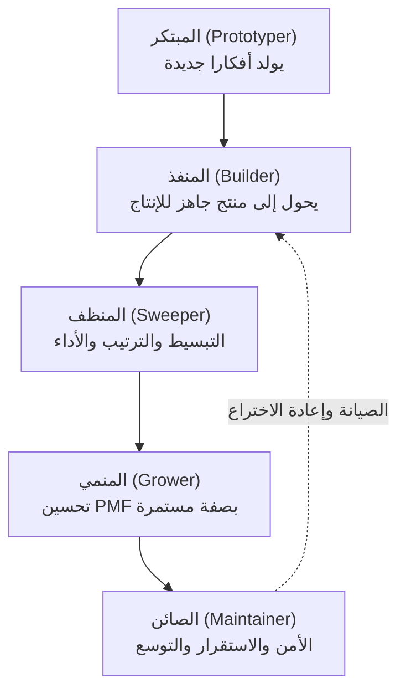
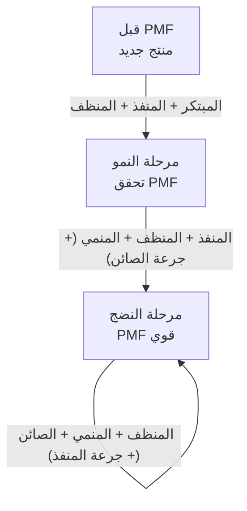

## نظرة عامة

يتكرر مشهد بات مألوفا: المسمى الوظيفي لا يصف بعد الآن ما يفعله صاحبه فعلا. المصمم يكتب نماذج أولية بالكود، والمهندس يجري مقابلات مع المستخدمين، وعالم البيانات يحسم اتجاه المنتج. مع امتصاص أدوات الذكاء الاصطناعي للجانب الميكانيكي من كل وظيفة، تتداخل حدود الهندسة والمنتج والتصميم والتحليل وتذوب في كتلة واحدة.

أمام هذا التحول، رصد Boris Cherny صانع Claude Code ملاحظة لافتة: حين أمعن النظر في فريق Claude Code الذي ينتمي إليه، وجد خمسة نماذج أصيلة للأدوار تتشكل بمعزل عن الوظائف الرسمية. وأهمية هذه الملاحظة بسيطة: إنها تطرح فرضية مفادها أن منظمات المستقبل قد تبني فرقها على أساس هذه النماذج لا على أساس الوظائف التقليدية.

يتناول هذا المقال ماهية النماذج الخمسة، وسبب انفصالها عن الوظائف الرسمية، والتركيبة اللازمة منها في كل مرحلة من مراحل نضج المنتج. هذا ليس ملخصا تقنيا، بل مقال ثقافي يتساءل: كيف نبني الفرق وكيف ننظر إلى التوظيف؟ وهو سؤال مباشر بصفة خاصة لمنظمات كـ ThakiCloud حيث يعمل البشر والوكلاء الآليون جنبا إلى جنب.

## النماذج الأصيلة الخمسة

النماذج التي صاغها Cherny هي كالتالي، مع توضيح كيف يظهر كل نموذج في الفرق الفعلية.

**المبتكر (Prototyper)** هو من يتصور أفكارا جديدة كليا. يطرح أفكارا بكثافة، لكن معظمها لا يصل إلى الإطلاق. قيمة هذا النموذج ليست في معدل نجاحه، بل في كثافة الأفكار التي ينتجها. حتى لو رُفض تسعة من كل عشرة أفكار، فإن غياب من يفتح آفاقا جديدة يعني توقف المنظمة عن التقدم إلى أراض مجهولة.

**المنفذ (Builder)** هو من يحول النماذج الأولية والأفكار بسرعة إلى منتجات أو بنية تحتية جاهزة للإنتاج. دوره تضييق المسافة بين الفكرة والإطلاق. إن كان المبتكر يرسم المخططات، فالمنفذ يحول تلك المخططات إلى مبانٍ قائمة.

**المنظف (Sweeper)** هو المرتب بامتياز: يصقل الواجهات المبعثرة، ويبسط الكود والأنظمة، ويزيل الميزات غير المستخدمة، ويرفع الأداء. عمله الحذف لا الإضافة. قرار إلغاء ميزة (unship) يستدعي شجاعة لا تقل عن شجاعة بنائها.

**المنمي (Grower)** يأخذ منتجا قائما ويحسنه باستمرار لرفع مستوى الملاءمة مع السوق (PMF). لا يعيد رسم اللوحة من الصفر، بل يعمل على الصورة الموجودة ليرفع معدلات التحويل ويخفض الاضطراب ويراكم تحسينات صغيرة.

**الصائن (Maintainer)** هو من يتملك الأنظمة الناضجة. يحافظ على الأمن والاستقرار والسرعة والكفاءة مع تنامي الأنظمة. لا بريق في عمله، لكن من دونه ينهار المنتج الناجح تحت ثقله.

## النموذج ليس وظيفة

جوهر هذه الملاحظة ليس القائمة في حد ذاتها، بل حقيقة أن هذه النماذج لا ترتبط بالوظائف الرسمية. يقول Cherny إنه حين ينظر إلى Anthropic في مجملها يجد بعض المصممين ينتمون إلى النموذج الأول (المبتكر)، وآخرين إلى الثاني (المنفذ)، وغيرهم إلى الثالث (المنظف). والأمر ذاته ينطبق على المهندسين ومديري المنتجات وعلماء البيانات.

بمعنى آخر، تفقد عبارة "نوظف مصمما" من معناها يوما بعد يوم. فالمصمم المبتكر الذي يفتح آفاقا جديدة يختلف اختلافا جذريا في طريقة إسهامه عن المصمم المنظف الذي يصقل ويكمل. المسمى الوظيفي يخبرك بالأدوات التي تعلمها، لكنه لا يخبرك بالحظة التي يتألق فيها.

كثيرون يجمعون بين نموذجين، وأحيانا ثلاثة. من يجمع بين المبتكر والمنفذ نادر وثمين في الشركات الناشئة المبكرة. ومن يجمع بين المنظف والصائن يشكل عمود فقري فرق البنية التحتية الناضجة. بدلا من حشر كل شخص في صندوق واحد، الأدق أن ننظر إلى الطيف الذي يقع عليه في هذه النماذج.

## تشكيل الفرق وفق دورة حياة المنتج

السبب الحقيقي لأهمية هذه النماذج هو أنها تصبح صيغة لتشكيل الفرق. يرى Cherny أن الفريق الصحي يحتاج إلى تركيبة مختلفة من النماذج وفق درجة نضج المنتج.

المنتج الجديد الذي لم يجد بعد ملاءمته مع السوق يحتاج إلى أشخاص أقوياء في النماذج الأول والثاني والثالث (المبتكر + المنفذ + المنظف). في هذه المرحلة لا أحد يعرف ما الصواب، لذا القدرة على البناء السريع والتخلي السريع وتغيير الاتجاه باستمرار هي ما يهم. تجميع أشخاص ذوي ميول صون قوية في هذه المرحلة يعني صون ما لم يُبن بعد.

المنتج في طور النمو بعد تحقيق الملاءمة مع السوق يحتاج إلى النماذج الثاني والثالث والرابع (المنفذ + المنظف + المنمي) مع جرعة من النموذج الخامس (الصائن). الاتجاه معروف الآن، فالمهمة رفع الجودة وتحسين التحويل مع قدر أدنى من الاستقرار لاستيعاب المستخدمين المتزايدين.

المنتج الناضج ذو الملاءمة القوية مع السوق يحتاج إلى النماذج الثالث والرابع والخامس (المنظف + المنمي + الصائن) مع جرعة من النموذج الثاني (المنفذ). المهمة إبقاء النظام بسيطا، والتحسين المستمر، والحفاظ على الأمن والسرعة في مستويات التوسع، مع البناء الجديد حين يلزم فحسب.

الدلالة العملية لهذه الصيغة واضحة: حين تضيف شخصا إلى الفريق، السؤال الأول ليس "هل يعاني الفريق من نقص في المهندسين؟" بل "أي نموذج يغيب عن فريقنا في هذه المرحلة؟" إشباع فريق منتج ناضج بالمبتكرين يعني فيضا من الأفكار الجديدة دون من يصون النظام. والعكس، جمع الصائنين في منتج لم يجد ملاءمته بعد يعني التحصن لحماية ما لا وجود له أصلا.

## منظور ThakiCloud: إعادة رسم الأدوار في عصر الوكلاء

الملاحظة القائلة بأن حدود الوظائف تذوب تصبح أحد المشهدية في المنظمات التي يعمل فيها البشر والوكلاء جنبا إلى جنب. حين تستوعب وكلاء الذكاء الاصطناعي حصة وافرة من عمليات البناء الميكانيكية، ينجرف البشر تلقائيا نحو النماذج الأصيلة الأكثر أهمية في كل مرحلة من مراحل المنتج. العنق الزجاجي لن يكون الأيدي التي تكتب الكود، بل العقول التي تشخص أي نموذج تحتاجه اللحظة.

Paxis، الحوسبة السحابية Native للوكلاء التي تشغلها ThakiCloud، تجسد هذا التحول على مستوى طبقة النظام. تعامل Paxis المهارات والأدوات والسياسات وسجلات التدقيق بوصفها موارد من الدرجة الأولى، وتختار أكثر من 960 مهارة عبر BM25 وتنفذها في بيئات معزولة. كما قال Cherny إن الأشخاص تُعاد صياغتهم وفق لحظات المنتج لا وفق مسمياتهم الوظيفية، كذلك تُجمع Paxis قدرات الوكلاء ديناميكيا وفق متطلبات المهمة لا وفق خطوط أنابيب جامدة. المبتكر يطرح الأفكار، فيحولها وكيل بدور المنفذ إلى كود جاهز للإنتاج، ثم يرتب بوابة التحقق بدور المنظف المخرجات، وكل ذلك يتكرر داخل حزمة المهارات.

على صعيد البنية التحتية، يضطلع ai-platform من ThakiCloud بالعمل الكامل للنموذج الصائن. جدولة وحدات GPU عبر Kueue، وتقديم النماذج عبر vLLM، والوفاء بمتطلبات الخصوصية والسيادة في بيئات K8s متعددة المستأجرين: كل ذلك هو بالضبط عمل الصائن الذي يحفظ الأمن والاستقرار والكفاءة في الأنظمة الناضجة. تفويض منظمات العملاء لهذا الجانب إلى المنصة يتيح لفرقهم الانتشار أكثر في اتجاه المبتكرين والمنميين.

هذا المنظور مفيد للتوظيف أيضا. تنظر ThakiCloud إلى المتقدمين من زاوية أي نموذج يمثلون، لا من زاوية مسمياتهم في السيرة الذاتية. الشخص الذي يملأ النموذج الغائب عن مرحلتنا الحالية هو من يخلق أكبر قدر من الرافعة للفريق. السؤال ليس "ماذا تحسن؟" فحسب، بل "أي لحظة تتألق فيها؟"

## حدود الإطار والحجج المضادة

قبل قبول هذا الإطار دون نقد، تستحق الحجج المقابلة الاستماع. أشار Ben Vinegar في السياق ذاته إلى أن "الناس يكتشفون كيف تعمل منظمات البرمجيات للتو، ثم يخطئون في عزو ديناميكيات الفرق القديمة إلى الذكاء الاصطناعي." اعتراض حاد ومشروع: التمييز بين المبتكر والصائن موجود منذ ما قبل الذكاء الاصطناعي، وأن درجة نضج المنتج تحدد نوع الموهبة المطلوبة ليست فكرة جديدة.

ثمة حدود للتصنيف في حد ذاته. كل محاولة لوضع الناس في خمسة صناديق تعاني من خطر تبسيط الأفراد تبسيطا مفرطا. في الواقع، يتنقل الشخص الواحد بين عدة نماذج من مشروع لآخر، بل خلال اليوم الواحد. الخطأ هو النظر إلى النماذج بوصفها هويات ثابتة، فيصدر حكم من قبيل "أنت منظف إذن لا تقترح أفكارا جديدة"، وهذا عكس الغرض تماما. لهذا شدد Cherny نفسه على أن كثيرين يجمعون بين نماذج متعددة.

ومع ذلك، تبقى قيمة هذا الإطار في اللغة التي يمنحها لا في قدرته التنبؤية. حين يصبح بإمكانك القول "يعاني فريقنا من نقص في المنمين" بدلا من "نحتاج مزيدا من المهندسين"، تنتقل محادثات التوظيف وتشكيل الفرق إلى مستوى أكثر دقة وجدوى. كلما جردت الذكاء الاصطناعي الوظائف من طبقتها الميكانيكية، كلما كان ما يبقى هو الأحكام على مستوى هذه النماذج. أدوار المنتج في المستقبل قد تشبه هذه النماذج أكثر مما تشبه المسميات الوظيفية اليوم.

## خاتمة

ذوبان حدود الوظائف ليس أزمة، بل إعادة تشكيل. النماذج الخمسة: المبتكر والمنفذ والمنظف والمنمي والصائن تكشف ما يبقى حين تختفي المسميات الوظيفية. ما يبقى ليس الأدوات، بل جوهر السؤال: في أي لحظة وبأي طريقة يقدم الشخص إسهامه؟

تبني ThakiCloud منظمة يتقاسم فيها البشر والوكلاء هذه النماذج. كلما تولت الوكلاء قدرا أكبر من عمليات البناء والصون المتكررة، كلما تركزت قدرة البشر على قراءة أي نموذج تحتاجه مرحلة المنتج الراهنة. تلك القراءة ستكون أثمن القدرات في العقد القادم.

## المصادر

- Boris Cherny, X(@bcherny), 2026-06-29: [التغريدة الأصلية](https://x.com/bcherny/status/2071379474277613732)
- Ben Vinegar, X(@bentlegen): [تغريدة الرد والاعتراض](https://x.com/bentlegen/status/2071576459538567463)
