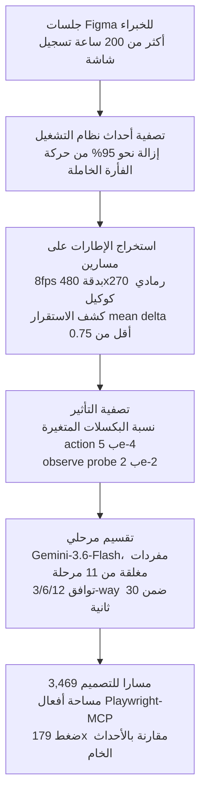

## لماذا تقرأ هذا

إن كنت مهندس تعلم آلي تبني وكيل computer-use يقوم بأعمال تصميم في Figma، أو تبحث عن بيانات تدريب له، فهذا هو المرجع. FigmaTrace، التي فتحت مصدرها Patronus AI في 20 أغسطس، هي أول مجموعة بيانات computer-use متخصصة في التصميم: أكثر من 200 ساعة من تسجيلات شاشة خبراء حُوّلت إلى 3,469 مسارا، تحت رخصة CC-BY-4.0 تتيح لك استخدامها في SFT تجاري كما هي. النتيجة الجوهرية أمامك: قيمة هذه المجموعة ليست في المسارات الـ 3,469 نفسها، بل في طريقة التقسيم المرحلي (phase-based) التي تحوّل تسجيلات الشاشة إلى تسلسلات أفعال قابلة للتدريب. في تجربة الورقة، SFT على نفس البيانات مع القصّ حسب طول السياق مقابل القصّ حسب مرحلة التصميم يفترق بنسبة 7.3 نقاط مئوية، ويفوز القصّ المرحلي.

## نظرة عامة

عنق الزجاجة في بيانات الوكلاء GUI معروف: مجموعات التنقل على الويب (Mind2Web، VideoGUI وما يليها) كثيرة، لكن كاد لا يكون هناك بيانات تسجّل العملية الإبداعية للتصميم. المحاولات السابقة عكست التسمية من ملفات التصميم الجاهزة أو حوّلت HTML إلى JSON متوافق مع Figma للتدريب. لكن إعادة بناء العملية من المنتَج الجاهز يفقد الإشارة التي تخبرنا لماذا اختار المصمم تلك المرتبة وتلك العنصر.

FigmaTrace تهاجم هذا الفجوة بالضبط. يُسجَّل خبراء وهم يتعاملون مع Figma على مستوى نظام التشغيل، ثم تُعالَج الأحداث الخام إلى مسارات تدريب الوكلاء. بصياغة بطاقة المجموعة ذاتها، الهدف هو تعليم نماذج اللغة البصرية "المهارات والقرارات الإبداعية وراء عمل التصميم، لا المنتَج الجاهز وحده".

تنقلك هذه المقالة عبر تكوين FigmaTrace، خط معالجة البيانات، ونتائج معيار الأداء في الورقة بأرقامها الفعلية، مع منظور ThakiCloud حول موضعها.

## ما هذه المجموعة

نُشرت FigmaTrace في [PatronusAI/figmatrace](https://huggingface.co/datasets/PatronusAI/figmatrace) على Hugging Face. الحجم والتكوين:

- البيانات الخام: أكثر من 200 ساعة من تسجيلات شاشة خبراء Figma
- المسارات: 3,469 (تدريب 2,883 / تقييم 586)
- المهام: 126 مهمة طويلة المدى عبر 8 فئات من سير عمل المصممين
- مساحة الأفعال: Playwright-MCP (`mouse_click`، `keyboard_type` وغيرها)
- الرخصة: CC-BY-4.0، الإنجليزية، صيغة parquet
- حجم التحميل: نحو 22GB
- المرفقات: [ورقة PDF](https://cdn.patronus.ai/FigmaTrace.pdf)، [نموذج SFT](https://huggingface.co/PatronusAI/Qwen3.8-27B-Figmatrace-SFT)، الأصول الخام على Google Drive

الفئات الثماني: إعادة إنتاج بكسل-مثالي (pixel-perfect replication)، تكيّف متجاوب (responsive adaptation)، theming بالمتغيرات (theming with variables)، من sketch إلى Figma، حقن عيوب وإصلاحها (flaw injection/repair)، صلابة المحتوى الحدي (edge-content resilience)، معالجة إمكانية الوصول (a11y remediation)، توصيل النماذج الأولية (prototype wiring). مهام مثل إعادة الإنتاج بكسل-مثالي قابلة للتحقق بفحص نتيجة واضح، بينما theming و sketch-to-Figma مفتوحة بلا إجابة واحدة. المزج بينهما تصميم مقصود.

### خط معالجة البيانات

المراحل التي تحوّل تسجيل الشاشة الخام إلى مسارات هي هوية هذه المجموعة. بحسب القسم 3 من الورقة، هي خمس مراحل.

الأرقام الفعلية لكل مرحلة:

**تصفية الأفعال.** نحو 95% من أحداث نظام التشغيل المسجّلة كانت حركة فأرة خاملة لم تُغيّر شيئا. تُربط الأفعال المتبقية يدويا بمجموعة أفعال Playwright-MCP، وفي الفترات التي تتغير فيها الشاشة دون إدخال (اكتمال render، تحميل إضافة) تُدرَج probes باسم observe كل ثانيتين داخل أي فجوة أطول من 4 ثوان، فتصير تحولات البيئة خطوات ذات درجة أولى.

**استخراج الإطارات.** الجلسات تمتد حتى 4.5 ساعات، لذا الاستخراج على مسارين. المسار الأول يفك كامل الفيديو ب 8 إطارات/ثانية ودقة 480x270 رمادية. لكل مرشح عند اللحظة t يُثبَّت before = t-0.15 ثانية و after = أول إطار في [t+0.2, t+2.0] تكون فيه فروق الإطارات المتتالية تحت 0.75 في المتوسط (اللحظة التي تستقر فيها الشاشة). الإزاحة الثابتة بعد الفعل لا تنجح: القوائم تستقر بمتوسط 0.25 ثانية بينما إسقاط صورة يتجاوز ثانية. وجد هذا المسار نقاط الاستقرار ل 5,717 من 5,718 مرشدا. المسار الثاني يستخرج تلك اللحظات فقط بالدقة الكاملة.

**تصفية التأثير.** لكل فعل، نسبة التغير (changed fraction) هي حصة البكسلات التي تتجاوز فروقها القصوى 6. الأفعال تحت 5e-4 تُرمَى كمن لا أثر مرئي لها، بينما تحتاج observe probes إلى 2e-2 لتُحسب تغيّر مشهد. هذه هي المرحلة التي تفصل ما فعله الخبير عمّا غيّر المنتَج فعلا.

**التقسيم المرحلي.** Gemini-3.6-Flash يسمّي الفيديو بمفردات مغلقة من 11 مرحلة دون رؤية سجل الأفعال: reference gathering، setup scaffolding، blocking layout، asset sourcing، content entry، styling typography، componentising، refinement polish، review qa، annotation handoff، navigation idle. عدد الشرائح التي يعيدها النموذج بلا قيمة من حيث المبدأ، لذا يشغّل الخط تقسيما 3-way و 6-way و 12-way ويُبقي فقط الحُدود التي يضعها اثنان على الأقل منهما ضمن 30 ثانية من بعضها.

هنا الاكتشاف المثير من الورقة: جودة التقسيم قادتها الدقة أكثر مما قادها النموذج. النموذج القوي (Gemini-3.6-Flash) بدقة منخفضة سجل Jaccard 0.244 وتوافق 21% في المهارة السائدة، بينما نموذج أضعف استخدمته أعمال سابقة بالدقة الكاملة سجل 0.601 و 43%. بدقة منخفضة لا تُقرأ نصوص اللوحات وطبقات الشجرة فتتقارب التسميات نحو العام. النتيجة النهائية لكل العملية: ضغط 179x مقارنة بالأحداث الخام.

### البنية والمخطط (Schema)

المخطط الفعلي، تم تأكيده عبر datasets-server API لدى Hugging Face:

| الحقل | النوع | المعنى |
|---|---|---|
| `session` | string | معرّف الجلسة المصدر |
| `example_index` | int32 | فهرس المثال |
| `segment_id` | int32 | المقطع داخل الجلسة |
| `dominant_skill` | string | المهارة السائدة |
| `skills` | list[string] | مهارات مُسندة حسب التكرار |
| `phase` | string | مرحلة من المفردات المغلقة الـ 11 |
| `n_steps` | int32 | عدد الخطوات |
| `start_t` / `end_t` | float32 | المدى الزمني داخل الجلسة |
| `n_actions` / `n_images` | int32 | عدد الأفعال والإطارات |
| `messages_json` | string | حمولة رسائل حوارية |
| `preview` | Image | إطار تمثيلي |
| `images` | list[Image] | قائمة الإطارات |

التقسيم: تدريب 2,883 مثلا (نحو 18.5GB)، تقييم 586 (نحو 3.9GB). تتصدر حصص المراحل componentising ب 21.6%، blocking layout ب 16.1%، refinement polish ب 14.8%. التجميع الهيكلي والتنقّح النهائي يشكّلان نصف سير العمل. تتصدر حصص المهارات structural craft ب 56.9% ثم visual perception ب 12.7%؛ auto-layout وصحة المكونات هي جسم عمل Figma.

منتجو البيانات خبراء مجاليون عُقد معهم عبر Upwork بخبرة Figma عامين فأكثر، فوق 18 سنة، وجرّبوا بمهمة البداية قبل التسجيلات الرئيسية.

## نتائج التجربة الفعلية

درّبت فرقة الورقة أربعة نماذج VLM على FigmaTrace (Qwen3.6-35B-A3B، Qwen3.8-27B، Gemma4-31B، Muse-Glimmer-30B) باستخدام ms-swift، بمعاينة 92,472 فعلا من 35 جلسة بإجمالي 47.6 ساعة عمل. لا تحمل المسارات سلاسل استدلال مسبقة التسمية، فُدُرّبت النماذج دون استدلال، بينما شُغّلت مقارنات النماذج المغلقة بجهد استدلال مرتفع.

معايير التقييم: GUI-Odyssey، AndroidControl، Mind2Web (vp800/vp1000)، VideoGUI (directed/undirected). معظمها بيئات خارج النطاق، ما يختبر هل النموذج المدرَّب على بيانات التصميم يكسب في تنقّل عام أصلا. الجدول 2 من الورقة، دقة الخطوة (%):

| النموذج | GUI-Odyssey | AndroidControl | Mind2Web vp800 | vp1000 | VideoGUI dir | undir |
|---|---|---|---|---|---|---|
| خط الأساس العشوائي | 0.6 | 21.8 | 1.1 | 0.9 | 0.6 | 0.6 |
| Claude-Opus-5 | 47.3 | 87.3 | 100.0 | 75.3 | 71.3 | 40.7 |
| GPT-5.6-Sol | 44.0 | 83.2 | 91.3 | 69.7 | 77.7 | 29.6 |
| Qwen3.6-35B-A3B | 29.0 | 36.8 | 38.2 | 30.7 | 47.0 | 10.1 |
| Muse-Glimmer-30B | 29.3 | 59.3 | 64.7 | 65.3 | 64.7 | 28.7 |
| Gemma4-31B | 43.3 | 87.3 | 68.0 | 64.0 | 63.0 | 24.0 |
| Qwen3.8-27B | 44.0 | 82.7 | 69.3 | 65.3 | 65.3 | 26.0 |
| Qwen3.6-35B-A3B + SFT | 51.1 | 83.2 | 65.2 | 63.7 | 70.4 | 15.9 |
| Muse-Glimmer-30B + SFT | 53.2 | 84.5 | 70.2 | 70.1 | 73.0 | 32.8 |
| Gemma4-31B + SFT | 45.2 | 96.1 | 69.1 | 66.0 | 67.0 | 23.3 |
| **Qwen3.8-27B + SFT** | **53.7** | **99.1** | 70.7 | 68.7 | 71.3 | 19.3 |

ثلاث نقاط تستحق القراءة.

**أولا، نموذج مفتوح 27B يتجاوز النماذج المغلقة في خلايا فعلية.** Qwen3.8-27B + SFT يسجل 53.7 في GUI-Odyssey مقابل 47.3 لـ Claude-Opus-5 (6.4 نقطة)، و 99.1 مقابل 87.3 في AndroidControl (11.8 نقطة). يتصدر أيضا النماذج الأربعة المفتوحة في Mind2Web vp800 و VideoGUI directed. هذا نمط يتكرر في عدة بيئات خارج النطاق، لا صدفة في معيار واحد.

**ثانيا، أكبر مكسب فردي هو 46 نقطة مئوية.** "حتى 46%" من الملخص هو Qwen3.6-35B-A3B على AndroidControl: من 36.8 أساسا إلى 83.2 بعد SFT، أي +46.4 نقطة. نفس المجموعة تنتج مكاسب مختلفة اختلافا كبيرا بحسب نقطة بداية النموذج.

**ثالثا، نتيجة داخل النطاق مضمنة.** على split الخاص بـ ScreenSpot-Pro Creative، انتقل Qwen3.8-27B من 29.3% أساسا إلى 36.7% بعد SFT، أي +7.4 نقطة. الدقة في النقر على عناصر التصميم ذاتها ارتفعت.

### اختبار إزالة التقسيم المرحلي (Ablation)

نفس Qwen3.8-27B، نفس البيانات: SFT مرحلي مقابل SFT بأقصى طول، الجدول 3 من الورقة.

| المعيار | الأساس | SFT مرحلي | SFT بطول |
|---|---|---|---|
| GUI-Odyssey | 44.0 | **53.7** | 40.0 |
| AndroidControl | 82.7 | **99.1** | 67.3 |
| Mind2Web vp800 | 69.3 | **70.7** | 69.3 |
| Mind2Web vp1000 | 65.3 | 68.7 | **70.0** |
| VideoGUI undirected | 26.0 | 19.3 | 21.3 |
| VideoGUI directed | 65.3 | **71.3** | 70.0 |
| المتوسط | 58.8 | **63.8** | 56.3 |

متوسط المرحلي 63.8 أعلى من متوسط الطول 56.3 ب 7.5 نقطة، ومن الأساس (58.8) ب 5.0 نقطة. الورقة تبلغ الفرق ب 7.3 نقطة مطلقة. لاحظ AndroidControl: SFT بالطول يسجل 67.3، أقل من الأساس 82.7. قصّ المسارات الطويلة بالطول وحده يقطعها في منتصف الفعل حيث ينعدم وضوح القصد، والقصّ عند حدود المراحل يعلّم سلوك وحدات المهارة، وهذا تفسير الورقة. الصفوف الأكثر تضررا في AndroidControl هي التي تُفتح في منتصف الفعل ("Continue the work" stubs) أو إحالات غير موجّهة إلى إحداثيات داخل الصفحة.

### لماذا يرتفع وأين يسرّب

سؤال RQ3 في الورقة يفحص يدويا كل عنصر حوّل فيه SFT فشل الأساس إلى نجاح، ويجد ثلاث صور.

1. **دقة اختيار العنصر.** ثلثا مكاسب GUI-Odyssey حالات اختار فيها الأساس عنصرا واجهة مختلفا تماما. الخطأ الوسيط للأساس نحو 457 بكسل يتقارب إلى ما دون 15 بكسل بعد SFT. بالفئات: Media ب +22 نقطة و Social ب +17 نقطة. تصحح التعديلات عناصر صغيرة في أسفل الإطار: أيقونات المشاركة، بطاقات الفيديو، حقول الدردشة.
2. **تطبيع الإحداثيات.** كان الأساس يعيد أحيانا إحداثيات بكسل خام بدل إحداثيات norm-1000 التي درّبت عليها ما بعد التدريب. مثالا، (800, 212) يقع بالضبط على أيقونة المشاركة في فضاء البكسل لكنه مبتعد ب 360 بكسل إذا قُرئ norm-1000. في الإطارات الطويلة، y الخام فوق 1000 يتجاوز إطار العرض كليا. حدث هذا في 10 من 150 عنصر GUI-Odyssey المفحوص للأساس، وصفر في SFT.
3. **حزم القرار.** كل مكسب في AndroidControl جاء من عنصر لم يعِد فيه الأساس إحداثيات أو اختار عنصرا خاطئا كليا. SFT يجيب دائما، وعند تصحيح اختيار العنصر يقع بمتوسط نحو 11 بكسل.

الفحص العكسي، العناصر التي حوّل فيها SFT نجاح الأساس إلى فشل، يبيّن صورتين أيضا. الأولى **التكرار**: في تدفقات تطبيقات Android يتنبأ SFT بالنقطة ذاتها تقريبا خطوتين متتاليتين ((331, 989) ثم (331, 988)) بينما المسار الصحيح ينزل القائمة. الورقة تقرأ هذا أثر أفعال ضجيج تسرّبت عبر المعالجة الأولية. الثانية **التركيز على مركز الشاشة**، حيث تُترك أهداف chrome المتصفح لصالح المحتوى في وسط الإطار. بطاقة المجموعة تذكر الحدّين صراحة.

## آثار على منتجات ThakiCloud

FigmaTrace تصل إلى خطّي منتجات ThakiCloud بطريقتين: توسّع بيانات computer-use إلى نطاق التصميم، وتُنشر منهجية لمعالجة بيانات سير العمل الطويلة.

**عدسة Paxis.** في أعلى تيار سير الأعمال المؤتمتة من Paxis يقف عمل التصميم. ملفات Figma هي مصدر واجهة المنتج، وتغيير التصميم يحرّك تدفق التطوير والفحص والإصدار كاملا. وكيل التصميم الحاسوبي الذي تثبته FigmaTrace ليس تنقلا بسيطا بل نوع سير عمل يفهم العملية، وهو بيانات السيناريو الذي تنضم فيه عمليات التصميم (design ops) إلى نطاق أتمتة سير عمل Paxis. تصميم المجموعة الذي يتعلم "العملية لا المنتَج" هو فلسفة Paxis ذاتها في معاملة بيانات تنفيذ الوكلاء (المسارات) موارد ذات درجة أولى.

**عدسة ai-platform (Maxis/Metis).** وصفة SFT ذاتها تجربة نموذجية على حزمة GPU التي تديرها: ms-swift مع توازي السياق، VLM بحجم 27B، 92,000 فعل. النموذج الأساس Qwen3.8-27B هو نفس عائلة النماذج التي تعمل عليها محركات الخدمة لدى ThakiCloud. المجموعة (نحو 22GB) والنموذج (27B) يدخلان ضمن تجربة على عقدة واحدة. لكن الأهم هنا ليس حجم النموذج ولا كمية البيانات، بل المنهجية. نفس 92,472 فعلا: القصّ بالطول يسجل دون الأساس، والقصّ بالمرحلة يكسب 7 نقاط. تذكير لخط fine-tuning في Maxis: عند استقبال بيانات تنفيذ طويلة المدى، "أين تقصّ" متغير أولي لجودة البيانات. مفردات FigmaTrace المغلقة الـ 11 مرحلة والتقسيم التوافقي 3-way/6-way/12-way طريقة قابلة لإعادة الإنتاج لتعريف نقطة القصّ تلك.

## حدود ونظرة معاكسة

المجموعة والورقة كلاهما يذكر حدوده، والأرقام تحوي شروخا.

- **لا سلاسل استدلال.** لا تحمل المسارات استدلالا مسبقا التسمية، فتدريب نماذج تتبع الاستدلال يحتاج تسمية إضافية. الورقة درّبت دون استدلال ولم تعزل كيف أثّر هذا الاختيار على الأداء.
- **SFT لا يفوز في كل خلية.** في VideoGUI undirected (تنقل مفتوح بلا توجيه) هبط Qwen3.8-27B من 26.0 أساسا إلى 19.3 بعد SFT، وانزلق Gemma4-31B من 24.0 إلى 23.3. في نفس الخلية صعد Qwen3.6-35B-A3B من 10.1 إلى 15.9 لكن من نقطة بداية أدنى كثيرا. أين تساعد بيانات التصميم وأين تسرّب يعتمد على النموذج الأساس ونوع المهمة.
- **تسرّب الأفعال الضجيجية.** آثار النقر المتكرر والانحياز لمركز الشاشة نتيجة ضجيج اجتاز المعالجة الأولية. نماذج درّبت على هذه البيانات قد تكرّ سلوكا مشابها، كما تذكر البطاقة.
- **الحجم.** 126 مهمة، 3,469 مسارا، الإنجليزية فقط، تطبيق واحد (Figma). مقارنة بمجموعات الويب واسعة النطاق، هذا صغير وتنوع التطبيقات معدوم. المكاسب خارج النطاق ظهرت في بيئات لا تزال على محور ضيق هو تنقّل الواجهة.
- **مصدر الخبرة.** عُقد مع الخبراء عبر Upwork، ونتائج المهام المفتوحة تعكس تفضيلات الأفراد بالتصميم. معيار "الخبراء" هذا معيار من، غير محدد.

## الخلاصة

ملخص FigmaTrace بسطر: أول محاولة منشورة تحوّل عملية التصميم إلى بيانات تدريب computer-use، وأثبتت القيمة في طريقة التحويل (التقسيم المرحلي).

ثلاث خلاصات للممارسين. إن كنت تخطط جولة تدريب لوكيل تصميم، فـ CC-BY-4.0 مع وصفة SFT منشورة (ms-swift، 92k فعل، أربعة نماذج أساس) تخفض تكلفة sourcing البيانات وإعادة الإنتاج كثيرا مقارنة بدخولات computer-use السابقة. إن كنت تعالج بيانات تنفيذ طويلة المدى، فاحفظ نتيجة الاختبار الإزالي أول ما تحفظ: قصّ بوحدات المعنى لا بالطول (+7.3 نقطة). وأن نموذجا مفتوحا 27B مع SFT نطاق يتجاوز نماذج frontier المغلقة في محاور GUI محددة يضيف سطر آخر إلى حساب تكلفة بناء وكلاء داخل الموقع. FigmaTrace مجموعة يمكنك أن تستشهد بها كدليل ذلك السطر.

## المصادر

- [PatronusAI/figmatrace (مجموعة Hugging Face)](https://huggingface.co/datasets/PatronusAI/figmatrace) (CC-BY-4.0، parquet، تدريب 2,883 / تقييم 586)
- [FigmaTrace: Capturing Creative Nuances in Human Figma Design Workflows (PDF الورقة)](https://cdn.patronus.ai/FigmaTrace.pdf) (Deshpande، Fujinuma، Markiewicz، Bansal، Jain، Saban، Maheshwari، Kannappan. Patronus AI، 2026)
- [PatronusAI/Qwen3.8-27B-Figmatrace-SFT (نموذج SFT)](https://huggingface.co/PatronusAI/Qwen3.8-27B-Figmatrace-SFT) (الأساس Qwen/Qwen3.8-27B، CC-BY-4.0)
- منشور الإعلان: [@anandnk24 (Anand Kannappan، المؤسس المشارك والرئيس التنفيذي لـ Patronus AI)](https://x.com/anandnk24/status/2090499988833107978)
- الأصول الخام: [Google Drive](https://drive.google.com/drive/folders/1d7NQxjiAzALu3odUQSxbT6eO9czm96Oy?usp=drive_link)