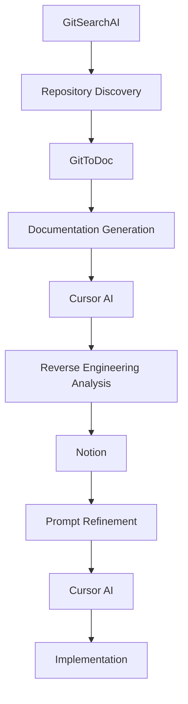
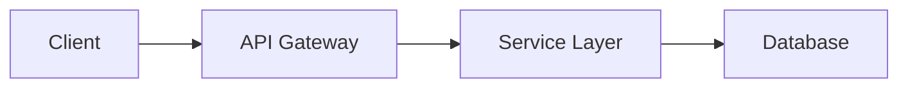

## مقدمة

الهندسة العكسية هي ممارسة تحليل نظام أو منتج قائم بهدف فهم بنيته ومبادئ عمله، وأحيانًا إعادة إنتاجه. في مجال تطوير البرمجيات، استُخدمت الهندسة العكسية لأغراض متعددة، منها فهم الأكواد القديمة، وتحليل المنافسين، واكتشاف الثغرات الأمنية.

يشهد عالم الهندسة العكسية اليوم تحولات جذرية مدفوعة بتطور أدوات الذكاء الاصطناعي. تستعرض هذه المقالة مسيرة تطور الهندسة العكسية عبر أبرز النماذج في كل حقبة، وتقدم المنهجيات الحديثة القائمة على الذكاء الاصطناعي.

## تاريخ الهندسة العكسية عبر الحقب

### السبعينيات والثمانينيات: حقبة نسخ الأجهزة

**ميلاد أجهزة متوافقة مع IBM PC**

في مطلع الثمانينيات، حين سيطرت IBM على سوق الحواسيب الشخصية، عمدت شركات كثيرة إلى تطبيق الهندسة العكسية على IBM PC لصنع أجهزة متوافقة معها.

- **Compaq Portable (1983)**: أول جهاز يحقق توافقًا كاملًا مع IBM PC ويحقق نجاحًا تجاريًا
- **Phoenix BIOS**: نموذج رائد في الهندسة العكسية لنظام BIOS الخاص بـ IBM دون تبعات قانونية
- **تصميم الغرفة النظيفة (Clean-room design)**: الفصل بين الفريق الذي درس الكود الأصلي والفريق الذي نفّذ التطبيق، تجنبًا لانتهاك حقوق الطبع والنشر

```bash
# مراحل الهندسة العكسية في تلك الحقبة
1. تحليل إشارات الأجهزة
2. فك تجميع كود التجميع (Assembly)
3. تحليل الوحدات الوظيفية
4. إعادة التنفيذ في الغرفة النظيفة
```

### التسعينيات: العصر الذهبي لعكس البرمجيات

**مشروع Samba (1992)**

مشروع رائد قام بتطبيق الهندسة العكسية على بروتوكول SMB/CIFS الخاص بـ Microsoft، ليتيح مشاركة ملفات Windows على أنظمة Unix/Linux.

- **تحليل حزم الشبكة الملتقطة**
- **توثيق البروتوكول**
- **تطوير تطبيق مفتوح المصدر**

**مشروع Wine (1993)**

مشروع طبّق الهندسة العكسية على واجهة برمجة تطبيقات Windows API ليتيح تشغيل تطبيقات Windows على Linux.

```c
// مثال على إعادة تطبيق Windows API في Wine
HWND WINAPI CreateWindowExW(DWORD dwExStyle, LPCWSTR lpClassName,
                           LPCWSTR lpWindowName, DWORD dwStyle,
                           int X, int Y, int nWidth, int nHeight,
                           HWND hWndParent, HMENU hMenu,
                           HINSTANCE hInstance, LPVOID lpParam)
{
    // يحوّل سلوك Windows API إلى Linux/X11
    return create_window_internal(/* ... */);
}
```

### العقد الأول من الألفية الثالثة: عكس بروتوكولات الويب والشبكات

**مشروع Pidgin/Gaim**

طبّق الهندسة العكسية على بروتوكولات المراسلة الفورية المتعددة (AIM, MSN, Yahoo, ICQ) لتطوير عميل مراسلة موحد.

- **تحليل حركة مرور الشبكة**
- **فك تشفير البروتوكولات المشفّرة**
- **بنية دعم متعددة البروتوكولات**

**بدائل مشغّل Flash**

ظهرت مشاريع مفتوحة المصدر عدة طبّقت الهندسة العكسية على تنسيق SWF الخاص بـ Adobe Flash.

### العقد الثاني من الألفية الثالثة: حقبة المحمول والحوسبة السحابية

**نظم Android المخصصة (Custom ROMs)**

- **CyanogenMod/LineageOS**: تطبيق الهندسة العكسية على كود مصدر Android والمشغّلات الثنائية
- **أدوات الـ Rooting**: تقنيات تجاوز آليات الأمان للمصنّعين

**عكس واجهات برمجة التطبيقات (API Reversing)**

```python
# مثال على تطبيق الهندسة العكسية على REST API
import requests
import json

# اكتشاف نقاط نهاية API من خلال التقاط حركة الشبكة
def reverse_engineer_api():
    # 1. تحليل طلبات الشبكة باستخدام أدوات مطوّر المتصفح
    # 2. فهم بنية الترويسات والحمولة
    # 3. فهم آليات المصادقة
    headers = {
        'Authorization': 'Bearer token_discovered',
        'Content-Type': 'application/json'
    }
    
    response = requests.get('https://api.example.com/v1/data', headers=headers)
    return response.json()
```

## منهجيات الهندسة العكسية الحديثة القائمة على الذكاء الاصطناعي

### نموذج جديد: علم آثار البرمجيات بالذكاء الاصطناعي

تتحوّل عملية الهندسة العكسية التقليدية اليدوية المستهلكة للوقت بفعل أدوات الذكاء الاصطناعي تحولًا جذريًا.

### سير عمل الهندسة العكسية الحديثة



#### الخطوة الأولى: GitSearchAI - اكتشاف المستودعات

**[GitSearchAI](http://gitsearchai.com)** أداة تتيح البحث في المستودعات الهائلة على GitHub بالذكاء الاصطناعي.

```bash
# الأسلوب التقليدي
git clone https://github.com/target/repo
find . -name "*.py" | xargs grep -l "specific_function"

# الأسلوب القائم على الذكاء الاصطناعي
# البحث في GitSearchAI بلغة طبيعية
# "authentication middleware implementation in Python Flask"
```

**حالات الاستخدام:**

- البحث عن أنماط تطبيق ميزات محددة
- اكتشاف مشاريع ذات بنية مماثلة
- البحث في أفضل ممارسات تطبيق الأمان

#### الخطوة الثانية: GitToDoc - التوليد التلقائي للوثائق

**[GitToDoc](http://gittodoc.com)** يحلّل المستودع ويولّد الوثائق تلقائيًا.

```markdown
# الأسلوب التقليدي: التحليل اليدوي
1. قراءة README.md
2. فهم بنية الكود
3. تحليل التبعيات
4. إيجاد وثائق API

# الأسلوب بالذكاء الاصطناعي: توليد الوثائق تلقائيًا
- ملخص البنية الكاملة لقاعدة الكود
- شرح الدوال والكلاسات الرئيسية
- مخططات تدفق البيانات
- قائمة نقاط نهاية API
```

#### الخطوة الثالثة: Cursor - تحليل الكود بالذكاء الاصطناعي

مثال على نموذج طلب الهندسة العكسية باستخدام **Cursor AI**:

```markdown
# نموذج تحليل الهندسة العكسية
حلّل قاعدة الكود هذه وحدّد ما يلي:

1. **أنماط البنية المعمارية**: أنماط التصميم والأساليب المعمارية المستخدمة
2. **تدفق البيانات**: كيفية معالجة البيانات وتنقّلها
3. **الخوارزميات الأساسية**: طريقة تطبيق منطق الأعمال الرئيسي
4. **آليات الأمان**: تطبيق المصادقة والتفويض والتشفير
5. **تحسينات الأداء**: التخزين المؤقت، وتحسين استعلامات قاعدة البيانات، وغيرها

يرجى شرح آلية عمل [specific_component] بالتفصيل.
```

#### الخطوة الرابعة: Notion - تحسين النماذج

تنظيم نتائج التحليل في Notion وتحسين النماذج لإجراء تحليل إضافي.

```markdown
# قالب Notion: نتائج تحليل الهندسة العكسية

## نظرة عامة على المشروع
- **اسم المشروع**: 
- **المكدس التقني الرئيسي**: 
- **البنية المعمارية**: 

## النتائج الرئيسية
### أنماط البنية المعمارية
- [ ] MVC
- [ ] MVP  
- [ ] MVVM
- [ ] Clean Architecture

### تدفق البيانات


## خطة التطبيق

### المرحلة الأولى: إعادة تطبيق الميزات الأساسية

- [ ] نظام المصادقة
- [ ] نموذج البيانات
- [ ] نقاط نهاية API

### المرحلة الثانية: التحسين والتوسع

- [ ] تحسين الأداء
- [ ] تعزيز الأمان
- [ ] رفع تغطية الاختبارات

```

#### الخطوة الخامسة: Cursor - التنفيذ والتطبيق

المضيّ في التطبيق الفعلي باستخدام النماذج المحسَّنة.

```python
# مثال على تطبيق نتائج الهندسة العكسية المُولَّدة بـ Cursor AI
class ReversedAuthSystem:
    """
    إعادة تطبيق بناءً على تحليل آلية المصادقة في النظام الأصلي
    
    الأنماط المكتشفة:
    - مصادقة قائمة على رمز JWT
    - تدوير رمز التحديث (Refresh token rotation)
    - نظام صلاحيات RBAC
    """
    
    def __init__(self, secret_key: str):
        self.secret_key = secret_key
        self.token_blacklist = set()
    
    def authenticate(self, credentials: dict) -> dict:
        """إعادة إنتاج تدفق المصادقة ذاته الموجود في النظام الأصلي"""
        # تطبيق مبني على الخوارزمية المحللة
        pass
    
    def authorize(self, token: str, resource: str) -> bool:
        """إعادة تطبيق منطق التحقق من الصلاحيات"""
        # منطق RBAC المحدَّد عبر الهندسة العكسية
        pass
```

### مزايا الهندسة العكسية في عصر الذكاء الاصطناعي

#### 1. السرعة والكفاءة

- **سابقًا**: أسابيع إلى أشهر من وقت التحليل
- **الآن**: اختُزل إلى ساعات أو أيام

#### 2. تحسُّن الدقة

- يحلّل الذكاء الاصطناعي الأنماط دون أن يفوته شيء
- تقليص أخطاء الإنسان وتحيّزاته

#### 3. التوثيق التلقائي

- توثيق عملية التحليل ونتائجه بصورة تلقائية
- تيسير تبادل المعرفة بين الفرق

#### 4. عملية قابلة للتكرار

- سير عمل موحّد وقياسي
- جودة متسقة لنتائج التحليل

## تطبيقات عملية

### دراسة حالة 1: تحديث الأنظمة القديمة

```bash
# تحديث نظام COBOL قديم إلى Python
1. البحث في GitSearchAI عن حالات تحديث مماثلة
2. توثيق الكود القديم باستخدام GitToDoc
3. تحليل منطق الأعمال مع Cursor
4. وضع خطة الهجرة في Notion
5. توليد كود Python مع Cursor
```

### دراسة حالة 2: تطوير مكتبة عميل API

```python
# تطوير SDK لواجهة برمجة تطبيقات طرف ثالث
# 1. استطلاع أنماط SDK الموجودة في GitSearchAI
# 2. توليد وثائق API تلقائيًا مع GitToDoc
# 3. تحليل كود العميل وتوليده مع Cursor

class ThirdPartyAPIClient:
    """عميل API مطوَّر عبر الهندسة العكسية"""
    
    def __init__(self, api_key: str, base_url: str):
        self.api_key = api_key
        self.base_url = base_url
        self.session = self._create_session()
    
    def _create_session(self):
        """إنشاء جلسة مبنية على أنماط المصادقة المحلَّلة"""
        # تطبيق أنماط الترويسات المحلَّلة بالذكاء الاصطناعي
        pass
```

## الاعتبارات الأخلاقية

### الهندسة العكسية المشروعة

- **قابلية التشغيل البيني**: ضمان التوافق بين الأنظمة
- **التدقيق الأمني**: اكتشاف الثغرات وإصلاحها
- **الأغراض التعليمية**: التعلم والبحث العلمي

### اعتبارات جوهرية

- **احترام حقوق الطبع والنشر**: تطبيق تصميم الغرفة النظيفة
- **الامتثال للتراخيص**: التحقق من تراخيص المصدر المفتوح
- **تجنب انتهاك براءات الاختراع**: البحث في براءات الاختراع أمر ضروري

## آفاق المستقبل

### تطور الأدوات القائمة على الذكاء الاصطناعي

```python
# أدوات الهندسة العكسية المتوقعة في المستقبل
class FutureReverseEngineer:
    def __init__(self):
        self.llm = "GPT-6"  # نماذج لغوية أكثر قدرة
        self.code_analyzer = MultiModalAnalyzer()  # تحليل متكامل للكود والوثائق ونتائج التنفيذ
        self.pattern_db = GlobalPatternDatabase()  # قاعدة بيانات الأنماط العالمية
    
    def analyze_system(self, target):
        """تحليل النظام بالكامل بصورة آلية"""
        # 1. اكتشاف الكود وجمعه تلقائيًا
        # 2. تحليل متعدد الوسائط (الكود والوثائق وسجلات التنفيذ)
        # 3. مطابقة الأنماط وتحليل التشابه
        # 4. إعادة التطبيق والاختبار تلقائيًا
        pass
```

### تحديات وفرص جديدة

- **التحليل الفوري**: تحليل الأنظمة الحية
- **تعزيز الأمان**: ديناميكيات الذكاء الاصطناعي مقابل الذكاء الاصطناعي
- **توسيع الأتمتة**: هندسة عكسية مؤتمتة بالكامل

## خلاصة

تطورت الهندسة العكسية تطورًا مستمرًا، بدءًا من نسخ الأجهزة، مرورًا بتحليل البرمجيات، وصولًا إلى الأتمتة القائمة على الذكاء الاصطناعي في عصرنا الحالي.

مجموعة أدوات الذكاء الاصطناعي الحديثة:

- **GitSearchAI** - اكتشاف المستودعات
- **GitToDoc** - أتمتة التوثيق
- **Cursor** - تحليل الكود وتوليده
- **Notion** - إدارة العمليات

يتيح سير العمل هذا للمطورين فهم الأنظمة القائمة وتطويرها بسرعة أكبر ودقة أعلى. غير أنه مع تقدم التكنولوجيا، ينبغي مراعاة المسؤولية الأخلاقية جنبًا إلى جنب مع التقدم التقني.

مع استمرار تطور تقنيات الذكاء الاصطناعي، يُتوقع أن تصبح الهندسة العكسية أكثر دقة وأتمتة، مما سيُحدث تحولًا جذريًا في مجال تطوير البرمجيات بأسره.

---

*إذا وجدت هذه المقالة مفيدة، يسعدنا زيارتك لـ [ThakiCloud](https://thakicloud.github.io) للاطلاع على المزيد من المحتوى في مجالي الذكاء الاصطناعي والتطوير.*
